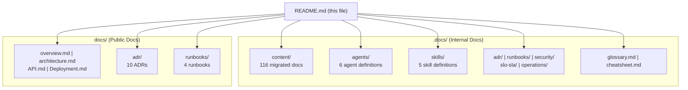

# ScholarForm AI — Documentation Portal

## Quick Navigation

| Area | Description | Path |
|------|-------------|------|
| **Getting Started** | Setup, prerequisites, first run | [content/Getting Started.md](content/Getting Started.md) |
| **Architecture** | System layers, data flow, middleware, request flows | [content/Architecture Overview/](content/Architecture Overview/) |
| **Backend** | FastAPI structure, services, DB, auth, real-time | [content/Backend Development/](content/Backend Development/) |
| **Frontend** | Next.js, components, state, real-time features | [content/Frontend Development/](content/Frontend Development/) |
| **Pipeline** | Orchestrator, extraction, formatting, export | [content/Pipeline Processing/](content/Pipeline Processing/) |
| **AI/ML** | NVIDIA NIM, Groq, Ollama, RAG, SciBERT | [content/AI_ML Integration/](content/AI_ML Integration/) |
| **Template System** | Architecture, creation, rendering, CSL | [content/Template System/](content/Template System/) |
| **API Reference** | Endpoints for documents, templates, real-time | [content/API Reference/](content/API Reference/) |
| **Database** | Schema, entities, ORM, migrations | [content/Database Design/](content/Database Design/) |
| **Testing** | Strategy, backend/frontend/manual testing | [content/Testing Strategy/](content/Testing Strategy/) |
| **Deployment** | CI/CD, infrastructure, monitoring, security ops | [content/Deployment & Operations/](content/Deployment & Operations/) |

## Enterprise Sections

| Section | Description | Path |
|---------|-------------|------|
| **Architecture Decision Records** | Immutable ADRs for key technical decisions | [adr/](adr/) |
| **Operations Runbooks** | Incident response, rollback, branch protection | [runbooks/](runbooks/) |
| **Security & Compliance** | Security model, threat model, compliance | [security/](security/) |
| **SLOs & SLAs** | Service level objectives and API contracts | [slo-sla/](slo-sla/) |
| **Operations** | Disaster recovery, monitoring, performance | [operations/](operations/) |
| **Agents** | OpenCode agent definitions | [agents/](agents/) |
| **Skills** | OpenCode skill definitions | [skills/](skills/) |
| **Glossary** | Terminology reference | [glossary.md](glossary.md) |
| **Cheatsheet** | Quick reference for common commands | [cheatsheet.md](cheatsheet.md) |

## Documentation Structure

## Standards

All docs follow the [ScholarForm AI Documentation Style Guide](../docs/.docs-style-guide.md).

## See Also

- [Project Overview](../docs/overview.md)
- [Quickstart Guide](../docs/quickstart.md)
- [Contributing Guidelines](../CONTRIBUTING.md)
