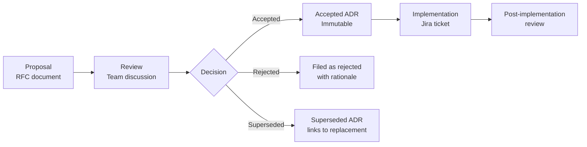

# Architecture Decision Records

ADRs are immutable — once accepted they are never modified. Superseded ADRs link to their replacement.

## ADR Lifecycle

## Index

| ID | Title | Status | Date |
|----|-------|--------|------|
| 001 | [Python-First Runtime](../docs/adr/001-python-first-runtime.md) | ✅ Accepted | 2026-03 |
| 002 | [Redis Realtime Backbone](../docs/adr/002-redis-realtime-backbone.md) | ✅ Accepted | 2026-03 |
| 003 | [API Versioning Strategy](../docs/adr/003-api-versioning-strategy.md) | ✅ Accepted | 2026-03 |
| 004 | [FastAPI-Only Gateway](../docs/adr/004-fastapi-only-gateway.md) | ✅ Accepted | 2026-03 |
| 005 | [ChromaDB RAG Storage](../docs/adr/005-chromadb-rag-storage.md) | ✅ Accepted | 2026-03 |
| 006 | [Celery Background Tasks](../docs/adr/006-celery-background-tasks.md) | ✅ Accepted | 2026-03 |
| 007 | [Render Deployment Platform](../docs/adr/007-render-deployment-platform.md) | ✅ Accepted | 2026-03 |
| 008 | [LiteLLM LLM Routing](../docs/adr/008-litellm-llm-routing.md) | ✅ Accepted | 2026-03 |
| 009 | [Template Contract System](../docs/adr/009-template-contract-system.md) | ✅ Accepted | 2026-03 |
| 010 | [Next.js App Router](../docs/adr/010-nextjs-app-router.md) | ✅ Accepted | 2026-03 |

Full ADR content is maintained in `docs/adr/`. This index provides discovery from `.docs/`.

## See Also

- [Architecture Overview](content/Architecture Overview/Architecture Overview.md)
- [Technology Stack](content/Architecture Overview/Technology Stack.md)
