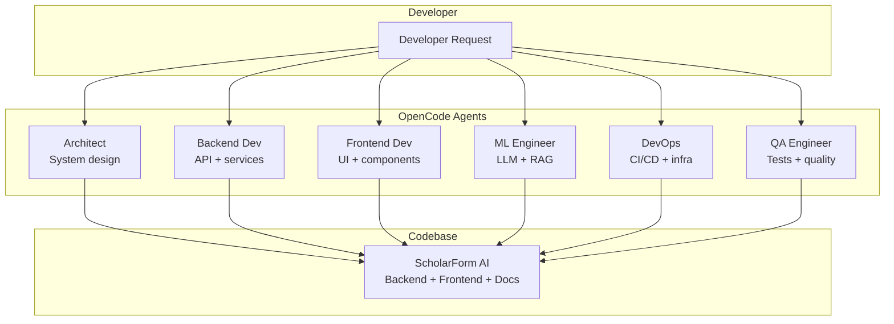

# OpenCode Agents

This directory defines specialized AI agent personas for OpenCode-assisted ScholarForm AI development. Each agent has a distinct role, expertise area, and toolset.

## Available Agents

| Agent | Role | Expertise |
|-------|------|-----------|
| [Architect](architect.md) | System Architect | Architecture decisions, data flow, pipeline design |
| [Backend Dev](backend-dev.md) | Python/FastAPI Developer | API routes, services, DB, Celery, middleware |
| [Frontend Dev](frontend-dev.md) | Next.js/React Developer | Components, state, real-time features, styling |
| [ML Engineer](ml-engineer.md) | AI/ML Engineer | LLM integration, RAG, SciBERT, model management |
| [DevOps](devops.md) | DevOps Engineer | CI/CD, Docker, Render, monitoring, security |
| [QA](qa.md) | QA Engineer | Testing strategy, Playwright, pytest, contract tests |

## Agent Interaction Model



## Agent Format

```yaml
name: Agent Name
role: Role description
model: Preferred model
instructions: |
  System prompt defining behavior, constraints, and preferences.
capabilities:
  - Capability description
```

## See Also

- [Skills](../skills/README.md) — Companion skill definitions
- [Architecture Overview](content/Architecture Overview/Architecture Overview.md)
