# AI/ML Integration

<cite>
**Referenced Files in This Document**
- [nvidia_client.py](file://backend/app/services/nvidia_client.py)
- [llm_service.py](file://backend/app/services/llm_service.py)
- [scibert_gate.py](file://backend/app/services/scibert_gate.py)
- [vllm_adoption.py](file://backend/app/services/vllm_adoption.py)
- [rag_engine.py](file://backend/app/pipeline/intelligence/rag_engine.py)
- [reasoning_engine.py](file://backend/app/pipeline/intelligence/reasoning_engine.py)
- [semantic_parser.py](file://backend/app/pipeline/intelligence/semantic_parser.py)
- [classifier.py](file://backend/app/pipeline/classification/classifier.py)
- [test_scibert_benchmark.py](file://backend/tests/test_scibert_benchmark.py)
- [test_scibert_gate.py](file://backend/tests/test_scibert_gate.py)
- [test_vllm_adoption.py](file://backend/tests/test_vllm_adoption.py)
- [test_rag_engine.py](file://backend/tests/test_rag_engine.py)
- [test_reasoning_engine.py](file://backend/tests/test_reasoning_engine.py)
- [test_nvidia_client.py](file://backend/tests/test_nvidia_client.py)
</cite>

## Update Summary
**Changes Made**
- Added new SciBERT classification gating system with automated benchmark-based activation
- Integrated vLLM adoption tracking for Phase 4 rollout planning
- Enhanced LLM service with improved model management, health checking, and caching capabilities
- Updated model selection logic to incorporate automated gating for SciBERT classification
- Added comprehensive monitoring and reporting for AI/ML infrastructure

## Table of Contents
1. [Introduction](#introduction)
2. [Project Structure](#project-structure)
3. [Core Components](#core-components)
4. [Architecture Overview](#architecture-overview)
5. [Detailed Component Analysis](#detailed-component-analysis)
6. [Dependency Analysis](#dependency-analysis)
7. [Performance Considerations](#performance-considerations)
8. [Troubleshooting Guide](#troubleshooting-guide)
9. [Conclusion](#conclusion)
10. [Appendices](#appendices)

## Introduction
This document explains the AI/ML integration across the system, focusing on:
- NVIDIA NIM integration with LiteLLM fallback
- Local Ollama deployment for reasoning
- SciBERT-based semantic classification with automated gating
- Retrieval-Augmented Generation (RAG) with resilient embedding fallbacks
- Reasoning engine orchestration with circuit breakers and rule-based fallbacks
- Model management, caching, and persistence
- vLLM adoption tracking for Phase 4 rollout planning
- Configuration, cost optimization, and monitoring
- Versioning, troubleshooting, and operational guidance

## Project Structure
The AI/ML stack spans services, pipeline intelligence, and classification layers:
- Services: NVIDIA client, unified LLM service, model store, SciBERT gate, vLLM adoption tracker
- Intelligence: RAG engine, reasoning engine, semantic parser
- Classification: Content classifier integrating semantic parsing
- Tests: Benchmarks and integration tests for each component

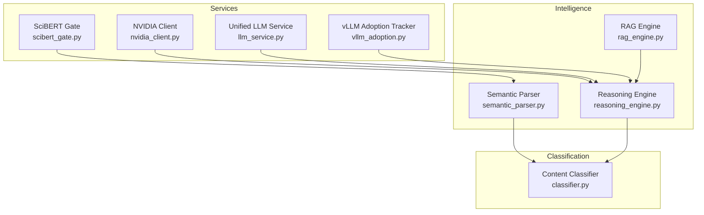

**Diagram sources**
- [nvidia_client.py](file://backend/app/services/nvidia_client.py)
- [llm_service.py](file://backend/app/services/llm_service.py)
- [scibert_gate.py](file://backend/app/services/scibert_gate.py)
- [vllm_adoption.py](file://backend/app/services/vllm_adoption.py)
- [rag_engine.py](file://backend/app/pipeline/intelligence/rag_engine.py)
- [reasoning_engine.py](file://backend/app/pipeline/intelligence/reasoning_engine.py)
- [semantic_parser.py](file://backend/app/pipeline/intelligence/semantic_parser.py)
- [classifier.py](file://backend/app/pipeline/classification/classifier.py)

**Section sources**
- [nvidia_client.py](file://backend/app/services/nvidia_client.py)
- [llm_service.py](file://backend/app/services/llm_service.py)
- [scibert_gate.py](file://backend/app/services/scibert_gate.py)
- [vllm_adoption.py](file://backend/app/services/vllm_adoption.py)
- [rag_engine.py](file://backend/app/pipeline/intelligence/rag_engine.py)
- [reasoning_engine.py](file://backend/app/pipeline/intelligence/reasoning_engine.py)
- [semantic_parser.py](file://backend/app/pipeline/intelligence/semantic_parser.py)
- [classifier.py](file://backend/app/pipeline/classification/classifier.py)

## Core Components
- NVIDIA NIM client with LiteLLM-backed generation and OpenAI-compatible fallback
- Unified LLM service for provider-agnostic model invocation with enhanced health checking and caching
- SciBERT classification gating system with automated benchmark-based activation
- vLLM adoption tracking for Phase 4 rollout planning with traffic-based activation
- RAG engine with BGE embeddings, ChromaDB, and deterministic fallback
- Reasoning engine with multi-tier LLM selection, retry guards, circuit breakers, and rule-based fallback
- Semantic parser with SciBERT and heuristic fallback, integrated with automated gating
- Content classifier integrating structure detection and semantic parsing

**Section sources**
- [nvidia_client.py](file://backend/app/services/nvidia_client.py)
- [llm_service.py](file://backend/app/services/llm_service.py)
- [scibert_gate.py](file://backend/app/services/scibert_gate.py)
- [vllm_adoption.py](file://backend/app/services/vllm_adoption.py)
- [rag_engine.py](file://backend/app/pipeline/intelligence/rag_engine.py)
- [reasoning_engine.py](file://backend/app/pipeline/intelligence/reasoning_engine.py)
- [semantic_parser.py](file://backend/app/pipeline/intelligence/semantic_parser.py)
- [classifier.py](file://backend/app/pipeline/classification/classifier.py)

## Architecture Overview
The AI/ML pipeline orchestrates structured reasoning and classification with automated model selection:
- Input blocks are analyzed by the semantic parser with SciBERT gating (automatically enabled/disabled based on benchmark results)
- The reasoning engine selects the best model tier (NVIDIA → Ollama → Rule-based) and generates instruction sets
- The RAG engine retrieves publisher-specific guidelines for contextual grounding
- The content classifier assigns semantic block types using structure and NLP signals
- vLLM adoption tracking monitors traffic metrics to determine Phase 4 rollout readiness

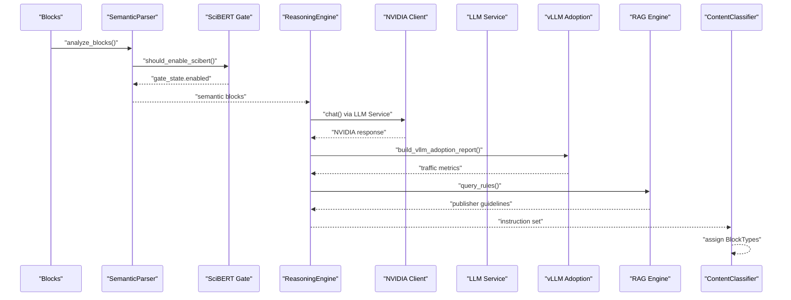

**Diagram sources**
- [semantic_parser.py](file://backend/app/pipeline/intelligence/semantic_parser.py)
- [scibert_gate.py](file://backend/app/services/scibert_gate.py)
- [reasoning_engine.py](file://backend/app/pipeline/intelligence/reasoning_engine.py)
- [nvidia_client.py](file://backend/app/services/nvidia_client.py)
- [llm_service.py](file://backend/app/services/llm_service.py)
- [vllm_adoption.py](file://backend/app/services/vllm_adoption.py)
- [rag_engine.py](file://backend/app/pipeline/intelligence/rag_engine.py)
- [classifier.py](file://backend/app/pipeline/classification/classifier.py)

## Detailed Component Analysis

### NVIDIA NIM Integration
- Provides chat completions with model routing to NVIDIA NIM
- Uses LiteLLM-backed generation when available; falls back to direct OpenAI-compatible client
- Exposes higher-level helpers for document structure analysis, figure analysis, and template compliance checks
- Graceful degradation when API key is missing

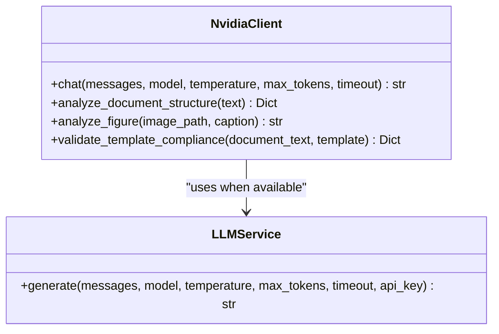

**Diagram sources**
- [nvidia_client.py](file://backend/app/services/nvidia_client.py)
- [llm_service.py](file://backend/app/services/llm_service.py)

**Section sources**
- [nvidia_client.py](file://backend/app/services/nvidia_client.py)
- [llm_service.py](file://backend/app/services/llm_service.py)

### Enhanced LLM Service with Model Management and Health Checking
- Unified provider-agnostic interface with LiteLLM integration
- Enhanced health checking capabilities for all providers
- Advanced caching with Redis integration and cache invalidation
- Circuit breaker implementation for provider resilience
- Input sanitization and prompt injection prevention
- Comprehensive metrics collection and monitoring

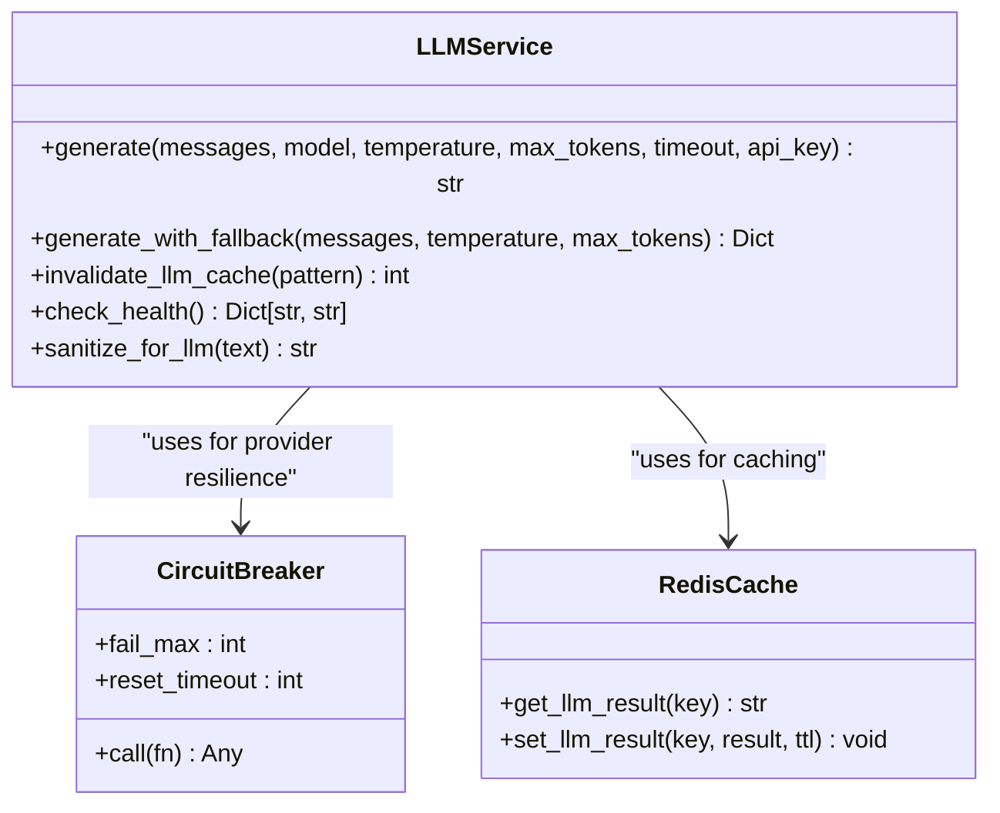

**Diagram sources**
- [llm_service.py](file://backend/app/services/llm_service.py)

**Section sources**
- [llm_service.py](file://backend/app/services/llm_service.py)

### SciBERT Classification Gating System
- Automated benchmark-based activation/deactivation of SciBERT classification
- Persistent state management with configurable thresholds
- Manual override support for development and testing
- Integration with semantic parser for conditional model loading
- Comprehensive benchmark result persistence and validation

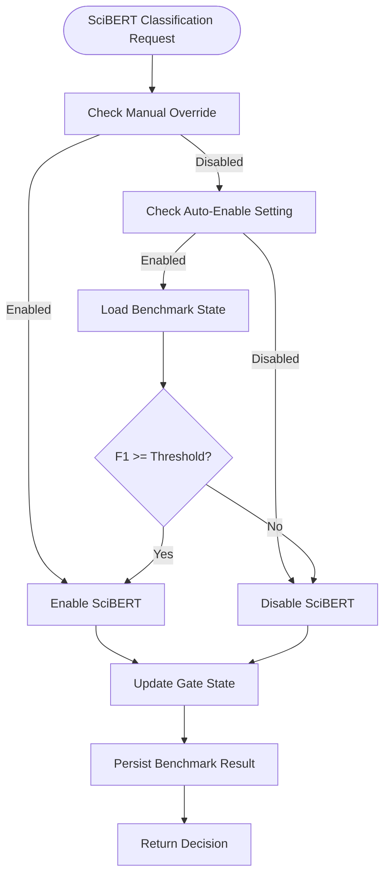

**Diagram sources**
- [scibert_gate.py](file://backend/app/services/scibert_gate.py)

**Section sources**
- [scibert_gate.py](file://backend/app/services/scibert_gate.py)
- [test_scibert_gate.py](file://backend/tests/test_scibert_gate.py)

### vLLM Adoption Tracking for Phase 4 Rollout
- Traffic-based activation criteria for vLLM adoption
- Comprehensive metrics tracking for requests and token consumption
- Automated rollout readiness assessment
- Structured Phase 4 implementation plan with shadow traffic
- Real-time evaluation and reporting capabilities

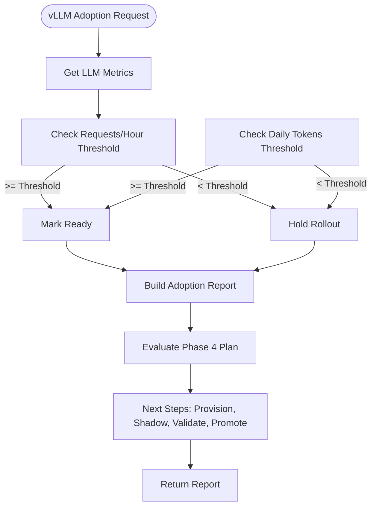

**Diagram sources**
- [vllm_adoption.py](file://backend/app/services/vllm_adoption.py)

**Section sources**
- [vllm_adoption.py](file://backend/app/services/vllm_adoption.py)
- [test_vllm_adoption.py](file://backend/tests/test_vllm_adoption.py)

### Local Ollama Deployment and Fallback
- The reasoning engine optionally initializes a local Ollama client and health-checks model availability
- Falls back to rule-based classification when Ollama is unreachable
- Integrates with the unified LLM service when available
- Enhanced health checking with automatic model discovery and selection

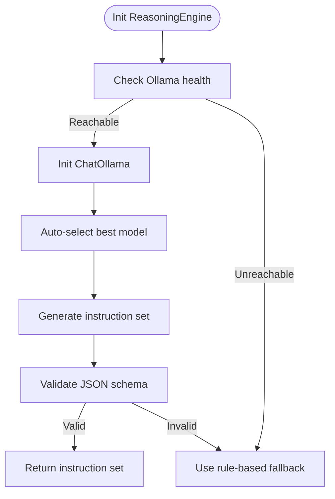

**Diagram sources**
- [reasoning_engine.py](file://backend/app/pipeline/intelligence/reasoning_engine.py)

**Section sources**
- [reasoning_engine.py](file://backend/app/pipeline/intelligence/reasoning_engine.py)

### Enhanced SciBERT Classification with Automated Gating
- Loads SciBERT tokenizer and model lazily, reusing global model store when available
- Supports batch inference and heuristic fallback for non-English or unavailable models
- Boundary repair for fragmented headings
- Automated gating based on benchmark results and manual overrides
- Language detection for non-English content handling

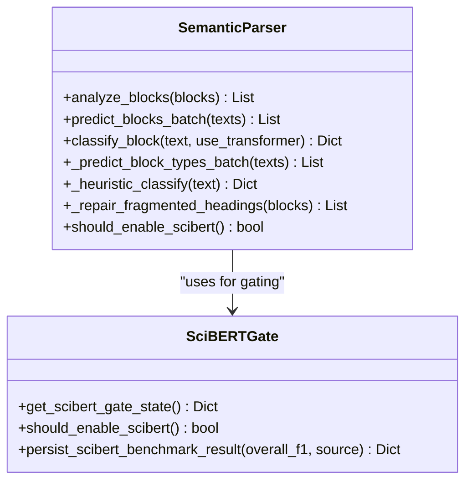

**Diagram sources**
- [semantic_parser.py](file://backend/app/pipeline/intelligence/semantic_parser.py)
- [scibert_gate.py](file://backend/app/services/scibert_gate.py)

**Section sources**
- [semantic_parser.py](file://backend/app/pipeline/intelligence/semantic_parser.py)
- [scibert_gate.py](file://backend/app/services/scibert_gate.py)
- [test_scibert_benchmark.py](file://backend/tests/test_scibert_benchmark.py)

### RAG Engine Implementation
- Embedding models: BGE-M3 (primary), BGE-small (fallback), deterministic hash-based fallback
- Backend: ChromaDB with native JSON fallback for compatibility
- Auto-seeding from default guidelines when knowledge base is empty
- Query-time cosine similarity on native store when embeddings fail

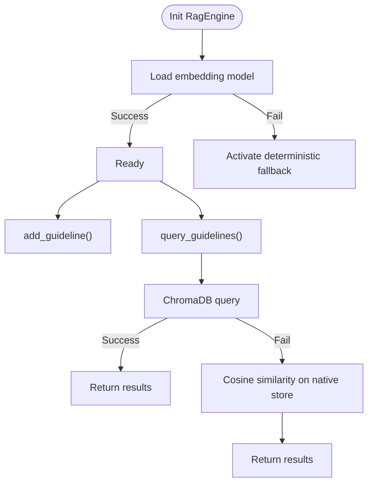

**Diagram sources**
- [rag_engine.py](file://backend/app/pipeline/intelligence/rag_engine.py)

**Section sources**
- [rag_engine.py](file://backend/app/pipeline/intelligence/rag_engine.py)
- [test_rag_engine.py](file://backend/tests/test_rag_engine.py)

### Reasoning Engine Orchestration
- Multi-tier model selection: NVIDIA (primary) → Ollama (fallback) → Rule-based (final)
- Enhanced with vLLM adoption tracking for Phase 4 rollout planning
- Retry guards, circuit breakers, and JSON schema validation
- Normalizes instruction payloads and records metrics
- Automatic model discovery and selection for Ollama fallback

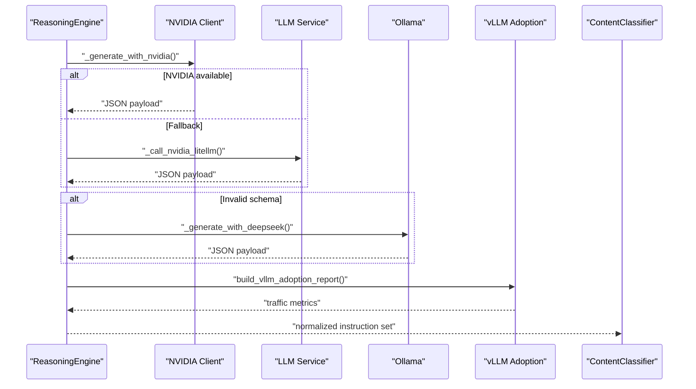

**Diagram sources**
- [reasoning_engine.py](file://backend/app/pipeline/intelligence/reasoning_engine.py)
- [vllm_adoption.py](file://backend/app/services/vllm_adoption.py)

**Section sources**
- [reasoning_engine.py](file://backend/app/pipeline/intelligence/reasoning_engine.py)
- [test_reasoning_engine.py](file://backend/tests/test_reasoning_engine.py)

### Content Classifier Integration
- Applies structure-based classification with GROBID metadata hints
- Integrates SciBERT predictions when enabled and confident via automated gating
- Applies regex and NLP confidence heuristics for UNKNOWN blocks
- Language-aware classification with non-English content fallback

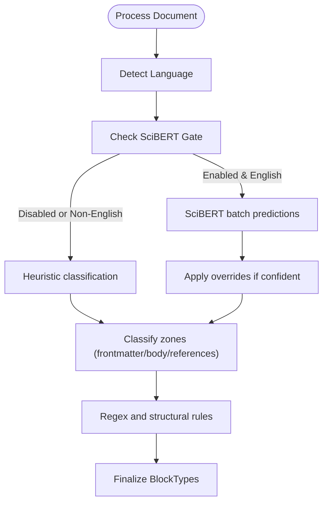

**Diagram sources**
- [classifier.py](file://backend/app/pipeline/classification/classifier.py)
- [semantic_parser.py](file://backend/app/pipeline/intelligence/semantic_parser.py)
- [scibert_gate.py](file://backend/app/services/scibert_gate.py)

**Section sources**
- [classifier.py](file://backend/app/pipeline/classification/classifier.py)
- [semantic_parser.py](file://backend/app/pipeline/intelligence/semantic_parser.py)
- [scibert_gate.py](file://backend/app/services/scibert_gate.py)

## Dependency Analysis
Key dependencies and relationships:
- ReasoningEngine depends on NVIDIA client and LLM service; also integrates with RAG engine and vLLM adoption tracker
- SemanticParser depends on SciBERT gate and ModelStore; used by ContentClassifier
- SciBERT gate manages persistent state and integrates with semantic parser
- vLLM adoption tracker monitors traffic metrics for Phase 4 rollout planning
- RAG engine depends on ChromaDB and a native JSON store; loads embedding models with fallbacks
- Tests validate end-to-end behavior and benchmarks for SciBERT and vLLM adoption

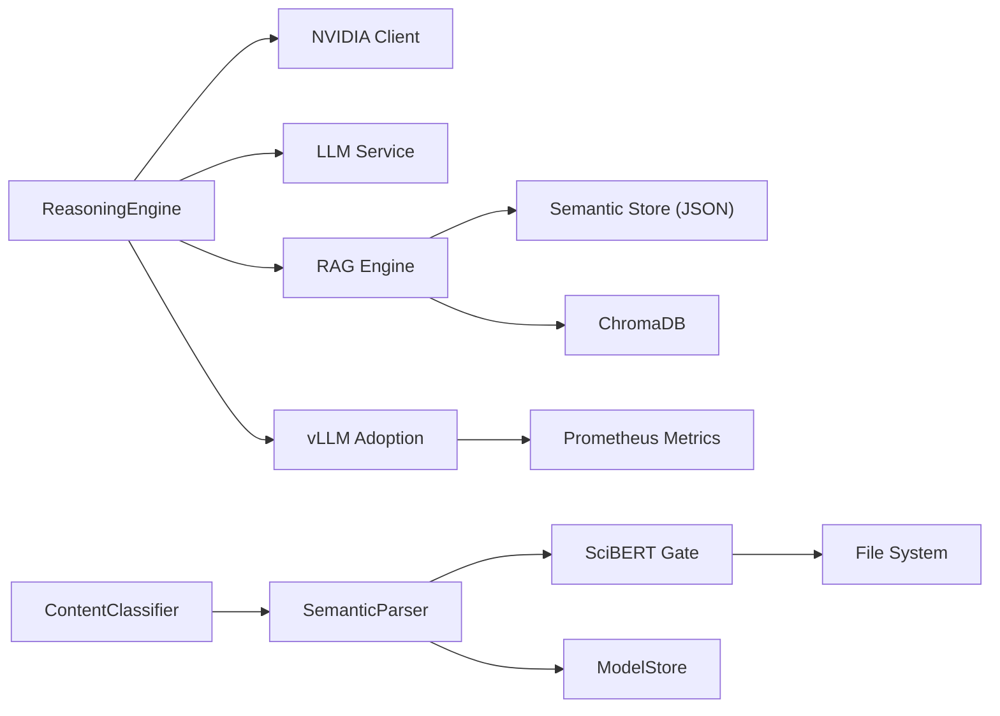

**Diagram sources**
- [reasoning_engine.py](file://backend/app/pipeline/intelligence/reasoning_engine.py)
- [nvidia_client.py](file://backend/app/services/nvidia_client.py)
- [llm_service.py](file://backend/app/services/llm_service.py)
- [semantic_parser.py](file://backend/app/pipeline/intelligence/semantic_parser.py)
- [scibert_gate.py](file://backend/app/services/scibert_gate.py)
- [vllm_adoption.py](file://backend/app/services/vllm_adoption.py)
- [rag_engine.py](file://backend/app/pipeline/intelligence/rag_engine.py)

**Section sources**
- [reasoning_engine.py](file://backend/app/pipeline/intelligence/reasoning_engine.py)
- [semantic_parser.py](file://backend/app/pipeline/intelligence/semantic_parser.py)
- [scibert_gate.py](file://backend/app/services/scibert_gate.py)
- [vllm_adoption.py](file://backend/app/services/vllm_adoption.py)
- [rag_engine.py](file://backend/app/pipeline/intelligence/rag_engine.py)

## Performance Considerations
- Embedding model loading and reuse: Prefer global ModelStore to avoid repeated warm-up
- Batch processing: ReasoningEngine batches blocks to reduce overhead
- LiteLLM integration: Centralized provider routing reduces latency and simplifies fallbacks
- Enhanced caching: LLM service now includes Redis caching with cache invalidation
- Deterministic fallback: Ensures minimal performance impact when transformers are unavailable
- Native store: Cosine similarity fallback avoids heavy model calls when ChromaDB is down
- Retry and circuit breaker: Prevent cascading failures and protect downstream consumers
- SciBERT gating: Automated benchmark-based activation prevents unnecessary model loading
- vLLM adoption tracking: Traffic-based activation ensures optimal resource utilization

[No sources needed since this section provides general guidance]

## Troubleshooting Guide
Common issues and resolutions:
- NVIDIA API key missing or invalid: Expect degraded mode with empty results; verify environment variables and provider credentials
- LiteLLM unavailable: Fallback to direct OpenAI-compatible client; confirm network connectivity
- Ollama unreachable: Expect rule-based fallback; verify base URL and model tags
- SciBERT model load failures: Switch to heuristic-only mode; ensure dependencies are installed
- SciBERT gate state corruption: Reset benchmark state file; verify file permissions
- vLLM adoption thresholds not met: Monitor traffic metrics; adjust thresholds as needed
- LLM cache invalidation failures: Check Redis connectivity; verify cache key patterns
- RAG ChromaDB compatibility errors: Engine automatically falls back to native JSON store; check NumPy compatibility
- Invalid JSON schema from LLM: Circuit breaker triggers fallback; inspect prompt and output formatting
- Benchmark failures: Validate fixture presence and model configuration for SciBERT
- Health check failures: Verify provider endpoints and authentication credentials

**Section sources**
- [nvidia_client.py](file://backend/app/services/nvidia_client.py)
- [reasoning_engine.py](file://backend/app/pipeline/intelligence/reasoning_engine.py)
- [semantic_parser.py](file://backend/app/pipeline/intelligence/semantic_parser.py)
- [scibert_gate.py](file://backend/app/services/scibert_gate.py)
- [vllm_adoption.py](file://backend/app/services/vllm_adoption.py)
- [rag_engine.py](file://backend/app/pipeline/intelligence/rag_engine.py)
- [llm_service.py](file://backend/app/services/llm_service.py)
- [test_scibert_benchmark.py](file://backend/tests/test_scibert_benchmark.py)
- [test_scibert_gate.py](file://backend/tests/test_scibert_gate.py)
- [test_vllm_adoption.py](file://backend/tests/test_vllm_adoption.py)
- [test_rag_engine.py](file://backend/tests/test_rag_engine.py)
- [test_reasoning_engine.py](file://backend/tests/test_reasoning_engine.py)
- [test_nvidia_client.py](file://backend/tests/test_nvidia_client.py)

## Conclusion
The system integrates NVIDIA NIM, local Ollama, SciBERT, and a robust RAG engine with layered fallbacks and automated model selection. The new SciBERT gating system provides intelligent activation based on benchmark results, while vLLM adoption tracking enables data-driven Phase 4 rollout planning. Enhanced LLM service capabilities include comprehensive health checking, caching, and monitoring. The system emphasizes reliability, observability, and performance through model reuse, deterministic fallbacks, circuit-breaking, and automated decision-making. Configuration flags enable cost-conscious operation, while tests and monitoring support continuous validation and improvement.

[No sources needed since this section summarizes without analyzing specific files]

## Appendices

### Configuration Options
- NVIDIA NIM
  - Environment variables: NVIDIA_API_KEY, NVIDIA_MODEL
  - Behavior: LiteLLM-backed when available; direct client fallback
- Reasoning Engine
  - Flags: ENABLE_NVIDIA_REASONER, PIPELINE_REASONING_TIMEOUT_SECONDS
  - Ollama: OLLAMA_BASE_URL, fallback model selection with auto-discovery
- LLM Service
  - Flags: LLM_PROVIDER_TIMEOUT_SECONDS, EXTERNAL_CIRCUIT_BREAKER_ENABLED
  - Cache: LLM_CACHE_TTL_SECONDS, Redis integration
  - Security: MAX_LLM_INPUT_LENGTH, prompt injection patterns
- SciBERT Gate
  - Flags: USE_SCIBERT_CLASSIFICATION, SCIBERT_AUTO_ENABLE_FROM_BENCHMARK
  - Thresholds: SCIBERT_MIN_BENCHMARK_F1, SCIBERT_BENCHMARK_STATE_PATH
- vLLM Adoption
  - Flags: VLLM_ADOPTION_ENABLED, VLLM_REQUESTS_PER_HOUR_THRESHOLD, VLLM_DAILY_TOKENS_THRESHOLD
  - Target: VLLM_TARGET_MODEL, VLLM_TARGET_GPU
- RAG Engine
  - Flags: LOW_MEMORY_MODE, RAG_USE_TRANSFORMERS
  - Persistence: semantic_store directory, auto-seeding from default guidelines
- SciBERT
  - Flag: USE_SCIBERT_CLASSIFICATION
  - Model: allenai/scibert_scivocab_uncased (with optional fine-tuning)
- Tests
  - SciBERT benchmark: SCIBERT_BENCHMARK_MODEL environment variable
  - vLLM adoption: Prometheus metrics integration

**Section sources**
- [nvidia_client.py](file://backend/app/services/nvidia_client.py)
- [reasoning_engine.py](file://backend/app/pipeline/intelligence/reasoning_engine.py)
- [llm_service.py](file://backend/app/services/llm_service.py)
- [scibert_gate.py](file://backend/app/services/scibert_gate.py)
- [vllm_adoption.py](file://backend/app/services/vllm_adoption.py)
- [rag_engine.py](file://backend/app/pipeline/intelligence/rag_engine.py)
- [semantic_parser.py](file://backend/app/pipeline/intelligence/semantic_parser.py)
- [test_scibert_benchmark.py](file://backend/tests/test_scibert_benchmark.py)
- [test_vllm_adoption.py](file://backend/tests/test_vllm_adoption.py)

### Cost Optimization Strategies
- Prefer LiteLLM for unified provider routing and reduced latency
- Use deterministic fallbacks to minimize compute costs when transformers are unavailable
- Enable low-memory mode and disable transformer-based RAG when appropriate
- Implement SciBERT gating to avoid unnecessary model loading
- Monitor vLLM adoption metrics to optimize resource allocation
- Leverage caching to reduce repeated API calls
- Use circuit breakers to prevent cascading failures and protect downstream consumers
- Enable health checking to proactively identify and address provider issues

[No sources needed since this section provides general guidance]

### Monitoring and Observability
- Model metrics recording for NVIDIA and Ollama tiers
- Comprehensive LLM service metrics including cache hits/misses, request durations, and failures
- SciBERT gate state monitoring and benchmark result tracking
- vLLM adoption metrics including request counts, token consumption, and rollout readiness
- Logging for fallbacks, schema validation failures, and compatibility issues
- Test suites validating behavior under various conditions
- Prometheus metrics integration for comprehensive observability

**Section sources**
- [reasoning_engine.py](file://backend/app/pipeline/intelligence/reasoning_engine.py)
- [llm_service.py](file://backend/app/services/llm_service.py)
- [scibert_gate.py](file://backend/app/services/scibert_gate.py)
- [vllm_adoption.py](file://backend/app/services/vllm_adoption.py)
- [test_reasoning_engine.py](file://backend/tests/test_reasoning_engine.py)
- [test_rag_engine.py](file://backend/tests/test_rag_engine.py)
- [test_scibert_benchmark.py](file://backend/tests/test_scibert_benchmark.py)
- [test_scibert_gate.py](file://backend/tests/test_scibert_gate.py)
- [test_vllm_adoption.py](file://backend/tests/test_vllm_adoption.py)