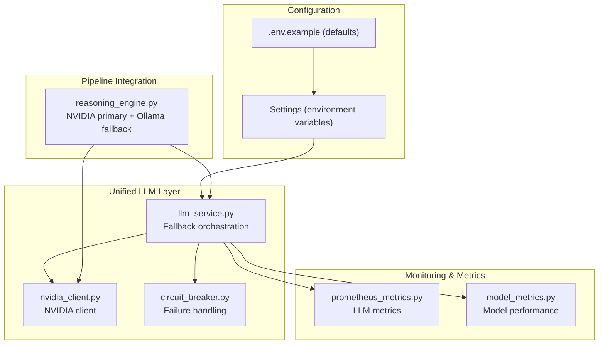
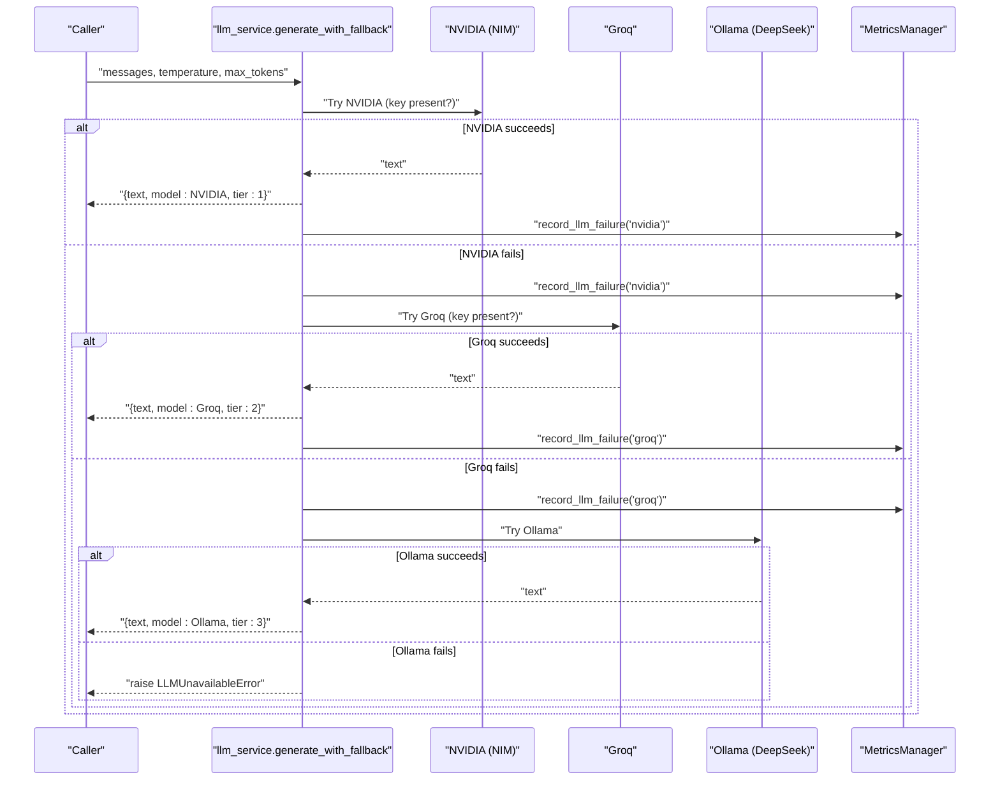
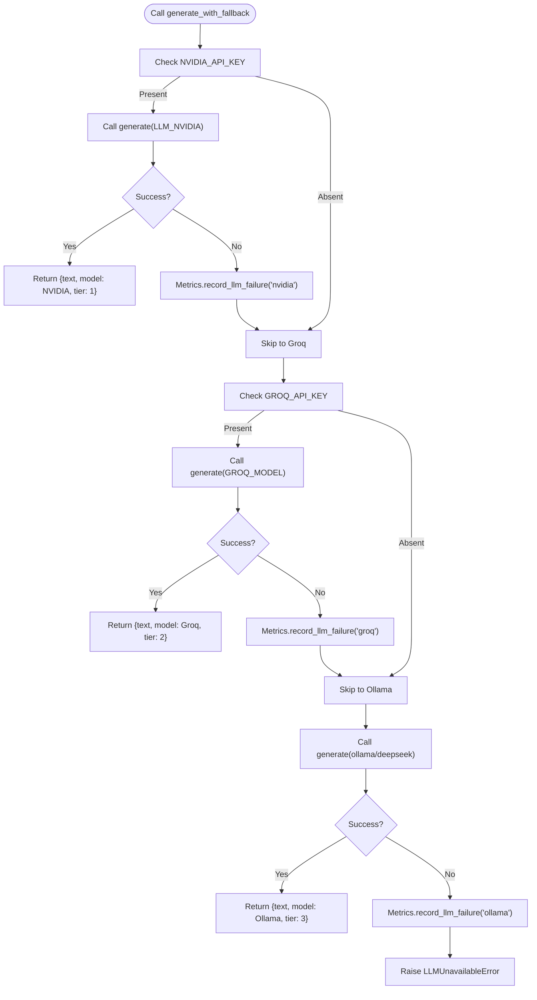
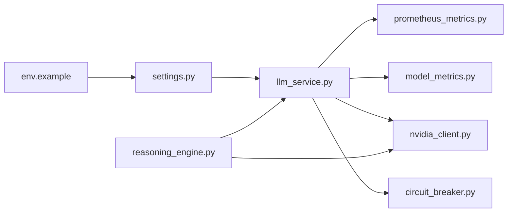

# Groq Fallback System

<cite>
**Referenced Files in This Document**
- [llm_service.py](file://backend/app/services/llm_service.py)
- [nvidia_client.py](file://backend/app/services/nvidia_client.py)
- [settings.py](file://backend/app/config/settings.py)
- [.env.example](file://backend/.env.example)
- [prometheus_metrics.py](file://backend/app/middleware/prometheus_metrics.py)
- [model_metrics.py](file://backend/app/services/model_metrics.py)
- [reasoning_engine.py](file://backend/app/pipeline/intelligence/reasoning_engine.py)
- [circuit_breaker.py](file://backend/app/pipeline/safety/circuit_breaker.py)
</cite>

## Table of Contents
1. [Introduction](#introduction)
2. [Project Structure](#project-structure)
3. [Core Components](#core-components)
4. [Architecture Overview](#architecture-overview)
5. [Detailed Component Analysis](#detailed-component-analysis)
6. [Dependency Analysis](#dependency-analysis)
7. [Performance Considerations](#performance-considerations)
8. [Troubleshooting Guide](#troubleshooting-guide)
9. [Conclusion](#conclusion)

## Introduction
This document explains the Groq fallback system within the AI/ML pipeline. It covers the fallback architecture that switches between NVIDIA NIM and Groq based on availability and performance, along with configuration parameters, timeout handling, error recovery mechanisms, integration patterns with the main LLM service, and monitoring/logging strategies for fallback events, performance comparisons, and cost optimization through provider switching.

## Project Structure
The fallback system spans three primary layers:
- Configuration and environment settings
- Unified LLM access layer with fallback orchestration
- Provider-specific clients and monitoring/metrics

**Diagram sources**
- [llm_service.py:1-393](file://backend/app/services/llm_service.py#L1-L393)
- [nvidia_client.py:1-260](file://backend/app/services/nvidia_client.py#L1-L260)
- [settings.py:146-149](file://backend/app/config/settings.py#L146-L149)
- [.env.example:53-55](file://backend/.env.example#L53-L55)
- [prometheus_metrics.py:144-235](file://backend/app/middleware/prometheus_metrics.py#L144-L235)
- [model_metrics.py:23-209](file://backend/app/services/model_metrics.py#L23-L209)
- [reasoning_engine.py:83-176](file://backend/app/pipeline/intelligence/reasoning_engine.py#L83-L176)
- [circuit_breaker.py:29-163](file://backend/app/pipeline/safety/circuit_breaker.py#L29-L163)

**Section sources**
- [llm_service.py:1-393](file://backend/app/services/llm_service.py#L1-L393)
- [nvidia_client.py:1-260](file://backend/app/services/nvidia_client.py#L1-L260)
- [settings.py:146-149](file://backend/app/config/settings.py#L146-L149)
- [.env.example:53-55](file://backend/.env.example#L53-L55)
- [prometheus_metrics.py:144-235](file://backend/app/middleware/prometheus_metrics.py#L144-L235)
- [model_metrics.py:23-209](file://backend/app/services/model_metrics.py#L23-L209)
- [reasoning_engine.py:83-176](file://backend/app/pipeline/intelligence/reasoning_engine.py#L83-L176)
- [circuit_breaker.py:29-163](file://backend/app/pipeline/safety/circuit_breaker.py#L29-L163)

## Core Components
- Unified LLM service with 3-tier fallback: NVIDIA -> Groq -> Ollama
- Provider configuration via environment variables
- Timeout and caching controls
- Failure tracking and circuit breaker integration
- Metrics collection for LLM usage and model performance

Key responsibilities:
- Select appropriate provider based on configured keys and model prefixes
- Apply timeouts and caching
- Record telemetry and fallback events
- Provide health checks for providers

**Section sources**
- [llm_service.py:205-269](file://backend/app/services/llm_service.py#L205-L269)
- [llm_service.py:91-203](file://backend/app/services/llm_service.py#L91-L203)
- [settings.py:342-349](file://backend/app/config/settings.py#L342-L349)
- [prometheus_metrics.py:174-191](file://backend/app/middleware/prometheus_metrics.py#L174-L191)
- [model_metrics.py:60-99](file://backend/app/services/model_metrics.py#L60-L99)

## Architecture Overview
The fallback system operates as follows:
- Primary provider selection uses NVIDIA NIM when the NVIDIA API key is present
- Secondary provider selection uses Groq when the Groq API key is present
- Tertiary provider selection uses Ollama (DeepSeek) when available
- Failures are recorded and surfaced via metrics and logging
- Circuit breaker can short-circuit failing operations and trigger rule-based fallbacks

**Diagram sources**
- [llm_service.py:205-269](file://backend/app/services/llm_service.py#L205-L269)
- [prometheus_metrics.py:174-175](file://backend/app/middleware/prometheus_metrics.py#L174-L175)

**Section sources**
- [llm_service.py:205-269](file://backend/app/services/llm_service.py#L205-L269)
- [prometheus_metrics.py:174-175](file://backend/app/middleware/prometheus_metrics.py#L174-L175)

## Detailed Component Analysis

### Unified LLM Service (Fallback Orchestration)
- Provides a single entry point for LLM calls
- Implements a 3-tier fallback chain controlled by environment keys
- Applies timeouts, caching, and provider-specific base URLs
- Records metrics for cache hits/misses, durations, TTFT, and failures

Key behaviors:
- Tier 1: NVIDIA NIM (LLM_NVIDIA)
- Tier 2: Groq (LLM_GROQ)
- Tier 3: Ollama DeepSeek (LLM_DEEPSEEK)
- On failure, records provider-specific failures and proceeds to next tier
- On exhaustion, raises LLMUnavailableError

**Diagram sources**
- [llm_service.py:205-269](file://backend/app/services/llm_service.py#L205-L269)
- [prometheus_metrics.py:174-175](file://backend/app/middleware/prometheus_metrics.py#L174-L175)

**Section sources**
- [llm_service.py:205-269](file://backend/app/services/llm_service.py#L205-L269)
- [llm_service.py:91-203](file://backend/app/services/llm_service.py#L91-L203)
- [prometheus_metrics.py:174-191](file://backend/app/middleware/prometheus_metrics.py#L174-L191)

### NVIDIA Client (Primary Provider)
- Wraps NVIDIA NIM calls via the unified LLM service when available
- Falls back to direct OpenAI-compatible client if LiteLLM is not available
- Exposes higher-level methods for document analysis and figure interpretation
- Logs usage and errors appropriately

Integration highlights:
- Uses LLM_NVIDIA model identifier
- Respects timeout and temperature parameters
- Emits usage metrics when available

**Section sources**
- [nvidia_client.py:30-140](file://backend/app/services/nvidia_client.py#L30-L140)
- [nvidia_client.py:143-243](file://backend/app/services/nvidia_client.py#L143-L243)

### Configuration Parameters
Environment-driven configuration enables flexible provider selection and behavior:
- NVIDIA
  - NVIDIA_API_KEY: Enables NVIDIA tier
  - NVIDIA_MODEL: Model identifier for NVIDIA NIM
- Groq
  - GROQ_API_KEY: Enables Groq tier
  - GROQ_MODEL: Model identifier for Groq
  - GROQ_API_BASE: Base URL for Groq
- Ollama
  - OLLAMA_BASE_URL: Base URL for Ollama
- General
  - LLM_CACHE_TTL_SECONDS: Cache TTL for LLM responses
  - PIPELINE_REASONING_TIMEOUT_SECONDS: Timeout for reasoning operations

Defaults and examples are provided in the environment template.

**Section sources**
- [settings.py:146-149](file://backend/app/config/settings.py#L146-L149)
- [settings.py:342-349](file://backend/app/config/settings.py#L342-L349)
- [.env.example:53-55](file://backend/.env.example#L53-L55)
- [settings.py:164-173](file://backend/app/config/settings.py#L164-L173)

### Timeout Handling and Caching
- Per-call timeout is configurable and passed to provider clients
- Responses are cached keyed by system prompt, user message, model, and temperature
- Cache TTL is configurable and applied consistently across providers
- Metrics capture cache hits/misses and request durations

**Section sources**
- [llm_service.py:96-99](file://backend/app/services/llm_service.py#L96-L99)
- [llm_service.py:120-141](file://backend/app/services/llm_service.py#L120-L141)
- [prometheus_metrics.py:178-191](file://backend/app/middleware/prometheus_metrics.py#L178-L191)

### Error Recovery Mechanisms
- Circuit breaker decorator protects against cascading failures and triggers rule-based fallbacks when tripped
- LLMUnavailableError signals that all tiers failed and downstream logic should apply fallback strategies
- Health checks probe provider readiness and model availability

**Section sources**
- [circuit_breaker.py:29-163](file://backend/app/pipeline/safety/circuit_breaker.py#L29-L163)
- [llm_service.py:271-273](file://backend/app/services/llm_service.py#L271-L273)
- [llm_service.py:359-391](file://backend/app/services/llm_service.py#L359-L391)

### Monitoring and Logging Strategies
- Prometheus metrics:
  - LLM failures by provider
  - LLM request duration and TTFT histograms
  - LLM cache hits and misses
- Model performance metrics:
  - Call counts, success/failure rates, latency, and fallback tracking
  - Comparison between NVIDIA and Ollama (DeepSeek)
- Logging:
  - Verbose logs for fallback transitions and provider health
  - Warning/error logs for failures and degraded modes

**Section sources**
- [prometheus_metrics.py:60-90](file://backend/app/middleware/prometheus_metrics.py#L60-L90)
- [prometheus_metrics.py:174-191](file://backend/app/middleware/prometheus_metrics.py#L174-L191)
- [model_metrics.py:23-181](file://backend/app/services/model_metrics.py#L23-L181)

### Integration Patterns with the Main LLM Service
- The reasoning engine initializes NVIDIA and Ollama clients and uses the unified LLM service for provider calls
- It measures latency and records model metrics for success/failure and fallback events
- It applies circuit breaker and retry guards around sensitive operations

**Section sources**
- [reasoning_engine.py:116-176](file://backend/app/pipeline/intelligence/reasoning_engine.py#L116-L176)
- [reasoning_engine.py:431-515](file://backend/app/pipeline/intelligence/reasoning_engine.py#L431-L515)

## Dependency Analysis
The fallback system exhibits clear separation of concerns:
- Configuration drives provider availability and behavior
- Unified LLM service encapsulates fallback logic and metrics
- Provider clients implement specific transport and model semantics
- Monitoring middleware and model metrics provide observability

**Diagram sources**
- [settings.py:146-149](file://backend/app/config/settings.py#L146-L149)
- [.env.example:53-55](file://backend/.env.example#L53-L55)
- [llm_service.py:205-269](file://backend/app/services/llm_service.py#L205-L269)
- [prometheus_metrics.py:144-235](file://backend/app/middleware/prometheus_metrics.py#L144-L235)
- [model_metrics.py:23-209](file://backend/app/services/model_metrics.py#L23-L209)
- [nvidia_client.py:30-140](file://backend/app/services/nvidia_client.py#L30-L140)
- [circuit_breaker.py:29-163](file://backend/app/pipeline/safety/circuit_breaker.py#L29-L163)
- [reasoning_engine.py:83-176](file://backend/app/pipeline/intelligence/reasoning_engine.py#L83-L176)

**Section sources**
- [llm_service.py:205-269](file://backend/app/services/llm_service.py#L205-L269)
- [prometheus_metrics.py:144-235](file://backend/app/middleware/prometheus_metrics.py#L144-L235)
- [model_metrics.py:23-209](file://backend/app/services/model_metrics.py#L23-L209)
- [nvidia_client.py:30-140](file://backend/app/services/nvidia_client.py#L30-L140)
- [circuit_breaker.py:29-163](file://backend/app/pipeline/safety/circuit_breaker.py#L29-L163)
- [reasoning_engine.py:83-176](file://backend/app/pipeline/intelligence/reasoning_engine.py#L83-L176)

## Performance Considerations
- Provider selection prioritizes NVIDIA when available for higher capability; otherwise falls back to Groq and then Ollama
- Caching reduces repeated calls and improves latency for identical prompts
- Metrics enable comparison of provider performance (success rates, latency) and guide cost optimization
- Timeouts prevent long waits and support graceful degradation

[No sources needed since this section provides general guidance]

## Troubleshooting Guide
Common scenarios and remedies:
- All tiers fail
  - Verify environment keys for NVIDIA and Groq
  - Confirm provider base URLs and network connectivity
  - Inspect metrics for failure counts and durations
- Slow responses
  - Adjust timeouts and consider enabling caching
  - Monitor latency histograms and TTFT metrics
- Provider unavailability
  - Use health checks to confirm readiness
  - Review circuit breaker state and fallback behavior
- Cost optimization
  - Prefer Groq when NVIDIA is unavailable or slower
  - Track fallback rates and adjust thresholds accordingly

**Section sources**
- [llm_service.py:271-273](file://backend/app/services/llm_service.py#L271-L273)
- [prometheus_metrics.py:60-90](file://backend/app/middleware/prometheus_metrics.py#L60-L90)
- [llm_service.py:359-391](file://backend/app/services/llm_service.py#L359-L391)
- [circuit_breaker.py:29-163](file://backend/app/pipeline/safety/circuit_breaker.py#L29-L163)

## Conclusion
The Groq fallback system provides robust, configurable, and observable resilience across NVIDIA NIM, Groq, and Ollama. By leveraging environment-driven configuration, unified fallback orchestration, comprehensive metrics, and circuit breaker protections, the system ensures reliable operation under varying provider conditions while supporting performance and cost optimization through intelligent provider switching.