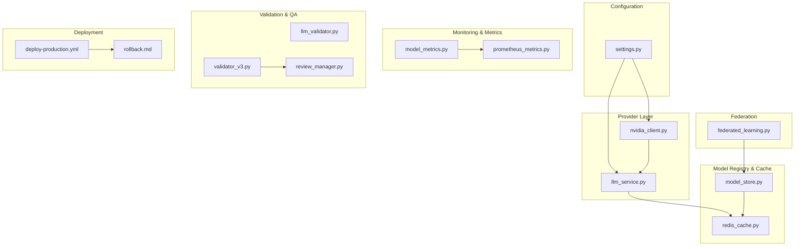
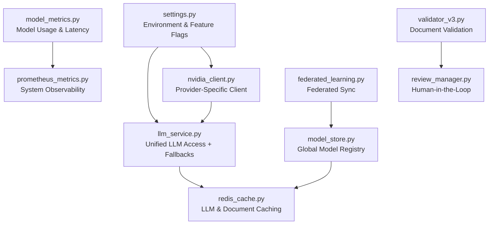
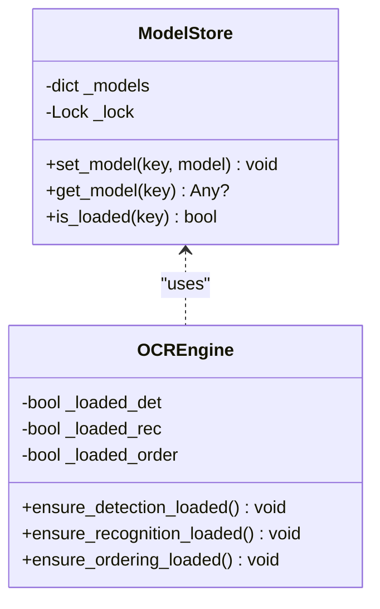
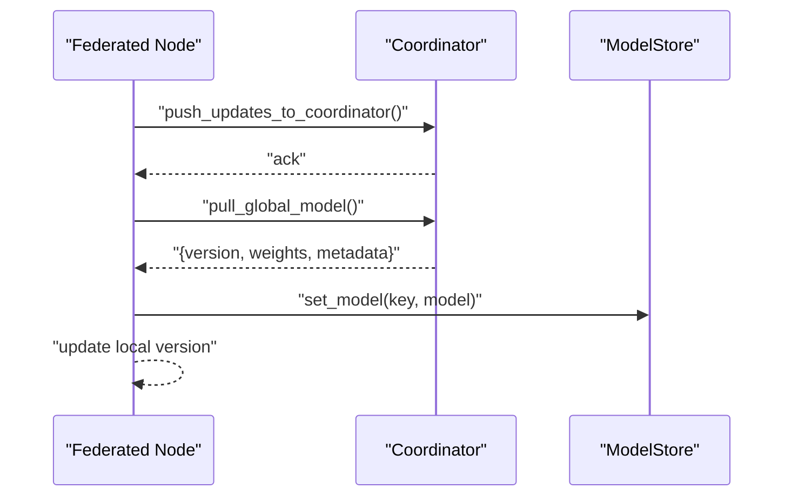
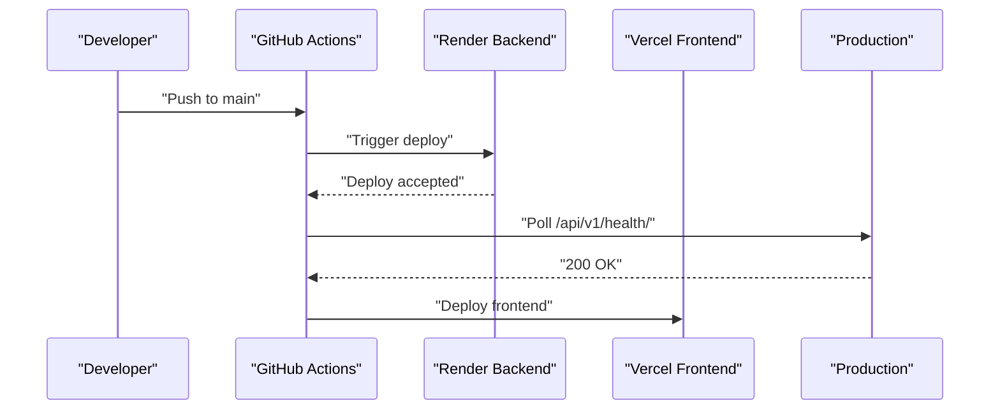
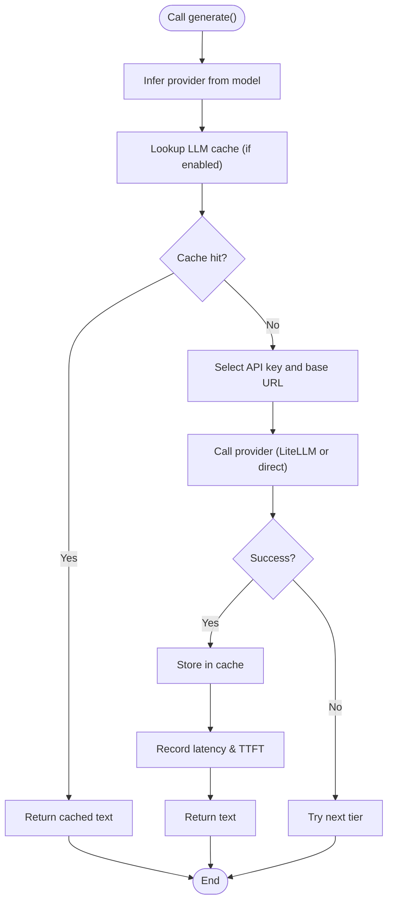
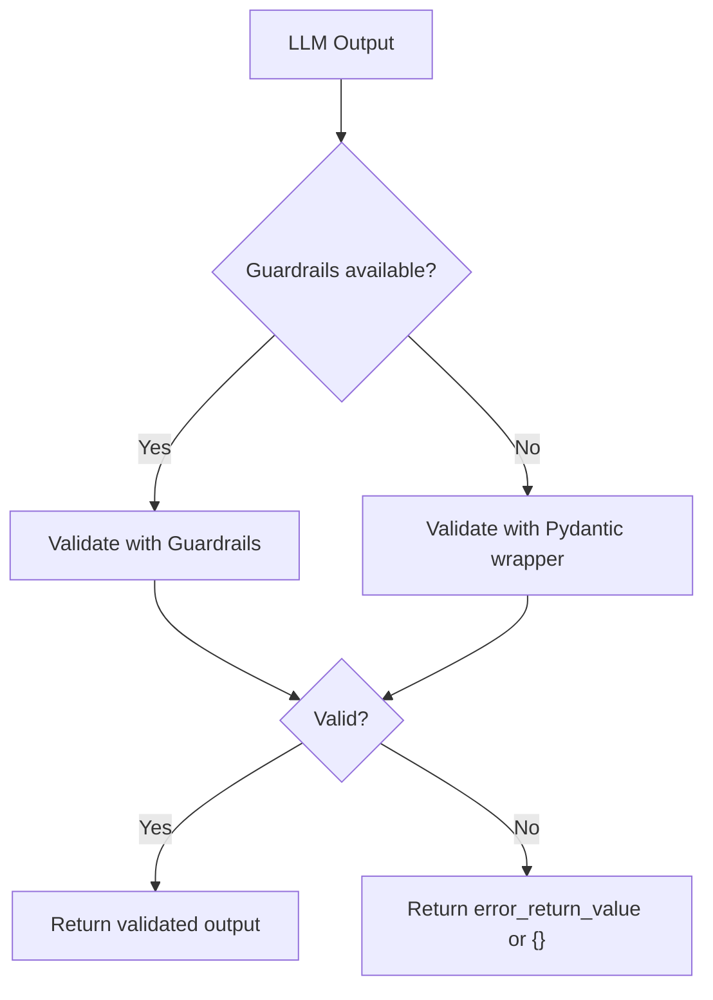
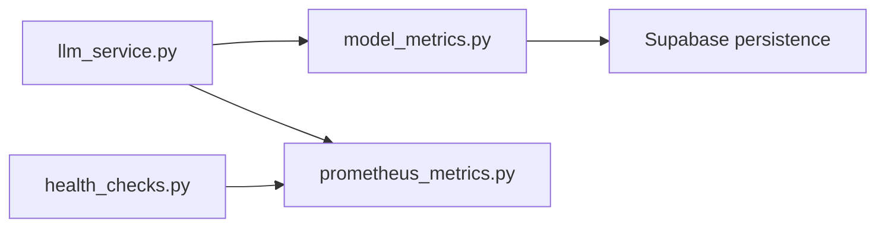
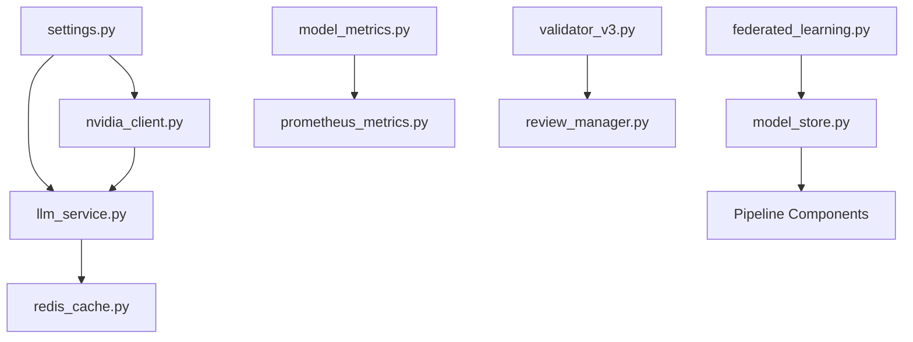

# Model Management

<cite>
**Referenced Files in This Document**
- [model_store.py](file://backend/app/services/model_store.py)
- [llm_service.py](file://backend/app/services/llm_service.py)
- [nvidia_client.py](file://backend/app/services/nvidia_client.py)
- [settings.py](file://backend/app/config/settings.py)
- [redis_cache.py](file://backend/app/cache/redis_cache.py)
- [health_checks.py](file://backend/app/services/health_checks.py)
- [model_metrics.py](file://backend/app/services/model_metrics.py)
- [prometheus_metrics.py](file://backend/app/middleware/prometheus_metrics.py)
- [llm_validator.py](file://backend/app/pipeline/safety/llm_validator.py)
- [validator_v3.py](file://backend/app/pipeline/validation/validator_v3.py)
- [review_manager.py](file://backend/app/pipeline/validation/review_manager.py)
- [federated_learning.py](file://backend/app/pipeline/agents/federated_learning.py)
- [deploy-production.yml](file://.github/workflows/deploy-production.yml)
- [rollback.md](file://docs/runbooks/rollback.md)
</cite>

## Table of Contents
1. [Introduction](#introduction)
2. [Project Structure](#project-structure)
3. [Core Components](#core-components)
4. [Architecture Overview](#architecture-overview)
5. [Detailed Component Analysis](#detailed-component-analysis)
6. [Dependency Analysis](#dependency-analysis)
7. [Performance Considerations](#performance-considerations)
8. [Troubleshooting Guide](#troubleshooting-guide)
9. [Conclusion](#conclusion)
10. [Appendices](#appendices)

## Introduction
This document describes the model management system for AI/ML model lifecycle within the application. It covers model storage architecture, versioning strategies, deployment automation, model registry and metadata management, dependency tracking, provider integrations, validation and quality assurance, performance monitoring, configuration management across environments, caching strategies, and update/rollback procedures.

## Project Structure
The model management system spans several backend modules:
- Configuration and environment settings
- Provider abstraction and fallback orchestration
- Model registry and caching
- Metrics and monitoring
- Validation and quality gates
- Federated learning coordination
- CI/CD automation for deployment and rollback

**Diagram sources**
- [settings.py:1-422](file://backend/app/config/settings.py#L1-L422)
- [llm_service.py:1-393](file://backend/app/services/llm_service.py#L1-L393)
- [nvidia_client.py:33-259](file://backend/app/services/nvidia_client.py#L33-L259)
- [model_store.py:1-33](file://backend/app/services/model_store.py#L1-L33)
- [redis_cache.py:1-102](file://backend/app/cache/redis_cache.py#L1-L102)
- [model_metrics.py:1-209](file://backend/app/services/model_metrics.py#L1-L209)
- [prometheus_metrics.py:1-235](file://backend/app/middleware/prometheus_metrics.py#L1-L235)
- [llm_validator.py:1-122](file://backend/app/pipeline/safety/llm_validator.py#L1-L122)
- [validator_v3.py:1-277](file://backend/app/pipeline/validation/validator_v3.py#L1-L277)
- [review_manager.py:1-117](file://backend/app/pipeline/validation/review_manager.py#L1-L117)
- [federated_learning.py:213-314](file://backend/app/pipeline/agents/federated_learning.py#L213-L314)
- [deploy-production.yml:1-63](file://.github/workflows/deploy-production.yml#L1-L63)
- [rollback.md:1-24](file://docs/runbooks/rollback.md#L1-L24)

**Section sources**
- [settings.py:1-422](file://backend/app/config/settings.py#L1-L422)
- [llm_service.py:1-393](file://backend/app/services/llm_service.py#L1-L393)
- [nvidia_client.py:33-259](file://backend/app/services/nvidia_client.py#L33-L259)
- [model_store.py:1-33](file://backend/app/services/model_store.py#L1-L33)
- [redis_cache.py:1-102](file://backend/app/cache/redis_cache.py#L1-L102)
- [model_metrics.py:1-209](file://backend/app/services/model_metrics.py#L1-L209)
- [prometheus_metrics.py:1-235](file://backend/app/middleware/prometheus_metrics.py#L1-L235)
- [llm_validator.py:1-122](file://backend/app/pipeline/safety/llm_validator.py#L1-L122)
- [validator_v3.py:1-277](file://backend/app/pipeline/validation/validator_v3.py#L1-L277)
- [review_manager.py:1-117](file://backend/app/pipeline/validation/review_manager.py#L1-L117)
- [federated_learning.py:213-314](file://backend/app/pipeline/agents/federated_learning.py#L213-L314)
- [deploy-production.yml:1-63](file://.github/workflows/deploy-production.yml#L1-L63)
- [rollback.md:1-24](file://docs/runbooks/rollback.md#L1-L24)

## Core Components
- Model registry: A thread-safe global registry for heavy AI models, loaded once and reused across requests.
- Provider abstraction: Unified LLM access with fallback tiers and provider-specific configuration.
- Model caching: Redis-backed caching for LLM responses and document processing results.
- Metrics and monitoring: Structured metrics for model usage, latency, success rates, and fallbacks; Prometheus metrics for system observability.
- Validation and QA: Output validation with guardrails and Pydantic fallbacks; document validation and human-in-the-loop review triggers.
- Federation: Federated learning node synchronization and aggregation.
- Deployment automation: GitHub Actions workflow for production deployment and rollback runbook.

**Section sources**
- [model_store.py:1-33](file://backend/app/services/model_store.py#L1-L33)
- [llm_service.py:1-393](file://backend/app/services/llm_service.py#L1-L393)
- [redis_cache.py:1-102](file://backend/app/cache/redis_cache.py#L1-L102)
- [model_metrics.py:1-209](file://backend/app/services/model_metrics.py#L1-L209)
- [prometheus_metrics.py:1-235](file://backend/app/middleware/prometheus_metrics.py#L1-L235)
- [llm_validator.py:1-122](file://backend/app/pipeline/safety/llm_validator.py#L1-L122)
- [validator_v3.py:1-277](file://backend/app/pipeline/validation/validator_v3.py#L1-L277)
- [review_manager.py:1-117](file://backend/app/pipeline/validation/review_manager.py#L1-L117)
- [federated_learning.py:213-314](file://backend/app/pipeline/agents/federated_learning.py#L213-L314)
- [deploy-production.yml:1-63](file://.github/workflows/deploy-production.yml#L1-L63)
- [rollback.md:1-24](file://docs/runbooks/rollback.md#L1-L24)

## Architecture Overview
The model management architecture integrates configuration-driven provider selection, a global model registry, caching, and robust validation and monitoring.

**Diagram sources**
- [settings.py:1-422](file://backend/app/config/settings.py#L1-L422)
- [model_store.py:1-33](file://backend/app/services/model_store.py#L1-L33)
- [llm_service.py:1-393](file://backend/app/services/llm_service.py#L1-L393)
- [nvidia_client.py:33-259](file://backend/app/services/nvidia_client.py#L33-L259)
- [redis_cache.py:1-102](file://backend/app/cache/redis_cache.py#L1-L102)
- [model_metrics.py:1-209](file://backend/app/services/model_metrics.py#L1-L209)
- [prometheus_metrics.py:1-235](file://backend/app/middleware/prometheus_metrics.py#L1-L235)
- [validator_v3.py:1-277](file://backend/app/pipeline/validation/validator_v3.py#L1-L277)
- [review_manager.py:1-117](file://backend/app/pipeline/validation/review_manager.py#L1-L117)
- [federated_learning.py:213-314](file://backend/app/pipeline/agents/federated_learning.py#L213-L314)

## Detailed Component Analysis

### Model Storage Architecture and Registry
- Global registry: Thread-safe singleton that registers pre-loaded models keyed by logical names. Used by OCR engine and other components to avoid repeated initialization.
- Preloading: Controlled by configuration; models are loaded at startup or on-demand and stored globally for reuse.

**Diagram sources**
- [model_store.py:1-33](file://backend/app/services/model_store.py#L1-L33)
- [ocr_engine.py:83-113](file://backend/app/pipeline/parsing/ocr_engine.py#L83-L113)

**Section sources**
- [model_store.py:1-33](file://backend/app/services/model_store.py#L1-L33)
- [ocr_engine.py:83-113](file://backend/app/pipeline/parsing/ocr_engine.py#L83-L113)

### Versioning Strategies and Model Registry
- Logical keys: Models are registered under stable keys (e.g., detection/recognition processors) enabling replacement without changing consumers.
- Global availability: Consumers retrieve models via the registry, avoiding duplication and enabling centralized lifecycle management.
- Federated learning: Nodes maintain a global model version and synchronize updates, supporting coordinated rollouts and rollbacks.

**Diagram sources**
- [federated_learning.py:297-314](file://backend/app/pipeline/agents/federated_learning.py#L297-L314)
- [model_store.py:19-30](file://backend/app/services/model_store.py#L19-L30)

**Section sources**
- [federated_learning.py:213-314](file://backend/app/pipeline/agents/federated_learning.py#L213-L314)
- [model_store.py:1-33](file://backend/app/services/model_store.py#L1-L33)

### Deployment Automation
- Production deployment workflow triggers backend redeploy on pushes to main and waits for health checks.
- Frontend deployment to Vercel is automated separately.
- Rollback runbook supports reverting backend, frontend, and database migrations.

**Diagram sources**
- [deploy-production.yml:1-63](file://.github/workflows/deploy-production.yml#L1-L63)

**Section sources**
- [deploy-production.yml:1-63](file://.github/workflows/deploy-production.yml#L1-L63)
- [rollback.md:1-24](file://docs/runbooks/rollback.md#L1-L24)

### Provider Integrations and Fallback Orchestration
- Unified LLM access: Provider inference, API key routing, base URL selection, and cache integration.
- Fallback tiers: NVIDIA → Groq → Ollama/DeepSeek with explicit failure recording.
- Provider health checks: Liveness and model presence checks for external providers.

**Diagram sources**
- [llm_service.py:91-203](file://backend/app/services/llm_service.py#L91-L203)
- [llm_service.py:205-269](file://backend/app/services/llm_service.py#L205-L269)

**Section sources**
- [llm_service.py:1-393](file://backend/app/services/llm_service.py#L1-L393)

### Model Validation Procedures
- Output validation: Guardrails-based validation with graceful fallback to Pydantic-based validation when unavailable.
- Document validation: Structural completeness, figures/tables/citations, integrity, and optional CrossRef checks.
- Human-in-the-loop: Confidence thresholds trigger review flags and critical flags for manual verification.

**Diagram sources**
- [llm_validator.py:46-122](file://backend/app/pipeline/safety/llm_validator.py#L46-L122)

**Section sources**
- [llm_validator.py:1-122](file://backend/app/pipeline/safety/llm_validator.py#L1-L122)
- [validator_v3.py:68-146](file://backend/app/pipeline/validation/validator_v3.py#L68-L146)
- [review_manager.py:29-117](file://backend/app/pipeline/validation/review_manager.py#L29-L117)

### Performance Monitoring and Metrics
- Model metrics: Tracks calls, success/failure, latency, quality scores, and fallbacks; persists to Supabase with resilience.
- Prometheus metrics: Pipeline durations, LLM usage, cache hits/misses, retries, and system-level gauges.
- Health checks: Aggregates component readiness and provider status, with caching and TTL controls.

**Diagram sources**
- [model_metrics.py:60-138](file://backend/app/services/model_metrics.py#L60-L138)
- [prometheus_metrics.py:144-235](file://backend/app/middleware/prometheus_metrics.py#L144-L235)
- [health_checks.py:85-95](file://backend/app/services/health_checks.py#L85-L95)

**Section sources**
- [model_metrics.py:1-209](file://backend/app/services/model_metrics.py#L1-L209)
- [prometheus_metrics.py:1-235](file://backend/app/middleware/prometheus_metrics.py#L1-L235)
- [health_checks.py:1-95](file://backend/app/services/health_checks.py#L1-L95)

### Configuration Management Across Environments
- Centralized settings: Environment variables define provider credentials, timeouts, cache TTLs, and feature flags.
- Normalization and validation: Boolean parsing, CORS origins normalization, and runtime validation of critical constraints.
- Feature flags: Control preload behavior, fast mode, and external integrations.

**Section sources**
- [settings.py:72-422](file://backend/app/config/settings.py#L72-L422)

### Model Caching Strategies
- LLM caching: Deterministic cache keys derived from messages and parameters; TTL configurable per environment.
- Document/result caching: Redis-based caching for GROBID-like results with hashing and TTL.
- Health/readiness caching: Separate caches for health and readiness endpoints with TTL and forced refresh support.

**Section sources**
- [llm_service.py:86-121](file://backend/app/services/llm_service.py#L86-L121)
- [redis_cache.py:77-98](file://backend/app/cache/redis_cache.py#L77-L98)
- [health_checks.py:36-51](file://backend/app/services/health_checks.py#L36-L51)

### Resource Optimization
- Preload control: Environment flag to preload AI models at startup to reduce cold-start latency.
- Low memory mode: Feature toggle to adjust pipeline behavior for constrained environments.
- Caching: Redis availability detection and graceful degradation when unavailable.

**Section sources**
- [settings.py:185-188](file://backend/app/config/settings.py#L185-L188)
- [settings.py:401-403](file://backend/app/config/settings.py#L401-L403)
- [redis_cache.py:15-39](file://backend/app/cache/redis_cache.py#L15-L39)

### Model Update Procedures and Rollback Mechanisms
- Update procedures: Federated nodes push updates and pull global models; consumers replace models in the registry atomically.
- Rollback mechanisms: GitHub Actions workflow supports backend/frontend rollbacks; database migrations can be downgraded; feature flags can disable risky features.

**Section sources**
- [federated_learning.py:297-314](file://backend/app/pipeline/agents/federated_learning.py#L297-L314)
- [deploy-production.yml:1-63](file://.github/workflows/deploy-production.yml#L1-L63)
- [rollback.md:1-24](file://docs/runbooks/rollback.md#L1-L24)

## Dependency Analysis
The model management system exhibits clear separation of concerns:
- Configuration drives provider selection and caching behavior.
- Provider layer abstracts external APIs and implements fallbacks.
- Registry and cache decouple model lifecycle from consumers.
- Metrics and monitoring provide observability and quality insights.
- Validation ensures correctness and enables human oversight.

**Diagram sources**
- [settings.py:1-422](file://backend/app/config/settings.py#L1-L422)
- [llm_service.py:1-393](file://backend/app/services/llm_service.py#L1-L393)
- [nvidia_client.py:33-259](file://backend/app/services/nvidia_client.py#L33-L259)
- [redis_cache.py:1-102](file://backend/app/cache/redis_cache.py#L1-L102)
- [model_store.py:1-33](file://backend/app/services/model_store.py#L1-L33)
- [model_metrics.py:1-209](file://backend/app/services/model_metrics.py#L1-L209)
- [prometheus_metrics.py:1-235](file://backend/app/middleware/prometheus_metrics.py#L1-L235)
- [validator_v3.py:1-277](file://backend/app/pipeline/validation/validator_v3.py#L1-L277)
- [review_manager.py:1-117](file://backend/app/pipeline/validation/review_manager.py#L1-L117)
- [federated_learning.py:213-314](file://backend/app/pipeline/agents/federated_learning.py#L213-L314)

**Section sources**
- [settings.py:1-422](file://backend/app/config/settings.py#L1-L422)
- [llm_service.py:1-393](file://backend/app/services/llm_service.py#L1-L393)
- [nvidia_client.py:33-259](file://backend/app/services/nvidia_client.py#L33-L259)
- [redis_cache.py:1-102](file://backend/app/cache/redis_cache.py#L1-L102)
- [model_store.py:1-33](file://backend/app/services/model_store.py#L1-L33)
- [model_metrics.py:1-209](file://backend/app/services/model_metrics.py#L1-L209)
- [prometheus_metrics.py:1-235](file://backend/app/middleware/prometheus_metrics.py#L1-L235)
- [validator_v3.py:1-277](file://backend/app/pipeline/validation/validator_v3.py#L1-L277)
- [review_manager.py:1-117](file://backend/app/pipeline/validation/review_manager.py#L1-L117)
- [federated_learning.py:213-314](file://backend/app/pipeline/agents/federated_learning.py#L213-L314)

## Performance Considerations
- Use LLM cache keys derived from inputs to maximize cache hits; tune TTL via settings.
- Enable model preloading to reduce cold-start latency for heavy models.
- Monitor LLM latency and cache hit ratios; adjust provider tiers and fallback policies accordingly.
- Persist metrics asynchronously to avoid pipeline stalls; monitor Supabase availability and disable persistence if tables are missing.
- Use health/readiness cache TTLs appropriate for environment stability.

[No sources needed since this section provides general guidance]

## Troubleshooting Guide
- LLM unavailability: Check provider credentials and base URLs; verify health checks and model presence; confirm fallback chain progression.
- Cache issues: Validate Redis connectivity and configuration; ensure keys are deterministically generated; inspect cache TTLs.
- Model not loaded: Confirm preload flag and registry entries; verify OCR engine loading paths.
- Metrics persistence failures: Check Supabase table existence and permissions; review warning logs indicating missing tables.
- Deployment failures: Inspect GitHub Actions logs; verify production health endpoints; follow rollback runbook if needed.

**Section sources**
- [llm_service.py:359-392](file://backend/app/services/llm_service.py#L359-L392)
- [redis_cache.py:22-39](file://backend/app/cache/redis_cache.py#L22-L39)
- [model_store.py:19-30](file://backend/app/services/model_store.py#L19-L30)
- [model_metrics.py:101-137](file://backend/app/services/model_metrics.py#L101-L137)
- [health_checks.py:85-95](file://backend/app/services/health_checks.py#L85-L95)
- [deploy-production.yml:36-52](file://.github/workflows/deploy-production.yml#L36-L52)
- [rollback.md:1-24](file://docs/runbooks/rollback.md#L1-L24)

## Conclusion
The model management system integrates configuration-driven provider orchestration, a global model registry, robust caching, comprehensive validation, and strong observability. It supports deployment automation, controlled updates, and resilient fallbacks, enabling reliable AI/ML model lifecycle management across environments.

[No sources needed since this section summarizes without analyzing specific files]

## Appendices
- Provider health checks and model presence verification are integrated into the LLM service and health checks.
- Federated learning provides a framework for coordinated model updates and versioning.

**Section sources**
- [llm_service.py:359-392](file://backend/app/services/llm_service.py#L359-L392)
- [health_checks.py:85-95](file://backend/app/services/health_checks.py#L85-L95)
- [federated_learning.py:297-314](file://backend/app/pipeline/agents/federated_learning.py#L297-L314)