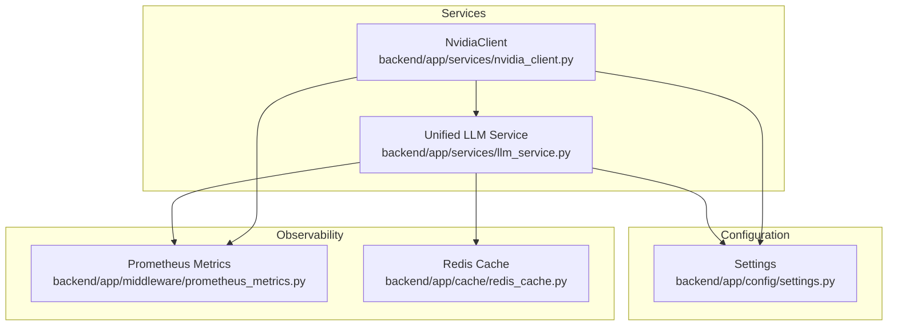
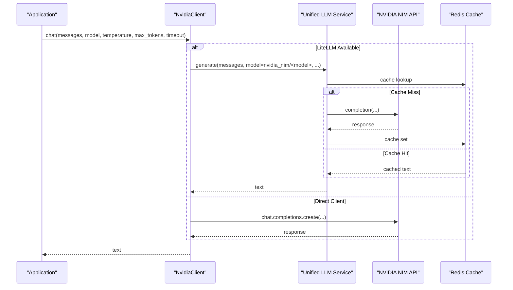
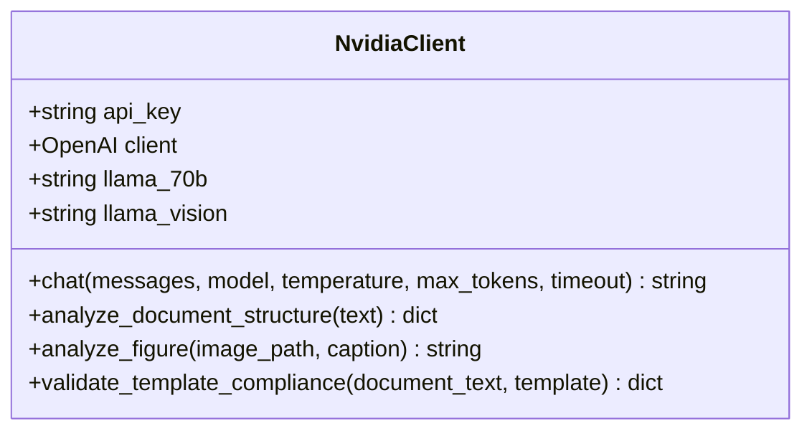
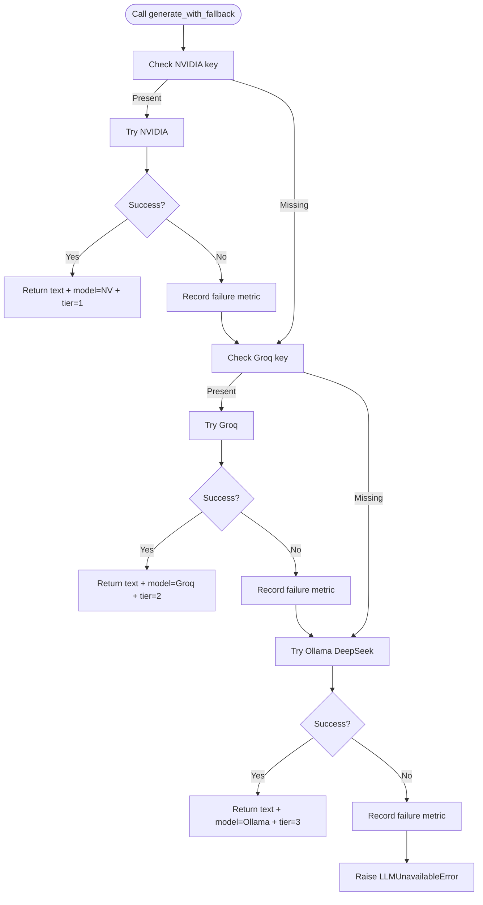
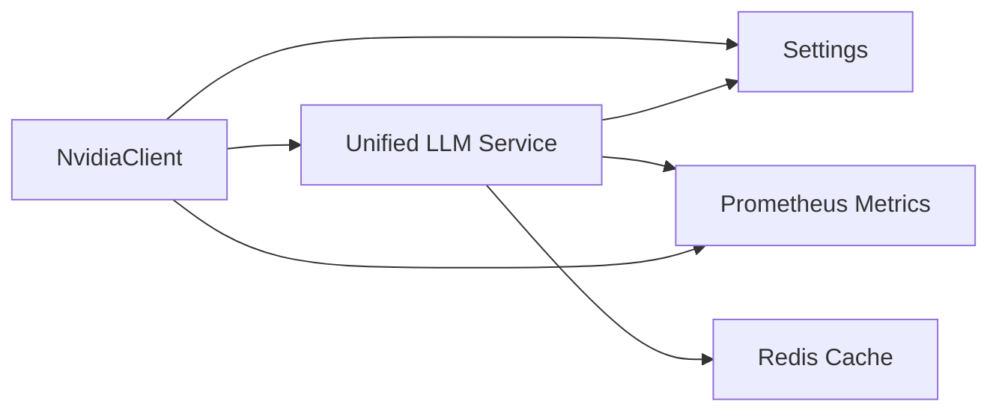

# NVIDIA NIM Integration

<cite>
**Referenced Files in This Document**
- [nvidia_client.py](file://backend/app/services/nvidia_client.py)
- [llm_service.py](file://backend/app/services/llm_service.py)
- [settings.py](file://backend/app/config/settings.py)
- [prometheus_metrics.py](file://backend/app/middleware/prometheus_metrics.py)
- [redis_cache.py](file://backend/app/cache/redis_cache.py)
- [test_nvidia_client.py](file://backend/tests/test_nvidia_client.py)
- [reasoning_engine.py](file://backend/app/pipeline/intelligence/reasoning_engine.py)
- [main.py](file://backend/app/main.py)
</cite>

## Table of Contents
1. [Introduction](#introduction)
2. [Project Structure](#project-structure)
3. [Core Components](#core-components)
4. [Architecture Overview](#architecture-overview)
5. [Detailed Component Analysis](#detailed-component-analysis)
6. [Dependency Analysis](#dependency-analysis)
7. [Performance Considerations](#performance-considerations)
8. [Troubleshooting Guide](#troubleshooting-guide)
9. [Conclusion](#conclusion)
10. [Appendices](#appendices)

## Introduction
This document explains the NVIDIA NIM integration within the backend AI pipeline. It covers the NVIDIA client implementation, API configuration, fallback mechanisms across NVIDIA NIM, Groq, and Ollama, authentication setup, rate limiting, cost optimization techniques, error handling strategies, performance monitoring, and how the integration fits into the broader AI pipeline.

## Project Structure
The NVIDIA NIM integration spans three primary areas:
- Services: The NVIDIA client and unified LLM service
- Configuration: Environment-driven settings for API keys and endpoints
- Observability: Prometheus metrics and Redis caching

**Diagram sources**
- [nvidia_client.py:30-260](file://backend/app/services/nvidia_client.py#L30-L260)
- [llm_service.py:1-393](file://backend/app/services/llm_service.py#L1-L393)
- [settings.py:146-154](file://backend/app/config/settings.py#L146-L154)
- [prometheus_metrics.py:144-235](file://backend/app/middleware/prometheus_metrics.py#L144-L235)
- [redis_cache.py:10-101](file://backend/app/cache/redis_cache.py#L10-L101)

**Section sources**
- [nvidia_client.py:1-260](file://backend/app/services/nvidia_client.py#L1-L260)
- [llm_service.py:1-393](file://backend/app/services/llm_service.py#L1-L393)
- [settings.py:146-154](file://backend/app/config/settings.py#L146-L154)
- [prometheus_metrics.py:144-235](file://backend/app/middleware/prometheus_metrics.py#L144-L235)
- [redis_cache.py:10-101](file://backend/app/cache/redis_cache.py#L10-L101)

## Core Components
- NvidiaClient: Thin wrapper around NVIDIA NIM with optional LiteLLM integration and direct OpenAI-compatible client fallback. Provides model selection, chat completion, and higher-level helpers for document structure analysis, figure analysis, and template compliance checking.
- Unified LLM Service: Centralized LLM access layer that supports multiple providers (NVIDIA, Groq, Ollama, OpenAI, Anthropic) via LiteLLM or direct HTTP clients. Implements a 3-tier fallback strategy, input sanitization, caching, and metrics.
- Settings: Centralized configuration for API keys, model identifiers, provider endpoints, and cache TTLs.
- Observability: Prometheus metrics for LLM latency, TTFT, cache hits/misses, and failures; Redis cache for LLM result deduplication and reuse.

**Section sources**
- [nvidia_client.py:30-260](file://backend/app/services/nvidia_client.py#L30-L260)
- [llm_service.py:91-268](file://backend/app/services/llm_service.py#L91-L268)
- [settings.py:146-154](file://backend/app/config/settings.py#L146-L154)
- [prometheus_metrics.py:60-90](file://backend/app/middleware/prometheus_metrics.py#L60-L90)
- [redis_cache.py:77-99](file://backend/app/cache/redis_cache.py#L77-L99)

## Architecture Overview
The NVIDIA NIM integration is layered:
- Application code calls NvidiaClient for NVIDIA-specific tasks.
- NvidiaClient prefers LiteLLM-backed generation when available; otherwise falls back to a direct OpenAI-compatible client pointed at NVIDIA’s API base URL.
- The unified LLM service provides a provider-agnostic interface, enabling multi-tier fallback across NVIDIA, Groq, and Ollama.

**Diagram sources**
- [nvidia_client.py:95-139](file://backend/app/services/nvidia_client.py#L95-L139)
- [llm_service.py:119-202](file://backend/app/services/llm_service.py#L119-L202)
- [redis_cache.py:77-99](file://backend/app/cache/redis_cache.py#L77-L99)

## Detailed Component Analysis

### NvidiaClient
Responsibilities:
- Resolve API key from environment or settings.
- Initialize either LiteLLM-backed generation or a direct OpenAI-compatible client.
- Provide chat completion with temperature clamping and token limits.
- Emit token usage logs when available.
- Offer higher-level helpers for document structure analysis, vision-based figure analysis, and template compliance checks.

Key behaviors:
- Degraded mode when no API key is present: returns empty string without raising.
- Uses model identifiers derived from settings for NVIDIA models.
- Falls back to direct client if LiteLLM is unavailable.

**Diagram sources**
- [nvidia_client.py:30-260](file://backend/app/services/nvidia_client.py#L30-L260)

**Section sources**
- [nvidia_client.py:30-139](file://backend/app/services/nvidia_client.py#L30-L139)
- [test_nvidia_client.py:16-22](file://backend/tests/test_nvidia_client.py#L16-L22)

### Unified LLM Service
Responsibilities:
- Provider-agnostic generation via LiteLLM or direct HTTP clients.
- 3-tier fallback: NVIDIA -> Groq -> Ollama.
- Input sanitization and prompt injection guard.
- Redis-backed caching for LLM results with configurable TTL.
- Metrics recording for duration, TTFT, cache hits/misses, and failures.

Fallback logic:
- Tier 1: NVIDIA NIM if key configured.
- Tier 2: Groq if key configured.
- Tier 3: Ollama DeepSeek model.
- Failure: raises LLMUnavailableError.

**Diagram sources**
- [llm_service.py:205-268](file://backend/app/services/llm_service.py#L205-L268)

**Section sources**
- [llm_service.py:91-268](file://backend/app/services/llm_service.py#L91-L268)

### Configuration and Authentication
- NVIDIA API key and model identifier are read from settings.
- Provider-specific keys and base URLs are resolved inside the LLM service for LiteLLM or direct HTTP fallbacks.
- Environment variables are used for configuration, with validation and defaults handled centrally.

Configuration highlights:
- NVIDIA_API_KEY: Required for NVIDIA NIM.
- NVIDIA_MODEL: Model identifier used by the client and service.
- GROQ_API_KEY, GROQ_MODEL, GROQ_API_BASE: Groq configuration for fallback.
- OLLAMA_BASE_URL: Ollama base URL for local model inference.
- LLM_CACHE_TTL_SECONDS: TTL for LLM result caching.

**Section sources**
- [settings.py:146-154](file://backend/app/config/settings.py#L146-L154)
- [llm_service.py:158-185](file://backend/app/services/llm_service.py#L158-L185)

### Fallback Mechanisms
- Within NvidiaClient: LiteLLM-backed call followed by direct OpenAI-compatible client.
- Across providers: generate_with_fallback tiers NVIDIA -> Groq -> Ollama.
- Health checks: separate health endpoint for NVIDIA and Ollama DeepSeek model presence.

**Section sources**
- [nvidia_client.py:95-139](file://backend/app/services/nvidia_client.py#L95-L139)
- [llm_service.py:205-268](file://backend/app/services/llm_service.py#L205-L268)
- [llm_service.py:359-391](file://backend/app/services/llm_service.py#L359-L391)

### Error Handling Strategies
- Degraded mode for NvidiaClient when no API key is present.
- Exception logging and warnings for LiteLLM and direct client failures.
- LLMUnavailableError raised when all tiers fail.
- Frontend-friendly error parsing and user messaging in API layer.

**Section sources**
- [nvidia_client.py:88-139](file://backend/app/services/nvidia_client.py#L88-L139)
- [llm_service.py:267-268](file://backend/app/services/llm_service.py#L267-L268)
- [main.py:318-328](file://backend/app/main.py#L318-L328)

### Performance Monitoring
- Prometheus metrics:
  - LLM request duration and TTFT histograms.
  - LLM cache hits and misses counters.
  - LLM failures counter by provider.
- Metrics recorded in LLM service and NvidiaClient.
- Application-wide metrics endpoint exposed via Prometheus instrumentation.

**Section sources**
- [prometheus_metrics.py:60-90](file://backend/app/middleware/prometheus_metrics.py#L60-L90)
- [prometheus_metrics.py:174-191](file://backend/app/middleware/prometheus_metrics.py#L174-L191)
- [llm_service.py:195-202](file://backend/app/services/llm_service.py#L195-L202)
- [nvidia_client.py:125-131](file://backend/app/services/nvidia_client.py#L125-L131)
- [main.py:273-274](file://backend/app/main.py#L273-L274)

### Cost Optimization Techniques
- Redis caching of LLM results to reduce repeated calls.
- Input sanitization and truncation to limit prompt sizes.
- Temperature clamping and token limits to constrain generation costs.
- Provider fallback reduces reliance on expensive providers when available.

**Section sources**
- [redis_cache.py:77-99](file://backend/app/cache/redis_cache.py#L77-L99)
- [llm_service.py:66-77](file://backend/app/services/llm_service.py#L66-L77)
- [nvidia_client.py:92-93](file://backend/app/services/nvidia_client.py#L92-L93)

### Integration with the Main AI Pipeline
- Reasoning engine attempts NVIDIA first when available; falls back to rule-based logic if necessary.
- Health checks expose NVIDIA and Ollama status for observability.
- Application lifecycle initializes AI models and caches; metrics are continuously tracked.

**Section sources**
- [reasoning_engine.py:480-504](file://backend/app/pipeline/intelligence/reasoning_engine.py#L480-L504)
- [llm_service.py:359-391](file://backend/app/services/llm_service.py#L359-L391)
- [main.py:198-229](file://backend/app/main.py#L198-L229)

## Dependency Analysis

**Diagram sources**
- [nvidia_client.py:15-21](file://backend/app/services/nvidia_client.py#L15-L21)
- [llm_service.py:16-32](file://backend/app/services/llm_service.py#L16-L32)
- [settings.py:146-154](file://backend/app/config/settings.py#L146-L154)
- [prometheus_metrics.py:144-235](file://backend/app/middleware/prometheus_metrics.py#L144-L235)
- [redis_cache.py:10-101](file://backend/app/cache/redis_cache.py#L10-L101)

**Section sources**
- [nvidia_client.py:15-21](file://backend/app/services/nvidia_client.py#L15-L21)
- [llm_service.py:16-32](file://backend/app/services/llm_service.py#L16-L32)

## Performance Considerations
- Enable Redis caching for LLM responses to minimize API calls.
- Use appropriate temperature and max_tokens to balance quality and cost.
- Monitor LLM duration and TTFT histograms to identify slow providers or models.
- Leverage provider fallback to avoid over-reliance on expensive endpoints.

[No sources needed since this section provides general guidance]

## Troubleshooting Guide
Common scenarios:
- No NVIDIA API key: NvidiaClient returns empty string; verify environment variables and settings.
- LiteLLM unavailable: Direct OpenAI-compatible client is used; check initialization logs.
- All LLM tiers failed: generate_with_fallback raises LLMUnavailableError; confirm keys and endpoints.
- Health checks failing: Verify NVIDIA key and Ollama DeepSeek model availability.

Operational tips:
- Inspect Prometheus metrics for failures and cache effectiveness.
- Review logs for warnings and exceptions during client initialization and API calls.
- Confirm settings for provider keys and base URLs.

**Section sources**
- [test_nvidia_client.py:16-22](file://backend/tests/test_nvidia_client.py#L16-L22)
- [nvidia_client.py:44-62](file://backend/app/services/nvidia_client.py#L44-L62)
- [llm_service.py:267-268](file://backend/app/services/llm_service.py#L267-L268)
- [prometheus_metrics.py:174-175](file://backend/app/middleware/prometheus_metrics.py#L174-L175)

## Conclusion
The NVIDIA NIM integration is designed for resilience and flexibility. It leverages a unified LLM service for multi-provider support, robust fallbacks, and strong observability. Configuration is centralized via settings, and performance is optimized through caching and careful parameter tuning. The integration fits seamlessly into the broader AI pipeline, supporting both specialized tasks (like document structure analysis and figure interpretation) and general-purpose LLM orchestration.

[No sources needed since this section summarizes without analyzing specific files]

## Appendices

### Configuration Examples
- NVIDIA API key and model:
  - Set NVIDIA_API_KEY and NVIDIA_MODEL in environment variables or .env.
- Groq fallback:
  - Set GROQ_API_KEY, GROQ_MODEL, and GROQ_API_BASE.
- Ollama fallback:
  - Set OLLAMA_BASE_URL pointing to your Ollama instance.
- LLM cache TTL:
  - Configure LLM_CACHE_TTL_SECONDS for Redis caching behavior.

**Section sources**
- [settings.py:146-154](file://backend/app/config/settings.py#L146-L154)
- [llm_service.py:158-185](file://backend/app/services/llm_service.py#L158-L185)