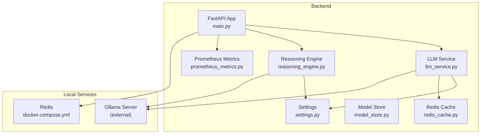
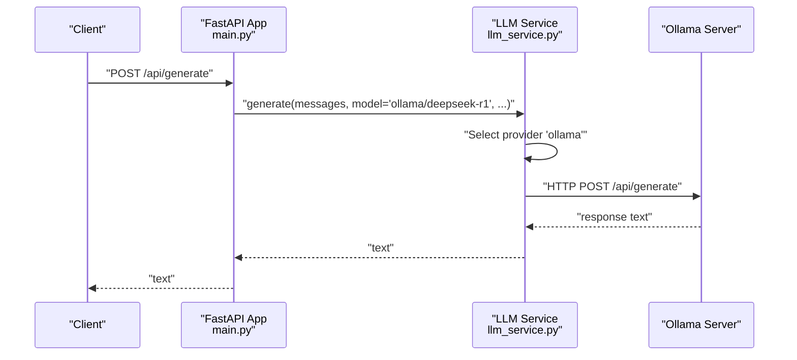
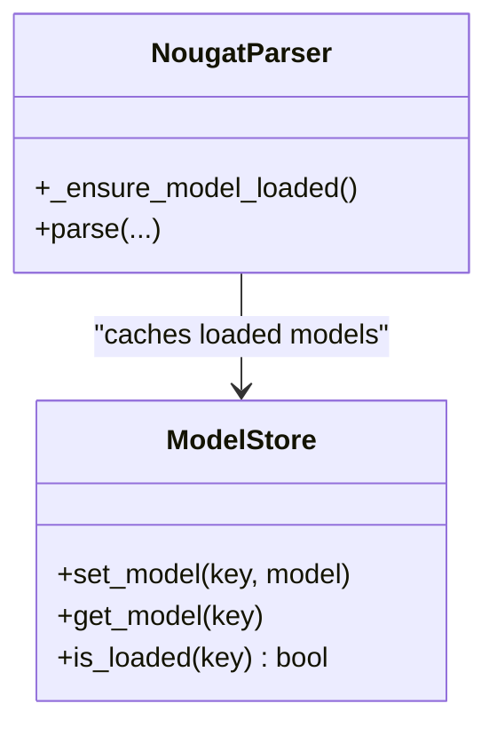
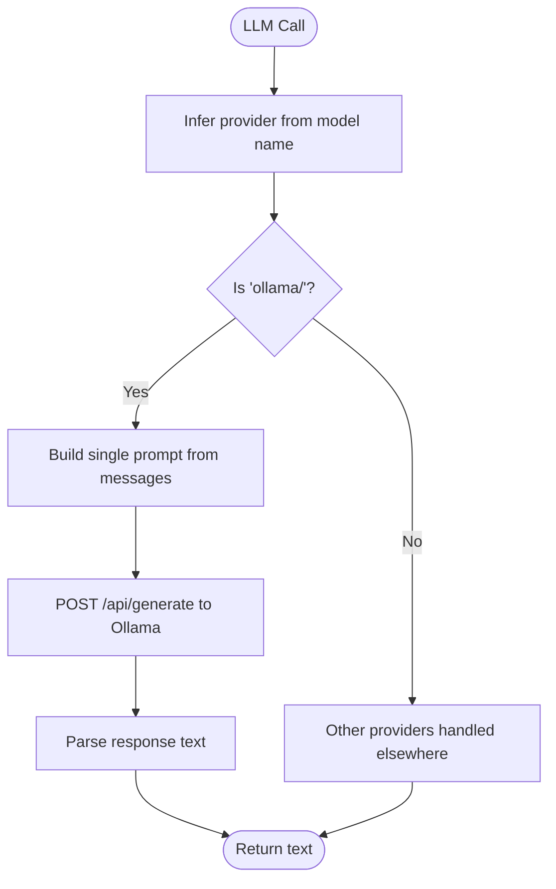
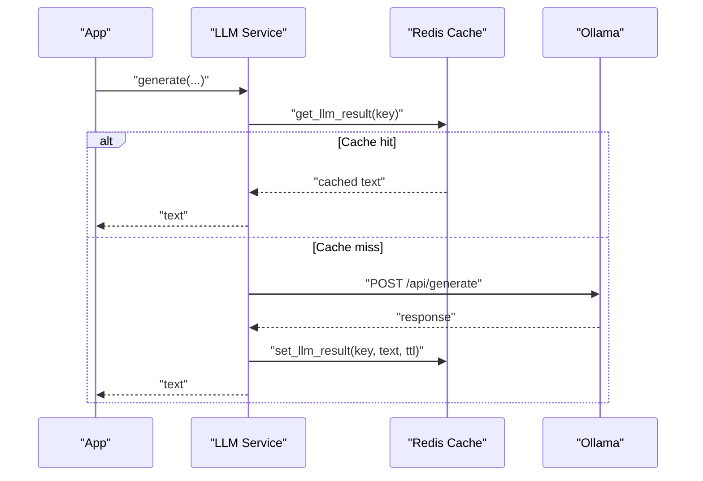
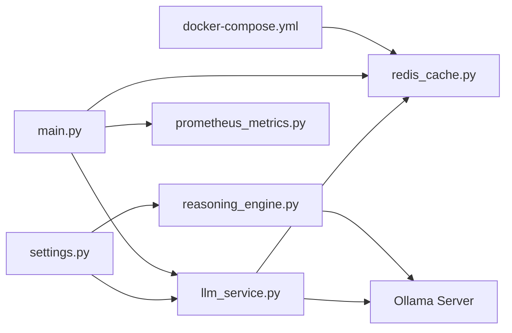

# Ollama Local Deployment

<cite>
**Referenced Files in This Document**
- [main.py](file://backend/app/main.py)
- [settings.py](file://backend/app/config/settings.py)
- [llm_service.py](file://backend/app/services/llm_service.py)
- [reasoning_engine.py](file://backend/app/pipeline/intelligence/reasoning_engine.py)
- [model_store.py](file://backend/app/services/model_store.py)
- [nougat_parser.py](file://backend/app/pipeline/parsing/nougat_parser.py)
- [redis_cache.py](file://backend/app/cache/redis_cache.py)
- [prometheus_metrics.py](file://backend/app/middleware/prometheus_metrics.py)
- [docker-compose.yml](file://backend/docker/docker-compose.yml)
- [Dockerfile](file://backend/docker/Dockerfile)
- [test_api.py](file://backend/tests/test_api.py)
</cite>

## Table of Contents
1. [Introduction](#introduction)
2. [Project Structure](#project-structure)
3. [Core Components](#core-components)
4. [Architecture Overview](#architecture-overview)
5. [Detailed Component Analysis](#detailed-component-analysis)
6. [Dependency Analysis](#dependency-analysis)
7. [Performance Considerations](#performance-considerations)
8. [Troubleshooting Guide](#troubleshooting-guide)
9. [Conclusion](#conclusion)
10. [Appendices](#appendices)

## Introduction
This document explains how the system deploys and operates Ollama for local inference within the backend. It covers local model serving setup, model management, resource allocation strategies, integration with the LLM service for local inference, caching mechanisms, performance tuning, configuration examples, and troubleshooting guidance. The focus is on the Ollama integration points and supporting infrastructure that enable reliable local deployments.

## Project Structure
The Ollama-related functionality spans several modules:
- Configuration: centralized environment-driven settings
- LLM service: unified access layer with Ollama HTTP fallback
- Reasoning engine: direct Ollama API calls for fallback scenarios
- Model store: global registry for heavy models (including Nougat)
- Caching: Redis-backed cache for LLM results
- Metrics: Prometheus metrics for monitoring LLM performance
- Docker: container orchestration for local services (Redis, Grobid, Celery workers)
- Tests: health checks and integration tests validating Ollama availability

**Diagram sources**
- [main.py:360-383](file://backend/app/main.py#L360-L383)
- [settings.py:142-145](file://backend/app/config/settings.py#L142-L145)
- [llm_service.py:346-357](file://backend/app/services/llm_service.py#L346-L357)
- [reasoning_engine.py:399-429](file://backend/app/pipeline/intelligence/reasoning_engine.py#L399-L429)
- [model_store.py:4-32](file://backend/app/services/model_store.py#L4-L32)
- [redis_cache.py:10-102](file://backend/app/cache/redis_cache.py#L10-L102)
- [prometheus_metrics.py:144-235](file://backend/app/middleware/prometheus_metrics.py#L144-L235)
- [docker-compose.yml:22-32](file://backend/docker/docker-compose.yml#L22-L32)

**Section sources**
- [main.py:360-383](file://backend/app/main.py#L360-L383)
- [settings.py:142-145](file://backend/app/config/settings.py#L142-L145)
- [docker-compose.yml:22-32](file://backend/docker/docker-compose.yml#L22-L32)

## Core Components
- Settings: define Ollama base URL and related environment variables
- LLM service: unified provider selection with Ollama HTTP fallback
- Reasoning engine: direct HTTP calls to Ollama for fallback
- Model store: global registry for heavy models (Nougat)
- Redis cache: LLM result caching
- Prometheus metrics: LLM latency, TTFT, cache hits/misses
- Docker compose: local service dependencies (Redis, Grobid, Celery)

Key responsibilities:
- Centralized configuration of Ollama base URL
- Provider-agnostic LLM calls with Ollama as a fallback tier
- Health checks that validate Ollama availability
- Resource-aware model loading and reuse
- Observability for LLM performance

**Section sources**
- [settings.py:142-145](file://backend/app/config/settings.py#L142-L145)
- [llm_service.py:205-268](file://backend/app/services/llm_service.py#L205-L268)
- [reasoning_engine.py:399-429](file://backend/app/pipeline/intelligence/reasoning_engine.py#L399-L429)
- [model_store.py:4-32](file://backend/app/services/model_store.py#L4-L32)
- [redis_cache.py:77-98](file://backend/app/cache/redis_cache.py#L77-L98)
- [prometheus_metrics.py:66-90](file://backend/app/middleware/prometheus_metrics.py#L66-L90)

## Architecture Overview
The system integrates Ollama locally through two primary paths:
- Unified LLM service: when LiteLLM is unavailable, the service falls back to direct HTTP calls to Ollama
- Reasoning engine: direct HTTP calls to Ollama for a specific fallback model

Both paths rely on configured base URLs and shared settings. Health checks query Ollama’s tags endpoint to confirm model availability.

**Diagram sources**
- [main.py:360-383](file://backend/app/main.py#L360-L383)
- [llm_service.py:346-357](file://backend/app/services/llm_service.py#L346-L357)

**Section sources**
- [llm_service.py:346-357](file://backend/app/services/llm_service.py#L346-L357)
- [reasoning_engine.py:399-429](file://backend/app/pipeline/intelligence/reasoning_engine.py#L399-L429)

## Detailed Component Analysis

### Local Model Serving Setup
- Environment configuration defines Ollama base URL and related settings
- Docker Compose provisions Redis and other services; Ollama is external to this compose file
- Health checks query Ollama tags to verify model availability

Operational notes:
- Ensure Ollama server is reachable at the configured base URL
- Confirm the desired model is pulled and listed in Ollama tags

**Section sources**
- [settings.py:142-145](file://backend/app/config/settings.py#L142-L145)
- [docker-compose.yml:22-32](file://backend/docker/docker-compose.yml#L22-L32)
- [llm_service.py:359-391](file://backend/app/services/llm_service.py#L359-L391)

### Model Management
- Unified LLM service supports model names prefixed with “ollama/”
- Health checks verify presence of a DeepSeek model tag
- Model store provides a thread-safe registry for heavy models (e.g., Nougat) to avoid repeated loads

**Diagram sources**
- [model_store.py:4-32](file://backend/app/services/model_store.py#L4-L32)
- [nougat_parser.py:179-216](file://backend/app/pipeline/parsing/nougat_parser.py#L179-L216)

**Section sources**
- [llm_service.py:359-391](file://backend/app/services/llm_service.py#L359-L391)
- [model_store.py:4-32](file://backend/app/services/model_store.py#L4-L32)
- [nougat_parser.py:179-216](file://backend/app/pipeline/parsing/nougat_parser.py#L179-L216)

### Resource Allocation Strategies
- Low-memory mode and preloading toggles influence startup behavior
- Nougat parser selects model variants based on available RAM
- Device selection prefers CUDA when available

Practical guidance:
- Enable low-memory mode for constrained environments
- Disable AI model preloading to reduce peak memory usage
- Ensure sufficient disk space for model downloads (first-time use)

**Section sources**
- [settings.py:380-413](file://backend/app/config/settings.py#L380-L413)
- [nougat_parser.py:63-70](file://backend/app/pipeline/parsing/nougat_parser.py#L63-L70)
- [nougat_parser.py:196-198](file://backend/app/pipeline/parsing/nougat_parser.py#L196-L198)

### Integration with LLM Service for Local Inference
- Provider inference recognizes “ollama/” prefixed models
- Direct HTTP fallback constructs a single prompt from messages and posts to Ollama
- Metrics are recorded for LLM duration and cache behavior

**Diagram sources**
- [llm_service.py:39-52](file://backend/app/services/llm_service.py#L39-L52)
- [llm_service.py:346-357](file://backend/app/services/llm_service.py#L346-L357)

**Section sources**
- [llm_service.py:39-52](file://backend/app/services/llm_service.py#L39-L52)
- [llm_service.py:346-357](file://backend/app/services/llm_service.py#L346-L357)

### Model Loading and Caching Mechanisms
- LLM results are cached in Redis keyed by sanitized inputs and model parameters
- Cache TTL is configurable; cache hits reduce latency and cost
- Health checks also query Ollama tags to detect model presence

**Diagram sources**
- [llm_service.py:119-194](file://backend/app/services/llm_service.py#L119-L194)
- [redis_cache.py:77-98](file://backend/app/cache/redis_cache.py#L77-L98)

**Section sources**
- [llm_service.py:119-194](file://backend/app/services/llm_service.py#L119-L194)
- [redis_cache.py:77-98](file://backend/app/cache/redis_cache.py#L77-L98)

### Performance Tuning for Local Deployments
- Configure timeouts and token limits appropriate for local hardware
- Use cache TTLs to balance freshness and performance
- Monitor LLM latency and TTFT histograms via Prometheus
- Adjust concurrency and worker counts in Docker Compose for CPU-bound tasks

Recommendations:
- Set reasonable temperature and max_tokens for local models
- Tune cache TTLs based on workload characteristics
- Observe LLM histograms to identify slow providers or models

**Section sources**
- [llm_service.py:96-99](file://backend/app/services/llm_service.py#L96-L99)
- [prometheus_metrics.py:66-90](file://backend/app/middleware/prometheus_metrics.py#L66-L90)
- [docker-compose.yml:42-94](file://backend/docker/docker-compose.yml#L42-L94)

### Configuration Examples
Environment variables for Ollama integration:
- OLLAMA_URL: public URL for Ollama
- OLLAMA_BASE_URL: internal/base URL for HTTP calls
- REDIS_ENABLED, REDIS_URL, REDIS_HOST, REDIS_PORT: Redis connectivity for caching
- LLM_CACHE_TTL_SECONDS: TTL for LLM result cache
- PRELOAD_AI_MODELS, LOW_MEMORY_MODE: startup behavior toggles

Example usage patterns:
- Use model name “ollama/deepseek-r1” to route to local Ollama
- Health checks verify model tags for “deepseek”

**Section sources**
- [settings.py:142-145](file://backend/app/config/settings.py#L142-L145)
- [settings.py:359-378](file://backend/app/config/settings.py#L359-L378)
- [llm_service.py:359-391](file://backend/app/services/llm_service.py#L359-L391)

## Dependency Analysis
The Ollama integration depends on:
- Settings for base URL configuration
- LLM service for unified provider routing and HTTP fallback
- Redis cache for result caching
- Prometheus metrics for observability
- Docker Compose for local service dependencies

**Diagram sources**
- [settings.py:142-145](file://backend/app/config/settings.py#L142-L145)
- [llm_service.py:346-357](file://backend/app/services/llm_service.py#L346-L357)
- [reasoning_engine.py:399-429](file://backend/app/pipeline/intelligence/reasoning_engine.py#L399-L429)
- [redis_cache.py:10-102](file://backend/app/cache/redis_cache.py#L10-L102)
- [prometheus_metrics.py:144-235](file://backend/app/middleware/prometheus_metrics.py#L144-L235)
- [docker-compose.yml:22-32](file://backend/docker/docker-compose.yml#L22-L32)

**Section sources**
- [settings.py:142-145](file://backend/app/config/settings.py#L142-L145)
- [llm_service.py:346-357](file://backend/app/services/llm_service.py#L346-L357)
- [reasoning_engine.py:399-429](file://backend/app/pipeline/intelligence/reasoning_engine.py#L399-L429)
- [redis_cache.py:10-102](file://backend/app/cache/redis_cache.py#L10-L102)
- [prometheus_metrics.py:144-235](file://backend/app/middleware/prometheus_metrics.py#L144-L235)
- [docker-compose.yml:22-32](file://backend/docker/docker-compose.yml#L22-L32)

## Performance Considerations
- Use cache TTLs aligned with content volatility
- Monitor LLM latency and TTFT histograms to identify bottlenecks
- Prefer streaming when supported by providers to improve perceived latency
- Right-size concurrency and worker counts for CPU-bound tasks

[No sources needed since this section provides general guidance]

## Troubleshooting Guide
Common issues and resolutions:
- Ollama unavailable: health checks surface “unavailable”; verify base URL and network connectivity
- Model missing: health checks surface “model_missing”; pull the required model into Ollama
- Cache unavailability: Redis disabled or unreachable; pipeline continues without caching
- Slow responses: monitor LLM histograms and adjust timeouts, token limits, or model choice

Validation via tests:
- Integration tests simulate Ollama unavailability and verify degraded status

**Section sources**
- [llm_service.py:359-391](file://backend/app/services/llm_service.py#L359-L391)
- [redis_cache.py:10-102](file://backend/app/cache/redis_cache.py#L10-L102)
- [test_api.py:84-101](file://backend/tests/test_api.py#L84-L101)

## Conclusion
The system integrates Ollama for local inference through a unified LLM service and a direct HTTP fallback in the reasoning engine. Configuration is environment-driven, caching leverages Redis, and Prometheus metrics provide visibility into performance. By tuning settings, leveraging caching, and monitoring metrics, teams can operate reliable local deployments across varying hardware profiles.

[No sources needed since this section summarizes without analyzing specific files]

## Appendices

### Appendix A: Local Deployment Checklist
- Confirm Ollama server is reachable at OLLAMA_BASE_URL
- Pull required models (e.g., deepseek-r1) into Ollama
- Verify health endpoint reports “deepseek” as healthy
- Ensure Redis is enabled and reachable for caching
- Review cache TTL and LLM timeouts for your workload
- Monitor Prometheus metrics for latency and cache effectiveness

**Section sources**
- [settings.py:142-145](file://backend/app/config/settings.py#L142-L145)
- [llm_service.py:359-391](file://backend/app/services/llm_service.py#L359-L391)
- [redis_cache.py:10-102](file://backend/app/cache/redis_cache.py#L10-L102)
- [prometheus_metrics.py:66-90](file://backend/app/middleware/prometheus_metrics.py#L66-L90)