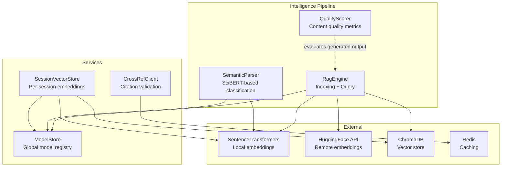
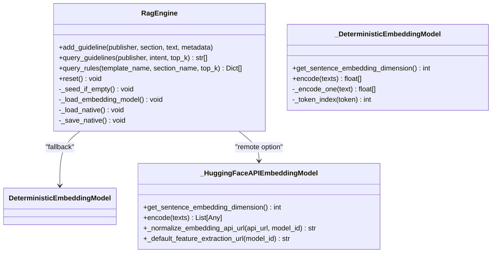
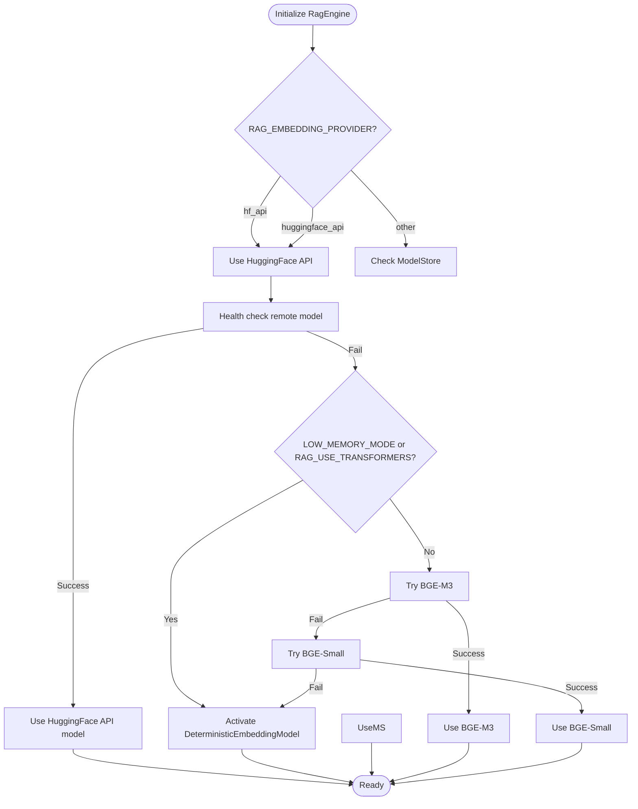
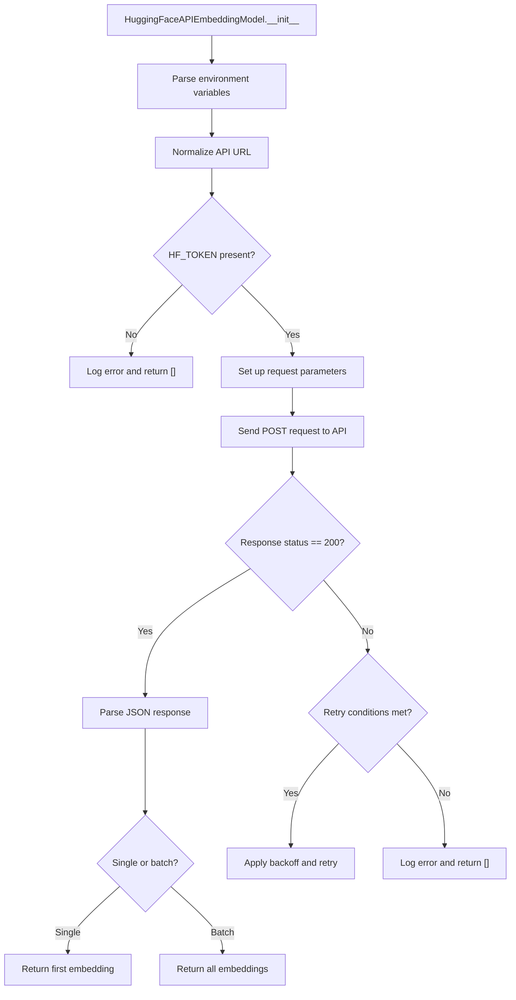
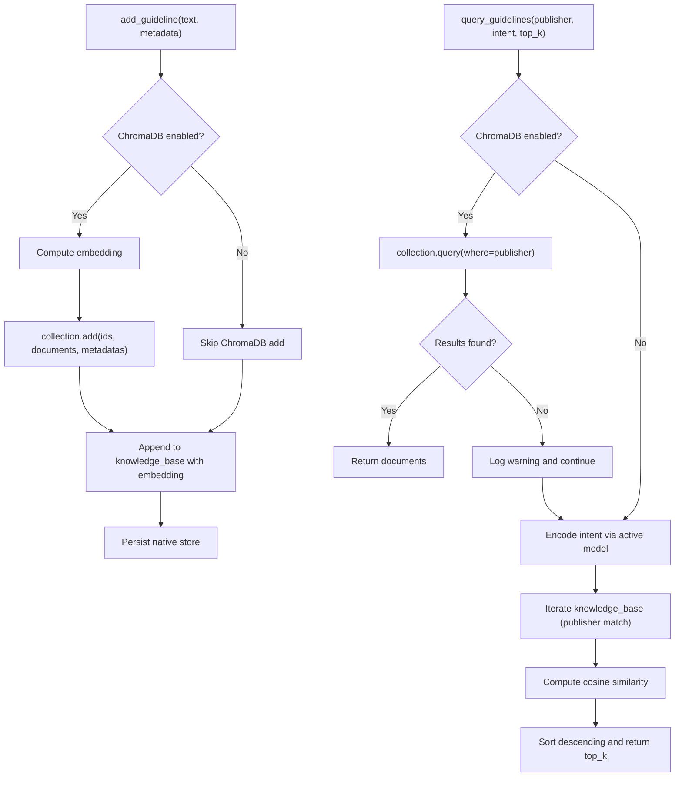
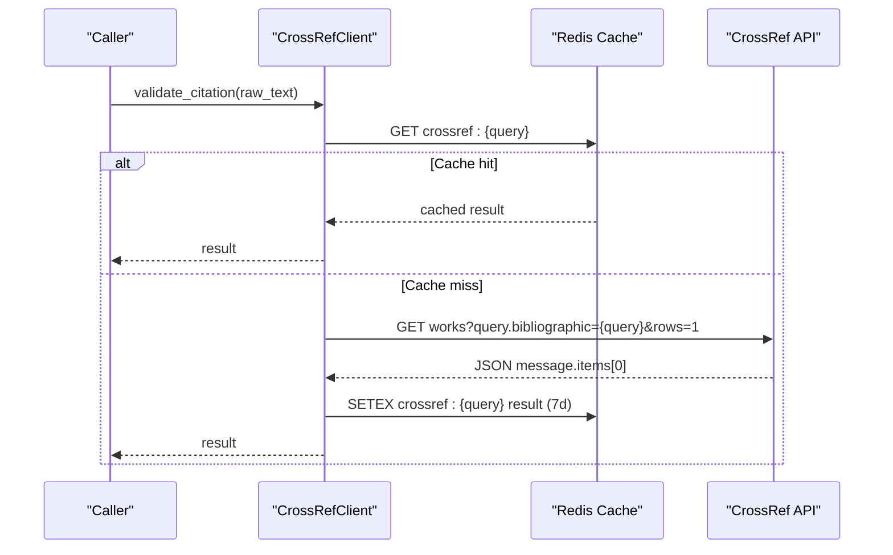
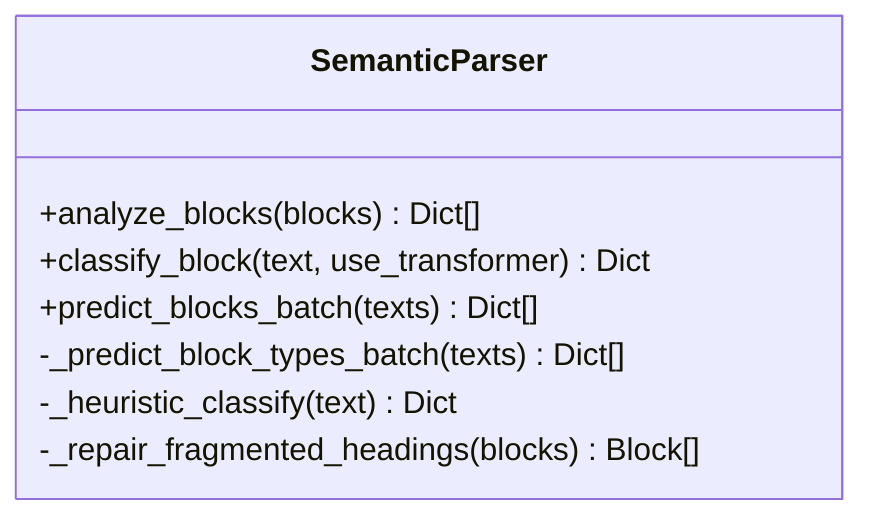
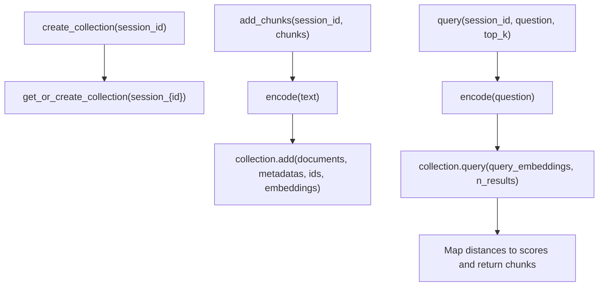
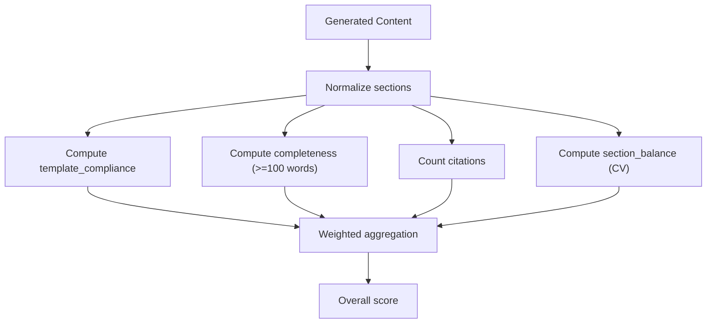
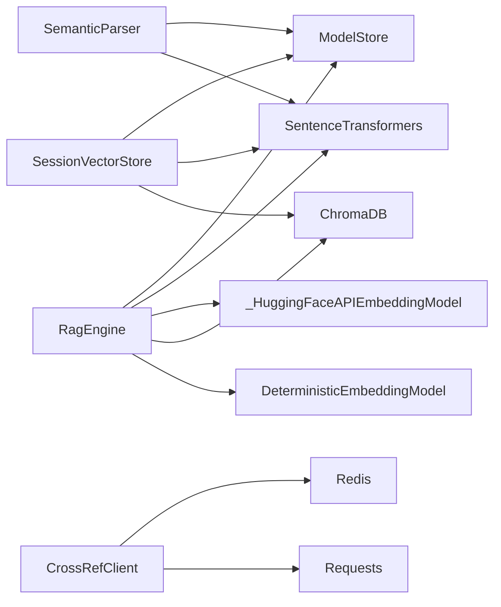

# RAG Engine

<cite>
**Referenced Files in This Document**
- [rag_engine.py](file://backend/app/pipeline/intelligence/rag_engine.py)
- [default_guidelines.json](file://backend/app/pipeline/intelligence/default_guidelines.json)
- [semantic_parser.py](file://backend/app/pipeline/intelligence/semantic_parser.py)
- [session_vector_store.py](file://backend/app/services/session_vector_store.py)
- [crossref_client.py](file://backend/app/services/crossref_client.py)
- [model_store.py](file://backend/app/services/model_store.py)
- [settings.py](file://backend/app/config/settings.py)
- [quality_scorer.py](file://backend/app/pipeline/generation/quality_scorer.py)
- [verify_rag_interface.py](file://backend/manual_tests/rag/verify_rag_interface.py)
- [test_rag_engine.py](file://backend/tests/test_rag_engine.py)
</cite>

## Update Summary
**Changes Made**
- Added new Hugging Face API embedding system with remote embeddings
- Enhanced error handling with environment variable configuration
- Added intelligent fallback mechanisms when local transformers are unavailable
- Updated embedding model loading strategies to include remote API option

## Table of Contents
1. [Introduction](#introduction)
2. [Project Structure](#project-structure)
3. [Core Components](#core-components)
4. [Architecture Overview](#architecture-overview)
5. [Detailed Component Analysis](#detailed-component-analysis)
6. [Dependency Analysis](#dependency-analysis)
7. [Performance Considerations](#performance-considerations)
8. [Troubleshooting Guide](#troubleshooting-guide)
9. [Conclusion](#conclusion)
10. [Appendices](#appendices)

## Introduction
This document describes the Retrieval-Augmented Generation (RAG) engine used for academic formatting guidelines. It explains the retrieval system architecture, embedding strategies, and integration points with the broader pipeline. It covers document indexing, similarity search, relevance ranking, and the optional integration with Crossref for academic paper metadata validation. It also documents configuration options for embedding models, retrieval parameters, and performance tuning, along with the generation pipeline that combines retrieved context with LLM responses, error handling, and quality assessment of retrieved results.

**Updated** Added support for Hugging Face API embedding system with remote embeddings, configurable timeouts, retry mechanisms, and automatic endpoint normalization.

## Project Structure
The RAG engine resides in the intelligence pipeline and integrates with services for embeddings, session storage, and external metadata validation. Key modules include:
- Retrieval engine: local embedding store with ChromaDB-backed vector store and a native fallback
- Embedding model lifecycle: priority loading with fallbacks and a deterministic hash-based model
- Remote embedding support: Hugging Face API integration with configurable timeouts and retry mechanisms
- Indexing and querying: publisher-aware filtering and configurable top-k retrieval
- Crossref integration: citation validation and metadata confidence scoring
- Quality scoring: post-generation evaluation of generated content against required sections and citation counts



**Diagram sources**
- [rag_engine.py:108-227](file://backend/app/pipeline/intelligence/rag_engine.py#L108-L227)
- [rag_engine.py:438-469](file://backend/app/pipeline/intelligence/rag_engine.py#L438-L469)
- [semantic_parser.py:32-306](file://backend/app/pipeline/intelligence/semantic_parser.py#L32-L306)
- [session_vector_store.py:53-204](file://backend/app/services/session_vector_store.py#L53-L204)
- [crossref_client.py:32-164](file://backend/app/services/crossref_client.py#L32-L164)
- [model_store.py:4-33](file://backend/app/services/model_store.py#L4-L33)

**Section sources**
- [rag_engine.py:108-227](file://backend/app/pipeline/intelligence/rag_engine.py#L108-L227)
- [rag_engine.py:438-469](file://backend/app/pipeline/intelligence/rag_engine.py#L438-L469)
- [semantic_parser.py:32-306](file://backend/app/pipeline/intelligence/semantic_parser.py#L32-L306)
- [session_vector_store.py:53-204](file://backend/app/services/session_vector_store.py#L53-L204)
- [crossref_client.py:32-164](file://backend/app/services/crossref_client.py#L32-L164)
- [model_store.py:4-33](file://backend/app/services/model_store.py#L4-L33)

## Core Components
- RagEngine: Manages embedding model loading, persistent storage (ChromaDB or native JSON), indexing guidelines, and similarity-based retrieval with publisher filters.
- DeterministicEmbeddingModel: Provides a lightweight fallback embedding using token hashing to maintain semantic-like retrieval when ML libraries are unavailable.
- _HuggingFaceAPIEmbeddingModel: New component that uses the free Hugging Face Inference API for remote embeddings, saving local memory while providing high-quality embeddings.
- ModelStore: Global registry for pre-loaded models to avoid repeated initialization overhead.
- SessionVectorStore: Per-session vector store for dynamic document chunks with TTL deletion and optional ChromaDB backend.
- SemanticParser: Optional SciBERT-based classification for manuscript block types with heuristic fallback and language detection.
- CrossRefClient: Validates citations and retrieves metadata with Redis caching and rate-limit handling.
- QualityScorer: Computes quality metrics for generated content (compliance, completeness, citation count, section balance).

**Updated** Added _HuggingFaceAPIEmbeddingModel as a new core component for remote embedding support.

**Section sources**
- [rag_engine.py:70-106](file://backend/app/pipeline/intelligence/rag_engine.py#L70-L106)
- [rag_engine.py:108-227](file://backend/app/pipeline/intelligence/rag_engine.py#L108-L227)
- [rag_engine.py:230-670](file://backend/app/pipeline/intelligence/rag_engine.py#L230-L670)
- [model_store.py:4-33](file://backend/app/services/model_store.py#L4-L33)
- [session_vector_store.py:53-204](file://backend/app/services/session_vector_store.py#L53-L204)
- [semantic_parser.py:32-306](file://backend/app/pipeline/intelligence/semantic_parser.py#L32-L306)
- [crossref_client.py:32-164](file://backend/app/services/crossref_client.py#L32-L164)
- [quality_scorer.py:15-123](file://backend/app/pipeline/generation/quality_scorer.py#L15-L123)

## Architecture Overview
The RAG engine supports a tiered retrieval strategy with enhanced remote embedding capabilities:
- Tier 1: Hugging Face API with configurable model selection (remote embeddings)
- Tier 2: BAAI/bge-m3 (1024d) with ChromaDB persistent collection
- Tier 3: BAAI/bge-small-en-v1.5 (384d) with ChromaDB
- Tier 4: Any SentenceTransformer with native JSON cosine similarity
- Tier 5: Deterministic hash vector (256d) with native JSON

The engine now supports intelligent fallback to remote embeddings when local transformers are unavailable or when configured for low-memory environments. Initialization attempts ChromaDB; if unavailable, it falls back to a native JSON store. The engine auto-seeds default guidelines from a bundled JSON file when the store is empty.

```mermaid
sequenceDiagram
participant Client as "Pipeline Orchestrator"
participant Engine as "RagEngine"
participant Provider as "Embedding Provider"
participant Store as "ChromaDB/PersistentClient"
participant Native as "Native JSON Store"
Client->>Engine : query_rules(template_name, section_name, top_k)
Engine->>Engine : normalize publisher + intent
alt Hugging Face API configured
Engine->>Provider : encode(texts) via HF API
Provider-->>Engine : embeddings[]
alt ChromaDB available
Engine->>Store : query(query_texts=[intent], n_results=top_k, where=publisher)
Store-->>Engine : documents[]
else Fallback to native
Engine->>Engine : encode(intent) via local model
Engine->>Native : iterate kb entries with matching publisher
Engine->>Engine : compute cosine similarity
Engine-->>Client : ranked [text,...]
end
```

**Diagram sources**
- [rag_engine.py:444-469](file://backend/app/pipeline/intelligence/rag_engine.py#L444-L469)
- [rag_engine.py:565-609](file://backend/app/pipeline/intelligence/rag_engine.py#L565-L609)

**Section sources**
- [rag_engine.py:117-201](file://backend/app/pipeline/intelligence/rag_engine.py#L117-L201)
- [rag_engine.py:444-469](file://backend/app/pipeline/intelligence/rag_engine.py#L444-L469)
- [rag_engine.py:565-609](file://backend/app/pipeline/intelligence/rag_engine.py#L565-L609)
- [default_guidelines.json:1-59](file://backend/app/pipeline/intelligence/default_guidelines.json#L1-L59)

## Detailed Component Analysis

### Retrieval Engine (RagEngine)
- Enhanced embedding model loading priority:
  - Check for remote API override first (Hugging Face API)
  - Reuse from ModelStore if available
  - Load BAAI/bge-m3 (1024d) or fallback to BAAI/bge-small-en-v1.5 (384d)
  - If transformers unavailable, activate DeterministicEmbeddingModel (256d)
- Remote embedding support:
  - _HuggingFaceAPIEmbeddingModel handles authentication, timeouts, and retry mechanisms
  - Automatic endpoint normalization for Hugging Face Inference API
  - Configurable model selection via environment variables
- Storage backends:
  - ChromaDB persistent collection named by active model
  - Native JSON store (kb.json) for fallback and persistence
- Indexing:
  - add_guideline writes to both ChromaDB and native store
  - Metadata includes normalized publisher and lowercased section
- Querying:
  - query_guidelines supports publisher filtering and top-k selection
  - query_rules adapts template/section names to publisher/intent and returns rule dicts
- Auto-seeding:
  - _seed_if_empty loads default guidelines from default_guidelines.json when store is empty
- Persistence:
  - reset deletes collection and clears native store
  - native store persists to kb.json



**Diagram sources**
- [rag_engine.py:70-106](file://backend/app/pipeline/intelligence/rag_engine.py#L70-L106)
- [rag_engine.py:108-227](file://backend/app/pipeline/intelligence/rag_engine.py#L108-L227)
- [rag_engine.py:230-670](file://backend/app/pipeline/intelligence/rag_engine.py#L230-L670)

**Section sources**
- [rag_engine.py:117-201](file://backend/app/pipeline/intelligence/rag_engine.py#L117-L201)
- [rag_engine.py:202-244](file://backend/app/pipeline/intelligence/rag_engine.py#L202-L244)
- [rag_engine.py:400-422](file://backend/app/pipeline/intelligence/rag_engine.py#L400-L422)
- [rag_engine.py:423-467](file://backend/app/pipeline/intelligence/rag_engine.py#L423-L467)
- [rag_engine.py:503-516](file://backend/app/pipeline/intelligence/rag_engine.py#L503-L516)
- [rag_engine.py:108-227](file://backend/app/pipeline/intelligence/rag_engine.py#L108-L227)
- [default_guidelines.json:1-59](file://backend/app/pipeline/intelligence/default_guidelines.json#L1-L59)

### Embedding Strategies and Fallbacks
- Primary model: BAAI/bge-m3 (1024d)
- Fallback model: BAAI/bge-small-en-v1.5 (384d)
- Remote embedding option: Hugging Face API with configurable model selection
- Deterministic fallback: token hashing into 256-d vectors
- ModelStore reuse avoids repeated loading; settings toggle low-memory or transformer usage
- Remote embedding configuration:
  - RAG_EMBEDDING_PROVIDER: Set to "huggingface_api" or "hf_api" to enable remote embeddings
  - RAG_EMBEDDING_MODEL: Specify model ID for remote embeddings (default: "sentence-transformers/all-MiniLM-L6-v2")
  - RAG_EMBEDDING_API_URL: Custom API endpoint URL (with automatic endpoint normalization)
  - HF_TOKEN: Authentication token for Hugging Face API
  - RAG_HF_TIMEOUT_SECONDS: Request timeout in seconds (default: 30)
  - RAG_HF_MAX_RETRIES: Maximum retry attempts (default: 3)
  - RAG_HF_RETRY_BACKOFF_SECONDS: Backoff multiplier for retries (default: 1.0)



**Diagram sources**
- [rag_engine.py:444-469](file://backend/app/pipeline/intelligence/rag_engine.py#L444-L469)
- [rag_engine.py:438-537](file://backend/app/pipeline/intelligence/rag_engine.py#L438-L537)
- [model_store.py:4-33](file://backend/app/services/model_store.py#L4-L33)
- [settings.py:185-190](file://backend/app/config/settings.py#L185-L190)

**Section sources**
- [rag_engine.py:52-66](file://backend/app/pipeline/intelligence/rag_engine.py#L52-L66)
- [rag_engine.py:108-227](file://backend/app/pipeline/intelligence/rag_engine.py#L108-L227)
- [rag_engine.py:438-537](file://backend/app/pipeline/intelligence/rag_engine.py#L438-L537)
- [model_store.py:4-33](file://backend/app/services/model_store.py#L4-L33)
- [settings.py:185-190](file://backend/app/config/settings.py#L185-L190)

### Hugging Face API Embedding System
- Remote embedding capability using Hugging Face Inference API
- Automatic endpoint normalization for router.huggingface.co URLs
- Configurable timeout, retry, and backoff parameters
- Intelligent fallback when local transformers are unavailable
- Model dimension detection based on model ID (384d for MiniLM, 1024d for BGE-M3)
- Authentication via HF_TOKEN environment variable
- Health check mechanism to validate API connectivity before use



**Diagram sources**
- [rag_engine.py:108-227](file://backend/app/pipeline/intelligence/rag_engine.py#L108-L227)

**Section sources**
- [rag_engine.py:108-227](file://backend/app/pipeline/intelligence/rag_engine.py#L108-L227)
- [rag_engine.py:444-469](file://backend/app/pipeline/intelligence/rag_engine.py#L444-L469)

### Document Indexing and Similarity Search
- Indexing:
  - Documents are added with metadata (publisher, section)
  - Embeddings are computed and stored alongside text
- Querying:
  - ChromaDB query with publisher filter and top_k
  - Native fallback computes cosine similarity across matching publisher entries
  - Remote embeddings support both ChromaDB and native storage backends
- Ranking:
  - Cosine similarity used for native ranking
  - ChromaDB returns nearest neighbors based on distance



**Diagram sources**
- [rag_engine.py:542-609](file://backend/app/pipeline/intelligence/rag_engine.py#L542-L609)

**Section sources**
- [rag_engine.py:542-609](file://backend/app/pipeline/intelligence/rag_engine.py#L542-L609)

### Crossref Integration for Academic Paper Retrieval
- Validates citations and retrieves metadata with confidence scoring
- Distributed caching via Redis with in-memory fallback
- Rate limiting handled with retries and backoff
- Confidence derived from TF-IDF relevance score provided by Crossref



**Diagram sources**
- [crossref_client.py:132-154](file://backend/app/services/crossref_client.py#L132-L154)

**Section sources**
- [crossref_client.py:32-164](file://backend/app/services/crossref_client.py#L32-L164)

### Semantic Search Capabilities
- Optional SciBERT-based classification for manuscript blocks with heuristic fallback
- Language detection to gate transformer usage
- Batch inference with robust error handling and fallback to heuristics



**Diagram sources**
- [semantic_parser.py:32-306](file://backend/app/pipeline/intelligence/semantic_parser.py#L32-L306)

**Section sources**
- [semantic_parser.py:32-306](file://backend/app/pipeline/intelligence/semantic_parser.py#L32-L306)

### Session Vector Store
- Per-session ChromaDB collections with TTL-based deletion
- Embedding model reuse via ModelStore
- Adds chunks with embeddings and metadata; queries with similarity scoring



**Diagram sources**
- [session_vector_store.py:53-204](file://backend/app/services/session_vector_store.py#L53-L204)

**Section sources**
- [session_vector_store.py:53-204](file://backend/app/services/session_vector_store.py#L53-L204)

### Generation Pipeline and Quality Assessment
- The retrieval results are consumed by the generation pipeline to augment prompts
- QualityScorer evaluates generated content against required sections and citation counts, computing weighted scores for compliance, completeness, citations, and section balance



**Diagram sources**
- [quality_scorer.py:15-123](file://backend/app/pipeline/generation/quality_scorer.py#L15-L123)

**Section sources**
- [quality_scorer.py:15-123](file://backend/app/pipeline/generation/quality_scorer.py#L15-L123)

## Dependency Analysis
- RagEngine depends on:
  - ModelStore for embedding model reuse
  - ChromaDB client for vector operations (optional)
  - SentenceTransformers for embeddings (optional)
  - _HuggingFaceAPIEmbeddingModel for remote embeddings (optional)
  - DeterministicEmbeddingModel as fallback
- SemanticParser depends on:
  - SciBERT tokenizer/model via Transformers
  - ModelStore for pre-loading
- SessionVectorStore depends on:
  - ChromaDB client and SentenceTransformers
  - ModelStore for embedding model reuse
- CrossRefClient depends on:
  - Redis for distributed caching
  - Requests for HTTP calls



**Diagram sources**
- [rag_engine.py:230-670](file://backend/app/pipeline/intelligence/rag_engine.py#L230-L670)
- [semantic_parser.py:32-306](file://backend/app/pipeline/intelligence/semantic_parser.py#L32-L306)
- [session_vector_store.py:53-204](file://backend/app/services/session_vector_store.py#L53-L204)
- [crossref_client.py:32-164](file://backend/app/services/crossref_client.py#L32-L164)
- [model_store.py:4-33](file://backend/app/services/model_store.py#L4-L33)

**Section sources**
- [rag_engine.py:230-670](file://backend/app/pipeline/intelligence/rag_engine.py#L230-L670)
- [semantic_parser.py:32-306](file://backend/app/pipeline/intelligence/semantic_parser.py#L32-L306)
- [session_vector_store.py:53-204](file://backend/app/services/session_vector_store.py#L53-L204)
- [crossref_client.py:32-164](file://backend/app/services/crossref_client.py#L32-L164)
- [model_store.py:4-33](file://backend/app/services/model_store.py#L4-L33)

## Performance Considerations
- Prefer ChromaDB for scalable vector operations; native fallback ensures resilience.
- Use ModelStore to preload and reuse embedding models across requests.
- Tune top_k to balance recall and latency; higher values increase computation cost.
- Enable LOW_MEMORY_MODE or disable RAG_USE_TRANSFORMERS to activate deterministic embeddings when resources are constrained.
- For Crossref, leverage Redis caching to reduce API calls and improve latency.
- Remote embeddings via Hugging Face API can significantly reduce local memory usage (~1.5GB saved) while maintaining quality.
- Configure appropriate timeouts and retry parameters for stable remote API performance.

## Troubleshooting Guide
- ChromaDB import or compatibility errors:
  - The engine detects known compatibility issues and falls back to native storage automatically.
- Empty knowledge base:
  - Auto-seeding from default_guidelines.json occurs when the store is empty.
- Query failures:
  - ChromaDB query failures trigger fallback to native cosine similarity.
- Transformer import failures:
  - DeterministicEmbeddingModel is activated and registered in ModelStore.
- Remote embedding failures:
  - Hugging Face API failures trigger fallback to deterministic hash model.
  - Check HF_TOKEN environment variable and API connectivity.
  - Adjust timeout and retry parameters via environment variables.
- Crossref rate limits:
  - Built-in retries with backoff; consider enabling Redis for caching to minimize repeated calls.

**Section sources**
- [rag_engine.py:172-196](file://backend/app/pipeline/intelligence/rag_engine.py#L172-L196)
- [rag_engine.py:202-244](file://backend/app/pipeline/intelligence/rag_engine.py#L202-L244)
- [rag_engine.py:436-438](file://backend/app/pipeline/intelligence/rag_engine.py#L436-L438)
- [rag_engine.py:444-469](file://backend/app/pipeline/intelligence/rag_engine.py#L444-L469)
- [rag_engine.py:320-395](file://backend/app/pipeline/intelligence/rag_engine.py#L320-L395)
- [crossref_client.py:73-118](file://backend/app/services/crossref_client.py#L73-L118)

## Conclusion
The RAG engine provides a robust, layered retrieval system for academic formatting guidelines. It prioritizes high-quality embeddings with graceful fallbacks, supports both ChromaDB and native storage, and now includes intelligent remote embedding capabilities via Hugging Face API. The design emphasizes reliability, performance tuning, and ease of operation across diverse environments while maintaining backward compatibility with existing configurations.

## Appendices

### Configuration Options
- Feature toggles and memory modes:
  - USE_SCIBERT_CLASSIFICATION: Enable/disable SciBERT-based classification
  - LOW_MEMORY_MODE: Activate deterministic embeddings
  - RAG_USE_TRANSFORMERS: Control transformer-based embeddings
  - PRELOAD_AI_MODELS: Preload models into ModelStore
- Remote embedding configuration:
  - RAG_EMBEDDING_PROVIDER: Set to "huggingface_api" or "hf_api" to enable remote embeddings
  - RAG_EMBEDDING_MODEL: Model ID for remote embeddings (default: "sentence-transformers/all-MiniLM-L6-v2")
  - RAG_EMBEDDING_API_URL: Custom API endpoint URL (with automatic normalization)
  - HF_TOKEN: Authentication token for Hugging Face API
  - RAG_HF_TIMEOUT_SECONDS: Request timeout in seconds (default: 30)
  - RAG_HF_MAX_RETRIES: Maximum retry attempts (default: 3)
  - RAG_HF_RETRY_BACKOFF_SECONDS: Backoff multiplier for retries (default: 1.0)
- Crossref:
  - CROSSREF_MAILTO: Contact email header for API
  - REDIS_ENABLED/REDIS_URL: Enable distributed caching
- Retrieval:
  - top_k: Number of results to return from query
  - Publisher filtering: enforced by metadata and query adapters

**Section sources**
- [settings.py:185-190](file://backend/app/config/settings.py#L185-L190)
- [settings.py:358-362](file://backend/app/config/settings.py#L358-L362)
- [rag_engine.py:117-131](file://backend/app/pipeline/intelligence/rag_engine.py#L117-L131)
- [rag_engine.py:444-448](file://backend/app/pipeline/intelligence/rag_engine.py#L444-L448)
- [rag_engine.py:565-609](file://backend/app/pipeline/intelligence/rag_engine.py#L565-L609)
- [crossref_client.py:37-39](file://backend/app/services/crossref_client.py#L37-L39)

### Interface Verification
- Manual verification script confirms presence of required methods and basic behavior.

**Section sources**
- [verify_rag_interface.py:1-42](file://backend/manual_tests/rag/verify_rag_interface.py#L1-L42)

### Tests
- Comprehensive unit tests cover initialization, persistence, fallback behavior, and ranking correctness.

**Section sources**
- [test_rag_engine.py:1-355](file://backend/tests/test_rag_engine.py#L1-L355)