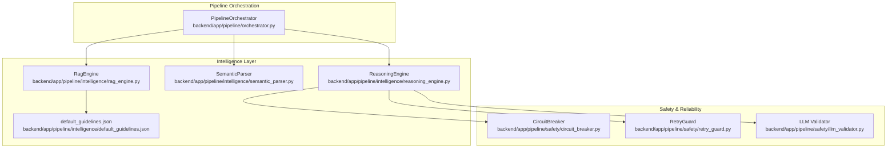
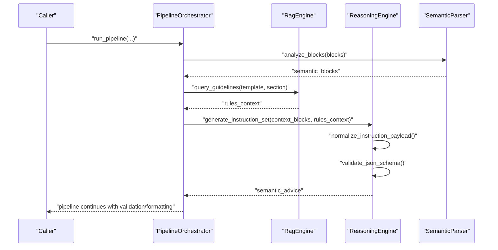
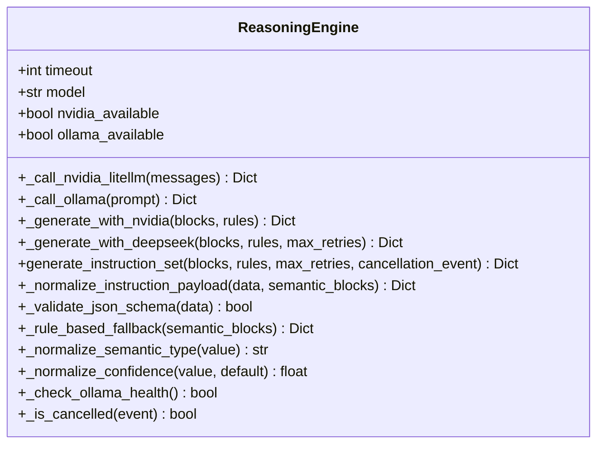
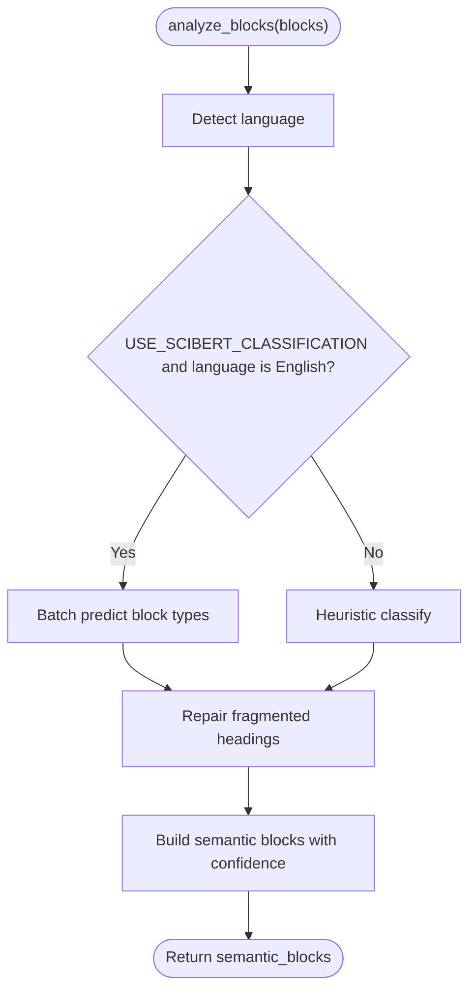
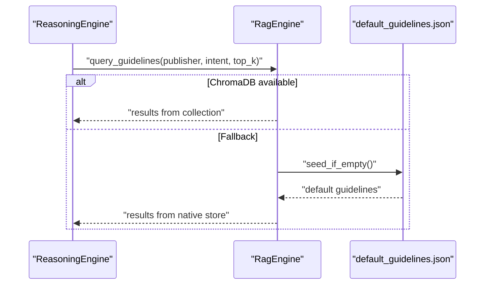
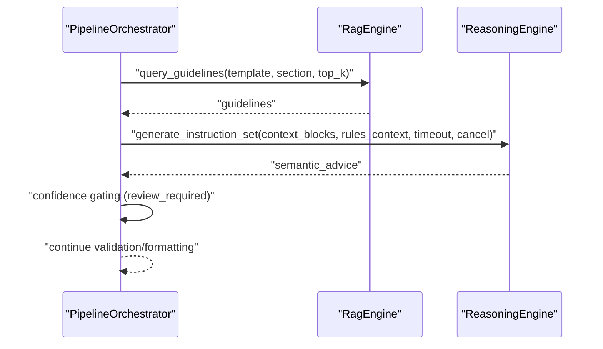
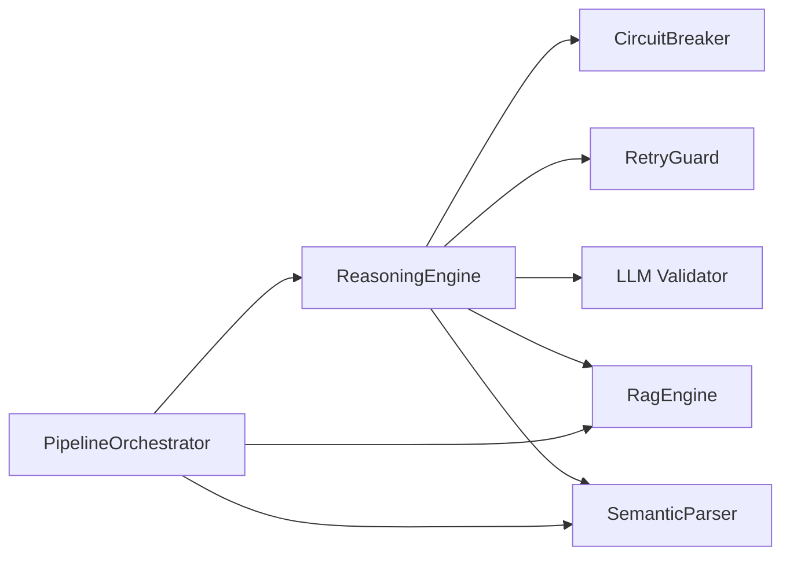

# Reasoning Engine

<cite>
**Referenced Files in This Document**
- [reasoning_engine.py](file://backend/app/pipeline/intelligence/reasoning_engine.py)
- [semantic_parser.py](file://backend/app/pipeline/intelligence/semantic_parser.py)
- [rag_engine.py](file://backend/app/pipeline/intelligence/rag_engine.py)
- [default_guidelines.json](file://backend/app/pipeline/intelligence/default_guidelines.json)
- [orchestrator.py](file://backend/app/pipeline/orchestrator.py)
- [circuit_breaker.py](file://backend/app/pipeline/safety/circuit_breaker.py)
- [retry_guard.py](file://backend/app/pipeline/safety/retry_guard.py)
- [llm_validator.py](file://backend/app/pipeline/safety/llm_validator.py)
- [test_reasoning_engine.py](file://backend/tests/test_reasoning_engine.py)
- [test_semantic_parser.py](file://backend/tests/test_semantic_parser.py)
</cite>

## Table of Contents
1. [Introduction](#introduction)
2. [Project Structure](#project-structure)
3. [Core Components](#core-components)
4. [Architecture Overview](#architecture-overview)
5. [Detailed Component Analysis](#detailed-component-analysis)
6. [Dependency Analysis](#dependency-analysis)
7. [Performance Considerations](#performance-considerations)
8. [Troubleshooting Guide](#troubleshooting-guide)
9. [Conclusion](#conclusion)

## Introduction
This document describes the reasoning engine responsible for complex document analysis and decision-making in the automated academic manuscript formatting pipeline. It explains semantic parsing capabilities, logical reasoning workflows, multi-step problem solving, and integration with the semantic parser for structured content extraction. It covers the rule-based reasoning system, constraint satisfaction, conflict resolution mechanisms, examples of reasoning workflows, debugging techniques, and performance optimization strategies. It also documents integration with other pipeline components and error handling approaches.

## Project Structure
The reasoning engine lives in the intelligence layer alongside the semantic parser and RAG engine. The orchestrator coordinates these components and integrates them into the broader pipeline.

**Diagram sources**
- [reasoning_engine.py](file://backend/app/pipeline/intelligence/reasoning_engine.py)
- [semantic_parser.py](file://backend/app/pipeline/intelligence/semantic_parser.py)
- [rag_engine.py](file://backend/app/pipeline/intelligence/rag_engine.py)
- [default_guidelines.json](file://backend/app/pipeline/intelligence/default_guidelines.json)
- [orchestrator.py](file://backend/app/pipeline/orchestrator.py)
- [circuit_breaker.py](file://backend/app/pipeline/safety/circuit_breaker.py)
- [retry_guard.py](file://backend/app/pipeline/safety/retry_guard.py)
- [llm_validator.py](file://backend/app/pipeline/safety/llm_validator.py)

**Section sources**
- [reasoning_engine.py](file://backend/app/pipeline/intelligence/reasoning_engine.py)
- [semantic_parser.py](file://backend/app/pipeline/intelligence/semantic_parser.py)
- [rag_engine.py](file://backend/app/pipeline/intelligence/rag_engine.py)
- [default_guidelines.json](file://backend/app/pipeline/intelligence/default_guidelines.json)
- [orchestrator.py](file://backend/app/pipeline/orchestrator.py)

## Core Components
- ReasoningEngine: Multi-tier LLM reasoning with automatic fallbacks, JSON schema validation, normalization, and circuit breaker integration.
- SemanticParser: NLP foundation layer that classifies blocks and repairs fragmented headings; supports transformer-based classification and heuristic fallback.
- RagEngine: Local RAG engine that retrieves publisher-specific formatting guidelines and seeds default rules.
- PipelineOrchestrator: Integrates the reasoning engine with semantic parsing and RAG to produce semantic instruction sets and confidence-gated advice.

Key responsibilities:
- Structured content extraction and normalization
- Publisher rule retrieval and contextualization
- Multi-tier reasoning with fallbacks (NVIDIA → Ollama → Rule-based)
- JSON schema validation and confidence normalization
- Safety nets: circuit breaker, retry guards, and LLM output validation

**Section sources**
- [reasoning_engine.py](file://backend/app/pipeline/intelligence/reasoning_engine.py)
- [semantic_parser.py](file://backend/app/pipeline/intelligence/semantic_parser.py)
- [rag_engine.py](file://backend/app/pipeline/intelligence/rag_engine.py)
- [orchestrator.py](file://backend/app/pipeline/orchestrator.py)

## Architecture Overview
The reasoning engine participates in Phase 2–4 of the pipeline:
- Phase 2.7: AI reasoning layer (optional) retrieves publisher rules from RAG and applies the reasoning engine to produce semantic instruction sets.
- Phase 3: Validation and formatting use the semantic advice to guide decisions and flag items requiring human review.

**Diagram sources**
- [orchestrator.py](file://backend/app/pipeline/orchestrator.py)
- [rag_engine.py](file://backend/app/pipeline/intelligence/rag_engine.py)
- [reasoning_engine.py](file://backend/app/pipeline/intelligence/reasoning_engine.py)
- [semantic_parser.py](file://backend/app/pipeline/intelligence/semantic_parser.py)

## Detailed Component Analysis

### ReasoningEngine
The ReasoningEngine orchestrates LLM reasoning with three tiers:
- Tier 1: NVIDIA NIM (primary high-intelligence)
- Tier 2: Ollama (fallback local intelligence)
- Tier 3: Heuristic rules (safety net)

It performs:
- Semantic block normalization and confidence coercion
- JSON schema validation and payload normalization
- Circuit breaker integration with rule-based fallback
- Retry logic and timeout protection
- Latency tracking and optional metrics recording

**Diagram sources**
- [reasoning_engine.py](file://backend/app/pipeline/intelligence/reasoning_engine.py)

Key workflows:
- Multi-step reasoning with batched block processing
- Automatic fallback chain: NVIDIA → Ollama → Rule-based
- JSON schema validation and normalization
- Confidence normalization and canonical section naming

Integration points:
- Orchestrator invokes generate_instruction_set with a small context window of blocks and publisher rules
- Uses circuit breaker and retry guards for resilience
- Emits latency and model metadata for observability

**Section sources**
- [reasoning_engine.py](file://backend/app/pipeline/intelligence/reasoning_engine.py)
- [orchestrator.py](file://backend/app/pipeline/orchestrator.py)
- [circuit_breaker.py](file://backend/app/pipeline/safety/circuit_breaker.py)
- [retry_guard.py](file://backend/app/pipeline/safety/retry_guard.py)
- [llm_validator.py](file://backend/app/pipeline/safety/llm_validator.py)

### SemanticParser
The SemanticParser provides a semantic classification layer that:
- Repairs fragmented headings heuristically
- Classifies blocks using SciBERT when available and appropriate
- Falls back to deterministic heuristics when transformers are disabled or unsupported
- Detects language and conditionally enables transformer inference

**Diagram sources**
- [semantic_parser.py](file://backend/app/pipeline/intelligence/semantic_parser.py)

**Section sources**
- [semantic_parser.py](file://backend/app/pipeline/intelligence/semantic_parser.py)

### RagEngine and Publisher Rules
The RagEngine retrieves publisher-specific formatting guidelines and seeds default rules from a JSON file. It supports:
- Primary embedding model (BGE-M3) with fallback (BGE-small)
- Native deterministic fallback when transformers are unavailable
- ChromaDB-backed storage with graceful native fallback

**Diagram sources**
- [rag_engine.py](file://backend/app/pipeline/intelligence/rag_engine.py)
- [default_guidelines.json](file://backend/app/pipeline/intelligence/default_guidelines.json)

**Section sources**
- [rag_engine.py](file://backend/app/pipeline/intelligence/rag_engine.py)
- [default_guidelines.json](file://backend/app/pipeline/intelligence/default_guidelines.json)

### PipelineOrchestrator Integration
The orchestrator coordinates:
- Semantic parsing to enrich block metadata with semantic intents and confidence
- RAG retrieval to assemble publisher rules into a context string
- Reasoning engine invocation with a bounded context window and timeout
- Confidence gating to mark items needing human review

**Diagram sources**
- [orchestrator.py](file://backend/app/pipeline/orchestrator.py)
- [rag_engine.py](file://backend/app/pipeline/intelligence/rag_engine.py)
- [reasoning_engine.py](file://backend/app/pipeline/intelligence/reasoning_engine.py)

**Section sources**
- [orchestrator.py](file://backend/app/pipeline/orchestrator.py)

## Dependency Analysis
The reasoning engine depends on:
- LLM backends (NVIDIA NIM via LiteLLM or direct client, Ollama)
- Safety utilities (circuit breaker, retry guards, LLM validator)
- RAG engine for publisher rules
- Semantic parser for initial semantic classification

**Diagram sources**
- [reasoning_engine.py](file://backend/app/pipeline/intelligence/reasoning_engine.py)
- [circuit_breaker.py](file://backend/app/pipeline/safety/circuit_breaker.py)
- [retry_guard.py](file://backend/app/pipeline/safety/retry_guard.py)
- [llm_validator.py](file://backend/app/pipeline/safety/llm_validator.py)
- [rag_engine.py](file://backend/app/pipeline/intelligence/rag_engine.py)
- [semantic_parser.py](file://backend/app/pipeline/intelligence/semantic_parser.py)
- [orchestrator.py](file://backend/app/pipeline/orchestrator.py)

**Section sources**
- [reasoning_engine.py](file://backend/app/pipeline/intelligence/reasoning_engine.py)
- [circuit_breaker.py](file://backend/app/pipeline/safety/circuit_breaker.py)
- [retry_guard.py](file://backend/app/pipeline/safety/retry_guard.py)
- [llm_validator.py](file://backend/app/pipeline/safety/llm_validator.py)
- [rag_engine.py](file://backend/app/pipeline/intelligence/rag_engine.py)
- [semantic_parser.py](file://backend/app/pipeline/intelligence/semantic_parser.py)
- [orchestrator.py](file://backend/app/pipeline/orchestrator.py)

## Performance Considerations
- Batch processing: The reasoning engine processes blocks in chunks to balance throughput and latency.
- Timeout controls: Configurable timeouts for NVIDIA and Ollama calls prevent resource starvation.
- Retry with exponential backoff: Reduces transient failure impact without overloading external systems.
- Confidence gating: Low-confidence items are flagged for review, reducing downstream rework.
- Lazy model loading: SemanticParser and RagEngine defer heavy model initialization until needed.
- Circuit breaker: Prevents cascading failures by tripping on repeated errors and invoking rule-based fallback.

[No sources needed since this section provides general guidance]

## Troubleshooting Guide
Common issues and resolutions:
- Ollama unreachable: The engine checks health and auto-selects a model; if none found, it falls back to rule-based classification.
- Invalid LLM output: JSON schema validation ensures robustness; invalid payloads trigger fallback.
- Circuit breaker open: On repeated failures, the breaker trips and invokes a rule-based fallback.
- Transient failures: Retry guards apply exponential backoff to recover from temporary network or service issues.
- Timeout handling: The orchestrator bounds reasoning time and cancels long-running operations.

Debugging techniques:
- Inspect normalized payloads and confidence values to diagnose misclassification.
- Enable logging to trace fallback decisions and latency metrics.
- Use unit tests to simulate failure modes and verify fallback behavior.

**Section sources**
- [test_reasoning_engine.py](file://backend/tests/test_reasoning_engine.py)
- [test_semantic_parser.py](file://backend/tests/test_semantic_parser.py)
- [reasoning_engine.py](file://backend/app/pipeline/intelligence/reasoning_engine.py)
- [circuit_breaker.py](file://backend/app/pipeline/safety/circuit_breaker.py)
- [retry_guard.py](file://backend/app/pipeline/safety/retry_guard.py)
- [llm_validator.py](file://backend/app/pipeline/safety/llm_validator.py)

## Conclusion
The reasoning engine provides a robust, multi-tiered approach to document analysis and decision-making. By combining semantic parsing, RAG-driven rule retrieval, and resilient LLM reasoning with comprehensive fallbacks, it ensures reliable operation under varied conditions. Its integration with the orchestrator enables confidence-gated advice and efficient multi-step problem solving across academic manuscript formatting workflows.