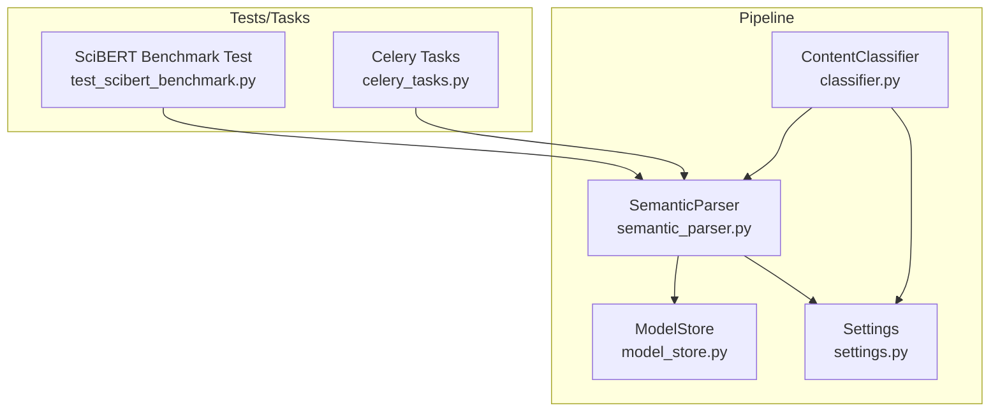
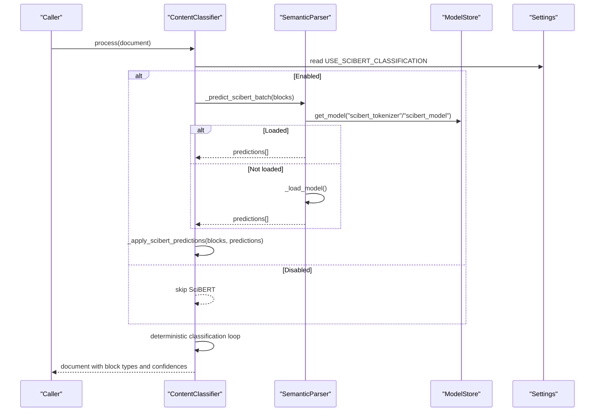
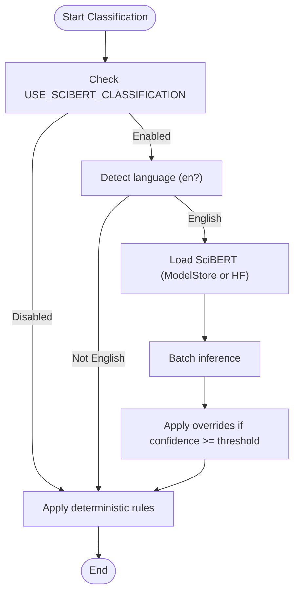
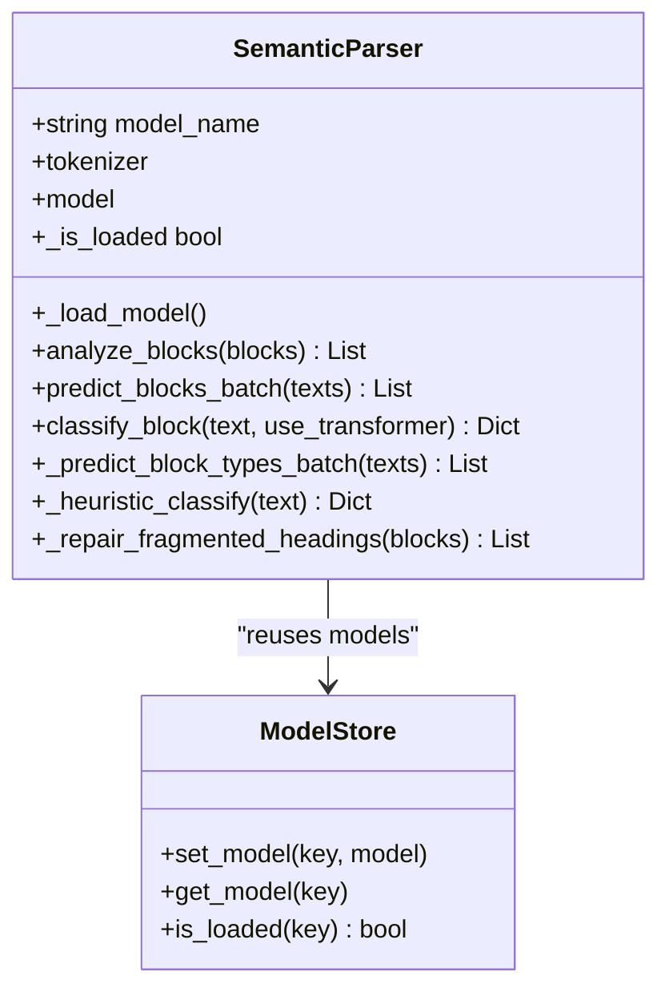
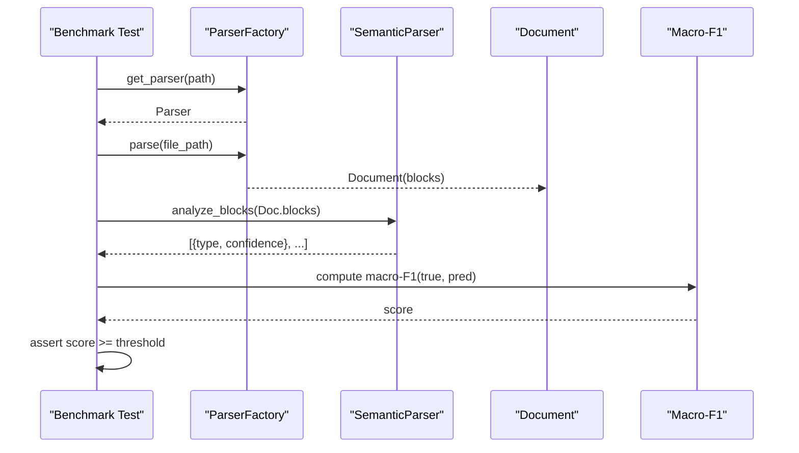
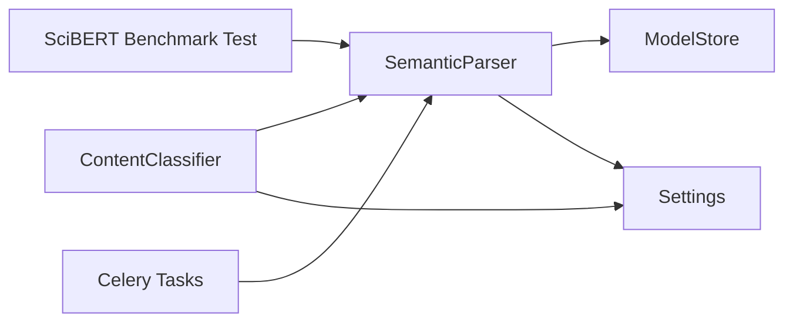

# SciBERT Classification

<cite>
**Referenced Files in This Document**
- [classifier.py](file://backend/app/pipeline/classification/classifier.py)
- [semantic_parser.py](file://backend/app/pipeline/intelligence/semantic_parser.py)
- [settings.py](file://backend/app/config/settings.py)
- [model_store.py](file://backend/app/services/model_store.py)
- [test_scibert_benchmark.py](file://backend/tests/test_scibert_benchmark.py)
- [celery_tasks.py](file://backend/app/tasks/celery_tasks.py)
- [README.md](file://backend/manual_tests/sample_inputs/README.md)
</cite>

## Table of Contents
1. [Introduction](#introduction)
2. [Project Structure](#project-structure)
3. [Core Components](#core-components)
4. [Architecture Overview](#architecture-overview)
5. [Detailed Component Analysis](#detailed-component-analysis)
6. [Dependency Analysis](#dependency-analysis)
7. [Performance Considerations](#performance-considerations)
8. [Troubleshooting Guide](#troubleshooting-guide)
9. [Conclusion](#conclusion)
10. [Appendices](#appendices)

## Introduction
This document explains the SciBERT-based classification system used in the automated manuscript formatter. It covers how SciBERT integrates with a hybrid classification pipeline, how domain-specific labels are mapped to document block types, and how confidence scores and thresholds are applied. It also describes evaluation procedures, performance characteristics, and operational practices such as model loading, feature flags, and benchmarking.

## Project Structure
The classification system spans several modules:
- A rule-based ContentClassifier that orchestrates classification across document zones (front matter, body, references) and optionally refines results with SciBERT.
- A SemanticParser that loads and runs SciBERT for block-level classification and can fall back to deterministic heuristics.
- A global ModelStore that caches loaded models for reuse across requests.
- Configuration-driven feature flags and thresholds controlling SciBERT usage and confidence thresholds.
- Tests and tasks that evaluate macro-F1 performance against labeled fixtures.

**Diagram sources**
- [classifier.py:22-236](file://backend/app/pipeline/classification/classifier.py#L22-L236)
- [semantic_parser.py:32-82](file://backend/app/pipeline/intelligence/semantic_parser.py#L32-L82)
- [model_store.py:4-33](file://backend/app/services/model_store.py#L4-L33)
- [settings.py:185-187](file://backend/app/config/settings.py#L185-L187)
- [test_scibert_benchmark.py:49-92](file://backend/tests/test_scibert_benchmark.py#L49-L92)
- [celery_tasks.py:241-268](file://backend/app/tasks/celery_tasks.py#L241-L268)

**Section sources**
- [classifier.py:1-830](file://backend/app/pipeline/classification/classifier.py#L1-L830)
- [semantic_parser.py:1-306](file://backend/app/pipeline/intelligence/semantic_parser.py#L1-L306)
- [settings.py:118-187](file://backend/app/config/settings.py#L118-L187)
- [model_store.py:1-33](file://backend/app/services/model_store.py#L1-L33)
- [test_scibert_benchmark.py:1-92](file://backend/tests/test_scibert_benchmark.py#L1-L92)
- [celery_tasks.py:241-268](file://backend/app/tasks/celery_tasks.py#L241-L268)

## Core Components
- ContentClassifier: Applies deterministic rules across front matter, body, and references, then optionally refines with SciBERT batch predictions. It preserves structural anchors (e.g., TITLE) and guards protected regions (headers, footers, footnotes).
- SemanticParser: Loads SciBERT tokenizer and model (optionally from a global ModelStore), performs batch inference, and maps logits to internal labels. Falls back to heuristics when disabled or unavailable.
- ModelStore: Singleton registry caching SciBERT tokenizer and model for fast reuse.
- Settings: Feature flag USE_SCIBERT_CLASSIFICATION and confidence thresholds (HEURISTIC_CONFIDENCE_HIGH/MEDIUM/LOW) control behavior.
- Tests/Tasks: Macro-F1 benchmark evaluates aggregated performance across labeled fixtures.

**Section sources**
- [classifier.py:22-236](file://backend/app/pipeline/classification/classifier.py#L22-L236)
- [semantic_parser.py:32-82](file://backend/app/pipeline/intelligence/semantic_parser.py#L32-L82)
- [model_store.py:4-33](file://backend/app/services/model_store.py#L4-L33)
- [settings.py:118-187](file://backend/app/config/settings.py#L118-L187)
- [test_scibert_benchmark.py:17-31](file://backend/tests/test_scibert_benchmark.py#L17-L31)

## Architecture Overview
The classification pipeline combines structure-aware heuristics with optional transformer inference:

**Diagram sources**
- [classifier.py:137-173](file://backend/app/pipeline/classification/classifier.py#L137-L173)
- [semantic_parser.py:44-82](file://backend/app/pipeline/intelligence/semantic_parser.py#L44-L82)
- [model_store.py:19-29](file://backend/app/services/model_store.py#L19-L29)
- [settings.py:185-187](file://backend/app/config/settings.py#L185-L187)

## Detailed Component Analysis

### ContentClassifier
- Zones and anchors:
  - Front matter: Title, Authors, Affiliations, Acknowledgments, Funding, Conflict of Interest.
  - Body: Sections inferred from headings and context.
  - References: Headings and entries detected deterministically.
- SciBERT integration:
  - Batch inference is gated by USE_SCIBERT_CLASSIFICATION and English-language detection.
  - Predictions are persisted to block metadata and conditionally override low-specificity assignments.
  - Minimum confidence threshold is derived from settings.
- Deterministic rules:
  - Strong regex and keyword heuristics for captions, headings, author/affiliation detection.
  - GROBID metadata integration for front matter when available.
- Confidence scoring:
  - Uses structured thresholds and NLP-derived confidence where available.

**Diagram sources**
- [classifier.py:137-173](file://backend/app/pipeline/classification/classifier.py#L137-L173)
- [semantic_parser.py:44-82](file://backend/app/pipeline/intelligence/semantic_parser.py#L44-L82)
- [settings.py:185-187](file://backend/app/config/settings.py#L185-L187)

**Section sources**
- [classifier.py:22-638](file://backend/app/pipeline/classification/classifier.py#L22-L638)

### SemanticParser
- Model lifecycle:
  - Lazy-load tokenizer and model on demand.
  - Prefer pre-loaded models from ModelStore to avoid repeated initialization.
- Inference:
  - Batch inference with softmax over logits; maps indices to internal labels.
  - Heuristic fallback when transformer inference is disabled or fails.
- Language gating:
  - Skips transformer inference for non-English documents.

**Diagram sources**
- [semantic_parser.py:32-82](file://backend/app/pipeline/intelligence/semantic_parser.py#L32-L82)
- [model_store.py:4-33](file://backend/app/services/model_store.py#L4-L33)

**Section sources**
- [semantic_parser.py:32-306](file://backend/app/pipeline/intelligence/semantic_parser.py#L32-L306)

### ModelStore
- Thread-safe singleton registry storing SciBERT tokenizer and model after initial load.
- Enables reuse across requests and tasks.

**Section sources**
- [model_store.py:4-33](file://backend/app/services/model_store.py#L4-L33)

### Settings and Thresholds
- USE_SCIBERT_CLASSIFICATION: feature flag to enable/disable transformer inference.
- HEURISTIC_CONFIDENCE_HIGH/MEDIUM/LOW: baseline confidence values used by deterministic rules.
- Language detection: optional dependency used to gate transformer inference.

**Section sources**
- [settings.py:118-187](file://backend/app/config/settings.py#L118-L187)

### Evaluation and Benchmarking
- Macro-F1 benchmark aggregates per-paper F1 and asserts a minimum threshold.
- Uses labeled fixtures to compare predicted vs. ground-truth labels.
- Supports switching between a real SciBERT model and a heuristic fallback for local runs.

**Diagram sources**
- [test_scibert_benchmark.py:49-92](file://backend/tests/test_scibert_benchmark.py#L49-L92)
- [semantic_parser.py:107-159](file://backend/app/pipeline/intelligence/semantic_parser.py#L107-L159)

**Section sources**
- [test_scibert_benchmark.py:1-92](file://backend/tests/test_scibert_benchmark.py#L1-L92)

### Celery Tasks and Batch Scoring
- Celery tasks compute macro-F1 across multiple papers using fixtures and a configurable model path.
- Provides a programmatic way to evaluate performance in batch environments.

**Section sources**
- [celery_tasks.py:241-268](file://backend/app/tasks/celery_tasks.py#L241-L268)

## Dependency Analysis
- ContentClassifier depends on:
  - SemanticParser for optional batch inference.
  - Settings for feature flags and confidence thresholds.
  - ModelStore indirectly via SemanticParser.
- SemanticParser depends on:
  - Transformers for tokenizer/model.
  - ModelStore for cached models.
  - Settings for feature flags and language detection.
- Tests depend on:
  - ParserFactory to construct documents from fixture files.
  - SemanticParser to produce predictions.

**Diagram sources**
- [classifier.py:137-173](file://backend/app/pipeline/classification/classifier.py#L137-L173)
- [semantic_parser.py:44-82](file://backend/app/pipeline/intelligence/semantic_parser.py#L44-L82)
- [model_store.py:19-29](file://backend/app/services/model_store.py#L19-L29)
- [settings.py:185-187](file://backend/app/config/settings.py#L185-L187)
- [test_scibert_benchmark.py:49-92](file://backend/tests/test_scibert_benchmark.py#L49-L92)
- [celery_tasks.py:241-268](file://backend/app/tasks/celery_tasks.py#L241-L268)

**Section sources**
- [classifier.py:137-173](file://backend/app/pipeline/classification/classifier.py#L137-L173)
- [semantic_parser.py:44-82](file://backend/app/pipeline/intelligence/semantic_parser.py#L44-L82)
- [test_scibert_benchmark.py:49-92](file://backend/tests/test_scibert_benchmark.py#L49-L92)

## Performance Considerations
- Lazy loading and ModelStore reuse reduce cold-start latency and memory footprint.
- Batch inference minimizes per-request overhead compared to per-block calls.
- Language gating avoids unnecessary inference on non-English documents.
- Macro-F1 benchmark ensures sustained performance across domains.

[No sources needed since this section provides general guidance]

## Troubleshooting Guide
- SciBERT disabled or unavailable:
  - Ensure USE_SCIBERT_CLASSIFICATION is enabled in settings.
  - Confirm model is present in ModelStore or can be loaded from Hugging Face.
- Non-English documents:
  - Language detection may skip transformer inference; switch to heuristic-only mode.
- Low-confidence overrides:
  - Adjust minimum confidence threshold and verify protected structural blocks are not overridden.
- Benchmark failures:
  - Verify fixture labels exist and model path is correct; use heuristic fallback for local runs.

**Section sources**
- [classifier.py:137-173](file://backend/app/pipeline/classification/classifier.py#L137-L173)
- [semantic_parser.py:44-82](file://backend/app/pipeline/intelligence/semantic_parser.py#L44-L82)
- [test_scibert_benchmark.py:33-43](file://backend/tests/test_scibert_benchmark.py#L33-L43)

## Conclusion
The SciBERT classification system blends robust deterministic heuristics with optional transformer inference. It is designed for reliability, performance, and maintainability, with clear feature flags, confidence thresholds, and evaluation mechanisms. The hybrid approach ensures strong performance across diverse academic documents while preserving structural anchors and minimizing risk.

[No sources needed since this section summarizes without analyzing specific files]

## Appendices

### Classification Pipeline and Confidence Scoring
- Pipeline stages:
  - Deterministic classification across front matter, body, and references.
  - Optional SciBERT refinement with confidence thresholding.
  - NLP fallback to integrate semantic parser confidence.
- Confidence scoring:
  - Structured thresholds for deterministic rules.
  - Transformer confidence for overrides.
  - Aggregated confidence for UNKNOWN blocks.

**Section sources**
- [classifier.py:259-638](file://backend/app/pipeline/classification/classifier.py#L259-L638)
- [semantic_parser.py:161-225](file://backend/app/pipeline/intelligence/semantic_parser.py#L161-L225)

### Multi-Label Classification and Domain-Specific Training Data
- Current implementation maps transformer logits to a fixed set of labels suitable for academic document blocks.
- Domain-specific training data is represented by labeled fixtures used in benchmarks; the system expects aligned labels during evaluation.

**Section sources**
- [semantic_parser.py:175-185](file://backend/app/pipeline/intelligence/semantic_parser.py#L175-L185)
- [test_scibert_benchmark.py:17-31](file://backend/tests/test_scibert_benchmark.py#L17-L31)

### Threshold Tuning and Integration Examples
- Threshold tuning:
  - Adjust minimum confidence threshold for SciBERT overrides.
  - Calibrate deterministic thresholds (HEURISTIC_CONFIDENCE_HIGH/MEDIUM/LOW) for different zones.
- Integration examples:
  - Use labeled fixtures to evaluate macro-F1 and iterate on thresholds.
  - Run benchmark tests locally with a heuristic fallback model.

**Section sources**
- [classifier.py:72-72](file://backend/app/pipeline/classification/classifier.py#L72-L72)
- [settings.py:121-123](file://backend/app/config/settings.py#L121-L123)
- [test_scibert_benchmark.py:39-43](file://backend/tests/test_scibert_benchmark.py#L39-L43)

### Model Versioning, Retraining, and Quality Assurance
- Model versioning:
  - Use distinct model_name values to select different SciBERT variants or fine-tuned heads.
- Retraining procedures:
  - Prepare labeled datasets aligned with internal labels; evaluate with macro-F1 benchmark.
- Quality assurance:
  - Continuous evaluation via benchmark tests and Celery tasks.
  - Manual sample inputs for exploratory testing.

**Section sources**
- [semantic_parser.py:38-42](file://backend/app/pipeline/intelligence/semantic_parser.py#L38-L42)
- [test_scibert_benchmark.py:49-92](file://backend/tests/test_scibert_benchmark.py#L49-L92)
- [README.md:1-78](file://backend/manual_tests/sample_inputs/README.md#L1-L78)