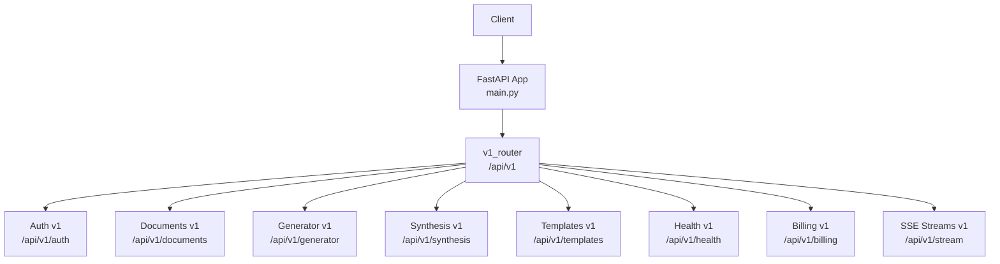
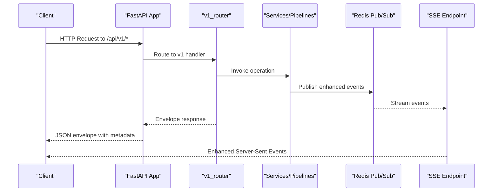
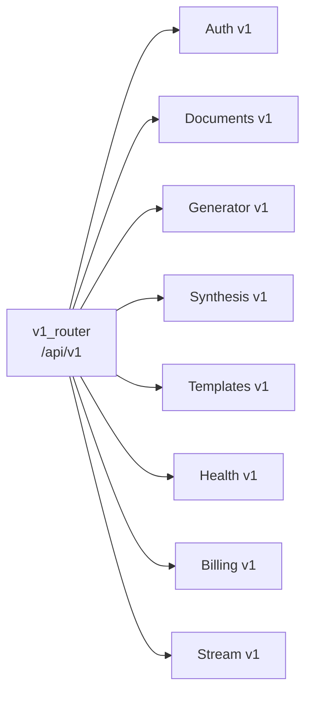

# API Reference

<cite>
**Referenced Files in This Document**
- [main.py](file://backend/app/main.py)
- [v1/__init__.py](file://backend/app/routers/v1/__init__.py)
- [auth.py](file://backend/app/routers/v1/auth.py)
- [documents.py](file://backend/app/routers/v1/documents.py)
- [generator.py](file://backend/app/routers/v1/generator.py)
- [synthesis.py](file://backend/app/routers/v1/synthesis.py)
- [templates.py](file://backend/app/routers/v1/templates.py)
- [health.py](file://backend/app/routers/v1/health.py)
- [billing.py](file://backend/app/routers/v1/billing.py)
- [stream.py](file://backend/app/routers/v1/stream.py)
- [_helpers.py](file://backend/app/routers/v1/_helpers.py)
</cite>

## Update Summary
**Changes Made**
- Updated all endpoint paths to use /api/v1/ prefix as part of complete API migration
- Removed references to legacy endpoints (/api/auth, /api/feedback, /api/generator, /api/metrics, /api/templates)
- Consolidated functionality into new v1 router structure
- Updated architectural diagrams to reflect new v1-only routing
- Enhanced real-time capabilities documentation for SSE streams

## Table of Contents
1. [Introduction](#introduction)
2. [Project Structure](#project-structure)
3. [Core Components](#core-components)
4. [Architecture Overview](#architecture-overview)
5. [Detailed Component Analysis](#detailed-component-analysis)
6. [Dependency Analysis](#dependency-analysis)
7. [Performance Considerations](#performance-considerations)
8. [Troubleshooting Guide](#troubleshooting-guide)
9. [Conclusion](#conclusion)
10. [Appendices](#appendices)

## Introduction
This document provides comprehensive API documentation for the backend REST endpoints and real-time communication protocols. It covers:
- REST endpoints for document processing, template management, generation, synthesis, and health/billing under the unified /api/v1/ structure
- Real-time Server-Sent Events (SSE) for live updates
- Authentication and authorization requirements
- Request/response schemas, parameters, validation rules, and error codes
- Practical examples, client integration patterns, rate limiting, versioning, and backwards compatibility

**Updated** All endpoints now use the /api/v1/ prefix as part of the complete API migration to version 1 structure.

## Project Structure
The backend is a FastAPI application with a unified versioned API surface under /api/v1. All functionality is now consolidated into the v1 router structure with enhanced real-time capabilities.



**Diagram sources**
- [main.py:496-502](file://backend/app/main.py#L496-L502)
- [v1/__init__.py:18-28](file://backend/app/routers/v1/__init__.py#L18-L28)

**Section sources**
- [main.py:496-502](file://backend/app/main.py#L496-L502)
- [v1/__init__.py:18-28](file://backend/app/routers/v1/__init__.py#L18-L28)

## Core Components
- Unified Versioned API: All primary features are exposed under /api/v1 with comprehensive envelope support for standardized responses and error codes
- Enhanced Real-time Streaming: Redis-backed SSE for job/session events with improved event types and payload structures
- Centralized Envelope Helpers: Consistent success/error response builders and HTTP exception mapping across all v1 endpoints
- Consolidated Router Structure: All functionality now lives under the v1 router with proper prefixing and tag organization

Key envelope behavior:
- Success responses wrap data with a request-scoped identifier and standardized metadata
- Error responses map HTTP status codes to named codes and include request context with enhanced debugging information

**Section sources**
- [_helpers.py:15-122](file://backend/app/routers/v1/_helpers.py#L15-L122)
- [health.py:17-42](file://backend/app/routers/v1/health.py#L17-L42)

## Architecture Overview
The API follows a unified layered design with all endpoints under /api/v1:
- Single v1_router manages all endpoint routing with proper prefixing
- Services orchestrate business logic and integrate with external systems
- Pipelines handle document processing, generation, and synthesis
- Real-time subsystem emits enhanced events via Redis Pub/Sub to SSE clients



**Diagram sources**
- [main.py:496-502](file://backend/app/main.py#L496-L502)
- [stream.py:32-95](file://backend/app/routers/v1/stream.py#L32-L95)
- [generator.py:401-433](file://backend/app/routers/v1/generator.py#L401-L433)
- [synthesis.py:174-206](file://backend/app/routers/v1/synthesis.py#L174-L206)

## Detailed Component Analysis

### Authentication and Authorization
- Base path: /api/v1/auth
- Requires Supabase authentication; endpoints return user info or manage auth lifecycle
- Protected endpoints require a valid session with enhanced error handling

Endpoints:
- GET /api/v1/auth/me → Returns authenticated user info with enhanced profile data
- POST /api/v1/auth/signup → Triggers Supabase sign-up flow with validation
- POST /api/v1/auth/login → Triggers Supabase login flow with session management
- POST /api/v1/auth/forgot-password → Triggers OTP-based password reset initiation
- POST /api/v1/auth/verify-otp → Stateless OTP verification with enhanced security
- POST /api/v1/auth/reset-password → Finalizes password reset with validation

Validation and errors:
- Schema-driven validation ensures required fields and constraints with enhanced error messages
- Typical errors: 400 invalid input, 401 unauthorized, 422 validation error, 500 internal error
- Enhanced error codes with detailed context for debugging

Example request:
- POST /api/v1/auth/login with JSON body containing email and password

Response envelope:
- Success: 200 OK with envelope-wrapped data including request metadata
- Errors: 4xx mapped to named error codes via enhanced envelope helpers

**Section sources**
- [auth.py:15-59](file://backend/app/routers/v1/auth.py#L15-L59)

### Documents API (v1)
Base path: /api/v1/documents

Endpoints:
- POST /api/v1/documents/upload
  - Upload a single document; returns job_id and initial status with enhanced metadata
  - Form fields: template, add_page_numbers, add_borders, add_cover_page, generate_toc, add_line_numbers, line_spacing, page_size, fast_mode
  - File field: file (multipart/form-data) with enhanced validation
  - Validation: file type, size, magic bytes, path traversal checks with improved error reporting
  - Ownership: requires authenticated user with enhanced access control
  - Response: envelope-wrapped job metadata with detailed status information

- POST /api/v1/documents/upload/chunked
  - Upload large files in chunks; validates chunk size and reassembly limits with enhanced error handling
  - Form fields: file_id, chunk_index, total_chunks, template, formatting options
  - Validation: chunk size ≤ 5MB, total size ≤ configured MAX_FILE_SIZE with detailed error messages
  - Response: completion payload with job_id and file hash including processing metadata

- GET /api/v1/documents
  - List user's documents with filters: status, template, date range with enhanced pagination
  - Pagination: limit (1–100), offset with improved performance
  - Response: envelope-wrapped array with total count and enhanced filtering options

- GET /api/v1/documents/{jobId}/status
  - Detailed processing status with enhanced phases and progress tracking
  - Ownership check: returns 403 if not owner with improved error messaging
  - Response: envelope-wrapped status object with detailed progress information

- GET /api/v1/documents/{jobId}/summary
  - Lightweight summary for hydration with enhanced data structure
  - Response: envelope-wrapped summary with additional metadata

- POST /api/v1/documents/{jobId}/edit
  - Submit edited structured data to re-run formatting with enhanced validation
  - Body: edited_structured_data with improved schema validation
  - Response: envelope-wrapped status with detailed processing information

- GET /api/v1/documents/{jobId}/preview
  - Structured preview data and quality metrics with enhanced visualization
  - Response: envelope-wrapped preview object with improved data structure

- GET /api/v1/documents/{jobId}/compare
  - Side-by-side comparison data with enhanced formatting
  - Response: envelope-wrapped comparison object with detailed differences

- GET /api/v1/documents/{jobId}/download
  - Download formatted document; supports docx/pdf with enhanced security
  - Query params: format (docx|pdf), token, expires (optional signed URLs with enhanced validation)
  - Response: binary attachment or error with improved error handling

- DELETE /api/v1/documents/{jobId}
  - Delete a document job with enhanced cascade handling
  - Response: envelope-wrapped deletion result with confirmation details

- POST /api/v1/documents/batch-upload
  - Upload multiple files (2–6) in one request with enhanced validation
  - Response: envelope-wrapped batch metadata with individual file processing status

Validation rules:
- File types: docx, doc, pdf, odt, rtf, tex, txt, html, htm, md, markdown with enhanced magic byte validation
- Text files must be valid UTF-8 with improved encoding detection
- Enhanced size limits enforced via settings with detailed error messages
- Path traversal protection for filenames with improved security checks

Error codes (selected):
- 400 INVALID_UPLOAD_REQUEST, DOCUMENT_TOO_LARGE, DOCUMENT_VALIDATION_FAILED with enhanced error details
- 403 DOCUMENT_ACCESS_DENIED with improved context
- 404 DOCUMENT_NOT_FOUND with detailed identification
- 413 PAYLOAD_TOO_LARGE with specific size limits
- 429 UPLOAD_LIMIT_REACHED with rate limiting details
- 503 DATABASE_UNAVAILABLE with enhanced recovery information

**Section sources**
- [documents.py:32-359](file://backend/app/routers/v1/documents.py#L32-L359)

### Generator API (v1)
Base path: /api/v1/generator

Sessions:
- POST /api/v1/generator/sessions
  - Start a generation session with enhanced configuration options
  - Supports two modes:
    - multi_doc: upload 2–6 files; returns session_id with enhanced metadata
    - agent: requires JSON with session_type=agent and prompt; returns session_id with improved validation
  - Form fields: session_type, template, config (JSON string), files (multipart) with enhanced schema validation
  - Response: envelope-wrapped session metadata with detailed processing information

- GET /api/v1/generator/sessions
  - List recent sessions for the user with enhanced filtering
  - Response: envelope-wrapped sessions array with improved pagination

- GET /api/v1/generator/sessions/{sessionId}
  - Retrieve session details and latest document path with enhanced data
  - Response: envelope-wrapped session object with detailed metadata

- GET /api/v1/generator/sessions/{sessionId}/messages
  - Retrieve conversation history with enhanced message structure
  - Response: envelope-wrapped messages array with improved formatting

- GET /api/v1/generator/sessions/{sessionId}/document
  - Retrieve latest generated document content and metadata with enhanced validation
  - Response: envelope-wrapped document object with detailed processing information

- GET /api/v1/generator/sessions/{sessionId}/download
  - Download generated document (docx/pdf) with enhanced security
  - Response: FileResponse or error with improved error handling

- GET /api/v1/generator/sessions/{sessionId}/events
  - Real-time SSE stream for session events with enhanced event types
  - Response: EventSourceResponse with improved event structure

- POST /api/v1/generator/sessions/{sessionId}/messages
  - Send a message to the session; answers using retrieved sources and LLM with enhanced validation
  - Response: envelope-wrapped assistant reply with sources and improved context

- POST /api/v1/generator/sessions/{sessionId}/outline/approve
  - Approve an outline to resume generation with enhanced validation
  - Response: envelope-wrapped status with detailed processing information

- POST /api/v1/generator/sessions/{sessionId}/stop
  - Stop a running session; updates status and emits SSE with enhanced event handling
  - Response: envelope-wrapped cancellation status with confirmation details

Validation and errors:
- 400 INVALID_EXPORT_FORMAT with enhanced error details
- 403 GENERATION_ACCESS_DENIED with improved context
- 404 SESSION_NOT_FOUND with detailed identification
- 409 SESSION_NOT_READY with enhanced state information
- 422 INVALID_SESSION_REQUEST, INVALID_MESSAGE with improved validation

**Section sources**
- [generator.py:150-573](file://backend/app/routers/v1/generator.py#L150-L573)

### Synthesis API (v1)
Base path: /api/v1/synthesis

Sessions:
- POST /api/v1/synthesis/sessions
  - Create a multi-document synthesis session with enhanced configuration
  - Upload 2–6 files; returns session_id with improved metadata
  - Form fields: files (multipart), session_type (must be multi_doc), template, config (JSON string) with enhanced validation
  - Response: envelope-wrapped session metadata with detailed processing information

- GET /api/v1/synthesis/sessions/{sessionId}
  - Retrieve session details and latest document path with enhanced data
  - Response: envelope-wrapped session object with improved metadata

- GET /api/v1/synthesis/sessions/{sessionId}/events
  - Real-time SSE stream for synthesis events with enhanced event types
  - Response: EventSourceResponse with improved event structure

- POST /api/v1/synthesis/sessions/{sessionId}/messages
  - Ask questions about the synthesized content; answers drawn from stored sources with enhanced validation
  - Response: envelope-wrapped assistant reply with sources and improved context

Validation and errors:
- 400 INVALID_UPLOAD_REQUEST, DOCUMENT_TOO_LARGE with enhanced error details
- 404 SESSION_NOT_FOUND with detailed identification
- 413 PAYLOAD_TOO_LARGE with specific size limits
- 422 INVALID_SESSION_REQUEST, INVALID_MESSAGE with improved validation

**Section sources**
- [synthesis.py:70-260](file://backend/app/routers/v1/synthesis.py#L70-L260)

### Templates API (v1)
Base path: /api/v1/templates

Built-in templates:
- GET /api/v1/templates
  - Lists public built-in templates with enhanced filtering
  - Response: envelope-wrapped templates array with improved metadata

CSL styles:
- GET /api/v1/templates/csl/search?q={query}
  - Search CSL styles by keyword with enhanced search capabilities
  - Response: envelope-wrapped results with improved relevance scoring

- GET /api/v1/templates/csl/fetch?slug={slug}
  - Fetch CSL XML by style slug with enhanced validation
  - Response: envelope-wrapped style XML with improved error handling

- GET /api/v1/templates/csl/{styleId}
  - Fetch CSL XML by style id/slug with enhanced security
  - Response: envelope-wrapped style XML with improved validation

Custom templates (authenticated):
- GET /api/v1/templates/custom
  - List user's custom templates with enhanced filtering
  - Response: envelope-wrapped templates array with improved metadata

- POST /api/v1/templates/custom
  - Create a custom template with enhanced validation
  - Body: template payload with name, description, config/settings with improved schema validation
  - Response: envelope-wrapped created template with detailed confirmation

- PUT /api/v1/templates/custom/{templateId}
  - Update a custom template with enhanced validation
  - Response: envelope-wrapped updated template with confirmation details

- DELETE /api/v1/templates/custom/{templateId}
  - Delete a custom template with enhanced cascade handling
  - Response: envelope-wrapped deletion result with confirmation

Validation and errors:
- 401 UNAUTHORIZED with improved context
- 404 TEMPLATE_NOT_FOUND with detailed identification
- 422 INVALID_TEMPLATE_PAYLOAD with enhanced validation
- 500 TEMPLATE_LIST_FAILED, TEMPLATE_CREATE_FAILED, TEMPLATE_UPDATE_FAILED, TEMPLATE_DELETE_FAILED with improved error details

**Section sources**
- [templates.py:20-189](file://backend/app/routers/v1/templates.py#L20-L189)

### Health and Readiness
Base path: /api/v1/health

- GET /api/v1/health
  - Compatibility health endpoint with enhanced status information
  - Response: envelope-wrapped alive status with detailed system metrics

- GET /api/v1/health/live
  - Liveness probe with enhanced validation
  - Response: envelope-wrapped alive status with improved error handling

- GET /api/v1/health/ready
  - Readiness probe; evaluates database and model readiness with enhanced diagnostics
  - Response: envelope-wrapped readiness payload or detailed error information

**Section sources**
- [health.py:17-42](file://backend/app/routers/v1/health.py#L17-L42)

### Billing Webhooks
Base path: /api/v1/billing

- POST /api/v1/billing/webhook
  - Stripe webhook endpoint with enhanced security
  - Validates signature and updates user billing status and plan tier with improved error handling
  - Response: envelope-wrapped confirmation with detailed processing information

Security:
- Requires STRIPE_WEBHOOK_SECRET and STRIPE_API_KEY configured with enhanced validation
- Updates Supabase profiles with billing metadata and improved error handling

**Section sources**
- [billing.py:52-131](file://backend/app/routers/v1/billing.py#L52-L131)

### Real-Time Communication (SSE)
Base path: /api/v1/stream

- GET /api/v1/stream/{jobId}
  - Subscribe to real-time events for a job with enhanced event types
  - Requires authentication with improved security
  - Emits Server-Sent Events with enhanced event types and payloads
  - On connect, sends a "connected" event with session metadata

Enhanced Usage pattern:
- Clients establish an SSE connection to receive progress updates and notifications
- Events are published to Redis channels and forwarded to connected clients with improved reliability
- Enhanced event types include processing phases, quality metrics, and system status updates

**Section sources**
- [stream.py:32-95](file://backend/app/routers/v1/stream.py#L32-L95)

## Dependency Analysis
The v1 router consolidates all feature-specific routers under the /api/v1 prefix with proper organization and enhanced functionality.



**Diagram sources**
- [v1/__init__.py:18-28](file://backend/app/routers/v1/__init__.py#L18-L28)

**Section sources**
- [v1/__init__.py:18-28](file://backend/app/routers/v1/__init__.py#L18-L28)

## Performance Considerations
- File size limits and chunked uploads reduce memory pressure and improve reliability for large documents with enhanced monitoring
- SSE connections are tracked for metrics with improved resource management; ensure clients disconnect properly to free resources
- Background task dispatch uses Celery when available; otherwise uses background tasks for lightweight flows with enhanced error handling
- Caching of status responses reduces repeated database queries for frequent polling with improved cache strategies
- Enhanced real-time streaming with optimized event delivery and reduced bandwidth usage

## Troubleshooting Guide
Common issues and resolutions:
- 401 Unauthorized: Ensure a valid session is present for protected endpoints with enhanced error messages
- 403 Forbidden: Access denied if not owner of the resource with improved context information
- 404 Not Found: Resource missing; verify identifiers and permissions with detailed error reporting
- 413 Payload Too Large: Reduce file size or split into chunks with specific size recommendations
- 422 Validation Error: Fix input fields according to endpoint requirements with enhanced validation details
- 429 Rate Limited: Implement exponential backoff and adhere to rate limits with improved rate limiting information
- 500 Internal Server Error: Inspect logs and Sentry for unhandled exceptions with enhanced debugging capabilities

Operational checks:
- Use /api/v1/health/ready to verify service readiness with enhanced diagnostics
- Monitor /metrics for latency and queue depths with improved monitoring capabilities

**Section sources**
- [_helpers.py:15-28](file://backend/app/routers/v1/_helpers.py#L15-L28)
- [main.py:508-515](file://backend/app/main.py#L508-L515)

## Conclusion
This API provides a robust, unified interface for document processing, generation, synthesis, and template management under the /api/v1/ structure, with standardized responses, comprehensive validation, and enhanced real-time updates. The migration to v1 provides improved performance, better error handling, and enhanced developer experience while maintaining backwards compatibility through the consolidated router structure.

## Appendices

### Authentication and Authorization
- All authenticated endpoints require a valid session with enhanced security measures
- Token handling and RBAC are enforced via dependencies and middleware with improved access control

**Section sources**
- [auth.py:15-59](file://backend/app/routers/v1/auth.py#L15-L59)

### Rate Limiting and Abuse Detection
- Global rate limiter: 60 requests per minute with enhanced enforcement
- Tier-based rate limiting: guest daily limit configurable with improved tier management
- Abuse detection records generation requests and LLM calls with enhanced monitoring

**Section sources**
- [main.py:384-394](file://backend/app/main.py#L384-L394)
- [generator.py:156-158](file://backend/app/routers/v1/generator.py#L156-L158)

### Versioning and Backwards Compatibility
- v1 is the primary API surface with comprehensive functionality under /api/v1/
- Legacy routes have been migrated to v1 equivalents with enhanced functionality
- Health endpoints remain at /api/v1/health for compatibility with improved status information

**Section sources**
- [v1/__init__.py:18-28](file://backend/app/routers/v1/__init__.py#L18-L28)
- [documents.py:32-83](file://backend/app/routers/v1/documents.py#L32-L83)
- [generator.py:35-46](file://backend/app/routers/v1/generator.py#L35-L46)
- [templates.py:19-30](file://backend/app/routers/v1/templates.py#L19-L30)

### Example Workflows

#### Upload and Process a Document
```http
POST /api/v1/documents/upload
Authorization: Bearer <token>
Content-Type: multipart/form-data

Form fields:
- file: <binary>
- template: "apa"
- add_page_numbers: true
- page_size: "Letter"
```
Response:
- Envelope-wrapped job_id and initial status with enhanced metadata

#### Start a Generation Session (Agent)
```http
POST /api/v1/generator/sessions
Authorization: Bearer <token>
Content-Type: application/json

{
  "session_type": "agent",
  "prompt": "Write a paper on AI in education",
  "template": "apa",
  "config": {}
}
```
Response:
- Envelope-wrapped session_id and status with detailed processing information

#### Subscribe to Session Events
```http
GET /api/v1/generator/sessions/{sessionId}/events
Authorization: Bearer <token>
```
Response:
- Enhanced Server-Sent Events stream with improved event types

#### Download Generated Document
```http
GET /api/v1/generator/sessions/{sessionId}/download?format=pdf
Authorization: Bearer <token>
```
Response:
- Binary PDF file with enhanced security

#### Real-Time Job Updates
```http
GET /api/v1/stream/{jobId}
Authorization: Bearer <token>
```
Response:
- SSE stream of job events with enhanced event types and metadata

**Section sources**
- [documents.py:117-162](file://backend/app/routers/v1/documents.py#L117-L162)
- [generator.py:150-289](file://backend/app/routers/v1/generator.py#L150-L289)
- [stream.py:60-70](file://backend/app/routers/v1/stream.py#L60-L70)