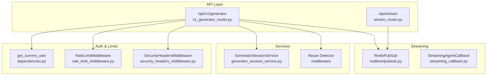
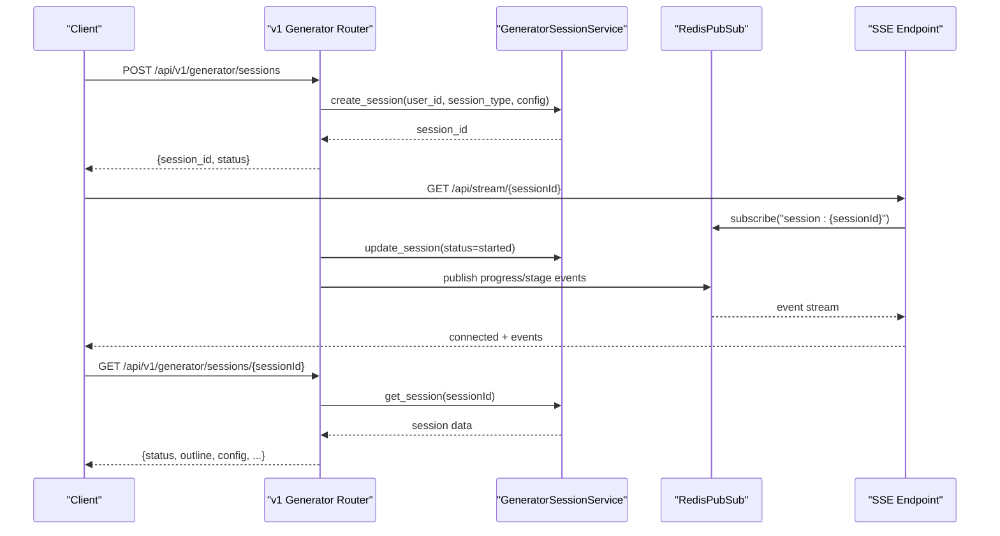
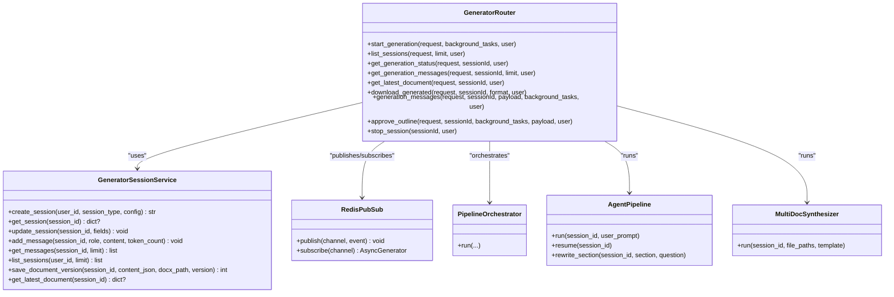

# Document Generator Endpoints

<cite>
**Referenced Files in This Document**
- [v1_generator_router.py](file://backend/app/routers/v1/generator.py)
- [generator_session_schemas.py](file://backend/app/schemas/generator_session.py)
- [generator_session_service.py](file://backend/app/services/generator_session_service.py)
- [stream_router.py](file://backend/app/routers/stream.py)
- [streaming_callback.py](file://backend/app/pipeline/agents/streaming.py)
- [rate_limit_middleware.py](file://backend/app/middleware/rate_limit.py)
- [dependencies.py](file://backend/app/utils/dependencies.py)
- [settings.py](file://backend/app/config/settings.py)
- [security_headers_middleware.py](file://backend/app/middleware/security_headers.py)
</cite>

## Table of Contents
1. [Introduction](#introduction)
2. [Project Structure](#project-structure)
3. [Core Components](#core-components)
4. [Architecture Overview](#architecture-overview)
5. [Detailed Component Analysis](#detailed-component-analysis)
6. [Dependency Analysis](#dependency-analysis)
7. [Performance Considerations](#performance-considerations)
8. [Troubleshooting Guide](#troubleshooting-guide)
9. [Conclusion](#conclusion)

## Introduction
This document provides comprehensive API documentation for the AI document generation system. It covers the new v1 generator endpoints for session-based generation, streaming real-time updates via Server-Sent Events (SSE), and related workflows for content approval and iteration. The documentation includes endpoint specifications, request/response schemas, authentication, rate limiting, and practical usage examples.

## Project Structure
The generator functionality is implemented under the v1 API router with supporting services for session persistence, streaming, and rate limiting.

**Diagram sources**
- [v1_generator_router.py:1-573](file://backend/app/routers/v1/generator.py#L1-L573)
- [stream_router.py:1-95](file://backend/app/routers/stream.py#L1-L95)
- [generator_session_service.py:1-362](file://backend/app/services/generator_session_service.py#L1-L362)
- [streaming_callback.py:1-147](file://backend/app/pipeline/agents/streaming.py#L1-L147)
- [rate_limit_middleware.py:1-172](file://backend/app/middleware/rate_limit.py#L1-L172)
- [dependencies.py:1-93](file://backend/app/utils/dependencies.py#L1-L93)
- [security_headers_middleware.py:1-99](file://backend/app/middleware/security_headers_middleware.py#L1-L99)

**Section sources**
- [v1_generator_router.py:1-573](file://backend/app/routers/v1/generator.py#L1-L573)
- [stream_router.py:1-95](file://backend/app/routers/stream.py#L1-L95)
- [generator_session_service.py:1-362](file://backend/app/services/generator_session_service.py#L1-L362)
- [rate_limit_middleware.py:1-172](file://backend/app/middleware/rate_limit.py#L1-L172)
- [dependencies.py:1-93](file://backend/app/utils/dependencies.py#L1-L93)
- [security_headers_middleware.py:1-99](file://backend/app/middleware/security_headers_middleware.py#L1-L99)

## Core Components
- Session Management: Creation, retrieval, listing, and cancellation of generation sessions.
- Streaming: Real-time progress and agent events via SSE channels per session.
- Approval Workflow: Approve outlines to resume generation.
- Content Iteration: Ask questions and receive LLM-powered answers with citations.
- Authentication: Bearer token required; supports token via Authorization header or query parameter for SSE.
- Rate Limiting: Sliding window enforcement for general and upload-specific limits.

**Section sources**
- [v1_generator_router.py:150-573](file://backend/app/routers/v1/generator.py#L150-L573)
- [generator_session_service.py:126-362](file://backend/app/services/generator_session_service.py#L126-L362)
- [stream_router.py:60-95](file://backend/app/routers/stream.py#L60-L95)
- [dependencies.py:15-59](file://backend/app/utils/dependencies.py#L15-L59)

## Architecture Overview
The v1 generator endpoints orchestrate session lifecycle and real-time updates. Sessions persist state in Supabase with Redis-backed caching. SSE channels broadcast progress and agent events to clients.

**Diagram sources**
- [v1_generator_router.py:150-320](file://backend/app/routers/v1/generator.py#L150-L320)
- [generator_session_service.py:126-200](file://backend/app/services/generator_session_service.py#L126-L200)
- [stream_router.py:60-95](file://backend/app/routers/stream.py#L60-L95)

## Detailed Component Analysis

### Session Lifecycle Endpoints
- POST /api/v1/generator/sessions
  - Purpose: Create a new generation session.
  - Supported session types:
    - multi_doc: Accepts multipart/form-data with 2–6 files and optional config JSON.
    - agent: Accepts JSON with prompt/user_prompt/content and optional config.
  - Authentication: Required.
  - Responses: 202 Accepted with session_id and status.
  - Notes: Abuse detection records the request; audit logging captures details.

- GET /api/v1/generator/sessions
  - Purpose: List recent sessions for the authenticated user.
  - Query: limit (default 50).
  - Authentication: Required.

- GET /api/v1/generator/sessions/{sessionId}
  - Purpose: Retrieve session details including status, config, outline, and latest doc path.
  - Authentication: Required; enforces ownership.

- GET /api/v1/generator/sessions/{sessionId}/messages
  - Purpose: Fetch conversation history for the session.
  - Query: limit (default 100).
  - Authentication: Required; enforces ownership.

- GET /api/v1/generator/sessions/{sessionId}/document
  - Purpose: Get latest generated document content and metadata.
  - Authentication: Required; enforces ownership.

- GET /api/v1/generator/sessions/{sessionId}/download
  - Purpose: Download the latest document in docx or pdf format.
  - Query: format (docx|pdf).
  - Authentication: Required; enforces ownership.

- POST /api/v1/generator/sessions/{sessionId}/messages
  - Purpose: Ask a question; receives LLM-generated answer with cited sources.
  - Authentication: Required.
  - Behavior: Detects section rewrite intent from user input and dispatches rewrite task when applicable.

- POST /api/v1/generator/sessions/{sessionId}/outline/approve
  - Purpose: Approve an outline to resume generation.
  - Authentication: Required.

- POST /api/v1/generator/sessions/{sessionId}/stop
  - Purpose: Cancel a running session.
  - Authentication: Required.

**Section sources**
- [v1_generator_router.py:150-573](file://backend/app/routers/v1/generator.py#L150-L573)
- [generator_session_service.py:126-362](file://backend/app/services/generator_session_service.py#L126-L362)

### Streaming Endpoints
- GET /api/stream/{job_id}
  - Purpose: Subscribe to real-time events for a job using Server-Sent Events.
  - Authentication: Required; supports token via Authorization header or query parameter for SSE compatibility.
  - Behavior: Emits a connected event, then streams events published to Redis channel job:{job_id}.
  - Notes: Metrics manager tracks connection open/close.

- GET /api/v1/generator/sessions/{sessionId}/events
  - Purpose: Subscribe to session-specific SSE events.
  - Channel: session:{sessionId}.
  - Authentication: Required.

**Section sources**
- [stream_router.py:60-95](file://backend/app/routers/stream.py#L60-L95)
- [v1_generator_router.py:401-433](file://backend/app/routers/v1/generator.py#L401-L433)

### Request and Response Schemas
- CreateSessionRequest
  - Fields: session_type ("multi_doc" | "agent"), config (Dict), template (string).
  - Used by POST /api/v1/generator/sessions.

- SessionResponse
  - Fields: id, status, session_type, config, outline, created_at, updated_at.

- MessageRequest
  - Fields: content (string).

- MessageResponse
  - Fields: role, content, sources (list), created_at.

- StageEvent
  - Fields: stage, progress, message, timestamp.

**Section sources**
- [generator_session_schemas.py:9-41](file://backend/app/schemas/generator_session.py#L9-L41)
- [v1_generator_router.py:150-573](file://backend/app/routers/v1/generator.py#L150-L573)

### Authentication and Token Handling
- Authentication method: Bearer token via Authorization header.
- Fallback for SSE: token can be passed as query parameter token.
- Validation: Token decoded and verified; expired or invalid tokens result in 401.

**Section sources**
- [dependencies.py:15-59](file://backend/app/utils/dependencies.py#L15-L59)
- [stream_router.py:60-70](file://backend/app/routers/stream.py#L60-L70)

### Rate Limiting and Abuse Detection
- General requests: sliding window (default 60 seconds) with configurable requests per minute.
- Uploads: separate stricter limit enforced for POST /api/documents/upload.
- Redis-backed counters: optional distributed enforcement; falls back to in-memory if Redis unavailable.
- Abuse detection: records generation requests and LLM calls.

**Section sources**
- [rate_limit_middleware.py:49-171](file://backend/app/middleware/rate_limit.py#L49-L171)
- [v1_generator_router.py:150-230](file://backend/app/routers/v1/generator.py#L150-L230)

### Security Headers
- Adds standard security headers to all responses, including CSP, X-Frame-Options, X-Content-Type-Options, and others.
- Applies to all routes except documented endpoints (/docs, /redoc, /openapi.json).

**Section sources**
- [security_headers_middleware.py:18-66](file://backend/app/middleware/security_headers_middleware.py#L18-L66)

### Streaming Implementation Details
- SSE via sse_starlette.EventSourceResponse.
- RedisPubSub used for publish/subscribe across workers.
- StreamingAgentCallback emits granular agent events (LLM start/end, tool actions, errors) suitable for real-time UI updates.

**Section sources**
- [stream_router.py:32-95](file://backend/app/routers/stream.py#L32-L95)
- [streaming_callback.py:27-147](file://backend/app/pipeline/agents/streaming.py#L27-L147)

## Dependency Analysis

**Diagram sources**
- [generator_session_service.py:20-362](file://backend/app/services/generator_session_service.py#L20-L362)
- [v1_generator_router.py:47-111](file://backend/app/routers/v1/generator.py#L47-L111)

**Section sources**
- [generator_session_service.py:1-362](file://backend/app/services/generator_session_service.py#L1-L362)
- [v1_generator_router.py:1-111](file://backend/app/routers/v1/generator.py#L1-L111)

## Performance Considerations
- Caching: Session, messages, session lists, and latest document are cached with TTLs controlled by settings.
- Asynchronous processing: Background tasks and Celery integration enable non-blocking generation.
- SSE scalability: RedisPubSub enables multi-worker streaming support.
- Payload limits: Max file size and batch limits enforced during multi_doc session creation.

**Section sources**
- [settings.py:169-173](file://backend/app/config/settings.py#L169-L173)
- [v1_generator_router.py:234-288](file://backend/app/routers/v1/generator.py#L234-L288)

## Troubleshooting Guide
Common error scenarios and resolutions:
- 401 Unauthorized
  - Cause: Missing or invalid Bearer token.
  - Resolution: Provide a valid token via Authorization header or query parameter for SSE.

- 403 Access Denied
  - Cause: Attempting to access another user's session.
  - Resolution: Ensure the session belongs to the authenticated user.

- 404 Session Not Found
  - Cause: Session ID does not exist.
  - Resolution: Verify session_id and that the session was created successfully.

- 409 Session Not Ready
  - Cause: Attempting to download before completion.
  - Resolution: Poll until status indicates readiness.

- 413 Payload Too Large
  - Cause: File exceeds MAX_FILE_SIZE setting.
  - Resolution: Reduce file size or adjust server configuration.

- Rate Limit Exceeded (429)
  - Cause: Requests exceeding configured per-minute limits.
  - Resolution: Wait for the sliding window to reset or reduce request frequency.

- Streaming Disconnections
  - Cause: Client disconnects or network issues.
  - Resolution: Reconnect using the same job_id or session_id; server re-emits connected event.

**Section sources**
- [v1_generator_router.py:301-320](file://backend/app/routers/v1/generator.py#L301-L320)
- [v1_generator_router.py:373-398](file://backend/app/routers/v1/generator.py#L373-L398)
- [rate_limit_middleware.py:161-169](file://backend/app/middleware/rate_limit.py#L161-L169)

## Conclusion
The v1 generator endpoints provide a robust, scalable framework for session-based AI document generation with real-time streaming, approval workflows, and iterative content refinement. Proper authentication, rate limiting, and caching ensure secure and efficient operation. Use the provided examples and troubleshooting guidance to integrate and operate the endpoints effectively.