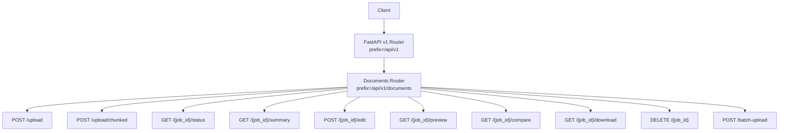
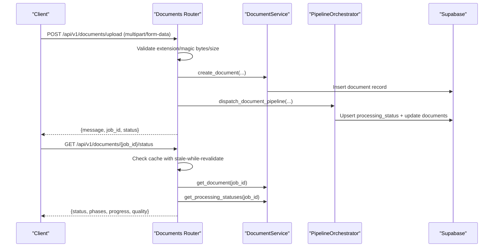
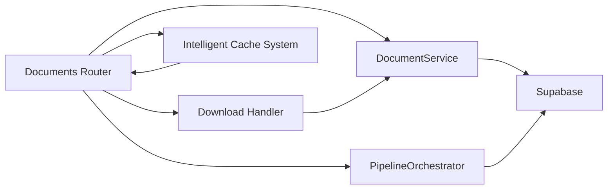

# Document Processing Endpoints

<cite>
**Referenced Files in This Document**
- [main.py](file://backend/app/main.py)
- [__init__.py](file://backend/app/routers/v1/__init__.py)
- [documents.py](file://backend/app/routers/documents.py)
- [v1/documents.py](file://backend/app/routers/v1/documents.py)
- [document_service.py](file://backend/app/services/document_service.py)
- [orchestrator.py](file://backend/app/pipeline/orchestrator.py)
- [settings.py](file://backend/app/config/settings.py)
- [test_document_status_cache.py](file://backend/tests/test_document_status_cache.py)
</cite>

## Update Summary
**Changes Made**
- Enhanced GET /api/v1/documents/{job_id}/status endpoint documentation with intelligent caching system
- Added stale-while-revalidate semantics explanation
- Updated performance considerations section with caching details
- Added configuration reference for DOCUMENT_STATUS_CACHE_TTL_SECONDS
- Updated troubleshooting guide with cache-related error scenarios

## Table of Contents
1. [Introduction](#introduction)
2. [Project Structure](#project-structure)
3. [Core Components](#core-components)
4. [Architecture Overview](#architecture-overview)
5. [Detailed Component Analysis](#detailed-component-analysis)
6. [Intelligent Caching System](#intelligent-caching-system)
7. [Dependency Analysis](#dependency-analysis)
8. [Performance Considerations](#performance-considerations)
9. [Troubleshooting Guide](#troubleshooting-guide)
10. [Conclusion](#conclusion)

## Introduction
This document provides comprehensive API documentation for the document processing endpoints. It covers all HTTP methods for document upload, retrieval, update (via edits), and deletion, including:
- POST /api/v1/documents/upload
- POST /api/v1/documents/upload/chunked
- GET /api/v1/documents/{job_id}/status
- GET /api/v1/documents/{job_id}/summary
- POST /api/v1/documents/{job_id}/edit
- GET /api/v1/documents/{job_id}/preview
- GET /api/v1/documents/{job_id}/compare
- GET /api/v1/documents/{job_id}/download
- DELETE /api/v1/documents/{job_id}
- POST /api/v1/documents/batch-upload

It also documents request schemas, response formats, authentication, file format restrictions, size limits, validation rules, and error handling. Practical examples demonstrate multipart form data handling for DOCX, PDF, TXT, and MD, plus guidance for large-file chunked uploads.

## Project Structure
The API is organized under a versioned router:
- Versioned router mounts v1 endpoints under /api/v1
- Documents endpoints are implemented in a dedicated router module
- Business logic integrates with a document service and a pipeline orchestrator



**Diagram sources**
- [__init__.py:7-13](file://backend/app/routers/v1/__init__.py#L7-L13)
- [documents.py:57-62](file://backend/app/routers/documents.py#L57-L62)

**Section sources**
- [__init__.py:1-14](file://backend/app/routers/v1/__init__.py#L1-L14)
- [documents.py:57-62](file://backend/app/routers/documents.py#L57-L62)

## Core Components
- Authentication and authorization:
  - Many endpoints require a current user context; some accept optional users.
  - Ownership checks ensure users can only access their own documents.
- File validation:
  - Extension whitelist and magic-byte verification for binary formats.
  - UTF-8 validation for text-like extensions.
- Size and quota enforcement:
  - Global body size limit and per-request file size limits.
  - Daily upload quotas enforced by rate-limiting middleware.
- Processing pipeline:
  - Dispatch to background processing with real-time status updates.
- Download security:
  - Signed URLs with HMAC tokens and expiration; optional integrity checks for DOCX.

**Section sources**
- [documents.py:178-181](file://backend/app/routers/documents.py#L178-L181)
- [documents.py:205-229](file://backend/app/routers/documents.py#L205-L229)
- [documents.py:509-513](file://backend/app/routers/documents.py#L509-L513)
- [main.py:294-301](file://backend/app/main.py#L294-L301)
- [main.py:295-296](file://backend/app/main.py#L295-L296)

## Architecture Overview
The upload flow triggers background processing and emits status updates. The download flow validates permissions, checks readiness, and serves signed URLs or files.



**Diagram sources**
- [documents.py:468-617](file://backend/app/routers/documents.py#L468-L617)
- [document_service.py:92-113](file://backend/app/services/document_service.py#L92-L113)
- [orchestrator.py:107-168](file://backend/app/pipeline/orchestrator.py#L107-L168)

## Detailed Component Analysis

### POST /api/v1/documents/upload
Purpose:
- Accept a single document via multipart form data and enqueue background processing.

Request
- Content-Type: multipart/form-data
- Fields:
  - file (required): File upload
  - template (optional, default): String template name
  - add_page_numbers (optional, default true): Boolean
  - add_borders (optional, default false): Boolean
  - add_cover_page (optional, default false): Boolean
  - generate_toc (optional, default false): Boolean
  - add_line_numbers (optional, default false): Boolean
  - line_spacing (optional): Float
  - page_size (optional, default "Letter"): String
  - fast_mode (optional, default false): Boolean

Validation and limits:
- File extension must be in the accepted set.
- Magic-byte verification for binary formats; UTF-8 check for text-like extensions.
- File size must not exceed configured maximum.
- Body size limit applies globally.
- Daily upload quota enforced by middleware.

Response
- 202 Accepted or similar with job identifier and initial status.
- On success: {message, job_id, status}
- On errors: HTTP 400/413/422/500/503 depending on failure type.

Security and ownership:
- Optional user context; anonymous uploads allowed depending on configuration.

Example curl
- Upload a DOCX:
  - curl -F "file=@manuscript.docx" -F "template=ieee" -F "generate_toc=true" https://your-host/api/v1/documents/upload
- Upload a TXT:
  - curl -F "file=@notes.txt" -F "page_size=A4" https://your-host/api/v1/documents/upload

Notes:
- Large files should use the chunked upload endpoint.

**Section sources**
- [documents.py:468-617](file://backend/app/routers/documents.py#L468-L617)
- [main.py:294-301](file://backend/app/main.py#L294-L301)

### POST /api/v1/documents/upload/chunked
Purpose:
- Upload large files in chunks with per-chunk size limits and final assembly validation.

Request
- Content-Type: multipart/form-data
- Fields:
  - file_id (required): Identifier for grouping chunks
  - chunk_index (required): Zero-based index of the current chunk
  - total_chunks (required): Total number of chunks expected
  - file (required): One chunk's bytes
  - All formatting options supported by the single-upload endpoint are also supported here

Validation and limits:
- Per-chunk size capped at 5 MB.
- Assembled file size must not exceed configured maximum.
- Final file extension validated against accepted types and magic bytes verified.

Response
- While assembling: {status: "chunk_received", chunk_index, total_chunks}
- On completion: {status: "complete", job_id, file_id, file_hash}

Example curl
- Upload a 12 MB file split into three 5 MB chunks:
  - curl -F "file_id=large_doc_abc" -F "chunk_index=0" -F "total_chunks=3" -F "file=@chunk1.bin" https://your-host/api/v1/documents/upload/chunked
  - curl -F "file_id=large_doc_abc" -F "chunk_index=1" -F "total_chunks=3" -F "file=@chunk2.bin" https://your-host/api/v1/documents/upload/chunked
  - curl -F "file_id=large_doc_abc" -F "chunk_index=2" -F "total_chunks=3" -F "file=@chunk3.bin" https://your-host/api/v1/documents/upload/chunked

**Section sources**
- [documents.py:236-410](file://backend/app/routers/documents.py#L236-L410)

### GET /api/v1/documents/{job_id}/status
Purpose:
- Retrieve detailed processing status, including per-phase progress and quality metrics.

**Enhanced** Intelligent caching system with stale-while-revalidate semantics is now implemented for improved performance and reliability.

Response fields:
- job_id, status, current_phase, progress_percentage, message, updated_at
- phases: array of phase objects with phase, status, message, progress, updated_at
- quality_score, quality_summary (when available)

**Intelligent Caching Behavior:**
- **Primary Cache Hit**: Returns cached response within TTL window
- **Stale Response**: Returns cached response up to 90 seconds stale if database is unavailable
- **Fallback**: Graceful degradation with "Reconnecting to status backend" message
- **User-scoped**: Cache keys include user ID for privacy and security

**Cache Configuration:**
- TTL controlled by `DOCUMENT_STATUS_CACHE_TTL_SECONDS` setting (default: 1.0 seconds)
- Stale window: 90 seconds maximum staleness
- Automatic cleanup of expired cache entries

Access control:
- Requires ownership for private documents; anonymous access for public contexts.

Example response
- {
  "job_id": "abcd1234-cd12-ef34-5678-901234567890",
  "status": "PROCESSING",
  "current_phase": "PARSING",
  "progress_percentage": 33,
  "message": "Parsing...",
  "updated_at": "2026-01-01T12:00:00Z",
  "phases": [
    {"phase": "INPUT_CONVERSION", "status": "COMPLETED", "progress": 100, "updated_at": "..."},
    {"phase": "PARSING", "status": "PROCESSING", "progress": 33, "updated_at": "..."},
    {"phase": "FORMATTING", "status": "PENDING", "progress": 0, "updated_at": "..."}
  ],
  "quality_score": 0.92,
  "quality_summary": {"quality_score": 0.92, ...}
}

**Section sources**
- [documents.py:619-681](file://backend/app/routers/documents.py#L619-L681)
- [document_service.py:92-113](file://backend/app/services/document_service.py#L92-L113)
- [settings.py:183](file://backend/app/config/settings.py#L183)

### GET /api/v1/documents/{job_id}/summary
Purpose:
- Lightweight summary for hydration in UIs.

Response fields:
- id, status, filename, template, created_at, output_path (only when ready for export)

Access control:
- Ownership required.

**Section sources**
- [documents.py:683-705](file://backend/app/routers/documents.py#L683-L705)

### POST /api/v1/documents/{job_id}/edit
Purpose:
- Submit edited structured data to re-run non-destructive formatting.

Request
- JSON body with edited_structured_data (required)

Response
- {message, job_id, status}

Access control:
- Ownership required.

**Section sources**
- [documents.py:708-747](file://backend/app/routers/documents.py#L708-L747)

### GET /api/v1/documents/{job_id}/preview
Purpose:
- Retrieve structured preview data and quality signals.

Response fields:
- structured_data, validation_results, quality_score, quality_summary
- metadata: filename, template, status, created_at

Access control:
- Ownership required.

**Section sources**
- [documents.py:750-790](file://backend/app/routers/documents.py#L750-L790)

### GET /api/v1/documents/{job_id}/compare
Purpose:
- Generate an HTML diff for side-by-side comparison of original vs formatted text.

Constraints:
- Available only after COMPLETED or COMPLETED_WITH_WARNINGS.

Response fields:
- html_diff (HTML), original.raw_text, formatted.structured_data

Access control:
- Ownership required.

**Section sources**
- [documents.py:792-854](file://backend/app/routers/documents.py#L792-L854)

### GET /api/v1/documents/{job_id}/download
Purpose:
- Download the formatted document in DOCX, PDF, or LaTeX.

Request
- Query parameters:
  - format: docx | pdf | tex (default docx)
  - token, expires (optional; required for signed URLs)
- Access control:
  - Ownership required; signed URL generation requires SIGNED_URL_SECRET

Response
- If token/expires absent and secret configured: {url, expires}
- If token valid: FileResponse (binary stream) with appropriate Content-Type and filename

Integrity:
- DOCX downloads optionally verify SHA-256 output hash against stored value.

**Section sources**
- [documents.py:857-1008](file://backend/app/routers/documents.py#L857-L1008)
- [document_service.py:45-88](file://backend/app/services/document_service.py#L45-L88)

### DELETE /api/v1/documents/{job_id}
Purpose:
- Delete a document and associated output/original files.

Access control:
- Ownership required.

Response
- {status: "deleted", job_id}

**Section sources**
- [documents.py:1011-1066](file://backend/app/routers/documents.py#L1011-L1066)

### POST /api/v1/documents/batch-upload
Purpose:
- Upload multiple files in a single request.

Request
- Content-Type: multipart/form-data
- Fields:
  - files (required): Array of files
  - template (optional): String template name applied to all
- Limits:
  - Maximum number of files per batch governed by configuration

Response
- {jobs: [{filename, job_id, status} | {filename, status, reason}], total}

**Section sources**
- [documents.py:1070-1171](file://backend/app/routers/documents.py#L1070-L1171)

## Intelligent Caching System

The document status endpoint now implements an intelligent caching system with stale-while-revalidate semantics to improve performance and reliability.

### Cache Architecture
```mermaid
graph TD
A["GET /{job_id}/status"] --> B{"Cache Hit?"}
B --> |Yes & Within TTL| C["Return Cached Response"]
B --> |Yes & Stale (<90s)| D["Return Stale Response<br/>with 'stale': true"]
B --> |No| E["Query Database"]
E --> F{"Document Found?"}
F --> |Yes| G["Build Payload"]
F --> |No| H{"Has Processing Statuses?"}
H --> |Yes| I["Build From Statuses"]
H --> |No| J{"Stale Cache Exists?"}
J --> |Yes| K["Return Stale Response"]
J --> |No| L["404 Not Found"]
G --> M["Cache Response"]
I --> M
K --> N["Add 'stale': true Message"]
M --> O["Return Response"]
N --> O
```

**Diagram sources**
- [documents.py:739-846](file://backend/app/routers/documents.py#L739-L846)

### Cache Implementation Details
- **Cache Key**: `{owner_segment}|{job_id}` where owner_segment includes user ID or "__anon__"
- **TTL Control**: Configurable via `DOCUMENT_STATUS_CACHE_TTL_SECONDS` (default: 1.0 seconds)
- **Stale Window**: Maximum 90 seconds stale responses
- **Locking**: Thread-safe cache operations with asyncio.Lock
- **Automatic Cleanup**: Expired entries removed during set operations

### Stale-While-Revalidate Semantics
- **Immediate Return**: Returns fresh cached data when available
- **Graceful Degradation**: Returns stale data up to 90 seconds old if database unavailable
- **User Privacy**: Cache keys scoped to user context for security
- **Automatic Refresh**: Database queries refresh cache on successful retrieval

**Section sources**
- [documents.py:117-198](file://backend/app/routers/documents.py#L117-L198)
- [settings.py:183](file://backend/app/config/settings.py#L183)
- [test_document_status_cache.py:1-145](file://backend/tests/test_document_status_cache.py#L1-145)

## Dependency Analysis
Key dependencies and interactions:
- Router layer depends on DocumentService for persistence and on PipelineOrchestrator for background processing.
- PipelineOrchestrator updates processing_status and documents records and emits SSE events.
- Download endpoint relies on signed URL helpers and optional integrity checks.
- Status endpoint utilizes intelligent caching system with configurable TTL and stale-while-revalidate semantics.



**Diagram sources**
- [documents.py:560-583](file://backend/app/routers/documents.py#L560-L583)
- [document_service.py:92-113](file://backend/app/services/document_service.py#L92-L113)
- [orchestrator.py:107-168](file://backend/app/pipeline/orchestrator.py#L107-L168)

**Section sources**
- [documents.py:560-583](file://backend/app/routers/documents.py#L560-L583)
- [document_service.py:92-113](file://backend/app/services/document_service.py#L92-L113)
- [orchestrator.py:107-168](file://backend/app/pipeline/orchestrator.py#L107-L168)

## Performance Considerations
- Concurrency control: The orchestrator limits concurrent jobs to prevent resource exhaustion.
- Chunked uploads: Prefer chunked uploads for large files to reduce memory pressure and improve resilience.
- Intelligent caching: Status responses are cached with TTL and stale-while-revalidate semantics to reduce database queries and improve response times.
- Cache configuration: Adjust `DOCUMENT_STATUS_CACHE_TTL_SECONDS` to balance freshness vs performance.
- Rate limiting: Global and tiered rate limits protect the system from abuse.

**Updated** Intelligent caching significantly reduces database load during frequent status polling, with configurable TTL and graceful degradation when database connectivity is lost.

**Section sources**
- [orchestrator.py:69-71](file://backend/app/pipeline/orchestrator.py#L69-L71)
- [documents.py:122-150](file://backend/app/routers/documents.py#L122-L150)
- [main.py:295-296](file://backend/app/main.py#L295-L296)
- [settings.py:183](file://backend/app/config/settings.py#L183)

## Troubleshooting Guide
Common errors and resolutions:
- 400 Invalid file type or unsupported format:
  - Ensure extension is in the accepted set and magic bytes match.
- 400 File is not valid UTF-8 text:
  - Re-save the file in UTF-8 encoding for text-like extensions.
- 400 Comparison data not available:
  - Wait until status reaches COMPLETED or COMPLETED_WITH_WARNINGS.
- 400 Document not ready:
  - Download is only allowed after COMPLETED or COMPLETED_WITH_WARNINGS.
- 403 Not authorized:
  - Ensure you are logged in and the document belongs to you.
- 404 Document job not found:
  - Verify the job_id is correct.
- 413 File too large:
  - Reduce file size or use chunked upload.
- 422 Malware detected:
  - Re-upload a clean file; virus scan failed.
- 500 Internal error:
  - Check logs; for downloads, verify signed URL secret and output path existence.
- **Cache-related issues**:
  - **Stale responses**: Look for `"stale": true` in status response indicating cached data beyond TTL
  - **Cache configuration**: Adjust `DOCUMENT_STATUS_CACHE_TTL_SECONDS` in environment settings
  - **Cache clearing**: Use `_reset_document_status_cache_for_tests()` for testing scenarios

**Updated** Added cache-related troubleshooting scenarios including stale responses and cache configuration issues.

**Section sources**
- [documents.py:205-229](file://backend/app/routers/documents.py#L205-L229)
- [documents.py:509-513](file://backend/app/routers/documents.py#L509-L513)
- [documents.py:811-819](file://backend/app/routers/documents.py#L811-L819)
- [documents.py:885-893](file://backend/app/routers/documents.py#L885-L893)
- [documents.py:903-905](file://backend/app/routers/documents.py#L903-L905)
- [documents.py:925-931](file://backend/app/routers/documents.py#L925-L931)
- [documents.py:936-953](file://backend/app/routers/documents.py#L936-L953)

## Conclusion
The document processing API provides a robust, secure, and scalable pipeline for uploading, processing, and exporting academic manuscripts. It enforces strict validation, supports large files via chunked uploads, offers real-time status updates, and ensures integrity and security for downloads. The enhanced intelligent caching system with stale-while-revalidate semantics significantly improves performance and reliability during status polling, while configurable TTL settings allow fine-tuning of freshness vs performance trade-offs. Follow the request schemas and examples to integrate reliably, and consult the troubleshooting guide for common issues including cache-related scenarios.