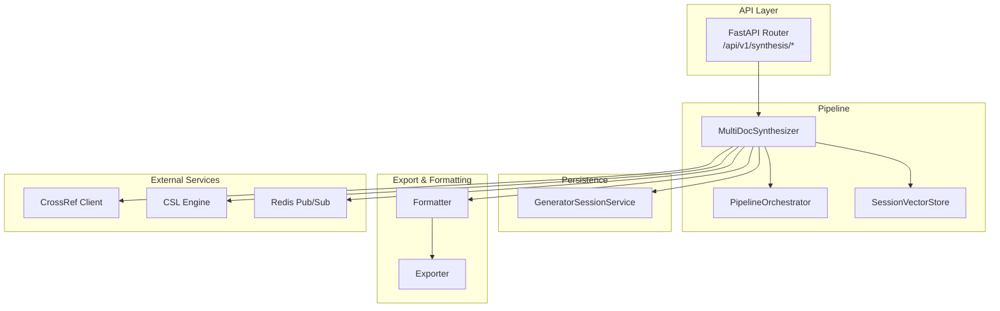
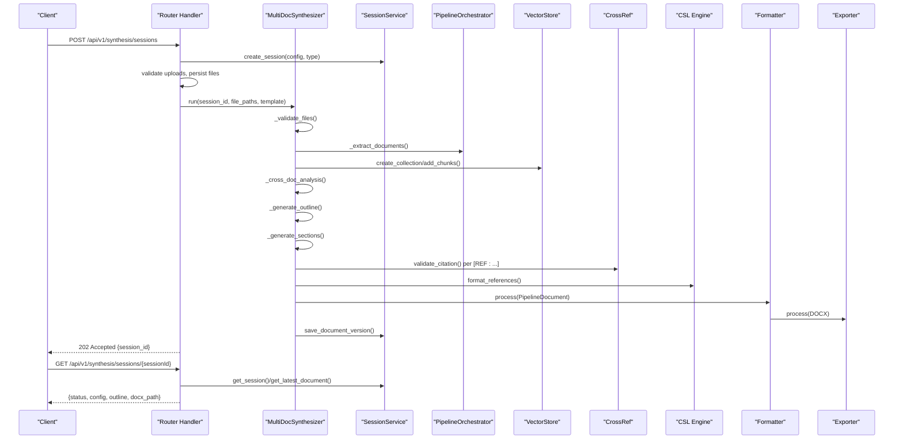
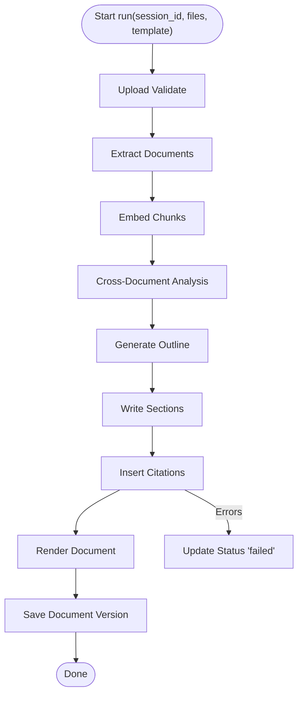
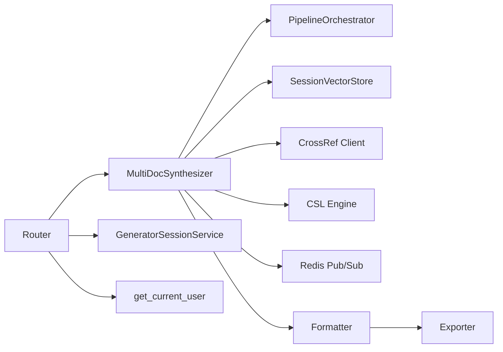

# Multi-Document Synthesis Endpoints

<cite>
**Referenced Files in This Document**
- [synthesis.py](file://backend/app/routers/v1/synthesis.py)
- [synthesizer.py](file://backend/app/pipeline/synthesis/synthesizer.py)
- [generator_session_service.py](file://backend/app/services/generator_session_service.py)
- [settings.py](file://backend/app/config/settings.py)
- [formatter.py](file://backend/app/pipeline/formatting/formatter.py)
- [exporter.py](file://backend/app/pipeline/export/exporter.py)
- [generator_session.py](file://backend/app/schemas/generator_session.py)
- [dependencies.py](file://backend/app/utils/dependencies.py)
</cite>

## Table of Contents
1. [Introduction](#introduction)
2. [Project Structure](#project-structure)
3. [Core Components](#core-components)
4. [Architecture Overview](#architecture-overview)
5. [Detailed Component Analysis](#detailed-component-analysis)
6. [Dependency Analysis](#dependency-analysis)
7. [Performance Considerations](#performance-considerations)
8. [Troubleshooting Guide](#troubleshooting-guide)
9. [Conclusion](#conclusion)

## Introduction
This document describes the multi-document synthesis endpoints and related pipeline components. It covers:
- POST /api/v1/synthesis/sessions for initiating synthesis from multiple documents
- GET /api/v1/synthesis/sessions/{sessionId} for retrieving synthesis status and output
- Real-time event streaming via Server-Sent Events for synthesis progress
- Request schemas, configuration options, and output formats
- Synthesis algorithms, content alignment, citation assembly, and template-based rendering
- Authentication requirements, document size limits, and processing constraints
- Examples and error handling guidance

## Project Structure
The synthesis feature spans router handlers, a multi-document synthesizer, session persistence, configuration, and export/formatting stages.

**Diagram sources**
- [synthesis.py:32-58](file://backend/app/routers/v1/synthesis.py#L32-L58)
- [synthesizer.py:39-54](file://backend/app/pipeline/synthesis/synthesizer.py#L39-L54)
- [generator_session_service.py:126-156](file://backend/app/services/generator_session_service.py#L126-L156)
- [formatter.py:35-58](file://backend/app/pipeline/formatting/formatter.py#L35-L58)
- [exporter.py:19-66](file://backend/app/pipeline/export/exporter.py#L19-L66)

**Section sources**
- [synthesis.py:32-58](file://backend/app/routers/v1/synthesis.py#L32-L58)
- [synthesizer.py:39-54](file://backend/app/pipeline/synthesis/synthesizer.py#L39-L54)
- [generator_session_service.py:126-156](file://backend/app/services/generator_session_service.py#L126-L156)
- [formatter.py:35-58](file://backend/app/pipeline/formatting/formatter.py#L35-L58)
- [exporter.py:19-66](file://backend/app/pipeline/export/exporter.py#L19-L66)

## Core Components
- Router endpoints for synthesis sessions and real-time updates
- MultiDocSynthesizer orchestrating extraction, embedding, cross-document analysis, outline generation, content writing, citation insertion, and rendering
- Session persistence service for status, config, and document versions
- Exporter and Formatter for generating DOCX and auxiliary formats
- Configuration settings for limits and defaults
- Authentication dependency supporting Bearer tokens and query-parameter fallback for SSE

**Section sources**
- [synthesis.py:70-140](file://backend/app/routers/v1/synthesis.py#L70-L140)
- [synthesizer.py:56-194](file://backend/app/pipeline/synthesis/synthesizer.py#L56-L194)
- [generator_session_service.py:126-156](file://backend/app/services/generator_session_service.py#L126-L156)
- [settings.py:93-97](file://backend/app/config/settings.py#L93-L97)
- [dependencies.py:15-59](file://backend/app/utils/dependencies.py#L15-L59)

## Architecture Overview
End-to-end synthesis flow from upload to rendered output.

**Diagram sources**
- [synthesis.py:70-140](file://backend/app/routers/v1/synthesis.py#L70-L140)
- [synthesizer.py:56-194](file://backend/app/pipeline/synthesis/synthesizer.py#L56-L194)
- [generator_session_service.py:126-156](file://backend/app/services/generator_session_service.py#L126-L156)
- [formatter.py:49-58](file://backend/app/pipeline/formatting/formatter.py#L49-L58)
- [exporter.py:30-66](file://backend/app/pipeline/export/exporter.py#L30-L66)

## Detailed Component Analysis

### Endpoint: POST /api/v1/synthesis/sessions
Purpose: Initiate multi-document synthesis with 2–6 files.

- Request
  - multipart/form-data
  - Required fields:
    - files: List of uploaded files (2–6)
    - session_type: "multi_doc"
    - template: string (defaults to configured default)
    - config: JSON string (parsed into dict)
  - Validation:
    - File count bounds
    - File type allowed extensions
    - Per-file size limit from settings
    - Magic-byte validation
    - Duplicate file detection by hash
  - Background execution:
    - Starts MultiDocSynthesizer.run asynchronously
    - Returns 202 Accepted with session_id

- Response
  - 202 Accepted: { session_id, status: "started" }
  - Errors mapped to human-readable codes:
    - INVALID_UPLOAD_REQUEST (400/413/422)

- Notes
  - Uses Redis Pub/Sub to emit progress events during synthesis
  - Session config includes uploaded_files metadata and processing stages

**Section sources**
- [synthesis.py:70-140](file://backend/app/routers/v1/synthesis.py#L70-L140)
- [synthesizer.py:246-281](file://backend/app/pipeline/synthesis/synthesizer.py#L246-L281)
- [settings.py:93-97](file://backend/app/config/settings.py#L93-L97)

### Endpoint: GET /api/v1/synthesis/sessions/{sessionId}
Purpose: Retrieve synthesis status and output.

- Request
  - Path parameter: sessionId
  - Authentication required

- Response
  - Fields:
    - id, status, session_type, config, outline, docx_path, created_at, updated_at
  - Errors:
    - SESSION_NOT_FOUND (404)

- Notes
  - docx_path reflects the latest saved document version
  - config includes stage-specific payloads (e.g., analysis, sections, citations)

**Section sources**
- [synthesis.py:143-171](file://backend/app/routers/v1/synthesis.py#L143-L171)
- [generator_session_service.py:158-186](file://backend/app/services/generator_session_service.py#L158-L186)
- [generator_session_service.py:331-361](file://backend/app/services/generator_session_service.py#L331-L361)

### Endpoint: GET /api/v1/synthesis/sessions/{sessionId}/events
Purpose: Subscribe to real-time progress events.

- Request
  - Path parameter: sessionId
  - Authentication supported via Bearer or query token for SSE compatibility

- Events
  - connected: initial connection acknowledgment
  - stage_update: periodic updates with stage, progress, message
  - outline_chunk, writing_chunk: streamed content fragments
  - error: failure events with stage and message

- Notes
  - Uses Redis Pub/Sub channel session:{sessionId}
  - SSE-compatible response

**Section sources**
- [synthesis.py:174-206](file://backend/app/routers/v1/synthesis.py#L174-L206)
- [synthesizer.py:196-244](file://backend/app/pipeline/synthesis/synthesizer.py#L196-L244)
- [synthesizer.py:634-659](file://backend/app/pipeline/synthesis/synthesizer.py#L634-L659)

### MultiDocSynthesizer Processing Stages
High-level synthesis pipeline:

1. Upload Validate
   - Enforces file count and type
   - Validates magic bytes
   - Deduplicates by hash
   - Emits warnings for duplicates

2. Per-Document Extraction
   - Parses each file into PipelineDocument blocks
   - Streams extraction progress

3. Embedding
   - Builds overlapping text chunks per document
   - Adds chunks to SessionVectorStore

4. Cross-Document Analysis
   - Summarizes documents and asks LLM for overlaps/gaps/unique points

5. Synthesis Plan
   - Generates outline JSON with sections and key points

6. Content Generation
   - Writes each section using retrieved context and [REF:...] placeholders

7. Citation Insertion
   - Extracts unique queries from [REF:...] placeholders
   - Validates and formats references via CrossRef and CSL

8. Template Render
   - Builds PipelineDocument and renders DOCX via Formatter and Exporter

**Diagram sources**
- [synthesizer.py:56-194](file://backend/app/pipeline/synthesis/synthesizer.py#L56-L194)

**Section sources**
- [synthesizer.py:56-194](file://backend/app/pipeline/synthesis/synthesizer.py#L56-L194)
- [synthesizer.py:246-281](file://backend/app/pipeline/synthesis/synthesizer.py#L246-L281)
- [synthesizer.py:283-317](file://backend/app/pipeline/synthesis/synthesizer.py#L283-L317)
- [synthesizer.py:319-370](file://backend/app/pipeline/synthesis/synthesizer.py#L319-L370)
- [synthesizer.py:372-387](file://backend/app/pipeline/synthesis/synthesizer.py#L372-L387)
- [synthesizer.py:389-414](file://backend/app/pipeline/synthesis/synthesizer.py#L389-L414)
- [synthesizer.py:416-449](file://backend/app/pipeline/synthesis/synthesizer.py#L416-L449)
- [synthesizer.py:451-504](file://backend/app/pipeline/synthesis/synthesizer.py#L451-L504)
- [synthesizer.py:512-600](file://backend/app/pipeline/synthesis/synthesizer.py#L512-L600)

### Request Schemas and Configuration
- CreateSessionRequest
  - session_type: "multi_doc"
  - config: arbitrary JSON object
  - template: string (defaults to configured default)

- SessionResponse
  - id, status, session_type, config, outline, created_at, updated_at

- MessageRequest (for related chat endpoint)
  - content: string

- Session configuration fields populated during synthesis:
  - files, extracted_docs, analysis, outline, sections, citations, output_path, docx_path

**Section sources**
- [generator_session.py:9-27](file://backend/app/schemas/generator_session.py#L9-L27)
- [synthesizer.py:58-117](file://backend/app/pipeline/synthesis/synthesizer.py#L58-L117)

### Authentication and Authorization
- Bearer token required for all synthesis endpoints
- Supports token via Authorization header or query parameter "token" for SSE compatibility
- On invalid/expired token, returns 401 Unauthorized

**Section sources**
- [dependencies.py:15-59](file://backend/app/utils/dependencies.py#L15-L59)
- [synthesis.py:78-78](file://backend/app/routers/v1/synthesis.py#L78-L78)
- [synthesis.py:147-147](file://backend/app/routers/v1/synthesis.py#L147-L147)
- [synthesis.py:178-178](file://backend/app/routers/v1/synthesis.py#L178-L178)

### Document Size Limits and Constraints
- Maximum file size enforced per upload
- Maximum batch size enforced (2–6 files)
- Uploads per minute limit configurable
- Default template configurable

**Section sources**
- [settings.py:93-97](file://backend/app/config/settings.py#L93-L97)
- [synthesis.py:83-84](file://backend/app/routers/v1/synthesis.py#L83-L84)
- [synthesis.py:100-104](file://backend/app/routers/v1/synthesis.py#L100-L104)

### Output Formats and Rendering
- Primary output: DOCX
- Auxiliary formats: JSON, Markdown, HTML, LaTeX, JATS XML
- Rendering uses Formatter and Exporter with optional template support

**Section sources**
- [synthesizer.py:512-600](file://backend/app/pipeline/synthesis/synthesizer.py#L512-L600)
- [formatter.py:35-58](file://backend/app/pipeline/formatting/formatter.py#L35-L58)
- [exporter.py:19-66](file://backend/app/pipeline/export/exporter.py#L19-L66)

### Examples

#### Intelligent Content Alignment
- Cross-document analysis identifies overlaps, gaps, and unique points across documents
- LLM generates an outline aligned with discovered relationships
- Section content is written using contextual chunks retrieved from the vector store

**Section sources**
- [synthesizer.py:372-387](file://backend/app/pipeline/synthesis/synthesizer.py#L372-L387)
- [synthesizer.py:389-414](file://backend/app/pipeline/synthesis/synthesizer.py#L389-L414)
- [synthesizer.py:416-449](file://backend/app/pipeline/synthesis/synthesizer.py#L416-L449)

#### Citation Harmonization
- Placeholder pattern [REF: query] embedded in generated content
- Unique queries extracted and validated via CrossRef
- References formatted via CSL style engine; fallback to raw text on error
- Placeholders replaced with numbered citations

**Section sources**
- [synthesizer.py:451-504](file://backend/app/pipeline/synthesis/synthesizer.py#L451-L504)

#### Multi-Source Document Integration
- Documents parsed independently, then unified under a single outline
- Vector embeddings enable cross-referential content retrieval
- Final document assembled with title, headings, body, and formatted references

**Section sources**
- [synthesizer.py:283-317](file://backend/app/pipeline/synthesis/synthesizer.py#L283-L317)
- [synthesizer.py:512-600](file://backend/app/pipeline/synthesis/synthesizer.py#L512-L600)

## Dependency Analysis
- Router depends on MultiDocSynthesizer, GeneratorSessionService, RedisPubSub, and authentication dependency
- MultiDocSynthesizer depends on PipelineOrchestrator, SessionVectorStore, Crossref client, CSL engine, and session service
- Exporter depends on Formatter and external converters for PDF/LaTeX
- Configuration settings drive limits and defaults

**Diagram sources**
- [synthesis.py:32-58](file://backend/app/routers/v1/synthesis.py#L32-L58)
- [synthesizer.py:39-54](file://backend/app/pipeline/synthesis/synthesizer.py#L39-L54)
- [formatter.py:35-47](file://backend/app/pipeline/formatting/formatter.py#L35-L47)
- [exporter.py:19-29](file://backend/app/pipeline/export/exporter.py#L19-L29)

**Section sources**
- [synthesis.py:32-58](file://backend/app/routers/v1/synthesis.py#L32-L58)
- [synthesizer.py:39-54](file://backend/app/pipeline/synthesis/synthesizer.py#L39-L54)
- [formatter.py:35-47](file://backend/app/pipeline/formatting/formatter.py#L35-L47)
- [exporter.py:19-29](file://backend/app/pipeline/export/exporter.py#L19-L29)

## Performance Considerations
- Asynchronous orchestration and background task execution prevent blocking
- Vector store chunking with overlap improves retrieval accuracy
- Streaming events reduce client polling overhead
- Exporters convert DOCX to other formats on demand

[No sources needed since this section provides general guidance]

## Troubleshooting Guide
Common errors and resolutions:

- 400 INVALID_UPLOAD_REQUEST
  - Cause: Unsupported file type or invalid upload request
  - Resolution: Verify file extension and content type

- 404 SESSION_NOT_FOUND
  - Cause: Nonexistent session ID
  - Resolution: Ensure correct session_id and that creation succeeded

- 413 DOCUMENT_TOO_LARGE
  - Cause: Single file exceeds MAX_FILE_SIZE
  - Resolution: Reduce file size or adjust settings

- 422 INVALID_SESSION_REQUEST
  - Cause: Invalid session_type, wrong number of files, or invalid config JSON
  - Resolution: Use session_type "multi_doc", upload 2–6 files, and provide valid JSON

- 401 Not authenticated
  - Cause: Missing or invalid Bearer token
  - Resolution: Provide a valid token via Authorization header or query parameter

- Synthesis failures
  - The pipeline updates status to "failed" and emits an error event
  - Inspect session config for stage and message payloads

**Section sources**
- [synthesis.py:129-140](file://backend/app/routers/v1/synthesis.py#L129-L140)
- [synthesis.py:165-171](file://backend/app/routers/v1/synthesis.py#L165-L171)
- [synthesis.py:100-104](file://backend/app/routers/v1/synthesis.py#L100-L104)
- [synthesis.py:82-84](file://backend/app/routers/v1/synthesis.py#L82-L84)
- [dependencies.py:31-36](file://backend/app/utils/dependencies.py#L31-L36)
- [synthesizer.py:183-194](file://backend/app/pipeline/synthesis/synthesizer.py#L183-L194)

## Conclusion
The multi-document synthesis endpoints provide a robust, asynchronous pipeline for aligning, integrating, and formatting content from multiple sources. With real-time progress updates, configurable templates, and citation harmonization, the system supports complex academic document synthesis workflows while enforcing clear constraints and error handling.