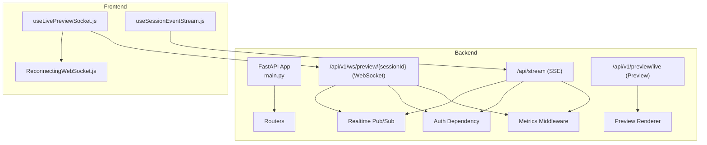
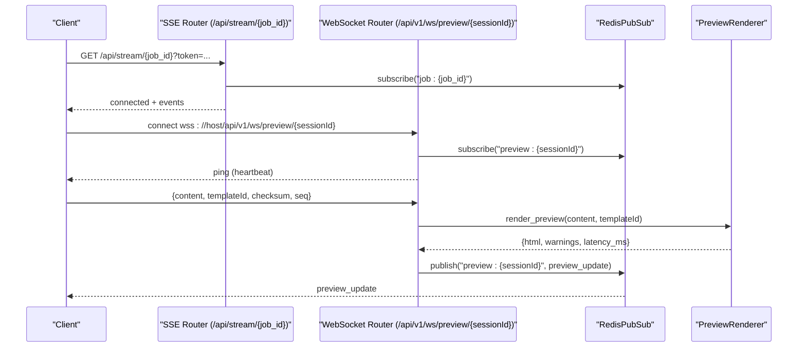
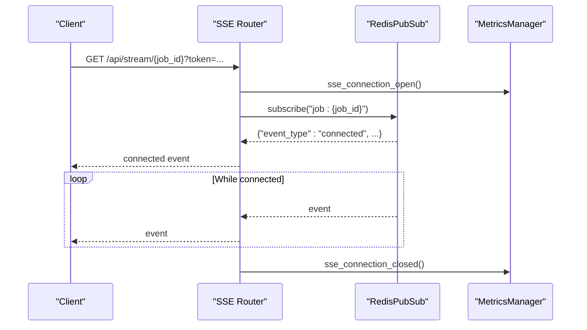
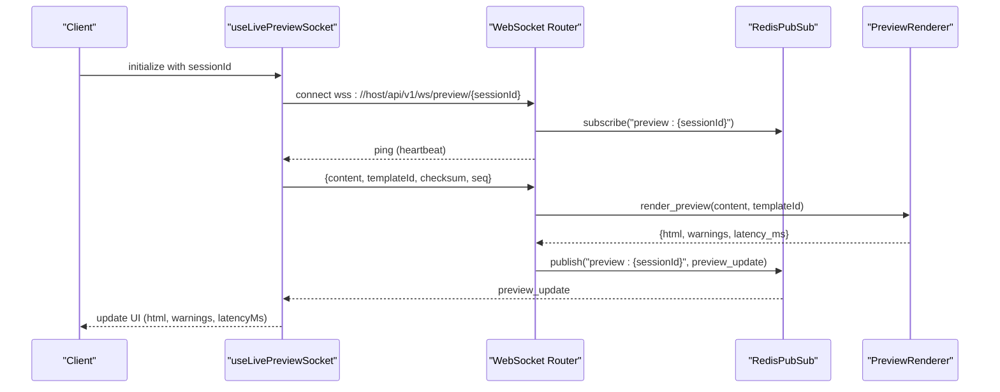
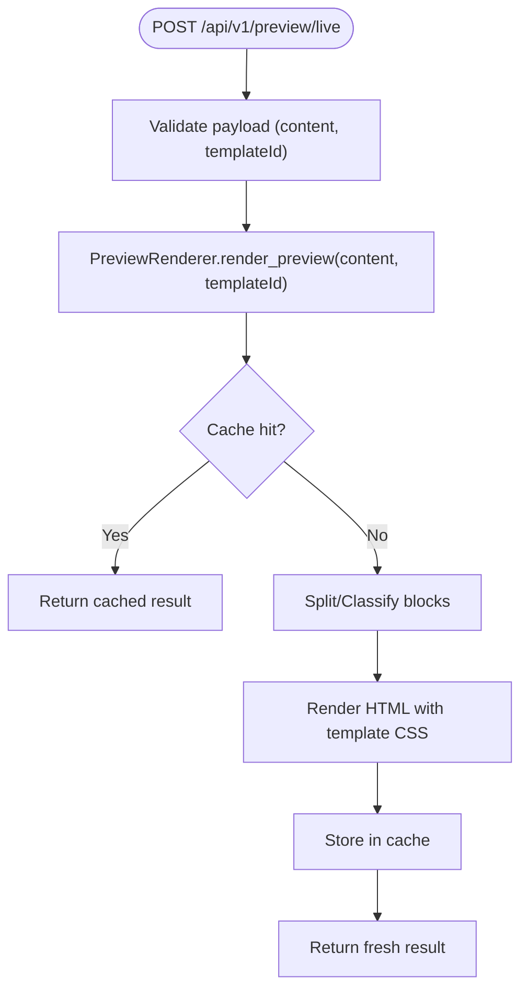
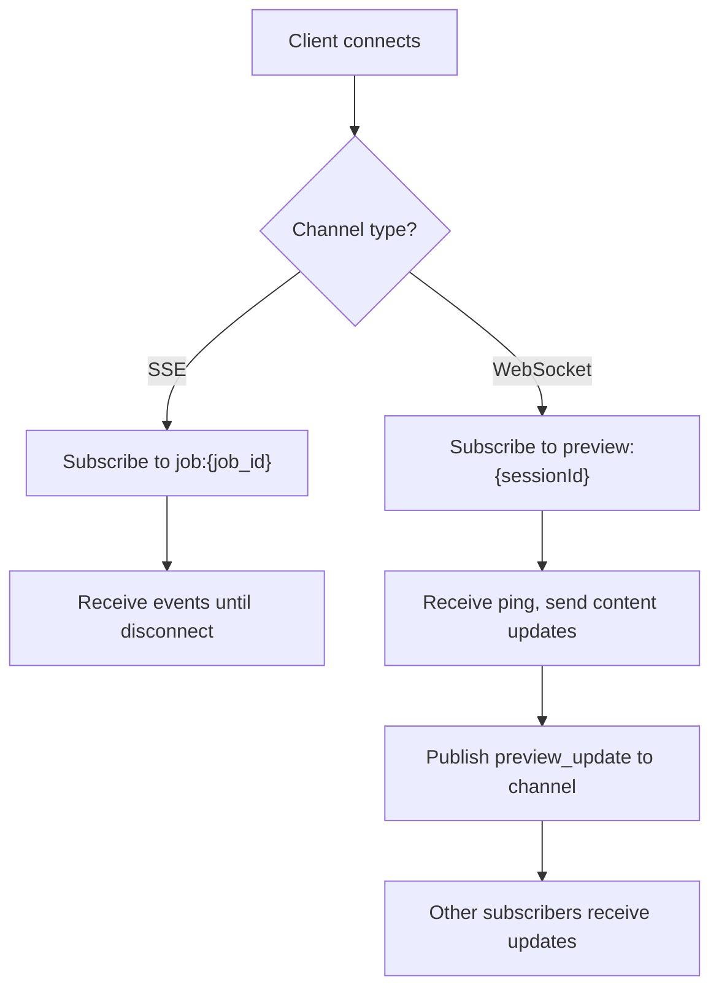
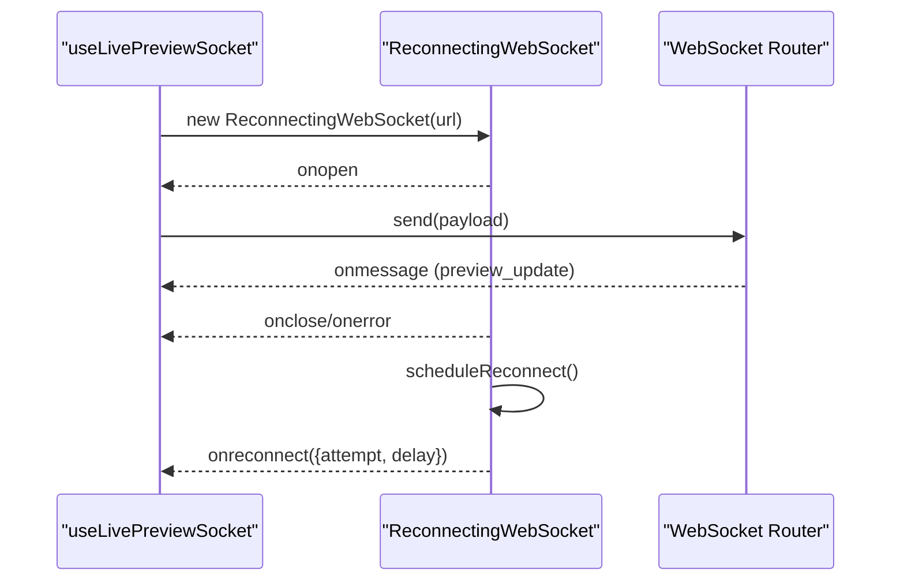
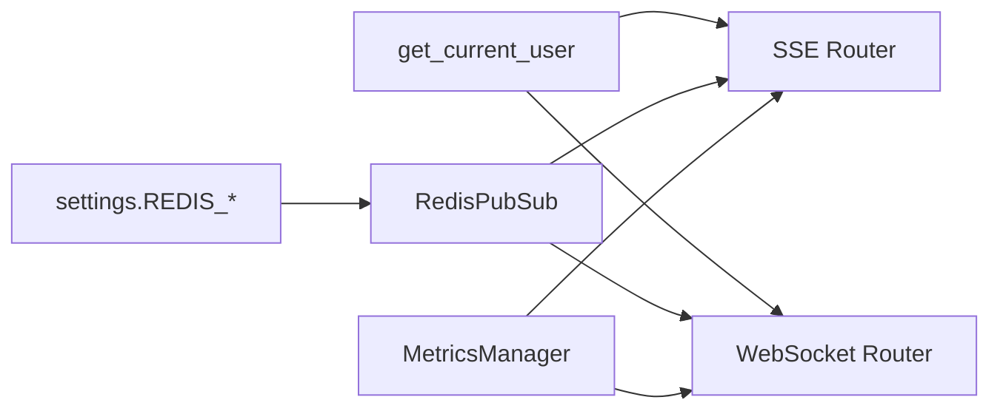

# Real-time Communication Endpoints

<cite>
**Referenced Files in This Document**
- [stream.py](file://backend/app/routers/stream.py)
- [preview.py](file://backend/app/routers/preview.py)
- [events.py](file://backend/app/realtime/events.py)
- [pubsub.py](file://backend/app/realtime/pubsub.py)
- [preview_renderer.py](file://backend/app/services/preview_renderer.py)
- [prometheus_metrics.py](file://backend/app/middleware/prometheus_metrics.py)
- [dependencies.py](file://backend/app/utils/dependencies.py)
- [settings.py](file://backend/app/config/settings.py)
- [useLivePreviewSocket.js](file://frontend/src/hooks/useLivePreviewSocket.js)
- [ReconnectingWebSocket.js](file://frontend/src/lib/ReconnectingWebSocket.js)
- [useSessionEventStream.js](file://frontend/src/hooks/useSessionEventStream.js)
- [002-redis-realtime-backbone.md](file://docs/adr/002-redis-realtime-backbone.md)
</cite>

## Table of Contents
1. [Introduction](#introduction)
2. [Project Structure](#project-structure)
3. [Core Components](#core-components)
4. [Architecture Overview](#architecture-overview)
5. [Detailed Component Analysis](#detailed-component-analysis)
6. [Dependency Analysis](#dependency-analysis)
7. [Performance Considerations](#performance-considerations)
8. [Troubleshooting Guide](#troubleshooting-guide)
9. [Conclusion](#conclusion)

## Introduction
This document describes the real-time communication endpoints powering live status updates, progressive document rendering, and collaborative editing experiences. It covers:
- Server-Sent Events (SSE) for progressive updates to long-running jobs
- WebSocket connections for live document preview and collaborative editing
- Preview rendering endpoints for real-time HTML generation
- Authentication, heartbeat, reconnection, and error recovery strategies
- Client-side examples and operational guidance for high-concurrency deployments

## Project Structure
The real-time capabilities are implemented in the backend FastAPI application and consumed by the Next.js frontend:
- Backend routers expose SSE and WebSocket endpoints
- Real-time messaging uses a Redis-backed pub/sub abstraction with in-memory fallback
- Preview rendering is handled by a dedicated service with caching
- Frontend hooks provide robust client-side reconnection and debounced updates



**Diagram sources**
- [stream.py:24-70](file://backend/app/routers/stream.py#L24-L70)
- [preview.py:25-128](file://backend/app/routers/preview.py#L25-L128)
- [pubsub.py:18-120](file://backend/app/realtime/pubsub.py#L18-L120)
- [preview_renderer.py:31-421](file://backend/app/services/preview_renderer.py#L31-L421)
- [prometheus_metrics.py:144-235](file://backend/app/middleware/prometheus_metrics.py#L144-L235)
- [dependencies.py:15-60](file://backend/app/utils/dependencies.py#L15-L60)
- [useLivePreviewSocket.js:28-136](file://frontend/src/hooks/useLivePreviewSocket.js#L28-L136)
- [ReconnectingWebSocket.js:5-147](file://frontend/src/lib/ReconnectingWebSocket.js#L5-L147)
- [useSessionEventStream.js:4-101](file://frontend/src/hooks/useSessionEventStream.js#L4-L101)

**Section sources**
- [stream.py:1-95](file://backend/app/routers/stream.py#L1-L95)
- [preview.py:1-201](file://backend/app/routers/preview.py#L1-L201)
- [pubsub.py:1-120](file://backend/app/realtime/pubsub.py#L1-L120)
- [preview_renderer.py:1-421](file://backend/app/services/preview_renderer.py#L1-L421)
- [prometheus_metrics.py:1-235](file://backend/app/middleware/prometheus_metrics.py#L1-L235)
- [dependencies.py:1-92](file://backend/app/utils/dependencies.py#L1-L92)
- [settings.py:156-174](file://backend/app/config/settings.py#L156-L174)
- [useLivePreviewSocket.js:1-137](file://frontend/src/hooks/useLivePreviewSocket.js#L1-L137)
- [ReconnectingWebSocket.js:1-147](file://frontend/src/lib/ReconnectingWebSocket.js#L1-L147)
- [useSessionEventStream.js:1-101](file://frontend/src/hooks/useSessionEventStream.js#L1-L101)
- [002-redis-realtime-backbone.md:1-10](file://docs/adr/002-redis-realtime-backbone.md#L1-L10)

## Core Components
- SSE Endpoint: Streams progressive job events to authenticated clients
- WebSocket Endpoint: Provides bidirectional live preview updates and collaborative editing
- Preview Renderer: Renders content to HTML with caching and template support
- Pub/Sub Abstraction: Redis-backed with in-memory fallback for resilience
- Metrics Middleware: Tracks active connections and emits Prometheus metrics
- Authentication: Supports Bearer tokens and SSE-compatible query parameter fallback

Key responsibilities:
- SSE: Publishes job events to channels; clients receive progressive updates
- WebSocket: Accepts client payloads, renders preview, publishes updates to channel
- Pub/Sub: Ensures delivery across processes and nodes; falls back when Redis unavailable
- Renderer: Produces HTML with template CSS and caches results

**Section sources**
- [stream.py:32-95](file://backend/app/routers/stream.py#L32-L95)
- [preview.py:51-128](file://backend/app/routers/preview.py#L51-L128)
- [events.py:9-34](file://backend/app/realtime/events.py#L9-L34)
- [pubsub.py:18-120](file://backend/app/realtime/pubsub.py#L18-L120)
- [preview_renderer.py:31-421](file://backend/app/services/preview_renderer.py#L31-L421)
- [prometheus_metrics.py:198-214](file://backend/app/middleware/prometheus_metrics.py#L198-L214)
- [dependencies.py:15-60](file://backend/app/utils/dependencies.py#L15-L60)

## Architecture Overview
The system uses Redis as the real-time backbone for pub/sub and metrics, with in-memory fallbacks when Redis is unavailable. SSE and WebSocket endpoints share the same pub/sub infrastructure.



**Diagram sources**
- [stream.py:32-70](file://backend/app/routers/stream.py#L32-L70)
- [preview.py:78-128](file://backend/app/routers/preview.py#L78-L128)
- [pubsub.py:79-120](file://backend/app/realtime/pubsub.py#L79-L120)
- [preview_renderer.py:364-406](file://backend/app/services/preview_renderer.py#L364-L406)

**Section sources**
- [002-redis-realtime-backbone.md:1-10](file://docs/adr/002-redis-realtime-backbone.md#L1-L10)
- [pubsub.py:18-120](file://backend/app/realtime/pubsub.py#L18-L120)

## Detailed Component Analysis

### Server-Sent Events (SSE) for Job Progress
- Endpoint: GET /api/stream/{job_id}
- Authentication: Bearer token in Authorization header or token query parameter
- Behavior:
  - Emits a connected event immediately upon subscription
  - Streams events published to the channel job:{job_id}
  - Automatically closes when client disconnects
- Event Envelope:
  - Fields include event_type, job_id, request_id, stage, progress, payload, timestamp
  - Clients receive JSON-encoded event data



**Diagram sources**
- [stream.py:32-70](file://backend/app/routers/stream.py#L32-L70)
- [prometheus_metrics.py:198-205](file://backend/app/middleware/prometheus_metrics.py#L198-L205)

**Section sources**
- [stream.py:32-95](file://backend/app/routers/stream.py#L32-L95)
- [events.py:21-34](file://backend/app/realtime/events.py#L21-L34)
- [dependencies.py:15-60](file://backend/app/utils/dependencies.py#L15-L60)
- [prometheus_metrics.py:198-205](file://backend/app/middleware/prometheus_metrics.py#L198-L205)

### WebSocket Live Preview and Collaborative Editing
- Endpoint: /api/v1/ws/preview/{sessionId}
- Session ID Validation: Alphanumeric, dash, underscore; length 3–64
- Heartbeat: Server sends ping every ~20 seconds
- Bidirectional Messages:
  - Client sends: content, optional templateId/template_id, optional checksum, optional seq
  - Server responds: preview_update with html, warnings, latencyMs, version, seq
- Channel: preview:{sessionId}
- Concurrency: Multiple WebSocket connections per session; managed in-memory registry



**Diagram sources**
- [preview.py:78-128](file://backend/app/routers/preview.py#L78-L128)
- [preview_renderer.py:364-406](file://backend/app/services/preview_renderer.py#L364-L406)
- [pubsub.py:79-120](file://backend/app/realtime/pubsub.py#L79-L120)
- [useLivePreviewSocket.js:28-136](file://frontend/src/hooks/useLivePreviewSocket.js#L28-L136)

**Section sources**
- [preview.py:27-128](file://backend/app/routers/preview.py#L27-L128)
- [preview_renderer.py:31-421](file://backend/app/services/preview_renderer.py#L31-L421)
- [useLivePreviewSocket.js:28-136](file://frontend/src/hooks/useLivePreviewSocket.js#L28-L136)
- [ReconnectingWebSocket.js:5-147](file://frontend/src/lib/ReconnectingWebSocket.js#L5-L147)

### Preview Rendering Endpoints
- POST /api/v1/preview/live: Immediate server-side rendering of content with template selection
- Response includes rendered HTML, latencyMs, and warnings
- Uses PreviewRenderer with template discovery, CSS caching, and HTML cache keys



**Diagram sources**
- [preview.py:51-58](file://backend/app/routers/preview.py#L51-L58)
- [preview_renderer.py:364-406](file://backend/app/services/preview_renderer.py#L364-L406)

**Section sources**
- [preview.py:51-58](file://backend/app/routers/preview.py#L51-L58)
- [preview_renderer.py:31-421](file://backend/app/services/preview_renderer.py#L31-L421)

### Event Types and Message Formats
- SSE Event Types:
  - connected: Initial connection acknowledgment
  - Other events: Emitted via emit_event(job_id, event_type, data)
- WebSocket Event Type:
  - preview_update: Emitted to preview:{sessionId} channel
- Common Fields:
  - event_type, job_id/session_id, request_id, stage, progress, timestamp, payload
- SSE Payload Example:
  - {"event_type":"connected","job_id":"...","request_id":"...","timestamp":"...","payload":{"message":"Connected..."}}
- WebSocket Payload Example:
  - {"html":"...","warnings":[],"latencyMs":..., "version":"...","seq":...}

```mermaid
classDiagram
class RealtimeEvent {
+string event_type
+string job_id
+string session_id
+string request_id
+string stage
+int progress
+datetime timestamp
+dict payload
}
class RedisPubSub {
+publish(channel, event)
+subscribe(channel)
}
class SSE {
+GET /api/stream/{job_id}
}
class WS {
+WebSocket /api/v1/ws/preview/{sessionId}
}
SSE --> RedisPubSub : "publish/subscribe"
WS --> RedisPubSub : "publish/subscribe"
SSE --> RealtimeEvent : "make_event()"
WS --> RealtimeEvent : "make_event()"
```

**Diagram sources**
- [events.py:9-34](file://backend/app/realtime/events.py#L9-L34)
- [pubsub.py:55-120](file://backend/app/realtime/pubsub.py#L55-L120)
- [stream.py:73-95](file://backend/app/routers/stream.py#L73-L95)
- [preview.py:114-115](file://backend/app/routers/preview.py#L114-L115)

**Section sources**
- [events.py:9-34](file://backend/app/realtime/events.py#L9-L34)
- [stream.py:73-95](file://backend/app/routers/stream.py#L73-L95)
- [preview.py:114-115](file://backend/app/routers/preview.py#L114-L115)

### Subscription Management and Concurrency
- SSE:
  - Subscriptions are per-job channels; automatically cleaned up on disconnect
- WebSocket:
  - Maintains an in-memory registry of sessions to connections
  - Heartbeat and periodic ping keep connections alive
  - Multiple clients can join the same preview session
- Pub/Sub:
  - Redis-backed publish/subscribe with in-memory fallback when unavailable
  - Channels: job:{job_id} for SSE, preview:{sessionId} for WebSocket



**Diagram sources**
- [stream.py:48-57](file://backend/app/routers/stream.py#L48-L57)
- [preview.py:91-115](file://backend/app/routers/preview.py#L91-L115)
- [pubsub.py:79-120](file://backend/app/realtime/pubsub.py#L79-L120)

**Section sources**
- [stream.py:48-57](file://backend/app/routers/stream.py#L48-L57)
- [preview.py:28-128](file://backend/app/routers/preview.py#L28-L128)
- [pubsub.py:18-120](file://backend/app/realtime/pubsub.py#L18-L120)

### Client-Side Reconnection and De-bouncing
- ReconnectingWebSocket:
  - Exponential backoff with jitter
  - Automatic reconnection on close/error
  - Options for max delay, max retries, and custom predicate
- useLivePreviewSocket:
  - Debounces content updates (200ms)
  - Tracks sequence numbers and checksums
  - Sends pending payload on reconnect
  - Computes latencyMs from send to receive
- useSessionEventStream:
  - EventSource with token query parameter fallback
  - Backoff retry up to a fixed number of attempts



**Diagram sources**
- [useLivePreviewSocket.js:28-102](file://frontend/src/hooks/useLivePreviewSocket.js#L28-L102)
- [ReconnectingWebSocket.js:5-147](file://frontend/src/lib/ReconnectingWebSocket.js#L5-L147)

**Section sources**
- [useLivePreviewSocket.js:28-136](file://frontend/src/hooks/useLivePreviewSocket.js#L28-L136)
- [ReconnectingWebSocket.js:5-147](file://frontend/src/lib/ReconnectingWebSocket.js#L5-L147)
- [useSessionEventStream.js:4-101](file://frontend/src/hooks/useSessionEventStream.js#L4-L101)

## Dependency Analysis
- Authentication:
  - get_current_user supports Bearer header and token query parameter for SSE compatibility
- Redis:
  - settings.REDIS_ENABLED and settings.REDIS_URL control availability
  - pubsub falls back to in-memory queues when Redis is unavailable
- Metrics:
  - Prometheus gauges/counters track active SSE/WS connections and total opens/closes



**Diagram sources**
- [dependencies.py:15-60](file://backend/app/utils/dependencies.py#L15-L60)
- [settings.py:156-174](file://backend/app/config/settings.py#L156-L174)
- [pubsub.py:18-54](file://backend/app/realtime/pubsub.py#L18-L54)
- [prometheus_metrics.py:198-214](file://backend/app/middleware/prometheus_metrics.py#L198-L214)

**Section sources**
- [dependencies.py:15-60](file://backend/app/utils/dependencies.py#L15-L60)
- [settings.py:156-174](file://backend/app/config/settings.py#L156-L174)
- [pubsub.py:18-54](file://backend/app/realtime/pubsub.py#L18-L54)
- [prometheus_metrics.py:198-214](file://backend/app/middleware/prometheus_metrics.py#L198-L214)

## Performance Considerations
- Redis Real-time Backbone:
  - Use Redis for production to enable horizontal scaling and reliable pub/sub
  - Monitor queue depth and health; fallback to in-memory queues when Redis fails
- SSE:
  - Each client adds an active connection; monitor sse_active_connections gauge
  - Use token query parameter for EventSource compatibility
- WebSocket:
  - Heartbeat keeps connections warm; manage concurrent sessions carefully
  - Debounce client updates to reduce render frequency
- Preview Rendering:
  - Template CSS and HTML are cached; tune TTLs and preloading for hot paths
- Connection Pooling:
  - For high concurrency, scale backend instances behind a load balancer
  - Ensure Redis is sized appropriately for peak pub/sub throughput

[No sources needed since this section provides general guidance]

## Troubleshooting Guide
- SSE Not Receiving Updates:
  - Verify token query parameter is included for EventSource
  - Confirm job:{job_id} channel exists and events are published
- WebSocket Drops or Stalls:
  - Check heartbeat pings; ensure client reconnection logic is active
  - Validate session ID format and channel preview:{sessionId}
- Redis Unavailable:
  - Pub/Sub falls back to in-memory queues; expect limited cross-instance delivery
  - Monitor warnings and consider provisioning Redis
- Authentication Failures:
  - Ensure Bearer token is valid and not expired
  - For SSE, confirm token query parameter is present

**Section sources**
- [dependencies.py:15-60](file://backend/app/utils/dependencies.py#L15-L60)
- [pubsub.py:45-70](file://backend/app/realtime/pubsub.py#L45-L70)
- [prometheus_metrics.py:198-214](file://backend/app/middleware/prometheus_metrics.py#L198-L214)
- [useSessionEventStream.js:33-87](file://frontend/src/hooks/useSessionEventStream.js#L33-L87)

## Conclusion
The platform provides robust real-time capabilities through SSE and WebSocket endpoints backed by Redis pub/sub. SSE delivers progressive job updates with minimal overhead, while WebSocket enables interactive live previews and collaborative editing with heartbeat and reconnection. The preview rendering service ensures responsive HTML generation with caching. For production, deploy Redis for scalability and monitor metrics to maintain reliability under load.