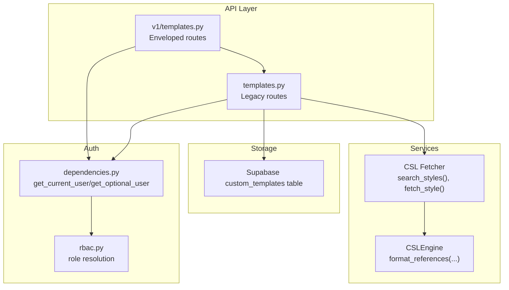
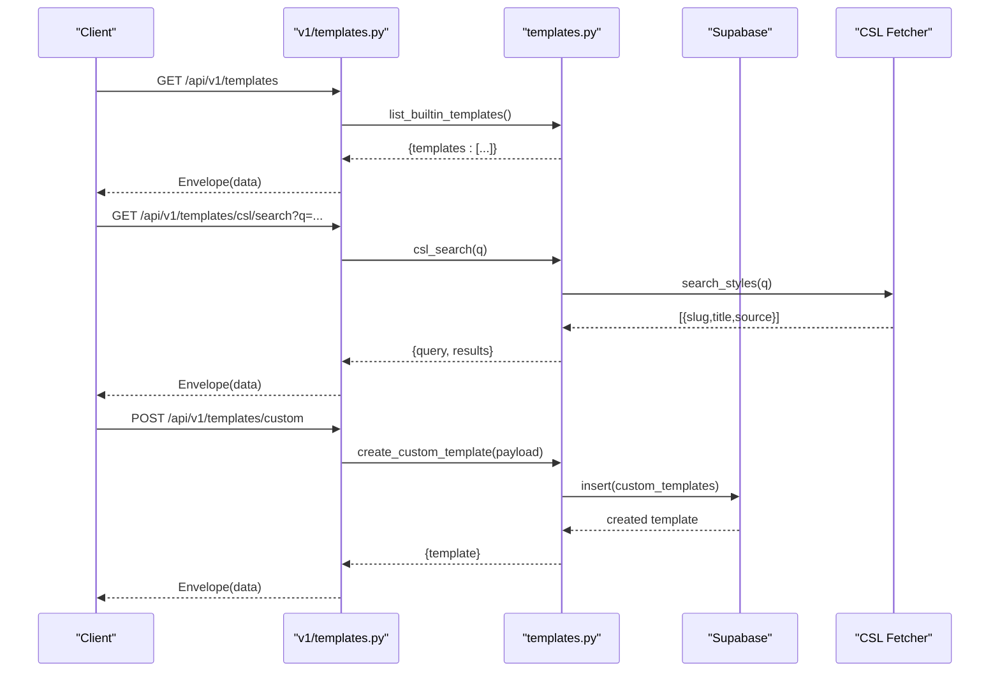
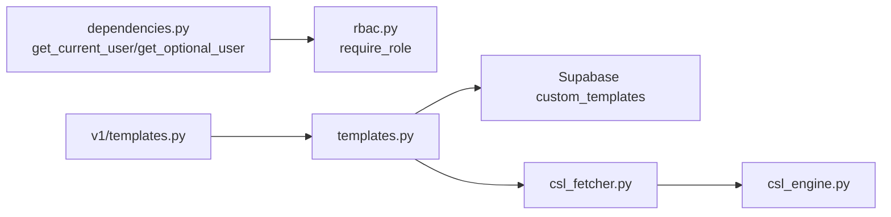

# Template Management Endpoints

<cite>
**Referenced Files in This Document**
- [templates.py](file://backend/app/routers/v1/templates.py)
- [templates.py](file://backend/app/routers/templates.py)
- [dependencies.py](file://backend/app/utils/dependencies.py)
- [rbac.py](file://backend/app/middleware/rbac.py)
- [csl_engine.py](file://backend/app/pipeline/services/csl_engine.py)
- [csl_fetcher.py](file://backend/app/pipeline/services/csl_fetcher.py)
- [template_creation_guide.md](file://backend/docs/template_creation_guide.md)
- [test_templates.py](file://backend/tests/test_templates.py)
</cite>

## Table of Contents
1. [Introduction](#introduction)
2. [Project Structure](#project-structure)
3. [Core Components](#core-components)
4. [Architecture Overview](#architecture-overview)
5. [Detailed Component Analysis](#detailed-component-analysis)
6. [Dependency Analysis](#dependency-analysis)
7. [Performance Considerations](#performance-considerations)
8. [Troubleshooting Guide](#troubleshooting-guide)
9. [Conclusion](#conclusion)
10. [Appendices](#appendices)

## Introduction
This document provides comprehensive API documentation for template management endpoints. It covers listing built-in templates, searching and fetching CSL styles, and managing custom templates (create, update, delete). It also documents request/response schemas, authentication and authorization requirements, validation rules, and operational workflows for template categories and formatting.

## Project Structure
The template management API is implemented in two router layers:
- Versioned v1 router that envelopes legacy endpoints and adds standardized response envelopes and error code mapping.
- Legacy router that implements the actual business logic and integrates with Supabase for custom templates and with CSL services for style discovery and retrieval.

**Diagram sources**
- [templates.py:17-189](file://backend/app/routers/v1/templates.py#L17-L189)
- [templates.py:43-327](file://backend/app/routers/templates.py#L43-L327)
- [dependencies.py:15-93](file://backend/app/utils/dependencies.py#L15-L93)
- [rbac.py:61-80](file://backend/app/middleware/rbac.py#L61-L80)
- [csl_engine.py:38-283](file://backend/app/pipeline/services/csl_engine.py#L38-L283)
- [csl_fetcher.py:80-180](file://backend/app/pipeline/services/csl_fetcher.py#L80-L180)

**Section sources**
- [templates.py:17-189](file://backend/app/routers/v1/templates.py#L17-L189)
- [templates.py:43-327](file://backend/app/routers/templates.py#L43-L327)
- [dependencies.py:15-93](file://backend/app/utils/dependencies.py#L15-L93)
- [rbac.py:61-80](file://backend/app/middleware/rbac.py#L61-L80)

## Core Components
- Built-in template listing: Returns curated academic styles (e.g., IEEE, APA, MLA, Chicago, Vancouver, Nature, Springer, Elsevier, Harvard, numeric, none, modern palettes, resume, portfolio).
- CSL search and fetch: Searches the broader CSL ecosystem (local and remote) and retrieves style XML by slug.
- Custom template CRUD: Create, list, update, and delete per-user templates stored in Supabase.

Key schemas:
- Template metadata: id, name, description, config/settings, timestamps.
- CSL style payload: slug, title/source, content (XML).
- Response envelope: standardized wrapper around data and errors.

**Section sources**
- [templates.py:119-166](file://backend/app/routers/templates.py#L119-L166)
- [templates.py:169-204](file://backend/app/routers/templates.py#L169-L204)
- [templates.py:225-326](file://backend/app/routers/templates.py#L225-L326)
- [templates.py:20-189](file://backend/app/routers/v1/templates.py#L20-L189)
- [csl_engine.py:38-283](file://backend/app/pipeline/services/csl_engine.py#L38-L283)
- [csl_fetcher.py:80-180](file://backend/app/pipeline/services/csl_fetcher.py#L80-L180)

## Architecture Overview
The v1 router delegates to the legacy router and wraps responses with a standardized envelope. Authentication is optional for listing built-in templates but required for custom template operations. Custom templates are persisted in Supabase. CSL operations leverage a local cache and remote fallback.

**Diagram sources**
- [templates.py:20-189](file://backend/app/routers/v1/templates.py#L20-L189)
- [templates.py:119-326](file://backend/app/routers/templates.py#L119-L326)
- [csl_fetcher.py:80-180](file://backend/app/pipeline/services/csl_fetcher.py#L80-L180)

## Detailed Component Analysis

### Endpoint: GET /api/v1/templates
- Purpose: List built-in academic styles.
- Behavior: Scans the templates directory for supported styles and returns a curated list with identifiers, names, and descriptions.
- Authentication: Not required.
- Response envelope: Enveloped by v1 router.
- Example response shape:
  - templates: array of objects with id, name, description, source.

Validation and constraints:
- Only predefined built-in styles are returned.
- Descriptions are mapped for select styles.

**Section sources**
- [templates.py:119-166](file://backend/app/routers/templates.py#L119-L166)
- [templates.py:20-30](file://backend/app/routers/v1/templates.py#L20-L30)

### Endpoint: GET /api/v1/templates/{id}
- Purpose: Retrieve details for a built-in template by id.
- Behavior: Returns metadata for the requested built-in style (e.g., id, name, description, source).
- Authentication: Not required.
- Notes: This endpoint is implied by the v1 router’s routing to the legacy router; the legacy router’s built-in listing returns metadata suitable for clients to discover and select styles.

**Section sources**
- [templates.py:20-30](file://backend/app/routers/v1/templates.py#L20-L30)
- [templates.py:119-166](file://backend/app/routers/templates.py#L119-L166)

### Endpoint: GET /api/v1/templates/csl/search
- Purpose: Search CSL styles by keyword.
- Query parameters:
  - q or query (required): search term with minimum length constraint.
- Behavior: Searches both local styles and remote CSL repository with caching.
- Authentication: Not required.
- Response envelope: Enveloped by v1 router with error code mapping.
- Example response shape:
  - query: the search term
  - results: array of {slug, title, source}

Validation and constraints:
- Requires a non-empty query parameter.

**Section sources**
- [templates.py:169-181](file://backend/app/routers/templates.py#L169-L181)
- [templates.py:33-48](file://backend/app/routers/v1/templates.py#L33-L48)
- [csl_fetcher.py:80-136](file://backend/app/pipeline/services/csl_fetcher.py#L80-L136)

### Endpoint: GET /api/v1/templates/csl/fetch
- Purpose: Fetch a CSL style XML by slug.
- Query parameters:
  - slug (required): style identifier.
- Behavior: Returns the CSL XML content for the style, with local-first lookup and remote fallback.
- Authentication: Not required.
- Response envelope: Enveloped by v1 router with error code mapping.
- Example response shape:
  - slug, source, content (XML string)

Validation and constraints:
- slug is required and non-empty.

**Section sources**
- [templates.py:194-198](file://backend/app/routers/templates.py#L194-L198)
- [templates.py:51-68](file://backend/app/routers/v1/templates.py#L51-L68)
- [csl_fetcher.py:138-180](file://backend/app/pipeline/services/csl_fetcher.py#L138-L180)

### Endpoint: GET /api/v1/templates/csl/{styleId}
- Purpose: Fetch a CSL style XML by style id/slug.
- Path parameter:
  - styleId (required): style identifier.
- Behavior: Same as csl/fetch but using path parameter.
- Authentication: Not required.
- Response envelope: Enveloped by v1 router with error code mapping.

**Section sources**
- [templates.py:200-204](file://backend/app/routers/templates.py#L200-L204)
- [templates.py:71-88](file://backend/app/routers/v1/templates.py#L71-L88)
- [csl_fetcher.py:138-180](file://backend/app/pipeline/services/csl_fetcher.py#L138-L180)

### Endpoint: GET /api/v1/templates/custom
- Purpose: List authenticated user’s custom templates.
- Authentication: Required (Bearer token).
- Behavior: Returns all custom templates owned by the authenticated user, ordered by last updated.
- Response envelope: Enveloped by v1 router with error code mapping.
- Example response shape:
  - templates: array of user’s template records

Validation and constraints:
- Requires a valid JWT; otherwise returns 401.

**Section sources**
- [templates.py:206-223](file://backend/app/routers/templates.py#L206-L223)
- [templates.py:91-108](file://backend/app/routers/v1/templates.py#L91-L108)
- [dependencies.py:15-93](file://backend/app/utils/dependencies.py#L15-L93)

### Endpoint: POST /api/v1/templates/custom
- Purpose: Create a new custom template for the authenticated user.
- Authentication: Required (Bearer token).
- Request body: Accepts either a top-level object or an object nested under template key. Supports name, description, config/settings, id, and timestamps.
- Behavior: Inserts a new record into the custom_templates table with user_id set to the authenticated user.
- Response envelope: Enveloped by v1 router with error code mapping.
- Example response shape:
  - template: the created record

Validation and constraints:
- name is required.
- config/settings must be an object.
- id is optional; if omitted, a UUID is generated.

Audit and logging:
- Logs the creation event with template name and IP address.

**Section sources**
- [templates.py:225-252](file://backend/app/routers/templates.py#L225-L252)
- [templates.py:111-134](file://backend/app/routers/v1/templates.py#L111-L134)
- [dependencies.py:15-93](file://backend/app/utils/dependencies.py#L15-L93)
- [test_templates.py:44-105](file://backend/tests/test_templates.py#L44-L105)

### Endpoint: PUT /api/v1/templates/custom/{templateId}
- Purpose: Update an authenticated user’s custom template.
- Authentication: Required (Bearer token).
- Path parameter:
  - templateId (required): target template id.
- Request body: Same payload structure as create.
- Behavior: Updates name, description, and config; enforces ownership and returns updated record.
- Response envelope: Enveloped by v1 router with error code mapping.
- Example response shape:
  - template: the updated record

Validation and constraints:
- Requires a valid JWT; otherwise returns 401.
- Returns 404 if the template does not exist or is not owned by the user.

Audit and logging:
- Logs the update event with template name and IP address.

**Section sources**
- [templates.py:254-297](file://backend/app/routers/templates.py#L254-L297)
- [templates.py:137-163](file://backend/app/routers/v1/templates.py#L137-L163)
- [dependencies.py:15-93](file://backend/app/utils/dependencies.py#L15-L93)

### Endpoint: DELETE /api/v1/templates/custom/{templateId}
- Purpose: Delete an authenticated user’s custom template.
- Authentication: Required (Bearer token).
- Path parameter:
  - templateId (required): target template id.
- Behavior: Deletes the template if owned by the user.
- Response envelope: Enveloped by v1 router with error code mapping.
- Example response shape:
  - status: "deleted"
  - id: the deleted template id

Validation and constraints:
- Requires a valid JWT; otherwise returns 401.
- Returns 404 if the template does not exist or is not owned by the user.

**Section sources**
- [templates.py:299-327](file://backend/app/routers/templates.py#L299-L327)
- [templates.py:166-189](file://backend/app/routers/v1/templates.py#L166-L189)
- [dependencies.py:15-93](file://backend/app/utils/dependencies.py#L15-L93)

## Dependency Analysis
- Authentication:
  - get_current_user/get_optional_user extract and validate JWTs from Authorization header or token query parameter.
  - Custom template endpoints require a valid token; optional token is accepted for listing built-in templates.
- Authorization:
  - Role-based guard (require_role) resolves roles from user metadata and enforces minimum role thresholds.
- Storage:
  - Supabase custom_templates table stores user templates with user_id, name, description, config, and timestamps.
- CSL:
  - csl_fetcher caches search and style results; csl_engine formats references using CSL styles.

**Diagram sources**
- [dependencies.py:15-93](file://backend/app/utils/dependencies.py#L15-L93)
- [rbac.py:61-80](file://backend/app/middleware/rbac.py#L61-L80)
- [templates.py:17-189](file://backend/app/routers/v1/templates.py#L17-L189)
- [templates.py:43-327](file://backend/app/routers/templates.py#L43-L327)
- [csl_fetcher.py:80-180](file://backend/app/pipeline/services/csl_fetcher.py#L80-L180)
- [csl_engine.py:38-283](file://backend/app/pipeline/services/csl_engine.py#L38-L283)

**Section sources**
- [dependencies.py:15-93](file://backend/app/utils/dependencies.py#L15-L93)
- [rbac.py:61-80](file://backend/app/middleware/rbac.py#L61-L80)
- [templates.py:43-327](file://backend/app/routers/templates.py#L43-L327)
- [csl_fetcher.py:80-180](file://backend/app/pipeline/services/csl_fetcher.py#L80-L180)
- [csl_engine.py:38-283](file://backend/app/pipeline/services/csl_engine.py#L38-L283)

## Performance Considerations
- CSL caching:
  - Search and style fetch operations are cached with TTLs configurable via settings. This reduces network latency and improves reliability in offline or constrained environments.
- Asynchronous fetching:
  - CSL search and style fetch use async HTTP clients to avoid blocking and improve throughput.
- Local-first strategy:
  - Local styles are prioritized to minimize external dependencies and improve responsiveness.

**Section sources**
- [csl_fetcher.py:23-38](file://backend/app/pipeline/services/csl_fetcher.py#L23-L38)
- [csl_fetcher.py:80-180](file://backend/app/pipeline/services/csl_fetcher.py#L80-L180)

## Troubleshooting Guide
Common errors and resolutions:
- Authentication failures:
  - 401 Unauthorized when accessing custom template endpoints without a valid token.
  - Use a valid Bearer token or ensure token is passed via Authorization header or token query parameter.
- Invalid payloads:
  - 422 Unprocessable Entity for missing name or invalid config type during template creation/update.
- Template not found:
  - 404 Not Found when updating/deleting a template that does not exist or is not owned by the user.
- CSL fetch failures:
  - 400 Invalid style slug or 502 Style fetch failed when slug is invalid or remote fetch fails.
- Internal errors:
  - 500 Internal Server Error for database or server-side failures; check logs for details.

Operational tips:
- Verify token validity and expiration.
- Confirm template payload structure matches expected schema.
- Ensure slug exists locally or is reachable remotely for CSL fetch.

**Section sources**
- [templates.py:59-62](file://backend/app/routers/templates.py#L59-L62)
- [templates.py:82-90](file://backend/app/routers/templates.py#L82-L90)
- [templates.py:282-282](file://backend/app/routers/templates.py#L282-L282)
- [templates.py:186-191](file://backend/app/routers/templates.py#L186-L191)
- [templates.py:102-108](file://backend/app/routers/v1/templates.py#L102-L108)
- [templates.py:127-131](file://backend/app/routers/v1/templates.py#L127-L131)
- [templates.py:155-160](file://backend/app/routers/v1/templates.py#L155-L160)
- [templates.py:181-185](file://backend/app/routers/v1/templates.py#L181-L185)

## Conclusion
The template management API provides a robust foundation for discovering built-in styles, searching and fetching CSL styles, and managing user-specific templates. It emphasizes secure authentication, standardized envelopes, and resilient CSL integration with caching and fallback strategies.

## Appendices

### Request/Response Schemas

- Template metadata (common fields)
  - id: string (UUID or custom)
  - name: string (required)
  - description: string (optional)
  - config: object (optional)
  - created_at: ISO timestamp (optional)
  - updated_at: ISO timestamp (optional)

- CSL style payload
  - slug: string
  - title: string
  - source: "local" | "remote"
  - content: string (XML)

- Built-in template item
  - id: string
  - name: string
  - description: string
  - source: "built_in"

- Envelope (standardized)
  - data: object or array
  - error: object (optional)

**Section sources**
- [templates.py:65-116](file://backend/app/routers/templates.py#L65-L116)
- [templates.py:119-166](file://backend/app/routers/templates.py#L119-L166)
- [templates.py:169-204](file://backend/app/routers/templates.py#L169-L204)
- [templates.py:25-30](file://backend/app/routers/v1/templates.py#L25-L30)
- [templates.py:42-48](file://backend/app/routers/v1/templates.py#L42-L48)
- [templates.py:59-68](file://backend/app/routers/v1/templates.py#L59-L68)
- [templates.py:79-88](file://backend/app/routers/v1/templates.py#L79-L88)

### Authentication and Permissions
- Authentication:
  - Required for custom template operations; optional for built-in listing.
  - Token extraction supports Authorization header and token query parameter.
- Authorization:
  - Role-based enforcement is available via require_role; current endpoints primarily rely on ownership checks for custom templates.

**Section sources**
- [dependencies.py:15-93](file://backend/app/utils/dependencies.py#L15-L93)
- [rbac.py:61-80](file://backend/app/middleware/rbac.py#L61-L80)
- [templates.py:209-209](file://backend/app/routers/templates.py#L209-L209)
- [templates.py:262-262](file://backend/app/routers/templates.py#L262-L262)

### Template Categories and Formatting Rules
- Built-in categories:
  - Academic styles: IEEE, APA, MLA, Chicago, Vancouver, Nature, Springer, Elsevier, Harvard, numeric, none.
  - Presentation/resume styles: modern_blue, modern_gold, modern_red, resume, portfolio.
- Formatting rules:
  - References are formatted by the CSL engine; templates render final reference text via Jinja2 variables.
  - Template creation guide outlines required Jinja2 variables and recommended blocks.

**Section sources**
- [templates.py:123-141](file://backend/app/routers/templates.py#L123-L141)
- [template_creation_guide.md:19-31](file://backend/docs/template_creation_guide.md#L19-L31)
- [template_creation_guide.md:82-91](file://backend/docs/template_creation_guide.md#L82-L91)
- [csl_engine.py:98-116](file://backend/app/pipeline/services/csl_engine.py#L98-L116)

### Publishing Workflows and Examples
- Template creation:
  - Use POST /api/v1/templates/custom with a payload containing name and optional config/settings.
  - The system persists the template under the authenticated user’s ownership.
- Style switching:
  - Use GET /api/v1/templates/csl/search to discover styles and GET /api/v1/templates/csl/fetch to retrieve the desired CSL XML.
- Template inheritance patterns:
  - Templates are independent per user; there is no built-in inheritance mechanism in the provided endpoints.

**Section sources**
- [templates.py:111-134](file://backend/app/routers/v1/templates.py#L111-L134)
- [templates.py:33-68](file://backend/app/routers/v1/templates.py#L33-L68)
- [test_templates.py:44-105](file://backend/tests/test_templates.py#L44-L105)