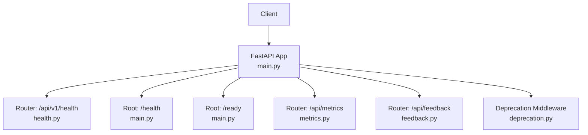
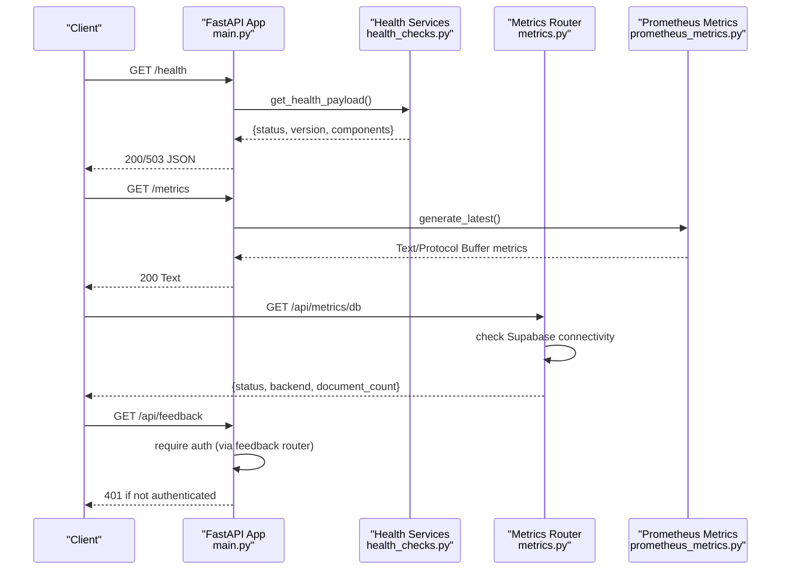
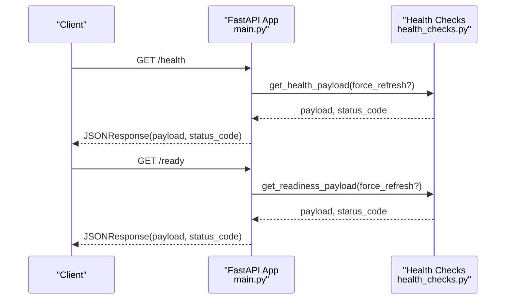
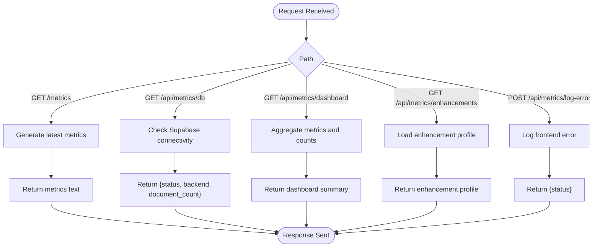
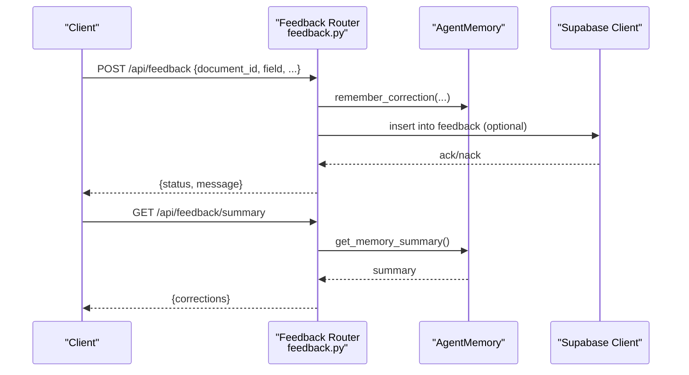
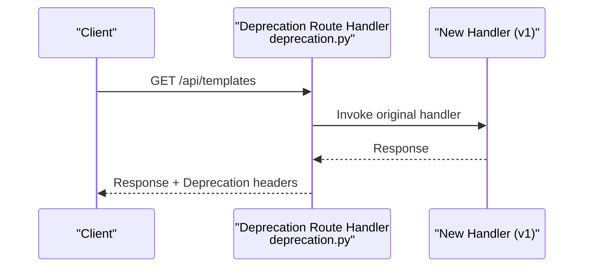
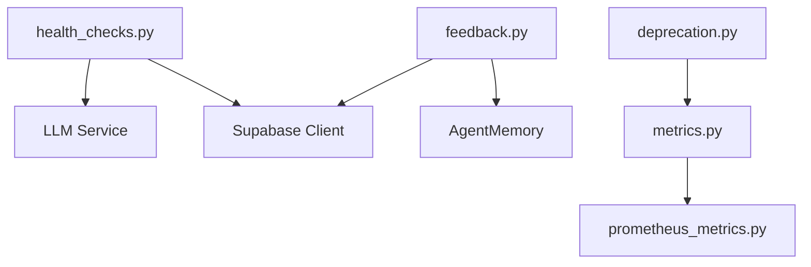

# Utility and Administrative Endpoints

<cite>
**Referenced Files in This Document**
- [main.py](file://backend/app/main.py)
- [metrics.py](file://backend/app/routers/metrics.py)
- [feedback.py](file://backend/app/routers/feedback.py)
- [deprecation.py](file://backend/app/routers/deprecation.py)
- [health.py](file://backend/app/routers/v1/health.py)
- [health_checks.py](file://backend/app/services/health_checks.py)
- [prometheus_metrics.py](file://backend/app/middleware/prometheus_metrics.py)
- [API.md](file://docs/API.md)
- [api_reference.md](file://docs/api_reference.md)
- [003-api-versioning-strategy.md](file://docs/adr/003-api-versioning-strategy.md)
</cite>

## Table of Contents
1. [Introduction](#introduction)
2. [Project Structure](#project-structure)
3. [Core Components](#core-components)
4. [Architecture Overview](#architecture-overview)
5. [Detailed Component Analysis](#detailed-component-analysis)
6. [Dependency Analysis](#dependency-analysis)
7. [Performance Considerations](#performance-considerations)
8. [Troubleshooting Guide](#troubleshooting-guide)
9. [Conclusion](#conclusion)
10. [Appendices](#appendices)

## Introduction
This document provides detailed API documentation for utility and administrative endpoints, focusing on:
- System health checks via GET /api/health and GET /api/v1/health
- Performance metrics and monitoring via GET /metrics and GET /api/metrics
- User feedback submission via POST /api/feedback
- API versioning deprecation notices and migration guidance

It covers response formats, endpoint categories, administrative controls, monitoring integrations, and error handling strategies.

## Project Structure
The backend exposes:
- Global health and readiness probes at the application root
- A versioned health endpoint under /api/v1/health
- A metrics router for operational dashboards and database health
- A feedback router for user corrections and improvements
- A deprecation mechanism for legacy routes

**Diagram sources**
- [main.py:360-381](file://backend/app/main.py#L360-L381)
- [health.py:17-42](file://backend/app/routers/v1/health.py#L17-L42)
- [metrics.py:18-23](file://backend/app/routers/metrics.py#L18-L23)
- [feedback.py:12-17](file://backend/app/routers/feedback.py#L12-L17)
- [deprecation.py:27-52](file://backend/app/routers/deprecation.py#L27-L52)

**Section sources**
- [main.py:360-381](file://backend/app/main.py#L360-L381)
- [health.py:17-42](file://backend/app/routers/v1/health.py#L17-L42)
- [metrics.py:18-23](file://backend/app/routers/metrics.py#L18-L23)
- [feedback.py:12-17](file://backend/app/routers/feedback.py#L12-L17)
- [deprecation.py:27-52](file://backend/app/routers/deprecation.py#L27-L52)

## Core Components
- Health and Readiness Probes
  - GET /health: Comprehensive health status including database, AI models, and LLM providers
  - GET /ready: Readiness evaluation of dependencies and model availability
  - GET /api/v1/health: Compatibility endpoint returning a simplified alive status
- Metrics and Monitoring
  - GET /metrics: Prometheus scrape endpoint for application metrics
  - GET /api/metrics/db: Database health and document count
  - GET /api/metrics/dashboard: Aggregated AI metrics and A/B testing summaries
  - GET /api/metrics/enhancements: Enhancement capability profile and queue status
  - POST /api/metrics/log-error: Frontend error logging with Prometheus counters
- Feedback Submission
  - POST /api/feedback: Submit user corrections for document fields; requires authentication
  - GET /api/feedback/summary: Summarized feedback; requires authentication
- API Versioning and Deprecation
  - Legacy routes (without /api/v1/) return deprecation headers and guide migration

**Section sources**
- [main.py:360-381](file://backend/app/main.py#L360-L381)
- [health.py:17-42](file://backend/app/routers/v1/health.py#L17-L42)
- [metrics.py:25-201](file://backend/app/routers/metrics.py#L25-L201)
- [feedback.py:22-76](file://backend/app/routers/feedback.py#L22-L76)
- [deprecation.py:11-52](file://backend/app/routers/deprecation.py#L11-L52)

## Architecture Overview
The system integrates health checks, metrics, feedback, and deprecation handling into a cohesive monitoring and administrative framework.

**Diagram sources**
- [main.py:360-381](file://backend/app/main.py#L360-L381)
- [health_checks.py:85-127](file://backend/app/services/health_checks.py#L85-L127)
- [metrics.py:25-58](file://backend/app/routers/metrics.py#L25-L58)
- [prometheus_metrics.py:135-142](file://backend/app/middleware/prometheus_metrics.py#L135-L142)

## Detailed Component Analysis

### Health and Readiness Endpoints
- GET /health
  - Purpose: System-wide health status including database, AI models, and LLM providers
  - Response: Includes overall status, version, and component statuses
  - Status Codes: 200 if healthy, 503 if degraded
- GET /ready
  - Purpose: Readiness probe for orchestration systems
  - Response: Includes readiness flag, timestamp, and component checks
  - Status Codes: 200 if ready, 503 otherwise
- GET /api/v1/health
  - Purpose: Compatibility endpoint returning a simple alive status
  - Response: Envelope with status field
  - Notes: Part of the v1 API with standardized envelope

**Diagram sources**
- [main.py:360-381](file://backend/app/main.py#L360-L381)
- [health_checks.py:195-260](file://backend/app/services/health_checks.py#L195-L260)

**Section sources**
- [main.py:360-381](file://backend/app/main.py#L360-L381)
- [health.py:17-42](file://backend/app/routers/v1/health.py#L17-L42)
- [health_checks.py:85-127](file://backend/app/services/health_checks.py#L85-L127)
- [health_checks.py:130-192](file://backend/app/services/health_checks.py#L130-L192)

### Metrics and Monitoring Endpoints
- GET /metrics
  - Purpose: Prometheus metrics endpoint for scraping
  - Response: Plain text exposition of metrics
  - Notes: Not authenticated; instrumented via middleware
- GET /api/metrics/db
  - Purpose: Database health and document count
  - Response: status, backend, document_count
  - Access: Requires admin role
- GET /api/metrics/dashboard
  - Purpose: Aggregated AI metrics and A/B testing summaries
  - Response: persistent_db_status, database_records, live metrics summary
  - Access: Requires admin role
- GET /api/metrics/enhancements
  - Purpose: Enhancement capability profile and queue status
  - Response: enhancements_enabled, queue_mode, queue_ready, profiles
  - Access: Requires admin role
- POST /api/metrics/log-error
  - Purpose: Log frontend errors with client context
  - Response: status indicator; increments Prometheus counters if available
  - Access: Optional user context

**Diagram sources**
- [metrics.py:25-201](file://backend/app/routers/metrics.py#L25-L201)
- [prometheus_metrics.py:135-142](file://backend/app/middleware/prometheus_metrics.py#L135-L142)

**Section sources**
- [metrics.py:25-201](file://backend/app/routers/metrics.py#L25-L201)
- [prometheus_metrics.py:135-235](file://backend/app/middleware/prometheus_metrics.py#L135-L235)

### Feedback Submission Endpoint
- POST /api/feedback
  - Purpose: Submit user feedback/corrections for document fields
  - Schema: document_id, field, original_value, corrected_value, comments (optional)
  - Behavior: Stores in-memory for immediate access; attempts to persist to Supabase
  - Response: success envelope with message
  - Access: Requires authenticated user
- GET /api/feedback/summary
  - Purpose: Retrieve summarized feedback
  - Response: correction summary
  - Access: Requires authenticated user

**Diagram sources**
- [feedback.py:29-76](file://backend/app/routers/feedback.py#L29-L76)

**Section sources**
- [feedback.py:22-76](file://backend/app/routers/feedback.py#L22-L76)

### API Versioning and Deprecation
- Legacy routes (without /api/v1/) remain functional but include deprecation headers:
  - Deprecation: true
  - Sunset: 2026-05-01
  - Link: successor-version pointing to the v1 path
- Migration strategy:
  - Update client calls to use /api/v1/ prefixed endpoints
  - Respect the deprecation headers to plan migration timelines

**Diagram sources**
- [deprecation.py:35-52](file://backend/app/routers/deprecation.py#L35-L52)

**Section sources**
- [deprecation.py:11-52](file://backend/app/routers/deprecation.py#L11-L52)
- [API.md:5,205-208:5-208](file://docs/API.md#L5-L208)
- [api_reference.md:1-69](file://docs/api_reference.md#L1-L69)
- [003-api-versioning-strategy.md:1-10](file://docs/adr/003-api-versioning-strategy.md#L1-L10)

## Dependency Analysis
- Health checks depend on:
  - Supabase health checks
  - LLM service health
  - Optional external services (e.g., Ollama)
- Metrics endpoint depends on:
  - Prometheus metrics definitions and middleware
  - Optional queue depth updates from Redis/Celery
- Feedback endpoint depends on:
  - Agent memory for in-memory storage
  - Supabase client for persistence
- Deprecation middleware wraps route handlers to attach headers

**Diagram sources**
- [health_checks.py:88-127](file://backend/app/services/health_checks.py#L88-L127)
- [metrics.py:11-16](file://backend/app/routers/metrics.py#L11-L16)
- [feedback.py:4-6](file://backend/app/routers/feedback.py#L4-L6)
- [deprecation.py:35-52](file://backend/app/routers/deprecation.py#L35-L52)

**Section sources**
- [health_checks.py:85-127](file://backend/app/services/health_checks.py#L85-L127)
- [metrics.py:11-16](file://backend/app/routers/metrics.py#L11-L16)
- [feedback.py:4-6](file://backend/app/routers/feedback.py#L4-L6)
- [deprecation.py:35-52](file://backend/app/routers/deprecation.py#L35-L52)

## Performance Considerations
- Health and readiness payloads are cached with TTLs to reduce repeated checks
- Prometheus metrics are exposed via a dedicated endpoint for efficient scraping
- Metrics manager provides helpers to record pipeline durations, tool usage, and queue depths
- Frontend error logs increment counters for observability without blocking the request

[No sources needed since this section provides general guidance]

## Troubleshooting Guide
- System Unavailability
  - Symptoms: GET /health returns 503; components show unhealthy or unavailable
  - Actions: Verify Supabase connectivity, LLM provider endpoints, and model loading
- Metric Collection Failures
  - Symptoms: GET /metrics not available or incomplete; /api/metrics/db returns unavailable
  - Actions: Check Prometheus middleware registration and Supabase credentials
- Administrative Access Restrictions
  - Symptoms: 401/403 on /api/metrics endpoints requiring admin role
  - Actions: Ensure proper RBAC roles and authentication tokens
- Legacy Route Deprecation
  - Symptoms: Deprecation headers present on legacy endpoints
  - Actions: Migrate to /api/v1/ equivalents and monitor sunset date

**Section sources**
- [main.py:360-381](file://backend/app/main.py#L360-L381)
- [metrics.py:25-58](file://backend/app/routers/metrics.py#L25-L58)
- [deprecation.py:11-18](file://backend/app/routers/deprecation.py#L11-L18)

## Conclusion
The backend provides robust utility and administrative endpoints for health monitoring, metrics collection, feedback processing, and controlled API evolution through deprecation headers. Clients should integrate with the /api/v1/ endpoints and use GET /metrics for Prometheus-based monitoring to ensure reliable operations and smooth migrations.

[No sources needed since this section summarizes without analyzing specific files]

## Appendices

### Endpoint Reference Summary
- GET /health
  - Description: System-wide health status
  - Response: JSON with status, version, and component statuses
  - Notes: 200 if healthy, 503 if degraded
- GET /ready
  - Description: Readiness evaluation
  - Response: JSON with ready flag, timestamp, and component checks
  - Notes: 200 if ready, 503 otherwise
- GET /api/v1/health
  - Description: Compatibility endpoint
  - Response: Envelope with status field
- GET /metrics
  - Description: Prometheus metrics endpoint
  - Response: Plain text metrics
- GET /api/metrics/db
  - Description: Database health and document count
  - Response: {status, backend, document_count}
  - Access: Admin required
- GET /api/metrics/dashboard
  - Description: Aggregated AI metrics and A/B testing summaries
  - Response: Dashboard summary
  - Access: Admin required
- GET /api/metrics/enhancements
  - Description: Enhancement capability profile
  - Response: Profile and queue status
  - Access: Admin required
- POST /api/metrics/log-error
  - Description: Log frontend errors
  - Response: {status}
- POST /api/feedback
  - Description: Submit user feedback
  - Schema: {document_id, field, original_value, corrected_value, comments?}
  - Response: Success envelope
  - Access: Authenticated user required
- GET /api/feedback/summary
  - Description: Summarized feedback
  - Response: Corrections summary
  - Access: Authenticated user required

**Section sources**
- [main.py:360-381](file://backend/app/main.py#L360-L381)
- [health.py:17-42](file://backend/app/routers/v1/health.py#L17-L42)
- [metrics.py:25-201](file://backend/app/routers/metrics.py#L25-L201)
- [feedback.py:22-76](file://backend/app/routers/feedback.py#L22-L76)
- [API.md:190-208](file://docs/API.md#L190-L208)