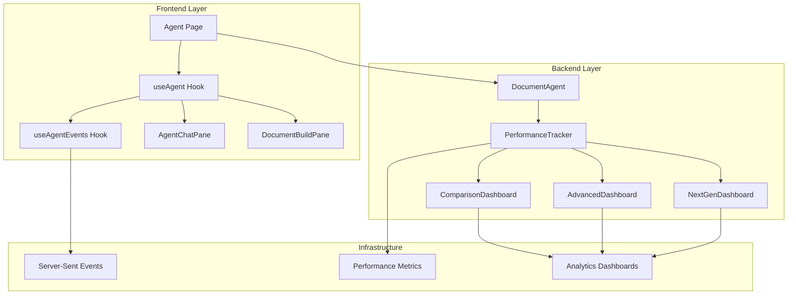
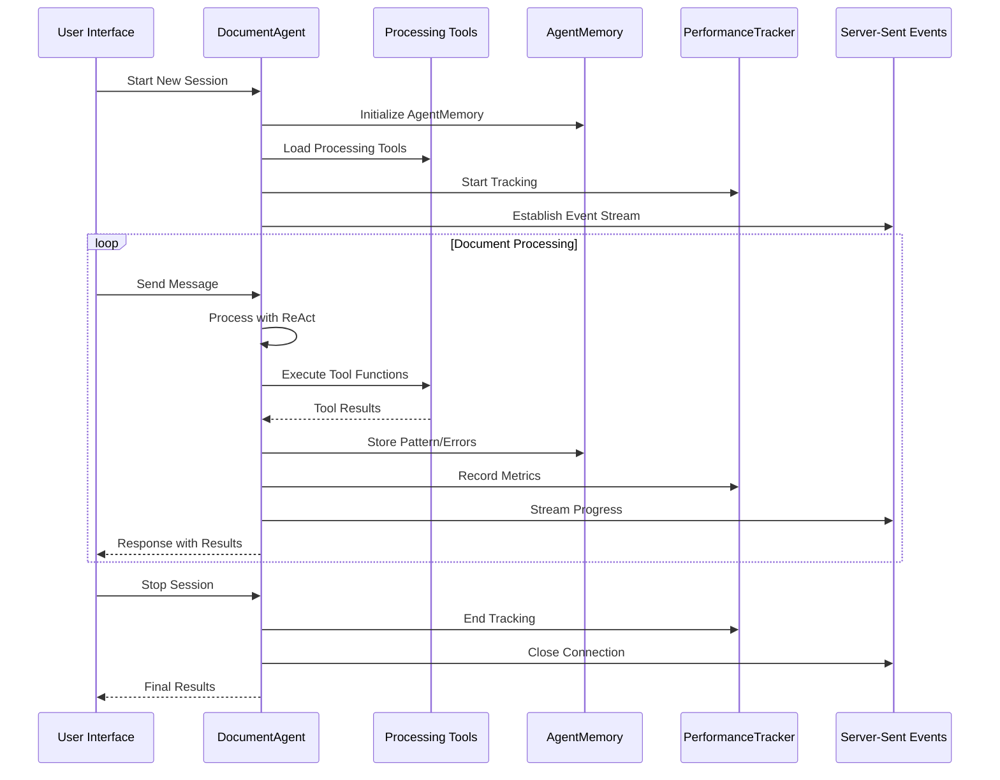
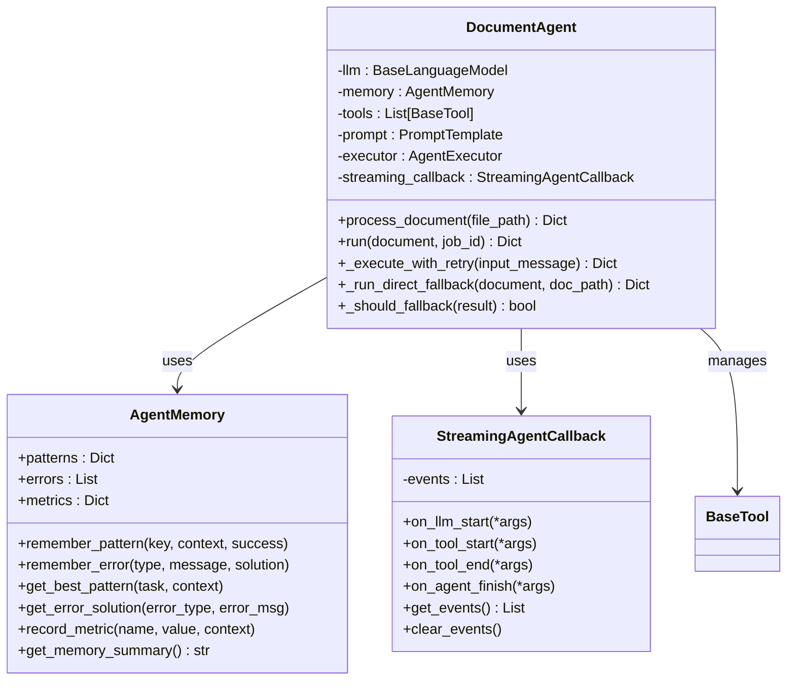
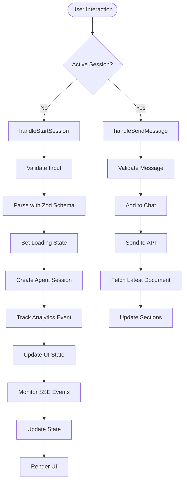
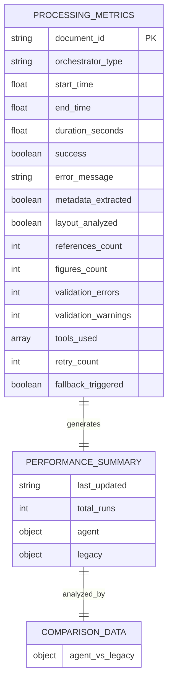
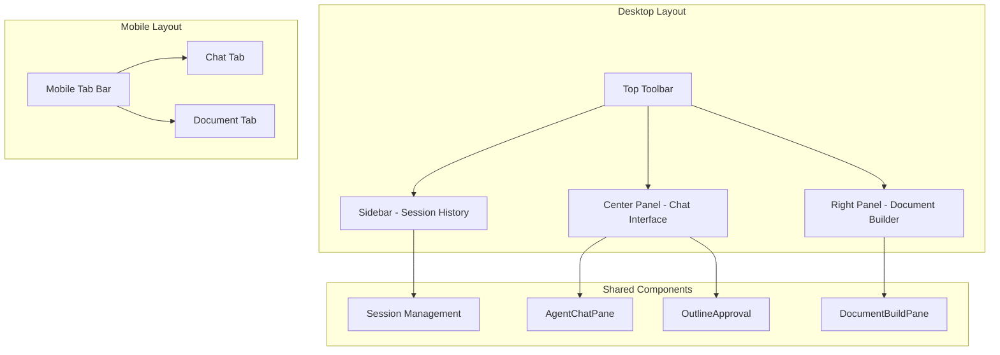
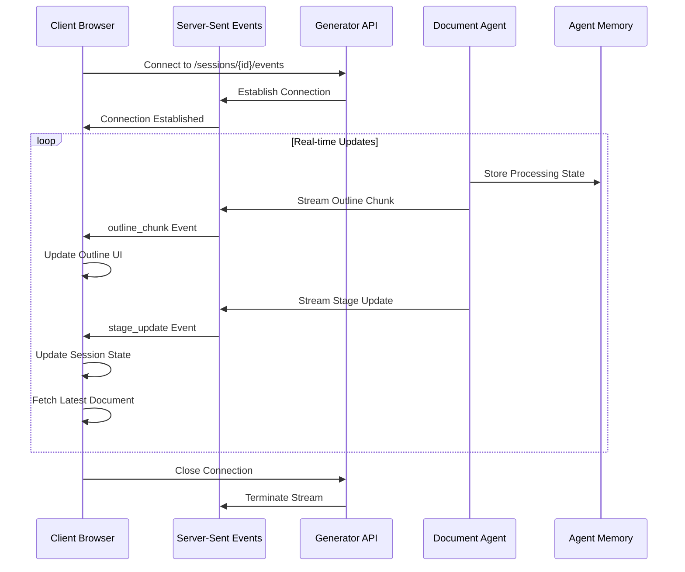
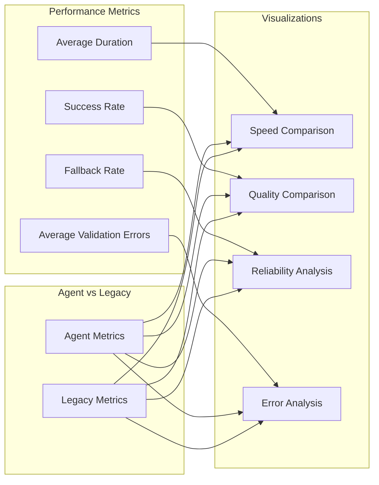

# Agent Page Enhancements

<cite>
**Referenced Files in This Document**
- [document_agent.py](file://backend/app/pipeline/agents/document_agent.py)
- [dashboard.py](file://backend/app/pipeline/agents/dashboard.py)
- [advanced_dashboard.py](file://backend/app/pipeline/agents/advanced_dashboard.py)
- [nextgen_dashboard.py](file://backend/app/pipeline/agents/nextgen_dashboard.py)
- [metrics.py](file://backend/app/pipeline/agents/metrics.py)
- [useAgent.js](file://frontend/src/hooks/useAgent.js)
- [useAgentEvents.js](file://frontend/src/hooks/useAgentEvents.js)
- [page.jsx](file://frontend/app/(generator)/(protected)/agent/page.jsx)
- [api.generator.v1.js](file://frontend/src/services/api.generator.v1.js)
- [test_agent_enhancements.py](file://backend/tests/test_agent_enhancements.py)
</cite>

## Table of Contents
1. [Introduction](#introduction)
2. [Project Structure](#project-structure)
3. [Core Components](#core-components)
4. [Architecture Overview](#architecture-overview)
5. [Detailed Component Analysis](#detailed-component-analysis)
6. [Enhanced Agent Page Implementation](#enhanced-agent-page-implementation)
7. [Performance Monitoring and Analytics](#performance-monitoring-and-analytics)
8. [Advanced Dashboard Features](#advanced-dashboard-features)
9. [Integration Patterns](#integration-patterns)
10. [Conclusion](#conclusion)

## Introduction

The Agent Page Enhancements represent a comprehensive upgrade to the AI-powered document generation system, introducing sophisticated agent capabilities, real-time collaboration features, and advanced analytics dashboards. This enhancement transforms the traditional document processing workflow into an intelligent, adaptive, and highly interactive experience that leverages machine learning patterns, real-time streaming, and comprehensive performance monitoring.

The system now supports multiple AI agent architectures including traditional ReAct agents, advanced ML-powered agents, and next-generation transformer-based systems, each providing different levels of sophistication and capability. The enhanced agent page serves as the central hub for managing these intelligent document processing workflows.

## Project Structure

The enhanced agent system follows a modular architecture with clear separation between backend agent processing, frontend user interface, and comprehensive analytics infrastructure.

**Diagram sources**
- [page.jsx](file://frontend/app/(generator)/(protected)/agent/page.jsx#L1-L323)
- [document_agent.py:1-483](file://backend/app/pipeline/agents/document_agent.py#L1-L483)
- [metrics.py:1-260](file://backend/app/pipeline/agents/metrics.py#L1-L260)

**Section sources**
- [page.jsx](file://frontend/app/(generator)/(protected)/agent/page.jsx#L1-L323)
- [document_agent.py:1-483](file://backend/app/pipeline/agents/document_agent.py#L1-L483)

## Core Components

The enhanced agent system consists of several interconnected components that work together to provide a seamless document generation experience.

### Backend Agent Infrastructure

The backend agent infrastructure provides the core processing capabilities through specialized agent classes and supporting utilities.

### Frontend Agent Interface

The frontend interface offers a responsive, real-time collaborative environment with integrated chat functionality and document building capabilities.

### Analytics and Monitoring

Comprehensive analytics systems track performance metrics, generate comparative reports, and provide insights into agent effectiveness and system reliability.

**Section sources**
- [document_agent.py:71-186](file://backend/app/pipeline/agents/document_agent.py#L71-L186)
- [useAgent.js:18-305](file://frontend/src/hooks/useAgent.js#L18-L305)
- [metrics.py:48-67](file://backend/app/pipeline/agents/metrics.py#L48-L67)

## Architecture Overview

The enhanced agent system implements a sophisticated multi-agent architecture that supports various processing paradigms and provides comprehensive monitoring capabilities.

**Diagram sources**
- [document_agent.py:273-357](file://backend/app/pipeline/agents/document_agent.py#L273-L357)
- [useAgentEvents.js:23-156](file://frontend/src/hooks/useAgentEvents.js#L23-L156)
- [metrics.py:68-146](file://backend/app/pipeline/agents/metrics.py#L68-L146)

The architecture supports multiple processing modes including traditional ReAct agent execution, direct tool execution fallback, and streaming response capabilities. The system maintains comprehensive state management and provides real-time feedback through server-sent events.

**Section sources**
- [document_agent.py:188-243](file://backend/app/pipeline/agents/document_agent.py#L188-L243)
- [useAgent.js:145-197](file://frontend/src/hooks/useAgent.js#L145-L197)

## Detailed Component Analysis

### DocumentAgent Enhancement

The DocumentAgent represents the core intelligence behind the enhanced agent system, incorporating advanced features for intelligent document processing.

**Diagram sources**
- [document_agent.py:71-483](file://backend/app/pipeline/agents/document_agent.py#L71-L483)

The DocumentAgent incorporates several key enhancements:

- **Multi-provider LLM Support**: Compatible with OpenAI, Anthropic, and Ollama providers
- **Intelligent Memory System**: Persistent pattern recognition and error recovery
- **Streaming Capabilities**: Real-time response streaming with callback mechanisms
- **Fallback Mechanisms**: Graceful degradation to direct tool execution
- **Retry Logic**: Configurable retry attempts with exponential backoff

**Section sources**
- [document_agent.py:83-157](file://backend/app/pipeline/agents/document_agent.py#L83-L157)

### Frontend Agent Hooks

The frontend implementation provides sophisticated state management and real-time communication capabilities through custom React hooks.

**Diagram sources**
- [useAgent.js:145-230](file://frontend/src/hooks/useAgent.js#L145-L230)
- [useAgentEvents.js:23-156](file://frontend/src/hooks/useAgentEvents.js#L23-L156)

**Section sources**
- [useAgent.js:18-305](file://frontend/src/hooks/useAgent.js#L18-L305)
- [useAgentEvents.js:1-163](file://frontend/src/hooks/useAgentEvents.js#L1-L163)

### Performance Monitoring System

The performance monitoring system provides comprehensive tracking and analysis capabilities for agent effectiveness and system reliability.

**Diagram sources**
- [metrics.py:15-46](file://backend/app/pipeline/agents/metrics.py#L15-L46)
- [metrics.py:182-207](file://backend/app/pipeline/agents/metrics.py#L182-L207)

**Section sources**
- [metrics.py:48-260](file://backend/app/pipeline/agents/metrics.py#L48-L260)

## Enhanced Agent Page Implementation

The enhanced agent page provides a sophisticated, real-time collaborative environment for AI-powered document generation with comprehensive monitoring and analytics capabilities.

### Responsive Layout Architecture

The agent page implements a flexible, responsive layout that adapts seamlessly between desktop and mobile environments while maintaining full functionality.

**Diagram sources**
- [page.jsx](file://frontend/app/(generator)/(protected)/agent/page.jsx#L284-L311)
- [page.jsx](file://frontend/app/(generator)/(protected)/agent/page.jsx#L247-L282)

### Real-time Communication System

The enhanced agent page utilizes server-sent events (SSE) for real-time communication, enabling dynamic updates to the user interface without requiring page refreshes.

**Diagram sources**
- [useAgentEvents.js:36-145](file://frontend/src/hooks/useAgentEvents.js#L36-L145)
- [api.generator.v1.js:39-48](file://frontend/src/services/api.generator.v1.js#L39-L48)

### Template and Configuration Management

The agent page provides comprehensive template selection and configuration management capabilities, allowing users to customize their document generation preferences.

**Section sources**
- [page.jsx](file://frontend/app/(generator)/(protected)/agent/page.jsx#L1-L323)
- [useAgent.js:28-296](file://frontend/src/hooks/useAgent.js#L28-L296)

## Performance Monitoring and Analytics

The enhanced system includes sophisticated performance monitoring and analytics capabilities that provide deep insights into agent effectiveness and system reliability.

### Comparative Performance Dashboard

The comparative performance dashboard generates comprehensive HTML reports that compare agent performance against legacy processing methods across multiple dimensions.

**Diagram sources**
- [dashboard.py:165-219](file://backend/app/pipeline/agents/dashboard.py#L165-L219)
- [metrics.py:230-259](file://backend/app/pipeline/agents/metrics.py#L230-L259)

### Advanced Analytics Dashboard

The advanced analytics dashboard provides ML-powered insights and multi-agent coordination capabilities, offering comprehensive analysis of system performance and optimization opportunities.

**Section sources**
- [dashboard.py:10-42](file://backend/app/pipeline/agents/dashboard.py#L10-L42)
- [advanced_dashboard.py:17-60](file://backend/app/pipeline/agents/advanced_dashboard.py#L17-L60)

## Advanced Dashboard Features

The next-generation dashboard introduces cutting-edge features including deep learning integration, federated learning capabilities, real-time adaptation, auto-scaling, and tool marketplace functionality.

### Deep Learning Integration

The transformer-based pattern detection system leverages advanced neural networks for intelligent document processing pattern recognition and optimization.

### Federated Learning Architecture

The federated learning system enables distributed model training across multiple nodes while preserving data privacy and security, providing collaborative intelligence without centralized data collection.

### Real-time Adaptation System

The real-time adaptation system dynamically adjusts agent parameters and strategies based on current processing conditions, optimizing performance and resource utilization in real-time.

**Section sources**
- [nextgen_dashboard.py:17-45](file://backend/app/pipeline/agents/nextgen_dashboard.py#L17-L45)
- [advanced_dashboard.py:17-42](file://backend/app/pipeline/agents/advanced_dashboard.py#L17-L42)

## Integration Patterns

The enhanced agent system implements several sophisticated integration patterns that enable seamless interaction between frontend and backend components while maintaining scalability and reliability.

### API Integration Patterns

The frontend communicates with backend services through well-defined API patterns that support both synchronous operations and asynchronous streaming responses.

### State Management Integration

The system integrates frontend state management with backend session management, ensuring consistency across user interactions and system events.

### Event-driven Architecture

The implementation leverages event-driven patterns for real-time communication, enabling responsive user interfaces and efficient resource utilization.

**Section sources**
- [api.generator.v1.js:1-80](file://frontend/src/services/api.generator.v1.js#L1-L80)
- [useAgent.js:41-143](file://frontend/src/hooks/useAgent.js#L41-L143)

## Conclusion

The Agent Page Enhancements represent a significant advancement in AI-powered document generation technology, introducing sophisticated agent capabilities, real-time collaboration features, and comprehensive analytics infrastructure. The system successfully balances advanced functionality with user accessibility, providing both powerful capabilities for experienced users and intuitive interfaces for newcomers.

Key achievements include:

- **Multi-agent Architecture**: Support for various agent types from traditional ReAct agents to next-generation transformer-based systems
- **Real-time Collaboration**: Comprehensive streaming capabilities with server-sent events for dynamic user interfaces
- **Advanced Analytics**: Sophisticated performance monitoring and comparative analysis systems
- **Responsive Design**: Flexible layouts that adapt seamlessly across device types and screen sizes
- **Scalable Infrastructure**: Robust backend architecture supporting high-volume processing and monitoring

The enhanced system provides a foundation for continued innovation in AI-powered document processing, with extensible architecture that supports future enhancements and integration of emerging technologies.