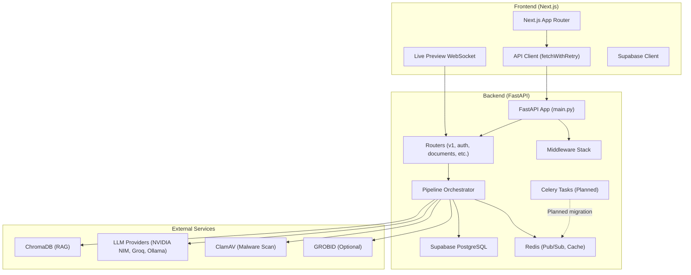
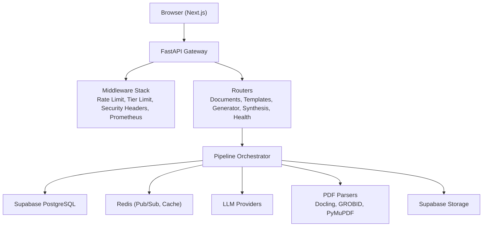
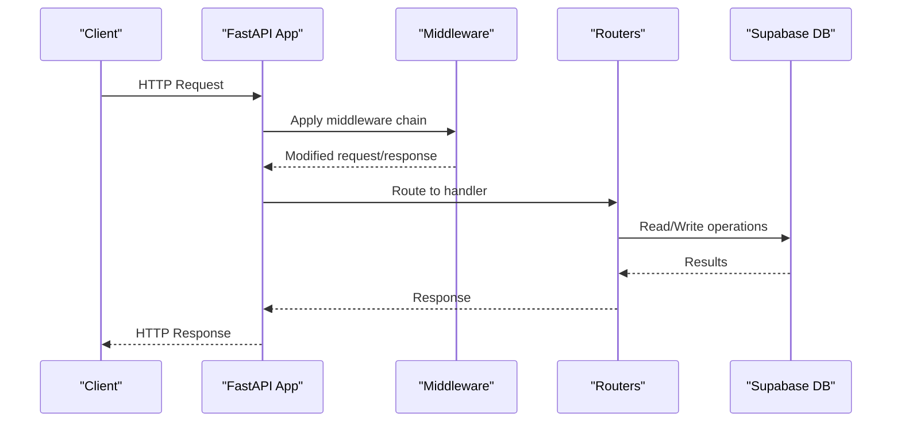
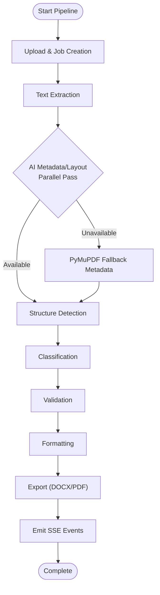
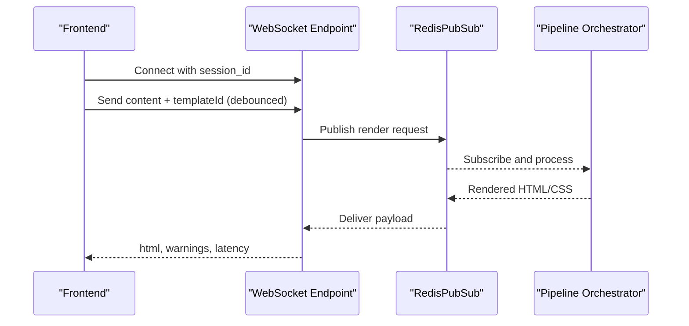
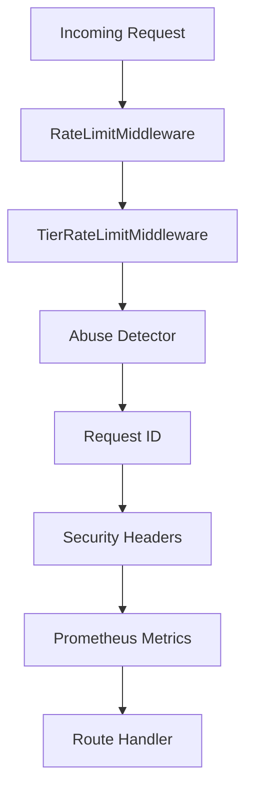
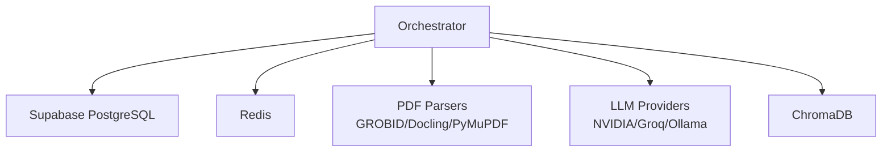
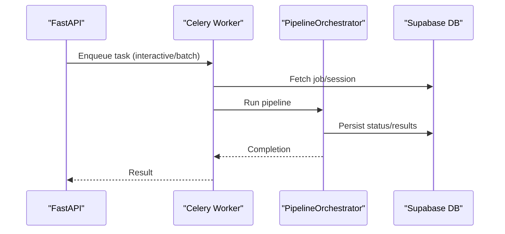
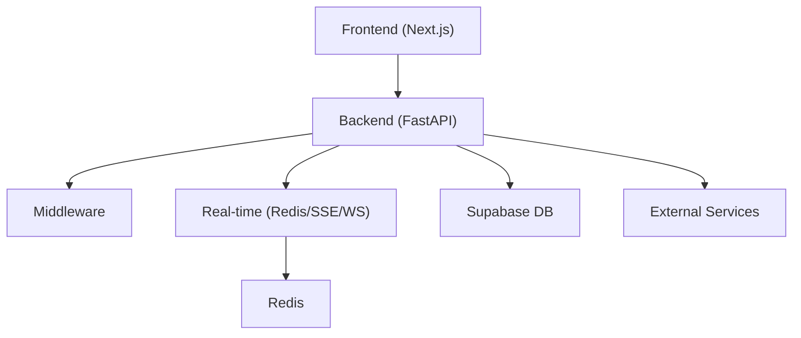

# Architecture Overview

<cite>
**Referenced Files in This Document**
- [architecture.md](file://docs/architecture.md)
- [TechStack.md](file://docs/TechStack.md)
- [Deployment.md](file://docs/Deployment.md)
- [main.py](file://backend/app/main.py)
- [orchestrator.py](file://backend/app/pipeline/orchestrator.py)
- [celery_tasks.py](file://backend/app/tasks/celery_tasks.py)
- [session.py](file://backend/app/db/session.py)
- [pubsub.py](file://backend/app/realtime/pubsub.py)
- [rate_limit.py](file://backend/app/middleware/rate_limit.py)
- [Dockerfile](file://backend/docker/Dockerfile)
- [docker-compose.yml](file://backend/docker/docker-compose.yml)
- [next.config.mjs](file://frontend/next.config.mjs)
- [supabaseClient.js](file://frontend/src/lib/supabaseClient.js)
- [useLivePreviewSocket.js](file://frontend/src/hooks/useLivePreviewSocket.js)
- [api.core.js](file://frontend/src/services/api.core.js)
- [render.yaml](file://render.yaml)
</cite>

## Table of Contents
1. [Introduction](#introduction)
2. [Project Structure](#project-structure)
3. [Core Components](#core-components)
4. [Architecture Overview](#architecture-overview)
5. [Detailed Component Analysis](#detailed-component-analysis)
6. [Dependency Analysis](#dependency-analysis)
7. [Performance Considerations](#performance-considerations)
8. [Troubleshooting Guide](#troubleshooting-guide)
9. [Conclusion](#conclusion)
10. [Appendices](#appendices)

## Introduction
This document presents the architecture of the Automated Academic Manuscript Formatter system. It describes the full-stack design with a Next.js frontend, a FastAPI backend, and supporting technologies for real-time processing, AI-driven document formatting, and scalable deployment. The system emphasizes a pipeline-based processing architecture, robust middleware for security and rate limiting, and real-time communication via Redis-backed pub/sub and SSE/WebSocket channels. The document also covers technology choices, integration patterns, scalability considerations, and deployment topology aligned with free-tier cloud providers.

## Project Structure
The repository is organized into three primary areas:
- Frontend: Next.js 14 application with App Router, client-side real-time sockets, and Supabase integration.
- Backend: FastAPI application with middleware, routers, pipeline orchestration, Celery task definitions, and real-time pub/sub.
- Docs: Architectural, technology stack, and deployment guides.

**Diagram sources**
- [main.py:263-383](file://backend/app/main.py#L263-L383)
- [api.core.js:1-368](file://frontend/src/services/api.core.js#L1-L368)
- [useLivePreviewSocket.js:1-137](file://frontend/src/hooks/useLivePreviewSocket.js#L1-L137)
- [pubsub.py:1-120](file://backend/app/realtime/pubsub.py#L1-L120)
- [session.py:1-130](file://backend/app/db/session.py#L1-L130)

**Section sources**
- [architecture.md:1-173](file://docs/architecture.md#L1-L173)
- [TechStack.md:1-122](file://docs/TechStack.md#L1-L122)

## Core Components
- Frontend (Next.js)
  - App Router with 34 routes, Supabase client initialization, and real-time WebSocket integration for live preview.
  - Optimizations include tree-shaking and Sentry integration for error tracking.
- Backend (FastAPI)
  - Central application with middleware stack (rate limiting, tier-aware limits, security headers, request ID, Prometheus metrics).
  - Routers for documents, templates, generator, synthesis, billing, health, metrics, feedback, stream, preview, and generator.
  - Pipeline orchestrator coordinates multi-stage document processing with safety guards and Redis-backed pub/sub/SSE.
- Real-time Communication
  - RedisPubSub provides publish/subscribe with in-memory fallback.
  - WebSocket for live preview and SSE for streaming pipeline events.
- Data Layer
  - Supabase PostgreSQL for user, job, and session data; Redis for caching and pub/sub; ChromaDB for vector embeddings.
- External Integrations
  - GROBID (optional), ClamAV, LLM providers (NVIDIA NIM, Groq, Ollama), and Docling for PDF parsing.

**Section sources**
- [main.py:263-383](file://backend/app/main.py#L263-L383)
- [api.core.js:1-368](file://frontend/src/services/api.core.js#L1-L368)
- [useLivePreviewSocket.js:1-137](file://frontend/src/hooks/useLivePreviewSocket.js#L1-L137)
- [pubsub.py:1-120](file://backend/app/realtime/pubsub.py#L1-L120)
- [session.py:1-130](file://backend/app/db/session.py#L1-L130)
- [TechStack.md:1-122](file://docs/TechStack.md#L1-L122)

## Architecture Overview
The system follows a FastAPI-only backend architecture with a Next.js frontend. The backend exposes REST endpoints and real-time channels, while the frontend provides user interactions and live previews. The pipeline orchestrator coordinates processing stages, emitting status updates via SSE and storing progress in the database. Redis serves as the backbone for pub/sub, caching, and eventual Celery integration.

**Diagram sources**
- [architecture.md:39-117](file://docs/architecture.md#L39-L117)
- [main.py:273-358](file://backend/app/main.py#L273-L358)

**Section sources**
- [architecture.md:1-173](file://docs/architecture.md#L1-L173)
- [TechStack.md:1-122](file://docs/TechStack.md#L1-L122)

## Detailed Component Analysis

### Backend Application (FastAPI)
- Application lifecycle and middleware registration are centralized in the main application factory.
- Middleware order and responsibilities:
  - Prometheus metrics instrumentation.
  - Rate limiting (base and uploads) and tier-aware rate limiting.
  - Abuse detection, request ID, security headers, and HTTPS redirect in production.
  - Audit logging for write operations.
- Routers include v1 endpoints, auth, documents, templates, metrics, feedback, stream, preview, and generator.
- Health and readiness probes expose service status and dependency health.

**Diagram sources**
- [main.py:273-358](file://backend/app/main.py#L273-L358)
- [session.py:79-112](file://backend/app/db/session.py#L79-L112)

**Section sources**
- [main.py:263-383](file://backend/app/main.py#L263-L383)
- [session.py:1-130](file://backend/app/db/session.py#L1-L130)

### Pipeline Orchestrator
- Coordinates the end-to-end document processing pipeline from upload to export.
- Stages include extraction, AI metadata/layout extraction (parallel), structure detection, classification, validation, formatting, and export.
- Uses Redis pub/sub to emit SSE events for real-time status updates.
- Implements safety mechanisms: timeouts, cancellation checks, partial result persistence, and concurrency limits.

**Diagram sources**
- [orchestrator.py:522-800](file://backend/app/pipeline/orchestrator.py#L522-L800)

**Section sources**
- [orchestrator.py:73-800](file://backend/app/pipeline/orchestrator.py#L73-L800)

### Real-time Communication (Pub/Sub and WebSockets)
- RedisPubSub provides publish/subscribe with in-memory fallback for single-instance deployments.
- WebSocket endpoint supports live preview rendering with debounced content updates and latency measurement.
- SSE endpoints stream pipeline events for generator and synthesis sessions.

**Diagram sources**
- [pubsub.py:1-120](file://backend/app/realtime/pubsub.py#L1-L120)
- [useLivePreviewSocket.js:1-137](file://frontend/src/hooks/useLivePreviewSocket.js#L1-L137)

**Section sources**
- [pubsub.py:1-120](file://backend/app/realtime/pubsub.py#L1-L120)
- [useLivePreviewSocket.js:1-137](file://frontend/src/hooks/useLivePreviewSocket.js#L1-L137)

### Rate Limiting and Security Middleware
- RateLimitMiddleware maintains sliding-window counters in-memory and optionally uses Redis for distributed accuracy.
- TierRateLimitMiddleware enforces guest quotas and daily limits.
- SecurityHeadersMiddleware applies CSP/HSTS and other headers; HTTPSRedirectMiddleware enforced in production.
- RequestIdMiddleware adds correlation IDs; PrometheusMetrics instruments endpoints.

**Diagram sources**
- [rate_limit.py:49-172](file://backend/app/middleware/rate_limit.py#L49-L172)
- [main.py:294-315](file://backend/app/main.py#L294-L315)

**Section sources**
- [rate_limit.py:1-172](file://backend/app/middleware/rate_limit.py#L1-L172)
- [main.py:294-315](file://backend/app/main.py#L294-L315)

### Data Layer and External Services
- Database: Supabase PostgreSQL with SQLAlchemy session management and health checks.
- Cache/Queue: Redis for pub/sub, caching, and eventual Celery broker.
- PDF Parsing: Three-tier fallback strategy (GROBID optional, Docling primary, PyMuPDF fallback).
- LLM Providers: Tiered fallback (NVIDIA NIM, Groq, Ollama) with LiteLLM abstraction.
- Vector DB: ChromaDB for RAG embeddings.

**Diagram sources**
- [TechStack.md:54-89](file://docs/TechStack.md#L54-L89)
- [session.py:1-130](file://backend/app/db/session.py#L1-L130)

**Section sources**
- [TechStack.md:1-122](file://docs/TechStack.md#L1-L122)
- [session.py:1-130](file://backend/app/db/session.py#L1-L130)

### Celery Task Definitions (Planned)
- Celery tasks are defined for asynchronous processing of document formatting, generation, agent pipelines, and batch maintenance.
- Tasks use DocumentService for DB operations and integrate with the PipelineOrchestrator.
- Queues are separated for interactive and batch workloads.

**Diagram sources**
- [celery_tasks.py:1-290](file://backend/app/tasks/celery_tasks.py#L1-L290)

**Section sources**
- [celery_tasks.py:1-290](file://backend/app/tasks/celery_tasks.py#L1-L290)

## Dependency Analysis
- Frontend-to-Backend
  - Next.js communicates with FastAPI via REST endpoints and real-time channels.
  - Supabase client manages auth and DB operations; environment variables prefixed with NEXT_PUBLIC_.
- Backend-to-Infrastructure
  - FastAPI depends on middleware, routers, and the pipeline orchestrator.
  - Redis is central for pub/sub and metrics; Supabase DB for persistence; external services for PDF parsing and LLMs.
- External Dependencies
  - PDF parsing: Docling (primary), GROBID (optional), PyMuPDF fallback.
  - LLMs: NVIDIA NIM, Groq, Ollama via LiteLLM abstraction.
  - Monitoring: Prometheus metrics endpoint; Sentry for error tracking.

**Diagram sources**
- [main.py:273-358](file://backend/app/main.py#L273-L358)
- [pubsub.py:1-120](file://backend/app/realtime/pubsub.py#L1-L120)
- [TechStack.md:77-100](file://docs/TechStack.md#L77-L100)

**Section sources**
- [main.py:263-383](file://backend/app/main.py#L263-L383)
- [TechStack.md:1-122](file://docs/TechStack.md#L1-L122)

## Performance Considerations
- Concurrency Control: Semaphore-based pipeline throttling prevents overload.
- Caching: Redis cache for LLM responses and preview rendering; ChromaDB for embeddings.
- Latency Targets:
  - Live preview renders HTML/CSS under 80ms.
  - Upload response returned in <400ms; background processing continues asynchronously.
- Memory Constraints: Free-tier deployments (Render) require Docling fallback and disable heavy models (e.g., SciBERT) to fit within 512MB RAM.
- Retry and Backoff: Frontend fetchWithRetry and backend middleware provide resilient request handling.

[No sources needed since this section provides general guidance]

## Troubleshooting Guide
- Health and Readiness
  - Use /api/v1/health and /api/v1/ready endpoints to verify service status and dependency health.
- Database Connectivity
  - If SUPABASE_DB_URL is missing, the app starts in degraded mode; DB endpoints return 503.
- Rate Limiting
  - Exceeded limits return 429 with retry guidance; verify in-memory counters and Redis availability.
- Real-time Channels
  - Redis unavailability triggers in-memory fallback; monitor warnings and adjust configuration.
- PDF Parsing Failures
  - On Render free tier, ensure GROBID_ENABLED=false and rely on Docling/PyMuPDF fallback.

**Section sources**
- [main.py:360-381](file://backend/app/main.py#L360-L381)
- [session.py:114-130](file://backend/app/db/session.py#L114-L130)
- [rate_limit.py:124-172](file://backend/app/middleware/rate_limit.py#L124-L172)
- [pubsub.py:28-54](file://backend/app/realtime/pubsub.py#L28-L54)
- [Deployment.md:3-33](file://docs/Deployment.md#L3-L33)

## Conclusion
The Automated Academic Manuscript Formatter employs a robust FastAPI-only backend with a Next.js frontend, enabling efficient pipeline-based document processing and real-time collaboration. The architecture leverages Redis for pub/sub and caching, integrates external AI services via a LiteLLM abstraction, and adheres to security and performance best practices. The deployment strategy targets free-tier providers with a pragmatic 3-tier PDF parsing fallback and careful resource constraints.

[No sources needed since this section summarizes without analyzing specific files]

## Appendices

### Technology Stack Summary
- Frontend: Next.js 14, React 18+, Tailwind CSS, TipTap, Framer Motion, Supabase JS, Sentry, Vitest, Playwright.
- Backend: Python 3.12, FastAPI, Uvicorn, Celery (planned), Redis, LiteLLM, Prometheus, Alembic, ChromaDB, Docling, pytest.
- Infrastructure: Vercel (frontend), Render (backend), Supabase (PostgreSQL), Upstash Redis, ChromaDB, ClamAV, GROBID (optional).

**Section sources**
- [TechStack.md:1-122](file://docs/TechStack.md#L1-L122)

### Deployment Topology
- Free-tier recommended stack:
  - Frontend: Vercel (SSR, edge functions)
  - Backend: Render (Docker, 750 hrs/mo)
  - Database: Supabase (PostgreSQL, free tier)
  - Cache/Queue: Upstash Redis (free tier)
  - Vector DB: ChromaDB co-located with backend
  - PDF Parsing: Docling primary; GROBID optional; PyMuPDF fallback
- Render-specific constraints: 512MB RAM, cold starts, free tier sleep behavior.

**Section sources**
- [Deployment.md:1-176](file://docs/Deployment.md#L1-L176)
- [render.yaml:1-15](file://render.yaml#L1-L15)