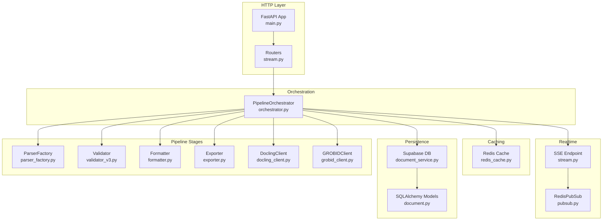
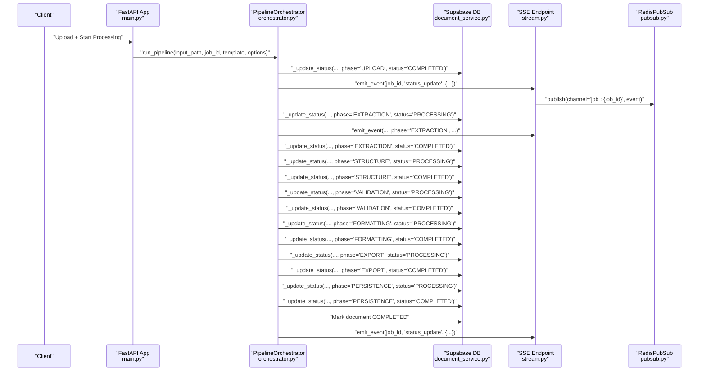
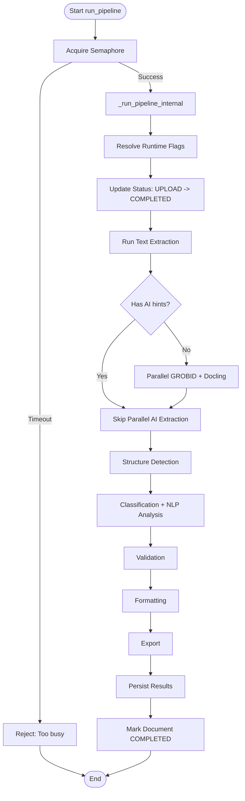
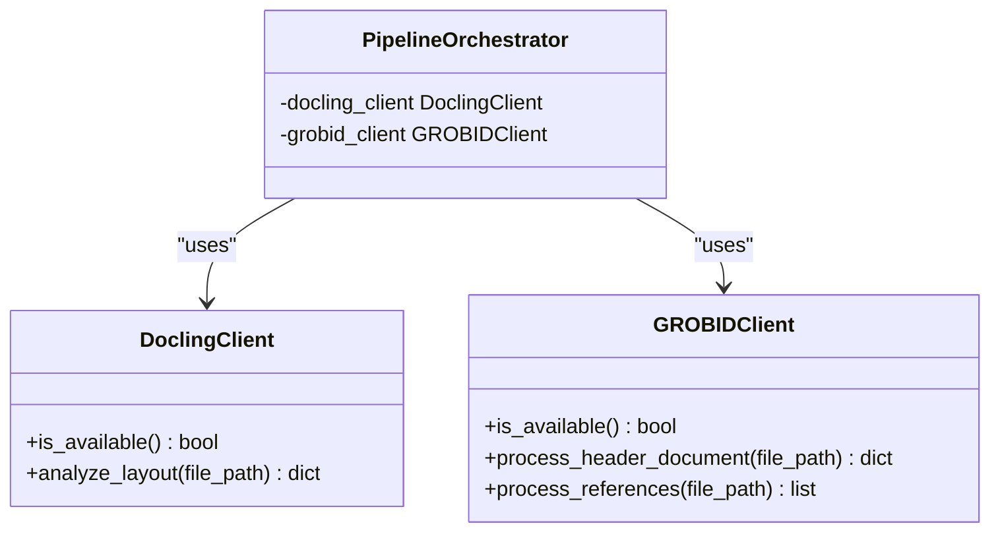
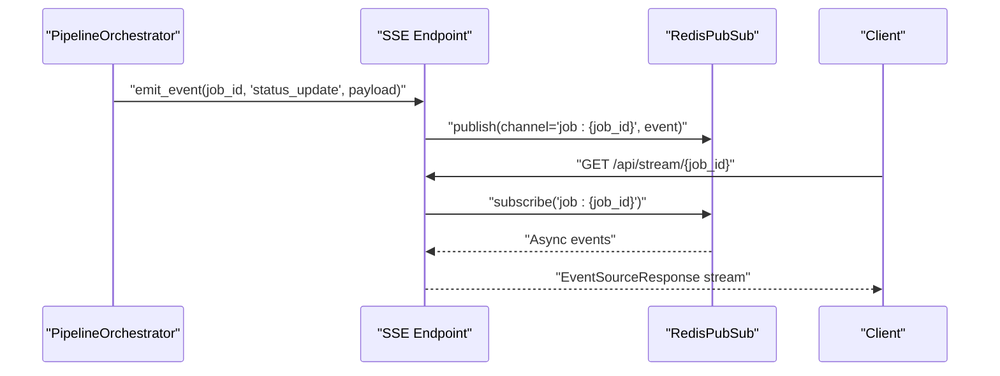
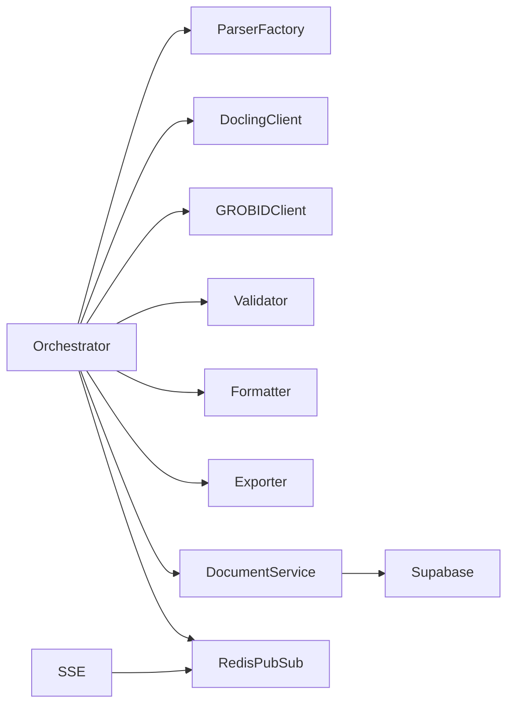

# Data Flow Architecture

<cite>
**Referenced Files in This Document**
- [main.py](file://backend/app/main.py)
- [orchestrator.py](file://backend/app/pipeline/orchestrator.py)
- [redis_cache.py](file://backend/app/cache/redis_cache.py)
- [pubsub.py](file://backend/app/realtime/pubsub.py)
- [stream.py](file://backend/app/routers/stream.py)
- [session.py](file://backend/app/db/session.py)
- [document.py](file://backend/app/models/document.py)
- [document_service.py](file://backend/app/services/document_service.py)
- [validator_v3.py](file://backend/app/pipeline/validation/validator_v3.py)
- [parser_factory.py](file://backend/app/pipeline/parsing/parser_factory.py)
- [formatter.py](file://backend/app/pipeline/formatting/formatter.py)
- [exporter.py](file://backend/app/pipeline/export/exporter.py)
- [docling_client.py](file://backend/app/pipeline/services/docling_client.py)
- [grobid_client.py](file://backend/app/pipeline/services/grobid_client.py)
</cite>

## Table of Contents
1. [Introduction](#introduction)
2. [Project Structure](#project-structure)
3. [Core Components](#core-components)
4. [Architecture Overview](#architecture-overview)
5. [Detailed Component Analysis](#detailed-component-analysis)
6. [Dependency Analysis](#dependency-analysis)
7. [Performance Considerations](#performance-considerations)
8. [Troubleshooting Guide](#troubleshooting-guide)
9. [Conclusion](#conclusion)

## Introduction
This document explains the end-to-end data flow architecture for the document processing system. It traces the journey from user upload through a 12-stage pipeline to final export, detailing transformations, caching, persistence, and real-time streaming. It also covers validation, error propagation, state management across asynchronous operations, and the integration points with external services such as Docling and GROBID.

## Project Structure
The backend is a FastAPI application that orchestrates a multi-stage pipeline. Key areas:
- Orchestration and status management
- Real-time streaming via Redis Pub/Sub and SSE
- Caching with Redis
- Database persistence via Supabase
- Pipeline stages for parsing, structure detection, validation, formatting, and export
- External service clients for layout and metadata extraction

**Diagram sources**
- [main.py:263-383](file://backend/app/main.py#L263-L383)
- [orchestrator.py:73-545](file://backend/app/pipeline/orchestrator.py#L73-L545)
- [stream.py:24-95](file://backend/app/routers/stream.py#L24-L95)
- [pubsub.py:18-120](file://backend/app/realtime/pubsub.py#L18-L120)
- [redis_cache.py:10-102](file://backend/app/cache/redis_cache.py#L10-L102)
- [document_service.py:34-560](file://backend/app/services/document_service.py#L34-L560)
- [document.py:6-26](file://backend/app/models/document.py#L6-L26)
- [parser_factory.py:25-166](file://backend/app/pipeline/parsing/parser_factory.py#L25-L166)
- [validator_v3.py:34-277](file://backend/app/pipeline/validation/validator_v3.py#L34-L277)
- [formatter.py:35-800](file://backend/app/pipeline/formatting/formatter.py#L35-L800)
- [exporter.py:19-282](file://backend/app/pipeline/export/exporter.py#L19-L282)
- [docling_client.py:143-482](file://backend/app/pipeline/services/docling_client.py#L143-L482)
- [grobid_client.py:25-317](file://backend/app/pipeline/services/grobid_client.py#L25-L317)

**Section sources**
- [main.py:263-383](file://backend/app/main.py#L263-L383)
- [orchestrator.py:73-545](file://backend/app/pipeline/orchestrator.py#L73-L545)

## Core Components
- PipelineOrchestrator: Central coordinator that sequences stages, manages progress, persists status, and emits real-time events.
- ParserFactory: Selects the appropriate parser based on file extension.
- DoclingClient/GROBIDClient: External services for layout and metadata extraction.
- Validator: Enforces structural and content rules with safety guards.
- Formatter: Renders the final Word document using templates and contracts.
- Exporter: Produces multiple output formats (DOCX, PDF, JATS, JSON, HTML, LaTeX).
- RedisPubSub/SSE: Real-time streaming of processing events.
- RedisCache: Optional caching for LLM and GROBID results.
- DocumentService/Supabase: Persistent storage of documents, results, and processing status.

**Section sources**
- [orchestrator.py:73-545](file://backend/app/pipeline/orchestrator.py#L73-L545)
- [parser_factory.py:25-166](file://backend/app/pipeline/parsing/parser_factory.py#L25-L166)
- [docling_client.py:143-482](file://backend/app/pipeline/services/docling_client.py#L143-L482)
- [grobid_client.py:25-317](file://backend/app/pipeline/services/grobid_client.py#L25-L317)
- [validator_v3.py:34-277](file://backend/app/pipeline/validation/validator_v3.py#L34-L277)
- [formatter.py:35-800](file://backend/app/pipeline/formatting/formatter.py#L35-L800)
- [exporter.py:19-282](file://backend/app/pipeline/export/exporter.py#L19-L282)
- [stream.py:24-95](file://backend/app/routers/stream.py#L24-L95)
- [pubsub.py:18-120](file://backend/app/realtime/pubsub.py#L18-L120)
- [redis_cache.py:10-102](file://backend/app/cache/redis_cache.py#L10-L102)
- [document_service.py:34-560](file://backend/app/services/document_service.py#L34-L560)
- [document.py:6-26](file://backend/app/models/document.py#L6-L26)

## Architecture Overview
The system follows a staged pipeline with explicit state transitions and real-time feedback. Data moves through parsers, structure detectors, validators, formatters, and exporters, persisting intermediate and final states to the database and streaming progress to clients.

**Diagram sources**
- [main.py:263-383](file://backend/app/main.py#L263-L383)
- [orchestrator.py:522-545](file://backend/app/pipeline/orchestrator.py#L522-L545)
- [document_service.py:395-441](file://backend/app/services/document_service.py#L395-L441)
- [stream.py:73-95](file://backend/app/routers/stream.py#L73-L95)
- [pubsub.py:55-120](file://backend/app/realtime/pubsub.py#L55-L120)

## Detailed Component Analysis

### PipelineOrchestrator
- Responsibilities:
  - Sequentially runs 12+ stages (extraction, metadata/layout, structure detection, classification, validation, formatting, export, persistence).
  - Manages concurrency limits and timeouts.
  - Persists status to Supabase and emits SSE events.
  - Handles cancellation checks and partial result persistence on failure.
- Key behaviors:
  - Runtime flags (fast_mode, semantic_parser, crossref_enrichment, ai_reasoning) shape stage execution.
  - Parallel extraction via ThreadPoolExecutor for GROBID and Docling.
  - Nougat OCR fallback for empty PDF extractions.
  - Quality scoring and diagnostics computed and logged.

**Diagram sources**
- [orchestrator.py:522-800](file://backend/app/pipeline/orchestrator.py#L522-L800)

**Section sources**
- [orchestrator.py:73-545](file://backend/app/pipeline/orchestrator.py#L73-L545)
- [orchestrator.py:522-800](file://backend/app/pipeline/orchestrator.py#L522-L800)

### ParserFactory and Extraction
- Determines the correct parser based on file extension.
- Supports DOCX, PDF, TXT, HTML, MD, TEX/LaTeX, with optional Nougat OCR fallback.
- Ensures deterministic behavior and graceful degradation.

**Section sources**
- [parser_factory.py:25-166](file://backend/app/pipeline/parsing/parser_factory.py#L25-L166)

### External Services: Docling and GROBID
- DoclingClient: Performs layout analysis (elements, tables, figures, headers/footers) with bounding boxes and font metadata.
- GROBIDClient: Extracts structured metadata (title, authors, affiliations, abstract, keywords) from PDFs via REST API.

**Diagram sources**
- [docling_client.py:143-482](file://backend/app/pipeline/services/docling_client.py#L143-L482)
- [grobid_client.py:25-317](file://backend/app/pipeline/services/grobid_client.py#L25-L317)
- [orchestrator.py:92-94](file://backend/app/pipeline/orchestrator.py#L92-L94)

**Section sources**
- [docling_client.py:143-482](file://backend/app/pipeline/services/docling_client.py#L143-L482)
- [grobid_client.py:25-317](file://backend/app/pipeline/services/grobid_client.py#L25-L317)

### Validation
- Validates sections, figures, references, integrity, and optionally performs DOI checks against CrossRef.
- Uses contract-driven rules and maintains a review flag for human-in-the-loop.

**Section sources**
- [validator_v3.py:34-277](file://backend/app/pipeline/validation/validator_v3.py#L34-L277)

### Formatting and Export
- Formatter applies numbering, styles, and templates to produce a Word document.
- Exporter generates multiple formats (DOCX, PDF, JATS, JSON, HTML, LaTeX) and writes artifacts to disk.

**Section sources**
- [formatter.py:35-800](file://backend/app/pipeline/formatting/formatter.py#L35-L800)
- [exporter.py:19-282](file://backend/app/pipeline/export/exporter.py#L19-L282)

### Real-Time Streaming (SSE) and Redis Pub/Sub
- SSE endpoint streams events to authenticated clients.
- RedisPubSub publishes and subscribes to channels per job, with in-memory fallback when Redis is unavailable.
- Orchestrator emits status updates via emit_event, which publishes to Redis and is consumed by the SSE endpoint.

**Diagram sources**
- [stream.py:32-95](file://backend/app/routers/stream.py#L32-L95)
- [pubsub.py:55-120](file://backend/app/realtime/pubsub.py#L55-L120)
- [orchestrator.py:117-168](file://backend/app/pipeline/orchestrator.py#L117-L168)

**Section sources**
- [stream.py:24-95](file://backend/app/routers/stream.py#L24-L95)
- [pubsub.py:18-120](file://backend/app/realtime/pubsub.py#L18-L120)
- [orchestrator.py:117-168](file://backend/app/pipeline/orchestrator.py#L117-L168)

### Caching with Redis
- RedisCache stores GROBID and LLM results with TTL to reduce repeated external calls.
- Disabled or degraded when Redis is unavailable.

**Section sources**
- [redis_cache.py:10-102](file://backend/app/cache/redis_cache.py#L10-L102)

### Database Persistence (Supabase)
- DocumentService encapsulates CRUD operations for documents, results, and processing status.
- Models define the schema for documents, results, and related entities.
- Health checks and readiness probes integrate with the database.

**Section sources**
- [document_service.py:34-560](file://backend/app/services/document_service.py#L34-L560)
- [document.py:6-26](file://backend/app/models/document.py#L6-L26)
- [session.py:28-130](file://backend/app/db/session.py#L28-L130)

## Dependency Analysis
- Coupling:
  - Orchestrator depends on parsers, external clients, validators, formatters, exporters, and persistence.
  - Real-time streaming is decoupled via RedisPubSub and SSE.
- Cohesion:
  - Each stage is cohesive and exposes a process() interface.
- External dependencies:
  - Docling and GROBID are optional and guarded by availability checks.
  - Redis is optional; fallback to in-memory queues is implemented.

**Diagram sources**
- [orchestrator.py:73-545](file://backend/app/pipeline/orchestrator.py#L73-L545)
- [stream.py:24-95](file://backend/app/routers/stream.py#L24-L95)
- [pubsub.py:18-120](file://backend/app/realtime/pubsub.py#L18-L120)
- [document_service.py:34-560](file://backend/app/services/document_service.py#L34-L560)

**Section sources**
- [orchestrator.py:73-545](file://backend/app/pipeline/orchestrator.py#L73-L545)
- [stream.py:24-95](file://backend/app/routers/stream.py#L24-L95)
- [pubsub.py:18-120](file://backend/app/realtime/pubsub.py#L18-L120)
- [document_service.py:34-560](file://backend/app/services/document_service.py#L34-L560)

## Performance Considerations
- Concurrency control: Semaphore limits concurrent pipeline jobs to prevent resource exhaustion.
- Timeouts: Stages enforce timeouts to avoid hanging operations; cancellations are respected.
- Parallelism: GROBID and Docling are executed concurrently for PDFs.
- Caching: Redis cache reduces repeated external API calls for LLM and GROBID results.
- Degradation: Redis and external services failures fall back gracefully without crashing the pipeline.
- Memory: Optional AI model preloading controlled by settings; low-memory mode disables certain features.

[No sources needed since this section provides general guidance]

## Troubleshooting Guide
- Health and readiness:
  - Use /health and /ready endpoints to verify DB, AI models, and service availability.
- Database connectivity:
  - If SUPABASE_DB_URL is missing, the app starts in degraded mode; DB endpoints return 503.
- Redis availability:
  - If Redis is unreachable, caching is disabled and SSE falls back to in-memory queues.
- Cancellation:
  - Orchestrator periodically checks for user-initiated cancellation and raises cancellation exceptions.
- Partial results:
  - On failure, partial results are persisted to document_results to aid recovery.
- Validation failures:
  - Validation is wrapped in safety guards; errors are captured and surfaced as warnings or errors without aborting the pipeline.

**Section sources**
- [main.py:360-383](file://backend/app/main.py#L360-L383)
- [session.py:28-130](file://backend/app/db/session.py#L28-L130)
- [redis_cache.py:10-102](file://backend/app/cache/redis_cache.py#L10-L102)
- [pubsub.py:18-120](file://backend/app/realtime/pubsub.py#L18-L120)
- [orchestrator.py:169-211](file://backend/app/pipeline/orchestrator.py#L169-L211)
- [validator_v3.py:68-71](file://backend/app/pipeline/validation/validator_v3.py#L68-L71)

## Conclusion
The system implements a robust, staged data flow with explicit state transitions, real-time feedback, and resilient persistence. It balances performance with safety through timeouts, concurrency limits, and graceful degradation. External integrations (Docling, GROBID) are optional and monitored, while Redis and Supabase provide scalable caching and persistence. The architecture supports both batch and interactive processing with clear validation and error propagation mechanisms.