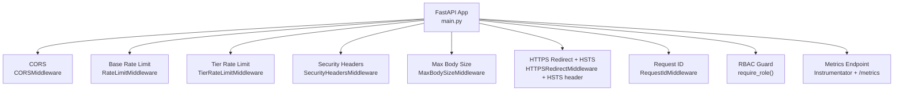
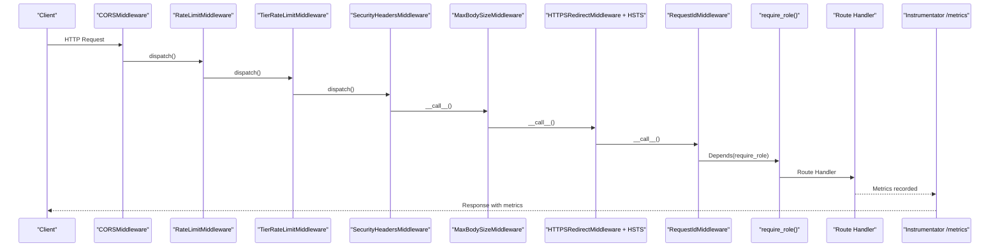
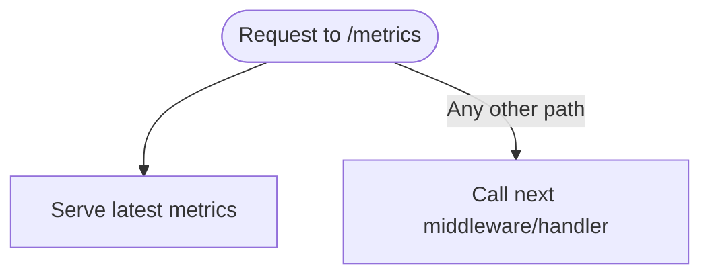
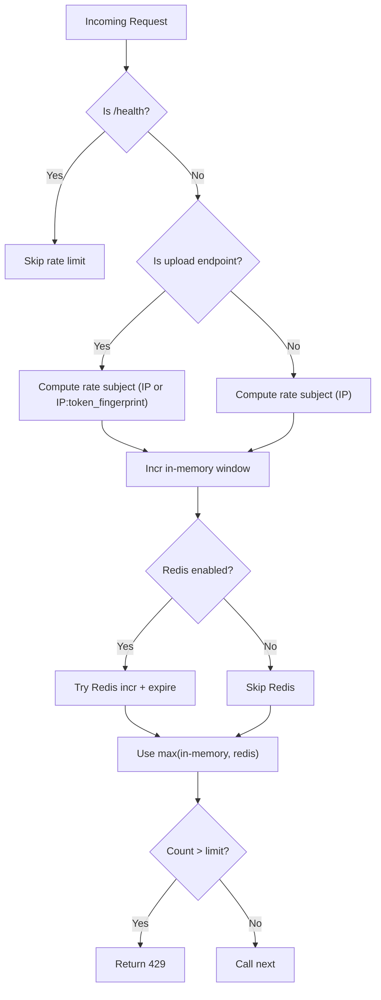
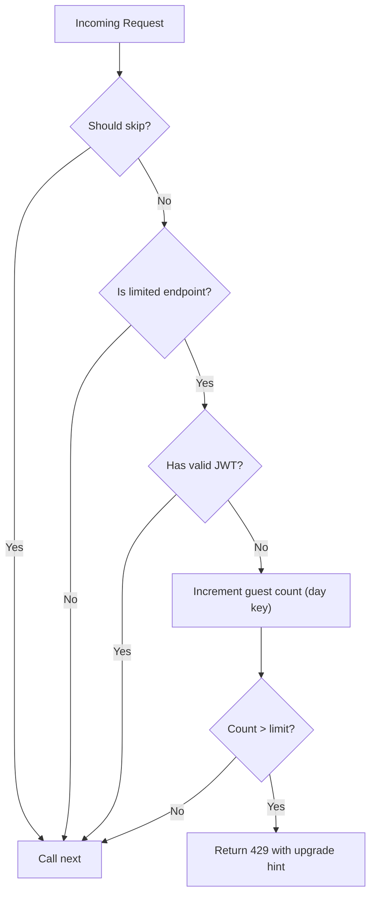
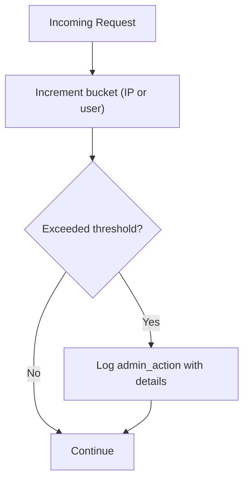
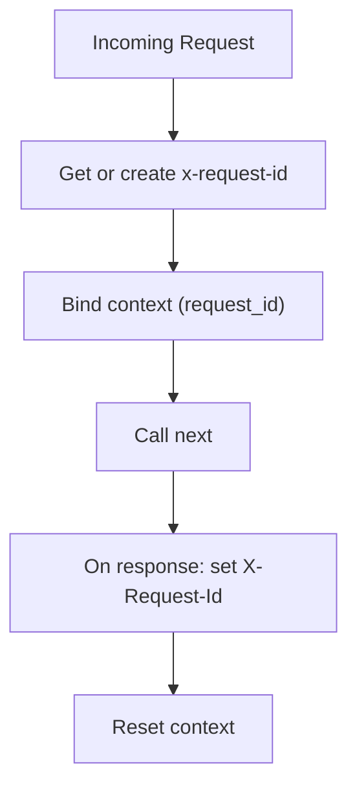
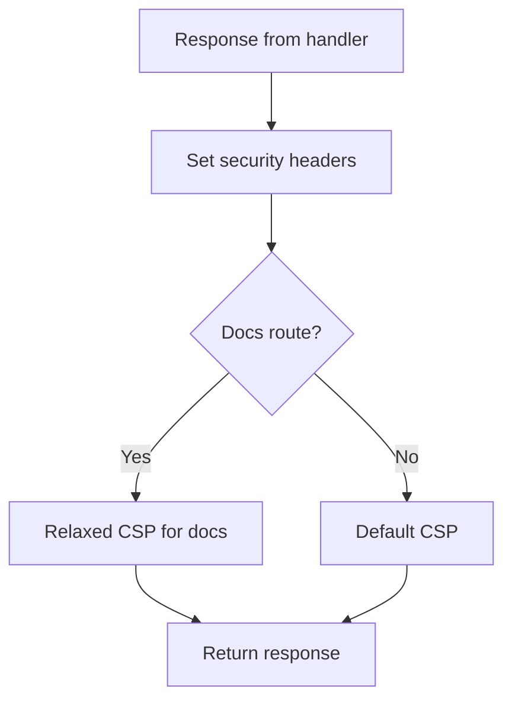
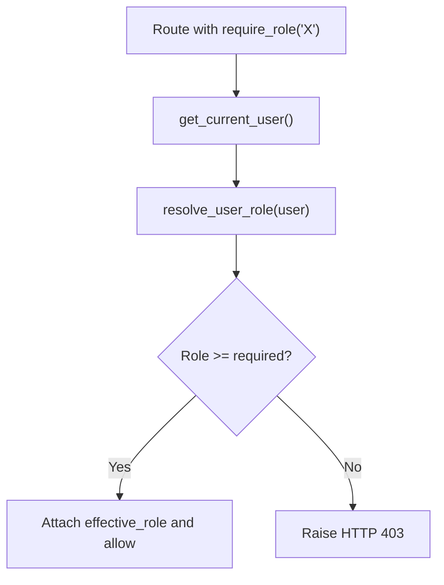

# Middleware Stack

<cite>
**Referenced Files in This Document**
- [main.py](file://backend/app/main.py)
- [prometheus_metrics.py](file://backend/app/middleware/prometheus_metrics.py)
- [rate_limit.py](file://backend/app/middleware/rate_limit.py)
- [tier_rate_limit.py](file://backend/app/middleware/tier_rate_limit.py)
- [abuse_detector.py](file://backend/app/middleware/abuse_detector.py)
- [request_id.py](file://backend/app/middleware/request_id.py)
- [security_headers.py](file://backend/app/middleware/security_headers.py)
- [rbac.py](file://backend/app/middleware/rbac.py)
- [settings.py](file://backend/app/config/settings.py)
- [redis_cache.py](file://backend/app/cache/redis_cache.py)
- [logging_context.py](file://backend/app/utils/logging_context.py)
- [test_rate_limiter.py](file://backend/tests/test_rate_limiter.py)
- [test_tier_rate_limit.py](file://backend/tests/test_tier_rate_limit.py)
- [test_rbac.py](file://backend/tests/test_rbac.py)
</cite>

## Table of Contents
1. [Introduction](#introduction)
2. [Project Structure](#project-structure)
3. [Core Components](#core-components)
4. [Architecture Overview](#architecture-overview)
5. [Detailed Component Analysis](#detailed-component-analysis)
6. [Dependency Analysis](#dependency-analysis)
7. [Performance Considerations](#performance-considerations)
8. [Troubleshooting Guide](#troubleshooting-guide)
9. [Conclusion](#conclusion)

## Introduction
This document explains the FastAPI middleware stack used in the backend. It details the execution order, purpose, configuration, performance characteristics, and security benefits of each middleware component: Prometheus metrics collection, base rate limiting, tier-aware rate limiting, abuse detection, request ID tracking, security headers (CSP, HSTS), and RBAC implementation. It also covers how components interact, failure handling, and debugging techniques for middleware-related issues.

## Project Structure
The middleware stack is configured in the main application factory and layered around request handlers. The middleware registration order determines the request/response flow and affects both performance and security posture.

**Diagram sources**
- [main.py:279-315](file://backend/app/main.py#L279-L315)

**Section sources**
- [main.py:279-315](file://backend/app/main.py#L279-L315)

## Core Components
- Prometheus metrics collection: Exposes a /metrics endpoint and records pipeline, agent, system, and streaming metrics. It also exposes a MetricsManager to record metrics from anywhere in the app.
- Base rate limiting: Sliding-window per-IP rate limiting with in-memory counters and optional Redis-backed distributed counters.
- Tier-aware rate limiting: Daily guest limits for specific endpoints, with Redis-backed counters and in-memory fallback.
- Abuse detection: Tracks spikes in generation requests and LLM usage to flag potential abuse and logs administrative actions.
- Request ID tracking: Generates and propagates a request ID across the pipeline and logs, enabling correlation across services.
- Security headers: Adds CSP, X-Content-Type-Options, X-Frame-Options, X-XSS-Protection, Referrer-Policy, Permissions-Policy, and HSTS.
- RBAC: Role resolution and enforcement with a role hierarchy and alias normalization.

**Section sources**
- [prometheus_metrics.py:135-142](file://backend/app/middleware/prometheus_metrics.py#L135-L142)
- [rate_limit.py:49-172](file://backend/app/middleware/rate_limit.py#L49-L172)
- [tier_rate_limit.py:19-116](file://backend/app/middleware/tier_rate_limit.py#L19-L116)
- [abuse_detector.py:14-70](file://backend/app/middleware/abuse_detector.py#L14-L70)
- [request_id.py:21-74](file://backend/app/middleware/request_id.py#L21-L74)
- [security_headers.py:18-66](file://backend/app/middleware/security_headers.py#L18-L66)
- [rbac.py:9-80](file://backend/app/middleware/rbac.py#L9-L80)

## Architecture Overview
The middleware stack is registered in a specific order to ensure:
- Early protection (rate limiting, body size) before expensive processing.
- Consistent security headers on all responses.
- Request ID propagation for observability.
- RBAC enforcement after authentication and before route handlers.
- Metrics exposure last to avoid interfering with metrics recording.

**Diagram sources**
- [main.py:279-315](file://backend/app/main.py#L279-L315)
- [prometheus_metrics.py:135-142](file://backend/app/middleware/prometheus_metrics.py#L135-L142)

## Detailed Component Analysis

### Prometheus Metrics Collection
- Purpose: Expose a /metrics endpoint and record pipeline, agent, system, and streaming metrics. Provides a MetricsManager to record metrics from anywhere in the app.
- Execution: Registered via Instrumentator and exposed at /metrics. The middleware handles the /metrics path to return Prometheus scrape output.
- Configuration: Controlled by the application’s instrumentation setup and environment settings.
- Performance: Minimal overhead; metrics are aggregated in-memory with histograms and gauges.
- Security: No sensitive data; served on the same port as the API.

**Diagram sources**
- [prometheus_metrics.py:135-142](file://backend/app/middleware/prometheus_metrics.py#L135-L142)

**Section sources**
- [prometheus_metrics.py:135-142](file://backend/app/middleware/prometheus_metrics.py#L135-L142)
- [prometheus_metrics.py:144-235](file://backend/app/middleware/prometheus_metrics.py#L144-L235)
- [main.py:273-274](file://backend/app/main.py#L273-L274)

### Base Rate Limiting
- Purpose: Prevent DoS by enforcing per-IP sliding-window limits for general requests and uploads.
- Execution: Sliding window maintained in-memory; Redis optionally augments counters for multi-worker deployments. Health endpoints are exempt.
- Configuration: Requests per minute and uploads per minute are configurable; uploads include token fingerprinting for bearer-authenticated clients.
- Performance: In-memory updates are O(n) per window eviction; Redis operations are minimal and best-effort.
- Failure handling: Redis unavailability triggers a warning and falls back to in-memory counters.

**Diagram sources**
- [rate_limit.py:124-172](file://backend/app/middleware/rate_limit.py#L124-L172)

**Section sources**
- [rate_limit.py:49-172](file://backend/app/middleware/rate_limit.py#L49-L172)
- [settings.py:96-96](file://backend/app/config/settings.py#L96-L96)
- [redis_cache.py:10-39](file://backend/app/cache/redis_cache.py#L10-L39)

### Tier-Aware Rate Limiting
- Purpose: Enforce daily guest limits for specific endpoints (uploads and generation sessions).
- Execution: Uses UTC day-based keys; Redis preferred with in-memory fallback; skips health/readiness/status endpoints.
- Configuration: Guest daily limit is configurable; authenticated users are exempt.
- Performance: Redis incr + expire per request; fallback maintains per-process counters.
- Failure handling: Logs a warning once on Redis failure and uses in-memory counters.

**Diagram sources**
- [tier_rate_limit.py:96-116](file://backend/app/middleware/tier_rate_limit.py#L96-L116)

**Section sources**
- [tier_rate_limit.py:19-116](file://backend/app/middleware/tier_rate_limit.py#L19-L116)
- [redis_cache.py:10-39](file://backend/app/cache/redis_cache.py#L10-L39)

### Abuse Detection
- Purpose: Detect unusual spikes in generation requests and LLM usage to trigger administrative logging.
- Execution: Maintains sliding windows per IP or user; logs administrative flags when thresholds are exceeded.
- Configuration: Window sizes and thresholds are embedded; Redis preferred with in-memory fallback.
- Performance: Minimal overhead; counters are ephemeral and short-lived.

**Diagram sources**
- [abuse_detector.py:20-66](file://backend/app/middleware/abuse_detector.py#L20-L66)

**Section sources**
- [abuse_detector.py:14-70](file://backend/app/middleware/abuse_detector.py#L14-L70)
- [redis_cache.py:10-39](file://backend/app/cache/redis_cache.py#L10-L39)

### Request ID Tracking
- Purpose: Attach a unique request ID to each request and propagate it to logs and responses for correlation.
- Execution: Reads or generates x-request-id; binds context; sets X-Request-Id on response; logs idempotency keys for selected endpoints.
- Configuration: Idempotency logging applies to specific paths.
- Performance: Minimal overhead; uses context vars and state.

**Diagram sources**
- [request_id.py:25-59](file://backend/app/middleware/request_id.py#L25-L59)

**Section sources**
- [request_id.py:21-74](file://backend/app/middleware/request_id.py#L21-L74)
- [logging_context.py:17-92](file://backend/app/utils/logging_context.py#L17-L92)

### Security Headers (CSP, HSTS, etc.)
- Purpose: Mitigate common web vulnerabilities by setting strict security headers on all responses.
- Execution: Adds CSP, X-Content-Type-Options, X-Frame-Options, X-XSS-Protection, Referrer-Policy, Permissions-Policy, and HSTS for production.
- Configuration: Docs routes relax CSP to allow CDN resources; HSTS is enforced via HTTPS redirect middleware and an explicit header in production.
- Performance: Negligible overhead; computed once per response.

**Diagram sources**
- [security_headers.py:28-66](file://backend/app/middleware/security_headers.py#L28-L66)
- [main.py:309-313](file://backend/app/main.py#L309-L313)

**Section sources**
- [security_headers.py:18-66](file://backend/app/middleware/security_headers.py#L18-L66)
- [main.py:299-313](file://backend/app/main.py#L299-L313)

### RBAC Implementation
- Purpose: Enforce role-based access control using a normalized role hierarchy and aliases.
- Execution: Resolves effective role from user object and app metadata; guards deny with 403 if insufficient privileges.
- Configuration: Roles and aliases are defined centrally; requires a current user dependency.
- Performance: Negligible overhead; executed during dependency resolution.

**Diagram sources**
- [rbac.py:61-80](file://backend/app/middleware/rbac.py#L61-L80)

**Section sources**
- [rbac.py:9-80](file://backend/app/middleware/rbac.py#L9-L80)

## Dependency Analysis
- Registration order: CORS → Base Rate Limit → Tier Rate Limit → Security Headers → Max Body Size → HTTPS Redirect + HSTS → Request ID → RBAC → Handlers → Metrics.
- Interactions:
  - Rate limiters depend on RedisCache for distributed counters; fallback to in-memory when unavailable.
  - Abuse detector depends on RedisCache and audit logging service.
  - Request ID middleware integrates with logging context for structured logs.
  - RBAC depends on current user extraction and JWT verification.
  - Metrics middleware is exposed last to avoid interference with metric recording.

**Diagram sources**
- [main.py:279-315](file://backend/app/main.py#L279-L315)

**Section sources**
- [main.py:279-315](file://backend/app/main.py#L279-L315)
- [rate_limit.py:30-42](file://backend/app/middleware/rate_limit.py#L30-L42)
- [tier_rate_limit.py:30-32](file://backend/app/middleware/tier_rate_limit.py#L30-L32)
- [abuse_detector.py:16-18](file://backend/app/middleware/abuse_detector.py#L16-L18)
- [request_id.py:34-34](file://backend/app/middleware/request_id.py#L34-L34)
- [rbac.py:7-7](file://backend/app/middleware/rbac.py#L7-L7)

## Performance Considerations
- Rate limiting:
  - In-memory sliding window is O(n) per request due to eviction; acceptable for typical loads.
  - Redis operations are lightweight; failures are handled gracefully.
- Tier rate limiting:
  - Daily counters use UTC day keys; Redis incr + expire per request; fallback to in-memory reduces contention.
- Abuse detection:
  - Short-lived sliding windows minimize memory footprint.
- Request ID:
  - Context binding and response header setting are negligible.
- Security headers:
  - One-time header computation per response.
- Metrics:
  - Histograms and gauges are efficient; scraping is off-the-wire.

[No sources needed since this section provides general guidance]

## Troubleshooting Guide
- Rate limiting:
  - Symptom: Unexpected 429 responses.
  - Actions: Verify requests_per_minute and uploads_per_minute; confirm Redis connectivity; check whether uploads include bearer token fingerprinting.
  - References:
    - [rate_limit.py:124-172](file://backend/app/middleware/rate_limit.py#L124-L172)
    - [settings.py:96-96](file://backend/app/config/settings.py#L96-L96)
    - [redis_cache.py:10-39](file://backend/app/cache/redis_cache.py#L10-L39)
    - [test_rate_limiter.py:20-99](file://backend/tests/test_rate_limiter.py#L20-L99)
- Tier rate limiting:
  - Symptom: Guest blocked after N requests.
  - Actions: Confirm guest_daily_limit; ensure JWT is valid for authenticated bypass; check Redis availability.
  - References:
    - [tier_rate_limit.py:96-116](file://backend/app/middleware/tier_rate_limit.py#L96-L116)
    - [redis_cache.py:10-39](file://backend/app/cache/redis_cache.py#L10-L39)
    - [test_tier_rate_limit.py:9-46](file://backend/tests/test_tier_rate_limit.py#L9-L46)
- Abuse detection:
  - Symptom: Administrative alerts for flagged activity.
  - Actions: Review abuse thresholds and window sizes; verify Redis availability.
  - References:
    - [abuse_detector.py:20-66](file://backend/app/middleware/abuse_detector.py#L20-L66)
    - [redis_cache.py:10-39](file://backend/app/cache/redis_cache.py#L10-L39)
- Request ID:
  - Symptom: Missing correlation IDs in logs.
  - Actions: Ensure x-request-id is present or generated; verify logging context filter and response header propagation.
  - References:
    - [request_id.py:25-59](file://backend/app/middleware/request_id.py#L25-L59)
    - [logging_context.py:83-92](file://backend/app/utils/logging_context.py#L83-L92)
- Security headers:
  - Symptom: CSP violations or mixed-content warnings.
  - Actions: Confirm environment settings; note docs route relaxes CSP; verify HTTPS redirect and HSTS header in production.
  - References:
    - [security_headers.py:28-66](file://backend/app/middleware/security_headers.py#L28-L66)
    - [main.py:309-313](file://backend/app/main.py#L309-L313)
- RBAC:
  - Symptom: 403 Forbidden errors.
  - Actions: Verify current user extraction and JWT; check role aliases and hierarchy; confirm require_role usage.
  - References:
    - [rbac.py:61-80](file://backend/app/middleware/rbac.py#L61-L80)
    - [test_rbac.py:16-62](file://backend/tests/test_rbac.py#L16-L62)

**Section sources**
- [rate_limit.py:124-172](file://backend/app/middleware/rate_limit.py#L124-L172)
- [tier_rate_limit.py:96-116](file://backend/app/middleware/tier_rate_limit.py#L96-L116)
- [abuse_detector.py:20-66](file://backend/app/middleware/abuse_detector.py#L20-L66)
- [request_id.py:25-59](file://backend/app/middleware/request_id.py#L25-L59)
- [security_headers.py:28-66](file://backend/app/middleware/security_headers.py#L28-L66)
- [rbac.py:61-80](file://backend/app/middleware/rbac.py#L61-L80)
- [test_rate_limiter.py:20-99](file://backend/tests/test_rate_limiter.py#L20-L99)
- [test_tier_rate_limit.py:9-46](file://backend/tests/test_tier_rate_limit.py#L9-L46)
- [test_rbac.py:16-62](file://backend/tests/test_rbac.py#L16-L62)

## Conclusion
The middleware stack is designed for robustness, security, and observability. It enforces rate limits early, secures responses with strong headers, tracks requests via request IDs, enforces RBAC, and exposes comprehensive metrics. The order ensures protection and visibility without impeding legitimate traffic. Configuration is primarily environment-driven, with sensible defaults and graceful degradation when external systems (notably Redis) are unavailable.