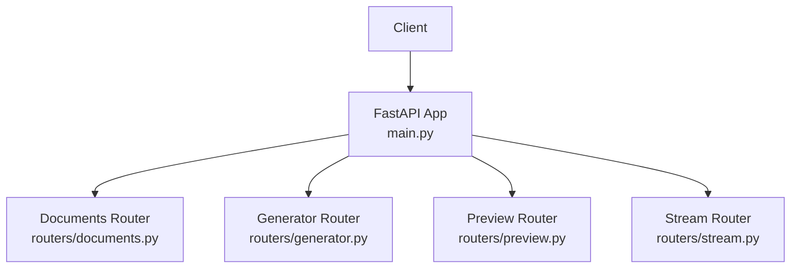
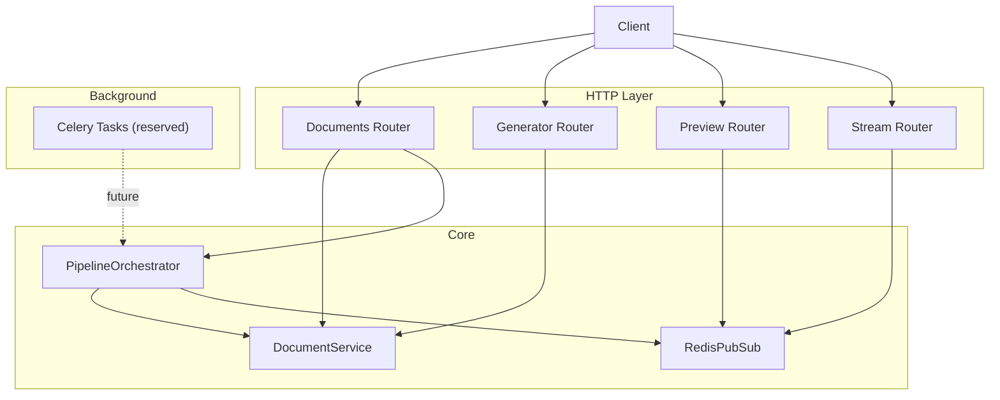
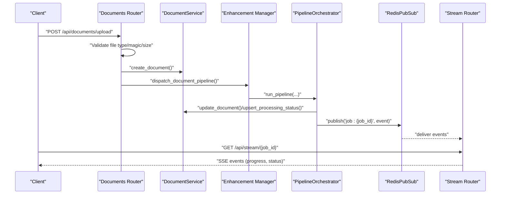
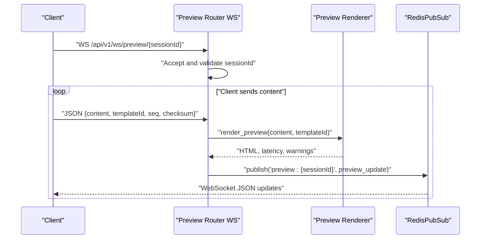
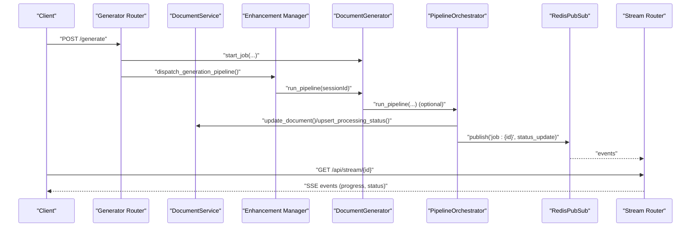
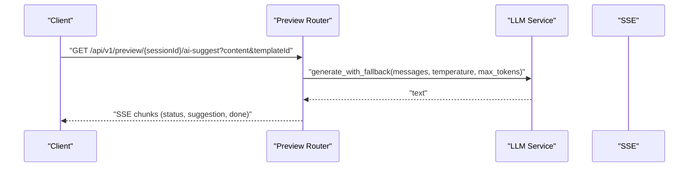
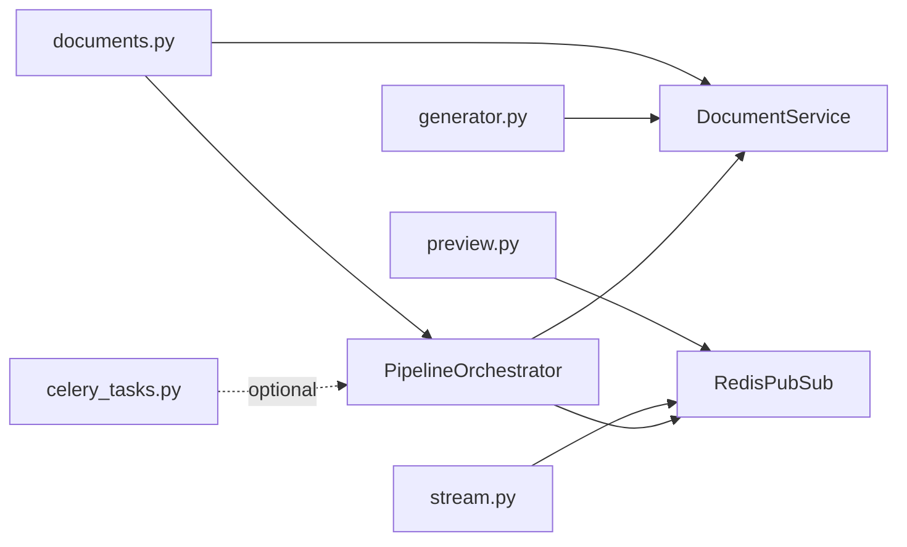

# Request Flows

<cite>
**Referenced Files in This Document**
- [backend/app/main.py](file://backend/app/main.py)
- [backend/app/routers/documents.py](file://backend/app/routers/documents.py)
- [backend/app/routers/preview.py](file://backend/app/routers/preview.py)
- [backend/app/routers/stream.py](file://backend/app/routers/stream.py)
- [backend/app/routers/generator.py](file://backend/app/routers/generator.py)
- [backend/app/realtime/pubsub.py](file://backend/app/realtime/pubsub.py)
- [backend/app/services/document_service.py](file://backend/app/services/document_service.py)
- [backend/app/pipeline/orchestrator.py](file://backend/app/pipeline/orchestrator.py)
- [backend/app/tasks/celery_tasks.py](file://backend/app/tasks/celery_tasks.py)
</cite>

## Table of Contents
1. [Introduction](#introduction)
2. [Project Structure](#project-structure)
3. [Core Components](#core-components)
4. [Architecture Overview](#architecture-overview)
5. [Detailed Component Analysis](#detailed-component-analysis)
6. [Dependency Analysis](#dependency-analysis)
7. [Performance Considerations](#performance-considerations)
8. [Troubleshooting Guide](#troubleshooting-guide)
9. [Conclusion](#conclusion)

## Introduction
This document describes the major request flows across the system’s three primary user workflows:
- Formatter Mode A: Upload & Format (background processing)
- Formatter Mode B: Live Preview (WebSocket real-time updates)
- Generator Modes: Multi-Doc Synthesis and AI Agent (streaming responses)

For each flow, we explain the complete request/response lifecycle, including authentication, validation, background processing, Redis pub/sub-driven real-time updates, and final response delivery. We also cover timing constraints, error handling patterns, and state management across the entire lifecycle.

## Project Structure
The backend is a FastAPI application that mounts multiple routers:
- Documents: upload, status polling, preview, edit, and batch operations
- Generator: generate-from-scratch sessions and downloads
- Preview: live rendering and WebSocket channels
- Stream: Server-Sent Events (SSE) for job progress
- Additional routers for templates, metrics, feedback, and health probes

**Diagram sources**
- [backend/app/main.py](file://backend/app/main.py)
- [backend/app/routers/documents.py](file://backend/app/routers/documents.py)
- [backend/app/routers/generator.py](file://backend/app/routers/generator.py)
- [backend/app/routers/preview.py](file://backend/app/routers/preview.py)
- [backend/app/routers/stream.py](file://backend/app/routers/stream.py)

**Section sources**
- [backend/app/main.py](file://backend/app/main.py)

## Core Components
- Authentication and identity: routes depend on current user resolution to enforce ownership and rate limits.
- Document service: central DB layer for CRUD and status persistence.
- Pipeline orchestrator: coordinates multi-stage processing, updates DB, and emits SSE events.
- Redis pub/sub: real-time fan-out for SSE and WebSocket channels.
- Celery tasks: reserved for future distributed processing.

Key responsibilities:
- Upload and validation: file type, size, magic bytes, and virus scanning.
- Background dispatch: enhancement manager selects execution mode and schedules work.
- Real-time updates: SSE and WebSocket streams powered by Redis pub/sub.
- Completion and delivery: signed URLs, exports, and downloadable artifacts.

**Section sources**
- [backend/app/routers/documents.py](file://backend/app/routers/documents.py)
- [backend/app/services/document_service.py](file://backend/app/services/document_service.py)
- [backend/app/pipeline/orchestrator.py](file://backend/app/pipeline/orchestrator.py)
- [backend/app/realtime/pubsub.py](file://backend/app/realtime/pubsub.py)
- [backend/app/tasks/celery_tasks.py](file://backend/app/tasks/celery_tasks.py)

## Architecture Overview
The system uses a hybrid synchronous/background processing model:
- Requests are authenticated and validated.
- For background flows, jobs are enqueued and progress is streamed via Redis pub/sub.
- For live preview, WebSocket channels deliver incremental HTML updates.
- Final artifacts are served via signed URLs or direct file responses.

**Diagram sources**
- [backend/app/routers/documents.py](file://backend/app/routers/documents.py)
- [backend/app/routers/generator.py](file://backend/app/routers/generator.py)
- [backend/app/routers/preview.py](file://backend/app/routers/preview.py)
- [backend/app/routers/stream.py](file://backend/app/routers/stream.py)
- [backend/app/services/document_service.py](file://backend/app/services/document_service.py)
- [backend/app/pipeline/orchestrator.py](file://backend/app/pipeline/orchestrator.py)
- [backend/app/realtime/pubsub.py](file://backend/app/realtime/pubsub.py)
- [backend/app/tasks/celery_tasks.py](file://backend/app/tasks/celery_tasks.py)

## Detailed Component Analysis

### Formatter Mode A: Upload & Format (Background Task Processing)
End-to-end flow:
1. Client uploads a document (multipart/form-data) with formatting options.
2. Router validates file type, size, magic bytes, and performs virus scan.
3. Document record is created; background tasks dispatch the pipeline.
4. Pipeline orchestrator runs stages, updates DB, and emits SSE events.
5. Client polls status or subscribes to SSE for progress; downloads when ready.

Key behaviors:
- Ownership and quotas: user-dependent checks and daily upload quota enforcement.
- Validation: extension whitelist, magic bytes, UTF-8 for text, size limits.
- Background dispatch: enhancement manager decides execution mode and schedules pipeline.
- Progress delivery: DB updates and SSE events propagate to clients.

Timing constraints:
- Pipeline stages are bounded by timeouts; concurrency is limited by a semaphore.
- SSE connection lifetime is managed; clients should reconnect if disconnected.

Error handling:
- HTTP exceptions for invalid inputs and exceeded limits.
- Pipeline failures marked in DB; SSE carries error payloads.
- Partial results persisted on early failure.

**Diagram sources**
- [backend/app/routers/documents.py](file://backend/app/routers/documents.py)
- [backend/app/services/document_service.py](file://backend/app/services/document_service.py)
- [backend/app/pipeline/orchestrator.py](file://backend/app/pipeline/orchestrator.py)
- [backend/app/realtime/pubsub.py](file://backend/app/realtime/pubsub.py)
- [backend/app/routers/stream.py](file://backend/app/routers/stream.py)

**Section sources**
- [backend/app/routers/documents.py](file://backend/app/routers/documents.py)
- [backend/app/services/document_service.py](file://backend/app/services/document_service.py)
- [backend/app/pipeline/orchestrator.py](file://backend/app/pipeline/orchestrator.py)
- [backend/app/routers/stream.py](file://backend/app/routers/stream.py)

### Formatter Mode B: Live Preview (WebSocket Communication)
End-to-end flow:
1. Client connects to a WebSocket channel for a session.
2. Client sends incremental content updates with optional template selection.
3. Server renders preview HTML and publishes updates to the session channel.
4. WebSocket receives real-time HTML diffs and metadata.

Real-time mechanics:
- Heartbeat keeps the connection alive.
- Versioning via checksum ensures clients receive consistent updates.
- Redis pub/sub fan-out supports multiple clients per session.

**Diagram sources**
- [backend/app/routers/preview.py](file://backend/app/routers/preview.py)
- [backend/app/realtime/pubsub.py](file://backend/app/realtime/pubsub.py)

**Section sources**
- [backend/app/routers/preview.py](file://backend/app/routers/preview.py)
- [backend/app/realtime/pubsub.py](file://backend/app/realtime/pubsub.py)

### Generator Modes: Multi-Doc Synthesis and AI Agent (Streaming Responses)
Two related flows:
- Multi-Doc Synthesis: combines multiple inputs into a unified document.
- AI Agent: guided generation with streaming suggestions and progress.

Common pattern:
- Client starts a generation session; server returns a job identifier.
- Client polls status or subscribes to SSE for progress.
- Agent suggestions are streamed via SSE endpoints.

Additional streaming endpoint:
- AI suggestions endpoint streams LLM-generated suggestions as SSE chunks.

**Diagram sources**
- [backend/app/routers/generator.py](file://backend/app/routers/generator.py)
- [backend/app/routers/stream.py](file://backend/app/routers/stream.py)
- [backend/app/routers/preview.py](file://backend/app/routers/preview.py)
- [backend/app/services/document_service.py](file://backend/app/services/document_service.py)
- [backend/app/pipeline/orchestrator.py](file://backend/app/pipeline/orchestrator.py)
- [backend/app/realtime/pubsub.py](file://backend/app/realtime/pubsub.py)

**Section sources**
- [backend/app/routers/generator.py](file://backend/app/routers/generator.py)
- [backend/app/routers/preview.py](file://backend/app/routers/preview.py)
- [backend/app/routers/stream.py](file://backend/app/routers/stream.py)
- [backend/app/services/document_service.py](file://backend/app/services/document_service.py)
- [backend/app/pipeline/orchestrator.py](file://backend/app/pipeline/orchestrator.py)

## Dependency Analysis
High-level dependencies:
- Routers depend on services for DB operations and pipeline orchestration.
- Pipeline orchestrator depends on Redis pub/sub for SSE fan-out.
- Stream router and preview router both rely on Redis pub/sub.
- Celery tasks are defined for future offloading.

**Diagram sources**
- [backend/app/routers/documents.py](file://backend/app/routers/documents.py)
- [backend/app/routers/generator.py](file://backend/app/routers/generator.py)
- [backend/app/routers/preview.py](file://backend/app/routers/preview.py)
- [backend/app/routers/stream.py](file://backend/app/routers/stream.py)
- [backend/app/services/document_service.py](file://backend/app/services/document_service.py)
- [backend/app/pipeline/orchestrator.py](file://backend/app/pipeline/orchestrator.py)
- [backend/app/realtime/pubsub.py](file://backend/app/realtime/pubsub.py)
- [backend/app/tasks/celery_tasks.py](file://backend/app/tasks/celery_tasks.py)

**Section sources**
- [backend/app/routers/documents.py](file://backend/app/routers/documents.py)
- [backend/app/routers/generator.py](file://backend/app/routers/generator.py)
- [backend/app/routers/preview.py](file://backend/app/routers/preview.py)
- [backend/app/routers/stream.py](file://backend/app/routers/stream.py)
- [backend/app/services/document_service.py](file://backend/app/services/document_service.py)
- [backend/app/pipeline/orchestrator.py](file://backend/app/pipeline/orchestrator.py)
- [backend/app/realtime/pubsub.py](file://backend/app/realtime/pubsub.py)
- [backend/app/tasks/celery_tasks.py](file://backend/app/tasks/celery_tasks.py)

## Performance Considerations
- Concurrency control: pipeline semaphore limits concurrent jobs to prevent overload.
- Timeouts: individual pipeline stages enforce bounded execution.
- Redis fallback: when Redis is unavailable, in-memory queues are used transparently.
- SSE/WebSocket scaling: Redis pub/sub enables horizontal scaling behind a proxy/load balancer.
- File handling: virus scanning and size limits protect resources; chunked uploads mitigate memory pressure.

[No sources needed since this section provides general guidance]

## Troubleshooting Guide
Common issues and patterns:
- Upload failures: invalid file type, magic bytes mismatch, oversized files, or malware detection.
- Status polling: cached responses reduce DB load; TTL-controlled caching avoids stale data.
- SSE disconnections: clients should reconnect; server emits “connected” event on initial connect.
- WebSocket disconnects: heartbeat and reconnection logic keep sessions alive.
- Pipeline errors: failures are recorded in DB; SSE carries error payloads; partial results may be persisted.

Operational checks:
- Health and readiness probes expose DB and model availability.
- Metrics endpoint exposes runtime statistics.
- Audit logs capture write operations for compliance.

**Section sources**
- [backend/app/routers/documents.py](file://backend/app/routers/documents.py)
- [backend/app/routers/stream.py](file://backend/app/routers/stream.py)
- [backend/app/routers/preview.py](file://backend/app/routers/preview.py)
- [backend/app/main.py](file://backend/app/main.py)

## Conclusion
The system provides robust, real-time document processing with three distinct user flows:
- Background upload/formatting with SSE progress
- Live preview over WebSocket
- Generation and agent flows with streaming suggestions and progress

The design leverages Redis pub/sub for scalable real-time updates, FastAPI for structured APIs, and a pipeline orchestrator for reliable, observable processing. Proper error handling, validation, and state management ensure predictable outcomes across all workflows.