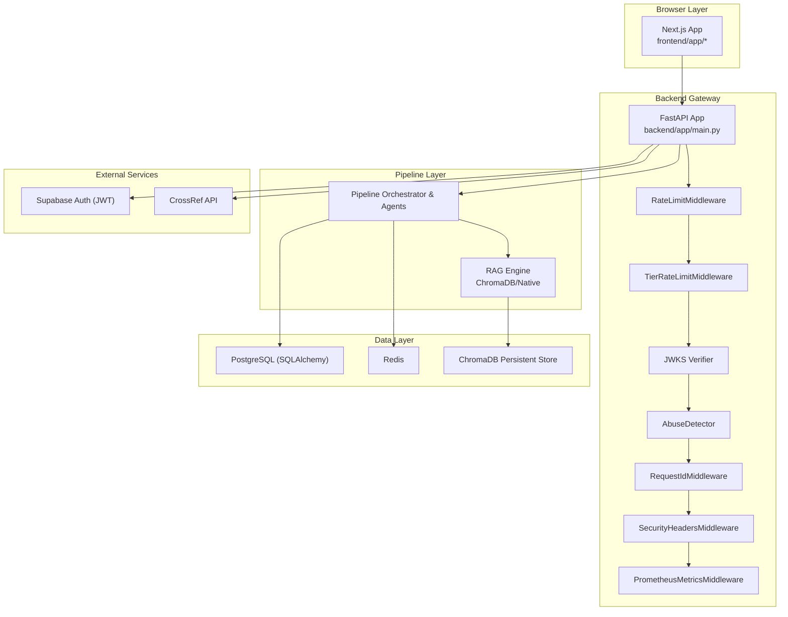
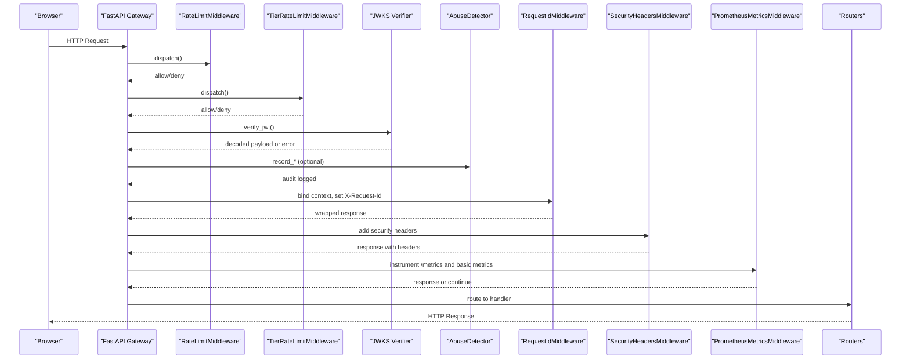
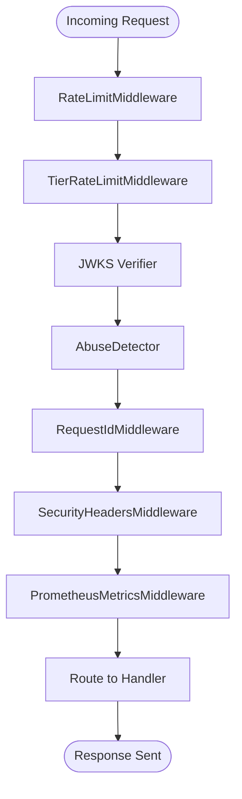
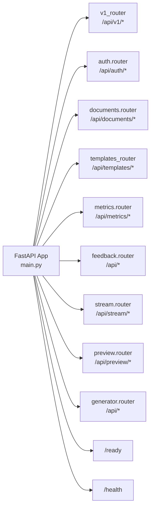
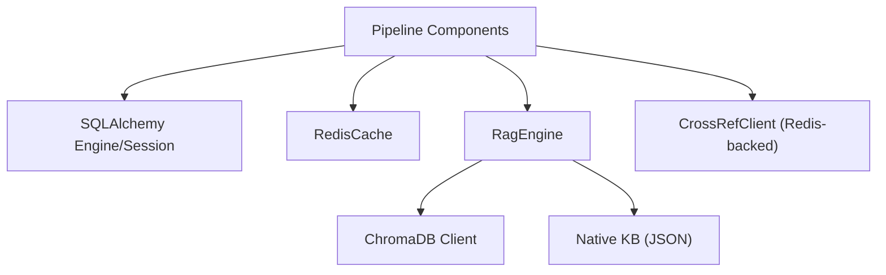
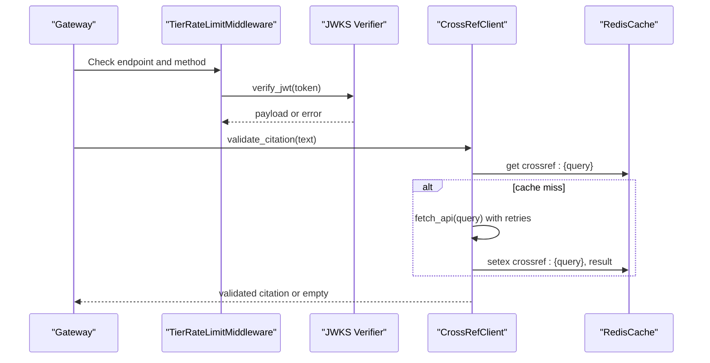
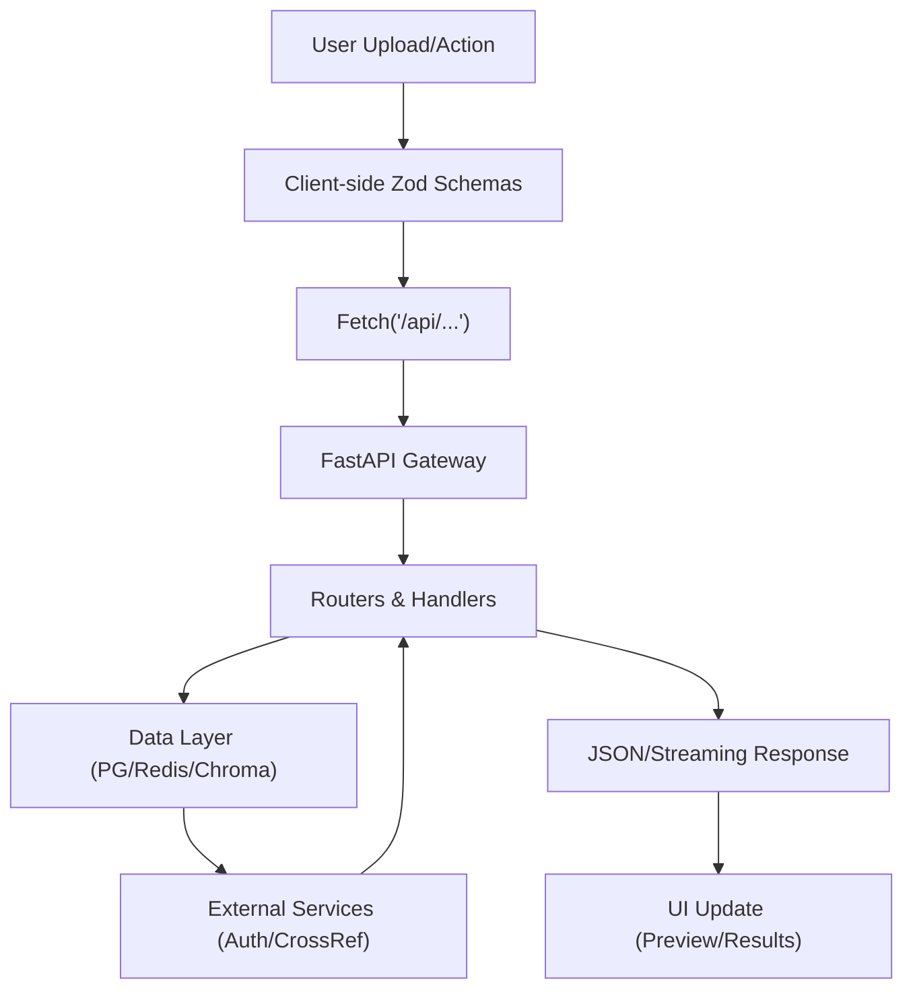
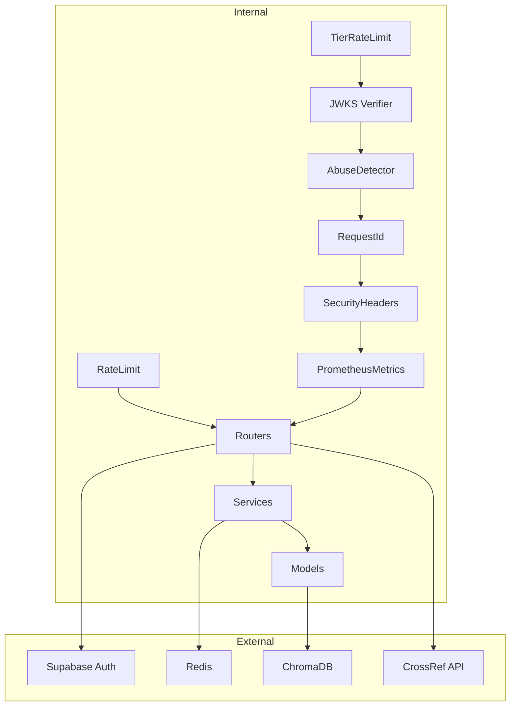

# System Layers

<cite>
**Referenced Files in This Document**
- [backend/app/main.py](file://backend/app/main.py)
- [backend/app/middleware/rate_limit.py](file://backend/app/middleware/rate_limit.py)
- [backend/app/middleware/tier_rate_limit.py](file://backend/app/middleware/tier_rate_limit.py)
- [backend/app/security/jwks_verifier.py](file://backend/app/security/jwks_verifier.py)
- [backend/app/middleware/abuse_detector.py](file://backend/app/middleware/abuse_detector.py)
- [backend/app/middleware/request_id.py](file://backend/app/middleware/request_id.py)
- [backend/app/middleware/security_headers.py](file://backend/app/middleware/security_headers.py)
- [backend/app/middleware/prometheus_metrics.py](file://backend/app/middleware/prometheus_metrics.py)
- [backend/app/db/session.py](file://backend/app/db/session.py)
- [backend/app/cache/redis_cache.py](file://backend/app/cache/redis_cache.py)
- [backend/app/pipeline/intelligence/rag_engine.py](file://backend/app/pipeline/intelligence/rag_engine.py)
- [backend/app/services/crossref_client.py](file://backend/app/services/crossref_client.py)
- [frontend/app/layout.jsx](file://frontend/app/layout.jsx)
- [frontend/src/lib/schemas.js](file://frontend/src/lib/schemas.js)
</cite>

## Table of Contents
1. [Introduction](#introduction)
2. [Project Structure](#project-structure)
3. [Core Components](#core-components)
4. [Architecture Overview](#architecture-overview)
5. [Detailed Component Analysis](#detailed-component-analysis)
6. [Dependency Analysis](#dependency-analysis)
7. [Performance Considerations](#performance-considerations)
8. [Troubleshooting Guide](#troubleshooting-guide)
9. [Conclusion](#conclusion)

## Introduction
This document describes the five-layer system architecture of the Automated Academic Manuscript Formatter. It covers the execution order of the middleware stack, routing patterns, and how each layer interacts with adjacent layers. The system spans:
- Browser layer (Next.js 14 app)
- FastAPI-only backend gateway
- Pipeline processing layer
- Data layer (PostgreSQL, Redis, ChromaDB)
- External services layer (Supabase Auth, Crossref, and optional AI/LLM providers)

It also explains responsibilities, data flows, and security boundaries across layers.

## Project Structure
The system is organized into:
- Frontend: Next.js 14 application with route groups and shared layouts
- Backend: FastAPI application with middleware stack, routers, services, and pipelines
- Data: PostgreSQL via SQLAlchemy, Redis for caching and counters, ChromaDB for semantic storage
- External Services: Supabase Auth (JWT verification), Crossref API, and optional AI/LLM providers

**Diagram sources**
- [backend/app/main.py:263-383](file://backend/app/main.py#L263-L383)
- [backend/app/middleware/rate_limit.py:49-172](file://backend/app/middleware/rate_limit.py#L49-L172)
- [backend/app/middleware/tier_rate_limit.py:19-116](file://backend/app/middleware/tier_rate_limit.py#L19-L116)
- [backend/app/security/jwks_verifier.py:135-183](file://backend/app/security/jwks_verifier.py#L135-L183)
- [backend/app/middleware/abuse_detector.py:14-70](file://backend/app/middleware/abuse_detector.py#L14-L70)
- [backend/app/middleware/request_id.py:21-74](file://backend/app/middleware/request_id.py#L21-L74)
- [backend/app/middleware/security_headers.py:18-99](file://backend/app/middleware/security_headers.py#L18-L99)
- [backend/app/middleware/prometheus_metrics.py:135-235](file://backend/app/middleware/prometheus_metrics.py#L135-L235)
- [backend/app/db/session.py:30-130](file://backend/app/db/session.py#L30-L130)
- [backend/app/cache/redis_cache.py:10-102](file://backend/app/cache/redis_cache.py#L10-L102)
- [backend/app/pipeline/intelligence/rag_engine.py:106-528](file://backend/app/pipeline/intelligence/rag_engine.py#L106-L528)
- [backend/app/services/crossref_client.py:32-164](file://backend/app/services/crossref_client.py#L32-L164)

**Section sources**
- [backend/app/main.py:263-383](file://backend/app/main.py#L263-L383)
- [frontend/app/layout.jsx:32-84](file://frontend/app/layout.jsx#L32-L84)

## Core Components
- Browser Layer (Next.js 14)
  - Provides authenticated UI flows, file upload, real-time preview, and generation sessions.
  - Uses route groups and shared layouts; client-side validation aligns with backend schemas.
- Backend Gateway (FastAPI)
  - Centralized middleware stack, routers, and health/readiness probes.
  - Includes CORS, rate limiting, security headers, request ID, audit logging, and Prometheus metrics.
- Pipeline Layer
  - Orchestration of document processing, formatting, generation, and AI-driven synthesis.
  - Integrates RAG engine backed by ChromaDB or a native fallback.
- Data Layer
  - PostgreSQL via SQLAlchemy with a safe engine/session factory.
  - Redis for caching and counters (rate limiting, LLM results, Crossref).
  - ChromaDB persistent store for semantic retrieval.
- External Services
  - Supabase Auth for JWT verification and user identity.
  - Crossref API for citation validation with Redis caching.

**Section sources**
- [frontend/app/layout.jsx:32-84](file://frontend/app/layout.jsx#L32-L84)
- [frontend/src/lib/schemas.js:1-235](file://frontend/src/lib/schemas.js#L1-L235)
- [backend/app/main.py:263-383](file://backend/app/main.py#L263-L383)
- [backend/app/db/session.py:30-130](file://backend/app/db/session.py#L30-L130)
- [backend/app/cache/redis_cache.py:10-102](file://backend/app/cache/redis_cache.py#L10-L102)
- [backend/app/pipeline/intelligence/rag_engine.py:106-528](file://backend/app/pipeline/intelligence/rag_engine.py#L106-L528)
- [backend/app/services/crossref_client.py:32-164](file://backend/app/services/crossref_client.py#L32-L164)

## Architecture Overview
The system enforces a strict middleware execution order at the gateway to ensure security, observability, and fairness before any router logic runs. The routing pattern is FastAPI-based with modular routers for auth, documents, generation, templates, metrics, feedback, streaming, and preview.

**Diagram sources**
- [backend/app/main.py:294-358](file://backend/app/main.py#L294-L358)
- [backend/app/middleware/rate_limit.py:124-172](file://backend/app/middleware/rate_limit.py#L124-L172)
- [backend/app/middleware/tier_rate_limit.py:96-116](file://backend/app/middleware/tier_rate_limit.py#L96-L116)
- [backend/app/security/jwks_verifier.py:135-183](file://backend/app/security/jwks_verifier.py#L135-L183)
- [backend/app/middleware/abuse_detector.py:41-67](file://backend/app/middleware/abuse_detector.py#L41-L67)
- [backend/app/middleware/request_id.py:25-60](file://backend/app/middleware/request_id.py#L25-L60)
- [backend/app/middleware/security_headers.py:28-66](file://backend/app/middleware/security_headers.py#L28-L66)
- [backend/app/middleware/prometheus_metrics.py:135-143](file://backend/app/middleware/prometheus_metrics.py#L135-L143)

## Detailed Component Analysis

### Middleware Stack Execution Order and Responsibilities
- RateLimitMiddleware
  - Sliding-window in-memory counter with optional Redis backend for multi-worker deployments.
  - Applies stricter limits for uploads and general requests.
- TierRateLimitMiddleware
  - Daily tier-based limits for guests on upload and generation start endpoints.
  - Uses JWKS verifier to detect authenticated users.
- JWKS Verifier
  - Resolves JWKS URL from Supabase settings, caches keys, and verifies JWTs.
  - Supports HS and RS algorithms with retry logic.
- AbuseDetector
  - Tracks spikes in generation and LLM usage per IP/user to trigger audit logs.
- RequestIdMiddleware
  - Generates and propagates X-Request-Id; binds logging context; supports idempotency-key logging for sensitive endpoints.
- SecurityHeadersMiddleware
  - Adds CSP, X-Frame-Options, X-Content-Type-Options, X-XSS-Protection, Referrer-Policy, Permissions-Policy.
  - Applies HSTS header via a dedicated HTTP middleware.
- PrometheusMetricsMiddleware
  - Exposes /metrics and records pipeline, agent, LLM, and connection metrics.

**Diagram sources**
- [backend/app/main.py:294-358](file://backend/app/main.py#L294-L358)
- [backend/app/middleware/rate_limit.py:49-172](file://backend/app/middleware/rate_limit.py#L49-L172)
- [backend/app/middleware/tier_rate_limit.py:19-116](file://backend/app/middleware/tier_rate_limit.py#L19-L116)
- [backend/app/security/jwks_verifier.py:135-183](file://backend/app/security/jwks_verifier.py#L135-L183)
- [backend/app/middleware/abuse_detector.py:14-70](file://backend/app/middleware/abuse_detector.py#L14-L70)
- [backend/app/middleware/request_id.py:21-74](file://backend/app/middleware/request_id.py#L21-L74)
- [backend/app/middleware/security_headers.py:18-99](file://backend/app/middleware/security_headers.py#L18-L99)
- [backend/app/middleware/prometheus_metrics.py:135-235](file://backend/app/middleware/prometheus_metrics.py#L135-L235)

**Section sources**
- [backend/app/middleware/rate_limit.py:49-172](file://backend/app/middleware/rate_limit.py#L49-L172)
- [backend/app/middleware/tier_rate_limit.py:19-116](file://backend/app/middleware/tier_rate_limit.py#L19-L116)
- [backend/app/security/jwks_verifier.py:135-183](file://backend/app/security/jwks_verifier.py#L135-L183)
- [backend/app/middleware/abuse_detector.py:14-70](file://backend/app/middleware/abuse_detector.py#L14-L70)
- [backend/app/middleware/request_id.py:21-74](file://backend/app/middleware/request_id.py#L21-L74)
- [backend/app/middleware/security_headers.py:18-99](file://backend/app/middleware/security_headers.py#L18-L99)
- [backend/app/middleware/prometheus_metrics.py:135-235](file://backend/app/middleware/prometheus_metrics.py#L135-L235)

### Routing Patterns
- FastAPI routers are included in the main app with prefixes and tags for:
  - Auth, Documents, Templates, Metrics, Feedback, Stream, Preview, Generator.
- Versioned API routes are grouped under v1_router and include synthesis endpoints.
- Health and readiness endpoints provide operational status and dependency checks.

**Diagram sources**
- [backend/app/main.py:330-358](file://backend/app/main.py#L330-L358)

**Section sources**
- [backend/app/main.py:330-358](file://backend/app/main.py#L330-L358)

### Data Layer Interactions
- PostgreSQL
  - Engine and session factory with safe creation and degraded mode behavior when DB URL is missing.
  - Health-check helper returns connectivity status.
- Redis
  - Centralized cache client for Grobid/LMM results, rate limiting, and Crossref caching.
  - Graceful degradation when unavailable.
- ChromaDB
  - Persistent client with collection-based storage for embedding vectors.
  - Falls back to a native JSON store when ChromaDB is unavailable.

**Diagram sources**
- [backend/app/db/session.py:30-130](file://backend/app/db/session.py#L30-L130)
- [backend/app/cache/redis_cache.py:10-102](file://backend/app/cache/redis_cache.py#L10-L102)
- [backend/app/pipeline/intelligence/rag_engine.py:106-528](file://backend/app/pipeline/intelligence/rag_engine.py#L106-L528)
- [backend/app/services/crossref_client.py:32-164](file://backend/app/services/crossref_client.py#L32-L164)

**Section sources**
- [backend/app/db/session.py:30-130](file://backend/app/db/session.py#L30-L130)
- [backend/app/cache/redis_cache.py:10-102](file://backend/app/cache/redis_cache.py#L10-L102)
- [backend/app/pipeline/intelligence/rag_engine.py:106-528](file://backend/app/pipeline/intelligence/rag_engine.py#L106-L528)
- [backend/app/services/crossref_client.py:32-164](file://backend/app/services/crossref_client.py#L32-L164)

### External Services Integration
- Supabase Auth
  - JWT verification via JWKS with caching and retry logic.
  - Used by TierRateLimitMiddleware to distinguish authenticated users.
- Crossref
  - Citation validation with distributed Redis caching and exponential backoff.
  - Falls back to in-memory cache when Redis is unavailable.

**Diagram sources**
- [backend/app/middleware/tier_rate_limit.py:57-68](file://backend/app/middleware/tier_rate_limit.py#L57-L68)
- [backend/app/security/jwks_verifier.py:135-183](file://backend/app/security/jwks_verifier.py#L135-L183)
- [backend/app/services/crossref_client.py:32-164](file://backend/app/services/crossref_client.py#L32-L164)
- [backend/app/cache/redis_cache.py:10-102](file://backend/app/cache/redis_cache.py#L10-L102)

**Section sources**
- [backend/app/middleware/tier_rate_limit.py:57-68](file://backend/app/middleware/tier_rate_limit.py#L57-L68)
- [backend/app/security/jwks_verifier.py:135-183](file://backend/app/security/jwks_verifier.py#L135-L183)
- [backend/app/services/crossref_client.py:32-164](file://backend/app/services/crossref_client.py#L32-L164)
- [backend/app/cache/redis_cache.py:10-102](file://backend/app/cache/redis_cache.py#L10-L102)

### Browser Layer Responsibilities and Data Flow
- Next.js app provides:
  - Protected route groups for formatter, generator, and shared auth flows.
  - Shared layout with metadata and client providers.
- Client-side validation aligns with backend schemas for uploads, synthesis, and generator requests.
- Real-time features leverage streaming and preview endpoints exposed by the backend.

**Diagram sources**
- [frontend/app/layout.jsx:32-84](file://frontend/app/layout.jsx#L32-L84)
- [frontend/src/lib/schemas.js:95-112](file://frontend/src/lib/schemas.js#L95-L112)
- [frontend/src/lib/schemas.js:167-184](file://frontend/src/lib/schemas.js#L167-L184)
- [frontend/src/lib/schemas.js:197-231](file://frontend/src/lib/schemas.js#L197-L231)

**Section sources**
- [frontend/app/layout.jsx:32-84](file://frontend/app/layout.jsx#L32-L84)
- [frontend/src/lib/schemas.js:1-235](file://frontend/src/lib/schemas.js#L1-L235)

## Dependency Analysis
- Coupling and Cohesion
  - Middleware components are loosely coupled and operate independently, enabling clear separation of concerns.
  - Routers depend on services and models; services depend on cache and external clients.
- External Dependencies
  - Supabase Auth for JWT verification.
  - Redis for caching and counters.
  - ChromaDB for embeddings; falls back to native store.
  - Crossref API for citation validation.
- Security Boundaries
  - JWT verification occurs before tier-based rate limiting.
  - Abuse detection triggers audit logs for suspicious activity.
  - Security headers and HSTS enforce transport and content protections.

**Diagram sources**
- [backend/app/main.py:294-358](file://backend/app/main.py#L294-L358)
- [backend/app/middleware/rate_limit.py:49-172](file://backend/app/middleware/rate_limit.py#L49-L172)
- [backend/app/middleware/tier_rate_limit.py:19-116](file://backend/app/middleware/tier_rate_limit.py#L19-L116)
- [backend/app/security/jwks_verifier.py:135-183](file://backend/app/security/jwks_verifier.py#L135-L183)
- [backend/app/middleware/abuse_detector.py:14-70](file://backend/app/middleware/abuse_detector.py#L14-L70)
- [backend/app/middleware/request_id.py:21-74](file://backend/app/middleware/request_id.py#L21-L74)
- [backend/app/middleware/security_headers.py:18-99](file://backend/app/middleware/security_headers.py#L18-L99)
- [backend/app/middleware/prometheus_metrics.py:135-235](file://backend/app/middleware/prometheus_metrics.py#L135-L235)
- [backend/app/db/session.py:30-130](file://backend/app/db/session.py#L30-L130)
- [backend/app/cache/redis_cache.py:10-102](file://backend/app/cache/redis_cache.py#L10-L102)
- [backend/app/pipeline/intelligence/rag_engine.py:106-528](file://backend/app/pipeline/intelligence/rag_engine.py#L106-L528)
- [backend/app/services/crossref_client.py:32-164](file://backend/app/services/crossref_client.py#L32-L164)

**Section sources**
- [backend/app/main.py:294-358](file://backend/app/main.py#L294-L358)

## Performance Considerations
- Middleware ordering ensures early rejection of abusive or rate-limited traffic.
- Redis-backed caching reduces latency for repeated LLM and Crossref calls.
- ChromaDB persistence enables scalable semantic search; native fallback maintains availability.
- Prometheus metrics expose pipeline durations, LLM usage, and queue depths for tuning.

[No sources needed since this section provides general guidance]

## Troubleshooting Guide
- Health and Readiness
  - Use /health and /ready endpoints to check DB connectivity, AI model availability, and Ollama server status.
- Rate Limiting
  - General and upload rate limits apply; uploads may be fingerprinted by token to differentiate users.
- Tier Limits
  - Guest daily limits enforced for upload and generation start endpoints; authenticated users bypass tier limits.
- Security Headers and HTTPS
  - HSTS header is applied in production; ensure HTTPS termination is configured upstream.
- Audit Logs
  - Write operations are audited; abuse spikes are logged for admin_action resources.

**Section sources**
- [backend/app/main.py:360-381](file://backend/app/main.py#L360-L381)
- [backend/app/middleware/rate_limit.py:124-172](file://backend/app/middleware/rate_limit.py#L124-L172)
- [backend/app/middleware/tier_rate_limit.py:96-116](file://backend/app/middleware/tier_rate_limit.py#L96-L116)
- [backend/app/middleware/security_headers.py:28-66](file://backend/app/middleware/security_headers.py#L28-L66)
- [backend/app/middleware/prometheus_metrics.py:135-143](file://backend/app/middleware/prometheus_metrics.py#L135-L143)

## Conclusion
The system’s five-layer architecture cleanly separates presentation, gateway, pipeline, data, and external services. The middleware stack enforces security, fairness, and observability early in the request lifecycle, while routers and services encapsulate business logic. Redis, PostgreSQL, and ChromaDB provide robust caching, persistence, and semantic search. External integrations (Supabase Auth, Crossref) are integrated with resilience and caching. Together, these layers deliver a secure, observable, and scalable platform for academic manuscript formatting.