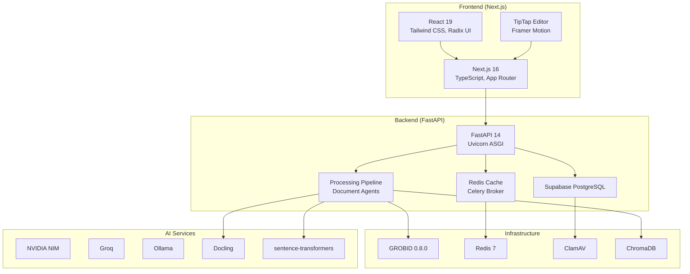
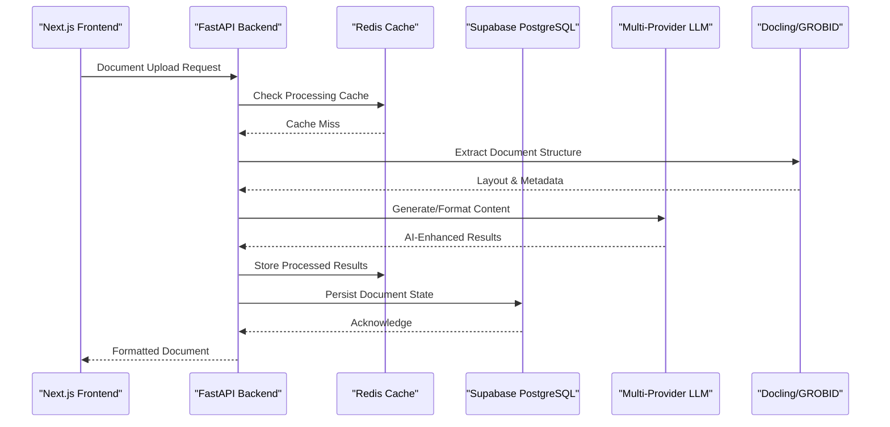
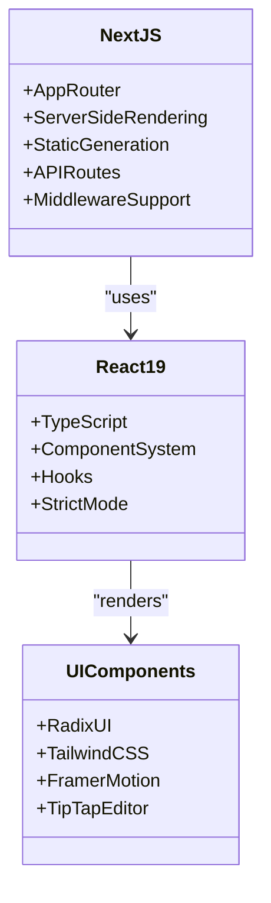
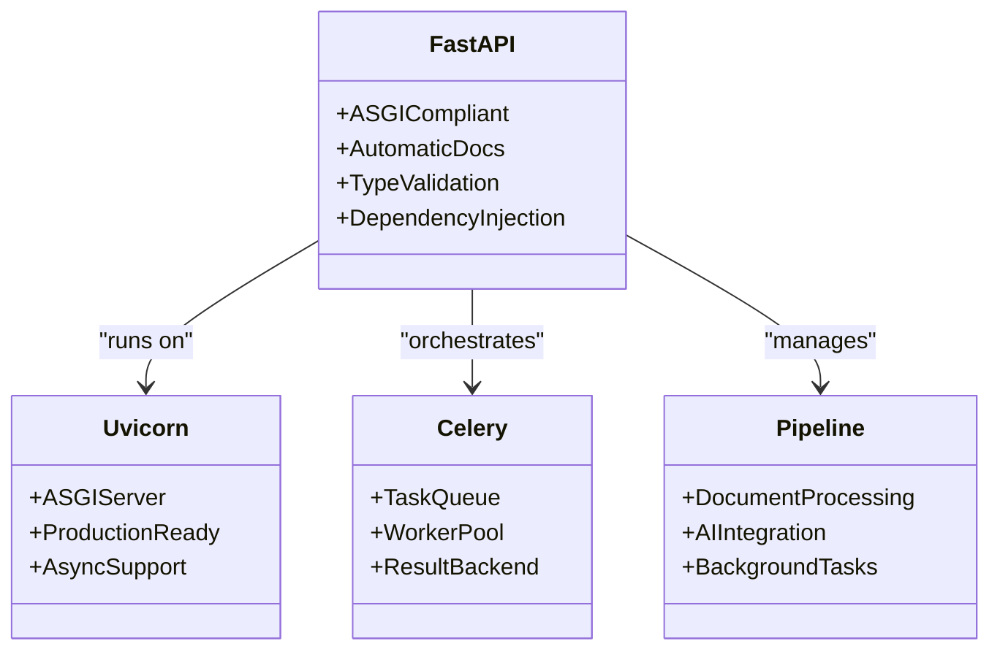
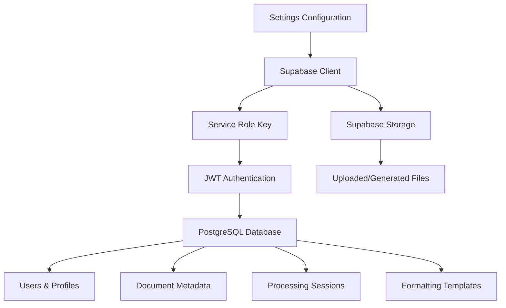
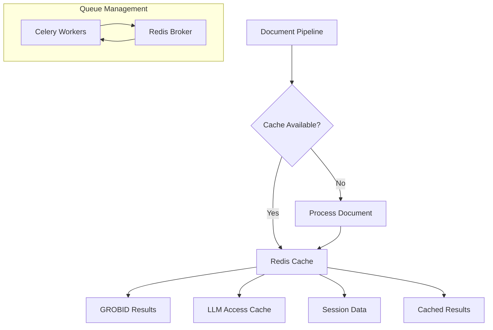
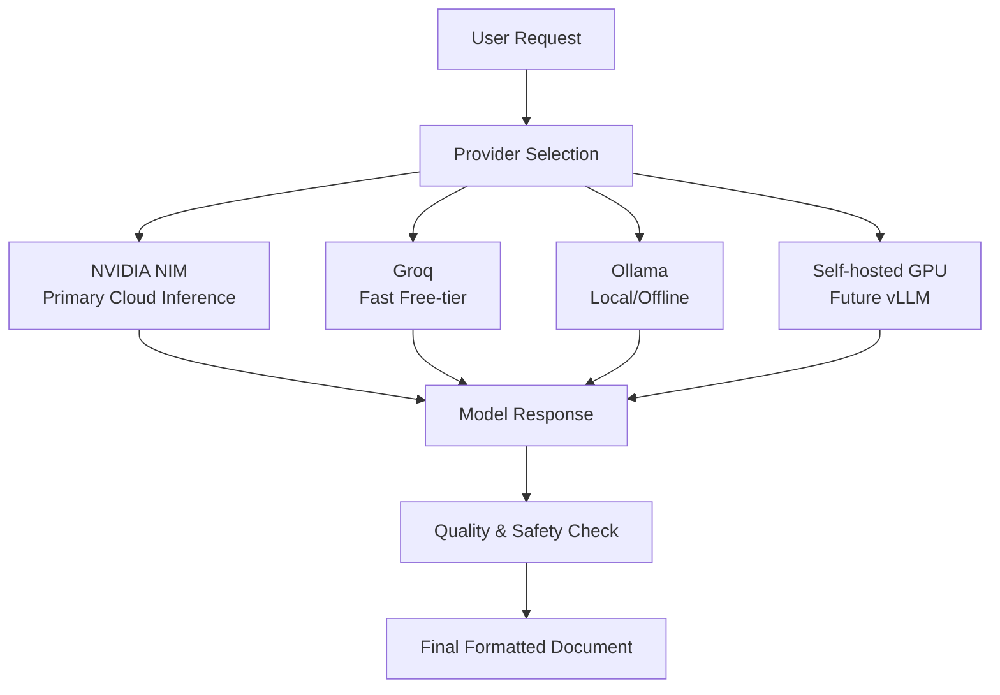
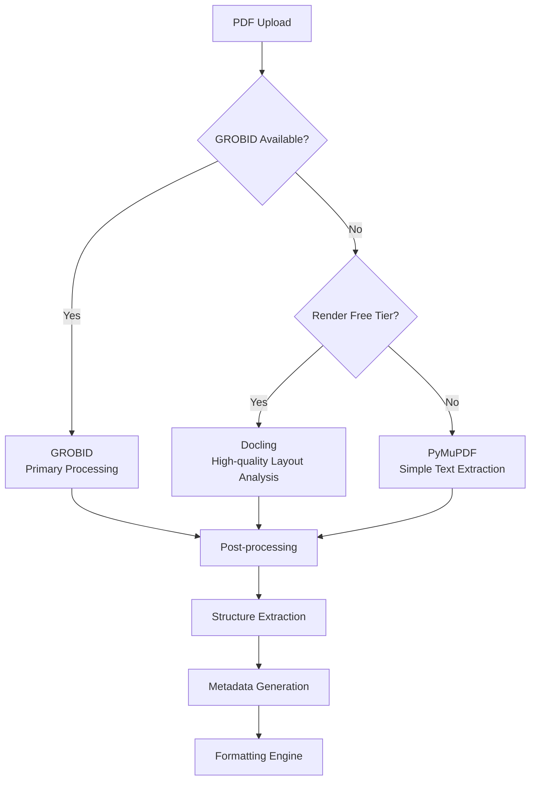
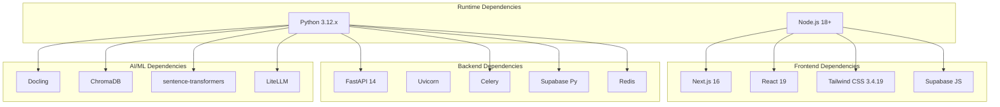

# Technology Stack

<cite>
**Referenced Files in This Document**
- [TechStack.md](file://docs/TechStack.md)
- [pyproject.toml](file://backend/pyproject.toml)
- [package.json](file://frontend/package.json)
- [Dockerfile](file://backend/docker/Dockerfile)
- [docker-compose.yml](file://backend/docker/docker-compose.yml)
- [settings.py](file://backend/app/config/settings.py)
- [supabase_client.py](file://backend/app/db/supabase_client.py)
- [redis_cache.py](file://backend/app/cache/redis_cache.py)
- [docling_client.py](file://backend/app/pipeline/services/docling_client.py)
- [grobid_client.py](file://backend/app/pipeline/services/grobid_client.py)
- [next.config.mjs](file://frontend/next.config.mjs)
- [tailwind.config.js](file://frontend/tailwind.config.js)
- [render.yaml](file://render.yaml)
- [requirements.md](file://backend/requirements.md)
</cite>

## Table of Contents
1. [Introduction](#introduction)
2. [Project Structure](#project-structure)
3. [Core Components](#core-components)
4. [Architecture Overview](#architecture-overview)
5. [Detailed Component Analysis](#detailed-component-analysis)
6. [Dependency Analysis](#dependency-analysis)
7. [Performance Considerations](#performance-considerations)
8. [Troubleshooting Guide](#troubleshooting-guide)
9. [Conclusion](#conclusion)

## Introduction
This document provides a comprehensive technology stack overview for the Automated Academic Manuscript Formatter. It covers the complete frontend/backend ecosystem, infrastructure dependencies, AI/ML services, and operational considerations. The stack emphasizes scientific document processing, real-time collaboration, and scalable AI-driven workflows.

## Project Structure
The project follows a clear separation of concerns:
- Frontend: Next.js 16 application with App Router, TypeScript, and modern UI libraries
- Backend: FastAPI application with Uvicorn ASGI server, Celery workers, and comprehensive pipeline modules
- Infrastructure: Dockerized services for GROBID, Redis, ClamAV, and optional ChromaDB
- Data: Supabase PostgreSQL for relational data and Supabase Storage for file assets
- AI/ML: Multi-provider LLM abstraction (NVIDIA NIM, Groq, Ollama), Docling for layout analysis, and ChromaDB for RAG

**Diagram sources**
- [next.config.mjs:1-27](file://frontend/next.config.mjs#L1-L27)
- [package.json:17-36](file://frontend/package.json#L17-L36)
- [pyproject.toml:5-9](file://backend/pyproject.toml#L5-L9)
- [docker-compose.yml:4-21](file://backend/docker/docker-compose.yml#L4-L21)
- [docker-compose.yml:22-32](file://backend/docker/docker-compose.yml#L22-L32)
- [docker-compose.yml:41-67](file://backend/docker/docker-compose.yml#L41-L67)
- [requirements.md:51-54](file://backend/requirements.md#L51-L54)
- [requirements.md:249](file://backend/requirements.md#L249)
- [requirements.md:30](file://backend/requirements.md#L30-L31)

**Section sources**
- [TechStack.md:1-122](file://docs/TechStack.md#L1-L122)
- [package.json:17-36](file://frontend/package.json#L17-L36)
- [pyproject.toml:5-9](file://backend/pyproject.toml#L5-L9)
- [docker-compose.yml:4-21](file://backend/docker/docker-compose.yml#L4-L21)
- [docker-compose.yml:22-32](file://backend/docker/docker-compose.yml#L22-L32)
- [docker-compose.yml:41-67](file://backend/docker/docker-compose.yml#L41-L67)

## Core Components
The technology stack is built around several core pillars:

### Frontend Technologies
- Next.js 16 with App Router for SSR, static generation, and API routes
- React 19 with TypeScript for type-safe component development
- Tailwind CSS 3.4.19 for utility-first styling
- Radix UI for accessible component primitives
- TipTap editor for rich text editing capabilities
- Framer Motion for smooth animations and transitions
- Supabase JS SDK for authentication and database operations

### Backend Technologies
- Python 3.12.x runtime with FastAPI 14 as the primary API framework
- Uvicorn ASGI server for production deployments
- Celery with Redis as the message broker for asynchronous task processing
- PostgreSQL via Supabase for relational data storage
- Redis 7 for caching, pub/sub messaging, and task queuing
- ChromaDB for vector embeddings and retrieval-augmented generation (RAG)
- Docling for advanced PDF layout analysis and structure extraction
- Sentence-transformers for embedding generation

### AI/ML Infrastructure
- Multi-tier LLM provider abstraction supporting NVIDIA NIM, Groq, and Ollama
- GROBID for bibliographic metadata extraction
- ClamAV for malware scanning of uploaded documents
- LiteLLM for unified LLM provider interface

**Section sources**
- [TechStack.md:7-49](file://docs/TechStack.md#L7-L49)
- [package.json:17-36](file://frontend/package.json#L17-L36)
- [pyproject.toml:5-9](file://backend/pyproject.toml#L5-L9)
- [requirements.md:51-54](file://backend/requirements.md#L51-L54)
- [requirements.md:249](file://backend/requirements.md#L249)
- [requirements.md:30](file://backend/requirements.md#L30-L31)

## Architecture Overview
The system employs a microservices-like architecture with clear separation between frontend, backend, and infrastructure components:

**Diagram sources**
- [redis_cache.py:10-102](file://backend/app/cache/redis_cache.py#L10-L102)
- [supabase_client.py:107-124](file://backend/app/db/supabase_client.py#L107-L124)
- [docling_client.py:143-179](file://backend/app/pipeline/services/docling_client.py#L143-L179)
- [grobid_client.py:25-51](file://backend/app/pipeline/services/grobid_client.py#L25-L51)

The architecture supports:
- Real-time document processing with caching layers
- Multi-provider AI inference with fallback mechanisms
- Scalable background task processing via Celery
- Comprehensive document lifecycle management

## Detailed Component Analysis

### Frontend Framework (Next.js 16)
The frontend leverages Next.js 16 with modern development practices:

**Diagram sources**
- [next.config.mjs:4-11](file://frontend/next.config.mjs#L4-L11)
- [package.json:17-36](file://frontend/package.json#L17-L36)

Key features include:
- App Router for improved routing and data fetching
- Automatic code splitting and tree shaking
- Built-in API routes for backend integration
- Optimized build pipeline with Turbopack support

**Section sources**
- [TechStack.md:7-25](file://docs/TechStack.md#L7-L25)
- [next.config.mjs:1-27](file://frontend/next.config.mjs#L1-L27)
- [package.json:17-36](file://frontend/package.json#L17-L36)

### Backend Framework (FastAPI + Uvicorn)
The backend utilizes FastAPI for robust API development:

**Diagram sources**
- [pyproject.toml:5-9](file://backend/pyproject.toml#L5-L9)
- [docker-compose.yml:41-67](file://backend/docker/docker-compose.yml#L41-L67)

**Section sources**
- [TechStack.md:29-51](file://docs/TechStack.md#L29-L51)
- [pyproject.toml:5-9](file://backend/pyproject.toml#L5-L9)
- [docker-compose.yml:41-67](file://backend/docker/docker-compose.yml#L41-L67)

### Database Layer (Supabase PostgreSQL)
Supabase provides a comprehensive database solution:

**Diagram sources**
- [settings.py:76-82](file://backend/app/config/settings.py#L76-L82)
- [supabase_client.py:49-83](file://backend/app/db/supabase_client.py#L49-L83)

**Section sources**
- [TechStack.md:83-84](file://docs/TechStack.md#L83-L84)
- [settings.py:76-82](file://backend/app/config/settings.py#L76-L82)
- [supabase_client.py:107-124](file://backend/app/db/supabase_client.py#L107-L124)

### Caching and Queue Management (Redis)
Redis serves multiple roles in the system:

**Diagram sources**
- [redis_cache.py:10-102](file://backend/app/cache/redis_cache.py#L10-L102)
- [docker-compose.yml:22-32](file://backend/docker/docker-compose.yml#L22-L32)

**Section sources**
- [TechStack.md:37](file://docs/TechStack.md#L37)
- [redis_cache.py:10-102](file://backend/app/cache/redis_cache.py#L10-L102)
- [docker-compose.yml:22-32](file://backend/docker/docker-compose.yml#L22-L32)

### AI/ML Integration Layer
The system integrates multiple AI providers with fallback mechanisms:

**Diagram sources**
- [TechStack.md:54-62](file://docs/TechStack.md#L54-L62)
- [settings.py:142-154](file://backend/app/config/settings.py#L142-L154)

**Section sources**
- [TechStack.md:54-62](file://docs/TechStack.md#L54-L62)
- [settings.py:142-154](file://backend/app/config/settings.py#L142-L154)

### PDF Processing Pipeline
The system implements a three-tier PDF processing approach:

**Diagram sources**
- [TechStack.md:65-74](file://docs/TechStack.md#L65-L74)
- [docling_client.py:143-179](file://backend/app/pipeline/services/docling_client.py#L143-L179)
- [grobid_client.py:25-51](file://backend/app/pipeline/services/grobid_client.py#L25-L51)

**Section sources**
- [TechStack.md:65-74](file://docs/TechStack.md#L65-L74)
- [docling_client.py:143-179](file://backend/app/pipeline/services/docling_client.py#L143-L179)
- [grobid_client.py:25-51](file://backend/app/pipeline/services/grobid_client.py#L25-L51)

## Dependency Analysis
The technology stack exhibits strong modularity with clear dependency relationships:

**Diagram sources**
- [pyproject.toml:5-9](file://backend/pyproject.toml#L5-L9)
- [package.json:17-36](file://frontend/package.json#L17-L36)
- [requirements.md:51-54](file://backend/requirements.md#L51-L54)
- [requirements.md:30](file://backend/requirements.md#L30-L31)
- [requirements.md:249](file://backend/requirements.md#L249)

**Section sources**
- [requirements.md:1-377](file://backend/requirements.md#L1-L377)
- [package.json:17-36](file://frontend/package.json#L17-L36)
- [pyproject.toml:5-9](file://backend/pyproject.toml#L5-L9)

## Performance Considerations
The technology stack incorporates several performance optimization strategies:

### Caching Strategy
- Redis-based caching for LLM responses and processed document results
- Configurable TTL values for different cache types
- Graceful degradation when cache is unavailable

### Asynchronous Processing
- Celery workers handle background tasks with separate queues
- Interactive vs batch processing separation
- Task prioritization and resource allocation

### AI Provider Optimization
- Multi-tier LLM provider selection with fallback mechanisms
- Provider-specific optimization configurations
- Cost-effective inference strategies

### Database Optimization
- Supabase PostgreSQL with proper indexing
- Connection pooling and session management
- Efficient query patterns for document metadata

## Troubleshooting Guide
Common issues and their resolutions:

### Environment Configuration
- Verify Python 3.12.x compatibility for backend services
- Ensure all required environment variables are properly configured
- Check Redis connectivity for caching and queue operations

### Service Dependencies
- Confirm GROBID service availability for bibliographic extraction
- Validate Docling installation for layout analysis
- Monitor ClamAV service for malware scanning

### Performance Issues
- Monitor Redis cache hit rates and adjust TTL values
- Scale Celery workers based on processing load
- Optimize AI provider configurations for latency

**Section sources**
- [settings.py:248-257](file://backend/app/config/settings.py#L248-L257)
- [redis_cache.py:34-38](file://backend/app/cache/redis_cache.py#L34-L38)
- [supabase_client.py:126-144](file://backend/app/db/supabase_client.py#L126-L144)

## Conclusion
The Automated Academic Manuscript Formatter employs a modern, scalable technology stack designed for academic document processing. The combination of Next.js 16 for frontend development, FastAPI for backend services, and comprehensive AI/ML integration provides a robust foundation for automated manuscript formatting. The multi-tier architecture ensures reliability through caching, queue management, and provider fallback mechanisms, while the modular design facilitates maintainability and future enhancements.

The stack's emphasis on scientific document processing, real-time collaboration, and scalable AI workflows positions it well for production deployment and continued evolution in the academic publishing domain.