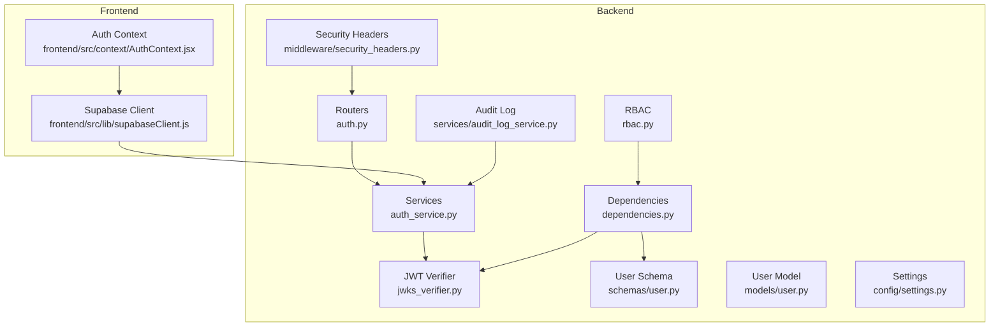
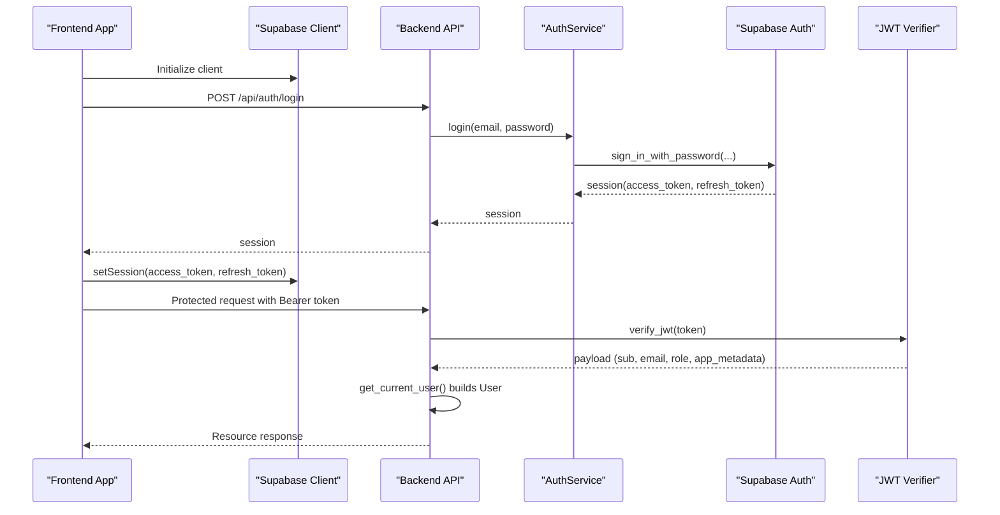
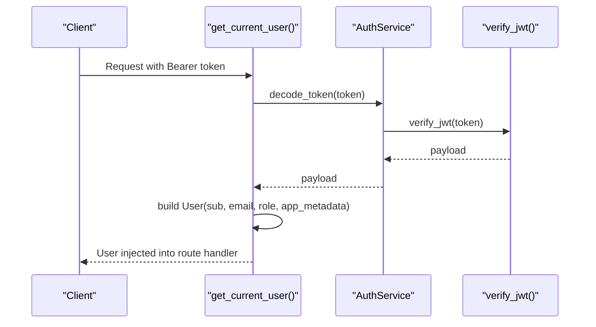
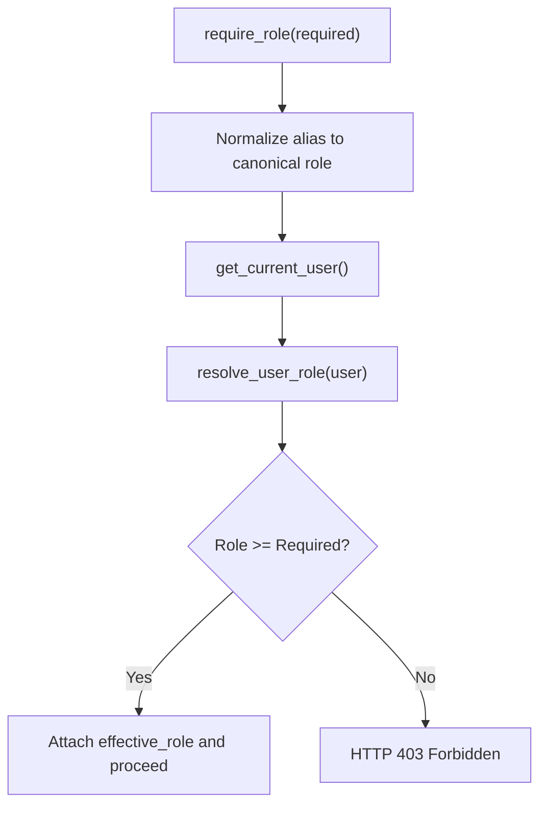
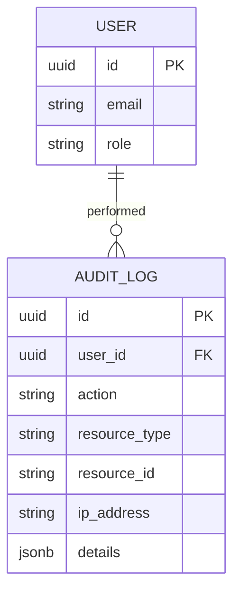
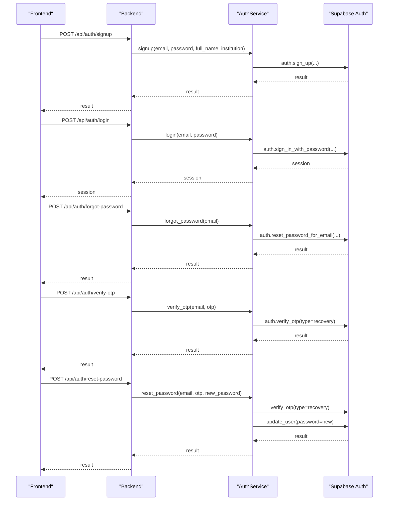
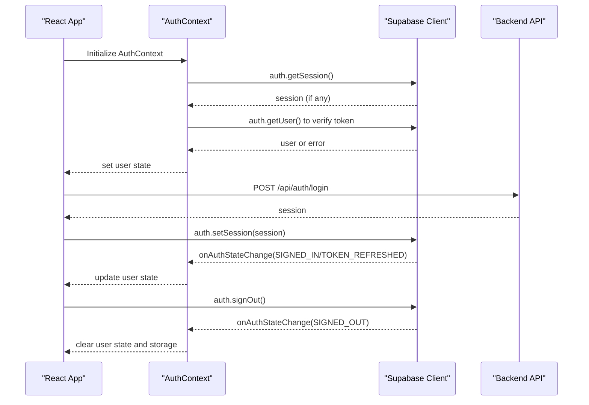
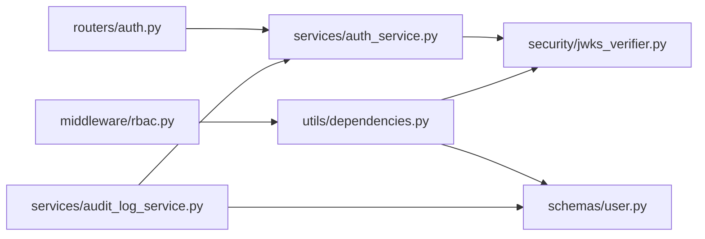

# Authentication & Authorization

<cite>
**Referenced Files in This Document**
- [auth.py](file://backend/app/routers/auth.py)
- [auth_service.py](file://backend/app/services/auth_service.py)
- [jwks_verifier.py](file://backend/app/security/jwks_verifier.py)
- [rbac.py](file://backend/app/middleware/rbac.py)
- [dependencies.py](file://backend/app/utils/dependencies.py)
- [user.py](file://backend/app/models/user.py)
- [user.py](file://backend/app/schemas/user.py)
- [auth.py](file://backend/app/schemas/auth.py)
- [settings.py](file://backend/app/config/settings.py)
- [security_headers.py](file://backend/app/middleware/security_headers.py)
- [audit_log_service.py](file://backend/app/services/audit_log_service.py)
- [supabaseClient.js](file://frontend/src/lib/supabaseClient.js)
- [AuthContext.jsx](file://frontend/src/context/AuthContext.jsx)
</cite>

## Table of Contents
1. [Introduction](#introduction)
2. [Project Structure](#project-structure)
3. [Core Components](#core-components)
4. [Architecture Overview](#architecture-overview)
5. [Detailed Component Analysis](#detailed-component-analysis)
6. [Dependency Analysis](#dependency-analysis)
7. [Performance Considerations](#performance-considerations)
8. [Troubleshooting Guide](#troubleshooting-guide)
9. [Conclusion](#conclusion)
10. [Appendices](#appendices)

## Introduction
This document describes the authentication and authorization system built on Supabase Auth. It covers JWT token handling, JWKS verification, session management, role-based access control (RBAC), permission checking, resource-level authorization, user registration and login flows, password reset and OTP verification, security middleware integration, token refresh strategies, logout handling, multi-factor authentication support, account security features, audit logging for security events, and integration with external identity providers. The goal is to provide a comprehensive yet accessible guide for both developers and operators.

## Project Structure
The authentication system spans the backend API, middleware, services, and schemas, as well as the frontend Supabase client and React context. Key areas:
- Backend API routes for auth endpoints
- Service layer that integrates with Supabase Auth
- JWT decoding and verification utilities
- RBAC middleware for role-based enforcement
- Utilities for extracting and validating the current user
- Frontend Supabase client and AuthContext for session lifecycle
- Security headers and audit logging services

**Diagram sources**
- [auth.py:1-59](file://backend/app/routers/auth.py#L1-L59)
- [auth_service.py:1-183](file://backend/app/services/auth_service.py#L1-L183)
- [jwks_verifier.py:1-183](file://backend/app/security/jwks_verifier.py#L1-L183)
- [dependencies.py:1-93](file://backend/app/utils/dependencies.py#L1-L93)
- [rbac.py:1-80](file://backend/app/middleware/rbac.py#L1-L80)
- [user.py:1-67](file://backend/app/schemas/user.py#L1-L67)
- [user.py:1-20](file://backend/app/models/user.py#L1-L20)
- [settings.py:1-422](file://backend/app/config/settings.py#L1-L422)
- [security_headers.py:1-99](file://backend/app/middleware/security_headers.py#L1-L99)
- [audit_log_service.py:1-141](file://backend/app/services/audit_log_service.py#L1-L141)
- [supabaseClient.js:1-24](file://frontend/src/lib/supabaseClient.js#L1-L24)
- [AuthContext.jsx:1-340](file://frontend/src/context/AuthContext.jsx#L1-L340)

**Section sources**
- [auth.py:1-59](file://backend/app/routers/auth.py#L1-L59)
- [auth_service.py:1-183](file://backend/app/services/auth_service.py#L1-L183)
- [jwks_verifier.py:1-183](file://backend/app/security/jwks_verifier.py#L1-L183)
- [dependencies.py:1-93](file://backend/app/utils/dependencies.py#L1-L93)
- [rbac.py:1-80](file://backend/app/middleware/rbac.py#L1-L80)
- [user.py:1-67](file://backend/app/schemas/user.py#L1-L67)
- [user.py:1-20](file://backend/app/models/user.py#L1-L20)
- [settings.py:1-422](file://backend/app/config/settings.py#L1-L422)
- [security_headers.py:1-99](file://backend/app/middleware/security_headers.py#L1-L99)
- [audit_log_service.py:1-141](file://backend/app/services/audit_log_service.py#L1-L141)
- [supabaseClient.js:1-24](file://frontend/src/lib/supabaseClient.js#L1-L24)
- [AuthContext.jsx:1-340](file://frontend/src/context/AuthContext.jsx#L1-L340)

## Core Components
- Authentication endpoints: Registration, login, forgot password, OTP verification, and reset password.
- JWT decoding and verification: Supports HS and RS algorithms, JWKS caching, and issuer/audience validation.
- Session extraction: Extracts user identity from tokens via a dependency and builds a User object.
- RBAC: Role hierarchy and aliases, role resolution from user payload/app metadata, and role-gated access.
- Frontend session lifecycle: Supabase client initialization, onAuthStateChange listener, sign-in/sign-out, and session refresh.
- Security headers: Adds CSP, HSTS, frame options, and other protections.
- Audit logging: Logs write actions with user, IP, and resource metadata.

**Section sources**
- [auth.py:15-59](file://backend/app/routers/auth.py#L15-L59)
- [auth_service.py:56-183](file://backend/app/services/auth_service.py#L56-L183)
- [jwks_verifier.py:135-183](file://backend/app/security/jwks_verifier.py#L135-L183)
- [dependencies.py:15-60](file://backend/app/utils/dependencies.py#L15-L60)
- [rbac.py:9-80](file://backend/app/middleware/rbac.py#L9-L80)
- [AuthContext.jsx:65-178](file://frontend/src/context/AuthContext.jsx#L65-L178)
- [security_headers.py:18-66](file://backend/app/middleware/security_headers.py#L18-L66)
- [audit_log_service.py:17-141](file://backend/app/services/audit_log_service.py#L17-L141)

## Architecture Overview
The system integrates the backend with Supabase Auth for identity and tokens, and the frontend with Supabase JS client for session management. JWT verification is performed server-side using JWKS discovery and caching. RBAC enforces role-based permissions, while audit logging captures security-relevant events.

**Diagram sources**
- [auth.py:31-36](file://backend/app/routers/auth.py#L31-L36)
- [auth_service.py:102-121](file://backend/app/services/auth_service.py#L102-L121)
- [jwks_verifier.py:135-183](file://backend/app/security/jwks_verifier.py#L135-L183)
- [dependencies.py:15-60](file://backend/app/utils/dependencies.py#L15-L60)
- [AuthContext.jsx:214-249](file://frontend/src/context/AuthContext.jsx#L214-L249)
- [supabaseClient.js:1-24](file://frontend/src/lib/supabaseClient.js#L1-L24)

## Detailed Component Analysis

### JWT Token Handling and JWKS Verification
- Token verification supports HS (symmetric) and RS (asymmetric) algorithms.
- Issuer and audience validation are enforced.
- JWKS discovery is cached with TTL and thread-safe locking.
- Keys are resolved by kid from JWKS, with fallback to re-fetch on failure.
- Errors are surfaced as HTTP 401 with appropriate messages.

```mermaid
flowchart TD
Start(["verify_jwt(token)"]) --> CheckAlg["Check alg in header"]
CheckAlg --> IsHS{"alg starts with HS?"}
IsHS --> |Yes| DecodeSecret["Decode with SECRET (HS)"]
IsHS --> |No| DecodeJWKS["Decode with JWKS (RS/EC/OKP)"]
DecodeJWKS --> KidFound{"kid present?"}
KidFound --> |No| RetryFetch["Retry JWKS fetch"]
KidFound --> |Yes| PubKey["Load JWK by kid"]
PubKey --> VerifySig["Verify signature and claims"]
VerifySig --> Done(["Return decoded payload"])
DecodeSecret --> Done
RetryFetch --> VerifySig
```

**Diagram sources**
- [jwks_verifier.py:135-183](file://backend/app/security/jwks_verifier.py#L135-L183)
- [jwks_verifier.py:106-133](file://backend/app/security/jwks_verifier.py#L106-L133)
- [jwks_verifier.py:61-68](file://backend/app/security/jwks_verifier.py#L61-L68)

**Section sources**
- [jwks_verifier.py:135-183](file://backend/app/security/jwks_verifier.py#L135-L183)
- [jwks_verifier.py:26-68](file://backend/app/security/jwks_verifier.py#L26-L68)

### Session Management and User Extraction
- The dependency extracts the token from Authorization header or query param for SSE compatibility.
- Validates token via AuthService and constructs a User object from payload fields.
- Records user activity via metrics manager when available.

**Diagram sources**
- [dependencies.py:15-60](file://backend/app/utils/dependencies.py#L15-L60)
- [auth_service.py:58-74](file://backend/app/services/auth_service.py#L58-L74)
- [jwks_verifier.py:135-183](file://backend/app/security/jwks_verifier.py#L135-L183)

**Section sources**
- [dependencies.py:15-60](file://backend/app/utils/dependencies.py#L15-L60)
- [auth_service.py:58-74](file://backend/app/services/auth_service.py#L58-L74)
- [user.py:29-38](file://backend/app/schemas/user.py#L29-L38)

### Role-Based Access Control (RBAC)
- Role hierarchy defines ordering: free < pro < admin.
- Aliases normalize common role names to canonical roles.
- Role resolution considers user role and app_metadata fields.
- A guard checks effective role against required role and raises 403 if insufficient.

**Diagram sources**
- [rbac.py:61-80](file://backend/app/middleware/rbac.py#L61-L80)
- [rbac.py:34-58](file://backend/app/middleware/rbac.py#L34-L58)

**Section sources**
- [rbac.py:9-80](file://backend/app/middleware/rbac.py#L9-L80)
- [user.py:29-38](file://backend/app/schemas/user.py#L29-L38)

### Resource-Level Authorization
- The User schema exposes app_metadata which RBAC uses to derive effective role.
- Application logic can scope resources by user.id and enforce ownership checks.
- Audit logging records write actions with resource type/id and IP address.

**Diagram sources**
- [user.py:6-19](file://backend/app/models/user.py#L6-L19)
- [audit_log_service.py:55-137](file://backend/app/services/audit_log_service.py#L55-L137)

**Section sources**
- [audit_log_service.py:55-137](file://backend/app/services/audit_log_service.py#L55-L137)
- [user.py:6-19](file://backend/app/models/user.py#L6-L19)

### Authentication Endpoints and Flows
- Registration: Creates a new user with profile data and terms acceptance.
- Login: Authenticates with email/password and returns session with access/refresh tokens.
- Forgot Password: Sends a password reset OTP to the user’s email.
- OTP Verification: Stateless verification of the 6-digit OTP.
- Reset Password: Re-verifies OTP and updates the user’s password.

**Diagram sources**
- [auth.py:23-59](file://backend/app/routers/auth.py#L23-L59)
- [auth_service.py:77-183](file://backend/app/services/auth_service.py#L77-L183)

**Section sources**
- [auth.py:23-59](file://backend/app/routers/auth.py#L23-L59)
- [auth_service.py:77-183](file://backend/app/services/auth_service.py#L77-L183)
- [auth.py:32-137](file://backend/app/schemas/auth.py#L32-L137)

### Frontend Authentication Lifecycle
- Supabase client initialization guards missing environment variables.
- AuthContext initializes by fetching session and verifying against Supabase.
- Listens to onAuthStateChange for login, logout, and token refresh events.
- Provides sign-in/sign-up with OAuth and local credentials, sign-out, and password reset flows.
- Manages local storage/session storage cleanup on logout.

**Diagram sources**
- [AuthContext.jsx:65-178](file://frontend/src/context/AuthContext.jsx#L65-L178)
- [AuthContext.jsx:180-249](file://frontend/src/context/AuthContext.jsx#L180-L249)
- [AuthContext.jsx:262-278](file://frontend/src/context/AuthContext.jsx#L262-L278)
- [supabaseClient.js:1-24](file://frontend/src/lib/supabaseClient.js#L1-L24)

**Section sources**
- [supabaseClient.js:1-24](file://frontend/src/lib/supabaseClient.js#L1-L24)
- [AuthContext.jsx:65-178](file://frontend/src/context/AuthContext.jsx#L65-L178)
- [AuthContext.jsx:180-249](file://frontend/src/context/AuthContext.jsx#L180-L249)
- [AuthContext.jsx:262-278](file://frontend/src/context/AuthContext.jsx#L262-L278)

### Security Middleware Integration
- SecurityHeadersMiddleware adds CSP, X-Content-Type-Options, X-Frame-Options, X-XSS-Protection, Referrer-Policy, and Permissions-Policy.
- MaxBodySizeMiddleware enforces a maximum request body size to mitigate DoS.
- Settings control HTTPS enforcement and HSTS behavior.

**Section sources**
- [security_headers.py:18-99](file://backend/app/middleware/security_headers.py#L18-L99)
- [settings.py:99-103](file://backend/app/config/settings.py#L99-L103)

### Audit Logging for Security Events
- AuditLogService logs write operations with user_id derived from Authorization header token.
- Extracts resource type/id from request path and captures IP, request ID, and details.
- Handles missing audit table gracefully and logs a single warning.

**Section sources**
- [audit_log_service.py:17-141](file://backend/app/services/audit_log_service.py#L17-L141)

## Dependency Analysis
- Router depends on AuthService for auth operations.
- AuthService depends on Supabase client and JWT verifier.
- Dependencies depend on AuthService and JWT verifier to build User.
- RBAC depends on get_current_user to resolve roles.
- AuditLogService depends on AuthService for user extraction and Supabase client for persistence.

**Diagram sources**
- [auth.py:1-59](file://backend/app/routers/auth.py#L1-L59)
- [auth_service.py:1-183](file://backend/app/services/auth_service.py#L1-L183)
- [jwks_verifier.py:1-183](file://backend/app/security/jwks_verifier.py#L1-L183)
- [dependencies.py:1-93](file://backend/app/utils/dependencies.py#L1-L93)
- [rbac.py:1-80](file://backend/app/middleware/rbac.py#L1-L80)
- [audit_log_service.py:1-141](file://backend/app/services/audit_log_service.py#L1-L141)
- [user.py:1-67](file://backend/app/schemas/user.py#L1-L67)

**Section sources**
- [auth.py:1-59](file://backend/app/routers/auth.py#L1-L59)
- [auth_service.py:1-183](file://backend/app/services/auth_service.py#L1-L183)
- [jwks_verifier.py:1-183](file://backend/app/security/jwks_verifier.py#L1-L183)
- [dependencies.py:1-93](file://backend/app/utils/dependencies.py#L1-L93)
- [rbac.py:1-80](file://backend/app/middleware/rbac.py#L1-L80)
- [audit_log_service.py:1-141](file://backend/app/services/audit_log_service.py#L1-L141)
- [user.py:1-67](file://backend/app/schemas/user.py#L1-L67)

## Performance Considerations
- JWKS caching reduces network calls and CPU overhead for signature verification.
- Token verification short-circuits on missing or invalid tokens to avoid unnecessary work.
- RBAC checks are O(1) after user extraction.
- Frontend uses Supabase’s internal storage and listeners to minimize redundant network calls.

[No sources needed since this section provides general guidance]

## Troubleshooting Guide
- Missing Supabase credentials: Backend auth endpoints return 503 until SUPABASE_URL and SUPABASE_ANON_KEY are configured.
- Invalid/expired token: 401 Unauthorized with specific messages for expired signature, invalid issuer, or invalid audience.
- Missing token: 401 Unauthorized with WWW-Authenticate header.
- Insufficient permissions: 403 Forbidden when required role is not met.
- Frontend session not persisting: Ensure Supabase client is initialized with proper environment variables and do not override storage manually.
- Logout not clearing state: AuthContext clears Supabase auth storage and local/session storage on sign-out.

**Section sources**
- [auth_service.py:46-53](file://backend/app/services/auth_service.py#L46-L53)
- [jwks_verifier.py:135-183](file://backend/app/security/jwks_verifier.py#L135-L183)
- [dependencies.py:31-59](file://backend/app/utils/dependencies.py#L31-L59)
- [rbac.py:74-77](file://backend/app/middleware/rbac.py#L74-L77)
- [supabaseClient.js:8-10](file://frontend/src/lib/supabaseClient.js#L8-L10)
- [AuthContext.jsx:262-278](file://frontend/src/context/AuthContext.jsx#L262-L278)

## Conclusion
The system leverages Supabase Auth for identity and tokens, with robust JWT verification, RBAC enforcement, and comprehensive frontend session management. Security headers and audit logging further strengthen the platform. The documented flows and components provide a clear blueprint for extending features like multi-factor authentication, external identity providers, and additional compliance controls.

[No sources needed since this section summarizes without analyzing specific files]

## Appendices

### Configuration Options
- Supabase settings: SUPABASE_URL, SUPABASE_ANON_KEY, SUPABASE_JWKS_URL, SUPABASE_JWT_SECRET, SUPABASE_SERVICE_ROLE_KEY.
- Security settings: ALGORITHM, FORCE_HTTPS, CORS_ORIGINS.
- Frontend client: NEXT_PUBLIC_SUPABASE_URL, NEXT_PUBLIC_SUPABASE_ANON_KEY.

**Section sources**
- [settings.py:76-87](file://backend/app/config/settings.py#L76-L87)
- [settings.py:99-103](file://backend/app/config/settings.py#L99-L103)
- [supabaseClient.js:3-4](file://frontend/src/lib/supabaseClient.js#L3-L4)