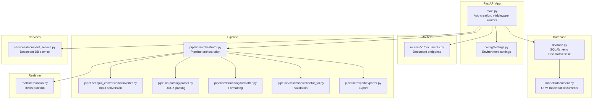
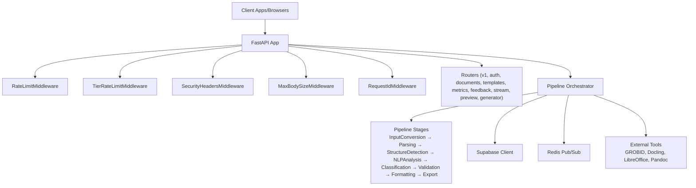
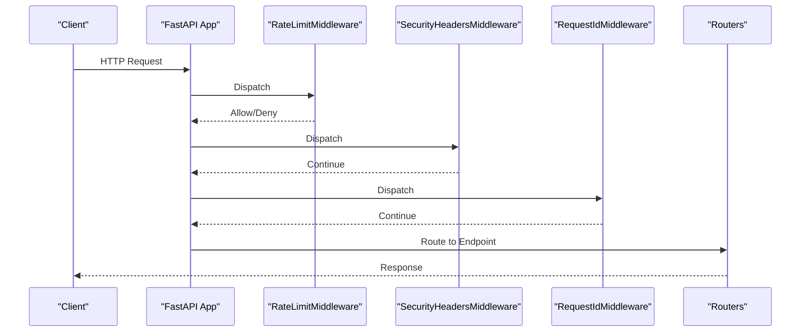
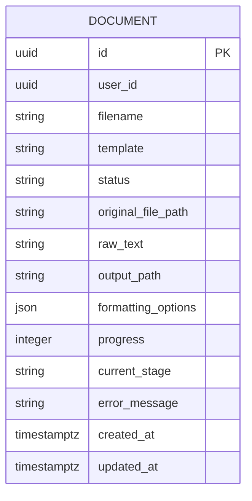
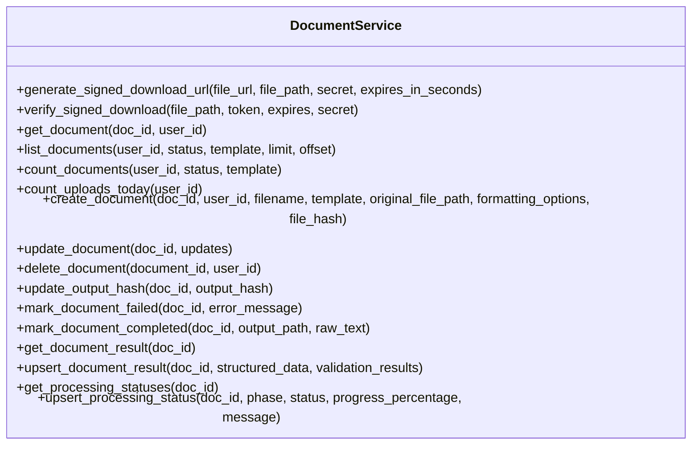
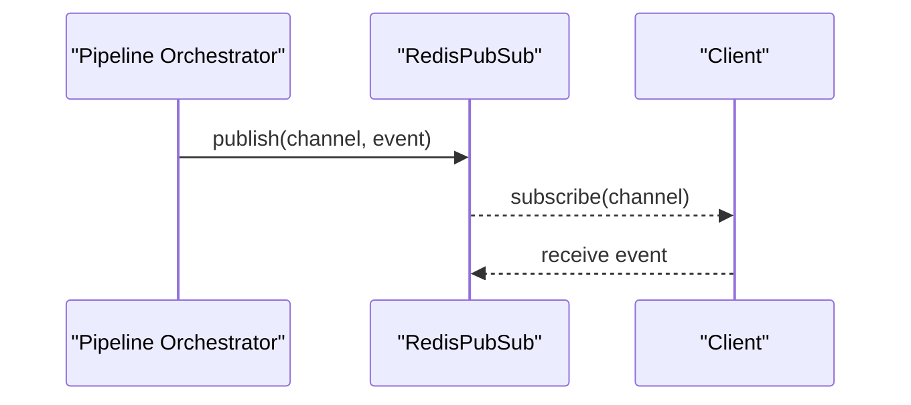
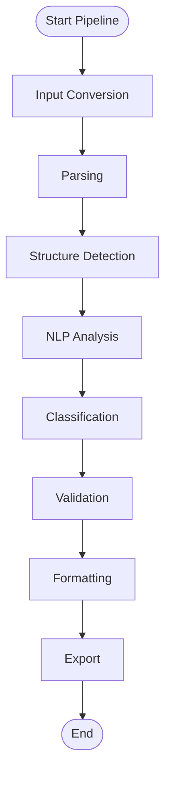
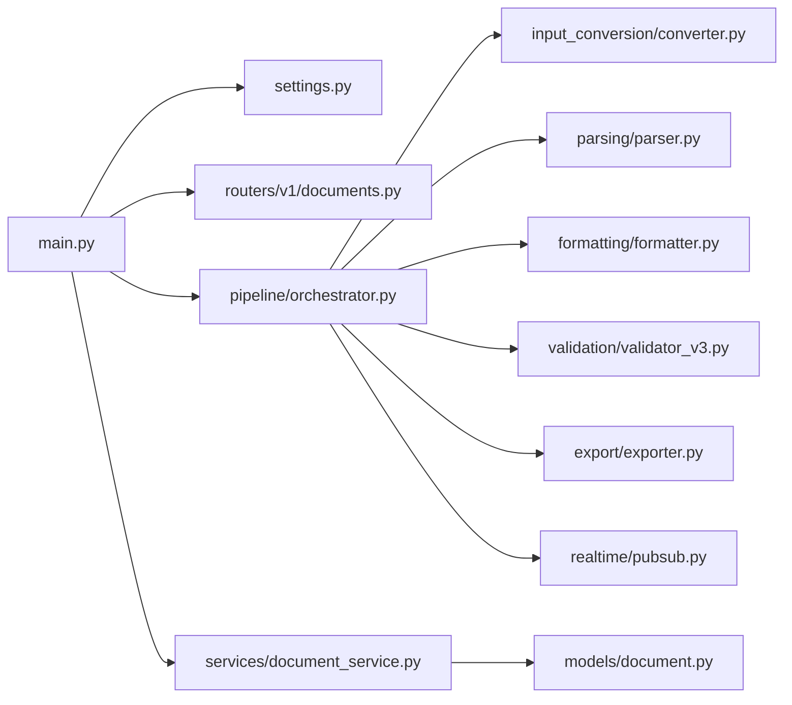

# Backend Development

<cite>
**Referenced Files in This Document**
- [main.py](file://backend/app/main.py)
- [settings.py](file://backend/app/config/settings.py)
- [base.py](file://backend/app/db/base.py)
- [document.py](file://backend/app/models/document.py)
- [documents.py](file://backend/app/routers/v1/documents.py)
- [pubsub.py](file://backend/app/realtime/pubsub.py)
- [converter.py](file://backend/app/pipeline/input_conversion/converter.py)
- [parser.py](file://backend/app/pipeline/parsing/parser.py)
- [formatter.py](file://backend/app/pipeline/formatting/formatter.py)
- [validator_v3.py](file://backend/app/pipeline/validation/validator_v3.py)
- [exporter.py](file://backend/app/pipeline/export/exporter.py)
- [orchestrator.py](file://backend/app/pipeline/orchestrator.py)
- [rate_limit.py](file://backend/app/middleware/rate_limit.py)
- [document_service.py](file://backend/app/services/document_service.py)
</cite>

## Table of Contents
1. [Introduction](#introduction)
2. [Project Structure](#project-structure)
3. [Core Components](#core-components)
4. [Architecture Overview](#architecture-overview)
5. [Detailed Component Analysis](#detailed-component-analysis)
6. [Dependency Analysis](#dependency-analysis)
7. [Performance Considerations](#performance-considerations)
8. [Troubleshooting Guide](#troubleshooting-guide)
9. [Conclusion](#conclusion)
10. [Appendices](#appendices)

## Introduction
This document provides comprehensive backend development guidance for the FastAPI application powering the automated academic manuscript formatter. It covers application structure, middleware configuration, routing organization, service layer architecture, database design with SQLAlchemy ORM, authentication and authorization, real-time communication via Redis pub/sub, and the 12-stage pipeline processing system. It also includes development workflows, testing strategies, deployment considerations, performance optimization, error handling, and security best practices.

## Project Structure
The backend is organized around a FastAPI application with layered concerns:
- Application entrypoint and middleware registration
- Configuration and environment settings
- Database layer with SQLAlchemy 2.x ORM base
- Models representing database entities
- Routers exposing API endpoints
- Pipeline orchestration and modular processing stages
- Real-time pub/sub for status updates
- Services for domain logic and persistence
- Middleware for rate limiting, security, and observability

**Diagram sources**
- [main.py:263-383](file://backend/app/main.py#L263-L383)
- [settings.py:72-422](file://backend/app/config/settings.py#L72-L422)
- [base.py:11-20](file://backend/app/db/base.py#L11-L20)
- [document.py:6-26](file://backend/app/models/document.py#L6-L26)
- [documents.py:29-359](file://backend/app/routers/v1/documents.py#L29-L359)
- [orchestrator.py:73-545](file://backend/app/pipeline/orchestrator.py#L73-L545)
- [converter.py:19-106](file://backend/app/pipeline/input_conversion/converter.py#L19-L106)
- [parser.py:61-165](file://backend/app/pipeline/parsing/parser.py#L61-L165)
- [formatter.py:35-80](file://backend/app/pipeline/formatting/formatter.py#L35-L80)
- [validator_v3.py:34-146](file://backend/app/pipeline/validation/validator_v3.py#L34-L146)
- [exporter.py:19-67](file://backend/app/pipeline/export/exporter.py#L19-L67)
- [pubsub.py:18-120](file://backend/app/realtime/pubsub.py#L18-L120)
- [document_service.py:34-114](file://backend/app/services/document_service.py#L34-L114)

**Section sources**
- [main.py:263-383](file://backend/app/main.py#L263-L383)
- [settings.py:72-422](file://backend/app/config/settings.py#L72-L422)

## Core Components
- Application entrypoint initializes logging, Sentry, Prometheus metrics, CORS, rate limiting, security headers, HTTPS redirect, request ID, audit logging, and registers routers for v1, auth, documents, templates, metrics, feedback, stream, preview, and generator.
- Configuration loads environment variables with strict validation and boolean parsing helpers.
- Database ORM base and document model define schema and relationships.
- Document service encapsulates Supabase-py operations for CRUD and status/result management.
- Pipeline orchestrator coordinates 12-stage processing with timeouts, retries, concurrency control, and real-time updates.
- Real-time pub/sub provides distributed status broadcasting with Redis and in-memory fallback.
- Middleware stack includes rate limiting, tiered rate limiting, security headers, max body size, and request ID.

**Section sources**
- [main.py:1-383](file://backend/app/main.py#L1-L383)
- [settings.py:72-422](file://backend/app/config/settings.py#L72-L422)
- [base.py:11-20](file://backend/app/db/base.py#L11-L20)
- [document.py:6-26](file://backend/app/models/document.py#L6-L26)
- [document_service.py:34-114](file://backend/app/services/document_service.py#L34-L114)
- [orchestrator.py:73-545](file://backend/app/pipeline/orchestrator.py#L73-L545)
- [pubsub.py:18-120](file://backend/app/realtime/pubsub.py#L18-L120)
- [rate_limit.py:49-172](file://backend/app/middleware/rate_limit.py#L49-L172)

## Architecture Overview
The backend follows a layered architecture:
- Presentation: FastAPI routers expose REST endpoints.
- Application: Pipeline orchestrator coordinates processing stages.
- Domain Services: Document service manages persistence and auxiliary operations.
- Infrastructure: Redis pub/sub, Supabase client, external tool integrations (GROBID, Docling, LibreOffice, Pandoc).
- Data: SQLAlchemy ORM base and Supabase-py client for persistence.

**Diagram sources**
- [main.py:294-359](file://backend/app/main.py#L294-L359)
- [orchestrator.py:73-545](file://backend/app/pipeline/orchestrator.py#L73-L545)
- [pubsub.py:18-120](file://backend/app/realtime/pubsub.py#L18-L120)
- [document_service.py:34-114](file://backend/app/services/document_service.py#L34-L114)

## Detailed Component Analysis

### Application Entry and Middleware
- Initializes structured logging, Sentry, Prometheus metrics, CORS, rate limiting, security headers, HTTPS redirect, request ID, audit logging, router inclusion, and health/readiness endpoints.
- Configures Redis-backed rate limiting with in-memory fallback and sliding window semantics.
- Includes Prometheus metrics exposure and readiness/health endpoints.

**Diagram sources**
- [main.py:294-359](file://backend/app/main.py#L294-L359)
- [rate_limit.py:49-172](file://backend/app/middleware/rate_limit.py#L49-L172)

**Section sources**
- [main.py:294-359](file://backend/app/main.py#L294-L359)
- [rate_limit.py:49-172](file://backend/app/middleware/rate_limit.py#L49-L172)

### Configuration and Environment Settings
- Centralized settings loading with validation, boolean parsing helpers, and environment normalization.
- Defines security, upload limits, deployment flags, enhancement toggles, external tool endpoints, Redis/Celery integration, cache TTLs, and pipeline tuning parameters.

**Section sources**
- [settings.py:72-422](file://backend/app/config/settings.py#L72-L422)

### Database Design with SQLAlchemy ORM
- Declarative base class for all ORM models.
- Document model defines schema fields including UUID primary key, user association, filename, template, status, paths, formatting options, progress, stage, error message, and timestamps.

**Diagram sources**
- [base.py:11-20](file://backend/app/db/base.py#L11-L20)
- [document.py:6-26](file://backend/app/models/document.py#L6-L26)

**Section sources**
- [base.py:11-20](file://backend/app/db/base.py#L11-L20)
- [document.py:6-26](file://backend/app/models/document.py#L6-L26)

### Service Layer Architecture
- Document service encapsulates Supabase-py operations for document lifecycle management, including creation, updates, deletion, status/result retrieval/upsert, and signed URL generation/verification.
- Provides backward-compatible handling for optional schema columns (file hash, output hash) with graceful degradation.

**Diagram sources**
- [document_service.py:34-560](file://backend/app/services/document_service.py#L34-L560)

**Section sources**
- [document_service.py:34-560](file://backend/app/services/document_service.py#L34-L560)

### Routing Organization
- v1 documents router exposes endpoints for chunked upload, listing, uploading, status, summary, editing, preview, comparison, download, and deletion.
- Endpoints delegate to legacy documents handler with envelope wrapping and error code mapping.

**Section sources**
- [documents.py:29-359](file://backend/app/routers/v1/documents.py#L29-L359)

### Real-Time Communication via Redis Pub/Sub
- RedisPubSub provides async publish/subscribe with Redis-backed client and in-memory fallback.
- Orchestrator emits status updates to clients via SSE/event emission.

**Diagram sources**
- [orchestrator.py:115-166](file://backend/app/pipeline/orchestrator.py#L115-L166)
- [pubsub.py:18-120](file://backend/app/realtime/pubsub.py#L18-L120)

**Section sources**
- [pubsub.py:18-120](file://backend/app/realtime/pubsub.py#L18-L120)
- [orchestrator.py:115-166](file://backend/app/pipeline/orchestrator.py#L115-L166)

### 12-Stage Pipeline Processing System
The pipeline orchestrator coordinates the following stages:
1. Input conversion: Normalize input formats to DOCX using LibreOffice/Pandoc, with OCR fallback for scanned PDFs.
2. Parsing: Extract blocks, figures, tables, equations from DOCX preserving order and metadata.
3. Structure detection: Identify headings/sections using heuristics and contracts.
4. NLP analysis: Optional semantic parsing with confidence scores.
5. Classification: Assign block types and confidence.
6. Validation: Structural completeness, figure/table/caption checks, reference integrity, and HITL review triggers.
7. Formatting: Apply template-driven rendering, numbering, references, and layout options.
8. Export: Save DOCX and generate JSON/Markdown/HTML/LaTeX/JATS/PDF.

**Diagram sources**
- [orchestrator.py:522-545](file://backend/app/pipeline/orchestrator.py#L522-L545)
- [converter.py:19-106](file://backend/app/pipeline/input_conversion/converter.py#L19-L106)
- [parser.py:61-165](file://backend/app/pipeline/parsing/parser.py#L61-L165)
- [formatter.py:35-80](file://backend/app/pipeline/formatting/formatter.py#L35-L80)
- [validator_v3.py:34-146](file://backend/app/pipeline/validation/validator_v3.py#L34-L146)
- [exporter.py:19-67](file://backend/app/pipeline/export/exporter.py#L19-L67)

**Section sources**
- [orchestrator.py:522-545](file://backend/app/pipeline/orchestrator.py#L522-L545)
- [converter.py:19-106](file://backend/app/pipeline/input_conversion/converter.py#L19-L106)
- [parser.py:61-165](file://backend/app/pipeline/parsing/parser.py#L61-L165)
- [formatter.py:35-80](file://backend/app/pipeline/formatting/formatter.py#L35-L80)
- [validator_v3.py:34-146](file://backend/app/pipeline/validation/validator_v3.py#L34-L146)
- [exporter.py:19-67](file://backend/app/pipeline/export/exporter.py#L19-L67)

## Dependency Analysis
- FastAPI app depends on configuration, middleware, routers, and pipeline orchestrator.
- Pipeline orchestrator depends on parsing, normalization, structure detection, NLP, classification, validation, formatting, export, and external tool clients.
- Real-time pub/sub integrates with orchestrator for status updates.
- Document service depends on Supabase client for persistence.

**Diagram sources**
- [main.py:263-383](file://backend/app/main.py#L263-L383)
- [settings.py:72-422](file://backend/app/config/settings.py#L72-L422)
- [documents.py:29-359](file://backend/app/routers/v1/documents.py#L29-L359)
- [orchestrator.py:73-545](file://backend/app/pipeline/orchestrator.py#L73-L545)
- [converter.py:19-106](file://backend/app/pipeline/input_conversion/converter.py#L19-L106)
- [parser.py:61-165](file://backend/app/pipeline/parsing/parser.py#L61-L165)
- [formatter.py:35-80](file://backend/app/pipeline/formatting/formatter.py#L35-L80)
- [validator_v3.py:34-146](file://backend/app/pipeline/validation/validator_v3.py#L34-L146)
- [exporter.py:19-67](file://backend/app/pipeline/export/exporter.py#L19-L67)
- [pubsub.py:18-120](file://backend/app/realtime/pubsub.py#L18-L120)
- [document_service.py:34-114](file://backend/app/services/document_service.py#L34-L114)
- [document.py:6-26](file://backend/app/models/document.py#L6-L26)

**Section sources**
- [main.py:263-383](file://backend/app/main.py#L263-L383)
- [orchestrator.py:73-545](file://backend/app/pipeline/orchestrator.py#L73-L545)

## Performance Considerations
- Concurrency control: Semaphore limits concurrent pipeline jobs to prevent OOM.
- Timeouts: Stage-specific timeouts and thread pool execution guard against slow stages.
- Caching: Redis-backed rate limiting and configurable cache TTLs for health/readiness and LLM caches.
- Lazy initialization: AI model preloading controlled by flags; optional for low-memory deployments.
- External tool timeouts: Configurable timeouts for GROBID/Docling to bound latency.
- File cleanup: Periodic cleanup of old uploads with retention policy.

**Section sources**
- [orchestrator.py:68-72](file://backend/app/pipeline/orchestrator.py#L68-L72)
- [settings.py:380-414](file://backend/app/config/settings.py#L380-L414)
- [main.py:106-148](file://backend/app/main.py#L106-L148)

## Troubleshooting Guide
- Health and readiness: Use /health and /ready endpoints to verify DB, AI models, and external services availability.
- Audit logging: Middleware writes audit logs for HTTP write operations.
- Error handling: Pipeline stages wrapped with safe execution to degrade gracefully; validation results include errors/warnings; exporters log failures.
- Rate limiting: Inspect middleware counters and Redis keys for rate limit violations.
- Redis pub/sub: Fallback to in-memory queues when Redis unavailable; monitor warnings.

**Section sources**
- [main.py:360-381](file://backend/app/main.py#L360-L381)
- [document_service.py:395-441](file://backend/app/services/document_service.py#L395-L441)
- [validator_v3.py:68-146](file://backend/app/pipeline/validation/validator_v3.py#L68-L146)
- [exporter.py:76-171](file://backend/app/pipeline/export/exporter.py#L76-L171)
- [rate_limit.py:124-172](file://backend/app/middleware/rate_limit.py#L124-L172)
- [pubsub.py:45-71](file://backend/app/realtime/pubsub.py#L45-L71)

## Conclusion
The backend leverages FastAPI with a modular pipeline architecture, robust middleware for security and observability, and a service-layer abstraction over Supabase for persistence. The 12-stage pipeline integrates external tools and real-time pub/sub for responsive user feedback. Configuration-driven flags enable performance tuning and feature toggles for reliability and scalability.

## Appendices

### Development Workflows
- Local setup: Install Python 3.12, configure .env from settings, install dependencies, run uvicorn with lifespan hooks.
- Testing: Use pytest with fixtures and integration tests; leverage test commands and manual verification scripts.
- Linting/formatting: Configure ruff/pyright/mypy as per project files.

**Section sources**
- [settings.py:72-422](file://backend/app/config/settings.py#L72-L422)
- [pyproject.toml:1-9](file://backend/pyproject.toml#L1-L9)

### Testing Strategies
- Unit tests for pipeline stages, validators, exporters, and services.
- Integration tests for external tools (GROBID, Docling, CrossRef).
- Manual verification scripts for visual outputs and pipeline phases.

**Section sources**
- [tests/](file://backend/tests/)
- [manual_tests/](file://backend/manual_tests/)

### Deployment Considerations
- Containerization: Use provided Dockerfile/docker-compose with Grafana/Prometheus dashboards.
- Environment variables: Ensure all required settings are configured (Supabase, Redis, external tool endpoints).
- Health/readiness probes: Use /health and /ready endpoints for orchestrators.
- Security: Enforce HTTPS/HSTS, configure CORS, and apply rate limiting tiers.

**Section sources**
- [main.py:303-314](file://backend/app/main.py#L303-L314)
- [docker/](file://backend/docker/)
- [ops/](file://backend/ops/)