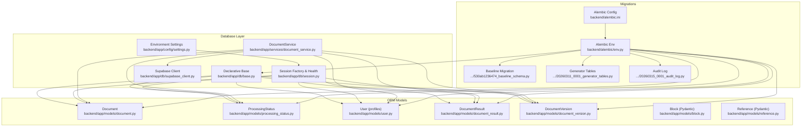
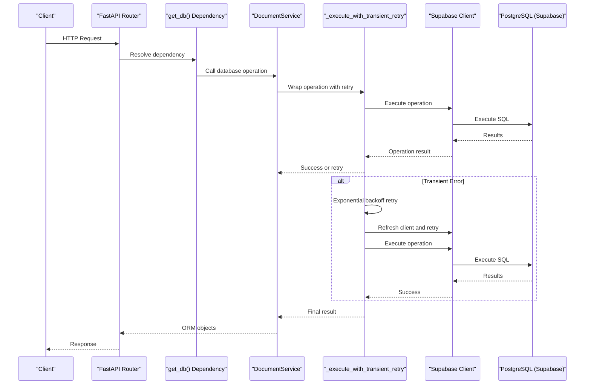
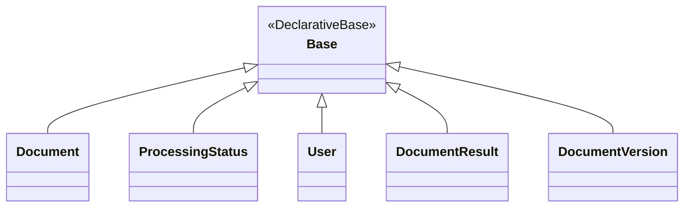
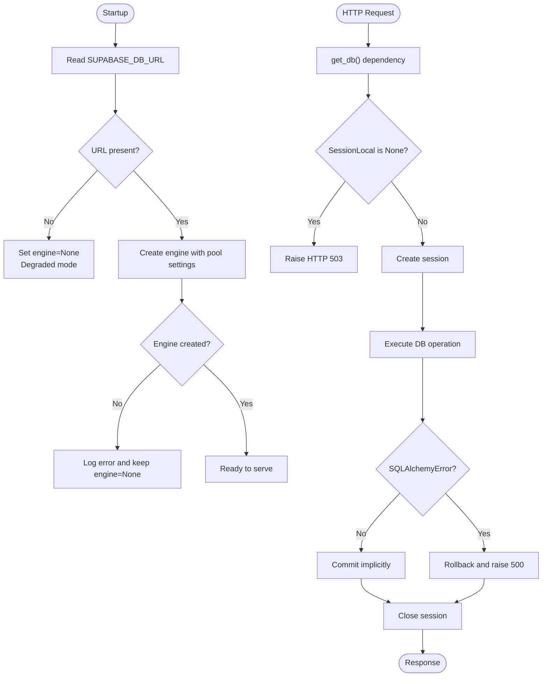
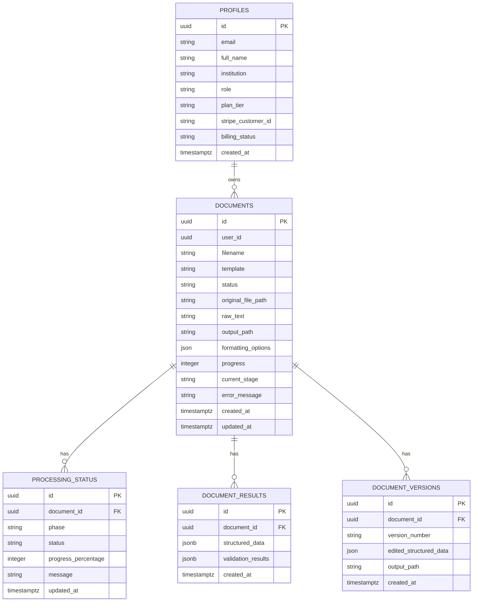
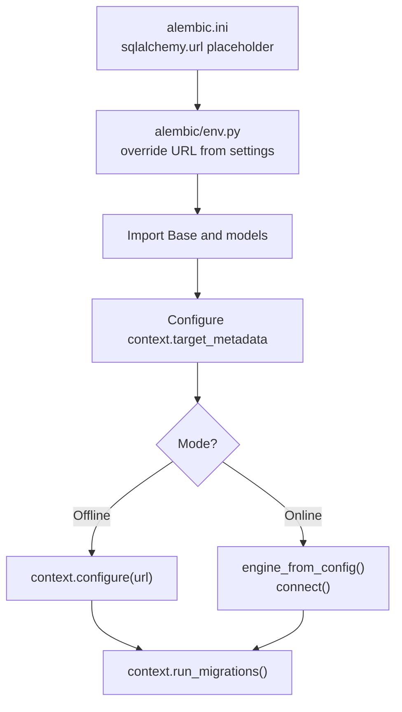
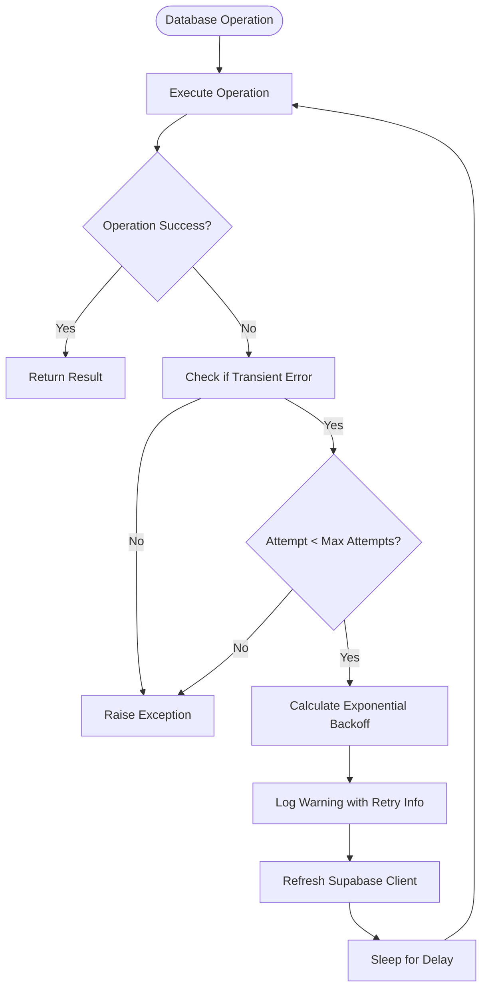
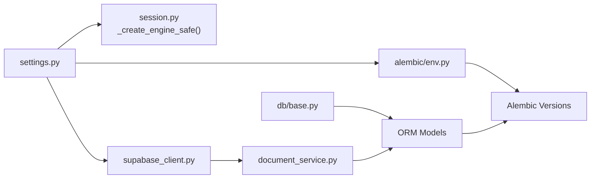

# Database & ORM Design

<cite>
**Referenced Files in This Document**
- [base.py](file://backend/app/db/base.py)
- [session.py](file://backend/app/db/session.py)
- [settings.py](file://backend/app/config/settings.py)
- [env.py](file://backend/alembic/env.py)
- [alembic.ini](file://backend/alembic.ini)
- [document.py](file://backend/app/models/document.py)
- [processing_status.py](file://backend/app/models/processing_status.py)
- [user.py](file://backend/app/models/user.py)
- [document_result.py](file://backend/app/models/document_result.py)
- [document_version.py](file://backend/app/models/document_version.py)
- [block.py](file://backend/app/models/block.py)
- [reference.py](file://backend/app/models/reference.py)
- [document_service.py](file://backend/app/services/document_service.py)
- [supabase_client.py](file://backend/app/db/supabase_client.py)
- [530ab1236474_baseline_schema.py](file://backend/alembic/versions/530ab1236474_baseline_schema.py)
- [20260311_0001_generator_tables.py](file://backend/alembic/versions/20260311_0001_generator_tables.py)
- [20260315_0001_audit_log.py](file://backend/alembic/versions/20260315_0001_audit_log.py)
</cite>

## Update Summary
**Changes Made**
- Added comprehensive documentation for centralized retry logic in DocumentService
- Updated database operations section to include retry mechanisms
- Enhanced error handling and resilience documentation
- Added retry strategy details for transient database errors
- Updated architecture overview to reflect improved reliability patterns

## Table of Contents
1. [Introduction](#introduction)
2. [Project Structure](#project-structure)
3. [Core Components](#core-components)
4. [Architecture Overview](#architecture-overview)
5. [Detailed Component Analysis](#detailed-component-analysis)
6. [Retry Logic and Error Handling](#retry-logic-and-error-handling)
7. [Dependency Analysis](#dependency-analysis)
8. [Performance Considerations](#performance-considerations)
9. [Troubleshooting Guide](#troubleshooting-guide)
10. [Conclusion](#conclusion)
11. [Appendices](#appendices)

## Introduction
This document explains the database design and SQLAlchemy ORM implementation for the backend. It covers entity models for Documents, Blocks, References, Users, and Processing Status, along with session management, connection pooling, transactions, Alembic migrations, schema evolution, data integrity constraints, performance optimization, and operational procedures. The system now includes centralized retry logic for enhanced reliability and resilience against transient database errors.

## Project Structure
The database layer is organized around a shared declarative base, a session factory integrated with FastAPI, and a set of SQLAlchemy models. Alembic manages schema evolution, while configuration is driven by environment variables. The system now includes a centralized DocumentService with robust retry mechanisms for database operations.

**Diagram sources**
- [base.py:11-20](file://backend/app/db/base.py#L11-L20)
- [session.py:30-74](file://backend/app/db/session.py#L30-L74)
- [settings.py:72-82](file://backend/app/config/settings.py#L72-L82)
- [document.py:6-26](file://backend/app/models/document.py#L6-L26)
- [processing_status.py:5-15](file://backend/app/models/processing_status.py#L5-L15)
- [user.py:6-20](file://backend/app/models/user.py#L6-L20)
- [document_result.py:5-13](file://backend/app/models/document_result.py#L5-L13)
- [document_version.py:5-14](file://backend/app/models/document_version.py#L5-L14)
- [block.py:86-209](file://backend/app/models/block.py#L86-L209)
- [reference.py:38-238](file://backend/app/models/reference.py#L38-L238)
- [document_service.py:34-98](file://backend/app/services/document_service.py#L34-L98)
- [supabase_client.py:85-104](file://backend/app/db/supabase_client.py#L85-L104)
- [env.py:14-31](file://backend/alembic/env.py#L14-L31)
- [alembic.ini:84-87](file://backend/alembic.ini#L84-L87)
- [530ab1236474_baseline_schema.py:25-32](file://backend/alembic/versions/530ab1236474_baseline_schema.py#L25-L32)
- [20260311_0001_generator_tables.py:22-74](file://backend/alembic/versions/20260311_0001_generator_tables.py#L22-L74)
- [20260315_0001_audit_log.py:22-41](file://backend/alembic/versions/20260315_0001_audit_log.py#L22-L41)

**Section sources**
- [base.py:11-20](file://backend/app/db/base.py#L11-L20)
- [session.py:30-74](file://backend/app/db/session.py#L30-L74)
- [settings.py:72-82](file://backend/app/config/settings.py#L72-L82)
- [env.py:14-31](file://backend/alembic/env.py#L14-L31)
- [alembic.ini:84-87](file://backend/alembic.ini#L84-L87)

## Core Components
- Declarative Base: Centralized model base using SQLAlchemy's modern DeclarativeBase for forward compatibility.
- Session Factory: Creates a scoped sessionmaker bound to an optional engine; provides a FastAPI dependency and health checks.
- Environment Settings: Supplies the database URL and other runtime configuration.
- Models: SQLAlchemy ORM classes for Documents, ProcessingStatus, User profiles, DocumentResult, and DocumentVersion; Pydantic models for Block and Reference used in pipeline data structures.
- DocumentService: Centralized service layer with built-in retry logic for database operations using Supabase client.

Key implementation references:
- Declarative Base: [base.py:11-20](file://backend/app/db/base.py#L11-L20)
- Engine and Session Factory: [session.py:30-74](file://backend/app/db/session.py#L30-L74)
- FastAPI dependency and error handling: [session.py:79-112](file://backend/app/db/session.py#L79-L112)
- Settings for database URL: [settings.py:72-82](file://backend/app/config/settings.py#L72-L82)
- Document model: [document.py:6-26](file://backend/app/models/document.py#L6-L26)
- ProcessingStatus model: [processing_status.py:5-15](file://backend/app/models/processing_status.py#L5-L15)
- User model: [user.py:6-20](file://backend/app/models/user.py#L6-L20)
- DocumentResult model: [document_result.py:5-13](file://backend/app/models/document_result.py#L5-L13)
- DocumentVersion model: [document_version.py:5-14](file://backend/app/models/document_version.py#L5-L14)
- DocumentService with retry logic: [document_service.py:34-98](file://backend/app/services/document_service.py#L34-L98)

**Section sources**
- [base.py:11-20](file://backend/app/db/base.py#L11-L20)
- [session.py:30-74](file://backend/app/db/session.py#L30-L74)
- [session.py:79-112](file://backend/app/db/session.py#L79-L112)
- [settings.py:72-82](file://backend/app/config/settings.py#L72-L82)
- [document.py:6-26](file://backend/app/models/document.py#L6-L26)
- [processing_status.py:5-15](file://backend/app/models/processing_status.py#L5-L15)
- [user.py:6-20](file://backend/app/models/user.py#L6-L20)
- [document_result.py:5-13](file://backend/app/models/document_result.py#L5-L13)
- [document_version.py:5-14](file://backend/app/models/document_version.py#L5-L14)
- [document_service.py:34-98](file://backend/app/services/document_service.py#L34-L98)

## Architecture Overview
The backend uses SQLAlchemy ORM with a shared Base, a configurable engine, and a session factory. Alembic manages schema evolution. The application reads the database URL from environment settings and creates the engine accordingly. Sessions are injected via a FastAPI dependency and automatically closed after requests. Health checks verify connectivity. The system now includes centralized retry logic in DocumentService for enhanced reliability.

**Diagram sources**
- [session.py:79-112](file://backend/app/db/session.py#L79-L112)
- [document_service.py:66-98](file://backend/app/services/document_service.py#L66-L98)
- [supabase_client.py:85-104](file://backend/app/db/supabase_client.py#L85-L104)

**Section sources**
- [session.py:79-112](file://backend/app/db/session.py#L79-L112)
- [document_service.py:66-98](file://backend/app/services/document_service.py#L66-L98)
- [supabase_client.py:85-104](file://backend/app/db/supabase_client.py#L85-L104)

## Detailed Component Analysis

### Declarative Base and Configuration
- Base class extends SQLAlchemy's DeclarativeBase for modern 2.x compatibility.
- Alembic env imports Base and all models to populate metadata for migrations.
- Alembic configuration reads the database URL from settings and applies it at runtime.

**Diagram sources**
- [base.py:11-20](file://backend/app/db/base.py#L11-L20)
- [document.py:6-26](file://backend/app/models/document.py#L6-L26)
- [processing_status.py:5-15](file://backend/app/models/processing_status.py#L5-L15)
- [user.py:6-20](file://backend/app/models/user.py#L6-L20)
- [document_result.py:5-13](file://backend/app/models/document_result.py#L5-L13)
- [document_version.py:5-14](file://backend/app/models/document_version.py#L5-L14)

**Section sources**
- [base.py:11-20](file://backend/app/db/base.py#L11-L20)
- [env.py:14-31](file://backend/alembic/env.py#L14-L31)
- [alembic.ini:84-87](file://backend/alembic.ini#L84-L87)

### Session Management, Connection Pooling, and Transactions
- Engine creation is guarded: if the database URL is missing, the engine is None and the app operates in degraded mode.
- Connection pool tuned for cloud Postgres (Supabase): pool_size, max_overflow, pool_timeout, pool_recycle, and pool_pre_ping.
- FastAPI dependency yields a session per request, rolls back on SQLAlchemy errors, and closes the session in a finally block.
- Health check executes a simple SELECT to verify connectivity.

**Diagram sources**
- [session.py:30-74](file://backend/app/db/session.py#L30-L74)
- [session.py:79-112](file://backend/app/db/session.py#L79-L112)
- [session.py:116-130](file://backend/app/db/session.py#L116-L130)

**Section sources**
- [session.py:30-74](file://backend/app/db/session.py#L30-L74)
- [session.py:79-112](file://backend/app/db/session.py#L79-L112)
- [session.py:116-130](file://backend/app/db/session.py#L116-L130)

### Entity Relationship Models

#### Document
- UUID primary key with server-generated default.
- user_id indexed (conceptual foreign key to auth.users managed by Supabase).
- Status and job state fields track progress and current stage.
- Timestamps for created/updated.

**Section sources**
- [document.py:6-26](file://backend/app/models/document.py#L6-L26)

#### ProcessingStatus
- Tracks per-document processing phases with status and progress.
- Foreign key to Document with index for efficient lookups.

**Section sources**
- [processing_status.py:5-15](file://backend/app/models/processing_status.py#L5-L15)

#### User (profiles)
- Profile table aliased as "profiles" with UUID primary key.
- Indexed email and role fields; Stripe billing fields included.

**Section sources**
- [user.py:6-20](file://backend/app/models/user.py#L6-L20)

#### DocumentResult
- JSONB fields for structured data and validation results.
- Foreign key to Document with index.

**Section sources**
- [document_result.py:5-13](file://backend/app/models/document_result.py#L5-L13)

#### DocumentVersion
- Snapshots of document versions with output paths and edited structured data.
- Foreign key to Document with index.

**Section sources**
- [document_version.py:5-14](file://backend/app/models/document_version.py#L5-L14)

#### Block and Reference (Pydantic)
- Block: A Pydantic model representing pipeline blocks with typed enums and metadata.
- Reference: A Pydantic model representing structured references with typed enums and citation tracking.

Note: These are Pydantic models and are not mapped as SQLAlchemy ORM entities in the provided files.

**Section sources**
- [block.py:86-209](file://backend/app/models/block.py#L86-L209)
- [reference.py:38-238](file://backend/app/models/reference.py#L38-L238)

### Relationship Mappings and Inheritance Patterns
- All ORM models inherit from the shared Base class.
- Relationships are declared via ForeignKey constraints on Document-related tables (ProcessingStatus, DocumentResult, DocumentVersion).
- There is no explicit ORM relationship attribute code in the provided files; foreign keys and indexes are used to enforce referential integrity at the database level.

**Diagram sources**
- [document.py:6-26](file://backend/app/models/document.py#L6-L26)
- [processing_status.py:5-15](file://backend/app/models/processing_status.py#L5-L15)
- [document_result.py:5-13](file://backend/app/models/document_result.py#L5-L13)
- [document_version.py:5-14](file://backend/app/models/document_version.py#L5-L14)
- [user.py:6-20](file://backend/app/models/user.py#L6-L20)

**Section sources**
- [document.py:6-26](file://backend/app/models/document.py#L6-L26)
- [processing_status.py:5-15](file://backend/app/models/processing_status.py#L5-L15)
- [document_result.py:5-13](file://backend/app/models/document_result.py#L5-L13)
- [document_version.py:5-14](file://backend/app/models/document_version.py#L5-L14)
- [user.py:6-20](file://backend/app/models/user.py#L6-L20)

### Alembic Migration System and Schema Evolution
- Alembic env imports settings and Base, and imports all models to populate metadata.
- The configuration reads the database URL from settings and applies it for online/offline migrations.
- Baseline migration intentionally does nothing to maintain revision history compatibility.
- Subsequent migrations introduce generator sessions, messages, documents, and audit logs with appropriate indexes and foreign keys.

**Diagram sources**
- [alembic.ini:84-87](file://backend/alembic.ini#L84-L87)
- [env.py:51-87](file://backend/alembic/env.py#L51-L87)

**Section sources**
- [env.py:14-31](file://backend/alembic/env.py#L14-L31)
- [env.py:51-87](file://backend/alembic/env.py#L51-L87)
- [alembic.ini:84-87](file://backend/alembic.ini#L84-L87)
- [530ab1236474_baseline_schema.py:25-32](file://backend/alembic/versions/530ab1236474_baseline_schema.py#L25-L32)
- [20260311_0001_generator_tables.py:22-74](file://backend/alembic/versions/20260311_0001_generator_tables.py#L22-L74)
- [20260315_0001_audit_log.py:22-41](file://backend/alembic/versions/20260315_0001_audit_log.py#L22-L41)

## Retry Logic and Error Handling

### Centralized Retry Mechanism
The DocumentService now includes a comprehensive retry mechanism designed to handle transient database errors gracefully. This centralized approach ensures consistent error handling across all database operations.

#### Retry Strategy Details
- **Exponential Backoff**: Implements 0.15 * (2^(attempt-1)) delay between retries
- **Maximum Attempts**: Defaults to 3 attempts per operation
- **Transient Error Detection**: Identifies network timeouts, connection resets, and protocol errors
- **Client Refresh**: Automatically refreshes the Supabase client on retry to address stale connections

#### Error Detection Logic
The system identifies transient errors through two mechanisms:
1. **Exception Type Checking**: Recognizes specific exception classes like RemoteProtocolError, ConnectError, ReadTimeout, WriteTimeout
2. **Message Pattern Matching**: Searches for error messages containing patterns like "remoteprotocolerror", "server disconnected", "connection reset", "read timed out", etc.

#### Implementation Pattern
All database operations are wrapped with the `_execute_with_transient_retry` method, which:
- Executes the operation within a try-catch block
- Detects transient errors and determines retry eligibility
- Applies exponential backoff with jitter
- Refreshes the Supabase client to address connection pool issues
- Logs detailed retry information for debugging

**Diagram sources**
- [document_service.py:66-98](file://backend/app/services/document_service.py#L66-L98)

**Section sources**
- [document_service.py:34-98](file://backend/app/services/document_service.py#L34-L98)
- [document_service.py:66-98](file://backend/app/services/document_service.py#L66-L98)
- [supabase_client.py:85-104](file://backend/app/db/supabase_client.py#L85-L104)

## Dependency Analysis
- Runtime configuration dependency: settings supply the database URL used by the engine factory and Supabase client.
- Alembic dependency: env imports settings and Base; migrations depend on env configuration.
- Model dependency: all ORM models depend on Base; Alembic env imports all models to populate metadata.
- Service dependency: DocumentService depends on Supabase client for database operations.

**Diagram sources**
- [settings.py:72-82](file://backend/app/config/settings.py#L72-L82)
- [session.py:30-64](file://backend/app/db/session.py#L30-L64)
- [base.py:11-20](file://backend/app/db/base.py#L11-L20)
- [env.py:14-31](file://backend/alembic/env.py#L14-L31)
- [supabase_client.py:85-104](file://backend/app/db/supabase_client.py#L85-L104)
- [document_service.py:34-98](file://backend/app/services/document_service.py#L34-L98)

**Section sources**
- [settings.py:72-82](file://backend/app/config/settings.py#L72-L82)
- [session.py:30-64](file://backend/app/db/session.py#L30-L64)
- [env.py:14-31](file://backend/alembic/env.py#L14-L31)
- [supabase_client.py:85-104](file://backend/app/db/supabase_client.py#L85-L104)
- [document_service.py:34-98](file://backend/app/services/document_service.py#L34-L98)

## Performance Considerations
- Connection pooling tuned for cloud Postgres:
  - pool_size, max_overflow, pool_timeout, pool_recycle, pool_pre_ping configured in the engine factory.
- Indexes on foreign keys and frequently queried columns:
  - Document.user_id, ProcessingStatus.document_id, DocumentResult.document_id, DocumentVersion.document_id.
- JSON/JSONB fields for semi-structured data reduce joins and enable flexible storage.
- Health checks and pre-ping help avoid stale connections after idle periods.
- **Enhanced Reliability**: Centralized retry logic reduces operational overhead from transient failures.
- **Automatic Client Recovery**: Supabase client refresh addresses connection pool exhaustion issues.

Recommendations (general guidance):
- Use pagination for large result sets.
- Prefer selective column queries and limit joins.
- Monitor slow queries and add targeted indexes as needed.
- Consider connection limits aligned with upstream provider constraints.
- **Leverage Retry Logic**: Operations automatically benefit from exponential backoff retry mechanisms.

**Section sources**
- [session.py:46-55](file://backend/app/db/session.py#L46-L55)
- [document.py:10-10](file://backend/app/models/document.py#L10-L10)
- [processing_status.py:9-9](file://backend/app/models/processing_status.py#L9-L9)
- [document_result.py:9-9](file://backend/app/models/document_result.py#L9-L9)
- [document_version.py:9-9](file://backend/app/models/document_version.py#L9-L9)
- [document_service.py:66-98](file://backend/app/services/document_service.py#L66-L98)

## Troubleshooting Guide
- Unconfigured database URL:
  - Symptom: HTTP 503 responses for DB-dependent endpoints; server does not crash.
  - Resolution: Set SUPABASE_DB_URL and SUPABASE_SERVICE_ROLE_KEY in environment.
- Operational errors during requests:
  - Symptom: HTTP 500 with automatic rollback.
  - Resolution: Inspect logs; verify credentials and network connectivity.
- Health endpoint failures:
  - Symptom: Unhealthy status with details.
  - Resolution: Confirm database availability and credentials.
- **Transient Error Failures**:
  - Symptom: Database operations occasionally fail with network-related errors.
  - Resolution: The retry mechanism automatically handles these failures with exponential backoff.
- **Connection Pool Exhaustion**:
  - Symptom: Stale connections causing operation failures.
  - Resolution: The retry mechanism automatically refreshes the Supabase client.

Operational checks:
- Use the health helper to verify connectivity.
- Validate environment variables and Alembic configuration.
- Monitor retry logs for patterns indicating persistent issues.

**Section sources**
- [session.py:38-43](file://backend/app/db/session.py#L38-L43)
- [session.py:94-98](file://backend/app/db/session.py#L94-L98)
- [session.py:103-109](file://backend/app/db/session.py#L103-L109)
- [session.py:121-129](file://backend/app/db/session.py#L121-L129)
- [document_service.py:66-98](file://backend/app/services/document_service.py#L66-L98)
- [supabase_client.py:85-104](file://backend/app/db/supabase_client.py#L85-L104)

## Conclusion
The database layer leverages a modern SQLAlchemy 2.x base, a robust session factory with health checks, and Alembic migrations. The design emphasizes reliability with graceful degradation, strong indexes for key relationships, and JSON/JSONB storage for flexible data. **The addition of centralized retry logic in DocumentService significantly enhances system resilience by automatically handling transient database errors with exponential backoff mechanisms.** Configuration is centralized in environment settings, enabling secure and portable deployments with enhanced operational reliability.

## Appendices

### Appendix A: Environment Variables and Settings
- SUPABASE_DB_URL: Database connection string used by the engine factory and Alembic.
- SUPABASE_SERVICE_ROLE_KEY: Service role key for Supabase client initialization.
- Additional settings influence caching, timeouts, and external service integrations.

**Section sources**
- [settings.py:72-82](file://backend/app/config/settings.py#L72-L82)
- [session.py:37-37](file://backend/app/db/session.py#L37-L37)
- [env.py:52-52](file://backend/alembic/env.py#L52-L52)
- [supabase_client.py:56-57](file://backend/app/db/supabase_client.py#L56-L57)

### Appendix B: Retry Configuration Parameters
- **Max Attempts**: Default 3 retry attempts per operation
- **Backoff Factor**: 0.15 seconds base delay
- **Exponential Growth**: 2^(attempt-1) multiplier
- **Total Timeout**: Approximately 1.05 seconds maximum wait time
- **Error Detection**: Comprehensive pattern matching for transient network errors

**Section sources**
- [document_service.py:66-98](file://backend/app/services/document_service.py#L66-L98)