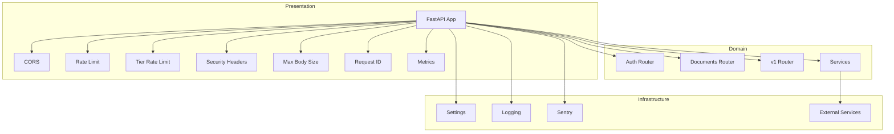
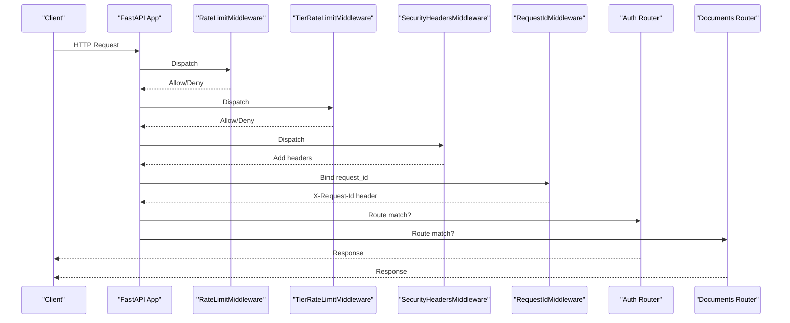
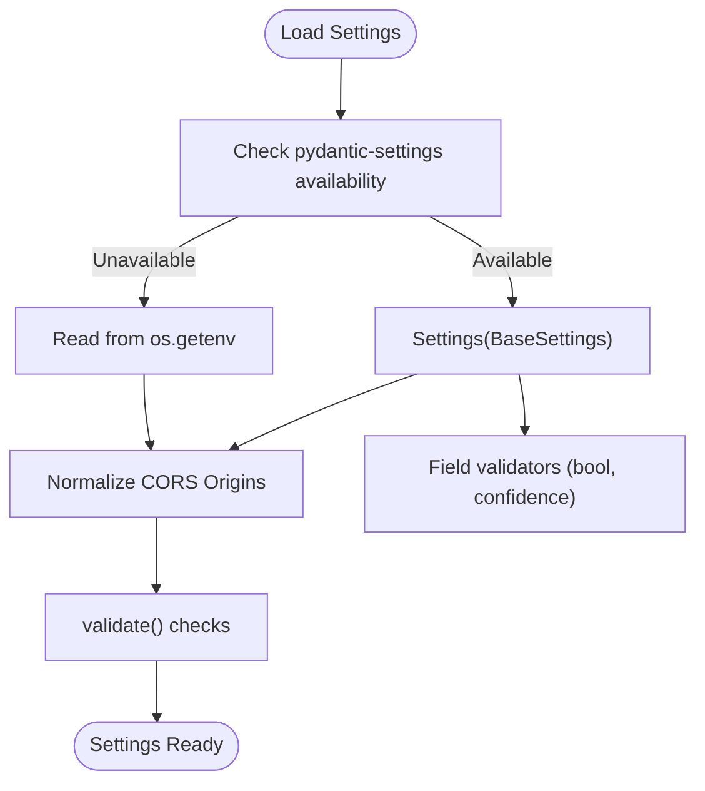
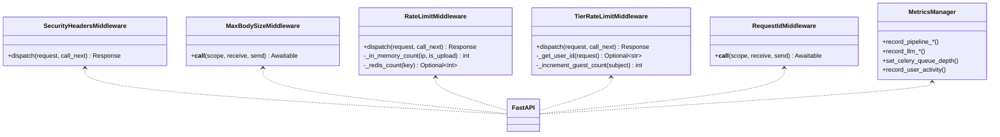
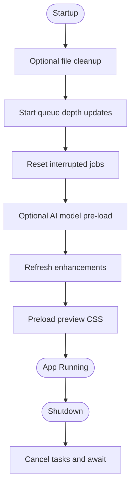
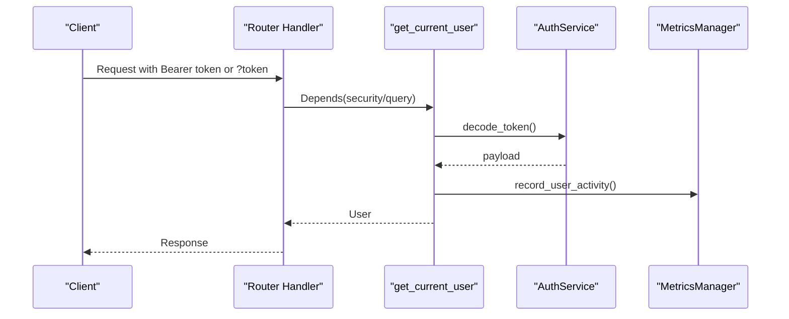
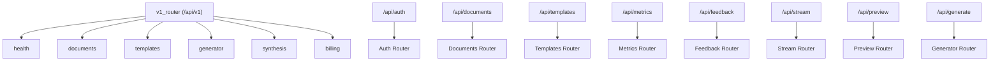
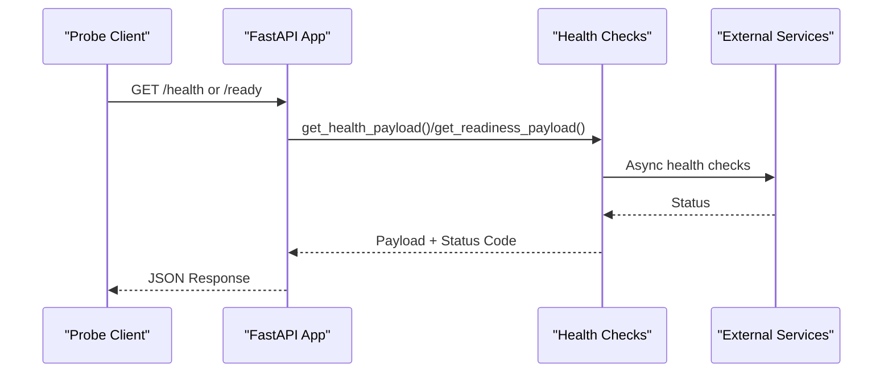
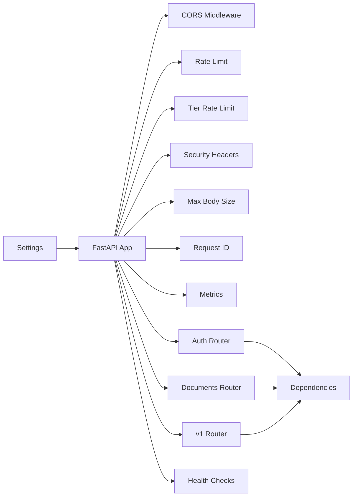

# FastAPI Application Structure

<cite>
**Referenced Files in This Document**
- [main.py](file://backend/app/main.py)
- [settings.py](file://backend/app/config/settings.py)
- [logging_config.py](file://backend/app/config/logging_config.py)
- [security_headers.py](file://backend/app/middleware/security_headers.py)
- [rate_limit.py](file://backend/app/middleware/rate_limit.py)
- [tier_rate_limit.py](file://backend/app/middleware/tier_rate_limit.py)
- [request_id.py](file://backend/app/middleware/request_id.py)
- [prometheus_metrics.py](file://backend/app/middleware/prometheus_metrics.py)
- [auth.py](file://backend/app/routers/auth.py)
- [documents.py](file://backend/app/routers/documents.py)
- [__init__.py](file://backend/app/routers/v1/__init__.py)
- [health_checks.py](file://backend/app/services/health_checks.py)
- [dependencies.py](file://backend/app/utils/dependencies.py)
- [pyproject.toml](file://backend/pyproject.toml)
</cite>

## Table of Contents
1. [Introduction](#introduction)
2. [Project Structure](#project-structure)
3. [Core Components](#core-components)
4. [Architecture Overview](#architecture-overview)
5. [Detailed Component Analysis](#detailed-component-analysis)
6. [Dependency Analysis](#dependency-analysis)
7. [Performance Considerations](#performance-considerations)
8. [Troubleshooting Guide](#troubleshooting-guide)
9. [Conclusion](#conclusion)
10. [Appendices](#appendices)

## Introduction
This document explains the FastAPI application structure and initialization for the backend service. It covers application setup, environment-driven configuration, middleware stack (CORS, rate limiting, security headers, request ID tracking), lifespan context manager for startup/shutdown, dependency injection patterns, and modular router organization including API versioning. It also documents logging configuration, error tracking with Sentry, health and readiness probes, and development versus production considerations.

## Project Structure
The backend is organized around a FastAPI application factory with clear separation of concerns:
- Application entrypoint initializes the ASGI app, middleware, routers, and lifecycle hooks.
- Configuration is centralized via environment variables and validated settings.
- Middleware enforces CORS, rate limits, security headers, and request tracing.
- Routers are grouped by feature and API version (v1).
- Services encapsulate business logic and integrate with external systems.
- Utilities provide dependency injection and shared helpers.

```mermaid
graph TB
A["FastAPI App<br/>main.py"] --> B["Settings<br/>config/settings.py"]
A --> C["Logging Config<br/>config/logging_config.py"]
A --> D["Security Headers<br/>middleware/security_headers.py"]
A --> E["Rate Limit<br/>middleware/rate_limit.py"]
A --> F["Tier Rate Limit<br/>middleware/tier_rate_limit.py"]
A --> G["Request ID<br/>middleware/request_id.py"]
A --> H["Prometheus Metrics<br/>middleware/prometheus_metrics.py"]
A --> I["Auth Router<br/>routers/auth.py"]
A --> J["Documents Router<br/>routers/documents.py"]
A --> K["v1 Router<br/>routers/v1/__init__.py"]
A --> L["Health Checks<br/>services/health_checks.py"]
A --> M["Dependencies<br/>utils/dependencies.py"]
```

**Diagram sources**
- [main.py:263-383](file://backend/app/main.py#L263-L383)
- [settings.py:72-422](file://backend/app/config/settings.py#L72-L422)
- [logging_config.py:39-185](file://backend/app/config/logging_config.py#L39-L185)
- [security_headers.py:18-67](file://backend/app/middleware/security_headers.py#L18-L67)
- [rate_limit.py:49-172](file://backend/app/middleware/rate_limit.py#L49-L172)
- [tier_rate_limit.py:19-116](file://backend/app/middleware/tier_rate_limit.py#L19-L116)
- [request_id.py:21-74](file://backend/app/middleware/request_id.py#L21-L74)
- [prometheus_metrics.py:135-235](file://backend/app/middleware/prometheus_metrics.py#L135-L235)
- [auth.py:9-59](file://backend/app/routers/auth.py#L9-L59)
- [documents.py:57-800](file://backend/app/routers/documents.py#L57-L800)
- [__init__.py:7-14](file://backend/app/routers/v1/__init__.py#L7-L14)
- [health_checks.py:85-261](file://backend/app/services/health_checks.py#L85-L261)
- [dependencies.py:15-93](file://backend/app/utils/dependencies.py#L15-L93)

**Section sources**
- [main.py:263-383](file://backend/app/main.py#L263-L383)
- [settings.py:72-422](file://backend/app/config/settings.py#L72-L422)

## Core Components
- Application factory and lifespan: Creates the FastAPI app, configures middleware, registers routers, and manages startup/shutdown tasks.
- Configuration management: Centralized settings loaded from environment variables with validation and normalization.
- Middleware stack: CORS, rate limiting (general and upload-specific), tier-based guest limits, security headers, request ID tracking, and Prometheus metrics exposure.
- Dependency injection: Authentication and optional user extraction via FastAPI Depends and custom utilities.
- Modular routing: Feature-based routers plus v1 API versioning.
- Health and readiness: Probes backed by cached health checks and external service checks.
- Logging and error tracking: Structured logging configuration and Sentry integration.

**Section sources**
- [main.py:150-260](file://backend/app/main.py#L150-L260)
- [settings.py:72-422](file://backend/app/config/settings.py#L72-L422)
- [dependencies.py:15-93](file://backend/app/utils/dependencies.py#L15-L93)
- [health_checks.py:85-261](file://backend/app/services/health_checks.py#L85-L261)

## Architecture Overview
The application follows a layered architecture:
- Presentation layer: FastAPI app with middleware and routers.
- Domain services: Encapsulated business logic (authentication, document processing, health checks).
- Infrastructure: External clients (Supabase, LLM providers, Grobid), caching, and metrics.

**Diagram sources**
- [main.py:263-383](file://backend/app/main.py#L263-L383)
- [settings.py:72-422](file://backend/app/config/settings.py#L72-L422)
- [logging_config.py:163-185](file://backend/app/config/logging_config.py#L163-L185)
- [auth.py:9-59](file://backend/app/routers/auth.py#L9-L59)
- [documents.py:57-800](file://backend/app/routers/documents.py#L57-L800)
- [__init__.py:7-14](file://backend/app/routers/v1/__init__.py#L7-L14)

## Detailed Component Analysis

### Application Initialization and Lifespan
- The app is created with metadata and OpenAPI endpoints.
- Prometheus metrics are instrumented and exposed.
- CORS is dynamically built from environment settings with developer-friendly defaults.
- Rate limiting middleware is registered (general and per-tier).
- Security headers middleware and max body size enforcement are applied.
- HTTPS redirect and HSTS header are conditionally added in production.
- Request ID middleware is registered.
- Audit logging middleware writes HTTP write operations.
- Routers are included for v1, auth, documents, templates, metrics, feedback, stream, preview, and generator.
- Health and readiness endpoints delegate to service-layer checks.

**Diagram sources**
- [main.py:276-358](file://backend/app/main.py#L276-L358)
- [rate_limit.py:124-172](file://backend/app/middleware/rate_limit.py#L124-L172)
- [tier_rate_limit.py:96-116](file://backend/app/middleware/tier_rate_limit.py#L96-L116)
- [security_headers.py:28-67](file://backend/app/middleware/security_headers.py#L28-L67)
- [request_id.py:25-60](file://backend/app/middleware/request_id.py#L25-L60)
- [auth.py:9-59](file://backend/app/routers/auth.py#L9-L59)
- [documents.py:57-800](file://backend/app/routers/documents.py#L57-L800)

**Section sources**
- [main.py:263-383](file://backend/app/main.py#L263-L383)

### Configuration Management
- Settings are loaded from environment variables with a Pydantic-based model when available, falling back to environment accessors.
- Boolean fields accept flexible truthy/falsy values and are normalized.
- CORS origins are normalized and include developer-friendly defaults in debug mode.
- Validation ensures required fields and sensible defaults for caches and timeouts.
- Environment flags control HTTPS enforcement, structured logging, and feature toggles.

**Diagram sources**
- [settings.py:72-422](file://backend/app/config/settings.py#L72-L422)

**Section sources**
- [settings.py:72-422](file://backend/app/config/settings.py#L72-L422)

### Middleware Stack
- CORS: Dynamically computed origins with development port allowances.
- Rate limiting: Sliding window with in-memory counters and optional Redis-backed distributed counters.
- Tier rate limiting: Guest-only daily caps for specific endpoints using JWT verification.
- Security headers: Adds CSP, X-Content-Type-Options, X-Frame-Options, X-XSS-Protection, Referrer-Policy, Permissions-Policy.
- Max body size: Enforces a global request body size limit.
- HTTPS redirect and HSTS: Production-only enforcement with Strict-Transport-Security header.
- Request ID: Generates and propagates request identifiers; logs idempotency keys for selected endpoints.
- Prometheus metrics: Exposes metrics endpoint and provides a MetricsManager for recording pipeline and system metrics.

**Diagram sources**
- [security_headers.py:18-99](file://backend/app/middleware/security_headers.py#L18-L99)
- [rate_limit.py:49-172](file://backend/app/middleware/rate_limit.py#L49-L172)
- [tier_rate_limit.py:19-116](file://backend/app/middleware/tier_rate_limit.py#L19-L116)
- [request_id.py:21-74](file://backend/app/middleware/request_id.py#L21-L74)
- [prometheus_metrics.py:144-235](file://backend/app/middleware/prometheus_metrics.py#L144-L235)

**Section sources**
- [main.py:276-315](file://backend/app/main.py#L276-L315)
- [security_headers.py:18-99](file://backend/app/middleware/security_headers.py#L18-L99)
- [rate_limit.py:49-172](file://backend/app/middleware/rate_limit.py#L49-L172)
- [tier_rate_limit.py:19-116](file://backend/app/middleware/tier_rate_limit.py#L19-L116)
- [request_id.py:21-74](file://backend/app/middleware/request_id.py#L21-L74)
- [prometheus_metrics.py:135-235](file://backend/app/middleware/prometheus_metrics.py#L135-L235)

### Lifespan Context Manager
- Startup:
  - Optional periodic file cleanup based on retention policy.
  - Periodic queue depth updates for Celery queues.
  - Reset interrupted jobs in the database if applicable.
  - Optional AI model pre-loading for performance.
  - Capability refresh for enhancement layer.
  - Preload preview template CSS.
- Shutdown:
  - Cancel background tasks and await completion.

**Diagram sources**
- [main.py:150-260](file://backend/app/main.py#L150-L260)

**Section sources**
- [main.py:150-260](file://backend/app/main.py#L150-L260)

### Dependency Injection Patterns
- Authentication dependency extracts token from Authorization header or query parameter for SSE compatibility.
- Optional user dependency returns None when no valid token is present.
- Metrics recording integrates with user activity tracking.

**Diagram sources**
- [dependencies.py:15-93](file://backend/app/utils/dependencies.py#L15-L93)
- [prometheus_metrics.py:220-231](file://backend/app/middleware/prometheus_metrics.py#L220-L231)

**Section sources**
- [dependencies.py:15-93](file://backend/app/utils/dependencies.py#L15-L93)

### Router Organization and API Versioning
- v1 API versioning groups related endpoints under /api/v1 with dedicated routers for health, documents, templates, generator, synthesis, and billing.
- Feature routers include auth, documents, templates, metrics, feedback, stream, preview, and generator.
- Legacy documents routes are mapped to v1 equivalents with deprecation handling.

**Diagram sources**
- [__init__.py:7-14](file://backend/app/routers/v1/__init__.py#L7-L14)
- [main.py:330-358](file://backend/app/main.py#L330-L358)

**Section sources**
- [__init__.py:7-14](file://backend/app/routers/v1/__init__.py#L7-L14)
- [main.py:330-358](file://backend/app/main.py#L330-L358)

### Health and Readiness Probes
- Health endpoint aggregates database, AI models, and LLM service status with cached TTL.
- Readiness endpoint validates database, external services (Grobid), and AI model availability with cached TTL.
- Both leverage async HTTP checks and return appropriate status codes.

**Diagram sources**
- [main.py:360-381](file://backend/app/main.py#L360-L381)
- [health_checks.py:85-261](file://backend/app/services/health_checks.py#L85-L261)

**Section sources**
- [main.py:360-381](file://backend/app/main.py#L360-L381)
- [health_checks.py:85-261](file://backend/app/services/health_checks.py#L85-L261)

### Logging Configuration
- Structured logging with console and rotating file handlers.
- Filters inject contextual fields (request_id, job_id, session_id).
- Third-party loggers suppressed to reduce noise.
- Idempotent setup and fallback to basicConfig if needed.

**Section sources**
- [logging_config.py:163-185](file://backend/app/config/logging_config.py#L163-L185)

### Error Tracking with Sentry
- Sentry SDK initialized conditionally when DSN is present.
- Integrations for FastAPI, Starlette, and Python logging.
- Environment and release tags set from environment variables.

**Section sources**
- [main.py:40-60](file://backend/app/main.py#L40-L60)

### Development vs Production Configurations
- HTTPS enforcement and HSTS header applied only when forced and not in debug mode.
- Structured logging enabled via environment flag.
- CORS origins expanded in debug mode to include common dev ports.
- AI model pre-loading controlled by flags for memory-constrained deployments.

**Section sources**
- [main.py:303-314](file://backend/app/main.py#L303-L314)
- [main.py:26-28](file://backend/app/main.py#L26-L28)
- [main.py:76-84](file://backend/app/main.py#L76-L84)
- [main.py:198-229](file://backend/app/main.py#L198-L229)

## Dependency Analysis
- The app depends on configuration settings for all behavior toggles and limits.
- Routers depend on services for business logic and on dependency utilities for authentication.
- Middleware components are loosely coupled and applied globally.
- External dependencies include Supabase, LLM providers, Grobid, and Redis/Celery.

**Diagram sources**
- [settings.py:72-422](file://backend/app/config/settings.py#L72-L422)
- [main.py:263-383](file://backend/app/main.py#L263-L383)
- [dependencies.py:15-93](file://backend/app/utils/dependencies.py#L15-L93)
- [health_checks.py:85-261](file://backend/app/services/health_checks.py#L85-L261)

**Section sources**
- [settings.py:72-422](file://backend/app/config/settings.py#L72-L422)
- [main.py:263-383](file://backend/app/main.py#L263-L383)

## Performance Considerations
- Use Redis-backed rate limiting for multi-worker deployments to maintain accurate counts.
- Enable AI model pre-loading only when sufficient memory is available; otherwise rely on lazy loading.
- Tune cache TTLs for health and readiness checks to balance freshness and cost.
- Monitor pipeline and LLM metrics via Prometheus to identify bottlenecks.
- Apply HTTPS and HSTS in production to prevent downgrade attacks and improve trust.

## Troubleshooting Guide
- Health/Readiness failures:
  - Verify external service URLs and network connectivity.
  - Check cache TTLs and ensure caches are not stale.
- Rate limit errors:
  - Confirm Redis availability for distributed counters.
  - Review per-minute limits and endpoint-specific upload caps.
- Authentication issues:
  - Ensure Authorization header is present or token query parameter is used for SSE.
  - Validate JWT decoding and token expiration.
- Logging problems:
  - Confirm structured logging is enabled and log directory is writable.
  - Check filters and formatters for contextual fields.

**Section sources**
- [health_checks.py:85-261](file://backend/app/services/health_checks.py#L85-L261)
- [rate_limit.py:49-172](file://backend/app/middleware/rate_limit.py#L49-L172)
- [tier_rate_limit.py:19-116](file://backend/app/middleware/tier_rate_limit.py#L19-L116)
- [dependencies.py:15-93](file://backend/app/utils/dependencies.py#L15-L93)
- [logging_config.py:163-185](file://backend/app/config/logging_config.py#L163-L185)

## Conclusion
The FastAPI application is structured for scalability and maintainability, with environment-driven configuration, robust middleware, and modular routers. The lifespan context manager coordinates startup and shutdown tasks, while dependency injection and service layers keep business logic cohesive. Health and readiness probes, combined with Sentry and structured logging, support reliable operations across development and production.

## Appendices
- Runtime environment: Python 3.12 as defined by the project metadata.

**Section sources**
- [pyproject.toml:5-9](file://backend/pyproject.toml#L5-L9)