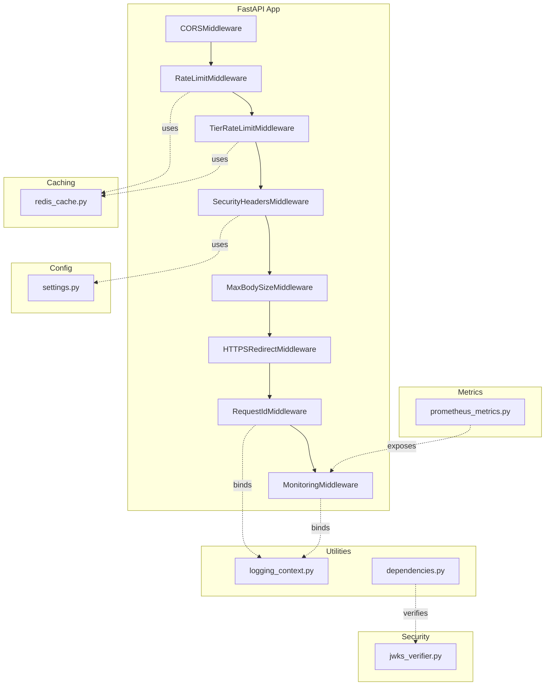
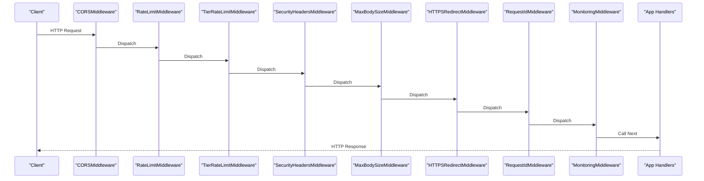
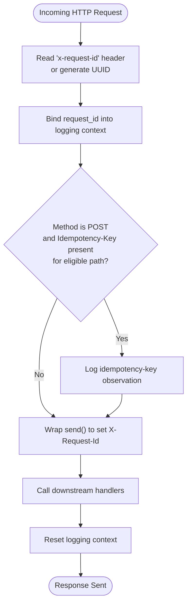
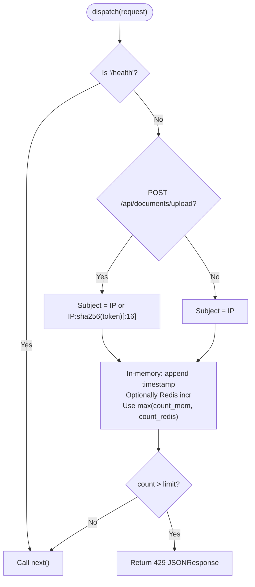
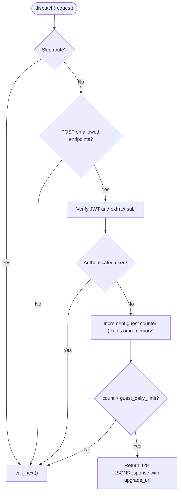
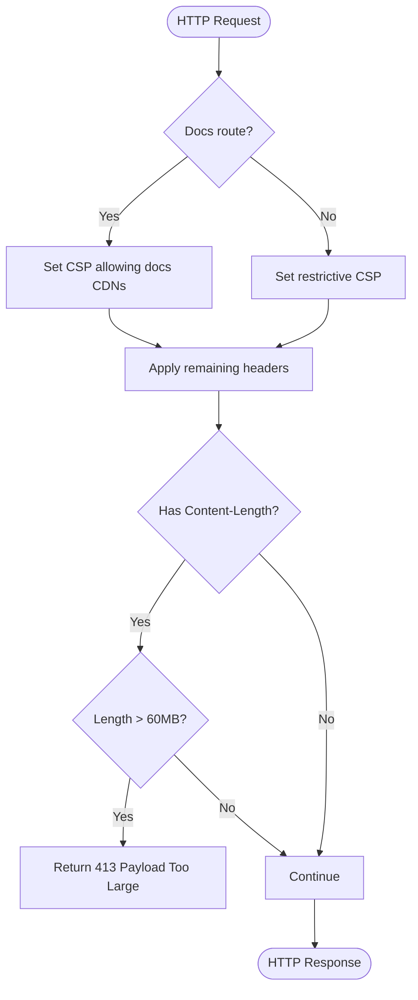
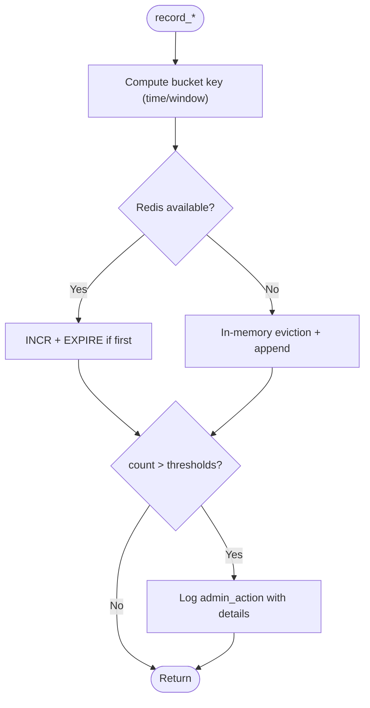
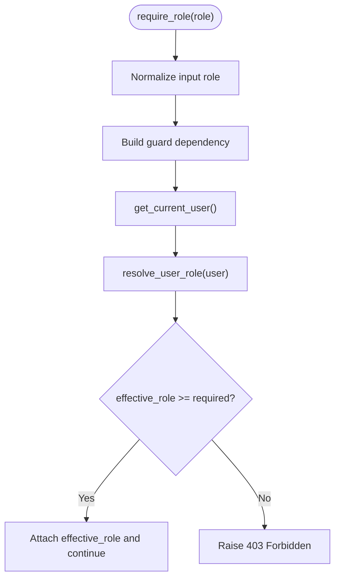
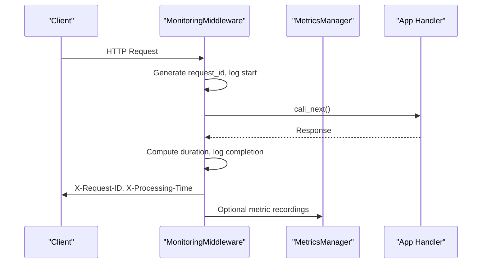
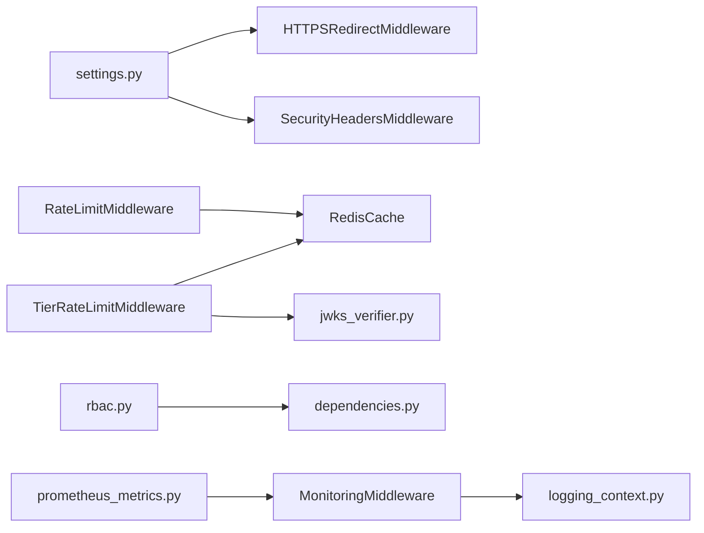

# Middleware & Security System

<cite>
**Referenced Files in This Document**
- [main.py](file://backend/app/main.py)
- [request_id.py](file://backend/app/middleware/request_id.py)
- [rate_limit.py](file://backend/app/middleware/rate_limit.py)
- [tier_rate_limit.py](file://backend/app/middleware/tier_rate_limit.py)
- [security_headers.py](file://backend/app/middleware/security_headers.py)
- [rbac.py](file://backend/app/middleware/rbac.py)
- [abuse_detector.py](file://backend/app/middleware/abuse_detector.py)
- [monitoring.py](file://backend/app/middleware/monitoring.py)
- [prometheus_metrics.py](file://backend/app/middleware/prometheus_metrics.py)
- [settings.py](file://backend/app/config/settings.py)
- [logging_context.py](file://backend/app/utils/logging_context.py)
- [redis_cache.py](file://backend/app/cache/redis_cache.py)
- [jwks_verifier.py](file://backend/app/security/jwks_verifier.py)
- [dependencies.py](file://backend/app/utils/dependencies.py)
</cite>

## Table of Contents
1. [Introduction](#introduction)
2. [Project Structure](#project-structure)
3. [Core Components](#core-components)
4. [Architecture Overview](#architecture-overview)
5. [Detailed Component Analysis](#detailed-component-analysis)
6. [Dependency Analysis](#dependency-analysis)
7. [Performance Considerations](#performance-considerations)
8. [Troubleshooting Guide](#troubleshooting-guide)
9. [Conclusion](#conclusion)
10. [Appendices](#appendices)

## Introduction
This document explains the middleware and security system of the backend. It covers request ID tracking for distributed tracing, rate limiting (global and tier-based), security headers (including CSP and HSTS), abuse detection, and role-based access control (RBAC). It also details middleware execution order, configuration options, integration patterns, security best practices, threat mitigation strategies, monitoring approaches, performance implications, and customization options for different deployment scenarios.

## Project Structure
The middleware and security system is implemented as modular FastAPI middleware and supporting utilities. Key locations:
- Middleware: backend/app/middleware/*
- Configuration: backend/app/config/settings.py
- Utilities: backend/app/utils/*
- Security: backend/app/security/*
- Caching: backend/app/cache/*

**Diagram sources**
- [main.py:279-315](file://backend/app/main.py#L279-L315)
- [rate_limit.py:49-172](file://backend/app/middleware/rate_limit.py#L49-L172)
- [tier_rate_limit.py:19-116](file://backend/app/middleware/tier_rate_limit.py#L19-L116)
- [security_headers.py:18-99](file://backend/app/middleware/security_headers.py#L18-L99)
- [settings.py:99-102](file://backend/app/config/settings.py#L99-L102)
- [logging_context.py:17-115](file://backend/app/utils/logging_context.py#L17-L115)
- [dependencies.py:15-93](file://backend/app/utils/dependencies.py#L15-L93)
- [jwks_verifier.py:135-183](file://backend/app/security/jwks_verifier.py#L135-L183)
- [prometheus_metrics.py:135-235](file://backend/app/middleware/prometheus_metrics.py#L135-L235)

**Section sources**
- [main.py:279-315](file://backend/app/main.py#L279-L315)

## Core Components
- Request ID tracking: Assigns and propagates a request identifier for distributed tracing and logging correlation.
- Rate limiting: Sliding-window global and upload-specific limits with optional Redis-backed distribution.
- Tier-based rate limiting: Daily guest limits for specific endpoints.
- Security headers: Adds CSP, X-Content-Type-Options, X-Frame-Options, X-XSS-Protection, Referrer-Policy, Permissions-Policy, and HSTS.
- Abuse detection: Monitors spikes in generation requests and LLM usage to flag potential abuse.
- RBAC: Role resolution and enforcement using normalized roles and hierarchical precedence.
- Monitoring: Logs request lifecycle, timing, and attaches request IDs and processing time headers.
- Prometheus metrics: Exposes application metrics and provides a helper to record pipeline and LLM metrics.

**Section sources**
- [request_id.py:21-74](file://backend/app/middleware/request_id.py#L21-L74)
- [rate_limit.py:49-172](file://backend/app/middleware/rate_limit.py#L49-L172)
- [tier_rate_limit.py:19-116](file://backend/app/middleware/tier_rate_limit.py#L19-L116)
- [security_headers.py:18-99](file://backend/app/middleware/security_headers.py#L18-L99)
- [abuse_detector.py:14-70](file://backend/app/middleware/abuse_detector.py#L14-L70)
- [rbac.py:9-80](file://backend/app/middleware/rbac.py#L9-L80)
- [monitoring.py:13-51](file://backend/app/middleware/monitoring.py#L13-L51)
- [prometheus_metrics.py:135-235](file://backend/app/middleware/prometheus_metrics.py#L135-L235)

## Architecture Overview
The middleware stack is registered in a specific order to ensure proper propagation of identifiers, enforcement of policies, and consistent security posture. The order prioritizes:
1) CORS
2) Rate limiting (global and tier-based)
3) Security headers and body size limits
4) HTTPS redirect and HSTS
5) Request ID binding
6) Monitoring
7) Audit logging hook
8) Endpoint routers

**Diagram sources**
- [main.py:279-315](file://backend/app/main.py#L279-L315)

## Detailed Component Analysis

### Request ID Tracking Middleware
Purpose:
- Assign a request ID to each HTTP request.
- Propagate the ID via X-Request-Id response header.
- Bind context for structured logging and correlate logs across services.

Behavior:
- Reads x-request-id from headers or generates a UUID.
- Stores request_id in request.state for downstream access.
- Wraps outbound responses to set X-Request-Id.
- Logs idempotency-key for specific endpoints when applicable.

**Diagram sources**
- [request_id.py:25-59](file://backend/app/middleware/request_id.py#L25-L59)
- [logging_context.py:17-43](file://backend/app/utils/logging_context.py#L17-L43)

**Section sources**
- [request_id.py:21-74](file://backend/app/middleware/request_id.py#L21-L74)
- [logging_context.py:17-115](file://backend/app/utils/logging_context.py#L17-L115)

### Rate Limiting Middleware (Global and Upload)
Purpose:
- Enforce sliding-window rate limits per client IP.
- Separate stricter limits for uploads.
- Support distributed counters via Redis with graceful fallback to in-memory.

Key mechanics:
- Sliding window: maintains per-IP timestamps within a fixed time window.
- Upload differentiation: augments subject with a token fingerprint when Bearer token is present.
- Redis acceleration: increments per-minute counters keyed by subject and minute; sets expiry on first increment.
- Health check bypass: /health is never rate-limited.

**Diagram sources**
- [rate_limit.py:124-172](file://backend/app/middleware/rate_limit.py#L124-L172)
- [redis_cache.py:10-39](file://backend/app/cache/redis_cache.py#L10-L39)

**Section sources**
- [rate_limit.py:49-172](file://backend/app/middleware/rate_limit.py#L49-L172)
- [settings.py:93-97](file://backend/app/config/settings.py#L93-L97)
- [redis_cache.py:10-39](file://backend/app/cache/redis_cache.py#L10-L39)

### Tier-Based Rate Limiting Middleware (Guest Daily)
Purpose:
- Apply daily caps for guests on specific endpoints.
- Use UTC day-based keys with Redis or in-memory fallback.

Endpoints covered:
- POST /api/documents/upload and /api/v1/documents/upload
- POST /api/generate and /api/v1/generator/sessions

Behavior:
- Skips health/readiness/status/template routes.
- Extracts user ID from Authorization Bearer token via JWT verification.
- Increments per-IP counters per UTC day; denies after exceeding guest_daily_limit.

**Diagram sources**
- [tier_rate_limit.py:96-116](file://backend/app/middleware/tier_rate_limit.py#L96-L116)
- [jwks_verifier.py:135-183](file://backend/app/security/jwks_verifier.py#L135-L183)

**Section sources**
- [tier_rate_limit.py:19-116](file://backend/app/middleware/tier_rate_limit.py#L19-L116)
- [jwks_verifier.py:135-183](file://backend/app/security/jwks_verifier.py#L135-L183)

### Security Headers Middleware and Body Size Limits
Purpose:
- Harden responses with security headers.
- Prevent oversized request bodies to mitigate DoS.

Headers applied:
- X-Content-Type-Options: nosniff
- X-Frame-Options: DENY
- X-XSS-Protection: 1; mode=block
- Referrer-Policy: strict-origin-when-cross-origin
- Permissions-Policy: camera=(), microphone=(), geolocation=()
- Content-Security-Policy: restricted default; relaxed for docs routes

Additional protection:
- MaxBodySizeMiddleware enforces a maximum Content-Length and returns 413 if exceeded.

**Diagram sources**
- [security_headers.py:28-66](file://backend/app/middleware/security_headers.py#L28-L66)
- [security_headers.py:78-99](file://backend/app/middleware/security_headers.py#L78-L99)

**Section sources**
- [security_headers.py:18-99](file://backend/app/middleware/security_headers.py#L18-L99)
- [settings.py:99-102](file://backend/app/config/settings.py#L99-L102)

### Abuse Detection
Purpose:
- Detect unusual spikes in generation requests and LLM usage.
- Emit audit logs for admin review.

Mechanics:
- Sliding windows: 5-minute bucket for generation spikes, 10-minute bucket for LLM usage.
- Redis-accelerated counters with per-bucket keys and expiry.
- On threshold breaches, logs administrative flags with details.

**Diagram sources**
- [abuse_detector.py:20-67](file://backend/app/middleware/abuse_detector.py#L20-L67)

**Section sources**
- [abuse_detector.py:14-70](file://backend/app/middleware/abuse_detector.py#L14-L70)

### Role-Based Access Control (RBAC)
Purpose:
- Normalize and resolve user roles from multiple sources.
- Enforce minimum role requirements for protected endpoints.

Role hierarchy:
- free < pro < admin

Aliases:
- Maps common aliases to canonical roles.

Enforcement:
- require_role builds a dependency that extracts current user, resolves effective role, compares against required role, and raises 403 if insufficient.

**Diagram sources**
- [rbac.py:61-80](file://backend/app/middleware/rbac.py#L61-L80)
- [dependencies.py:15-60](file://backend/app/utils/dependencies.py#L15-L60)

**Section sources**
- [rbac.py:9-80](file://backend/app/middleware/rbac.py#L9-L80)
- [dependencies.py:15-93](file://backend/app/utils/dependencies.py#L15-L93)

### Monitoring and Metrics
Purpose:
- Provide request lifecycle logging, timing, and correlation IDs.
- Expose Prometheus metrics and helper APIs to record pipeline and LLM metrics.

Monitoring:
- Generates request_id per request, logs start/completion/failure, attaches X-Request-ID and X-Processing-Time.

Metrics:
- Exposes /metrics endpoint.
- Provides MetricsManager to record pipeline, agent, LLM, queue, and connection metrics.

**Diagram sources**
- [monitoring.py:17-51](file://backend/app/middleware/monitoring.py#L17-L51)
- [prometheus_metrics.py:135-235](file://backend/app/middleware/prometheus_metrics.py#L135-L235)

**Section sources**
- [monitoring.py:13-51](file://backend/app/middleware/monitoring.py#L13-L51)
- [prometheus_metrics.py:135-235](file://backend/app/middleware/prometheus_metrics.py#L135-L235)

## Dependency Analysis
- Middleware registration order ensures headers and limits are applied before application logic.
- Redis is used for distributed counters in rate limiting and tier-based limiting; graceful fallback to in-memory occurs when unavailable.
- JWT verification is used for tier-based limiting and user extraction for RBAC.
- Settings control HTTPS enforcement and HSTS header injection.

**Diagram sources**
- [main.py:279-315](file://backend/app/main.py#L279-L315)
- [rate_limit.py:30-34](file://backend/app/middleware/rate_limit.py#L30-L34)
- [tier_rate_limit.py:30-32](file://backend/app/middleware/tier_rate_limit.py#L30-L32)
- [jwks_verifier.py:135-183](file://backend/app/security/jwks_verifier.py#L135-L183)
- [rbac.py:68-72](file://backend/app/middleware/rbac.py#L68-L72)
- [dependencies.py:15-60](file://backend/app/utils/dependencies.py#L15-L60)
- [logging_context.py:17-43](file://backend/app/utils/logging_context.py#L17-L43)
- [prometheus_metrics.py:135-235](file://backend/app/middleware/prometheus_metrics.py#L135-L235)

**Section sources**
- [main.py:279-315](file://backend/app/main.py#L279-L315)
- [rate_limit.py:30-34](file://backend/app/middleware/rate_limit.py#L30-L34)
- [tier_rate_limit.py:30-32](file://backend/app/middleware/tier_rate_limit.py#L30-L32)
- [jwks_verifier.py:135-183](file://backend/app/security/jwks_verifier.py#L135-L183)
- [rbac.py:68-72](file://backend/app/middleware/rbac.py#L68-L72)
- [dependencies.py:15-60](file://backend/app/utils/dependencies.py#L15-L60)
- [logging_context.py:17-43](file://backend/app/utils/logging_context.py#L17-L43)
- [prometheus_metrics.py:135-235](file://backend/app/middleware/prometheus_metrics.py#L135-L235)

## Performance Considerations
- Rate limiting:
  - Redis acceleration reduces contention across workers; fallback to in-memory is seamless but not distributed.
  - Token fingerprinting for uploads increases uniqueness; consider hashing strategies carefully.
- Tier-based limiting:
  - UTC day keys avoid cross-day drift; expiry aligns with next day boundary.
- Security headers:
  - CSP relaxations for docs are minimal and scoped; production should keep defaults strict.
- Abuse detection:
  - Per-bucket counters reduce memory growth; Redis expiry prevents leaks.
- Monitoring and metrics:
  - Lightweight logging and metric recording; ensure exporters are configured appropriately.

[No sources needed since this section provides general guidance]

## Troubleshooting Guide
Common issues and mitigations:
- Rate limit 429 responses:
  - Verify client IP and Bearer token presence for upload-specific limits.
  - Check Redis connectivity; fallback to in-memory is used automatically.
- Tier-based 429 responses:
  - Confirm Authorization header format and validity; ensure JWT verification succeeds.
  - Review guest_daily_limit setting and endpoint eligibility.
- Security headers not applied:
  - Ensure HTTPS redirect and HSTS are enabled in production settings.
  - Validate CSP directives for your deployment’s assets.
- Monitoring headers missing:
  - Confirm MonitoringMiddleware is registered after RequestIdMiddleware.
- Audit logging failures:
  - Inspect audit log service availability; middleware gracefully skips on errors.

**Section sources**
- [rate_limit.py:111-118](file://backend/app/middleware/rate_limit.py#L111-L118)
- [tier_rate_limit.py:87-91](file://backend/app/middleware/tier_rate_limit.py#L87-L91)
- [security_headers.py:35-66](file://backend/app/middleware/security_headers.py#L35-L66)
- [main.py:309-328](file://backend/app/main.py#L309-L328)

## Conclusion
The middleware and security system provides a robust foundation for secure, observable, and scalable API operations. It combines distributed rate limiting, tier-aware controls, strong security headers, abuse detection, and RBAC to protect the platform. Proper configuration of settings and Redis enables optimal performance and reliability across diverse deployment scenarios.

[No sources needed since this section summarizes without analyzing specific files]

## Appendices

### Middleware Execution Order and Integration Patterns
- Registration order:
  1) CORSMiddleware
  2) RateLimitMiddleware
  3) TierRateLimitMiddleware
  4) SecurityHeadersMiddleware
  5) MaxBodySizeMiddleware
  6) HTTPSRedirectMiddleware
  7) RequestIdMiddleware
  8) MonitoringMiddleware
  9) Audit logging hook
- Integration patterns:
  - Use RequestIdMiddleware to correlate logs and traces.
  - Apply require_role guards at router or endpoint level.
  - Record pipeline and LLM metrics via MetricsManager.
  - Configure settings for HTTPS/HSTS and body size limits.

**Section sources**
- [main.py:279-315](file://backend/app/main.py#L279-L315)
- [rbac.py:61-80](file://backend/app/middleware/rbac.py#L61-L80)
- [prometheus_metrics.py:144-235](file://backend/app/middleware/prometheus_metrics.py#L144-L235)

### Configuration Options
Key settings impacting security and rate limiting:
- FORCE_HTTPS: Enables HTTPS redirect and HSTS header.
- UPLOADS_PER_MINUTE: Upload-specific rate limit.
- REDIS_ENABLED/REDIS_URL: Distributed counter backend for rate limiting and tier limits.
- MAX_FILE_SIZE and related upload limits: Controlled via settings and enforced by middleware.

**Section sources**
- [settings.py:99-102](file://backend/app/config/settings.py#L99-L102)
- [settings.py:93-97](file://backend/app/config/settings.py#L93-L97)
- [settings.py:156-163](file://backend/app/config/settings.py#L156-L163)
- [security_headers.py:78-99](file://backend/app/middleware/security_headers.py#L78-L99)