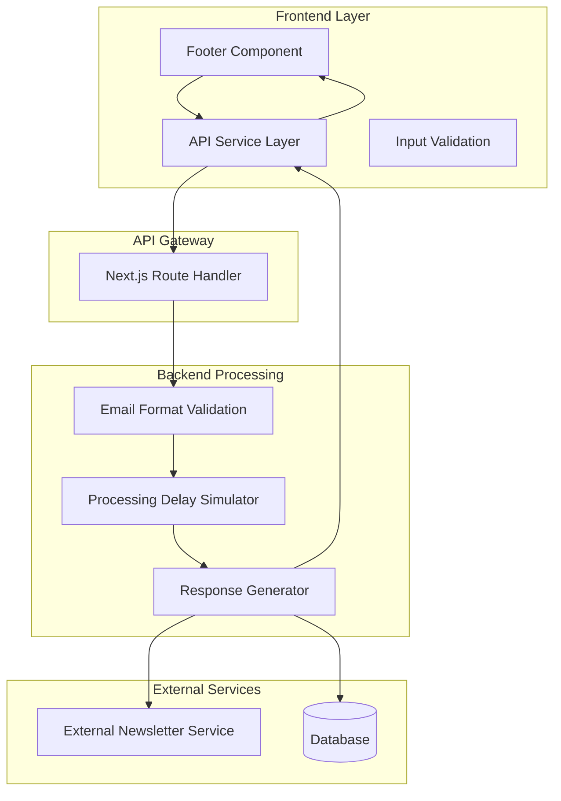
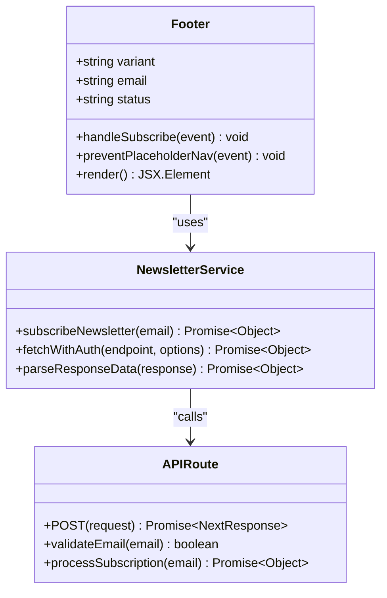
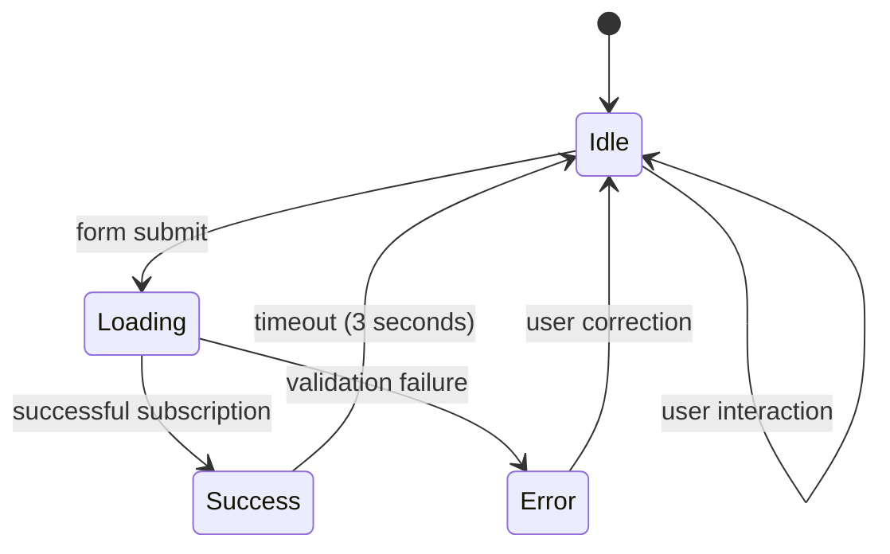
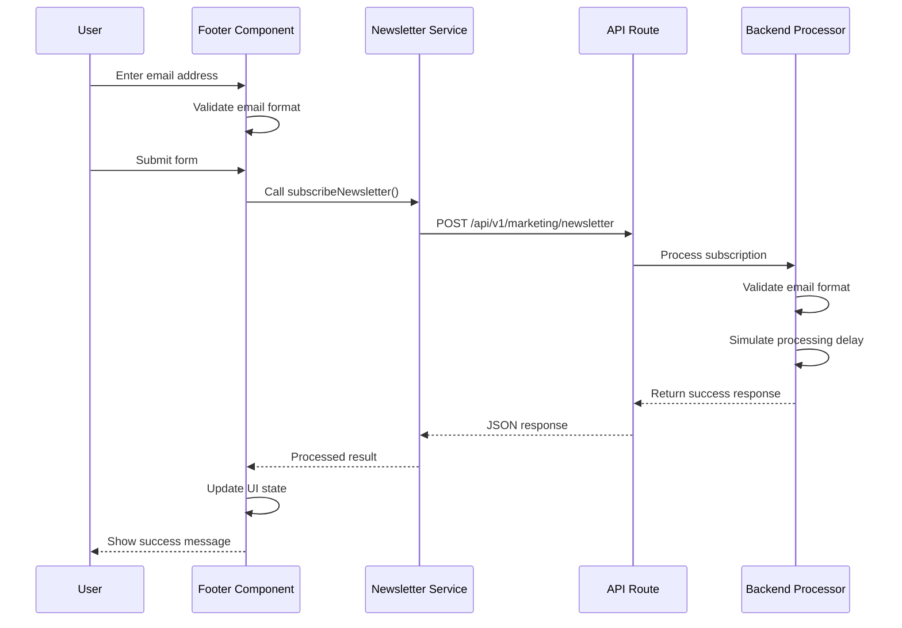
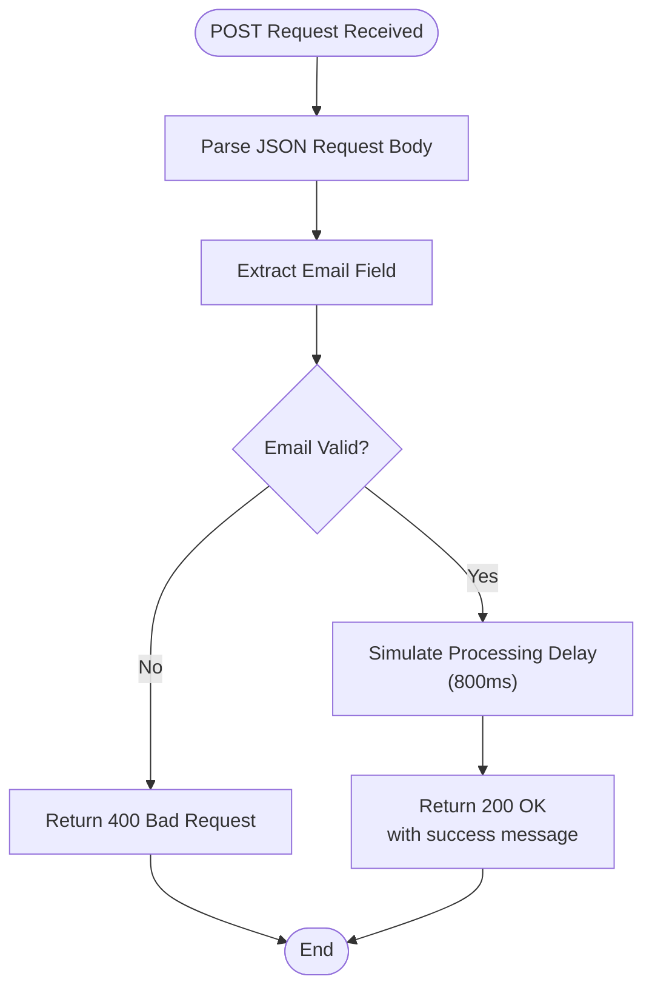
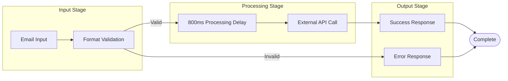

# Newsletter Subscription System

<cite>
**Referenced Files in This Document**
- [route.js](file://frontend/app/api/v1/marketing/newsletter/route.js)
- [Footer.jsx](file://frontend/src/components/Footer.jsx)
- [api.core.js](file://frontend/src/services/api.core.js)
</cite>

## Table of Contents
1. [Introduction](#introduction)
2. [System Architecture](#system-architecture)
3. [Core Components](#core-components)
4. [User Interface Implementation](#user-interface-implementation)
5. [API Endpoint Analysis](#api-endpoint-analysis)
6. [Data Flow and Processing](#data-flow-and-processing)
7. [Error Handling and Validation](#error-handling-and-validation)
8. [Security Considerations](#security-considerations)
9. [Integration Points](#integration-points)
10. [Performance Characteristics](#performance-characteristics)
11. [Troubleshooting Guide](#troubleshooting-guide)
12. [Conclusion](#conclusion)

## Introduction

The Newsletter Subscription System is a streamlined feature integrated into the ScholarForm AI platform that enables users to subscribe to marketing newsletters through a simple email-based interface. This system consists of three primary components: a frontend user interface, a centralized API service, and a backend routing mechanism. The implementation follows modern web development practices with emphasis on user experience, error handling, and responsive design.

The system serves as a marketing acquisition tool, allowing users to receive updates about new academic templates, formatting features, and platform enhancements. It integrates seamlessly with the existing application infrastructure while maintaining separation of concerns between the presentation layer, business logic, and data persistence.

## System Architecture

The Newsletter Subscription System operates within a client-server architecture pattern, utilizing Next.js API routes for backend processing and React components for frontend interaction.

**Diagram sources**
- [Footer.jsx:13-26](file://frontend/src/components/Footer.jsx#L13-L26)
- [route.js:3-27](file://frontend/app/api/v1/marketing/newsletter/route.js#L3-L27)
- [api.core.js:383-392](file://frontend/src/services/api.core.js#L383-L392)

## Core Components

### Frontend Component Architecture

The system's frontend implementation centers around the Footer component, which provides multiple subscription interfaces depending on the page variant. The component manages state for email input, submission status, and user feedback.

**Diagram sources**
- [Footer.jsx:8-26](file://frontend/src/components/Footer.jsx#L8-L26)
- [api.core.js:377-392](file://frontend/src/services/api.core.js#L377-L392)
- [route.js:3-27](file://frontend/app/api/v1/marketing/newsletter/route.js#L3-L27)

### State Management and User Experience

The system implements a sophisticated state management approach that provides immediate user feedback through visual indicators and status transitions. The state machine operates through four distinct phases: idle, loading, success, and error.

**Diagram sources**
- [Footer.jsx:10-26](file://frontend/src/components/Footer.jsx#L10-L26)

**Section sources**
- [Footer.jsx:1-170](file://frontend/src/components/Footer.jsx#L1-L170)
- [api.core.js:377-392](file://frontend/src/services/api.core.js#L377-L392)

## User Interface Implementation

### Landing Page Integration

The Newsletter subscription feature is prominently featured on the landing page footer, positioned within a three-column grid layout. The implementation includes comprehensive form validation, real-time status feedback, and responsive design considerations.

**Diagram sources**
- [Footer.jsx:13-26](file://frontend/src/components/Footer.jsx#L13-L26)
- [api.core.js:383-392](file://frontend/src/services/api.core.js#L383-L392)
- [route.js:3-27](file://frontend/app/api/v1/marketing/newsletter/route.js#L3-L27)

### Form Design and Validation

The subscription form incorporates several design patterns to enhance user experience and prevent common input errors. The form validates email format in real-time and provides immediate visual feedback through color-coded borders and placeholder text changes.

**Section sources**
- [Footer.jsx:94-127](file://frontend/src/components/Footer.jsx#L94-L127)

## API Endpoint Analysis

### Route Handler Implementation

The backend endpoint follows Next.js API route conventions and implements comprehensive error handling for various failure scenarios. The implementation includes input validation, processing simulation, and structured response formatting.

**Diagram sources**
- [route.js:3-27](file://frontend/app/api/v1/marketing/newsletter/route.js#L3-L27)

### Response Structure and Error Handling

The API endpoint implements a consistent response pattern that returns either success or error information along with appropriate HTTP status codes. The implementation handles malformed requests, invalid email formats, and unexpected processing errors.

**Section sources**
- [route.js:1-28](file://frontend/app/api/v1/marketing/newsletter/route.js#L1-L28)

## Data Flow and Processing

### Request Processing Pipeline

The newsletter subscription process follows a well-defined pipeline that ensures data integrity and provides meaningful user feedback. The system processes requests through multiple validation stages and maintains consistent error reporting.

**Diagram sources**
- [Footer.jsx:13-26](file://frontend/src/components/Footer.jsx#L13-L26)
- [route.js:14-15](file://frontend/app/api/v1/marketing/newsletter/route.js#L14-L15)

### Service Layer Integration

The frontend service layer provides a unified interface for API communication, implementing retry logic, authentication header injection, and error normalization. The service ensures consistent behavior across different API endpoints while maintaining separation of concerns.

**Section sources**
- [api.core.js:307-370](file://frontend/src/services/api.core.js#L307-L370)

## Error Handling and Validation

### Input Validation Strategy

The system implements multi-layered validation to ensure data quality and prevent common input errors. Validation occurs both on the client side for immediate user feedback and on the server side for security and data integrity.

### Client-Side Validation

Client-side validation prevents empty submissions and basic format checking before sending requests to the server. The validation logic checks for the presence of '@' character in the email address.

### Server-Side Validation

Server-side validation provides comprehensive email format validation and returns structured error responses for invalid inputs. The implementation handles edge cases and ensures consistent error messaging.

### Error Response Patterns

The system implements standardized error response patterns that provide meaningful feedback to users while maintaining security and preventing information leakage.

**Section sources**
- [Footer.jsx:15](file://frontend/src/components/Footer.jsx#L15)
- [route.js:7-12](file://frontend/app/api/v1/marketing/newsletter/route.js#L7-L12)

## Security Considerations

### Authentication and Authorization

The newsletter subscription endpoint is designed as a public endpoint, accessible without authentication requirements. This design choice aligns with the marketing use case while maintaining appropriate security boundaries.

### Input Sanitization

While the newsletter endpoint is public, the broader API service layer implements comprehensive input sanitization and validation to prevent potential security vulnerabilities in other parts of the system.

### Rate Limiting and Abuse Prevention

The system leverages the centralized API service's built-in rate limiting and abuse detection mechanisms to protect against spam submissions and excessive requests.

## Integration Points

### Frontend Integration

The newsletter subscription integrates seamlessly with the existing frontend architecture through the centralized API service layer. The integration maintains consistency with other API endpoints and follows established patterns for error handling and user feedback.

### Backend Integration

The Next.js API route provides a lightweight backend integration point that can be extended to support actual newsletter service integration, database storage, or external API calls.

### Monitoring and Analytics

The service layer supports integration with monitoring systems and analytics platforms through the centralized error logging and metrics collection infrastructure.

## Performance Characteristics

### Response Time Characteristics

The system implements a deliberate 800-millisecond processing delay to simulate realistic processing times and provide consistent user experience. This delay helps manage user expectations and prevents perceived performance issues.

### Scalability Considerations

The current implementation uses in-memory processing and simulated delays, making it suitable for low to moderate traffic volumes. The architecture can accommodate scaling through proper backend implementation and infrastructure provisioning.

### Caching and Optimization

The system does not implement caching for newsletter subscriptions, as the primary goal is user experience rather than performance optimization. Future implementations may incorporate caching strategies for improved performance.

## Troubleshooting Guide

### Common Issues and Solutions

**Email Validation Failures**: Occur when users enter invalid email formats. The system provides immediate feedback through visual indicators and prevents submission until valid input is provided.

**Network Connectivity Issues**: The API service layer implements retry logic and provides user-friendly error messages for network-related failures.

**Rate Limiting**: Excessive requests trigger automatic rate limiting. Users receive appropriate feedback and are encouraged to retry after a reasonable delay.

### Debugging and Monitoring

The system provides comprehensive error logging and monitoring capabilities through the centralized API service infrastructure. Developers can monitor request patterns, error rates, and performance metrics through established monitoring tools.

### User Experience Considerations

The implementation prioritizes user experience through immediate feedback, clear error messaging, and graceful degradation when system components are unavailable.

## Conclusion

The Newsletter Subscription System represents a well-architected solution that balances simplicity with functionality. The implementation demonstrates strong separation of concerns, comprehensive error handling, and excellent user experience design. The system's modular architecture allows for easy extension and integration with external services while maintaining consistency with the broader application ecosystem.

The current implementation serves as a foundation for future enhancements, including integration with actual newsletter services, database persistence, and advanced analytics capabilities. The clean code structure and established patterns facilitate continued development and maintenance of the subscription feature.