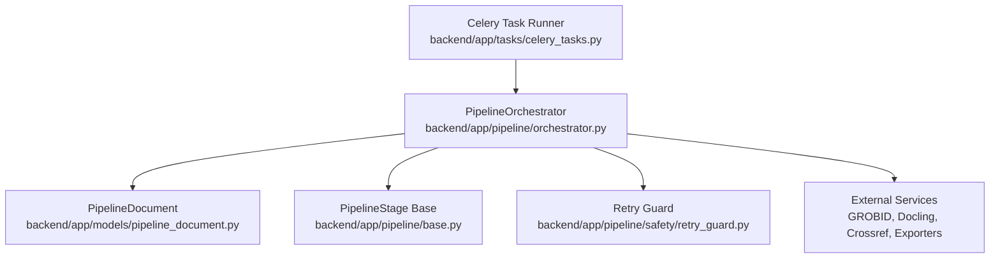
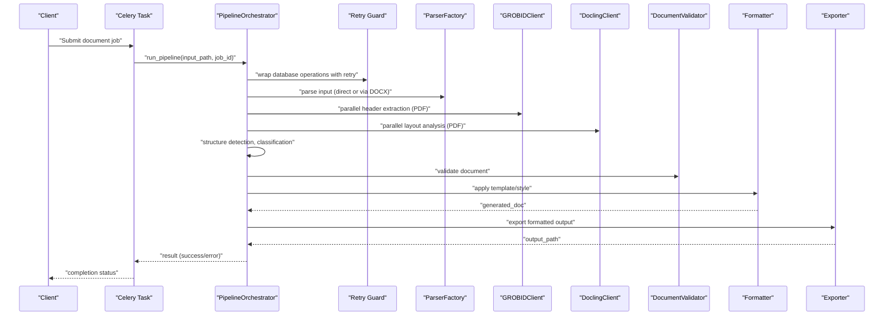
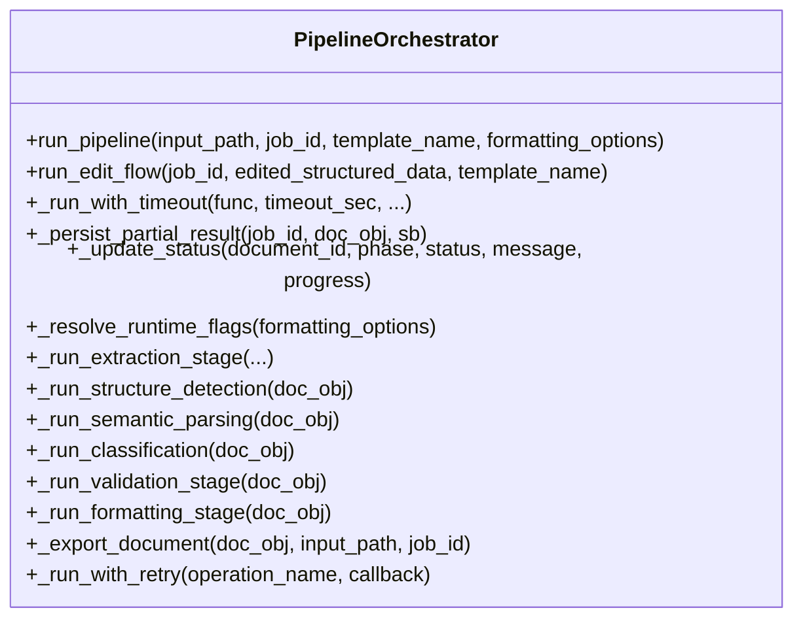
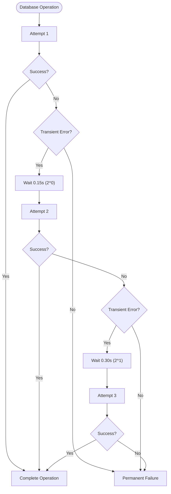
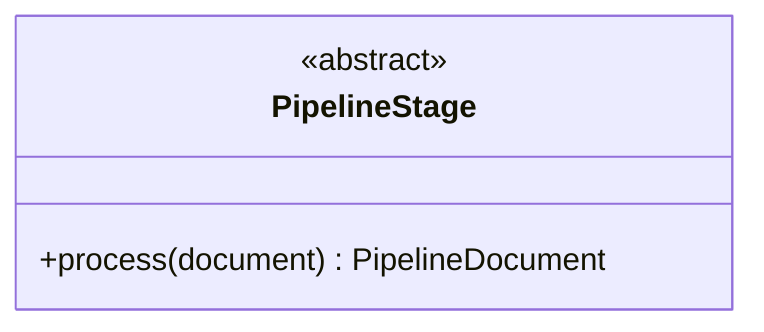
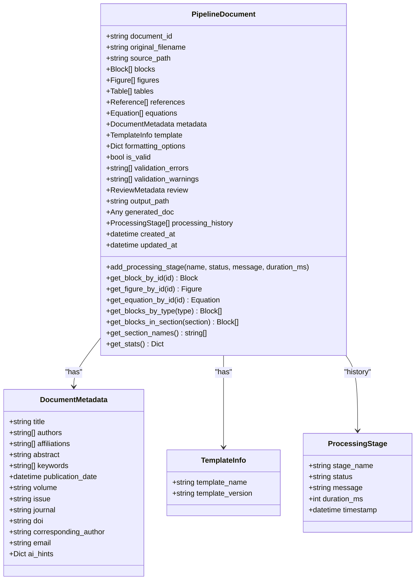
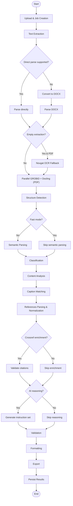
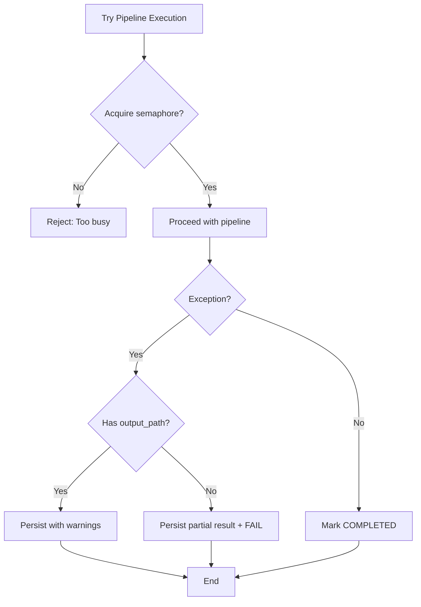
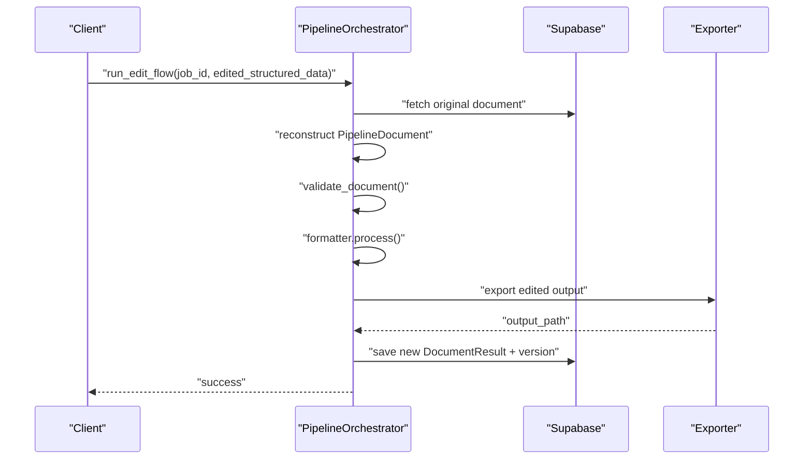
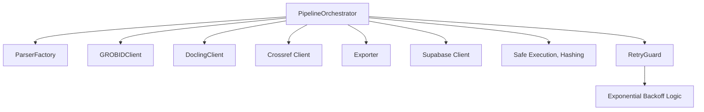

# Pipeline Processing System

<cite>
**Referenced Files in This Document**
- [orchestrator.py](file://backend/app/pipeline/orchestrator.py)
- [base.py](file://backend/app/pipeline/base.py)
- [pipeline_document.py](file://backend/app/models/pipeline_document.py)
- [celery_tasks.py](file://backend/app/tasks/celery_tasks.py)
- [retry_guard.py](file://backend/app/pipeline/safety/retry_guard.py)
</cite>

## Update Summary
**Changes Made**
- Added comprehensive documentation for exponential backoff retry mechanisms in PipelineOrchestrator
- Updated error handling and recovery section to include intelligent retry logic for transient Supabase errors
- Enhanced database operations section with details about _run_with_retry function
- Added retry guard functionality documentation for stage-level retry decorators
- Updated troubleshooting guide to include retry-related debugging information

## Table of Contents
1. [Introduction](#introduction)
2. [Project Structure](#project-structure)
3. [Core Components](#core-components)
4. [Architecture Overview](#architecture-overview)
5. [Detailed Component Analysis](#detailed-component-analysis)
6. [Dependency Analysis](#dependency-analysis)
7. [Performance Considerations](#performance-considerations)
8. [Troubleshooting Guide](#troubleshooting-guide)
9. [Conclusion](#conclusion)
10. [Appendices](#appendices)

## Introduction
This document describes the 12-stage pipeline processing system used to transform academic manuscripts into properly formatted outputs. The PipelineOrchestrator coordinates a modular set of stages that perform text extraction, metadata enrichment, structure detection, classification, validation, formatting, and persistence. It implements robust error handling, timeouts, concurrency controls, and real-time status updates to support large-scale document processing. The system now includes sophisticated exponential backoff retry mechanisms to handle transient database errors and improve reliability.

## Project Structure
The pipeline is implemented in the backend under the pipeline package and integrates with models, services, and tasks:
- Orchestrator: Central coordinator for the pipeline lifecycle and stage orchestration
- Base stage interface: Defines the contract for all pipeline stages
- Document model: Internal representation of the document and its components across stages
- Task runner: Asynchronous execution via Celery to trigger the orchestrator
- Retry guard: Provides exponential backoff retry mechanisms for resilient operations

**Diagram sources**
- [celery_tasks.py:41-66](file://backend/app/tasks/celery_tasks.py#L41-L66)
- [orchestrator.py:73-1281](file://backend/app/pipeline/orchestrator.py#L73-L1281)
- [base.py:4-23](file://backend/app/pipeline/base.py#L4-L23)
- [pipeline_document.py:49-207](file://backend/app/models/pipeline_document.py#L49-L207)
- [retry_guard.py:1-63](file://backend/app/pipeline/safety/retry_guard.py#L1-L63)

**Section sources**
- [celery_tasks.py:41-66](file://backend/app/tasks/celery_tasks.py#L41-L66)
- [orchestrator.py:73-1281](file://backend/app/pipeline/orchestrator.py#L73-L1281)
- [base.py:4-23](file://backend/app/pipeline/base.py#L4-L23)
- [pipeline_document.py:49-207](file://backend/app/models/pipeline_document.py#L49-L207)
- [retry_guard.py:1-63](file://backend/app/pipeline/safety/retry_guard.py#L1-L63)

## Core Components
- PipelineOrchestrator: Implements the end-to-end pipeline, stage coordination, timeouts, retries, cancellation checks, and persistence
- PipelineStage (base): Abstract interface that all stages implement
- PipelineDocument: Internal document model carrying content, metadata, formatting options, validation results, and processing history
- RetryGuard: Provides exponential backoff retry mechanisms for resilient operations

Key responsibilities:
- Orchestrate sequential and parallel stages with intelligent retry logic
- Enforce runtime flags (fast mode, semantic parser, crossref enrichment, AI reasoning)
- Manage concurrency limits and timeouts
- Persist partial results on failure and update statuses in real time
- Support an edit reprocessing flow for iterative refinement
- Implement exponential backoff retry mechanisms for transient database errors

**Section sources**
- [orchestrator.py:73-1281](file://backend/app/pipeline/orchestrator.py#L73-L1281)
- [base.py:4-23](file://backend/app/pipeline/base.py#L4-L23)
- [pipeline_document.py:49-207](file://backend/app/models/pipeline_document.py#L49-L207)
- [retry_guard.py:1-63](file://backend/app/pipeline/safety/retry_guard.py#L1-L63)

## Architecture Overview
The pipeline follows a staged design with explicit phases and optional AI layers. It supports:
- Direct parsing for supported formats
- Conversion to DOCX for unsupported formats
- Parallel extraction via GROBID and Docling for PDFs
- Structure detection and optional semantic parsing
- Classification and content analysis
- Caption matching for figures and tables
- Reference parsing and normalization
- Validation and AI reasoning integration
- Formatting and export
- Persistence and real-time status updates with intelligent retry mechanisms

**Diagram sources**
- [celery_tasks.py:41-66](file://backend/app/tasks/celery_tasks.py#L41-L66)
- [orchestrator.py:576-1146](file://backend/app/pipeline/orchestrator.py#L576-L1146)
- [retry_guard.py:10-62](file://backend/app/pipeline/safety/retry_guard.py#L10-L62)

## Detailed Component Analysis

### PipelineOrchestrator
The orchestrator coordinates all pipeline stages, manages runtime flags, enforces timeouts, and persists results. It includes:
- Semaphore-based concurrency control to limit simultaneous jobs
- Safe execution wrappers and retry guards for resilience
- Conditional execution flags (fast mode, semantic parser, crossref enrichment, AI reasoning)
- Parallel extraction for PDFs using GROBID and Docling
- Timeout enforcement per stage using thread pools
- Cancellation checks against user actions
- Partial result persistence on failures
- Real-time status updates and SSE event emission
- Edit reprocessing flow for iterative refinement
- **Intelligent retry mechanisms for transient database errors using exponential backoff**

**Diagram sources**
- [orchestrator.py:73-1281](file://backend/app/pipeline/orchestrator.py#L73-L1281)

**Section sources**
- [orchestrator.py:73-1281](file://backend/app/pipeline/orchestrator.py#L73-L1281)

### Retry Guard and Exponential Backoff Mechanisms
The system implements sophisticated retry mechanisms to handle transient failures:

#### Stage-Level Retry Decorators
Multiple pipeline stages are wrapped with retry decorators that provide exponential backoff:
- `_run_extraction_stage`: 2 retries with 1.0s backoff factor
- `_run_structure_detection`: 1 retry with 1.0s backoff factor  
- `_run_semantic_parsing`: 2 retries with 1.0s backoff factor
- `_run_classification`: 2 retries with 1.0s backoff factor
- `_run_validation_stage`: 2 retries with 1.0s backoff factor
- `_run_formatting_stage`: 2 retries with 1.0s backoff factor

#### Database Operation Retry Logic
The `_run_with_retry` function provides intelligent retry logic for database operations:
- **3 attempts total** with exponential backoff (0.15s, 0.30s, 0.60s delays)
- **Transient error detection** for Supabase connection issues
- **Automatic client refresh** to handle stale connections
- **Operation-specific naming** for detailed logging

**Diagram sources**
- [orchestrator.py:127-150](file://backend/app/pipeline/orchestrator.py#L127-L150)
- [retry_guard.py:10-62](file://backend/app/pipeline/safety/retry_guard.py#L10-L62)

**Section sources**
- [orchestrator.py:127-150](file://backend/app/pipeline/orchestrator.py#L127-L150)
- [orchestrator.py:505-518](file://backend/app/pipeline/orchestrator.py#L505-L518)
- [orchestrator.py:520-524](file://backend/app/pipeline/orchestrator.py#L520-L524)
- [orchestrator.py:526-541](file://backend/app/pipeline/orchestrator.py#L526-L541)
- [orchestrator.py:543-546](file://backend/app/pipeline/orchestrator.py#L543-L546)
- [orchestrator.py:548-551](file://backend/app/pipeline/orchestrator.py#L548-L551)
- [orchestrator.py:553-556](file://backend/app/pipeline/orchestrator.py#L553-L556)
- [retry_guard.py:10-62](file://backend/app/pipeline/safety/retry_guard.py#L10-L62)

### PipelineStage Base Interface
All pipeline stages implement a uniform interface to ensure modularity and testability.

**Diagram sources**
- [base.py:4-23](file://backend/app/pipeline/base.py#L4-L23)

**Section sources**
- [base.py:4-23](file://backend/app/pipeline/base.py#L4-L23)

### PipelineDocument Model
The internal document model carries parsed content, assets, metadata, formatting options, validation outcomes, and processing history.

**Diagram sources**
- [pipeline_document.py:49-207](file://backend/app/models/pipeline_document.py#L49-L207)

**Section sources**
- [pipeline_document.py:49-207](file://backend/app/models/pipeline_document.py#L49-L207)

### Stage Coordination and Control Flow
The orchestrator defines a clear progression of stages with optional branches and parallelism:
- Upload and job creation
- Text extraction (direct or via DOCX conversion)
- Optional Nougat OCR fallback for scanned PDFs
- Parallel GROBID and Docling extraction for PDFs
- Equation standardization and structure detection
- Optional semantic parsing and classification
- Content analysis and caption matching
- Reference parsing and normalization
- Optional CrossRef enrichment
- Optional AI reasoning integration
- Validation and formatting
- Export and persistence
- Real-time status updates and SSE events

**Diagram sources**
- [orchestrator.py:576-1146](file://backend/app/pipeline/orchestrator.py#L576-L1146)

**Section sources**
- [orchestrator.py:576-1146](file://backend/app/pipeline/orchestrator.py#L576-L1146)

### Error Handling and Recovery
The orchestrator implements layered safety with sophisticated retry mechanisms:
- Concurrency limiting with rejection and status updates
- **Exponential backoff retry guards around critical stages**
- Timeout enforcement per stage with cancellation events
- Cancellation checks against user-initiated cancellations
- Partial result persistence on early failure
- Downgrade to warnings when artifacts exist despite validation errors
- Atomic completion checks ensuring output readiness before marking success
- **Intelligent retry logic for transient database operations with automatic client refresh**

**Diagram sources**
- [orchestrator.py:586-598](file://backend/app/pipeline/orchestrator.py#L586-L598)
- [orchestrator.py:1106-1146](file://backend/app/pipeline/orchestrator.py#L1106-L1146)

**Section sources**
- [orchestrator.py:586-598](file://backend/app/pipeline/orchestrator.py#L586-L598)
- [orchestrator.py:1106-1146](file://backend/app/pipeline/orchestrator.py#L1106-L1146)

### Conditional Execution and Runtime Flags
Runtime flags control optional stages:
- fast_mode: Disables semantic parser, crossref enrichment, and AI reasoning by default
- semantic_parser: Enables optional semantic parsing layer
- crossref_enrichment: Enables optional CrossRef citation validation
- ai_reasoning: Enables optional AI reasoning layer

These flags are resolved from formatting options and environment settings, with tests overriding defaults to ensure determinism.

**Section sources**
- [orchestrator.py:306-323](file://backend/app/pipeline/orchestrator.py#L306-L323)

### Timeout Handling and Concurrency Controls
- Per-stage timeouts enforced via thread pool futures with cancellation events
- Global semaphore limits concurrent pipeline executions
- Configurable timeouts for GROBID, Docling, semantic parsing, and reasoning
- Graceful shutdown handling for server reloads and cancellations

**Section sources**
- [orchestrator.py:266-287](file://backend/app/pipeline/orchestrator.py#L266-L287)
- [orchestrator.py:69-72](file://backend/app/pipeline/orchestrator.py#L69-L72)
- [orchestrator.py:745-769](file://backend/app/pipeline/orchestrator.py#L745-L769)

### Edit Reprocessing Flow
The orchestrator supports an edit flow that:
- Reconstructs a document from edited structured data
- Re-validates and re-formats without re-extracting
- Persists a new version while preserving previous versions
- Updates output hash and status accordingly

**Diagram sources**
- [orchestrator.py:1148-1281](file://backend/app/pipeline/orchestrator.py#L1148-L1281)

**Section sources**
- [orchestrator.py:1148-1281](file://backend/app/pipeline/orchestrator.py#L1148-L1281)

## Dependency Analysis
The orchestrator depends on external services and internal modules:
- ParserFactory for direct parsing and DOCX conversion
- GROBIDClient and DoclingClient for metadata and layout extraction
- Crossref client for citation validation
- Exporter for generating final outputs
- Supabase client for status updates and persistence
- Utilities for safe execution, retries, and hashing
- **RetryGuard for exponential backoff retry mechanisms**

**Diagram sources**
- [orchestrator.py:19-38](file://backend/app/pipeline/orchestrator.py#L19-L38)
- [orchestrator.py:58-61](file://backend/app/pipeline/orchestrator.py#L58-L61)
- [retry_guard.py:10-62](file://backend/app/pipeline/safety/retry_guard.py#L10-L62)

**Section sources**
- [orchestrator.py:19-38](file://backend/app/pipeline/orchestrator.py#L19-L38)
- [orchestrator.py:58-61](file://backend/app/pipeline/orchestrator.py#L58-L61)
- [retry_guard.py:10-62](file://backend/app/pipeline/safety/retry_guard.py#L10-L62)

## Performance Considerations
- Concurrency control: Limit simultaneous jobs to prevent resource exhaustion
- Parallel extraction: Offload GROBID and Docling to separate threads with bounded timeouts
- Fast mode: Disable optional AI layers to reduce latency during testing or constrained environments
- Streaming and SSE: Provide real-time feedback to users without blocking the pipeline
- Hashing and atomic completion: Ensure integrity checks before marking success
- Memory footprint: Prefer incremental processing and avoid loading entire documents into memory when possible
- **Exponential backoff: Minimizes retry overhead while maximizing success probability for transient failures**
- **Client refresh: Automatic connection recovery reduces downtime from stale database connections**

## Troubleshooting Guide
Common issues and remedies:
- Too many concurrent jobs: The semaphore rejects new requests; reduce batch sizes or scale horizontally
- Stage timeouts: Increase stage-specific timeout settings or disable optional stages
- Cancellations: Server reloads or user cancellations are handled gracefully; check status updates
- Partial results: On failure, partial results are persisted to aid debugging
- Output readiness: Atomic checks ensure only valid artifacts are marked as completed
- Edit flow failures: Validate edited structured data and rerun the edit flow
- **Database retry failures: Monitor exponential backoff logs; check transient error markers in database operations**
- **Connection issues: Automatic client refresh handles stale connections; verify network stability**

**Section sources**
- [orchestrator.py:586-598](file://backend/app/pipeline/orchestrator.py#L586-L598)
- [orchestrator.py:1106-1146](file://backend/app/pipeline/orchestrator.py#L1106-L1146)
- [orchestrator.py:127-150](file://backend/app/pipeline/orchestrator.py#L127-L150)

## Conclusion
The pipeline system is designed for reliability, scalability, and extensibility. The PipelineOrchestrator coordinates modular stages with robust error handling, timeouts, and real-time feedback. The implementation of exponential backoff retry mechanisms significantly improves resilience against transient database failures. Optional AI layers and runtime flags enable tuning for performance and quality. The edit reprocessing flow supports iterative refinement, and the document model provides a consistent representation across all stages.

## Appendices

### Pipeline Phases and Responsibilities
- UPLOAD: Job initialization and status updates
- EXTRACTION: Text extraction and optional OCR fallback
- PARALLEL AI EXTRACTION: GROBID and Docling for PDFs
- STRUCTURE DETECTION: Heading and section identification
- SEMANTIC PARSING: Optional NLP layer for confidence scores
- CLASSIFICATION: Content categorization
- CONTENT ANALYSIS: Keyword extraction and metadata enrichment
- CAPTION MATCHING: Figures and tables alignment
- REFERENCES: Parsing and normalization
- CROSSREF ENRICHMENT: Optional citation validation
- AI REASONING: Optional semantic advice
- VALIDATION: Structural and style validation
- FORMATTING: Template-driven styling
- EXPORT: Artifact generation
- PERSISTENCE: Final result storage and status updates

### Retry Mechanism Configuration
**Stage-Level Retry Decorators:**
- Extraction: 2 retries, 1.0s backoff factor
- Structure Detection: 1 retry, 1.0s backoff factor
- Semantic Parsing: 2 retries, 1.0s backoff factor
- Classification: 2 retries, 1.0s backoff factor
- Validation: 2 retries, 1.0s backoff factor
- Formatting: 2 retries, 1.0s backoff factor

**Database Operation Retry Logic:**
- Maximum 3 attempts with exponential backoff
- Delays: 0.15s, 0.30s, 0.60s (2^n-1)
- Transient error detection for Supabase
- Automatic client refresh on retry
- Detailed logging for debugging