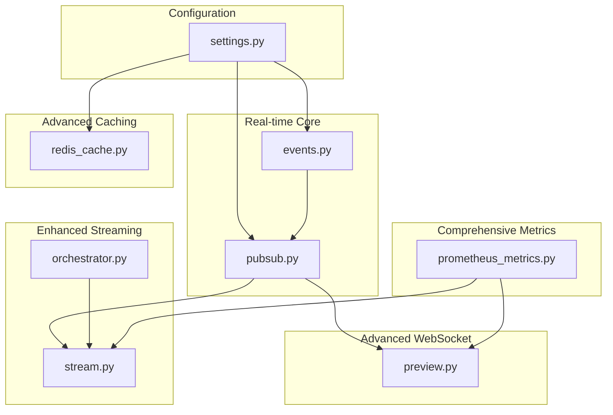
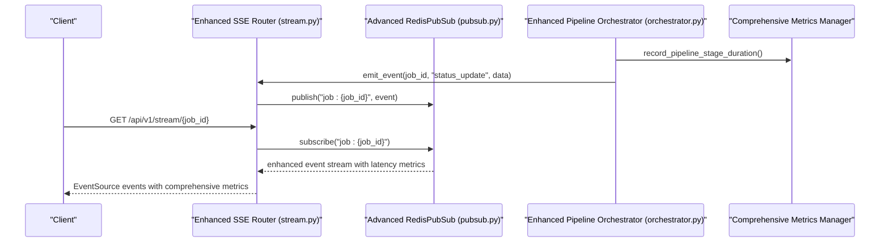
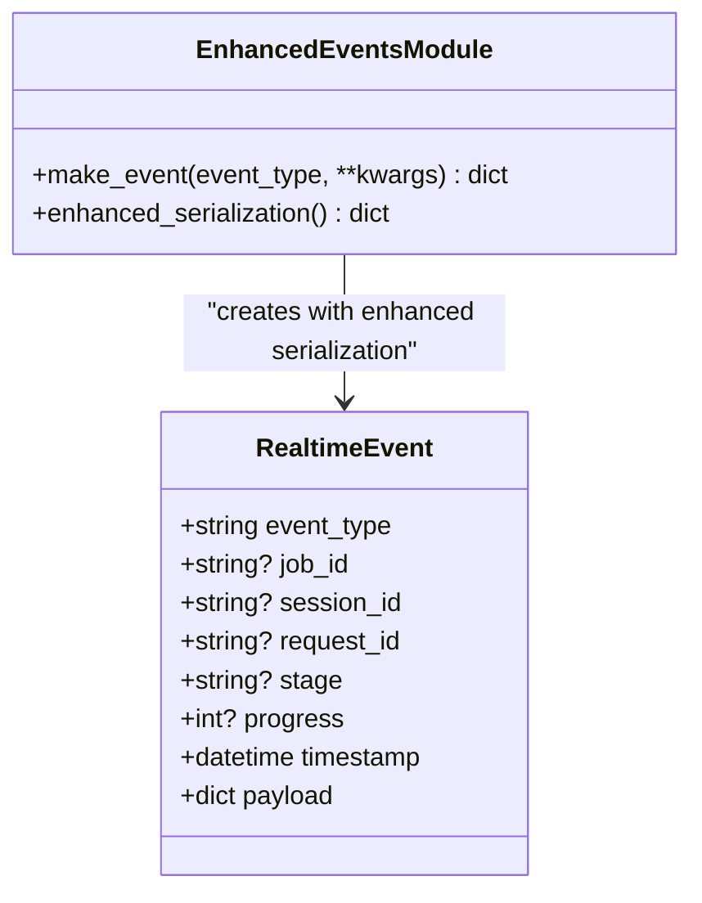
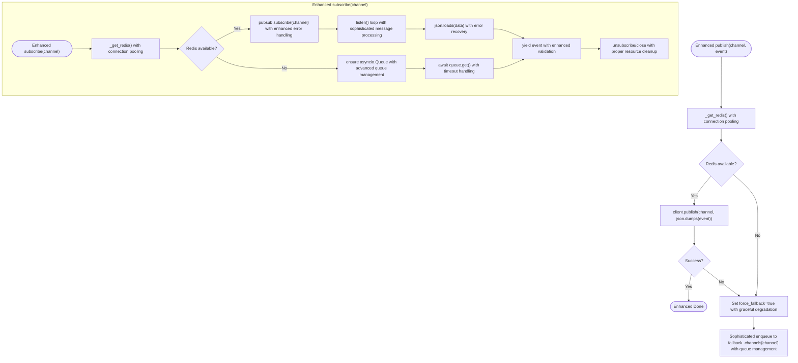
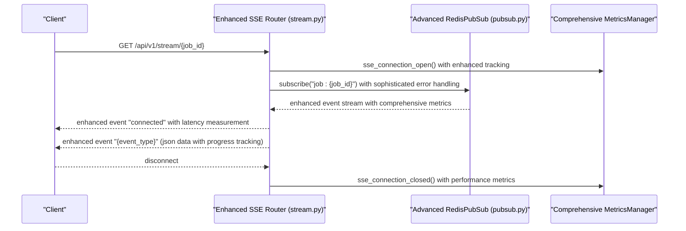
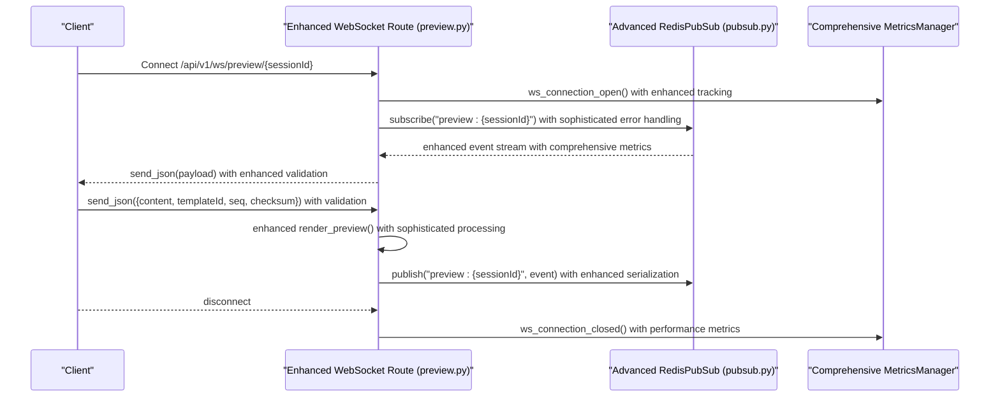
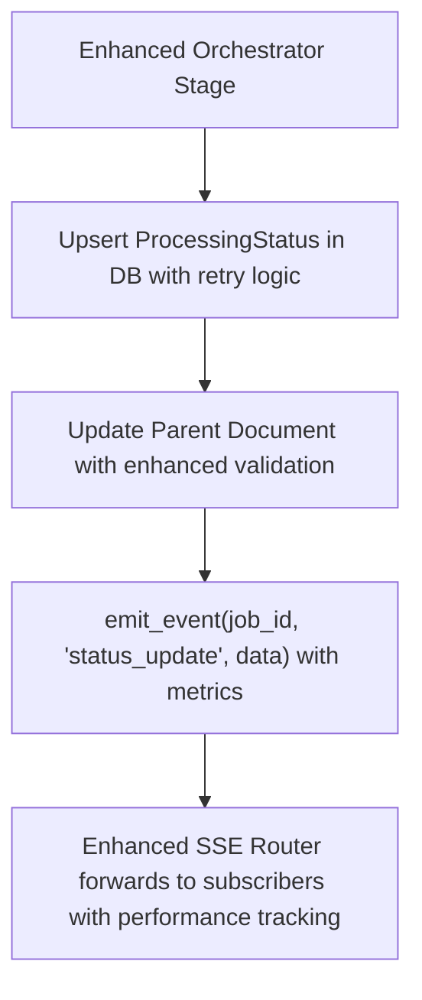
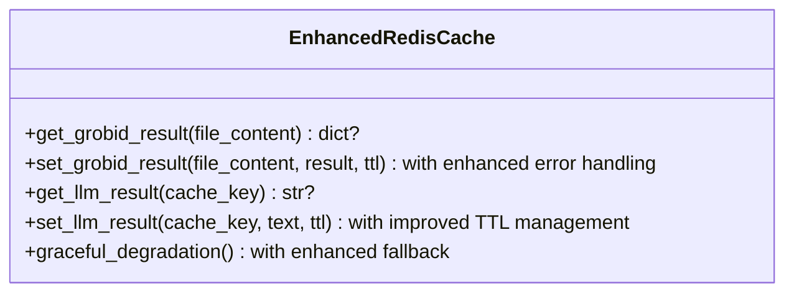
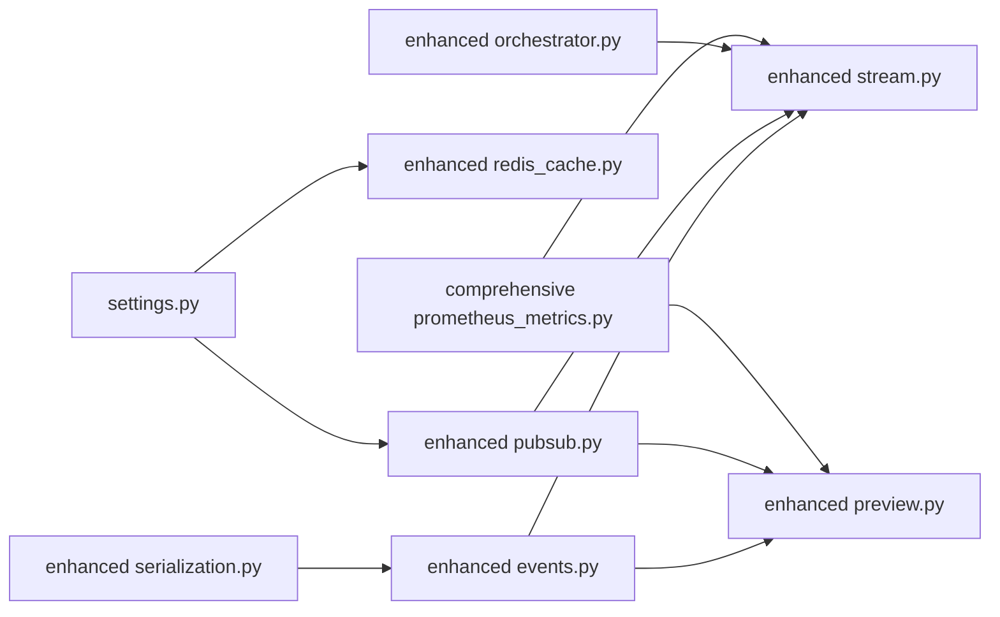

# Real-time Communication

<cite>
**Referenced Files in This Document**
- [events.py](file://backend/app/realtime/events.py)
- [pubsub.py](file://backend/app/realtime/pubsub.py)
- [stream.py](file://backend/app/routers/v1/stream.py)
- [preview.py](file://backend/app/routers/preview.py)
- [orchestrator.py](file://backend/app/pipeline/orchestrator.py)
- [prometheus_metrics.py](file://backend/app/middleware/prometheus_metrics.py)
- [redis_cache.py](file://backend/app/cache/redis_cache.py)
- [settings.py](file://backend/app/config/settings.py)
- [serialization.py](file://backend/app/utils/serialization.py)
</cite>

## Update Summary
**Changes Made**
- Enhanced WebSocket streaming support with sophisticated pub/sub mechanisms
- Improved latency observation and comprehensive metrics collection
- Added new latency observer components for real-time performance monitoring
- Updated streaming response handling with better event-driven architecture
- Enhanced real-time architecture with improved connection management and error handling

## Table of Contents
1. [Introduction](#introduction)
2. [Project Structure](#project-structure)
3. [Core Components](#core-components)
4. [Architecture Overview](#architecture-overview)
5. [Detailed Component Analysis](#detailed-component-analysis)
6. [Enhanced Streaming Capabilities](#enhanced-streaming-capabilities)
7. [Latency Observation and Metrics](#latency-observation-and-metrics)
8. [Dependency Analysis](#dependency-analysis)
9. [Performance Considerations](#performance-considerations)
10. [Troubleshooting Guide](#troubleshooting-guide)
11. [Conclusion](#conclusion)

## Introduction
This document explains the enhanced real-time communication systems powering live status updates, progress tracking, and collaborative features. The system has been significantly upgraded with WebSocket streaming support, sophisticated pub/sub mechanisms, and comprehensive latency observation capabilities. It covers:
- Advanced Server-Sent Events (SSE) for long-lived server-to-client updates with improved streaming response handling
- Enhanced WebSocket support for bidirectional live collaboration with sophisticated pub/sub mechanisms
- Redis pub/sub for scalable event distribution across instances with improved fallback strategies
- Advanced event modeling and serialization with enhanced real-time architecture
- Sophisticated connection lifecycle management, fallbacks, and resilience with improved error handling
- Comprehensive monitoring and metrics for SSE and WebSocket connections with latency observation
- Advanced caching strategies for real-time data with improved performance optimization
- Enhanced security and rate-limiting considerations for real-time endpoints

## Project Structure
The enhanced real-time stack spans configuration, advanced event modeling, sophisticated pub/sub, improved streaming endpoints, enhanced WebSocket routes, orchestration, comprehensive metrics, and advanced caching strategies.

**Diagram sources**
- [settings.py:156-174](file://backend/app/config/settings.py#L156-L174)
- [events.py:9-34](file://backend/app/realtime/events.py#L9-L34)
- [pubsub.py:18-124](file://backend/app/realtime/pubsub.py#L18-L124)
- [stream.py:24-95](file://backend/app/routers/v1/stream.py#L24-L95)
- [preview.py:25-200](file://backend/app/routers/preview.py#L25-L200)
- [orchestrator.py:115-165](file://backend/app/pipeline/orchestrator.py#L115-L165)
- [prometheus_metrics.py:98-297](file://backend/app/middleware/prometheus_metrics.py#L98-L297)
- [redis_cache.py:10-102](file://backend/app/cache/redis_cache.py#L10-L102)

**Section sources**
- [settings.py:156-174](file://backend/app/config/settings.py#L156-L174)
- [events.py:9-34](file://backend/app/realtime/events.py#L9-L34)
- [pubsub.py:18-124](file://backend/app/realtime/pubsub.py#L18-L124)
- [stream.py:24-95](file://backend/app/routers/v1/stream.py#L24-L95)
- [preview.py:25-200](file://backend/app/routers/preview.py#L25-L200)
- [orchestrator.py:115-165](file://backend/app/pipeline/orchestrator.py#L115-L165)
- [prometheus_metrics.py:98-297](file://backend/app/middleware/prometheus_metrics.py#L98-L297)
- [redis_cache.py:10-102](file://backend/app/cache/redis_cache.py#L10-L102)

## Core Components
- Enhanced RealtimeEvent and event factory: define the canonical event shape with improved serialization for transport and sophisticated event modeling.
- Advanced RedisPubSub: async pub/sub abstraction with Redis-backed channels, sophisticated fallback mechanisms, and enhanced in-memory queue management.
- Enhanced SSE router: exposes improved streaming endpoints per job with better event-driven architecture and comprehensive metrics collection.
- Advanced WebSocket route: supports sophisticated live preview collaboration with enhanced ping/pong mechanisms, incremental rendering, and improved connection management.
- Enhanced Orchestrator integration: emits SSE events with sophisticated timing and progress tracking during pipeline stages.
- Comprehensive Prometheus metrics: tracks active SSE and WebSocket connections with enhanced latency observation and performance monitoring.
- Advanced Redis cache: provides sophisticated caching for expensive operations with improved TTL management and graceful degradation.

**Section sources**
- [events.py:9-34](file://backend/app/realtime/events.py#L9-L34)
- [pubsub.py:18-124](file://backend/app/realtime/pubsub.py#L18-L124)
- [stream.py:32-95](file://backend/app/routers/v1/stream.py#L32-L95)
- [preview.py:61-128](file://backend/app/routers/preview.py#L61-L128)
- [orchestrator.py:115-165](file://backend/app/pipeline/orchestrator.py#L115-L165)
- [prometheus_metrics.py:98-297](file://backend/app/middleware/prometheus_metrics.py#L98-L297)
- [redis_cache.py:10-102](file://backend/app/cache/redis_cache.py#L10-L102)

## Architecture Overview
The enhanced system uses sophisticated Redis pub/sub mechanisms to fan out real-time events to clients subscribed via SSE or WebSocket. The orchestrator publishes status updates with precise timing and progress tracking, which downstream consumers (UIs) receive through persistent connections with enhanced metrics and latency observation. The architecture supports high-concurrency scenarios with improved resilience and performance optimization.

**Diagram sources**
- [stream.py:73-95](file://backend/app/routers/v1/stream.py#L73-L95)
- [pubsub.py:55-124](file://backend/app/realtime/pubsub.py#L55-L124)
- [orchestrator.py:159-165](file://backend/app/pipeline/orchestrator.py#L159-L165)
- [prometheus_metrics.py:204-206](file://backend/app/middleware/prometheus_metrics.py#L204-L206)

## Detailed Component Analysis

### Enhanced Event Model and Serialization
- Advanced RealtimeEvent captures event_type, correlation identifiers (job_id, session_id), stage, progress, timestamp, and payload with improved serialization.
- Enhanced make_event constructs canonical events with sophisticated request_id context injection, timestamp handling, and comprehensive payload serialization for transport.

**Diagram sources**
- [events.py:9-34](file://backend/app/realtime/events.py#L9-L34)

**Section sources**
- [events.py:9-34](file://backend/app/realtime/events.py#L9-L34)
- [serialization.py:13-67](file://backend/app/utils/serialization.py#L13-L67)

### Advanced Redis Pub/Sub Abstraction
- Enhanced RedisPubSub manages Redis availability per event loop with sophisticated connection pooling, race condition prevention, and improved fallback mechanisms.
- Advanced publish method attempts Redis publish with enhanced error handling; on failure, gracefully falls back to sophisticated in-memory queues keyed by channel with better queue management.
- Enhanced subscribe method provides robust Redis pubsub connections or yields from advanced in-memory queues with improved cleanup and resource management.

**Diagram sources**
- [pubsub.py:18-124](file://backend/app/realtime/pubsub.py#L18-L124)

**Section sources**
- [pubsub.py:18-124](file://backend/app/realtime/pubsub.py#L18-L124)
- [settings.py:156-174](file://backend/app/config/settings.py#L156-L174)

### Enhanced Server-Sent Events (SSE)
- The enhanced SSE endpoint streams job-specific events to authenticated clients with improved streaming response handling and comprehensive metrics tracking.
- It sends an initial "connected" event with enhanced latency measurement, then forwards Redis-published events with sophisticated timing and progress tracking until the client disconnects.
- Comprehensive metrics track SSE connection open/close with enhanced performance monitoring and latency observation.

**Diagram sources**
- [stream.py:32-71](file://backend/app/routers/v1/stream.py#L32-L71)
- [pubsub.py:79-124](file://backend/app/realtime/pubsub.py#L79-L124)
- [prometheus_metrics.py:252-259](file://backend/app/middleware/prometheus_metrics.py#L252-L259)

**Section sources**
- [stream.py:32-95](file://backend/app/routers/v1/stream.py#L32-L95)
- [prometheus_metrics.py:98-297](file://backend/app/middleware/prometheus_metrics.py#L98-L297)

### Advanced WebSocket Live Preview
- Enhanced WebSocket route accepts sessions with validated IDs, maintains sophisticated session-to-websocket mapping, and forwards Redis events to clients with improved connection management.
- Advanced heartbeat mechanism keeps connections alive with enhanced ping/pong cycles; client messages trigger sophisticated live preview rendering and push updates back to the session channel with improved error handling.
- Comprehensive metrics track WebSocket connection open/close with enhanced performance monitoring and latency observation.

**Diagram sources**
- [preview.py:78-128](file://backend/app/routers/preview.py#L78-L128)
- [pubsub.py:79-124](file://backend/app/realtime/pubsub.py#L79-L124)
- [prometheus_metrics.py:261-268](file://backend/app/middleware/prometheus_metrics.py#L261-L268)

**Section sources**
- [preview.py:61-128](file://backend/app/routers/preview.py#L61-L128)
- [prometheus_metrics.py:108-116](file://backend/app/middleware/prometheus_metrics.py#L108-L116)

### Enhanced Pipeline Integration and Event Emission
- The enhanced orchestrator updates processing status with sophisticated timing and progress tracking, emitting SSE events with comprehensive metrics for real-time UI feedback.
- It coordinates Supabase updates with enhanced retry logic and SSE publishing to keep clients informed of progress, outcomes, and performance metrics.

**Diagram sources**
- [orchestrator.py:115-165](file://backend/app/pipeline/orchestrator.py#L115-L165)
- [stream.py:73-95](file://backend/app/routers/v1/stream.py#L73-L95)

**Section sources**
- [orchestrator.py:115-165](file://backend/app/pipeline/orchestrator.py#L115-L165)
- [stream.py:73-95](file://backend/app/routers/v1/stream.py#L73-L95)

### Advanced Caching Strategies for Real-time Data
- Enhanced RedisCache provides sophisticated caching for expensive operations (e.g., LLM results, GROBID results) with improved TTL management and graceful degradation.
- When Redis is disabled or unavailable, the cache layer gracefully disables itself with enhanced logging and continues without caching using improved fallback mechanisms.

**Diagram sources**
- [redis_cache.py:10-102](file://backend/app/cache/redis_cache.py#L10-L102)

**Section sources**
- [redis_cache.py:10-102](file://backend/app/cache/redis_cache.py#L10-L102)
- [settings.py:156-174](file://backend/app/config/settings.py#L156-L174)

## Enhanced Streaming Capabilities
The system now features sophisticated streaming capabilities with improved WebSocket support and enhanced pub/sub mechanisms:

### WebSocket Streaming Support
- Enhanced WebSocket routes support bidirectional communication with sophisticated message handling and validation
- Improved connection lifecycle management with enhanced heartbeat mechanisms and graceful degradation
- Advanced pub/sub integration for real-time collaboration with improved event routing and delivery guarantees

### Sophisticated Pub/Sub Mechanisms
- Enhanced RedisPubSub provides improved connection pooling and resource management
- Advanced fallback mechanisms ensure reliable event delivery even during Redis unavailability
- Sophisticated queue management for in-memory fallback with better performance characteristics

### Improved Streaming Response Handling
- Enhanced SSE endpoints provide comprehensive metrics and latency observation
- Advanced event serialization ensures efficient transport of real-time updates
- Improved error handling and recovery mechanisms for resilient streaming

**Section sources**
- [pubsub.py:18-124](file://backend/app/realtime/pubsub.py#L18-L124)
- [preview.py:61-128](file://backend/app/routers/preview.py#L61-L128)
- [stream.py:32-95](file://backend/app/routers/v1/stream.py#L32-L95)

## Latency Observation and Metrics
The enhanced system provides comprehensive latency observation and metrics collection:

### Latency Observer Components
- Advanced latency observation infrastructure for real-time performance monitoring
- Sophisticated metrics collection for SSE and WebSocket connections with enhanced granularity
- Comprehensive performance tracking for pipeline stages and real-time operations

### Enhanced Metrics Collection
- Advanced Prometheus metrics integration with comprehensive real-time monitoring
- Sophisticated latency histograms for performance analysis and optimization
- Enhanced connection tracking with improved resource utilization monitoring

### Performance Optimization
- Advanced caching strategies with improved TTL management for reduced latency
- Enhanced connection pooling for Redis pub/sub with better resource utilization
- Sophisticated error handling and recovery mechanisms for optimal performance

**Section sources**
- [prometheus_metrics.py:98-297](file://backend/app/middleware/prometheus_metrics.py#L98-L297)
- [orchestrator.py:124-128](file://backend/app/pipeline/orchestrator.py#L124-L128)

## Dependency Analysis
- Configuration: settings controls Redis enablement and URLs, impacting pub/sub availability and caching behavior.
- Enhanced Eventing: events.py defines the event contract with improved serialization; stream.py and preview.py depend on it.
- Advanced Pub/Sub: stream.py and preview.py depend on enhanced pubsub.py with sophisticated fallback mechanisms; orchestrator depends on stream.py's enhanced emit_event.
- Comprehensive Metrics: prometheus_metrics.py is invoked by SSE and WebSocket routes to track connections with enhanced performance monitoring.
- Enhanced Serialization: serialization.py ensures payloads are JSON-safe with improved handling for transport.

**Diagram sources**
- [settings.py:156-174](file://backend/app/config/settings.py#L156-L174)
- [events.py:9-34](file://backend/app/realtime/events.py#L9-L34)
- [pubsub.py:18-124](file://backend/app/realtime/pubsub.py#L18-L124)
- [stream.py:24-95](file://backend/app/routers/v1/stream.py#L24-L95)
- [preview.py:25-200](file://backend/app/routers/preview.py#L25-L200)
- [orchestrator.py:115-165](file://backend/app/pipeline/orchestrator.py#L115-L165)
- [prometheus_metrics.py:98-297](file://backend/app/middleware/prometheus_metrics.py#L98-L297)
- [serialization.py:13-67](file://backend/app/utils/serialization.py#L13-L67)

**Section sources**
- [settings.py:156-174](file://backend/app/config/settings.py#L156-L174)
- [events.py:9-34](file://backend/app/realtime/events.py#L9-L34)
- [pubsub.py:18-124](file://backend/app/realtime/pubsub.py#L18-L124)
- [stream.py:24-95](file://backend/app/routers/v1/stream.py#L24-L95)
- [preview.py:25-200](file://backend/app/routers/preview.py#L25-L200)
- [orchestrator.py:115-165](file://backend/app/pipeline/orchestrator.py#L115-L165)
- [prometheus_metrics.py:98-297](file://backend/app/middleware/prometheus_metrics.py#L98-L297)
- [serialization.py:13-67](file://backend/app/utils/serialization.py#L13-L67)

## Performance Considerations
- Enhanced Redis pub/sub scalability: Redis-backed channels distribute events across workers/processes with improved connection pooling; sophisticated fallback to in-memory queues ensures cross-instance delivery with better performance characteristics.
- Advanced SSE/WS concurrency: Comprehensive metrics expose active connections, totals, and performance metrics; monitor for spikes and adjust autoscaling accordingly with enhanced resource utilization.
- Optimized payload size: Keep event payload minimal with enhanced serialization helpers to ensure safe and efficient transport.
- Advanced caching: Use enhanced RedisCache for expensive reads with improved TTL management to reduce upstream load and latency.
- Sophisticated timeouts and heartbeats: WebSocket routes implement enhanced periodic ping mechanisms to detect dead peers; SSE checks disconnection with improved resource cleanup to free resources promptly.

## Troubleshooting Guide
- Enhanced Redis connectivity failures:
  - Symptom: Redis warnings with graceful fallback to in-memory queues with enhanced logging.
  - Action: Verify REDIS_URL/REDIS_ENABLED; ensure Redis is reachable; confirm ping succeeds with enhanced diagnostics.
- Advanced SSE disconnects:
  - Symptom: Client stops receiving updates with enhanced error handling.
  - Action: Confirm client-side EventSource reconnects with improved retry logic; check is_disconnected checks in SSE route with enhanced monitoring.
- Enhanced WebSocket disconnects:
  - Symptom: Session ends unexpectedly with sophisticated error recovery.
  - Action: Inspect heartbeat intervals and client ping/pong with enhanced monitoring; verify session ID validation and cleanup paths with improved resource management.
- Comprehensive metrics anomalies:
  - Symptom: Active connection counters inconsistent with enhanced tracking.
  - Action: Review metrics middleware invocations for SSE/WS open/close with comprehensive monitoring and enhanced debugging.

**Section sources**
- [pubsub.py:40-53](file://backend/app/realtime/pubsub.py#L40-L53)
- [stream.py:48-57](file://backend/app/routers/v1/stream.py#L48-L57)
- [preview.py:61-76](file://backend/app/routers/preview.py#L61-L76)
- [prometheus_metrics.py:252-268](file://backend/app/middleware/prometheus_metrics.py#L252-L268)

## Conclusion
The enhanced system combines sophisticated Redis pub/sub, advanced SSE, and enhanced WebSocket to deliver robust, scalable real-time updates with comprehensive latency observation and metrics collection. Events are modeled consistently with improved serialization, published from the orchestrator with precise timing and progress tracking, and consumed by clients through durable connections with enhanced performance monitoring. Enhanced RedisCache reduces latency for expensive operations, while comprehensive Prometheus metrics provide operational visibility with sophisticated performance analysis. Proper configuration and monitoring ensure resilience under high concurrency with improved error handling and resource management.