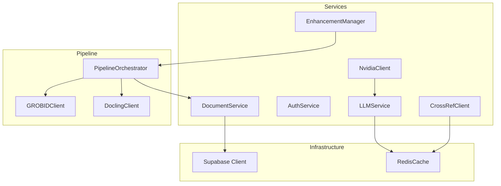
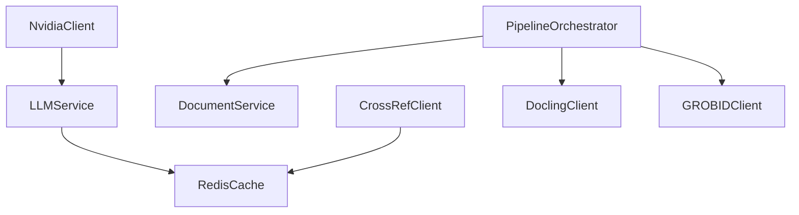
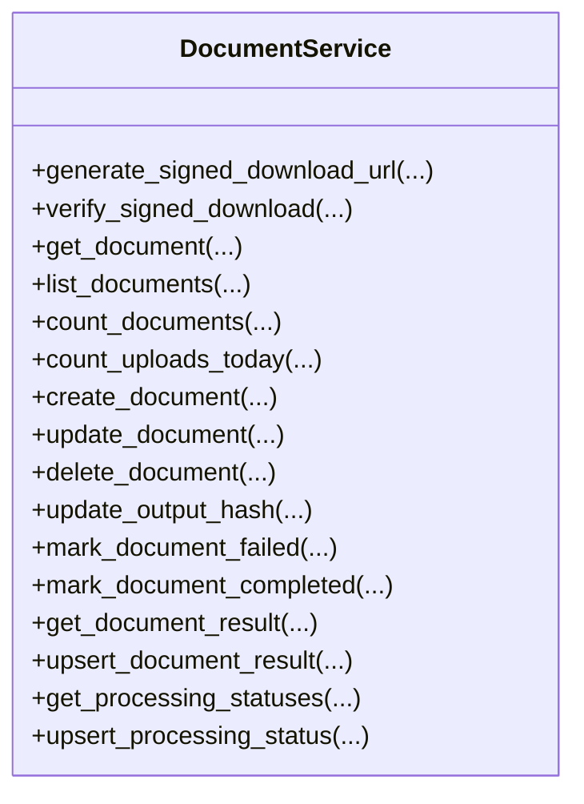
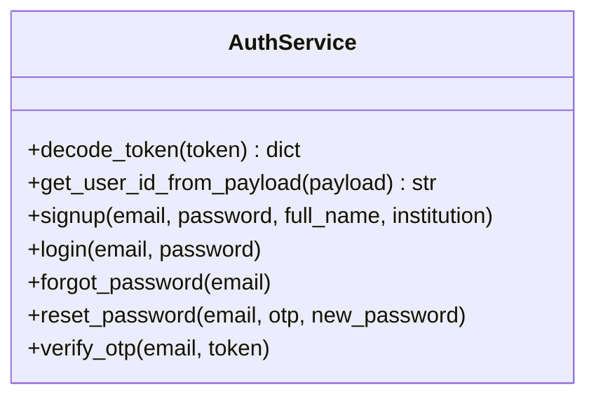
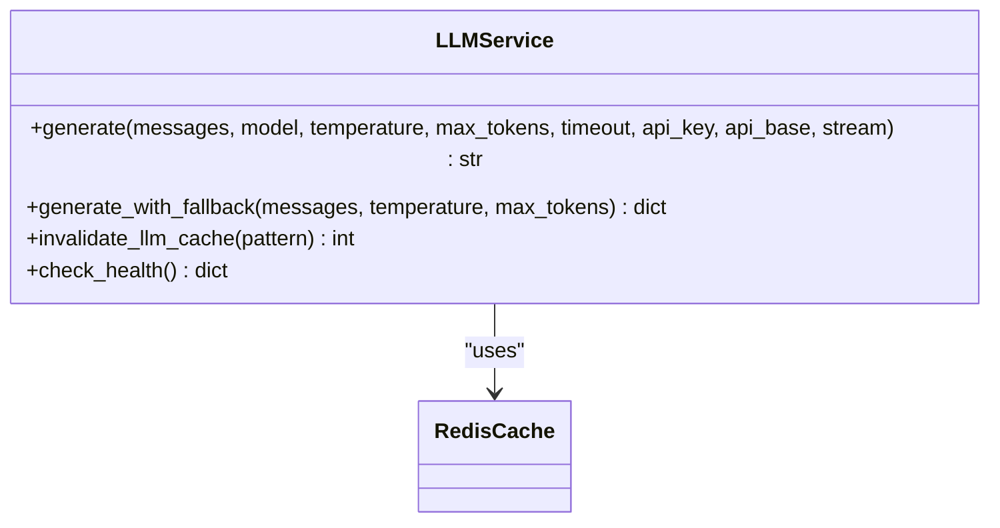
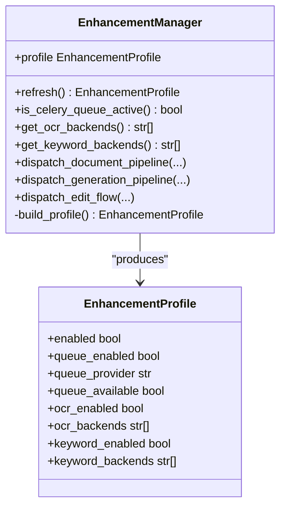
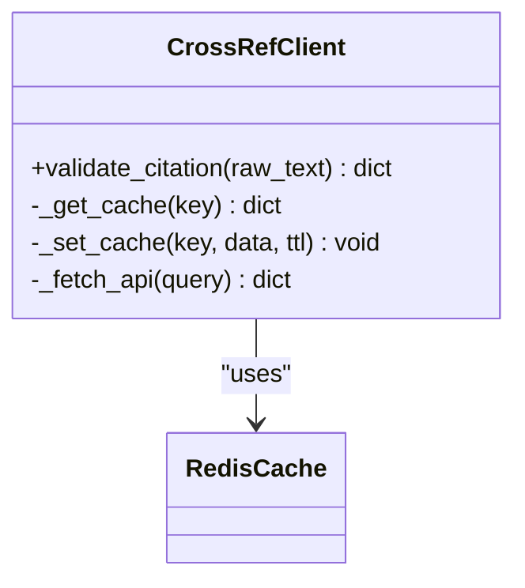
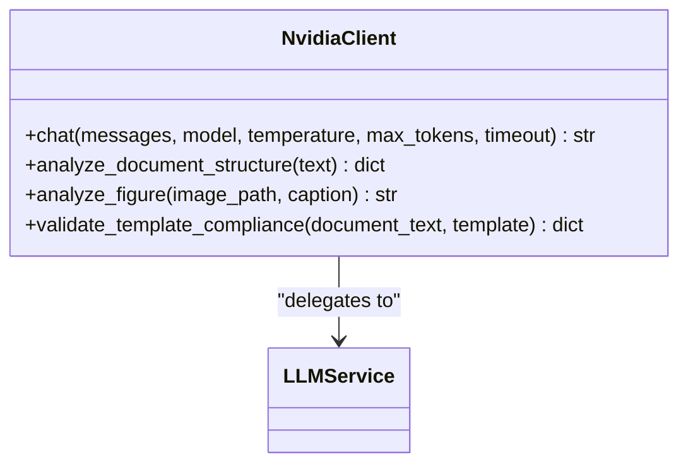
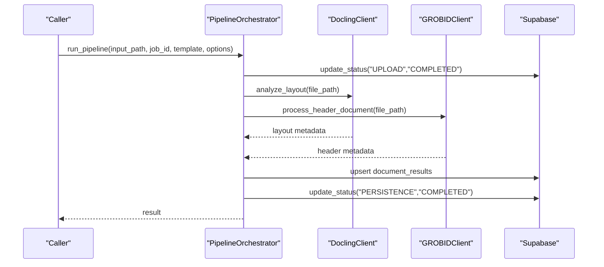
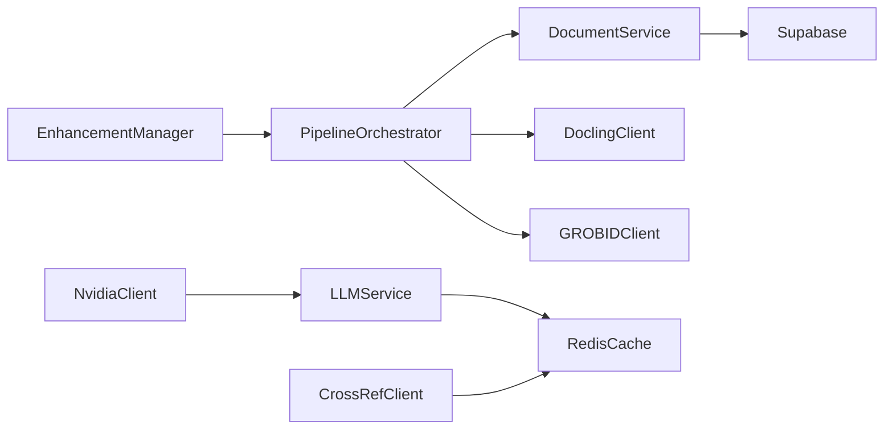

# Service Layer Architecture

<cite>
**Referenced Files in This Document**
- [document_service.py](file://backend/app/services/document_service.py)
- [auth_service.py](file://backend/app/services/auth_service.py)
- [llm_service.py](file://backend/app/services/llm_service.py)
- [enhancement_manager.py](file://backend/app/services/enhancement_manager.py)
- [crossref_client.py](file://backend/app/services/crossref_client.py)
- [nvidia_client.py](file://backend/app/services/nvidia_client.py)
- [redis_cache.py](file://backend/app/cache/redis_cache.py)
- [orchestrator.py](file://backend/app/pipeline/orchestrator.py)
- [docling_client.py](file://backend/app/pipeline/services/docling_client.py)
- [grobid_client.py](file://backend/app/pipeline/services/grobid_client.py)
- [singleton.py](file://backend/app/utils/singleton.py)
</cite>

## Table of Contents
1. [Introduction](#introduction)
2. [Project Structure](#project-structure)
3. [Core Components](#core-components)
4. [Architecture Overview](#architecture-overview)
5. [Detailed Component Analysis](#detailed-component-analysis)
6. [Dependency Analysis](#dependency-analysis)
7. [Performance Considerations](#performance-considerations)
8. [Troubleshooting Guide](#troubleshooting-guide)
9. [Conclusion](#conclusion)

## Introduction
This document describes the service layer architecture and business logic implementation for the automated manuscript formatter backend. It focuses on the service abstraction pattern, dependency injection mechanisms, and lifecycle management across core services such as document processing, authentication, LLM integration, enhancement management, and external API clients. It also explains service interfaces, error handling patterns, transaction management, caching strategies, configuration, testing approaches, and integration with the pipeline system. Additional topics include service isolation, fault tolerance, and monitoring requirements.

## Project Structure
The service layer is organized under backend/app/services and integrates with pipeline orchestration, caching, and utilities. Key areas:
- Services: document_service, auth_service, llm_service, enhancement_manager, crossref_client, nvidia_client
- Pipeline: orchestrator coordinates processing stages and integrates external clients
- Cache: redis_cache provides shared caching for LLM and GROBID results
- Utilities: singleton utilities support safe initialization and optional dependencies

**Diagram sources**
- [document_service.py:34-560](file://backend/app/services/document_service.py#L34-L560)
- [auth_service.py:56-183](file://backend/app/services/auth_service.py#L56-L183)
- [llm_service.py:1-393](file://backend/app/services/llm_service.py#L1-L393)
- [enhancement_manager.py:78-294](file://backend/app/services/enhancement_manager.py#L78-L294)
- [crossref_client.py:32-164](file://backend/app/services/crossref_client.py#L32-L164)
- [nvidia_client.py:30-260](file://backend/app/services/nvidia_client.py#L30-L260)
- [redis_cache.py:10-102](file://backend/app/cache/redis_cache.py#L10-L102)
- [orchestrator.py:73-1227](file://backend/app/pipeline/orchestrator.py#L73-L1227)
- [docling_client.py:143-482](file://backend/app/pipeline/services/docling_client.py#L143-L482)
- [grobid_client.py:25-317](file://backend/app/pipeline/services/grobid_client.py#L25-L317)

**Section sources**
- [document_service.py:1-560](file://backend/app/services/document_service.py#L1-L560)
- [auth_service.py:1-183](file://backend/app/services/auth_service.py#L1-L183)
- [llm_service.py:1-393](file://backend/app/services/llm_service.py#L1-L393)
- [enhancement_manager.py:1-294](file://backend/app/services/enhancement_manager.py#L1-L294)
- [crossref_client.py:1-164](file://backend/app/services/crossref_client.py#L1-L164)
- [nvidia_client.py:1-260](file://backend/app/services/nvidia_client.py#L1-L260)
- [redis_cache.py:1-102](file://backend/app/cache/redis_cache.py#L1-L102)
- [orchestrator.py:1-1227](file://backend/app/pipeline/orchestrator.py#L1-L1227)
- [docling_client.py:1-482](file://backend/app/pipeline/services/docling_client.py#L1-L482)
- [grobid_client.py:1-317](file://backend/app/pipeline/services/grobid_client.py#L1-L317)
- [singleton.py:1-72](file://backend/app/utils/singleton.py#L1-L72)

## Core Components
- DocumentService: Centralized database operations for documents, results, and processing status using Supabase client. Provides CRUD, status updates, and integrity helpers.
- AuthService: Authentication service backed by Supabase Auth, JWT decoding, and user session management.
- LLMService: Unified LLM access via LiteLLM with fallback to direct provider clients, input sanitization, caching, and metrics.
- EnhancementManager: Capability discovery and graceful fallback for optional enhancements (queues, OCR, keyword extraction).
- CrossRefClient: Distributed caching for CrossRef metadata validation with Redis and in-memory fallback.
- NvidiaClient: NVIDIA NIM integration with LiteLLM or direct OpenAI client, including vision and structured analysis.
- RedisCache: Shared caching for LLM and GROBID results with connection resilience and TTL controls.
- PipelineOrchestrator: Coordinates the full document processing pipeline, integrating external clients and persisting status/results.
- DoclingClient/GROBIDClient: Optional external clients for layout analysis and metadata extraction with availability checks and safe execution wrappers.

**Section sources**
- [document_service.py:34-560](file://backend/app/services/document_service.py#L34-L560)
- [auth_service.py:56-183](file://backend/app/services/auth_service.py#L56-L183)
- [llm_service.py:1-393](file://backend/app/services/llm_service.py#L1-L393)
- [enhancement_manager.py:78-294](file://backend/app/services/enhancement_manager.py#L78-L294)
- [crossref_client.py:32-164](file://backend/app/services/crossref_client.py#L32-L164)
- [nvidia_client.py:30-260](file://backend/app/services/nvidia_client.py#L30-L260)
- [redis_cache.py:10-102](file://backend/app/cache/redis_cache.py#L10-L102)
- [orchestrator.py:73-1227](file://backend/app/pipeline/orchestrator.py#L73-L1227)
- [docling_client.py:143-482](file://backend/app/pipeline/services/docling_client.py#L143-L482)
- [grobid_client.py:25-317](file://backend/app/pipeline/services/grobid_client.py#L25-L317)

## Architecture Overview
The service layer follows a layered architecture:
- Abstraction: Each service encapsulates a domain concern (documents, auth, LLM, enhancements, external APIs).
- Dependency Injection: Services rely on configuration-driven settings and shared utilities (e.g., Redis cache, Supabase client).
- Lifecycle Management: Services are initialized lazily or as singletons, with guarded fallbacks when dependencies are unavailable.
- Integration: PipelineOrchestrator composes services and external clients, ensuring robustness via timeouts, retries, and partial result persistence.

**Diagram sources**
- [orchestrator.py:73-1227](file://backend/app/pipeline/orchestrator.py#L73-L1227)
- [document_service.py:34-560](file://backend/app/services/document_service.py#L34-L560)
- [llm_service.py:1-393](file://backend/app/services/llm_service.py#L1-L393)
- [redis_cache.py:10-102](file://backend/app/cache/redis_cache.py#L10-L102)
- [crossref_client.py:32-164](file://backend/app/services/crossref_client.py#L32-L164)
- [nvidia_client.py:30-260](file://backend/app/services/nvidia_client.py#L30-L260)
- [docling_client.py:143-482](file://backend/app/pipeline/services/docling_client.py#L143-L482)
- [grobid_client.py:25-317](file://backend/app/pipeline/services/grobid_client.py#L25-L317)

## Detailed Component Analysis

### DocumentService
Responsibilities:
- Manage document lifecycle: creation, updates, deletion, and archival cleanup.
- Persist processing status per pipeline phase.
- Store and retrieve document results and validation outcomes.
- Integrity helpers: signed download URLs, output hash updates, and failure marking.

Key patterns:
- Supabase client access via a factory method.
- Defensive programming: graceful degradation when optional schema fields are missing.
- Logging with structured extras for observability.

**Diagram sources**
- [document_service.py:34-560](file://backend/app/services/document_service.py#L34-L560)

**Section sources**
- [document_service.py:34-560](file://backend/app/services/document_service.py#L34-L560)

### AuthService
Responsibilities:
- JWT decoding and verification.
- User registration, login, password reset, and OTP verification via Supabase Auth.
- Runtime availability checks and controlled failures when credentials are missing.

Key patterns:
- Conditional client initialization with warnings and graceful HTTP 503 when not configured.
- Consistent error wrapping with HTTPException for API consumers.

**Diagram sources**
- [auth_service.py:56-183](file://backend/app/services/auth_service.py#L56-L183)

**Section sources**
- [auth_service.py:1-183](file://backend/app/services/auth_service.py#L1-L183)

### LLMService
Responsibilities:
- Unified LLM access via LiteLLM with fallback to direct provider clients.
- Input sanitization and injection guards.
- LLM result caching with Redis and metrics emission.
- Multi-tier fallback strategy for reliability.

Key patterns:
- Provider inference and per-provider API key/base resolution.
- Streaming vs. cached generation decisions.
- Health checks for providers and model availability.

**Diagram sources**
- [llm_service.py:91-393](file://backend/app/services/llm_service.py#L91-L393)
- [redis_cache.py:77-98](file://backend/app/cache/redis_cache.py#L77-L98)

**Section sources**
- [llm_service.py:1-393](file://backend/app/services/llm_service.py#L1-L393)
- [redis_cache.py:1-102](file://backend/app/cache/redis_cache.py#L1-L102)

### EnhancementManager
Responsibilities:
- Discover and profile optional capabilities (queues, OCR backends, keyword extraction).
- Dispatch pipeline jobs to Celery when available, with graceful fallback to background tasks.
- Maintain a stable profile derived from settings and runtime availability.

Key patterns:
- Feature-flag resolution and module availability checks.
- Queue provider selection with Redis/Celery readiness.
- Backend preference lists with automatic fallback.

**Diagram sources**
- [enhancement_manager.py:78-294](file://backend/app/services/enhancement_manager.py#L78-L294)

**Section sources**
- [enhancement_manager.py:1-294](file://backend/app/services/enhancement_manager.py#L1-L294)

### CrossRefClient
Responsibilities:
- Validate raw citation strings against CrossRef API.
- Distributed caching with Redis and in-memory fallback.
- Rate-limit aware retries and bounded instance cache.

Key patterns:
- Redis ping and fallback to in-memory cache when unavailable.
- Local instance cache with eviction to prevent unbounded growth.

**Diagram sources**
- [crossref_client.py:32-164](file://backend/app/services/crossref_client.py#L32-L164)
- [redis_cache.py:45-76](file://backend/app/cache/redis_cache.py#L45-L76)

**Section sources**
- [crossref_client.py:1-164](file://backend/app/services/crossref_client.py#L1-L164)
- [redis_cache.py:1-102](file://backend/app/cache/redis_cache.py#L1-L102)

### NvidiaClient
Responsibilities:
- Integrate with NVIDIA NIM via LiteLLM or direct OpenAI client.
- Provide higher-level methods for document structure analysis, figure analysis, and template compliance checks.
- Graceful degraded mode when API key is missing.

Key patterns:
- Lazy initialization with fallback to direct client when LiteLLM is unavailable.
- Vision preprocessing and compression for large images.

**Diagram sources**
- [nvidia_client.py:30-260](file://backend/app/services/nvidia_client.py#L30-L260)
- [llm_service.py:91-203](file://backend/app/services/llm_service.py#L91-L203)

**Section sources**
- [nvidia_client.py:1-260](file://backend/app/services/nvidia_client.py#L1-L260)
- [llm_service.py:1-393](file://backend/app/services/llm_service.py#L1-L393)

### PipelineOrchestrator
Responsibilities:
- Orchestrate the end-to-end document processing pipeline.
- Integrate external clients (Docling, GROBID) with timeouts and fallbacks.
- Persist processing status and results to Supabase.
- Compute quality metrics and explain validation outcomes.

Key patterns:
- Semaphore-based concurrency control to prevent resource exhaustion.
- Retry guards and safe execution wrappers around optional stages.
- Partial result persistence on failure for diagnostic and recovery.

**Diagram sources**
- [orchestrator.py:522-1092](file://backend/app/pipeline/orchestrator.py#L522-L1092)
- [docling_client.py:192-284](file://backend/app/pipeline/services/docling_client.py#L192-L284)
- [grobid_client.py:53-91](file://backend/app/pipeline/services/grobid_client.py#L53-L91)

**Section sources**
- [orchestrator.py:1-1227](file://backend/app/pipeline/orchestrator.py#L1-L1227)
- [docling_client.py:1-482](file://backend/app/pipeline/services/docling_client.py#L1-L482)
- [grobid_client.py:1-317](file://backend/app/pipeline/services/grobid_client.py#L1-L317)

## Dependency Analysis
- Coupling:
  - Services depend on configuration and shared utilities (settings, logging, Redis).
  - PipelineOrchestrator depends on multiple services and external clients.
  - LLMService and CrossRefClient depend on RedisCache for caching.
- Cohesion:
  - Each service encapsulates a single responsibility (documents, auth, LLM, enhancements, external APIs).
- External dependencies:
  - Supabase for persistence and JWT verification.
  - Redis for caching and optional queues.
  - Third-party providers (NVIDIA NIM, GROBID, Docling) with availability checks and safe execution.

**Diagram sources**
- [orchestrator.py:73-1227](file://backend/app/pipeline/orchestrator.py#L73-L1227)
- [document_service.py:34-560](file://backend/app/services/document_service.py#L34-L560)
- [llm_service.py:1-393](file://backend/app/services/llm_service.py#L1-L393)
- [redis_cache.py:10-102](file://backend/app/cache/redis_cache.py#L10-L102)
- [crossref_client.py:32-164](file://backend/app/services/crossref_client.py#L32-L164)
- [nvidia_client.py:30-260](file://backend/app/services/nvidia_client.py#L30-L260)
- [docling_client.py:143-482](file://backend/app/pipeline/services/docling_client.py#L143-L482)
- [grobid_client.py:25-317](file://backend/app/pipeline/services/grobid_client.py#L25-L317)
- [enhancement_manager.py:78-294](file://backend/app/services/enhancement_manager.py#L78-L294)

**Section sources**
- [orchestrator.py:1-1227](file://backend/app/pipeline/orchestrator.py#L1-L1227)
- [document_service.py:1-560](file://backend/app/services/document_service.py#L1-L560)
- [llm_service.py:1-393](file://backend/app/services/llm_service.py#L1-L393)
- [redis_cache.py:1-102](file://backend/app/cache/redis_cache.py#L1-L102)
- [crossref_client.py:1-164](file://backend/app/services/crossref_client.py#L1-L164)
- [nvidia_client.py:1-260](file://backend/app/services/nvidia_client.py#L1-L260)
- [docling_client.py:1-482](file://backend/app/pipeline/services/docling_client.py#L1-L482)
- [grobid_client.py:1-317](file://backend/app/pipeline/services/grobid_client.py#L1-L317)
- [enhancement_manager.py:1-294](file://backend/app/services/enhancement_manager.py#L1-L294)

## Performance Considerations
- Concurrency control: PipelineOrchestrator uses a semaphore to cap concurrent jobs and avoid OOM.
- Caching: LLM and GROBID results cached in Redis to reduce latency and external API load.
- Timeouts: Stages executed with bounded timeouts; timeouts trigger graceful cancellation and partial result persistence.
- Optional enhancements: Feature flags and availability checks prevent unnecessary overhead.
- Memory hygiene: Instance caches with eviction and short-lived sessions minimize memory footprint.

[No sources needed since this section provides general guidance]

## Troubleshooting Guide
Common issues and mitigations:
- Supabase client unavailable: DocumentService logs errors and returns None; ensure credentials and connectivity.
- LLM unavailability: LLMService falls back through tiers and records metrics; verify provider keys and base URLs.
- Redis unavailable: RedisCache disables caching gracefully; services continue operating.
- External clients not available: Docling/GROBID clients return empty metadata; pipeline proceeds with heuristics.
- Pipeline timeouts: Stages enforce timeouts; partial results are persisted for diagnosis.
- Authentication misconfiguration: AuthService returns HTTP 503 until credentials are provided.

**Section sources**
- [document_service.py:90-113](file://backend/app/services/document_service.py#L90-L113)
- [llm_service.py:205-268](file://backend/app/services/llm_service.py#L205-L268)
- [redis_cache.py:15-39](file://backend/app/cache/redis_cache.py#L15-L39)
- [docling_client.py:176-178](file://backend/app/pipeline/services/docling_client.py#L176-L178)
- [grobid_client.py:41-50](file://backend/app/pipeline/services/grobid_client.py#L41-L50)
- [orchestrator.py:212-234](file://backend/app/pipeline/orchestrator.py#L212-L234)

## Conclusion
The service layer employs a robust abstraction pattern with clear separation of concerns, resilient fallbacks, and strong integration with configuration and infrastructure. The PipelineOrchestrator coordinates heterogeneous services and external clients while maintaining reliability through timeouts, retries, and partial result persistence. Caching and feature flags enable performance tuning and gradual rollout of enhancements. Monitoring and logging provide visibility into service health and pipeline progress.