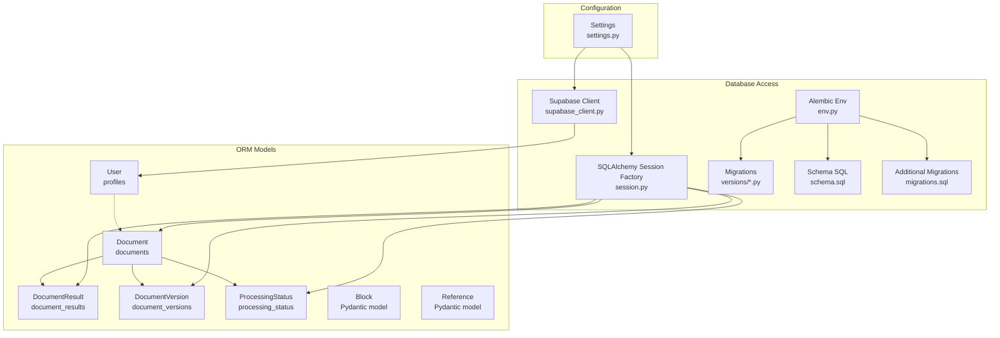
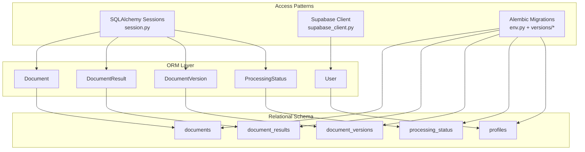
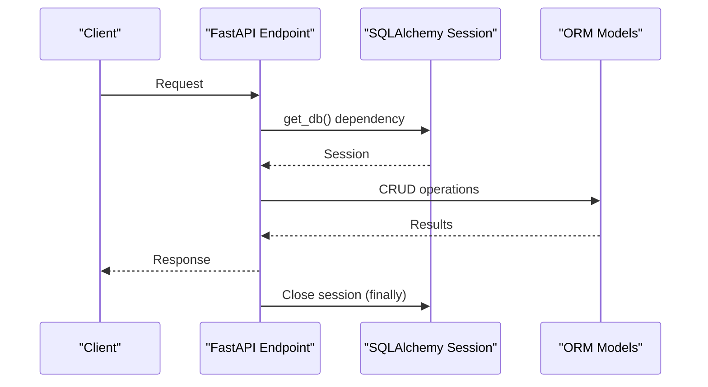
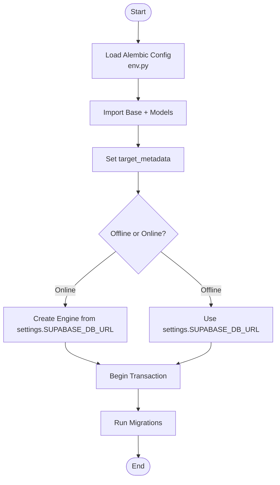
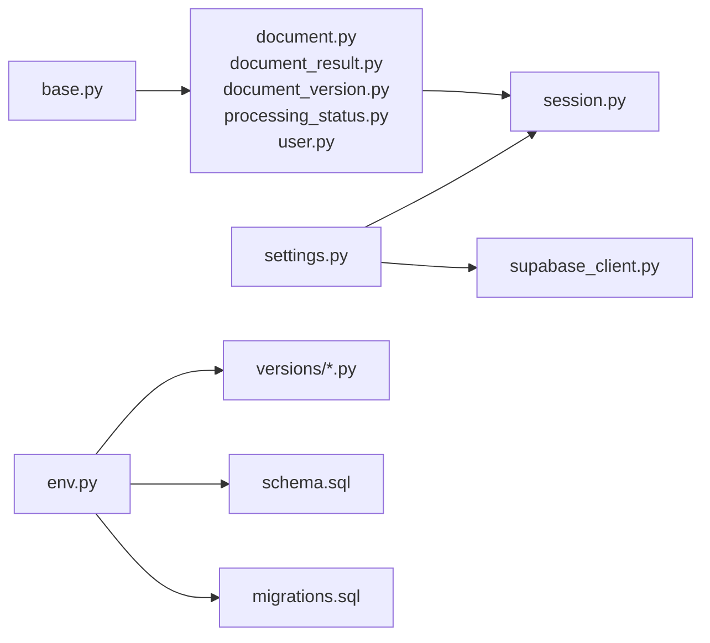
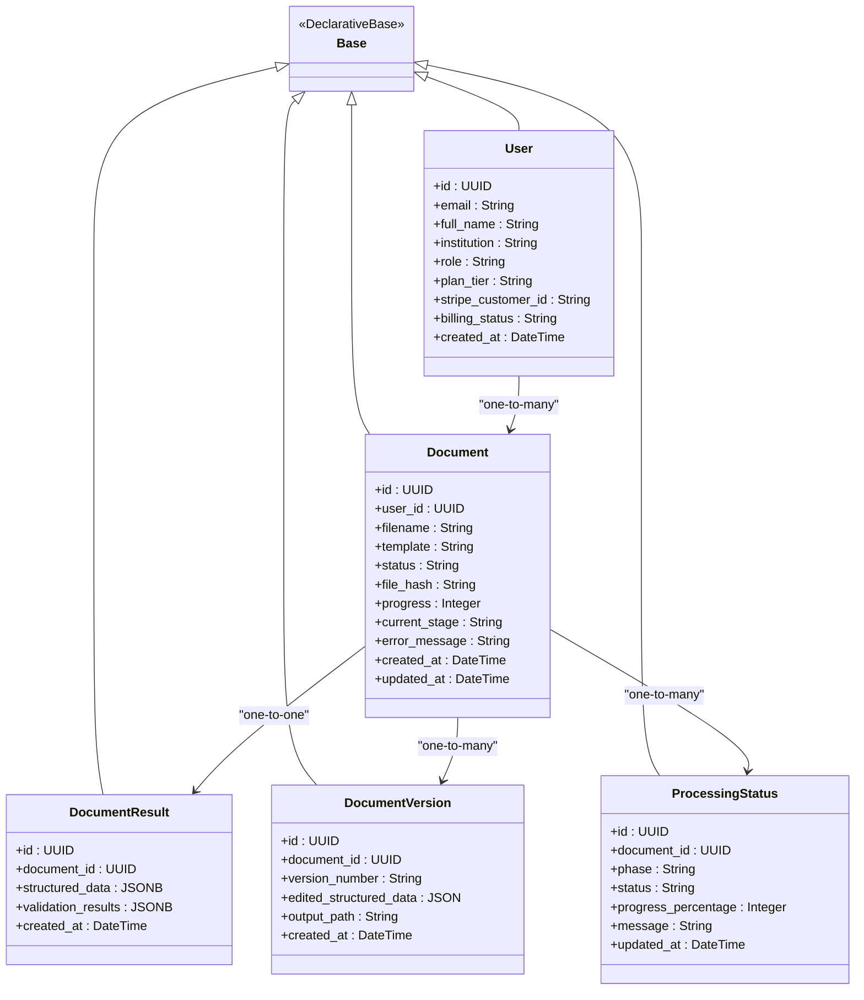

# Database Design

<cite>
**Referenced Files in This Document**
- [base.py](file://backend/app/db/base.py)
- [document.py](file://backend/app/models/document.py)
- [block.py](file://backend/app/models/block.py)
- [reference.py](file://backend/app/models/reference.py)
- [user.py](file://backend/app/models/user.py)
- [processing_status.py](file://backend/app/models/processing_status.py)
- [document_result.py](file://backend/app/models/document_result.py)
- [document_version.py](file://backend/app/models/document_version.py)
- [session.py](file://backend/app/db/session.py)
- [supabase_client.py](file://backend/app/db/supabase_client.py)
- [env.py](file://backend/alembic/env.py)
- [script.py.mako](file://backend/alembic/script.py.mako)
- [530ab1236474_baseline_schema.py](file://backend/alembic/versions/530ab1236474_baseline_schema.py)
- [20260311_0001_generator_tables.py](file://backend/alembic/versions/20260311_0001_generator_tables.py)
- [schema.sql](file://backend/schema.sql)
- [migrations.sql](file://backend/migrations.sql)
- [settings.py](file://backend/app/config/settings.py)
</cite>

## Table of Contents
1. [Introduction](#introduction)
2. [Project Structure](#project-structure)
3. [Core Components](#core-components)
4. [Architecture Overview](#architecture-overview)
5. [Detailed Component Analysis](#detailed-component-analysis)
6. [Dependency Analysis](#dependency-analysis)
7. [Performance Considerations](#performance-considerations)
8. [Troubleshooting Guide](#troubleshooting-guide)
9. [Conclusion](#conclusion)
10. [Appendices](#appendices)

## Introduction
This document describes the database design for the automated manuscript formatter. It covers entity relationship models, schema design, and data access patterns. It focuses on the core entities: Document, Block, Reference, User, and ProcessingStatus, along with supporting entities such as DocumentResult and DocumentVersion. It also explains the SQLAlchemy ORM configuration, database session management, transaction handling, the migration system, schema evolution, data integrity measures, performance optimization techniques, caching strategies, and operational maintenance practices.

## Project Structure
The database layer is organized around:
- SQLAlchemy Declarative Base for ORM models
- ORM models for core entities
- Session management for database connections
- Alembic-based migrations
- Supabase client for server-side operations
- Configuration-driven settings for database URLs and caches



**Diagram sources**
- [base.py:11-20](file://backend/app/db/base.py#L11-L20)
- [document.py:6-26](file://backend/app/models/document.py#L6-L26)
- [document_result.py:5-13](file://backend/app/models/document_result.py#L5-L13)
- [document_version.py:5-14](file://backend/app/models/document_version.py#L5-L14)
- [processing_status.py:5-15](file://backend/app/models/processing_status.py#L5-L15)
- [user.py:6-20](file://backend/app/models/user.py#L6-L20)
- [session.py:28-130](file://backend/app/db/session.py#L28-L130)
- [env.py:14-32](file://backend/alembic/env.py#L14-L32)
- [schema.sql:77-244](file://backend/schema.sql#L77-L244)
- [migrations.sql:1-77](file://backend/migrations.sql#L1-L77)
- [settings.py:76-82](file://backend/app/config/settings.py#L76-L82)

**Section sources**
- [base.py:11-20](file://backend/app/db/base.py#L11-L20)
- [session.py:28-130](file://backend/app/db/session.py#L28-L130)
- [env.py:14-32](file://backend/alembic/env.py#L14-L32)
- [schema.sql:77-244](file://backend/schema.sql#L77-L244)
- [migrations.sql:1-77](file://backend/migrations.sql#L1-L77)
- [settings.py:76-82](file://backend/app/config/settings.py#L76-L82)

## Core Components
This section documents the core database entities and their relationships.

- Document
  - Purpose: Represents an individual document processing job.
  - Key attributes: id, user_id, filename, template, status, file_hash, progress, current_stage, error_message, timestamps.
  - Indexes: user_id, status, created_at DESC, file_hash.
  - Notes: user_id references auth.users via Supabase; in the ORM model it is indexed but not enforced as FK; in the schema it is a FK.

- DocumentResult
  - Purpose: Stores structured pipeline output and validation results per document.
  - Key attributes: id, document_id (FK to documents), structured_data (JSONB), validation_results (JSONB), created_at.
  - Indexes: document_id.
  - Constraints: unique constraint on document_id for upsert behavior.

- DocumentVersion
  - Purpose: Stores snapshots of edited structured data and output paths per document version.
  - Key attributes: id, document_id (FK to documents), version_number, edited_structured_data (JSON), output_path, created_at.
  - Indexes: document_id.

- ProcessingStatus
  - Purpose: Tracks per-phase pipeline progress for a document.
  - Key attributes: id, document_id (FK to documents), phase, status, progress_percentage, message, updated_at.
  - Indexes: document_id.
  - Constraints: unique constraint on (document_id, phase) for upsert behavior.

- User (profiles)
  - Purpose: Mirrors Supabase auth.users with extended profile fields.
  - Key attributes: id (PK, FK to auth.users), email, full_name, institution, role, plan_tier, stripe_customer_id, billing_status, timestamps.
  - Indexes: id (PK), email.
  - Notes: FK to auth.users enforced at DB level.

- Block (Pydantic)
  - Purpose: Describes a text block with classification, styling, hierarchy, and metadata.
  - Not persisted in the relational DB; used in pipeline logic and serialization.

- Reference (Pydantic)
  - Purpose: Describes a bibliographic reference with parsed fields, citation tracking, and formatting metadata.
  - Not persisted in the relational DB; used in pipeline logic and serialization.

Entity relationships:
- One-to-many: User → Documents
- One-to-one: Document → DocumentResult (unique FK)
- One-to-many: Document → DocumentVersions
- One-to-many: Document → ProcessingStatus (by phase)
- Many-to-one: DocumentResults, DocumentVersions, ProcessingStatus → Document

**Section sources**
- [document.py:6-26](file://backend/app/models/document.py#L6-L26)
- [document_result.py:5-13](file://backend/app/models/document_result.py#L5-L13)
- [document_version.py:5-14](file://backend/app/models/document_version.py#L5-L14)
- [processing_status.py:5-15](file://backend/app/models/processing_status.py#L5-L15)
- [user.py:6-20](file://backend/app/models/user.py#L6-L20)
- [schema.sql:77-244](file://backend/schema.sql#L77-L244)

## Architecture Overview
The system uses a hybrid approach:
- Relational schema managed by Supabase (PostgreSQL 15+) with explicit SQL and Alembic migrations.
- SQLAlchemy ORM models for application entities (Document, DocumentResult, DocumentVersion, ProcessingStatus) that align with the relational schema.
- Supabase client for server-side database operations using the service role key, bypassing RLS for backend operations.
- Session management with connection pooling and health checks.



**Diagram sources**
- [schema.sql:77-244](file://backend/schema.sql#L77-L244)
- [session.py:28-130](file://backend/app/db/session.py#L28-L130)
- [supabase_client.py:107-144](file://backend/app/db/supabase_client.py#L107-L144)
- [env.py:14-32](file://backend/alembic/env.py#L14-L32)

## Detailed Component Analysis

### Entity Relationship Model
```mermaid
erDiagram
DOCUMENTS {
uuid id PK
uuid user_id
string filename
string template
string status
string file_hash
integer progress
string current_stage
string error_message
timestamptz created_at
timestamptz updated_at
}
DOCUMENT_RESULTS {
uuid id PK
uuid document_id FK
jsonb structured_data
jsonb validation_results
timestamptz created_at
}
DOCUMENT_VERSIONS {
uuid id PK
uuid document_id FK
string version_number
json edited_structured_data
string output_path
timestamptz created_at
}
PROCESSING_STATUS {
uuid id PK
uuid document_id FK
string phase
string status
integer progress_percentage
string message
timestamptz updated_at
}
PROFILES {
uuid id PK FK
string email
string full_name
string institution
string role
timestamptz created_at
timestamptz updated_at
}
DOCUMENTS }o--|| DOCUMENT_RESULTS : "has"
DOCUMENTS }o--o{ DOCUMENT_VERSIONS : "has"
DOCUMENTS }o--o{ PROCESSING_STATUS : "has"
PROFILES ||--o{ DOCUMENTS : "owns"
```

**Diagram sources**
- [schema.sql:77-244](file://backend/schema.sql#L77-L244)
- [document.py:6-26](file://backend/app/models/document.py#L6-L26)
- [document_result.py:5-13](file://backend/app/models/document_result.py#L5-L13)
- [document_version.py:5-14](file://backend/app/models/document_version.py#L5-L14)
- [processing_status.py:5-15](file://backend/app/models/processing_status.py#L5-L15)
- [user.py:6-20](file://backend/app/models/user.py#L6-L20)

### Data Access Patterns and Transaction Handling
- SQLAlchemy sessions are created with a pooled engine and returned via a FastAPI dependency. The dependency ensures sessions are closed after each request and rolls back on SQLAlchemy errors to avoid connection leaks.
- Health checks use a direct engine connection to verify connectivity.
- Supabase client is used for server-side operations with the service role key, bypassing RLS for backend operations.



**Diagram sources**
- [session.py:79-112](file://backend/app/db/session.py#L79-L112)

**Section sources**
- [session.py:28-130](file://backend/app/db/session.py#L28-L130)
- [supabase_client.py:107-144](file://backend/app/db/supabase_client.py#L107-L144)

### Migration System and Schema Evolution
- Alembic configuration imports the shared Base and all models to populate metadata.
- Baseline migration intentionally does nothing, preserving revision history while schema is managed by Supabase.
- Additional migrations create generator tables and indexes for new features.
- The schema SQL defines the canonical relational schema, including triggers for updated_at and indexes for performance.



**Diagram sources**
- [env.py:39-94](file://backend/alembic/env.py#L39-L94)
- [530ab1236474_baseline_schema.py:25-32](file://backend/alembic/versions/530ab1236474_baseline_schema.py#L25-L32)
- [20260311_0001_generator_tables.py:22-74](file://backend/alembic/versions/20260311_0001_generator_tables.py#L22-L74)
- [schema.sql:22-244](file://backend/schema.sql#L22-L244)

**Section sources**
- [env.py:14-32](file://backend/alembic/env.py#L14-L32)
- [530ab1236474_baseline_schema.py:18-32](file://backend/alembic/versions/530ab1236474_baseline_schema.py#L18-L32)
- [20260311_0001_generator_tables.py:15-74](file://backend/alembic/versions/20260311_0001_generator_tables.py#L15-L74)
- [schema.sql:22-244](file://backend/schema.sql#L22-L244)

### Indexing Strategy
Indexes are defined to optimize common queries:
- documents: user_id, status, created_at DESC, file_hash, template
- document_results: document_id (unique constraint for upsert)
- processing_status: document_id (unique constraint for upsert)
- profiles: email
- model_metrics: timestamp DESC, model_name
- ab_test_results: timestamp DESC

These indexes support:
- User-scoped document retrieval
- Status-based filtering
- Recent document ordering
- Hash-based deduplication
- Per-document result lookup
- Per-document phase status tracking
- Profile email lookups
- Dashboard and analytics queries

**Section sources**
- [schema.sql:103-107](file://backend/schema.sql#L103-L107)
- [schema.sql:165-166](file://backend/schema.sql#L165-L166)
- [schema.sql:186-188](file://backend/schema.sql#L186-L188)
- [migrations.sql:13-29](file://backend/migrations.sql#L13-L29)

### Data Integrity Measures
- Foreign keys:
  - documents.user_id references auth.users (managed by Supabase)
  - document_results.document_id references documents(id) with unique constraint
  - processing_status.document_id references documents(id) with unique constraint
  - document_versions.document_id references documents(id)
  - generator_messages.session_id references generator_sessions(id) with cascade delete
  - generator_documents.session_id references generator_sessions(id) with cascade delete
- Triggers:
  - update_updated_at_column() triggers on profiles, documents, processing_status to maintain updated_at
- Unique constraints:
  - document_results.document_id
  - processing_status(document_id, phase)
- Supabase-managed auth.users and RLS policies (commented in schema; can be enabled in the dashboard)

**Section sources**
- [schema.sql:45-53](file://backend/schema.sql#L45-L53)
- [schema.sql:82-101](file://backend/schema.sql#L82-L101)
- [schema.sql:137-144](file://backend/schema.sql#L137-L144)
- [schema.sql:155-163](file://backend/schema.sql#L155-L163)
- [schema.sql:174-184](file://backend/schema.sql#L174-L184)
- [schema.sql:29-36](file://backend/schema.sql#L29-L36)

### Caching Strategies
- Application-level caches are configured via settings for various subsystems:
  - LLM cache TTL
  - Readiness cache TTL
  - Health cache TTL
  - CSL search and fetch cache TTLs
  - Generator session/message/document cache TTLs
  - Document status cache TTL
- These caches reduce repeated computation and external API calls, improving throughput and latency.

**Section sources**
- [settings.py:164-178](file://backend/app/config/settings.py#L164-L178)
- [settings.py:359-378](file://backend/app/config/settings.py#L359-L378)

### Data Lifecycle Management and Maintenance
- File retention and cleanup:
  - ENABLE_FILE_CLEANUP controls whether old files are removed
  - RETENTION_DAYS defines the retention period
  - GENERATED_OUTPUT_DIR specifies the output directory for generated files
- Cleanup utilities and background tasks are available in the backend utilities to remove expired artifacts.
- Database maintenance:
  - Connection pooling tuned for cloud Postgres (Supabase)
  - pool_pre_ping to detect stale connections
  - Health checks for database and Supabase connectivity

**Section sources**
- [settings.py:129-132](file://backend/app/config/settings.py#L129-L132)
- [session.py:46-54](file://backend/app/db/session.py#L46-L54)
- [session.py:116-130](file://backend/app/db/session.py#L116-L130)

## Dependency Analysis
The following diagram shows dependencies among core components and their configuration:



**Diagram sources**
- [settings.py:76-82](file://backend/app/config/settings.py#L76-L82)
- [session.py:24-26](file://backend/app/db/session.py#L24-L26)
- [supabase_client.py:18-20](file://backend/app/db/supabase_client.py#L18-L20)
- [base.py:8-11](file://backend/app/db/base.py#L8-L11)
- [document.py:2-4](file://backend/app/models/document.py#L2-L4)
- [env.py:14-18](file://backend/alembic/env.py#L14-L18)
- [schema.sql:22-244](file://backend/schema.sql#L22-L244)
- [migrations.sql:1-77](file://backend/migrations.sql#L1-L77)

**Section sources**
- [settings.py:76-82](file://backend/app/config/settings.py#L76-L82)
- [session.py:24-26](file://backend/app/db/session.py#L24-L26)
- [supabase_client.py:18-20](file://backend/app/db/supabase_client.py#L18-L20)
- [base.py:8-11](file://backend/app/db/base.py#L8-L11)
- [document.py:2-4](file://backend/app/models/document.py#L2-L4)
- [env.py:14-18](file://backend/alembic/env.py#L14-L18)
- [schema.sql:22-244](file://backend/schema.sql#L22-L244)
- [migrations.sql:1-77](file://backend/migrations.sql#L1-L77)

## Performance Considerations
- Connection pooling tuned for cloud Postgres (Supabase): pool_size=5, max_overflow=10, pool_timeout=30, pool_recycle=1800, pool_pre_ping=True.
- Indexes optimized for frequent queries:
  - documents: user_id, status, created_at DESC, file_hash, template
  - document_results: document_id
  - processing_status: document_id
  - profiles: email
  - model_metrics: timestamp DESC, model_name
- Updated-at triggers minimize write overhead and keep records current.
- Caches configured via settings reduce repeated work and external calls.

[No sources needed since this section provides general guidance]

## Troubleshooting Guide
- Database not configured:
  - Symptom: Requests to DB endpoints return 503.
  - Cause: SUPABASE_DB_URL not set.
  - Action: Set SUPABASE_DB_URL and restart.
- Supabase client not configured:
  - Symptom: Server-side DB operations return 503.
  - Cause: SUPABASE_URL or SUPABASE_SERVICE_ROLE_KEY not set.
  - Action: Set both and restart.
- Database errors during requests:
  - Behavior: Session is rolled back and HTTP 500 is raised.
  - Action: Inspect logs for SQLAlchemyError details.
- Health checks failing:
  - Use check_db_health() or check_supabase_health() to diagnose connectivity issues.

**Section sources**
- [session.py:37-43](file://backend/app/db/session.py#L37-L43)
- [session.py:94-98](file://backend/app/db/session.py#L94-L98)
- [session.py:103-109](file://backend/app/db/session.py#L103-L109)
- [session.py:116-130](file://backend/app/db/session.py#L116-L130)
- [supabase_client.py:56-64](file://backend/app/db/supabase_client.py#L56-L64)
- [supabase_client.py:114-123](file://backend/app/db/supabase_client.py#L114-L123)
- [supabase_client.py:126-144](file://backend/app/db/supabase_client.py#L126-L144)

## Conclusion
The database design leverages Supabase-managed schema with explicit SQL and Alembic migrations, complemented by SQLAlchemy ORM models aligned to the relational structure. Robust indexing, foreign keys, and triggers ensure data integrity and performance. Session management and health checks provide reliable access patterns, while configuration-driven caches and retention policies support scalability and operability.

[No sources needed since this section summarizes without analyzing specific files]

## Appendices

### Appendix A: ORM Class Diagram


**Diagram sources**
- [base.py:11-20](file://backend/app/db/base.py#L11-L20)
- [document.py:6-26](file://backend/app/models/document.py#L6-L26)
- [document_result.py:5-13](file://backend/app/models/document_result.py#L5-L13)
- [document_version.py:5-14](file://backend/app/models/document_version.py#L5-L14)
- [processing_status.py:5-15](file://backend/app/models/processing_status.py#L5-L15)
- [user.py:6-20](file://backend/app/models/user.py#L6-L20)