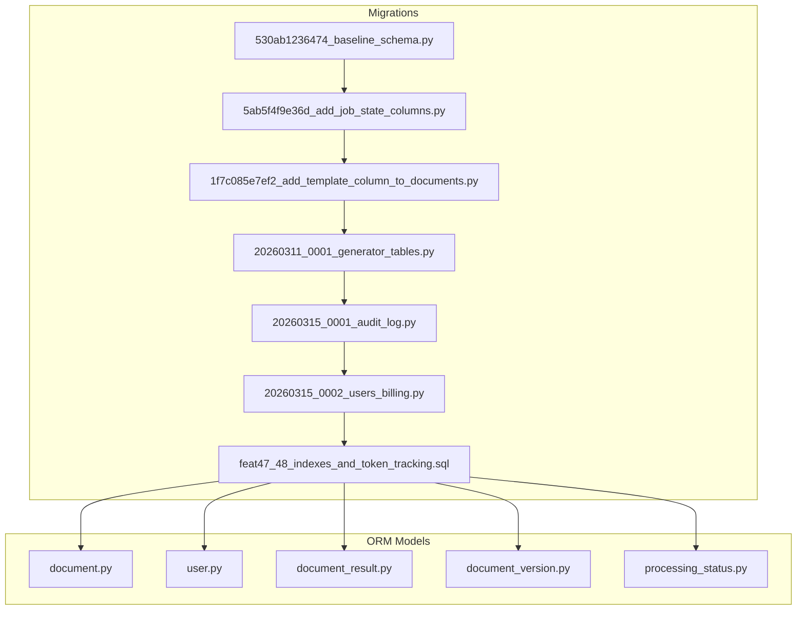
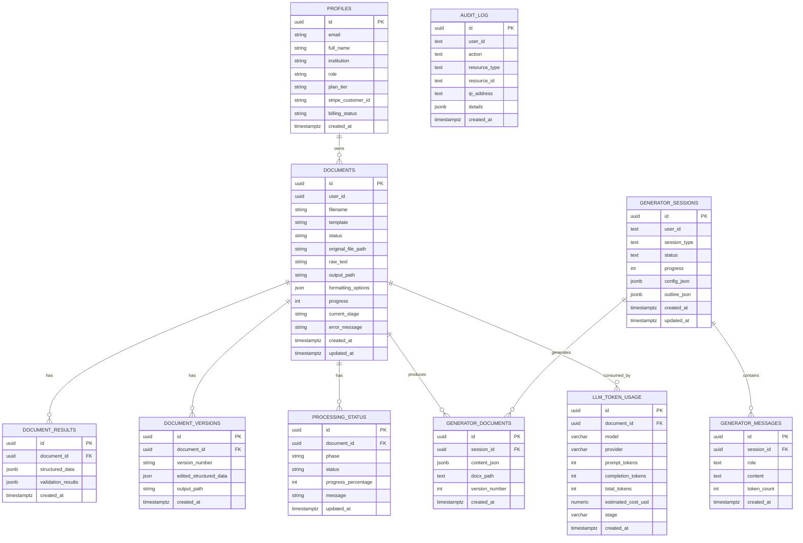
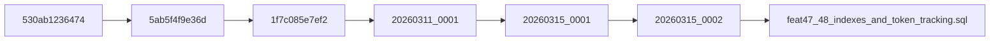
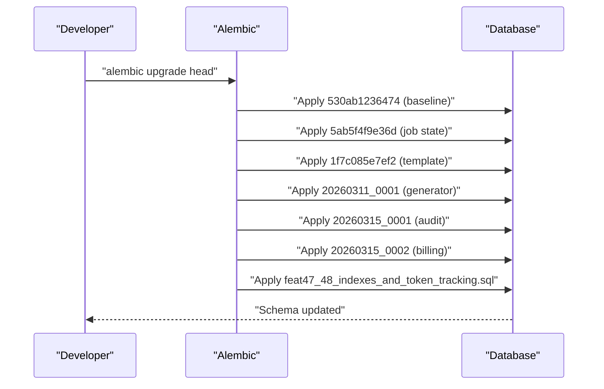

# Database Schema

<cite>
**Referenced Files in This Document**
- [530ab1236474_baseline_schema.py](file://backend/alembic/versions/530ab1236474_baseline_schema.py)
- [5ab5f4f9e36d_add_job_state_columns.py](file://backend/alembic/versions/5ab5f4f9e36d_add_job_state_columns.py)
- [1f7c085e7ef2_add_template_column_to_documents.py](file://backend/alembic/versions/1f7c085e7ef2_add_template_column_to_documents.py)
- [20260311_0001_generator_tables.py](file://backend/alembic/versions/20260311_0001_generator_tables.py)
- [20260315_0001_audit_log.py](file://backend/alembic/versions/20260315_0001_audit_log.py)
- [20260315_0002_users_billing.py](file://backend/alembic/versions/20260315_0002_users_billing.py)
- [feat47_48_indexes_and_token_tracking.sql](file://backend/alembic/versions/feat47_48_indexes_and_token_tracking.sql)
- [document.py](file://backend/app/models/document.py)
- [user.py](file://backend/app/models/user.py)
- [document_result.py](file://backend/app/models/document_result.py)
- [document_version.py](file://backend/app/models/document_version.py)
- [processing_status.py](file://backend/app/models/processing_status.py)
</cite>

## Table of Contents
1. [Introduction](#introduction)
2. [Project Structure](#project-structure)
3. [Core Components](#core-components)
4. [Architecture Overview](#architecture-overview)
5. [Detailed Component Analysis](#detailed-component-analysis)
6. [Dependency Analysis](#dependency-analysis)
7. [Performance Considerations](#performance-considerations)
8. [Troubleshooting Guide](#troubleshooting-guide)
9. [Conclusion](#conclusion)
10. [Appendices](#appendices)

## Introduction
This document describes the database schema for the automated manuscript formatter. It covers the baseline schema managed by Supabase, the evolution through Alembic migrations, and the current ORM models. It documents all tables, columns, data types, constraints, indexes, and relationships. It also explains indexing strategies, performance considerations, and migration versioning and rollback procedures.

## Project Structure
The database schema is primarily defined by:
- Alembic migrations under backend/alembic/versions that evolve the schema over time
- SQLAlchemy ORM models under backend/app/models that reflect the current schema state
- Additional indexes and constraints applied via SQL migrations

**Diagram sources**
- [530ab1236474_baseline_schema.py:1-33](file://backend/alembic/versions/530ab1236474_baseline_schema.py#L1-L33)
- [5ab5f4f9e36d_add_job_state_columns.py:1-145](file://backend/alembic/versions/5ab5f4f9e36d_add_job_state_columns.py#L1-L145)
- [1f7c085e7ef2_add_template_column_to_documents.py:1-39](file://backend/alembic/versions/1f7c085e7ef2_add_template_column_to_documents.py#L1-L39)
- [20260311_0001_generator_tables.py:1-74](file://backend/alembic/versions/20260311_0001_generator_tables.py#L1-L74)
- [20260315_0001_audit_log.py:1-41](file://backend/alembic/versions/20260315_0001_audit_log.py#L1-L41)
- [20260315_0002_users_billing.py:1-56](file://backend/alembic/versions/20260315_0002_users_billing.py#L1-L56)
- [feat47_48_indexes_and_token_tracking.sql:1-73](file://backend/alembic/versions/feat47_48_indexes_and_token_tracking.sql#L1-L73)
- [document.py:1-26](file://backend/app/models/document.py#L1-L26)
- [user.py:1-20](file://backend/app/models/user.py#L1-L20)
- [document_result.py:1-13](file://backend/app/models/document_result.py#L1-L13)
- [document_version.py:1-14](file://backend/app/models/document_version.py#L1-L14)
- [processing_status.py:1-15](file://backend/app/models/processing_status.py#L1-L15)

**Section sources**
- [530ab1236474_baseline_schema.py:1-33](file://backend/alembic/versions/530ab1236474_baseline_schema.py#L1-L33)
- [5ab5f4f9e36d_add_job_state_columns.py:1-145](file://backend/alembic/versions/5ab5f4f9e36d_add_job_state_columns.py#L1-L145)
- [1f7c085e7ef2_add_template_column_to_documents.py:1-39](file://backend/alembic/versions/1f7c085e7ef2_add_template_column_to_documents.py#L1-L39)
- [20260311_0001_generator_tables.py:1-74](file://backend/alembic/versions/20260311_0001_generator_tables.py#L1-L74)
- [20260315_0001_audit_log.py:1-41](file://backend/alembic/versions/20260315_0001_audit_log.py#L1-L41)
- [20260315_0002_users_billing.py:1-56](file://backend/alembic/versions/20260315_0002_users_billing.py#L1-L56)
- [feat47_48_indexes_and_token_tracking.sql:1-73](file://backend/alembic/versions/feat47_48_indexes_and_token_tracking.sql#L1-L73)
- [document.py:1-26](file://backend/app/models/document.py#L1-L26)
- [user.py:1-20](file://backend/app/models/user.py#L1-L20)
- [document_result.py:1-13](file://backend/app/models/document_result.py#L1-L13)
- [document_version.py:1-14](file://backend/app/models/document_version.py#L1-L14)
- [processing_status.py:1-15](file://backend/app/models/processing_status.py#L1-L15)

## Core Components
This section documents the core tables and their columns, data types, constraints, and indexes.

- documents
  - Purpose: Stores uploaded manuscripts and processing state.
  - Columns:
    - id: UUID, primary key, generated by default
    - user_id: UUID, indexed; references auth table (Supabase-managed)
    - filename: String
    - template: String
    - status: String
    - original_file_path: String
    - raw_text: String
    - output_path: String
    - formatting_options: JSON
    - progress: Integer
    - current_stage: String
    - error_message: String
    - created_at: Timestamp with timezone
    - updated_at: Timestamp with timezone, updates on modification
  - Notes:
    - user_id is indexed but intentionally not a strict foreign key to auth.users per Supabase policy.
    - Indexes: ix_documents_user_id, idx_documents_status, idx_documents_template, idx_documents_created_at DESC

- profiles
  - Purpose: User profile and billing metadata.
  - Columns:
    - id: UUID, primary key, indexed
    - email: String, indexed
    - full_name: String
    - institution: String
    - role: String, default "authenticated"
    - plan_tier: String, default "free"
    - stripe_customer_id: String
    - billing_status: String
    - created_at: Timestamp with timezone
  - Notes:
    - id corresponds to the Supabase auth.users id.

- document_results
  - Purpose: Stores structured extraction and validation results per document.
  - Columns:
    - id: UUID, primary key, generated by default
    - document_id: UUID, foreign key to documents.id, indexed
    - structured_data: JSONB
    - validation_results: JSONB
    - created_at: Timestamp with timezone
  - Notes:
    - FK constraint ensures referential integrity.

- document_versions
  - Purpose: Tracks document versions and outputs.
  - Columns:
    - id: UUID, primary key, generated by default
    - document_id: UUID, foreign key to documents.id, indexed
    - version_number: String
    - edited_structured_data: JSON
    - output_path: String
    - created_at: Timestamp with timezone
  - Notes:
    - FK constraint ensures referential integrity.

- processing_status
  - Purpose: Tracks per-document processing phases and statuses.
  - Columns:
    - id: UUID, primary key, generated by default
    - document_id: UUID, foreign key to documents.id, indexed
    - phase: String
    - status: String
    - progress_percentage: Integer
    - message: String
    - updated_at: Timestamp with timezone, updates on modification
  - Notes:
    - FK constraint ensures referential integrity.

- audit_log
  - Purpose: Audit trail for user actions.
  - Columns:
    - id: UUID, primary key, generated by default
    - user_id: Text
    - action: Text
    - resource_type: Text
    - resource_id: Text
    - ip_address: Text
    - details: JSONB
    - created_at: Timestamp with timezone
  - Notes:
    - No FK to users; stores user_id as text.

- generator_sessions
  - Purpose: LLM generation sessions.
  - Columns:
    - id: UUID, primary key
    - user_id: Text
    - session_type: Text, default "agent"
    - status: Text, default "pending"
    - progress: Integer, default 0
    - config_json: JSONB
    - outline_json: JSONB
    - created_at: Timestamp with timezone, default now()
    - updated_at: Timestamp with timezone, default now()

- generator_messages
  - Purpose: Messages exchanged during a generation session.
  - Columns:
    - id: UUID, primary key, default gen_random_uuid()
    - session_id: UUID, foreign key to generator_sessions.id, cascade delete
    - role: Text
    - content: Text
    - token_count: Integer
    - created_at: Timestamp with timezone, default now()

- generator_documents
  - Purpose: Outputs produced within a generation session.
  - Columns:
    - id: UUID, primary key, default gen_random_uuid()
    - session_id: UUID, foreign key to generator_sessions.id, cascade delete
    - content_json: JSONB
    - docx_path: Text
    - version_number: Integer, default 1
    - created_at: Timestamp with timezone, default now()

- llm_token_usage
  - Purpose: Tracks token usage and cost per document and stage.
  - Columns:
    - id: UUID, primary key, default gen_random_uuid()
    - document_id: UUID, foreign key to documents.id, ON DELETE SET NULL
    - model: String
    - provider: String, default "unknown"
    - prompt_tokens: Integer, default 0
    - completion_tokens: Integer, default 0
    - total_tokens: Integer, generated always as sum
    - estimated_cost_usd: Numeric
    - stage: String
    - created_at: Timestamp with timezone, default now()
  - Notes:
    - Indexes: idx_llm_token_usage_doc_id, idx_llm_token_usage_model, idx_llm_token_usage_created_at DESC

**Section sources**
- [document.py:1-26](file://backend/app/models/document.py#L1-L26)
- [user.py:1-20](file://backend/app/models/user.py#L1-L20)
- [document_result.py:1-13](file://backend/app/models/document_result.py#L1-L13)
- [document_version.py:1-14](file://backend/app/models/document_version.py#L1-L14)
- [processing_status.py:1-15](file://backend/app/models/processing_status.py#L1-L15)
- [20260311_0001_generator_tables.py:24-60](file://backend/alembic/versions/20260311_0001_generator_tables.py#L24-L60)
- [20260315_0001_audit_log.py:24-35](file://backend/alembic/versions/20260315_0001_audit_log.py#L24-L35)
- [feat47_48_indexes_and_token_tracking.sql:57-72](file://backend/alembic/versions/feat47_48_indexes_and_token_tracking.sql#L57-L72)

## Architecture Overview
The schema is managed by Supabase with Alembic migrations adding tables and indexes over time. The ORM models reflect the current state after all migrations.

**Diagram sources**
- [document.py:6-25](file://backend/app/models/document.py#L6-L25)
- [user.py:6-19](file://backend/app/models/user.py#L6-L19)
- [document_result.py:5-12](file://backend/app/models/document_result.py#L5-L12)
- [document_version.py:5-13](file://backend/app/models/document_version.py#L5-L13)
- [processing_status.py:5-14](file://backend/app/models/processing_status.py#L5-L14)
- [20260311_0001_generator_tables.py:24-60](file://backend/alembic/versions/20260311_0001_generator_tables.py#L24-L60)
- [20260315_0001_audit_log.py:24-35](file://backend/alembic/versions/20260315_0001_audit_log.py#L24-L35)
- [feat47_48_indexes_and_token_tracking.sql:57-72](file://backend/alembic/versions/feat47_48_indexes_and_token_tracking.sql#L57-L72)

## Detailed Component Analysis

### Documents Table
- Purpose: Central record of uploaded documents and job state.
- Key columns: id, user_id, status, template, progress, current_stage, error_message, formatting_options.
- Indexes: ix_documents_user_id, idx_documents_status, idx_documents_template, idx_documents_created_at DESC.
- Notes: user_id references auth.users (Supabase-managed) without a strict FK in ORM.

**Section sources**
- [document.py:6-25](file://backend/app/models/document.py#L6-L25)
- [feat47_48_indexes_and_token_tracking.sql:6-16](file://backend/alembic/versions/feat47_48_indexes_and_token_tracking.sql#L6-L16)

### Profiles Table
- Purpose: User profile and billing fields attached to Supabase auth users.
- Key columns: id (PK), email, full_name, institution, role, plan_tier, stripe_customer_id, billing_status.
- Indexes: ix_profiles_id, ix_profiles_email.

**Section sources**
- [user.py:6-19](file://backend/app/models/user.py#L6-L19)
- [5ab5f4f9e36d_add_job_state_columns.py:24-34](file://backend/alembic/versions/5ab5f4f9e36d_add_job_state_columns.py#L24-L34)

### Document Results and Versions
- Purpose: Store structured results and version snapshots.
- Relationships:
  - document_results.document_id → documents.id (FK)
  - document_versions.document_id → documents.id (FK)
- Indexes: ix_document_results_document_id, ix_document_versions_document_id.

**Section sources**
- [document_result.py:5-12](file://backend/app/models/document_result.py#L5-L12)
- [document_version.py:5-13](file://backend/app/models/document_version.py#L5-L13)
- [5ab5f4f9e36d_add_job_state_columns.py:35-55](file://backend/alembic/versions/5ab5f4f9e36d_add_job_state_columns.py#L35-L55)

### Processing Status
- Purpose: Track per-document processing lifecycle.
- Relationship: processing_status.document_id → documents.id (FK).
- Indexes: ix_processing_status_document_id, idx_processing_status_phase.

**Section sources**
- [processing_status.py:5-14](file://backend/app/models/processing_status.py#L5-L14)
- [feat47_48_indexes_and_token_tracking.sql:21-23](file://backend/alembic/versions/feat47_48_indexes_and_token_tracking.sql#L21-L23)

### Audit Log
- Purpose: Record user actions and resource changes.
- Columns: id, user_id, action, resource_type, resource_id, ip_address, details, created_at.

**Section sources**
- [20260315_0001_audit_log.py:24-35](file://backend/alembic/versions/20260315_0001_audit_log.py#L24-L35)

### Generator Tables
- generator_sessions: Session metadata and state.
- generator_messages: Message exchange history with tokens.
- generator_documents: Generated outputs linked to sessions.
- Relationships: messages.session_id → sessions.id (CASCADE), documents.session_id → sessions.id (CASCADE).

**Section sources**
- [20260311_0001_generator_tables.py:24-60](file://backend/alembic/versions/20260311_0001_generator_tables.py#L24-L60)

### LLM Token Usage
- Purpose: Track token consumption and cost per document and stage.
- Relationship: llm_token_usage.document_id → documents.id (ON DELETE SET NULL).
- Indexes: idx_llm_token_usage_doc_id, idx_llm_token_usage_model, idx_llm_token_usage_created_at DESC.

**Section sources**
- [feat47_48_indexes_and_token_tracking.sql:57-72](file://backend/alembic/versions/feat47_48_indexes_and_token_tracking.sql#L57-L72)

## Dependency Analysis
- Baseline: 530ab1236474 introduces a no-op baseline to anchor future migrations.
- Job state additions: 5ab5f4f9e36d adds profiles, document_results, document_versions, processing_status, and refactors documents.
- Template column: 1f7c085e7ef2 conditionally adds template to documents.
- Generator tables: 20260311_0001 adds generator_sessions, generator_messages, generator_documents.
- Audit log: 20260315_0001 adds audit_log.
- Billing fields: 20260315_0002 conditionally adds billing fields to profiles.
- Indexes and token tracking: feat47_48_indexes_and_token_tracking.sql adds indexes and llm_token_usage.

**Diagram sources**
- [530ab1236474_baseline_schema.py:1-33](file://backend/alembic/versions/530ab1236474_baseline_schema.py#L1-L33)
- [5ab5f4f9e36d_add_job_state_columns.py:1-145](file://backend/alembic/versions/5ab5f4f9e36d_add_job_state_columns.py#L1-L145)
- [1f7c085e7ef2_add_template_column_to_documents.py:1-39](file://backend/alembic/versions/1f7c085e7ef2_add_template_column_to_documents.py#L1-L39)
- [20260311_0001_generator_tables.py:1-74](file://backend/alembic/versions/20260311_0001_generator_tables.py#L1-L74)
- [20260315_0001_audit_log.py:1-41](file://backend/alembic/versions/20260315_0001_audit_log.py#L1-L41)
- [20260315_0002_users_billing.py:1-56](file://backend/alembic/versions/20260315_0002_users_billing.py#L1-L56)
- [feat47_48_indexes_and_token_tracking.sql:1-73](file://backend/alembic/versions/feat47_48_indexes_and_token_tracking.sql#L1-L73)

**Section sources**
- [530ab1236474_baseline_schema.py:1-33](file://backend/alembic/versions/530ab1236474_baseline_schema.py#L1-L33)
- [5ab5f4f9e36d_add_job_state_columns.py:1-145](file://backend/alembic/versions/5ab5f4f9e36d_add_job_state_columns.py#L1-L145)
- [1f7c085e7ef2_add_template_column_to_documents.py:1-39](file://backend/alembic/versions/1f7c085e7ef2_add_template_column_to_documents.py#L1-L39)
- [20260311_0001_generator_tables.py:1-74](file://backend/alembic/versions/20260311_0001_generator_tables.py#L1-L74)
- [20260315_0001_audit_log.py:1-41](file://backend/alembic/versions/20260315_0001_audit_log.py#L1-L41)
- [20260315_0002_users_billing.py:1-56](file://backend/alembic/versions/20260315_0002_users_billing.py#L1-L56)
- [feat47_48_indexes_and_token_tracking.sql:1-73](file://backend/alembic/versions/feat47_48_indexes_and_token_tracking.sql#L1-L73)

## Performance Considerations
- Indexes
  - documents: user_id, status, template, created_at DESC
  - document_results: document_id
  - document_versions: document_id
  - processing_status: document_id, (document_id, phase)
  - llm_token_usage: document_id, model, created_at DESC
- Query patterns
  - List documents by user
  - Filter by status/template/date ranges
  - Join results/versions/status by document_id
  - Aggregate token usage by model and stage
- Cost tracking
  - total_tokens is generated always as prompt_tokens + completion_tokens
  - estimated_cost_usd supports cost monitoring

**Section sources**
- [feat47_48_indexes_and_token_tracking.sql:6-23](file://backend/alembic/versions/feat47_48_indexes_and_token_tracking.sql#L6-L23)
- [feat47_48_indexes_and_token_tracking.sql:57-72](file://backend/alembic/versions/feat47_48_indexes_and_token_tracking.sql#L57-L72)

## Troubleshooting Guide
- Migration drift
  - Some migrations use introspection to avoid errors on repeated runs (e.g., adding columns only if missing).
- Rollback behavior
  - Downgrades revert schema changes, including dropping tables, indexes, and columns.
  - Foreign keys are recreated or dropped as needed during downgrades.
- Supabase integration
  - user_id in documents references auth.users; FK enforcement is managed by Supabase.

**Section sources**
- [1f7c085e7ef2_add_template_column_to_documents.py:21-38](file://backend/alembic/versions/1f7c085e7ef2_add_template_column_to_documents.py#L21-L38)
- [20260315_0002_users_billing.py:44-55](file://backend/alembic/versions/20260315_0002_users_billing.py#L44-L55)
- [5ab5f4f9e36d_add_job_state_columns.py:88-144](file://backend/alembic/versions/5ab5f4f9e36d_add_job_state_columns.py#L88-L144)

## Conclusion
The schema combines Supabase-managed identity with an evolving relational model for document processing, generation, auditing, and token tracking. Migrations define a clear versioning path, while indexes optimize common query patterns. The ORM models align with the current migration state, ensuring consistency across development and production.

## Appendices

### Migration Execution Flow

**Diagram sources**
- [530ab1236474_baseline_schema.py:25-27](file://backend/alembic/versions/530ab1236474_baseline_schema.py#L25-L27)
- [5ab5f4f9e36d_add_job_state_columns.py:21-85](file://backend/alembic/versions/5ab5f4f9e36d_add_job_state_columns.py#L21-L85)
- [1f7c085e7ef2_add_template_column_to_documents.py:21-28](file://backend/alembic/versions/1f7c085e7ef2_add_template_column_to_documents.py#L21-L28)
- [20260311_0001_generator_tables.py:22-63](file://backend/alembic/versions/20260311_0001_generator_tables.py#L22-L63)
- [20260315_0001_audit_log.py:22-35](file://backend/alembic/versions/20260315_0001_audit_log.py#L22-L35)
- [20260315_0002_users_billing.py:21-41](file://backend/alembic/versions/20260315_0002_users_billing.py#L21-L41)
- [feat47_48_indexes_and_token_tracking.sql:1-73](file://backend/alembic/versions/feat47_48_indexes_and_token_tracking.sql#L1-L73)