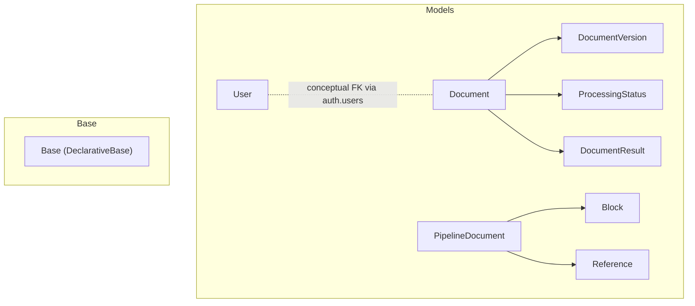
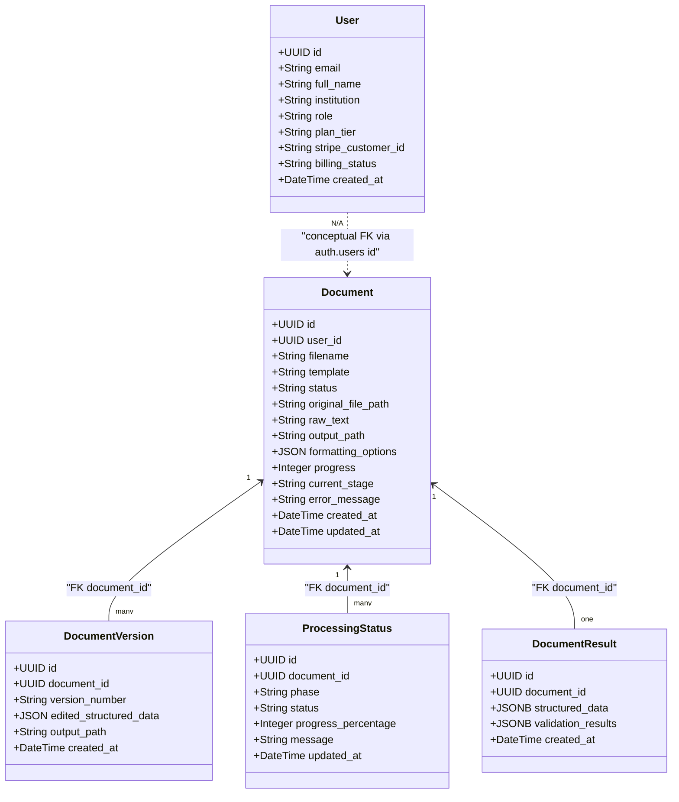
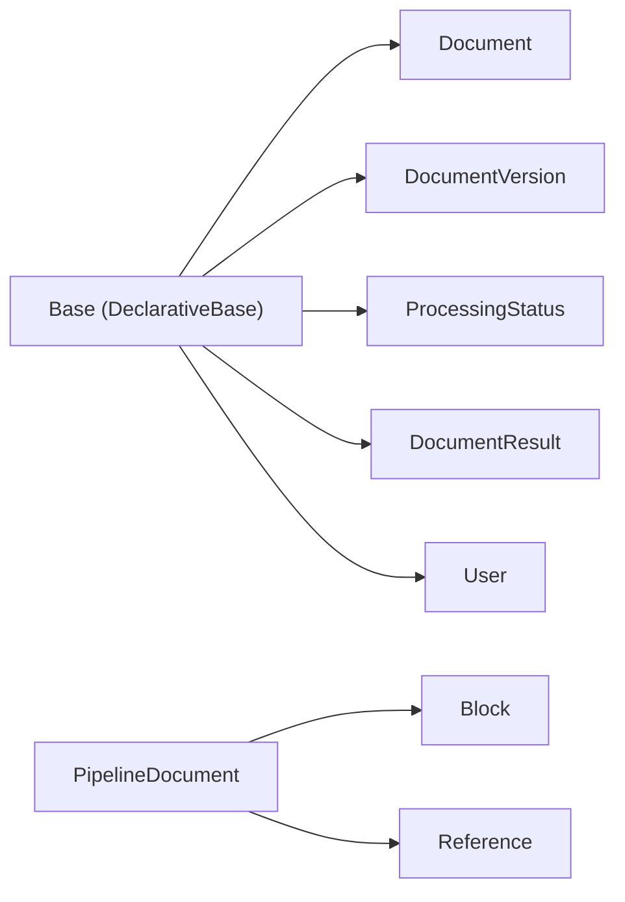

# Entity Models

<cite>
**Referenced Files in This Document**
- [document.py](file://backend/app/models/document.py)
- [block.py](file://backend/app/models/block.py)
- [reference.py](file://backend/app/models/reference.py)
- [user.py](file://backend/app/models/user.py)
- [document_version.py](file://backend/app/models/document_version.py)
- [processing_status.py](file://backend/app/models/processing_status.py)
- [document_result.py](file://backend/app/models/document_result.py)
- [pipeline_document.py](file://backend/app/models/pipeline_document.py)
- [base.py](file://backend/app/db/base.py)
- [__init__.py](file://backend/app/models/__init__.py)
- [5ab5f4f9e36d_add_job_state_columns.py](file://backend/alembic/versions/5ab5f4f9e36d_add_job_state_columns.py)
- [20260315_0002_users_billing.py](file://backend/alembic/versions/20260315_0002_users_billing.py)
- [530ab1236474_baseline_schema.py](file://backend/alembic/versions/530ab1236474_baseline_schema.py)
</cite>

## Table of Contents
1. [Introduction](#introduction)
2. [Project Structure](#project-structure)
3. [Core Components](#core-components)
4. [Architecture Overview](#architecture-overview)
5. [Detailed Component Analysis](#detailed-component-analysis)
6. [Dependency Analysis](#dependency-analysis)
7. [Performance Considerations](#performance-considerations)
8. [Troubleshooting Guide](#troubleshooting-guide)
9. [Conclusion](#conclusion)
10. [Appendices](#appendices)

## Introduction
This document provides a comprehensive entity model reference for the database and pipeline models used in the document processing pipeline. It focuses on the following database entities:
- Document
- Block
- Reference
- User
- DocumentVersion
- ProcessingStatus

It also covers the internal pipeline model used during processing (PipelineDocument) and highlights relationships, constraints, and usage patterns. Guidance on instantiation, querying patterns, and navigation is included, along with versioning, backward compatibility, and migration considerations.

## Project Structure
The models are organized under backend/app/models, with a shared declarative base for SQLAlchemy ORM models. The database schema is primarily managed by Supabase, and Alembic migrations maintain revision history and incremental changes.

**Diagram sources**
- [document.py:6-26](file://backend/app/models/document.py#L6-L26)
- [document_version.py:5-14](file://backend/app/models/document_version.py#L5-L14)
- [processing_status.py:5-15](file://backend/app/models/processing_status.py#L5-L15)
- [document_result.py:5-13](file://backend/app/models/document_result.py#L5-L13)
- [user.py:6-20](file://backend/app/models/user.py#L6-L20)
- [block.py:86-209](file://backend/app/models/block.py#L86-L209)
- [reference.py:38-238](file://backend/app/models/reference.py#L38-L238)
- [pipeline_document.py:49-207](file://backend/app/models/pipeline_document.py#L49-L207)
- [base.py:11-20](file://backend/app/db/base.py#L11-L20)

**Section sources**
- [base.py:11-20](file://backend/app/db/base.py#L11-L20)
- [__init__.py:1-18](file://backend/app/models/__init__.py#L1-L18)

## Core Components
This section documents each entity’s fields, data types, constraints, and relationships, and explains its role in the document processing pipeline.

- Document
  - Purpose: Represents an uploaded academic manuscript with job state and processing metadata.
  - Key fields:
    - id: UUID primary key, auto-generated server-side default.
    - user_id: UUID, nullable; intended to reference auth.users but treated as conceptually linked; indexed.
    - filename: String, not null.
    - template: String, nullable.
    - status: String, not null.
    - original_file_path: String, nullable.
    - raw_text: String, nullable.
    - output_path: String, nullable.
    - formatting_options: JSON, nullable.
    - progress: Integer, default 0.
    - current_stage: String, nullable.
    - error_message: String, nullable.
    - created_at, updated_at: DateTime with timezone; defaults and updates handled server-side.
  - Constraints and indexes:
    - Primary key on id.
    - Index on user_id.
    - Server defaults for timestamps and progress.
  - Relationships:
    - One-to-many with DocumentVersion and ProcessingStatus via document_id FK.
    - One-to-one with DocumentResult via document_id FK.
    - Conceptual relationship to User via auth.users id.

- DocumentVersion
  - Purpose: Snapshots of a document at different editing stages with generated outputs.
  - Key fields:
    - id: UUID primary key, auto-generated.
    - document_id: UUID, FK to documents.id, not null, indexed.
    - version_number: String, not null (e.g., "v1", "v2-edited").
    - edited_structured_data: JSON, nullable.
    - output_path: String, nullable.
    - created_at: DateTime with timezone.
  - Constraints and indexes:
    - Primary key on id.
    - Foreign key to Document on document_id.
    - Index on document_id.

- ProcessingStatus
  - Purpose: Tracks per-phase processing lifecycle for a document.
  - Key fields:
    - id: UUID primary key, auto-generated.
    - document_id: UUID, FK to documents.id, not null, indexed.
    - phase: String, not null (e.g., UPLOAD, EXTRACTION, NLP_ANALYSIS, VALIDATION, PERSISTENCE).
    - status: String, not null (e.g., PENDING, PROCESSING, COMPLETED, COMPLETED_WITH_WARNINGS, FAILED, CANCELLED).
    - progress_percentage: Integer, nullable (0–100).
    - message: String, nullable.
    - updated_at: DateTime with timezone; auto-updated on change.
  - Constraints and indexes:
    - Primary key on id.
    - Foreign key to Document on document_id.
    - Index on document_id.

- DocumentResult
  - Purpose: Stores structured data and validation outcomes after processing.
  - Key fields:
    - id: UUID primary key, auto-generated.
    - document_id: UUID, FK to documents.id, not null, indexed.
    - structured_data: JSONB, nullable.
    - validation_results: JSONB, nullable.
    - created_at: DateTime with timezone.
  - Constraints and indexes:
    - Primary key on id.
    - Foreign key to Document on document_id.
    - Index on document_id.

- User
  - Purpose: User profile synchronized with Supabase auth.users.
  - Key fields:
    - id: UUID primary key, indexed; conceptually equals auth.users.id.
    - email: String, indexed.
    - full_name: String.
    - institution: String.
    - role: String, server default "authenticated".
    - plan_tier: String, server default "free".
    - stripe_customer_id: String.
    - billing_status: String.
    - created_at: DateTime with timezone.
  - Notes:
    - Schema additions for billing fields are applied via migration.

- Block (internal pipeline model)
  - Purpose: Fundamental content unit flowing through the pipeline with metadata.
  - Key fields:
    - block_id: String, unique identifier.
    - text: String, raw content.
    - block_type: Enum BlockType, semantic classification.
    - index: int, sequential position (0-based).
    - page_number: Optional[int].
    - style: TextStyle (bold, italic, underline, strikethrough, font_name, font_size, color).
    - level: Optional[int], hierarchy level.
    - parent_id: Optional[str], parent block id.
    - list_type: Optional[ListType], ordered/unordered.
    - list_level: Optional[int], nesting level.
    - section_name: Optional[str].
    - semantic_intent: Optional[str].
    - classification_confidence: Optional[float].
    - contains_citation: bool.
    - citation_keys: List[str].
    - is_valid: bool.
    - warnings: List[str].
    - metadata: Dict[str, Any].
  - Enums:
    - BlockType: structural, headings, abstract/keywords, body/list/quote/code, metadata, references, figures/tables/equations, supplemental sections, unknown, legacy/aliases.
    - ListType: ordered, unordered.
  - Methods:
    - is_heading(), is_content(), is_metadata().

- Reference (internal pipeline model)
  - Purpose: Structured bibliographic reference with parsing and formatting support.
  - Key fields:
    - reference_id: String, unique identifier.
    - number: Optional[int], sequential number.
    - citation_key: String, key used for in-text citations.
    - raw_text: String, original reference text.
    - reference_type: Enum ReferenceType.
    - authors: List[str].
    - title: Optional[str].
    - journal/conference/book_title/publisher: Optional[str].
    - year/volume/issue/pages: Optional[str].
    - doi/isbn/issn/url/arxiv_id: Optional[str].
    - edition/note: Optional[str].
    - block_id: Optional[str], block id in references section.
    - index: int, position in reference list (0-based).
    - cited_by: List[str], block ids that cite this reference.
    - citation_count: int.
    - formatted_text: Optional[str].
    - style: Optional[CitationStyle].
    - is_valid: bool.
    - warnings: List[str].
    - is_complete: bool.
    - metadata: Dict[str, Any].
  - Enums:
    - ReferenceType: journal_article, conference_paper, book, book_chapter, thesis, technical_report, patent, web_page, preprint, unknown.
    - CitationStyle: ieee, apa, mla, chicago, harvard, vancouver, springer, unknown.
  - Methods:
    - get_primary_author(), get_author_list(max_authors), get_short_citation(), has_doi().

- PipelineDocument (internal pipeline model)
  - Purpose: Full in-memory representation of a document during processing; not persisted.
  - Key fields:
    - document_id: String.
    - original_filename/source_path: Optional[str].
    - blocks: List[Block].
    - figures: List[Figure].
    - tables: List[Table].
    - references: List[Reference].
    - equations: List[Equation].
    - metadata: DocumentMetadata (title, authors, affiliations, abstract, keywords, publication_date, volume, issue, journal, doi, corresponding_author, email, ai_hints).
    - template: Optional[TemplateInfo].
    - formatting_options: Dict[str, Any].
    - is_valid/validation_errors/validation_warnings: bool and lists.
    - review: Optional[ReviewMetadata].
    - output_path: Optional[str].
    - generated_doc: Optional[Any] (transient).
    - processing_history: List[ProcessingStage].
    - created_at/updated_at: datetime with timezone.
  - Helpers:
    - add_processing_stage(), get_block_by_id(), get_figure_by_id(), get_equation_by_id(), get_blocks_by_type(), get_blocks_in_section(), get_section_names(), get_stats().

**Section sources**
- [document.py:6-26](file://backend/app/models/document.py#L6-L26)
- [document_version.py:5-14](file://backend/app/models/document_version.py#L5-L14)
- [processing_status.py:5-15](file://backend/app/models/processing_status.py#L5-L15)
- [document_result.py:5-13](file://backend/app/models/document_result.py#L5-L13)
- [user.py:6-20](file://backend/app/models/user.py#L6-L20)
- [block.py:86-209](file://backend/app/models/block.py#L86-L209)
- [reference.py:38-238](file://backend/app/models/reference.py#L38-L238)
- [pipeline_document.py:49-207](file://backend/app/models/pipeline_document.py#L49-L207)

## Architecture Overview
The database entities form a cohesive pipeline-centric schema:
- Documents are the root entities with job state and processing metadata.
- DocumentVersions capture snapshots and outputs for each editing iteration.
- ProcessingStatus tracks per-phase lifecycle and progress.
- DocumentResult stores structured and validation artifacts.
- User profiles integrate with Supabase auth.users via a conceptually matching id column.
- PipelineDocument models the evolving content and metadata during processing.

**Diagram sources**
- [document.py:6-26](file://backend/app/models/document.py#L6-L26)
- [document_version.py:5-14](file://backend/app/models/document_version.py#L5-L14)
- [processing_status.py:5-15](file://backend/app/models/processing_status.py#L5-L15)
- [document_result.py:5-13](file://backend/app/models/document_result.py#L5-L13)
- [user.py:6-20](file://backend/app/models/user.py#L6-L20)

## Detailed Component Analysis

### Document Model
- Role: Root entity representing an academic manuscript with job state and processing metadata.
- Relationships:
  - One-to-many with DocumentVersion and ProcessingStatus.
  - One-to-one with DocumentResult.
  - Conceptual relationship to User via auth.users id.
- Typical usage:
  - Creation: Initialize with filename, optional template, and user_id.
  - Progress tracking: Update progress and current_stage.
  - Error handling: Capture error_message on failure.
- Querying patterns:
  - Filter by user_id and status.
  - Order by created_at or updated_at.
- Instantiation example paths:
  - [document.py:6-26](file://backend/app/models/document.py#L6-L26)

**Section sources**
- [document.py:6-26](file://backend/app/models/document.py#L6-L26)

### DocumentVersion Model
- Role: Captures versioned snapshots and outputs for a document.
- Relationships:
  - Belongs to Document via document_id FK.
- Typical usage:
  - Create a new version after edits; store edited_structured_data and output_path.
- Querying patterns:
  - Retrieve latest version by ordering by created_at desc.
  - Filter by version_number pattern for “edited” variants.
- Instantiation example paths:
  - [document_version.py:5-14](file://backend/app/models/document_version.py#L5-L14)

**Section sources**
- [document_version.py:5-14](file://backend/app/models/document_version.py#L5-L14)

### ProcessingStatus Model
- Role: Tracks per-phase lifecycle and progress for a document.
- Relationships:
  - Belongs to Document via document_id FK.
- Typical usage:
  - Record phase transitions and progress_percentage.
  - Store messages for diagnostics.
- Querying patterns:
  - Find current phase for a document.
  - Aggregate statuses across documents.
- Instantiation example paths:
  - [processing_status.py:5-15](file://backend/app/models/processing_status.py#L5-L15)

**Section sources**
- [processing_status.py:5-15](file://backend/app/models/processing_status.py#L5-L15)

### DocumentResult Model
- Role: Stores structured data and validation outcomes after processing.
- Relationships:
  - Belongs to Document via document_id FK.
- Typical usage:
  - Persist structured_data and validation_results after processing completes.
- Querying patterns:
  - Retrieve results for reporting and auditing.
- Instantiation example paths:
  - [document_result.py:5-13](file://backend/app/models/document_result.py#L5-L13)

**Section sources**
- [document_result.py:5-13](file://backend/app/models/document_result.py#L5-L13)

### User Model
- Role: Profile synchronized with Supabase auth.users.
- Notes:
  - id is conceptually the same as auth.users.id.
  - Billing-related fields are added via migration.
- Typical usage:
  - Enforce role and plan_tier for feature gating.
- Querying patterns:
  - Filter by email or role.
- Instantiation example paths:
  - [user.py:6-20](file://backend/app/models/user.py#L6-L20)
  - [20260315_0002_users_billing.py:21-56](file://backend/alembic/versions/20260315_0002_users_billing.py#L21-L56)

**Section sources**
- [user.py:6-20](file://backend/app/models/user.py#L6-L20)
- [20260315_0002_users_billing.py:21-56](file://backend/alembic/versions/20260315_0002_users_billing.py#L21-L56)

### Block Model (Pipeline)
- Role: Fundamental content unit with rich metadata for pipeline stages.
- Typical usage:
  - Assign block_type, level, parent_id, section_name during structure detection.
  - Populate semantic_intent and classification_confidence during classification.
  - Track citations and validation flags.
- Querying patterns:
  - Filter by block_type or section_name.
  - Navigate hierarchical structure via parent_id.
- Instantiation example paths:
  - [block.py:86-209](file://backend/app/models/block.py#L86-L209)

**Section sources**
- [block.py:86-209](file://backend/app/models/block.py#L86-L209)

### Reference Model (Pipeline)
- Role: Structured bibliographic reference with parsing and formatting support.
- Typical usage:
  - Parse raw_text into structured fields.
  - Compute citation_count and cited_by links.
  - Format references according to target style.
- Querying patterns:
  - Lookup by citation_key or reference_id.
  - Filter by reference_type or completeness.
- Instantiation example paths:
  - [reference.py:38-238](file://backend/app/models/reference.py#L38-L238)

**Section sources**
- [reference.py:38-238](file://backend/app/models/reference.py#L38-L238)

### PipelineDocument Model (Pipeline)
- Role: Full in-memory representation of a document during processing.
- Typical usage:
  - Accumulate blocks, figures, tables, references, equations.
  - Track validation results and processing history.
- Querying patterns:
  - Search blocks by type or section.
  - Inspect processing_history for diagnostics.
- Instantiation example paths:
  - [pipeline_document.py:49-207](file://backend/app/models/pipeline_document.py#L49-L207)

**Section sources**
- [pipeline_document.py:49-207](file://backend/app/models/pipeline_document.py#L49-L207)

## Dependency Analysis
The models share a common declarative base and are organized under a single module namespace. Relationships are defined via SQLAlchemy foreign keys and enums.

**Diagram sources**
- [base.py:11-20](file://backend/app/db/base.py#L11-L20)
- [document.py:6-26](file://backend/app/models/document.py#L6-L26)
- [document_version.py:5-14](file://backend/app/models/document_version.py#L5-L14)
- [processing_status.py:5-15](file://backend/app/models/processing_status.py#L5-L15)
- [document_result.py:5-13](file://backend/app/models/document_result.py#L5-L13)
- [user.py:6-20](file://backend/app/models/user.py#L6-L20)
- [pipeline_document.py:49-207](file://backend/app/models/pipeline_document.py#L49-L207)
- [block.py:86-209](file://backend/app/models/block.py#L86-L209)
- [reference.py:38-238](file://backend/app/models/reference.py#L38-L238)

**Section sources**
- [base.py:11-20](file://backend/app/db/base.py#L11-L20)
- [__init__.py:1-18](file://backend/app/models/__init__.py#L1-L18)

## Performance Considerations
- Indexes:
  - Ensure indexes on frequently filtered columns (e.g., user_id on Document, document_id on child entities).
- JSON/JSONB:
  - Use JSONB for structured_data and validation_results to enable efficient querying and indexing where needed.
- Timestamps:
  - Prefer timezone-aware DateTime fields to avoid ambiguity in reporting and scheduling.
- Enums:
  - Keep enums centralized to minimize storage overhead and improve consistency.

## Troubleshooting Guide
- Missing billing fields on User:
  - Verify migration 20260315_0002_users_billing.py has been applied; confirm presence of plan_tier, stripe_customer_id, and billing_status columns.
- Orphaned ProcessingStatus entries:
  - Confirm CASCADE behavior on document_id FKs when deleting documents.
- Version snapshot integrity:
  - Validate edited_structured_data and output_path consistency for each DocumentVersion.
- PipelineDocument validation:
  - Use built-in helpers to inspect validation_errors/warnings and processing_history.

**Section sources**
- [20260315_0002_users_billing.py:21-56](file://backend/alembic/versions/20260315_0002_users_billing.py#L21-L56)
- [5ab5f4f9e36d_add_job_state_columns.py:40-132](file://backend/alembic/versions/5ab5f4f9e36d_add_job_state_columns.py#L40-L132)

## Conclusion
The entity models define a robust, pipeline-centric schema for managing academic manuscript processing. Documents serve as the root entity with job state and relationships to versions, statuses, and results. The internal pipeline models (Block, Reference, PipelineDocument) capture rich metadata and facilitate structured processing. Migrations maintain schema evolution while preserving backward compatibility.

## Appendices

### Relationship Navigation Examples
- From Document to versions/status/results:
  - Load Document by id; navigate children via document_id FK.
- From User to Documents:
  - Filter Documents by user_id; handle nullable user_id for anonymous uploads.
- From PipelineDocument to content:
  - Access blocks, references, figures, tables, equations via typed lists; use helpers to search by type or section.

### Migration and Versioning Notes
- Baseline schema maintained intentionally to keep Alembic revision history intact.
- Incremental migrations add columns and enforce defaults; verify presence of new columns post-deploy.
- Foreign keys and indexes are defined in migrations to ensure referential integrity and query performance.

**Section sources**
- [530ab1236474_baseline_schema.py:18-33](file://backend/alembic/versions/530ab1236474_baseline_schema.py#L18-L33)
- [5ab5f4f9e36d_add_job_state_columns.py:40-132](file://backend/alembic/versions/5ab5f4f9e36d_add_job_state_columns.py#L40-L132)