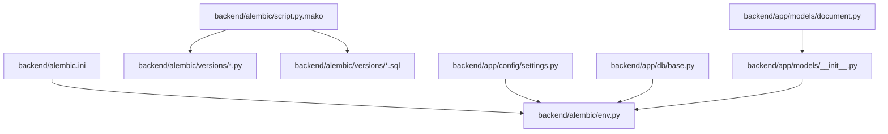
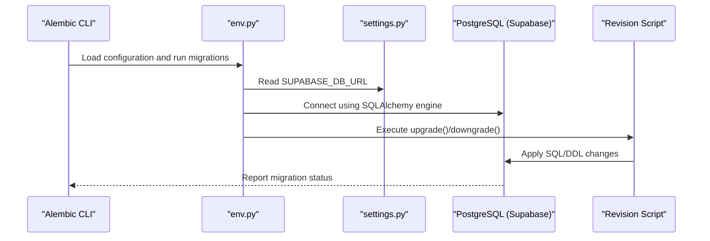
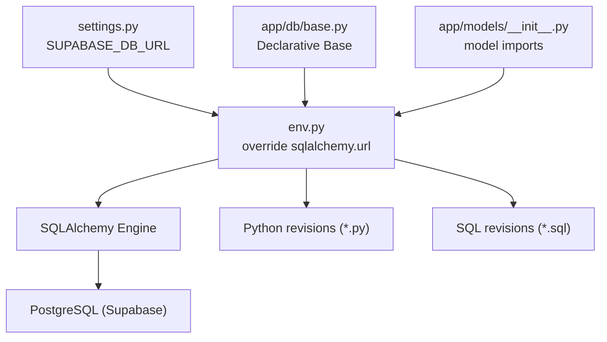

# Migration System

<cite>
**Referenced Files in This Document**
- [alembic.ini](file://backend/alembic.ini)
- [env.py](file://backend/alembic/env.py)
- [script.py.mako](file://backend/alembic/script.py.mako)
- [base.py](file://backend/app/db/base.py)
- [settings.py](file://backend/app/config/settings.py)
- [document.py](file://backend/app/models/document.py)
- [__init__.py](file://backend/app/models/__init__.py)
- [530ab1236474_baseline_schema.py](file://backend/alembic/versions/530ab1236474_baseline_schema.py)
- [1f7c085e7ef2_add_template_column_to_documents.py](file://backend/alembic/versions/1f7c085e7ef2_add_template_column_to_documents.py)
- [feat47_48_indexes_and_token_tracking.sql](file://backend/alembic/versions/feat47_48_indexes_and_token_tracking.sql)
</cite>

## Table of Contents
1. [Introduction](#introduction)
2. [Project Structure](#project-structure)
3. [Core Components](#core-components)
4. [Architecture Overview](#architecture-overview)
5. [Detailed Component Analysis](#detailed-component-analysis)
6. [Dependency Analysis](#dependency-analysis)
7. [Performance Considerations](#performance-considerations)
8. [Troubleshooting Guide](#troubleshooting-guide)
9. [Conclusion](#conclusion)
10. [Appendices](#appendices)

## Introduction
This document describes the database migration system used by the backend. The system leverages Alembic to manage schema evolution for a PostgreSQL-backed database configured via Supabase. The project uses a hybrid approach: most schema changes are applied through SQL-based Alembic revisions, while a small subset of revisions are Python-based. The migration environment is configured to read database credentials from application settings, ensuring consistency across environments.

## Project Structure
The migration system is organized under the backend directory with the following key elements:
- Alembic configuration and environment script
- Revision templates and versioned migrations
- Application settings and SQLAlchemy base for metadata discovery
- Example model definitions and imports

**Diagram sources**
- [alembic.ini](file://backend/alembic.ini)
- [env.py](file://backend/alembic/env.py)
- [script.py.mako](file://backend/alembic/script.py.mako)
- [settings.py](file://backend/app/config/settings.py)
- [base.py](file://backend/app/db/base.py)
- [__init__.py](file://backend/app/models/__init__.py)
- [document.py](file://backend/app/models/document.py)

**Section sources**
- [alembic.ini](file://backend/alembic.ini)
- [env.py](file://backend/alembic/env.py)
- [script.py.mako](file://backend/alembic/script.py.mako)
- [settings.py](file://backend/app/config/settings.py)
- [base.py](file://backend/app/db/base.py)
- [__init__.py](file://backend/app/models/__init__.py)
- [document.py](file://backend/app/models/document.py)

## Core Components
- Alembic configuration: Defines script locations, path separators, logging, and database URL injection.
- Environment script: Loads application settings and SQLAlchemy metadata, and runs migrations offline or online.
- Revision template: Provides a Mako template for generating Python-based revisions.
- Target metadata: SQLAlchemy Declarative Base used to populate the target metadata for autogenerate.
- Settings: Supplies the database URL used by Alembic for connecting to the database.
- Model registry: Ensures all models are imported so that Alembic’s autogenerate can discover them.

Key responsibilities:
- Centralized database URL resolution from application settings
- Offline vs online migration execution modes
- Autogenerate support via target metadata
- Idempotent revision logic for drift handling

**Section sources**
- [alembic.ini](file://backend/alembic.ini)
- [env.py](file://backend/alembic/env.py)
- [script.py.mako](file://backend/alembic/script.py.mako)
- [base.py](file://backend/app/db/base.py)
- [settings.py](file://backend/app/config/settings.py)
- [__init__.py](file://backend/app/models/__init__.py)

## Architecture Overview
The migration lifecycle integrates application configuration, Alembic, and the database:

**Diagram sources**
- [env.py](file://backend/alembic/env.py)
- [settings.py](file://backend/app/config/settings.py)

## Detailed Component Analysis

### Alembic Configuration (alembic.ini)
- script_location: Points to the Alembic directory containing migrations.
- path_separator: Controls how multiple paths are parsed for version locations and prepend_sys_path.
- sqlalchemy.url: Placeholder for the database URL; overridden at runtime by env.py.
- Logging: Configures logger levels for SQLAlchemy and Alembic handlers.

Operational notes:
- The database URL is intentionally left as a placeholder and injected at runtime to avoid committing secrets.
- Logging is tuned to reduce noise and focus on Alembic-level messages.

**Section sources**
- [alembic.ini](file://backend/alembic.ini)

### Migration Environment (env.py)
Responsibilities:
- Adds the project root to sys.path for imports.
- Imports application settings and SQLAlchemy Base to populate target metadata.
- Imports all models to ensure metadata is fully loaded for autogenerate.
- Supports offline and online migration modes:
  - Offline mode: Uses a URL directly without an Engine.
  - Online mode: Builds an Engine from configuration and binds a connection to the context.

Runtime overrides:
- Overrides the Alembic configuration’s sqlalchemy.url with settings.SUPABASE_DB_URL.
- Uses target_metadata from SQLAlchemy Base to enable autogenerate.

**Section sources**
- [env.py](file://backend/alembic/env.py)
- [settings.py](file://backend/app/config/settings.py)
- [base.py](file://backend/app/db/base.py)
- [__init__.py](file://backend/app/models/__init__.py)

### Revision Template (script.py.mako)
- Provides a Mako template for generating Python-based revisions.
- Declares revision identifiers and empty upgrade()/downgrade() functions.
- Enables optional imports and custom logic blocks.

Usage:
- Alembic uses this template to scaffold new revisions with proper metadata and placeholders for implementation.

**Section sources**
- [script.py.mako](file://backend/alembic/script.py.mako)

### Versioned Migrations

#### Baseline Schema (530ab1236474_baseline_schema.py)
- Purpose: Acts as a baseline revision to anchor subsequent migrations.
- Behavior: No-op upgrade/downgrade to maintain revision history continuity.

Implications:
- Establishes a known starting point for future schema changes.
- Keeps revision ancestry intact even if the schema is managed externally.

**Section sources**
- [530ab1236474_baseline_schema.py](file://backend/alembic/versions/530ab1236474_baseline_schema.py)

#### Add Template Column to Documents (1f7c085e7ef2_add_template_column_to_documents.py)
- Purpose: Adds a template column to the documents table.
- Implementation pattern:
  - Uses inspection to check for existing columns (idempotent).
  - Conditionally adds or drops the column in upgrade()/downgrade().
- Dependencies: References a prior revision by down_revision.

Idempotency:
- Checks for column existence before altering to handle drift scenarios.

**Section sources**
- [1f7c085e7ef2_add_template_column_to_documents.py](file://backend/alembic/versions/1f7c085e7ef2_add_template_column_to_documents.py)

#### Feature 47/48: Indexes, Constraints, and Token Tracking (feat47_48_indexes_and_token_tracking.sql)
- Purpose: Introduces performance indexes, foreign key constraints, and a new token usage tracking table.
- Implementation pattern:
  - Creates indexes with IF NOT EXISTS for idempotency.
  - Adds foreign keys conditionally using DO blocks.
  - Defines llm_token_usage table with computed totals and indexes.
- Notes: This is a SQL-based revision executed as raw SQL.

Best practices demonstrated:
- Defensive DDL with existence checks.
- Separation of concerns: indexes/constraints in one revision, new table in another.

**Section sources**
- [feat47_48_indexes_and_token_tracking.sql](file://backend/alembic/versions/feat47_48_indexes_and_token_tracking.sql)

### Model Metadata and Autogenerate
- SQLAlchemy Declarative Base is used as the target metadata source.
- All models are imported through the models package initializer to populate metadata.
- This enables Alembic’s autogenerate to detect differences between the declared models and the database schema.

Considerations:
- Ensure all models are imported before Alembic runs to avoid missing autogenerate diffs.
- Keep model definitions aligned with the intended schema to minimize unnecessary migrations.

**Section sources**
- [base.py](file://backend/app/db/base.py)
- [__init__.py](file://backend/app/models/__init__.py)
- [document.py](file://backend/app/models/document.py)

## Dependency Analysis
The migration system exhibits the following dependencies:

**Diagram sources**
- [settings.py](file://backend/app/config/settings.py)
- [env.py](file://backend/alembic/env.py)
- [base.py](file://backend/app/db/base.py)
- [__init__.py](file://backend/app/models/__init__.py)

**Section sources**
- [settings.py](file://backend/app/config/settings.py)
- [env.py](file://backend/alembic/env.py)
- [base.py](file://backend/app/db/base.py)
- [__init__.py](file://backend/app/models/__init__.py)

## Performance Considerations
- Indexes and constraints: The SQL revision introduces indexes on frequently queried columns and foreign keys to improve query performance and enforce referential integrity.
- Computed totals: The token usage table includes a stored generated column for total tokens, reducing per-query computation overhead.
- Idempotent DDL: Existence checks prevent redundant operations and reduce downtime risk during migrations.

Recommendations:
- Monitor query plans after applying index-heavy revisions.
- Consider partitioning or materialized views for very large tables if performance targets are not met.
- Batch related DDL statements within a single revision to minimize transaction duration.

**Section sources**
- [feat47_48_indexes_and_token_tracking.sql](file://backend/alembic/versions/feat47_48_indexes_and_token_tracking.sql)

## Troubleshooting Guide
Common issues and resolutions:
- Database URL not set:
  - Symptom: Migration fails due to missing URL.
  - Resolution: Ensure SUPABASE_DB_URL is present in the environment and loaded by settings.
- Drifted schema:
  - Symptom: Autogenerate detects differences or manual changes conflict with revisions.
  - Resolution: Use idempotent DDL patterns (existence checks) and align model definitions with the database state.
- Revision dependencies:
  - Symptom: Running a revision fails due to missing parent revision.
  - Resolution: Apply revisions in dependency order or adjust down_revision references to match the current head.
- Offline vs online mode:
  - Symptom: Differences between offline and online behavior.
  - Resolution: Verify that env.py overrides sqlalchemy.url consistently and that target_metadata is populated before running migrations.

**Section sources**
- [env.py](file://backend/alembic/env.py)
- [settings.py](file://backend/app/config/settings.py)
- [1f7c085e7ef2_add_template_column_to_documents.py](file://backend/alembic/versions/1f7c085e7ef2_add_template_column_to_documents.py)

## Conclusion
The migration system combines Alembic with application settings and SQLAlchemy metadata to provide a robust, environment-aware schema evolution mechanism. It supports both Python and SQL-based revisions, emphasizes idempotency, and integrates cleanly with the application’s configuration and model registry. Following the documented patterns ensures predictable upgrades, safe downgrades, and maintainable long-term schema governance.

## Appendices

### Migration Execution Commands
- Initialize or upgrade to head:
  - alembic upgrade head
- Downgrade to a specific revision:
  - alembic downgrade -1
  - alembic downgrade <revision-id>
- Generate a new revision:
  - alembic revision --autogenerate -m "Description"
- Generate a blank revision:
  - alembic revision -m "Description"

Notes:
- Ensure the environment variable SUPABASE_DB_URL is set before running commands.
- When using autogenerate, confirm that all models are imported so that target metadata reflects the latest schema.

**Section sources**
- [alembic.ini](file://backend/alembic.ini)
- [env.py](file://backend/alembic/env.py)
- [script.py.mako](file://backend/alembic/script.py.mako)

### Best Practices for Writing Migrations
- Idempotency:
  - Use existence checks for indexes, constraints, and columns.
  - Guard additions/removals with conditional logic.
- Backward compatibility:
  - Prefer nullable columns and defaults when extending schemas.
  - Avoid dropping columns or tables unless absolutely necessary; prefer deprecation cycles.
- Safety:
  - Test revisions on staging or local databases before applying to production.
  - Keep transactions short; batch related changes within a single revision.
- Documentation:
  - Include clear comments in SQL revisions explaining intent and impact.
  - Use descriptive revision messages and slug-like filenames.

**Section sources**
- [1f7c085e7ef2_add_template_column_to_documents.py](file://backend/alembic/versions/1f7c085e7ef2_add_template_column_to_documents.py)
- [feat47_48_indexes_and_token_tracking.sql](file://backend/alembic/versions/feat47_48_indexes_and_token_tracking.sql)

### Complex Migration Patterns
- Conditional DDL:
  - Use DO blocks and IF NOT EXISTS to safely introduce indexes and constraints.
- Data modeling:
  - Introduce new tables with appropriate indexes and foreign keys in a single revision.
- Token tracking:
  - Define computed columns and indexes to optimize reporting queries.

**Section sources**
- [feat47_48_indexes_and_token_tracking.sql](file://backend/alembic/versions/feat47_48_indexes_and_token_tracking.sql)

### Environment-Specific Migrations
- Use separate environment configurations to set SUPABASE_DB_URL for development, staging, and production.
- Keep revision dependencies consistent across environments to avoid divergent histories.

**Section sources**
- [settings.py](file://backend/app/config/settings.py)
- [env.py](file://backend/alembic/env.py)

### Production Deployment Procedures
- Pre-deploy:
  - Run alembic upgrade head on a maintenance window.
  - Verify logs and confirm successful completion.
- Post-deploy:
  - Validate schema and indexes using database introspection.
  - Confirm application endpoints that rely on new schema features.
- Rollback:
  - Use alembic downgrade to the previous revision if issues arise.
  - Ensure downgrade logic is tested and reversible.

**Section sources**
- [env.py](file://backend/alembic/env.py)
- [1f7c085e7ef2_add_template_column_to_documents.py](file://backend/alembic/versions/1f7c085e7ef2_add_template_column_to_documents.py)
- [feat47_48_indexes_and_token_tracking.sql](file://backend/alembic/versions/feat47_48_indexes_and_token_tracking.sql)