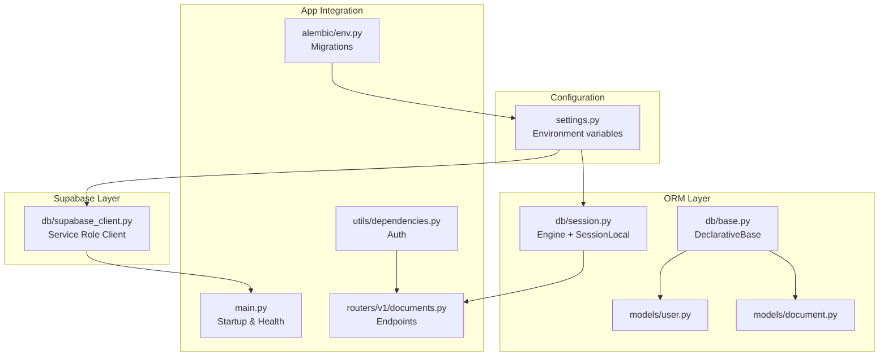
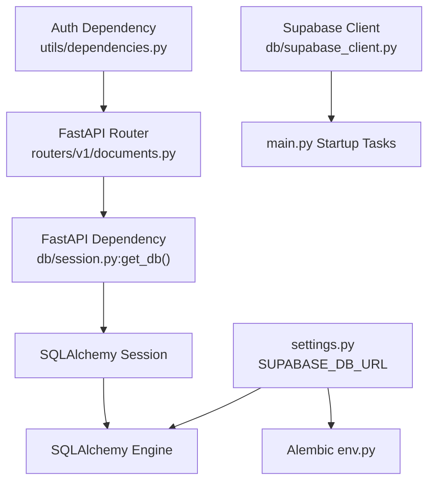
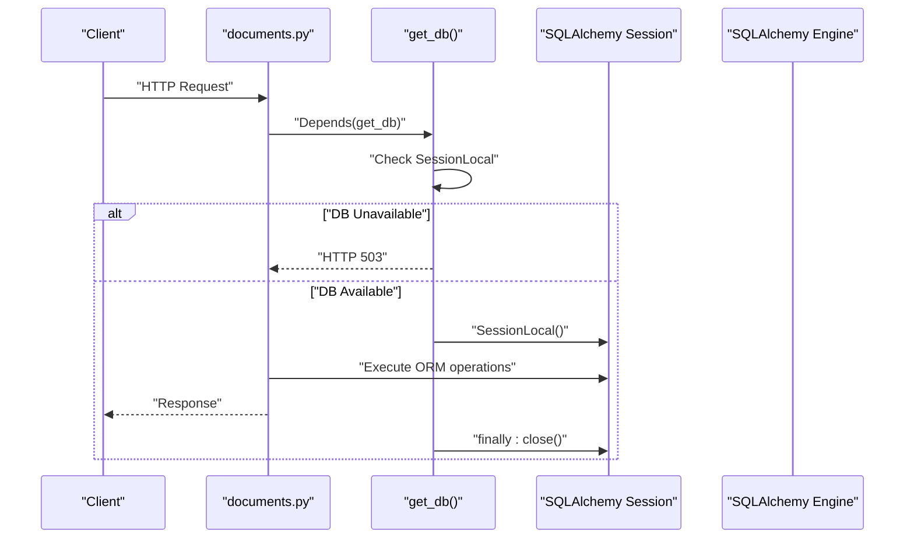
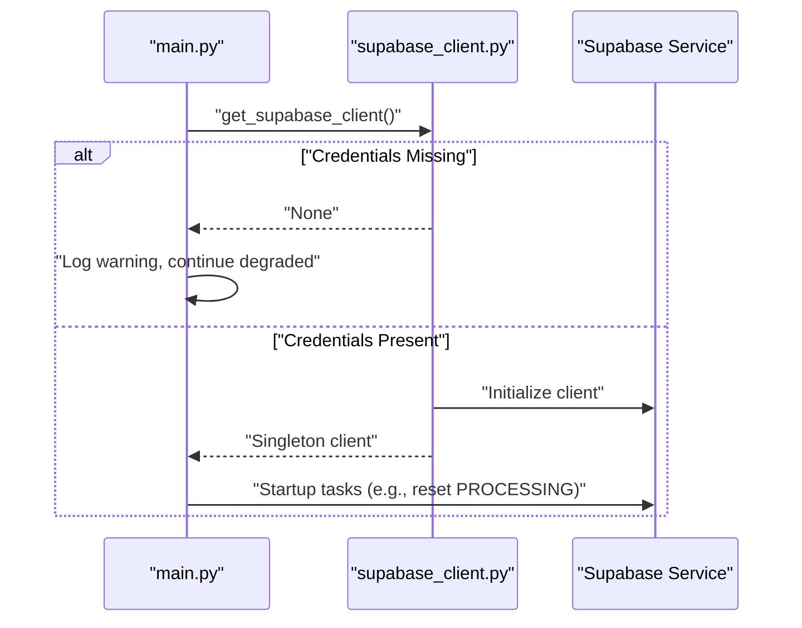
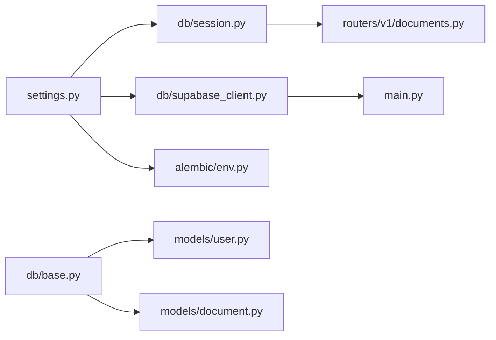

# ORM Configuration

<cite>
**Referenced Files in This Document**
- [base.py](file://backend/app/db/base.py)
- [session.py](file://backend/app/db/session.py)
- [supabase_client.py](file://backend/app/db/supabase_client.py)
- [settings.py](file://backend/app/config/settings.py)
- [env.py](file://backend/alembic/env.py)
- [user.py](file://backend/app/models/user.py)
- [document.py](file://backend/app/models/document.py)
- [main.py](file://backend/app/main.py)
- [documents.py](file://backend/app/routers/v1/documents.py)
- [dependencies.py](file://backend/app/utils/dependencies.py)
</cite>

## Table of Contents
1. [Introduction](#introduction)
2. [Project Structure](#project-structure)
3. [Core Components](#core-components)
4. [Architecture Overview](#architecture-overview)
5. [Detailed Component Analysis](#detailed-component-analysis)
6. [Dependency Analysis](#dependency-analysis)
7. [Performance Considerations](#performance-considerations)
8. [Troubleshooting Guide](#troubleshooting-guide)
9. [Conclusion](#conclusion)
10. [Appendices](#appendices)

## Introduction
This document explains the ORM configuration and database integration in the backend. It covers SQLAlchemy setup with a modern declarative base, session factory and dependency injection for FastAPI, connection pooling tuned for cloud Postgres (Supabase), and dual database layers: SQLAlchemy for schema/migrations and Supabase client for server-side RLS-bypassed operations. It also documents environment-driven configuration, health checks, transaction lifecycle, error handling, and practical usage patterns for queries and bulk-like operations.

## Project Structure
The database layer is organized around three pillars:
- Declarative base for ORM models
- SQLAlchemy engine and session factory with FastAPI dependency
- Supabase client for server-side database operations

**Diagram sources**
- [settings.py:1-422](file://backend/app/config/settings.py#L1-L422)
- [base.py:1-20](file://backend/app/db/base.py#L1-L20)
- [session.py:1-130](file://backend/app/db/session.py#L1-L130)
- [supabase_client.py:1-144](file://backend/app/db/supabase_client.py#L1-L144)
- [env.py:1-94](file://backend/alembic/env.py#L1-L94)
- [user.py:1-20](file://backend/app/models/user.py#L1-L20)
- [document.py:1-26](file://backend/app/models/document.py#L1-L26)
- [main.py:1-383](file://backend/app/main.py#L1-L383)
- [documents.py:1-359](file://backend/app/routers/v1/documents.py#L1-L359)
- [dependencies.py:1-93](file://backend/app/utils/dependencies.py#L1-L93)

**Section sources**
- [base.py:1-20](file://backend/app/db/base.py#L1-L20)
- [session.py:1-130](file://backend/app/db/session.py#L1-L130)
- [supabase_client.py:1-144](file://backend/app/db/supabase_client.py#L1-L144)
- [settings.py:1-422](file://backend/app/config/settings.py#L1-L422)
- [env.py:1-94](file://backend/alembic/env.py#L1-L94)
- [user.py:1-20](file://backend/app/models/user.py#L1-L20)
- [document.py:1-26](file://backend/app/models/document.py#L1-L26)
- [main.py:1-383](file://backend/app/main.py#L1-L383)
- [documents.py:1-359](file://backend/app/routers/v1/documents.py#L1-L359)
- [dependencies.py:1-93](file://backend/app/utils/dependencies.py#L1-L93)

## Core Components
- Declarative base: Centralized model base using SQLAlchemy’s modern DeclarativeBase to ensure forward compatibility and consistent metadata handling.
- Engine and session factory: Created from environment configuration with tuned pooling for cloud Postgres; provides a FastAPI dependency that yields a scoped session per request and handles errors gracefully.
- Supabase client: Singleton service-role client for server-side database operations that bypass RLS, with graceful degradation when credentials are missing.
- Environment configuration: Strongly typed settings loaded from .env with validation and normalization helpers.
- Alembic integration: Migration environment reads the same database URL from settings for offline/online migration runs.

**Section sources**
- [base.py:1-20](file://backend/app/db/base.py#L1-L20)
- [session.py:1-130](file://backend/app/db/session.py#L1-L130)
- [supabase_client.py:1-144](file://backend/app/db/supabase_client.py#L1-L144)
- [settings.py:1-422](file://backend/app/config/settings.py#L1-L422)
- [env.py:1-94](file://backend/alembic/env.py#L1-L94)

## Architecture Overview
The system supports two complementary data access paths:
- SQLAlchemy ORM path: For schema definition, migrations, and application models.
- Supabase client path: For server-side operations that require service role access and bypass RLS.

**Diagram sources**
- [documents.py:1-359](file://backend/app/routers/v1/documents.py#L1-L359)
- [session.py:1-130](file://backend/app/db/session.py#L1-L130)
- [settings.py:1-422](file://backend/app/config/settings.py#L1-L422)
- [env.py:1-94](file://backend/alembic/env.py#L1-L94)
- [supabase_client.py:1-144](file://backend/app/db/supabase_client.py#L1-L144)
- [dependencies.py:1-93](file://backend/app/utils/dependencies.py#L1-L93)
- [main.py:1-383](file://backend/app/main.py#L1-L383)

## Detailed Component Analysis

### Declarative Base Configuration
- Purpose: Provide a shared declarative base for all ORM models to ensure consistent metadata and forward compatibility.
- Behavior: Uses DeclarativeBase to avoid legacy deprecations and align with SQLAlchemy 2.x.

**Section sources**
- [base.py:1-20](file://backend/app/db/base.py#L1-L20)

### Session Factory and FastAPI Dependency
- Engine creation:
  - Reads database URL from environment settings.
  - Creates engine with tuned pool settings for cloud Postgres (Supabase).
  - Enables pre-ping to detect stale connections.
  - Logs warnings or errors when URL is missing or invalid.
- SessionLocal:
  - Bound to the engine; becomes None when engine is None (degraded mode).
- get_db():
  - FastAPI dependency that yields a session per request.
  - Raises HTTP 503 if DB is unconfigured.
  - Catches SQLAlchemy errors, rolls back the session, and returns HTTP 500.
  - Ensures session closure in finally.
- Health check:
  - check_db_health() validates connectivity by executing a simple query.

**Diagram sources**
- [session.py:79-112](file://backend/app/db/session.py#L79-L112)
- [documents.py:1-359](file://backend/app/routers/v1/documents.py#L1-L359)

**Section sources**
- [session.py:1-130](file://backend/app/db/session.py#L1-L130)

### Supabase Integration (Server-Side DB Layer)
- Client initialization:
  - Uses service role key for server-side operations.
  - Graceful degradation when URL or service role key are missing.
  - Suppresses known third-party deprecation warnings to keep logs clean.
- Singleton client:
  - get_supabase_client() returns a cached client; supports refresh for tests.
- get_supabase_db():
  - FastAPI dependency that returns the Supabase client or raises HTTP 503 if unconfigured.
- Health check:
  - check_supabase_health() performs a lightweight ping against a known table.

**Diagram sources**
- [supabase_client.py:85-123](file://backend/app/db/supabase_client.py#L85-L123)
- [main.py:177-196](file://backend/app/main.py#L177-L196)

**Section sources**
- [supabase_client.py:1-144](file://backend/app/db/supabase_client.py#L1-L144)
- [main.py:177-196](file://backend/app/main.py#L177-L196)

### Environment Configuration and Alembic Integration
- settings.py:
  - Loads environment variables from .env.
  - Defines SUPABASE_DB_URL and related Supabase keys.
  - Provides validators and normalization helpers.
- Alembic env.py:
  - Imports settings and Base.
  - Overrides migration URL from settings for both offline and online modes.
  - Ensures all models are imported so metadata is populated.

**Section sources**
- [settings.py:1-422](file://backend/app/config/settings.py#L1-L422)
- [env.py:1-94](file://backend/alembic/env.py#L1-L94)

### Models and Schema References
- Example models:
  - User: maps to the “profiles” table with UUID primary key and standard fields.
  - Document: maps to the “documents” table with UUID primary key, optional foreign key, and job state fields.
- These models rely on the shared Base and are imported by Alembic to populate metadata.

**Section sources**
- [user.py:1-20](file://backend/app/models/user.py#L1-L20)
- [document.py:1-26](file://backend/app/models/document.py#L1-L26)

### Transaction Management and Connection Lifecycle
- Per-request sessions:
  - get_db() creates a session per request and closes it in a finally block.
  - On SQLAlchemy exceptions, the session is rolled back and HTTP 500 is returned.
- Degraded mode:
  - If SUPABASE_DB_URL is missing, engine and SessionLocal become None; endpoints return HTTP 503.
- Health checks:
  - check_db_health() and check_supabase_health() provide status for monitoring.

**Section sources**
- [session.py:79-130](file://backend/app/db/session.py#L79-L130)

### Practical ORM Usage Patterns
- Typical request flow:
  - Router handler depends on get_db().
  - Perform ORM operations (query, insert, update).
  - Commit implicitly via transaction boundaries; ensure exceptions trigger rollback.
- Bulk-like operations:
  - Prefer SQLAlchemy bulk operations (bulk insert/update/delete) for higher throughput.
  - Use session.execute() with compiled statements for complex updates.
  - For very large datasets, consider pagination and batching to avoid long transactions.

[No sources needed since this section provides general guidance]

### Error Handling Patterns
- SQLAlchemy errors:
  - Caught in get_db(), logged, rollback performed, HTTP 500 raised.
- Missing DB configuration:
  - get_db() raises HTTP 503; health endpoints reflect unconfigured state.
- Supabase client failures:
  - Missing credentials lead to None; endpoints raise HTTP 503.
  - Health endpoint returns unhealthy with details.

**Section sources**
- [session.py:94-111](file://backend/app/db/session.py#L94-L111)
- [supabase_client.py:114-123](file://backend/app/db/supabase_client.py#L114-L123)

## Dependency Analysis
- Cohesion:
  - db/base.py and db/session.py form a cohesive ORM layer.
  - db/supabase_client.py forms a separate but integrated Supabase layer.
- Coupling:
  - session.py depends on settings.py for URL and on FastAPI for dependency injection.
  - env.py depends on settings.py and imports all models to populate metadata.
  - routers depend on get_db() for ORM access; main.py integrates Supabase client for startup tasks.
- External dependencies:
  - SQLAlchemy for ORM and connection pooling.
  - Alembic for migrations.
  - Supabase client for server-side DB operations.

**Diagram sources**
- [settings.py:1-422](file://backend/app/config/settings.py#L1-L422)
- [session.py:1-130](file://backend/app/db/session.py#L1-L130)
- [supabase_client.py:1-144](file://backend/app/db/supabase_client.py#L1-L144)
- [env.py:1-94](file://backend/alembic/env.py#L1-L94)
- [base.py:1-20](file://backend/app/db/base.py#L1-L20)
- [user.py:1-20](file://backend/app/models/user.py#L1-L20)
- [document.py:1-26](file://backend/app/models/document.py#L1-L26)
- [documents.py:1-359](file://backend/app/routers/v1/documents.py#L1-L359)
- [main.py:1-383](file://backend/app/main.py#L1-L383)

**Section sources**
- [session.py:1-130](file://backend/app/db/session.py#L1-L130)
- [supabase_client.py:1-144](file://backend/app/db/supabase_client.py#L1-L144)
- [env.py:1-94](file://backend/alembic/env.py#L1-L94)
- [documents.py:1-359](file://backend/app/routers/v1/documents.py#L1-L359)
- [main.py:1-383](file://backend/app/main.py#L1-L383)

## Performance Considerations
- Connection pooling:
  - Pool size and overflow tuned for cloud Postgres; pre-ping enabled to avoid stale connections after idle periods.
- Query execution:
  - Use bulk operations for high-volume inserts/updates.
  - Minimize transaction duration; commit early and keep sessions short-lived.
- Indexing and queries:
  - Ensure appropriate indexes on frequently filtered columns (e.g., user_id, status).
- Health and monitoring:
  - Use health endpoints to detect connectivity issues proactively.

[No sources needed since this section provides general guidance]

## Troubleshooting Guide
- Symptoms: Endpoints return HTTP 503.
  - Cause: SUPABASE_DB_URL or Supabase credentials not set.
  - Resolution: Set environment variables; verify .env is loaded.
- Symptoms: Requests fail mid-flight with HTTP 500.
  - Cause: SQLAlchemy error during request.
  - Resolution: Inspect logs; ensure rollback occurs; fix query logic.
- Symptoms: Health endpoint reports unhealthy.
  - Cause: Connectivity or credential issues.
  - Resolution: Validate URLs and keys; check network and firewall rules.

**Section sources**
- [session.py:94-111](file://backend/app/db/session.py#L94-L111)
- [supabase_client.py:126-144](file://backend/app/db/supabase_client.py#L126-L144)

## Conclusion
The backend employs a robust, environment-driven ORM configuration with a modern declarative base, a resilient session factory integrated into FastAPI, and a dedicated Supabase client for server-side operations. Connection pooling is tuned for cloud Postgres, and the system gracefully degrades when configuration is missing. Health checks and error handling ensure reliable operations, while Alembic integration maintains schema consistency across environments.

## Appendices

### Environment Variables and Settings
- Required for SQLAlchemy:
  - SUPABASE_DB_URL
- Required for Supabase client:
  - SUPABASE_URL
  - SUPABASE_SERVICE_ROLE_KEY
- Additional settings influence behavior:
  - DEBUG, FORCE_HTTPS, CORS_ORIGINS, and others as defined in settings.

**Section sources**
- [settings.py:76-82](file://backend/app/config/settings.py#L76-L82)
- [settings.py:267-273](file://backend/app/config/settings.py#L267-L273)

### Migration Workflow
- Alembic uses the database URL from settings for both offline and online migrations.
- Ensure all models are imported so metadata is populated before running migrations.

**Section sources**
- [env.py:14-31](file://backend/alembic/env.py#L14-L31)
- [env.py:51-87](file://backend/alembic/env.py#L51-L87)