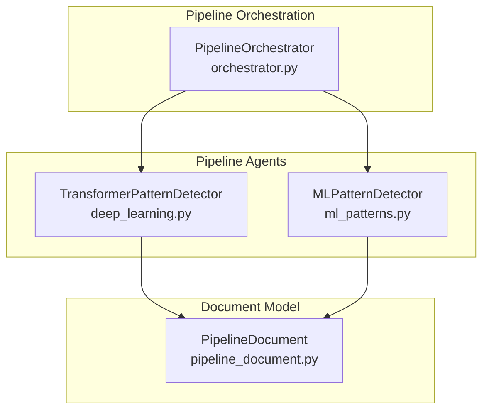
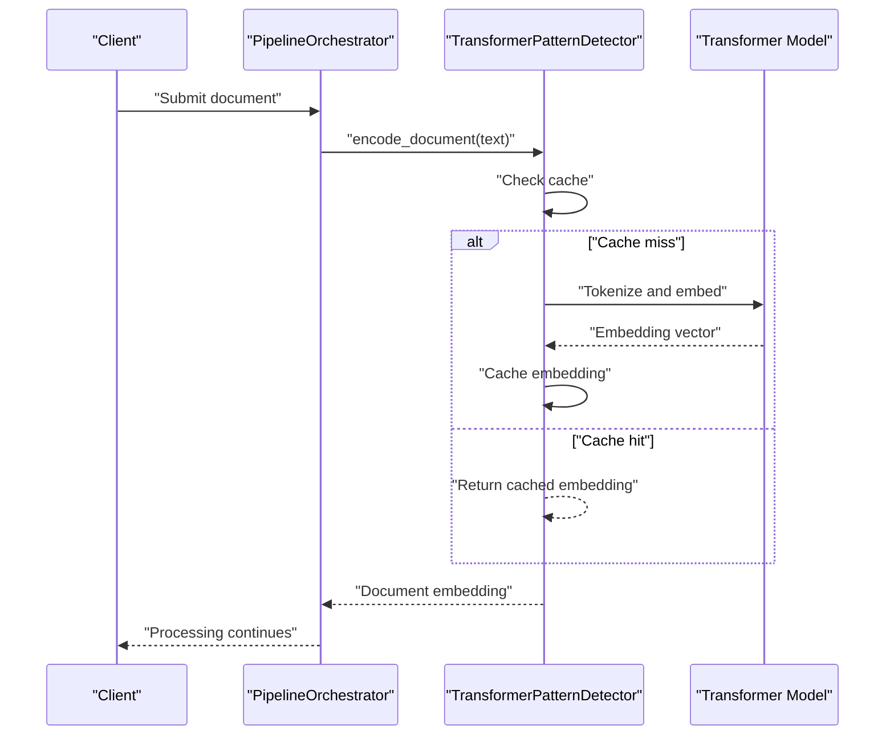
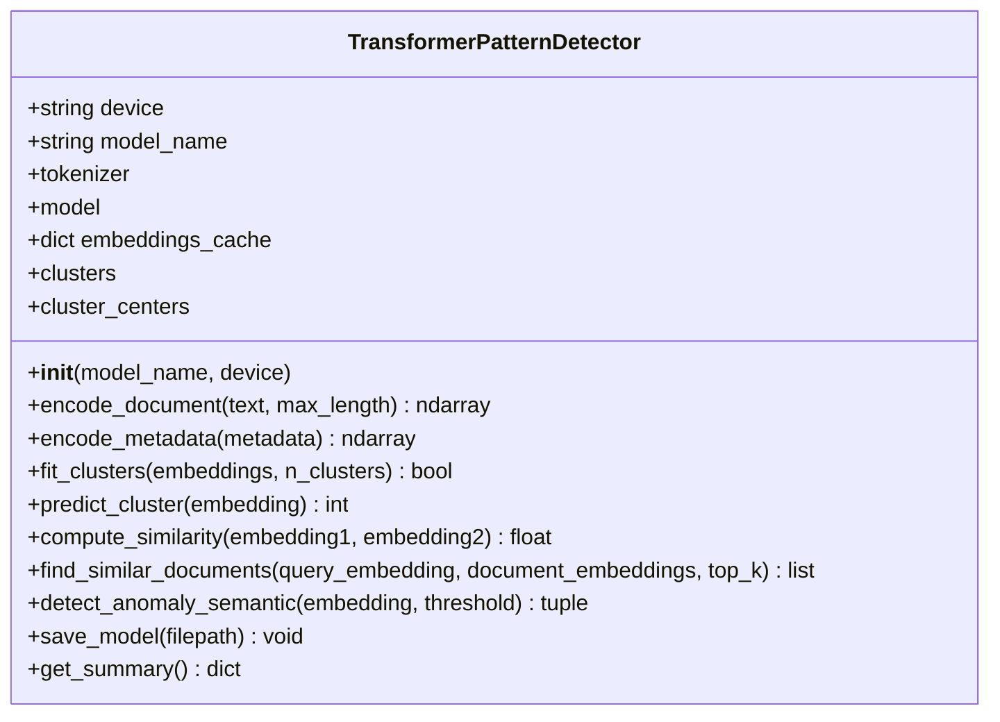
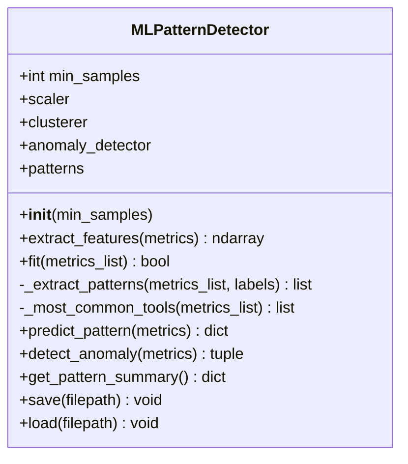
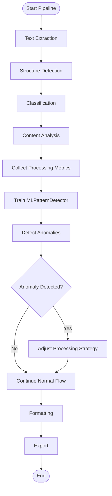
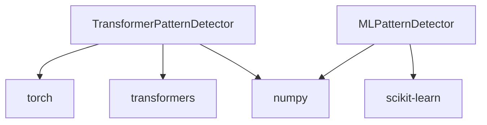

# Deep Learning Patterns

<cite>
**Referenced Files in This Document**
- [deep_learning.py](file://backend/app/pipeline/agents/deep_learning.py)
- [ml_patterns.py](file://backend/app/pipeline/agents/ml_patterns.py)
- [orchestrator.py](file://backend/app/pipeline/orchestrator.py)
- [pipeline_document.py](file://backend/app/models/pipeline_document.py)
- [test_global_safety.py](file://backend/tests/safety/test_global_safety.py)
- [test_advanced_features.py](file://backend/tests/test_advanced_features.py)
</cite>

## Table of Contents
1. [Introduction](#introduction)
2. [Project Structure](#project-structure)
3. [Core Components](#core-components)
4. [Architecture Overview](#architecture-overview)
5. [Detailed Component Analysis](#detailed-component-analysis)
6. [Dependency Analysis](#dependency-analysis)
7. [Performance Considerations](#performance-considerations)
8. [Troubleshooting Guide](#troubleshooting-guide)
9. [Conclusion](#conclusion)

## Introduction
This document explains the deep learning patterns implementation within the automated academic manuscript formatter. The system integrates machine learning and deep learning techniques to enhance document processing pipelines, focusing on:
- Transformer-based semantic embeddings for scientific text
- Clustering and anomaly detection for processing optimization
- Safe fallback mechanisms for robust operation
- Integration with the broader pipeline orchestration

The components documented here enable intelligent pattern recognition, anomaly detection, and adaptive processing strategies tailored for academic document workflows.

## Project Structure
The deep learning patterns are implemented as standalone agents within the pipeline. They are designed to be resilient and optionally integrated into the main processing flow.

**Diagram sources**
- [deep_learning.py:24-296](file://backend/app/pipeline/agents/deep_learning.py#L24-L296)
- [ml_patterns.py:17-216](file://backend/app/pipeline/agents/ml_patterns.py#L17-L216)
- [orchestrator.py:73-1227](file://backend/app/pipeline/orchestrator.py#L73-L1227)
- [pipeline_document.py:49-207](file://backend/app/models/pipeline_document.py#L49-L207)

**Section sources**
- [deep_learning.py:1-296](file://backend/app/pipeline/agents/deep_learning.py#L1-L296)
- [ml_patterns.py:1-216](file://backend/app/pipeline/agents/ml_patterns.py#L1-L216)
- [orchestrator.py:1-1227](file://backend/app/pipeline/orchestrator.py#L1-L1227)
- [pipeline_document.py:1-207](file://backend/app/models/pipeline_document.py#L1-L207)

## Core Components
- TransformerPatternDetector: Implements semantic embeddings using transformer models (e.g., SciBERT), caching, clustering, similarity computation, anomaly detection, and persistence.
- MLPatternDetector: Provides ML-based pattern detection using feature extraction, clustering, anomaly detection, and pattern summarization for processing metrics.

Key capabilities:
- Robust fallbacks when deep learning libraries are unavailable
- Caching for embeddings to improve performance
- Clustering for grouping similar documents or processing patterns
- Anomaly detection for identifying outliers
- Persistence mechanisms for model state

**Section sources**
- [deep_learning.py:24-296](file://backend/app/pipeline/agents/deep_learning.py#L24-L296)
- [ml_patterns.py:17-216](file://backend/app/pipeline/agents/ml_patterns.py#L17-L216)

## Architecture Overview
The deep learning patterns integrate with the pipeline orchestration to provide intelligent processing decisions. The orchestrator coordinates stages and can invoke pattern detectors to inform processing choices.

**Diagram sources**
- [orchestrator.py:522-544](file://backend/app/pipeline/orchestrator.py#L522-L544)
- [deep_learning.py:76-123](file://backend/app/pipeline/agents/deep_learning.py#L76-L123)

## Detailed Component Analysis

### TransformerPatternDetector
This component provides semantic understanding of scientific documents via transformer embeddings, enabling clustering and anomaly detection.

**Diagram sources**
- [deep_learning.py:24-296](file://backend/app/pipeline/agents/deep_learning.py#L24-L296)

Key behaviors:
- Embedding encoding with caching and fallback to zero vectors
- Metadata encoding by converting structured fields to text
- KMeans clustering for grouping embeddings
- Cosine similarity computation and similarity-based retrieval
- Anomaly detection against cluster centers
- Model persistence for embeddings and cluster centers

Integration points:
- Used by the orchestrator for semantic analysis and similarity checks
- Works with PipelineDocument to process scientific text

**Section sources**
- [deep_learning.py:24-296](file://backend/app/pipeline/agents/deep_learning.py#L24-L296)
- [pipeline_document.py:49-207](file://backend/app/models/pipeline_document.py#L49-L207)

### MLPatternDetector
This component applies machine learning to processing metrics to discover patterns and anomalies in document workflows.

**Diagram sources**
- [ml_patterns.py:17-216](file://backend/app/pipeline/agents/ml_patterns.py#L17-L216)

Key behaviors:
- Feature extraction from processing metrics
- DBSCAN clustering and Isolation Forest anomaly detection
- Pattern summarization per cluster
- Prediction of nearest pattern and anomaly scoring

Integration points:
- Can be invoked by orchestrator to optimize processing strategies based on historical metrics

**Section sources**
- [ml_patterns.py:17-216](file://backend/app/pipeline/agents/ml_patterns.py#L17-L216)

### PipelineOrchestrator Integration
The orchestrator coordinates pipeline stages and can incorporate pattern detectors for enhanced processing.

**Diagram sources**
- [orchestrator.py:522-800](file://backend/app/pipeline/orchestrator.py#L522-L800)
- [ml_patterns.py:57-94](file://backend/app/pipeline/agents/ml_patterns.py#L57-L94)

## Dependency Analysis
The deep learning components depend on external libraries and are designed to degrade gracefully when unavailable.

**Diagram sources**
- [deep_learning.py:7-18](file://backend/app/pipeline/agents/deep_learning.py#L7-L18)
- [ml_patterns.py:4-12](file://backend/app/pipeline/agents/ml_patterns.py#L4-L12)

Safety and resilience:
- Both detectors wrap critical operations with safe execution decorators to prevent crashes
- Fallbacks return sensible defaults (zero vectors, False, None) when dependencies are missing

**Section sources**
- [deep_learning.py:52-70](file://backend/app/pipeline/agents/deep_learning.py#L52-L70)
- [ml_patterns.py:57-94](file://backend/app/pipeline/agents/ml_patterns.py#L57-L94)
- [test_global_safety.py:112-145](file://backend/tests/safety/test_global_safety.py#L112-L145)

## Performance Considerations
- Embedding caching: TransformerPatternDetector caches embeddings to avoid repeated computation.
- Dimensionality: Transformer embeddings are 768-dimensional; clustering and similarity computations scale with dataset size.
- Clustering: KMeans clustering requires sufficient samples; ensure adequate training data.
- Anomaly detection: Isolation Forest and semantic similarity thresholds should be tuned for the domain.

Recommendations:
- Monitor memory usage during clustering and embedding operations.
- Use appropriate device selection (CPU vs GPU) for transformer inference.
- Persist model state periodically to avoid retraining costs.

[No sources needed since this section provides general guidance]

## Troubleshooting Guide
Common issues and resolutions:
- Missing dependencies: If torch or transformers are unavailable, detectors fall back to zero embeddings and log warnings.
- Training failures: Inspect minimum sample requirements and feature scaling.
- Timeout errors: Ensure adequate timeouts for semantic parsing and clustering operations.
- Anomaly detection false positives: Tune contamination and similarity thresholds.

Validation and tests:
- Safety tests verify fallback behavior under exceptions.
- Advanced feature tests validate training and anomaly detection workflows.

**Section sources**
- [test_global_safety.py:112-145](file://backend/tests/safety/test_global_safety.py#L112-L145)
- [test_advanced_features.py:38-80](file://backend/tests/test_advanced_features.py#L38-L80)

## Conclusion
The deep learning patterns implementation provides a robust foundation for semantic understanding and pattern recognition in academic document processing. By combining transformer embeddings with traditional ML techniques, the system achieves both precision and resilience. The modular design allows seamless integration with the pipeline orchestration, enabling adaptive and intelligent processing strategies.