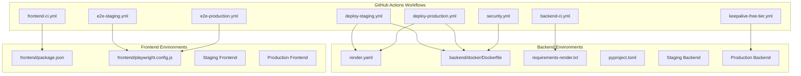
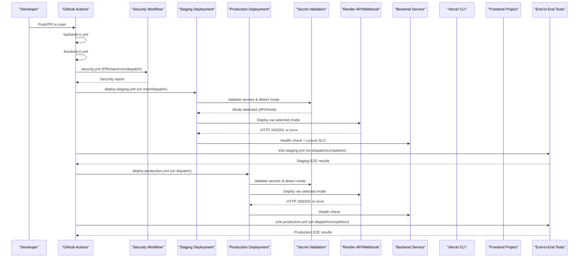
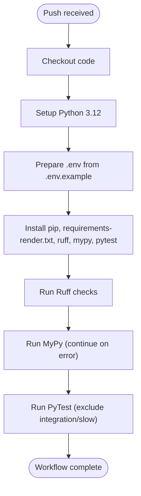
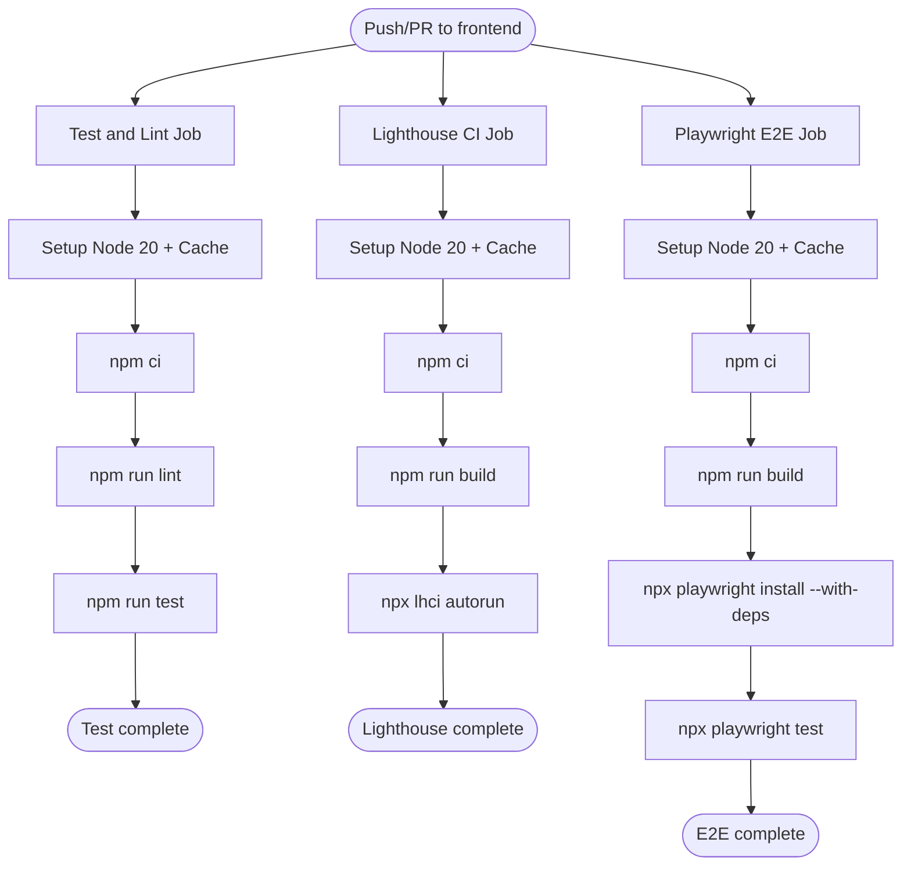
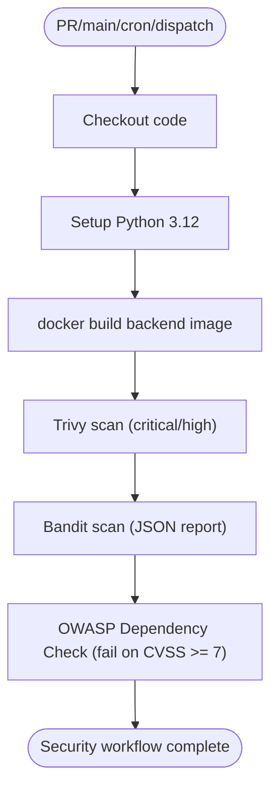
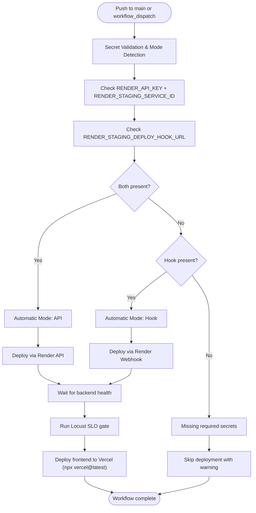
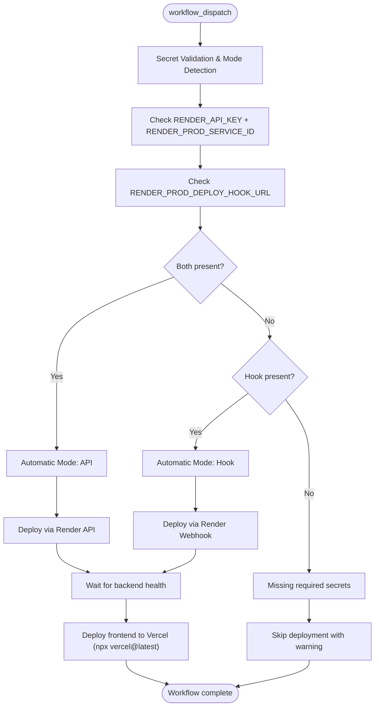
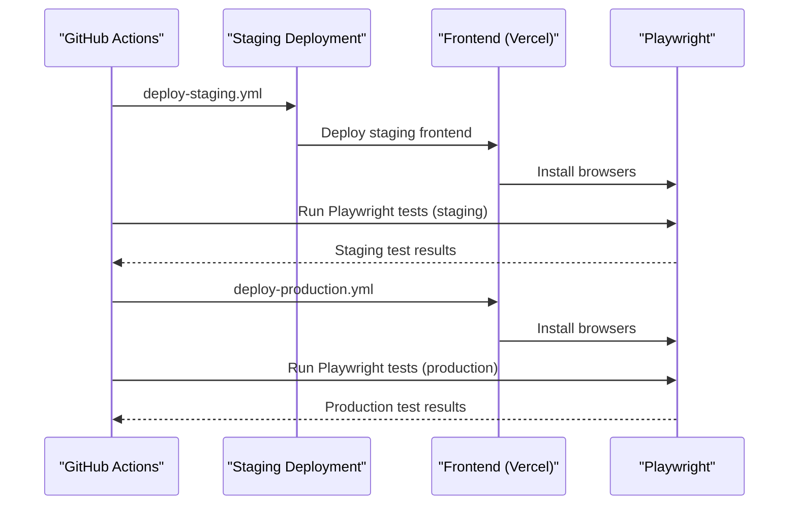
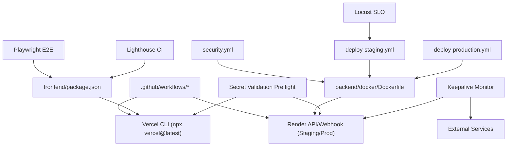

# CI/CD Pipeline

<cite>
**Referenced Files in This Document**
- [backend-ci.yml](file://.github/workflows/backend-ci.yml)
- [frontend-ci.yml](file://.github/workflows/frontend-ci.yml)
- [deploy-staging.yml](file://.github/workflows/deploy-staging.yml)
- [e2e-staging.yml](file://.github/workflows/e2e-staging.yml)
- [deploy-production.yml](file://.github/workflows/deploy-production.yml)
- [e2e-production.yml](file://.github/workflows/e2e-production.yml)
- [security.yml](file://.github/workflows/security.yml)
- [keepalive-free-tier.yml](file://.github/workflows/keepalive-free-tier.yml)
- [render.yaml](file://render.yaml)
- [Dockerfile](file://backend/docker/Dockerfile)
- [requirements-render.txt](file://backend/requirements-render.txt)
- [pyproject.toml](file://backend/pyproject.toml)
- [package.json](file://frontend/package.json)
- [playwright.config.js](file://frontend/playwright.config.js)
- [branch-protection.md](file://docs/runbooks/branch-protection.md)
- [rollback.md](file://docs/runbooks/rollback.md)
- [incident-response.md](file://docs/runbooks/incident-response.md)
- [ruff.toml](file://backend/ruff.toml)
- [mypy.ini](file://backend/mypy.ini)
</cite>

## Update Summary
**Changes Made**
- Added new staging deployment pipeline workflow (.github/workflows/deploy-staging.yml)
- Added new end-to-end testing workflow for staging (.github/workflows/e2e-staging.yml)
- Enhanced frontend CI workflow with improved build dependencies and separate test/lint jobs
- Updated deployment architecture to include staging environment alongside production
- Added comprehensive staging environment validation and dual deployment modes
- Integrated performance testing with Locust SLO gates for staging deployments
- Enhanced error handling and secret validation across all deployment workflows

## Table of Contents
1. [Introduction](#introduction)
2. [Project Structure](#project-structure)
3. [Core Components](#core-components)
4. [Architecture Overview](#architecture-overview)
5. [Detailed Component Analysis](#detailed-component-analysis)
6. [Multi-Environment Deployment Strategy](#multi-environment-deployment-strategy)
7. [Quality Gates and Testing](#quality-gates-and-testing)
8. [Dependency Analysis](#dependency-analysis)
9. [Performance Considerations](#performance-considerations)
10. [Troubleshooting Guide](#troubleshooting-guide)
11. [Conclusion](#conclusion)
12. [Appendices](#appendices)

## Introduction
This document describes the comprehensive CI/CD pipeline for the automated manuscript formatter project, covering automated testing, deployment workflows, and release management across multiple environments. The pipeline now includes both staging and production deployment workflows, enhanced frontend CI processes, and integrated quality gates including security scanning, performance testing, and end-to-end validation. It explains the GitHub Actions workflows for backend and frontend, including build processes, testing phases, and deployment triggers. The multi-stage deployment pipeline supports both development and production environments with quality gates, security scanning, performance validation, and rollback procedures. Branch protection rules, code review requirements, and automated deployment strategies are covered along with comprehensive troubleshooting guidance.

**Updated** Enhanced with staging deployment pipeline, comprehensive frontend CI improvements, and integrated performance testing capabilities.

## Project Structure
The CI/CD system is organized around GitHub Actions workflows with support for multiple deployment environments:
- Workflows are defined under .github/workflows for backend-ci, frontend-ci, staging deployment, production deployment, security scanning, end-to-end testing, and keepalive monitoring.
- Backend deployment supports both staging and production environments with Render API/webhook deployment modes.
- Frontend deployment targets Vercel for both staging and production environments.
- Quality gates include linting (Ruff, ESLint), type checking (Mypy), unit/integration tests, security scanning, and performance validation.
- Security scanning uses Trivy, Bandit, and OWASP Dependency Check.
- End-to-end tests run against both staging and production frontend environments.
- Keepalive workflows monitor free-tier service health and prevent cold starts.

**Diagram sources**
- [backend-ci.yml:1-41](file://.github/workflows/backend-ci.yml#L1-L41)
- [frontend-ci.yml:1-96](file://.github/workflows/frontend-ci.yml#L1-L96)
- [deploy-staging.yml:1-151](file://.github/workflows/deploy-staging.yml#L1-L151)
- [deploy-production.yml:1-121](file://.github/workflows/deploy-production.yml#L1-L121)
- [e2e-staging.yml:1-60](file://.github/workflows/e2e-staging.yml#L1-L60)
- [e2e-production.yml:1-60](file://.github/workflows/e2e-production.yml#L1-L60)
- [security.yml:1-51](file://.github/workflows/security.yml#L1-L51)
- [keepalive-free-tier.yml:1-89](file://.github/workflows/keepalive-free-tier.yml#L1-L89)
- [render.yaml:1-15](file://render.yaml#L1-L15)
- [Dockerfile:1-24](file://backend/docker/Dockerfile#L1-L24)
- [requirements-render.txt:1-138](file://backend/requirements-render.txt#L1-L138)
- [pyproject.toml:1-9](file://backend/pyproject.toml#L1-L9)
- [package.json:1-69](file://frontend/package.json#L1-L69)
- [playwright.config.js:1-48](file://frontend/playwright.config.js#L1-L48)

**Section sources**
- [backend-ci.yml:1-41](file://.github/workflows/backend-ci.yml#L1-L41)
- [frontend-ci.yml:1-96](file://.github/workflows/frontend-ci.yml#L1-L96)
- [deploy-staging.yml:1-151](file://.github/workflows/deploy-staging.yml#L1-L151)
- [deploy-production.yml:1-121](file://.github/workflows/deploy-production.yml#L1-L121)
- [e2e-staging.yml:1-60](file://.github/workflows/e2e-staging.yml#L1-L60)
- [e2e-production.yml:1-60](file://.github/workflows/e2e-production.yml#L1-L60)
- [security.yml:1-51](file://.github/workflows/security.yml#L1-L51)
- [keepalive-free-tier.yml:1-89](file://.github/workflows/keepalive-free-tier.yml#L1-L89)
- [render.yaml:1-15](file://render.yaml#L1-L15)
- [Dockerfile:1-24](file://backend/docker/Dockerfile#L1-L24)
- [requirements-render.txt:1-138](file://backend/requirements-render.txt#L1-L138)
- [pyproject.toml:1-9](file://backend/pyproject.toml#L1-L9)
- [package.json:1-69](file://frontend/package.json#L1-L69)
- [playwright.config.js:1-48](file://frontend/playwright.config.js#L1-L48)

## Core Components
- **Backend CI workflow** validates Python code with Ruff and MyPy, and runs unit tests excluding slow and integration suites.
- **Enhanced Frontend CI workflow** now includes separate jobs for testing and linting, Lighthouse CI integration, and Playwright E2E testing with improved dependency management.
- **Staging Deployment workflow** provides comprehensive staging environment validation with dual deployment modes (Render API and webhook), automatic mode detection, robust error handling, and performance validation using Locust SLO gates.
- **Production Deployment workflow** maintains the existing production deployment process with enhanced secret validation and dual deployment modes.
- **End-to-end testing workflows** provide separate testing pipelines for staging and production environments with comprehensive browser testing.
- **Security workflow** builds backend images and scans them with Trivy, Bandit, and OWASP Dependency Check.
- **Keepalive workflow** monitors free-tier service health to prevent cold starts and maintain service availability.
- **Branch protection** enforces required status checks and pull request reviews before merging to main.
- **Rollback and incident response** runbooks provide remediation playbooks for production issues.

**Updated** Enhanced with comprehensive staging deployment pipeline, improved frontend CI processes, and integrated performance testing capabilities.

**Section sources**
- [backend-ci.yml:1-41](file://.github/workflows/backend-ci.yml#L1-L41)
- [frontend-ci.yml:1-96](file://.github/workflows/frontend-ci.yml#L1-L96)
- [deploy-staging.yml:1-151](file://.github/workflows/deploy-staging.yml#L1-L151)
- [deploy-production.yml:1-121](file://.github/workflows/deploy-production.yml#L1-L121)
- [e2e-staging.yml:1-60](file://.github/workflows/e2e-staging.yml#L1-L60)
- [e2e-production.yml:1-60](file://.github/workflows/e2e-production.yml#L1-L60)
- [security.yml:1-51](file://.github/workflows/security.yml#L1-L51)
- [keepalive-free-tier.yml:1-89](file://.github/workflows/keepalive-free-tier.yml#L1-L89)
- [branch-protection.md:1-14](file://docs/runbooks/branch-protection.md#L1-L14)
- [rollback.md:1-24](file://docs/runbooks/rollback.md#L1-L24)
- [incident-response.md:1-47](file://docs/runbooks/incident-response.md#L1-L47)

## Architecture Overview
The CI/CD pipeline now supports a multi-environment deployment strategy with comprehensive quality gates:
- **Build and Test Phase**: Separate backend and frontend workflows execute linting, type checking, unit tests, and specialized testing (Lighthouse, Playwright).
- **Security Gate**: Security workflow validates backend images for vulnerabilities and dependency issues.
- **Deployment Phase**: Both staging and production deployment workflows trigger backend and frontend deployments with environment-specific validation.
- **Validation Phase**: End-to-end testing runs against deployed environments, with staging additionally running performance validation.
- **Monitoring Phase**: Keepalive workflows monitor service health and prevent cold starts.

**Updated** Enhanced with multi-environment deployment strategy and integrated performance testing.

**Diagram sources**
- [backend-ci.yml:1-41](file://.github/workflows/backend-ci.yml#L1-L41)
- [frontend-ci.yml:1-96](file://.github/workflows/frontend-ci.yml#L1-L96)
- [security.yml:1-51](file://.github/workflows/security.yml#L1-L51)
- [deploy-staging.yml:1-151](file://.github/workflows/deploy-staging.yml#L1-L151)
- [deploy-production.yml:1-121](file://.github/workflows/deploy-production.yml#L1-L121)
- [e2e-staging.yml:1-60](file://.github/workflows/e2e-staging.yml#L1-L60)
- [e2e-production.yml:1-60](file://.github/workflows/e2e-production.yml#L1-L60)

## Detailed Component Analysis

### Backend CI Workflow
- Triggers on all pushes to any branch.
- Sets up Python 3.12, prepares environment, installs dependencies, runs Ruff, MyPy (continue on error), and PyTest excluding integration and slow markers.

**Diagram sources**
- [backend-ci.yml:1-41](file://.github/workflows/backend-ci.yml#L1-L41)
- [requirements-render.txt:1-138](file://backend/requirements-render.txt#L1-L138)
- [ruff.toml:1-11](file://backend/ruff.toml#L1-L11)
- [mypy.ini:1-10](file://backend/mypy.ini#L1-L10)

**Section sources**
- [backend-ci.yml:1-41](file://.github/workflows/backend-ci.yml#L1-L41)
- [ruff.toml:1-11](file://backend/ruff.toml#L1-L11)
- [mypy.ini:1-10](file://backend/mypy.ini#L1-L10)
- [requirements-render.txt:1-138](file://backend/requirements-render.txt#L1-L138)

### Enhanced Frontend CI Workflow
**Updated** Now includes separate jobs for testing and linting, Lighthouse CI integration, and Playwright E2E testing with improved dependency management.

- **Test and Lint Job**: Runs ESLint and unit tests using Vitest with npm ci for deterministic installs.
- **Lighthouse CI Job**: Builds the application and runs Lighthouse CI for performance monitoring.
- **Playwright E2E Job**: Builds the application, installs Playwright browsers with dependencies, and runs end-to-end tests.
- All jobs use npm ci with proper caching for optimal performance.

**Diagram sources**
- [frontend-ci.yml:16-41](file://.github/workflows/frontend-ci.yml#L16-L41)
- [frontend-ci.yml:42-66](file://.github/workflows/frontend-ci.yml#L42-L66)
- [frontend-ci.yml:68-96](file://.github/workflows/frontend-ci.yml#L68-L96)
- [package.json:1-69](file://frontend/package.json#L1-L69)

**Section sources**
- [frontend-ci.yml:1-96](file://.github/workflows/frontend-ci.yml#L1-L96)
- [package.json:1-69](file://frontend/package.json#L1-L69)

### Security Workflow
- Runs on pull_request to main/develop, workflow_dispatch, and a weekly cron.
- Builds backend image from backend/docker/Dockerfile.
- Scans with Trivy for critical/high severity, Bandit for Python security issues, and OWASP Dependency Check for CVE thresholds.

**Diagram sources**
- [security.yml:1-51](file://.github/workflows/security.yml#L1-L51)
- [Dockerfile:1-24](file://backend/docker/Dockerfile#L1-L24)

**Section sources**
- [security.yml:1-51](file://.github/workflows/security.yml#L1-L51)
- [Dockerfile:1-24](file://backend/docker/Dockerfile#L1-L24)

### Enhanced Staging Deployment Workflow
**Updated** Comprehensive staging deployment pipeline with dual deployment modes, automatic mode detection, robust error handling, performance validation, and integrated Locust SLO gates.

- Triggers on workflow_dispatch or push to main branch.
- **Comprehensive secret validation preflight** with automatic mode detection between Render API and webhook deployment.
- **Dual deployment modes** with automatic detection based on available secrets.
- **Robust error handling** with HTTP status code validation for both deployment methods.
- **Graceful degradation** when deployment hooks fail, allowing alternative deployment methods.
- **Performance validation** using Locust SLO gates with configurable targets (P95 < 500ms, RPS > 100, 0% failure ratio).
- Deploys backend to Render via selected mode (API or webhook), waits for backend health endpoint, runs performance tests, then deploys frontend to Vercel using npx vercel@latest.

**Diagram sources**
- [deploy-staging.yml:17-54](file://.github/workflows/deploy-staging.yml#L17-L54)
- [deploy-staging.yml:56-87](file://.github/workflows/deploy-staging.yml#L56-L87)
- [deploy-staging.yml:119-134](file://.github/workflows/deploy-staging.yml#L119-L134)

**Section sources**
- [deploy-staging.yml:1-151](file://.github/workflows/deploy-staging.yml#L1-L151)
- [render.yaml:1-15](file://render.yaml#L1-L15)

### Enhanced Production Deployment Workflow
**Updated** Maintains existing production deployment process with enhanced secret validation and dual deployment modes.

- Triggers on workflow_dispatch.
- **Comprehensive secret validation preflight** with automatic mode detection between Render API and webhook deployment.
- **Dual deployment modes** with automatic detection based on available secrets.
- **Robust error handling** with HTTP status code validation for both deployment methods.
- **Graceful degradation** when deployment hooks fail, allowing alternative deployment methods.
- Deploys backend to Render via selected mode (API or webhook), waits for backend health endpoint, then deploys frontend to Vercel using npx vercel@latest.

**Diagram sources**
- [deploy-production.yml:13-50](file://.github/workflows/deploy-production.yml#L13-L50)
- [deploy-production.yml:52-85](file://.github/workflows/deploy-production.yml#L52-L85)

**Section sources**
- [deploy-production.yml:1-121](file://.github/workflows/deploy-production.yml#L1-L121)
- [render.yaml:1-15](file://render.yaml#L1-L15)

### Enhanced End-to-End Testing Workflows
**Updated** Separate E2E testing workflows for staging and production environments with comprehensive browser testing.

#### Staging E2E Workflow
- Triggers on workflow_dispatch or when deploy-staging completes successfully.
- **Secret validation** ensures STAGING_FRONTEND_URL is configured before running tests.
- Installs Playwright browsers, runs Playwright tests against the staging frontend URL with authentication credentials.

#### Production E2E Workflow
- Triggers on workflow_dispatch or when deploy-production completes successfully.
- **Secret validation** ensures PROD_FRONTEND_URL is configured before running tests.
- Installs Playwright browsers, runs Playwright tests against the production frontend URL with authentication credentials.

**Diagram sources**
- [e2e-staging.yml:1-60](file://.github/workflows/e2e-staging.yml#L1-L60)
- [e2e-production.yml:1-60](file://.github/workflows/e2e-production.yml#L1-L60)
- [playwright.config.js:1-48](file://frontend/playwright.config.js#L1-L48)

**Section sources**
- [e2e-staging.yml:1-60](file://.github/workflows/e2e-staging.yml#L1-L60)
- [e2e-production.yml:1-60](file://.github/workflows/e2e-production.yml#L1-L60)
- [playwright.config.js:1-48](file://frontend/playwright.config.js#L1-L48)

### Keepalive Monitoring Workflow
**New** Monitors free-tier service health to prevent cold starts and maintain service availability.

- Runs on schedule every 14 minutes and workflow_dispatch.
- **Backend health monitoring** pings Render backend live endpoint to prevent cold starts.
- **External service monitoring** probes Hugging Face primary/shadow services for multiple pipeline components.
- **Health validation** ensures all critical endpoints return HTTP 200 status codes.

**Section sources**
- [keepalive-free-tier.yml:1-89](file://.github/workflows/keepalive-free-tier.yml#L1-L89)

### Branch Protection and Review Requirements
- Required status checks include backend-ci, frontend-ci, security, and environment-specific deployment workflows.
- Pull requests require review approval and passing status checks before merging into main.
- Direct pushes to main are disallowed.

**Section sources**
- [branch-protection.md:1-14](file://docs/runbooks/branch-protection.md#L1-L14)

### Rollback Procedures
- Backend (Render): Use the dashboard to rollback to a previous known-good deploy and verify readiness.
- Frontend (Vercel): Promote a previous known-good deployment to production.
- Database migrations (Alembic): Downgrade the last migration if needed.
- Feature flags: Disable problematic features via environment flags and redeploy if necessary.

**Section sources**
- [rollback.md:1-24](file://docs/runbooks/rollback.md#L1-L24)

### Incident Response Playbooks
- Alert matrix defines thresholds for error rates, latency, queue depth, LLM performance, realtime connections, antivirus scans, and readiness.
- Response playbooks outline immediate actions, escalation, and verification steps per incident type.

**Section sources**
- [incident-response.md:1-47](file://docs/runbooks/incident-response.md#L1-L47)

## Multi-Environment Deployment Strategy
**Updated** Enhanced deployment architecture now supports both staging and production environments with comprehensive validation and quality gates.

The pipeline implements a two-tier deployment strategy:

### Staging Environment
- **Purpose**: Development and integration testing before production deployment.
- **Validation**: Comprehensive secret validation, dual deployment modes, health checks, and performance validation.
- **Quality Gates**: Backend health validation, Locust SLO performance testing, and end-to-end browser testing.
- **Rollback**: Can be rolled back independently without affecting production.

### Production Environment  
- **Purpose**: Live application serving end users.
- **Validation**: Same comprehensive validation as staging but with production-specific secrets and URLs.
- **Quality Gates**: Backend health validation and end-to-end browser testing.
- **Rollback**: Full rollback procedures available with database migration support.

### Deployment Triggers
- **Staging**: Manual dispatch or automatic on main branch pushes.
- **Production**: Manual dispatch only for controlled releases.
- **Security**: Automatic on PRs and scheduled scans.

**Section sources**
- [deploy-staging.yml:1-151](file://.github/workflows/deploy-staging.yml#L1-L151)
- [deploy-production.yml:1-121](file://.github/workflows/deploy-production.yml#L1-L121)

## Quality Gates and Testing
**Updated** Enhanced quality assurance with comprehensive testing across multiple environments and specialized validation.

### Code Quality Gates
- **Backend**: Ruff linting, MyPy type checking, PyTest unit/integration tests.
- **Frontend**: ESLint linting, Vitest unit tests, Lighthouse CI performance monitoring.
- **Security**: Trivy vulnerability scanning, Bandit Python security analysis, OWASP dependency checking.

### Environment Validation
- **Secret Validation**: Comprehensive preflight checks ensuring all required deployment secrets are configured.
- **Deployment Modes**: Automatic detection between Render API and webhook deployment methods.
- **Health Checks**: Post-deploy health validation with timeout handling.

### Performance Testing
- **Staging**: Locust SLO gates with configurable targets (P95 < 500ms, RPS > 100, 0% failure ratio).
- **Production**: End-to-end testing validation without performance constraints.

### Browser Testing
- **Staging**: Playwright E2E tests against staging frontend with authentication.
- **Production**: Playwright E2E tests against production frontend with authentication.

**Section sources**
- [backend-ci.yml:1-41](file://.github/workflows/backend-ci.yml#L1-L41)
- [frontend-ci.yml:1-96](file://.github/workflows/frontend-ci.yml#L1-L96)
- [security.yml:1-51](file://.github/workflows/security.yml#L1-L51)
- [deploy-staging.yml:119-134](file://.github/workflows/deploy-staging.yml#L119-L134)
- [e2e-staging.yml:1-60](file://.github/workflows/e2e-staging.yml#L1-L60)
- [e2e-production.yml:1-60](file://.github/workflows/e2e-production.yml#L1-L60)

## Dependency Analysis
**Updated** Enhanced dependency analysis reflecting the expanded CI/CD ecosystem with multiple environments and specialized tools.

The CI/CD pipeline depends on:
- GitHub Actions runners for orchestration across multiple workflows.
- Render for backend hosting and deployment automation with dual deployment modes for both staging and production.
- Vercel for frontend hosting and deployment automation using npx vercel@latest for both staging and production.
- Docker image built from backend/docker/Dockerfile for security scanning and production deployment.
- Platform-specific toolchains (Python 3.12, Node 20) and dependency manifests (requirements-render.txt, package.json).
- Specialized testing tools (Playwright, LHCI, Locust) for comprehensive quality assurance.
- External service monitoring for free-tier dependencies (Hugging Face services).

**Updated** Enhanced with staging deployment dependencies, performance testing tools, and external service monitoring.

**Diagram sources**
- [deploy-staging.yml:1-151](file://.github/workflows/deploy-staging.yml#L1-L151)
- [deploy-production.yml:1-121](file://.github/workflows/deploy-production.yml#L1-L121)
- [security.yml:1-51](file://.github/workflows/security.yml#L1-L51)
- [frontend-ci.yml:1-96](file://.github/workflows/frontend-ci.yml#L1-L96)
- [keepalive-free-tier.yml:1-89](file://.github/workflows/keepalive-free-tier.yml#L1-L89)
- [Dockerfile:1-24](file://backend/docker/Dockerfile#L1-L24)
- [package.json:1-69](file://frontend/package.json#L1-L69)

**Section sources**
- [deploy-staging.yml:1-151](file://.github/workflows/deploy-staging.yml#L1-L151)
- [deploy-production.yml:1-121](file://.github/workflows/deploy-production.yml#L1-L121)
- [security.yml:1-51](file://.github/workflows/security.yml#L1-L51)
- [frontend-ci.yml:1-96](file://.github/workflows/frontend-ci.yml#L1-L96)
- [keepalive-free-tier.yml:1-89](file://.github/workflows/keepalive-free-tier.yml#L1-L89)
- [Dockerfile:1-24](file://backend/docker/Dockerfile#L1-L24)
- [package.json:1-69](file://frontend/package.json#L1-L69)

## Performance Considerations
**Updated** Enhanced performance considerations reflecting the expanded testing and deployment capabilities.

- **Parallelism**: Frontend CI jobs are structured to minimize resource contention while ensuring comprehensive testing coverage.
- **Caching**: Optimized npm ci usage with dependency path caching for deterministic installs; backend uses pip with requirements-render.txt.
- **Image size and build time**: Keep backend dependencies minimal; consolidate Docker layers and leverage multi-stage builds if necessary.
- **E2E test execution**: Browser fan-out limited in CI; the configuration sets workers to 1 in CI to reduce overhead.
- **Health checks**: Post-deploy health checks prevent traffic redirection to unhealthy instances.
- **Performance validation**: Staging includes Locust SLO gates with configurable performance targets to ensure quality standards.
- **Secret validation preflight**: Reduces deployment failures and improves reliability by catching configuration issues early.
- **Dual deployment modes**: Provide fallback options when one deployment method fails, improving overall deployment success rates.
- **Keepalive monitoring**: Prevents cold starts for free-tier services, maintaining consistent performance.

**Updated** Enhanced with performance considerations for new staging deployment features and performance testing capabilities.

## Troubleshooting Guide
**Updated** Comprehensive troubleshooting guide reflecting the expanded CI/CD ecosystem with multiple environments and specialized tools.

Common CI/CD issues and resolutions:

### Backend Issues
- **Backend lint/type failures**: Fix Ruff violations or suppress selectively per ruff.toml; address MyPy issues or adjust mypy.ini.
- **Backend test failures**: Review test output and fix failing unit/integration tests; check PyTest markers for excluded tests.

### Frontend Issues  
- **Frontend lint failures**: Resolve ESLint errors; ensure strictness and module resolution match tsconfig.json.
- **Frontend test failures**: Review Vitest output and fix failing unit tests; check component rendering and state management.
- **Frontend build failures**: Verify npm ci installs all dependencies; check package.json scripts and build configuration.

### Security Scan Issues
- **Security scan failures**: Address Trivy critical/high findings; fix Bandit-reported issues; resolve OWASP dependency vulnerabilities.
- **Image build failures**: Check Dockerfile syntax and backend dependencies; ensure proper layer ordering.

### Staging Deployment Issues
- **Render deployment errors**: Verify RENDER_API_KEY and RENDER_STAGING_SERVICE_ID for API mode, or RENDER_STAGING_DEPLOY_HOOK_URL for webhook mode; check Render logs for build/start errors.
- **Health check timeouts**: Confirm backend readiness endpoint and environment configuration; increase wait loops if necessary.
- **Performance test failures**: Adjust Locust test parameters or infrastructure resources; verify P95, RPS, and failure ratio targets.
- **Vercel deployment errors**: Verify VERCEL_TOKEN, VERCEL_ORG_ID, and VERCEL_STAGING_PROJECT_ID; check Vercel logs.

### Production Deployment Issues
- **Render deployment errors**: **Updated** Verify RENDER_API_KEY and RENDER_PROD_SERVICE_ID for API mode, or RENDER_PROD_DEPLOY_HOOK_URL for webhook mode; check Render logs for build/start errors.
- **Health check timeouts**: Confirm backend readiness endpoint and environment configuration; increase wait loops if necessary.
- **Vercel deployment errors**: **Updated** Verify VERCEL_TOKEN, VERCEL_ORG_ID, and VERCEL_PROD_PROJECT_ID; check Vercel logs.

### E2E Test Issues
- **Staging E2E failures**: Validate STAGING_FRONTEND_URL; ensure browsers are installed; review test reports and traces.
- **Production E2E failures**: Validate PROD_FRONTEND_URL; ensure browsers are installed; review test reports and traces.

### General Issues
- **Secret validation failures**: Check that all required secrets are configured in GitHub Actions; the preflight check will indicate which secrets are missing.
- **Deployment mode detection issues**: Ensure either RENDER_STAGING_DEPLOY_HOOK_URL OR both RENDER_API_KEY and RENDER_STAGING_SERVICE_ID are configured for staging; ensure appropriate production secrets are configured.
- **Keepalive monitoring failures**: Verify PROD_BACKEND_URL and external service URLs; check network connectivity and service availability.
- **Performance test infrastructure issues**: Ensure sufficient CI runner resources for Locust performance tests; adjust test parameters if needed.

**Updated** Enhanced troubleshooting guide with new staging deployment features, performance testing capabilities, and keepalive monitoring.

**Section sources**
- [backend-ci.yml:1-41](file://.github/workflows/backend-ci.yml#L1-L41)
- [frontend-ci.yml:1-96](file://.github/workflows/frontend-ci.yml#L1-L96)
- [security.yml:1-51](file://.github/workflows/security.yml#L1-L51)
- [deploy-staging.yml:1-151](file://.github/workflows/deploy-staging.yml#L1-L151)
- [deploy-production.yml:1-121](file://.github/workflows/deploy-production.yml#L1-L121)
- [e2e-staging.yml:1-60](file://.github/workflows/e2e-staging.yml#L1-L60)
- [e2e-production.yml:1-60](file://.github/workflows/e2e-production.yml#L1-L60)
- [keepalive-free-tier.yml:1-89](file://.github/workflows/keepalive-free-tier.yml#L1-L89)
- [ruff.toml:1-11](file://backend/ruff.toml#L1-L11)
- [mypy.ini:1-10](file://backend/mypy.ini#L1-L10)
- [package.json:1-69](file://frontend/package.json#L1-L69)
- [playwright.config.js:1-48](file://frontend/playwright.config.js#L1-L48)

## Conclusion
The CI/CD pipeline establishes comprehensive automated testing, security scanning, and deployment workflows for both backend and frontend across multiple environments. The enhanced system now supports both staging and production deployments with quality gates through linting, type checking, security scans, performance validation, and end-to-end testing. The multi-environment deployment architecture provides flexible deployment strategies with dual deployment modes, automatic mode detection, robust error handling, and graceful degradation capabilities. The latest npx vercel@latest approach ensures compatibility with the newest Vercel features. The addition of staging environment with performance testing using Locust SLO gates provides comprehensive quality assurance before production releases. Branch protection and documented runbooks support safe, traceable releases with clear rollback and incident response procedures.

**Updated** Enhanced with comprehensive staging deployment pipeline, improved frontend CI processes, integrated performance testing, and keepalive monitoring capabilities.

## Appendices
- Backend runtime and build configuration are defined in render.yaml and pyproject.toml.
- Frontend build and test scripts are defined in package.json with enhanced testing capabilities.
- Playwright configuration controls E2E test execution and reporting for both staging and production.
- **New** Staging deployment workflow provides comprehensive environment validation and dual deployment modes.
- **New** Performance testing integration using Locust SLO gates for staging environment validation.
- **New** Keepalive monitoring workflow prevents cold starts for free-tier services.
- **Updated** Enhanced frontend CI workflow with separate test, lint, Lighthouse, and E2E jobs for better organization and performance.

**Updated** Added information about new staging deployment features, performance testing capabilities, and keepalive monitoring.

**Section sources**
- [render.yaml:1-15](file://render.yaml#L1-L15)
- [pyproject.toml:1-9](file://backend/pyproject.toml#L1-L9)
- [package.json:1-69](file://frontend/package.json#L1-L69)
- [playwright.config.js:1-48](file://frontend/playwright.config.js#L1-L48)
- [deploy-staging.yml:17-54](file://.github/workflows/deploy-staging.yml#L17-L54)
- [keepalive-free-tier.yml:1-89](file://.github/workflows/keepalive-free-tier.yml#L1-L89)