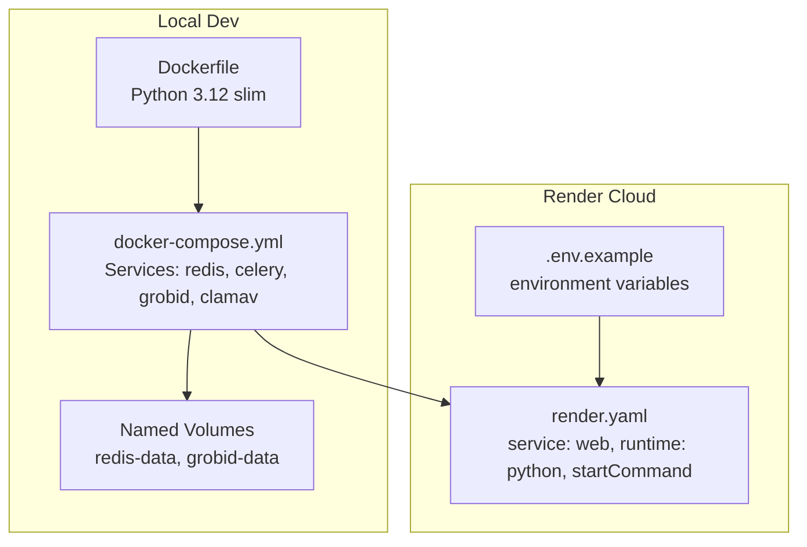
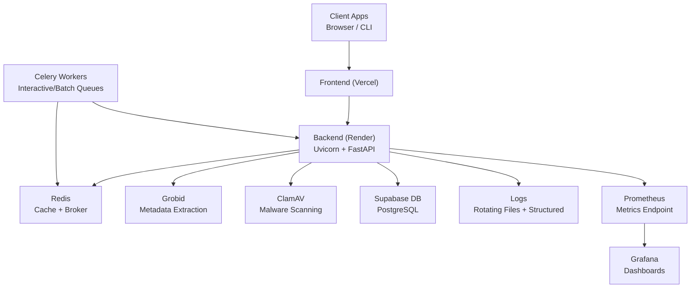
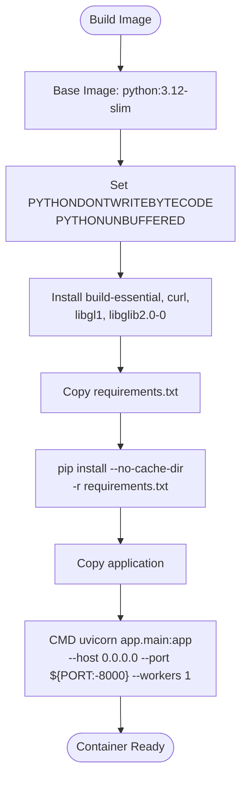
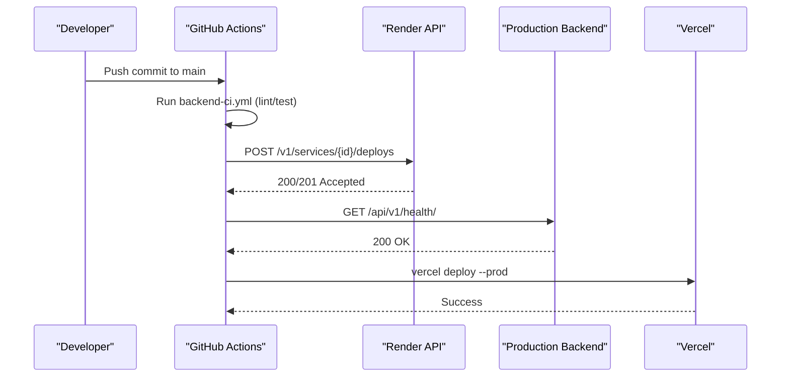
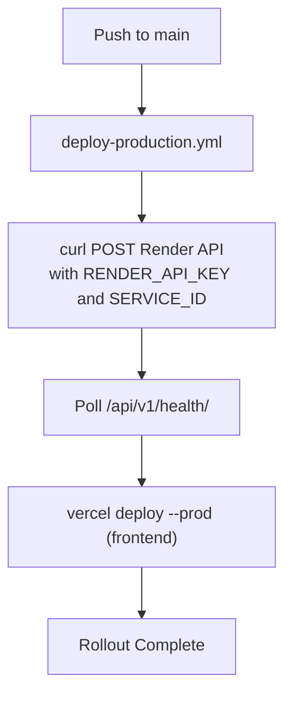
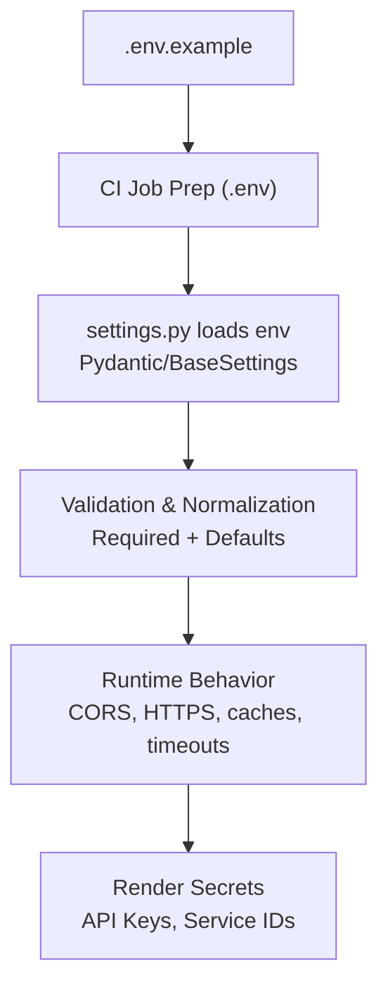
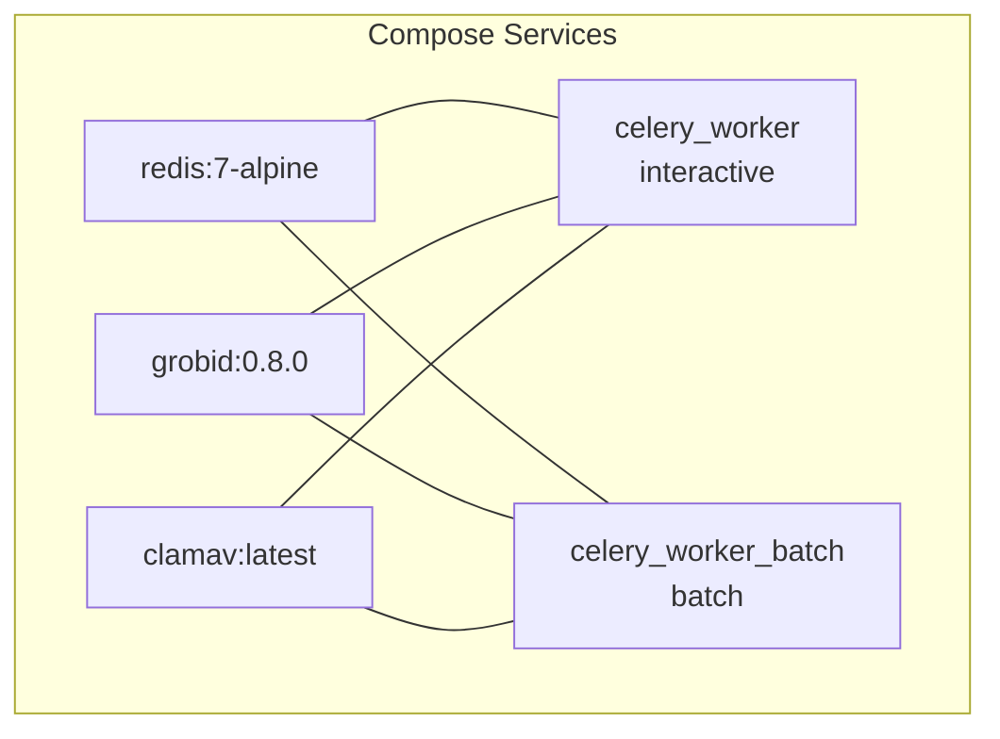
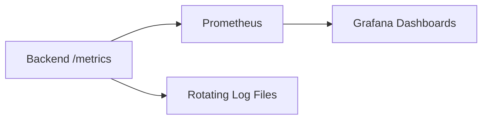
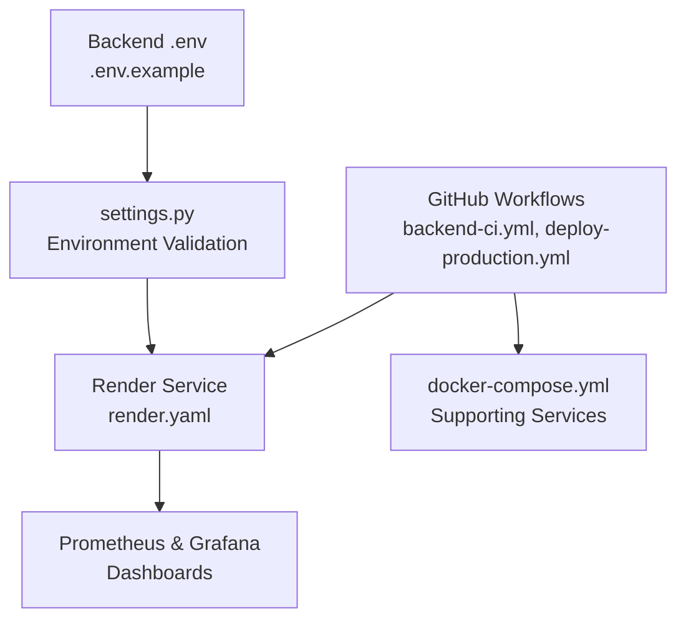

# Deployment & Operations

<cite>
**Referenced Files in This Document**
- [Dockerfile](file://backend/docker/Dockerfile)
- [docker-compose.yml](file://backend/docker/docker-compose.yml)
- [render.yaml](file://render.yaml)
- [backend-ci.yml](file://.github/workflows/backend-ci.yml)
- [deploy-production.yml](file://.github/workflows/deploy-production.yml)
- [.env.example](file://backend/.env.example)
- [settings.py](file://backend/app/config/settings.py)
- [logging_config.py](file://backend/app/config/logging_config.py)
- [prometheus.yml (docker)](file://backend/docker/prometheus/prometheus.yml)
- [prometheus.yml (ops)](file://backend/ops/prometheus/prometheus.yml)
- [pipeline.json](file://backend/docker/grafana/dashboards/pipeline.json)
</cite>

## Table of Contents
1. [Introduction](#introduction)
2. [Project Structure](#project-structure)
3. [Core Components](#core-components)
4. [Architecture Overview](#architecture-overview)
5. [Detailed Component Analysis](#detailed-component-analysis)
6. [Dependency Analysis](#dependency-analysis)
7. [Performance Considerations](#performance-considerations)
8. [Troubleshooting Guide](#troubleshooting-guide)
9. [Conclusion](#conclusion)
10. [Appendices](#appendices)

## Introduction
This document provides comprehensive deployment and operations guidance for the manuscript formatting platform. It covers containerization with Docker, CI/CD pipelines, cloud deployment on Render, environment configuration and secrets management, infrastructure provisioning, monitoring and alerting, logging strategies, performance monitoring, security and compliance considerations, maintenance and disaster recovery, scaling and capacity planning, and operational troubleshooting procedures.

## Project Structure
The deployment and operations stack spans three primary areas:
- Containerization: A minimal Python 3.12 base image builds the backend application and exposes a Uvicorn server.
- Orchestration: A docker-compose stack provisions supporting services (Redis, Celery workers, Grobid, ClamAV) and mounts persistent volumes.
- Cloud Deployment: Render hosts the backend service with environment variables and start command configuration.

**Diagram sources**
- [Dockerfile:1-24](file://backend/docker/Dockerfile#L1-L24)
- [docker-compose.yml:1-100](file://backend/docker/docker-compose.yml#L1-L100)
- [render.yaml:1-15](file://render.yaml#L1-L15)
- [.env.example:1-135](file://backend/.env.example#L1-L135)

**Section sources**
- [Dockerfile:1-24](file://backend/docker/Dockerfile#L1-L24)
- [docker-compose.yml:1-100](file://backend/docker/docker-compose.yml#L1-L100)
- [render.yaml:1-15](file://render.yaml#L1-L15)
- [.env.example:1-135](file://backend/.env.example#L1-L135)

## Core Components
- Container Image
  - Uses a Python 3.12 slim base, sets non-buffered logging and bytecode-writer flags, installs build essentials and system libraries, copies requirements, installs dependencies, and starts Uvicorn with configurable port and single worker.
- Supporting Services
  - Redis for caching and Celery broker/queues.
  - Celery workers for interactive and batch queues with concurrency settings.
  - Grobid for metadata extraction with health checks.
  - ClamAV for malware scanning.
- Environment Configuration
  - Centralized via .env.example with Supabase, external APIs, Redis/Celery, timeouts, and feature toggles.
  - Application settings validated and normalized by settings.py using Pydantic settings or dotenv fallback.
- Monitoring and Observability
  - Prometheus scraping configured for local and ops environments.
  - Grafana dashboards for pipeline metrics.
  - Structured logging with rotating handlers and contextual filters.

**Section sources**
- [Dockerfile:1-24](file://backend/docker/Dockerfile#L1-L24)
- [docker-compose.yml:1-100](file://backend/docker/docker-compose.yml#L1-L100)
- [.env.example:1-135](file://backend/.env.example#L1-L135)
- [settings.py:1-422](file://backend/app/config/settings.py#L1-L422)
- [logging_config.py:1-185](file://backend/app/config/logging_config.py#L1-L185)
- [prometheus.yml (docker):1-17](file://backend/docker/prometheus/prometheus.yml#L1-L17)
- [prometheus.yml (ops):1-11](file://backend/ops/prometheus/prometheus.yml#L1-L11)
- [pipeline.json:1-448](file://backend/docker/grafana/dashboards/pipeline.json#L1-L448)

## Architecture Overview
The deployment architecture integrates local development with orchestrated services and cloud hosting.

**Diagram sources**
- [render.yaml:1-15](file://render.yaml#L1-L15)
- [docker-compose.yml:1-100](file://backend/docker/docker-compose.yml#L1-L100)
- [prometheus.yml (ops):1-11](file://backend/ops/prometheus/prometheus.yml#L1-L11)
- [pipeline.json:1-448](file://backend/docker/grafana/dashboards/pipeline.json#L1-L448)
- [logging_config.py:1-185](file://backend/app/config/logging_config.py#L1-L185)

## Detailed Component Analysis

### Containerization with Docker
- Base Image and Build Steps
  - Python 3.12 slim image, system packages for build and rendering support, dependency installation from requirements, and application copy.
- Runtime Command
  - Uvicorn serves the FastAPI app on host 0.0.0.0 with a configurable PORT and a single worker.
- Local Compose Stack
  - Defines services for Grobid, Redis, ClamAV, and two Celery workers (interactive and batch) with environment propagation from .env and explicit overrides for internal URLs and queue routing.

**Diagram sources**
- [Dockerfile:1-24](file://backend/docker/Dockerfile#L1-L24)

**Section sources**
- [Dockerfile:1-24](file://backend/docker/Dockerfile#L1-L24)
- [docker-compose.yml:42-94](file://backend/docker/docker-compose.yml#L42-L94)

### CI/CD Pipeline Configuration
- Backend CI Workflow
  - Runs on pushes to all branches.
  - Checks out code, sets up Python 3.12, prepares .env from example, installs dependencies and linters, runs Ruff and MyPy, and executes unit tests excluding slow/integration suites.
- Production Deployment Workflow
  - Triggers on pushes to main.
  - Deploys backend to Render via Render API using secrets for API key and service ID, waits for health endpoint, then deploys frontend to Vercel using Vercel CLI and secrets.

**Diagram sources**
- [backend-ci.yml:1-41](file://.github/workflows/backend-ci.yml#L1-L41)
- [deploy-production.yml:1-63](file://.github/workflows/deploy-production.yml#L1-L63)

**Section sources**
- [backend-ci.yml:1-41](file://.github/workflows/backend-ci.yml#L1-L41)
- [deploy-production.yml:1-63](file://.github/workflows/deploy-production.yml#L1-L63)

### Cloud Deployment Strategy (Render)
- Service Definition
  - Web service type, Python runtime, root directory under backend, build command installs requirements-render.txt, start command uses Uvicorn with proxy headers and log level.
- Environment Variables
  - Sets PYTHON_VERSION, FORCE_HTTPS, and REDIS_ENABLED via render.yaml.
- Secrets Management
  - Render secrets are referenced by the production deployment workflow to trigger deploys and to configure backend behavior.

**Diagram sources**
- [deploy-production.yml:1-63](file://.github/workflows/deploy-production.yml#L1-L63)
- [render.yaml:1-15](file://render.yaml#L1-L15)

**Section sources**
- [render.yaml:1-15](file://render.yaml#L1-L15)
- [deploy-production.yml:1-63](file://.github/workflows/deploy-production.yml#L1-L63)

### Environment Configuration and Secrets Management
- Environment Variables
  - Supabase configuration, CORS origins, JWT settings, external API keys, template defaults, confidence thresholds, GROBID/Ollama/ClamAV endpoints, Redis/Celery URLs, cache TTLs, pipeline timeouts, and feature flags are defined in .env.example.
- Settings Loading and Validation
  - settings.py loads variables from .env, supports Pydantic settings with strict validation and normalization, and enforces required values with warnings for optional ones.
- Secrets Handling
  - Render secrets are used for backend deployment triggers and for production environment variables (e.g., API keys). Local development uses .env.example copied to .env during CI.

**Diagram sources**
- [.env.example:1-135](file://backend/.env.example#L1-L135)
- [settings.py:1-422](file://backend/app/config/settings.py#L1-L422)
- [deploy-production.yml:1-63](file://.github/workflows/deploy-production.yml#L1-L63)

**Section sources**
- [.env.example:1-135](file://backend/.env.example#L1-L135)
- [settings.py:1-422](file://backend/app/config/settings.py#L1-L422)
- [deploy-production.yml:1-63](file://.github/workflows/deploy-production.yml#L1-L63)

### Infrastructure Provisioning
- Local Docker Compose
  - Defines services for Grobid, Redis, ClamAV, and Celery workers with health checks, persistent volumes, and inter-service networking.
- Cloud Provisioning
  - Render manages backend hosting; external services (e.g., Supabase) are referenced via environment variables.

**Diagram sources**
- [docker-compose.yml:1-100](file://backend/docker/docker-compose.yml#L1-L100)

**Section sources**
- [docker-compose.yml:1-100](file://backend/docker/docker-compose.yml#L1-L100)

### Monitoring and Alerting Systems
- Metrics Exposure
  - Prometheus scrape configs define jobs for the backend metrics endpoint and Prometheus itself.
- Dashboards
  - Grafana dashboard JSON defines panels for pipeline request rates, active jobs, P95 duration, tool usage distribution, and average step durations.
- Logging
  - Structured logging with console, rotating file handlers, and error-specific rotation; contextual filters enrich logs with request/job/session IDs.

**Diagram sources**
- [prometheus.yml (docker):1-17](file://backend/docker/prometheus/prometheus.yml#L1-L17)
- [prometheus.yml (ops):1-11](file://backend/ops/prometheus/prometheus.yml#L1-L11)
- [pipeline.json:1-448](file://backend/docker/grafana/dashboards/pipeline.json#L1-L448)
- [logging_config.py:1-185](file://backend/app/config/logging_config.py#L1-L185)

**Section sources**
- [prometheus.yml (docker):1-17](file://backend/docker/prometheus/prometheus.yml#L1-L17)
- [prometheus.yml (ops):1-11](file://backend/ops/prometheus/prometheus.yml#L1-L11)
- [pipeline.json:1-448](file://backend/docker/grafana/dashboards/pipeline.json#L1-L448)
- [logging_config.py:1-185](file://backend/app/config/logging_config.py#L1-L185)

### Security Considerations and Access Controls
- CORS Origins
  - Configurable via environment; normalized to prevent unsafe defaults.
- HTTPS Enforcement
  - FORCE_HTTPS flag enables HTTPS redirects and HSTS headers.
- JWT and Supabase Integration
  - Supabase URL, JWKS URL, JWT secret, and service role key are required for secure authentication and authorization.
- Malware Scanning
  - ClamAV integration protects uploads and processing artifacts.
- Secrets Management
  - Render secrets protect API keys and deployment credentials; CI workflows rely on GitHub secrets for Render and Vercel.

**Section sources**
- [.env.example:1-135](file://backend/.env.example#L1-L135)
- [settings.py:1-422](file://backend/app/config/settings.py#L1-L422)
- [docker-compose.yml:33-40](file://backend/docker/docker-compose.yml#L33-L40)

### Maintenance Procedures
- Log Rotation and Cleanup
  - Rotating file handlers with fixed-size limits and backup counts; enable file cleanup via environment toggle.
- Cache TTL Tuning
  - Dedicated TTLs for readiness, health, LLM sessions, messages, and document caches; adjust per workload.
- Retention Policy
  - RETENTION_DAYS governs artifact lifecycle; ensure storage alignment with policy.
- Dependency Updates
  - requirements-render.txt used by Render; keep aligned with backend requirements.

**Section sources**
- [logging_config.py:1-185](file://backend/app/config/logging_config.py#L1-L185)
- [.env.example:1-135](file://backend/.env.example#L1-L135)
- [Dockerfile:1-24](file://backend/docker/Dockerfile#L1-L24)

### Backup Strategies and Disaster Recovery
- Data Backups
  - Persistent volumes for Redis and Grobid are defined in compose; ensure regular snapshots/backups of these volumes.
- Secrets Rotation
  - Rotate Render and GitHub secrets; update environment variables and redeploy.
- Rollback Plan
  - Use Render’s service history and Vercel project settings to roll back to previous deployments.

**Section sources**
- [docker-compose.yml:96-100](file://backend/docker/docker-compose.yml#L96-L100)
- [deploy-production.yml:1-63](file://.github/workflows/deploy-production.yml#L1-L63)

### Scaling Considerations and Capacity Planning
- Horizontal Scaling
  - Increase Celery worker replicas per queue (interactive/batch) and tune concurrency (processes/threads) based on CPU and memory headroom.
- Memory Optimization
  - LOW_MEMORY_MODE and pipeline timeouts help reduce footprint on constrained environments.
- Queue Isolation
  - Separate queues for interactive and batch processing improve responsiveness and throughput.
- External Tool Scaling
  - Scale Grobid and other external services independently if needed.

**Section sources**
- [docker-compose.yml:42-94](file://backend/docker/docker-compose.yml#L42-L94)
- [.env.example:85-105](file://backend/.env.example#L85-L105)

### Operational Troubleshooting Procedures
- Health Checks
  - Backend health endpoint is polled after deployment; confirm readiness before traffic switch.
- Local Debugging
  - Use docker-compose logs for Redis, Celery, Grobid, and ClamAV; inspect rotating log files for errors.
- Metrics and Dashboards
  - Review Grafana dashboards for request rates, latency, active jobs, and tool usage to identify bottlenecks.
- Environment Validation
  - Verify required environment variables and CORS origins; ensure HTTPS enforcement aligns with deployment.

**Section sources**
- [deploy-production.yml:36-52](file://.github/workflows/deploy-production.yml#L36-L52)
- [docker-compose.yml:15-21](file://backend/docker/docker-compose.yml#L15-L21)
- [logging_config.py:1-185](file://backend/app/config/logging_config.py#L1-L185)
- [pipeline.json:1-448](file://backend/docker/grafana/dashboards/pipeline.json#L1-L448)

## Dependency Analysis
The backend depends on external services and environment variables for runtime behavior. The CI/CD pipeline depends on Render and Vercel for deployment.

**Diagram sources**
- [settings.py:1-422](file://backend/app/config/settings.py#L1-L422)
- [.env.example:1-135](file://backend/.env.example#L1-L135)
- [render.yaml:1-15](file://render.yaml#L1-L15)
- [backend-ci.yml:1-41](file://.github/workflows/backend-ci.yml#L1-L41)
- [deploy-production.yml:1-63](file://.github/workflows/deploy-production.yml#L1-L63)
- [docker-compose.yml:1-100](file://backend/docker/docker-compose.yml#L1-L100)
- [prometheus.yml (ops):1-11](file://backend/ops/prometheus/prometheus.yml#L1-L11)

**Section sources**
- [settings.py:1-422](file://backend/app/config/settings.py#L1-L422)
- [.env.example:1-135](file://backend/.env.example#L1-L135)
- [render.yaml:1-15](file://render.yaml#L1-L15)
- [backend-ci.yml:1-41](file://.github/workflows/backend-ci.yml#L1-L41)
- [deploy-production.yml:1-63](file://.github/workflows/deploy-production.yml#L1-L63)
- [docker-compose.yml:1-100](file://backend/docker/docker-compose.yml#L1-L100)

## Performance Considerations
- Worker Concurrency
  - Tune Celery concurrency per queue to match CPU cores and memory budget.
- Timeouts and Caches
  - Adjust pipeline timeouts and cache TTLs to balance responsiveness and resource usage.
- External Tool Tuning
  - Configure GROBID and OCR backends for optimal throughput and accuracy.
- Logging Overhead
  - Structured logging with rotating files is efficient; avoid excessive DEBUG verbosity in production.

[No sources needed since this section provides general guidance]

## Troubleshooting Guide
- Post-Deployment Health
  - Confirm backend health endpoint responds; if not, inspect Render logs and CI deployment output.
- Local Services
  - Check compose logs for Redis, Grobid, and Celery; verify health checks succeed.
- Metrics and Dashboards
  - Inspect Grafana dashboards for anomalies in request rates, latency, and active jobs.
- Environment Issues
  - Validate required environment variables and CORS origins; ensure HTTPS enforcement matches deployment.

**Section sources**
- [deploy-production.yml:36-52](file://.github/workflows/deploy-production.yml#L36-L52)
- [docker-compose.yml:15-21](file://backend/docker/docker-compose.yml#L15-L21)
- [pipeline.json:1-448](file://backend/docker/grafana/dashboards/pipeline.json#L1-L448)
- [logging_config.py:1-185](file://backend/app/config/logging_config.py#L1-L185)

## Conclusion
The platform leverages a clear separation between local orchestration with Docker Compose and cloud hosting on Render, with CI/CD automating backend and frontend deployments. Robust environment configuration, structured logging, and Prometheus/Grafana observability enable effective operations. Security is enforced via CORS, HTTPS, JWT, and secrets management. Scaling and maintenance are facilitated by queue isolation, cache tuning, and persistent volume strategies.

[No sources needed since this section summarizes without analyzing specific files]

## Appendices
- Compliance and Security Notes
  - Ensure secrets rotation, least-privilege access to Render/Vercel, and adherence to CORS/JWT policies.
- Disaster Recovery Checklist
  - Snapshot Redis and Grobid volumes, rotate secrets, and verify rollback to prior deployments.

[No sources needed since this section provides general guidance]