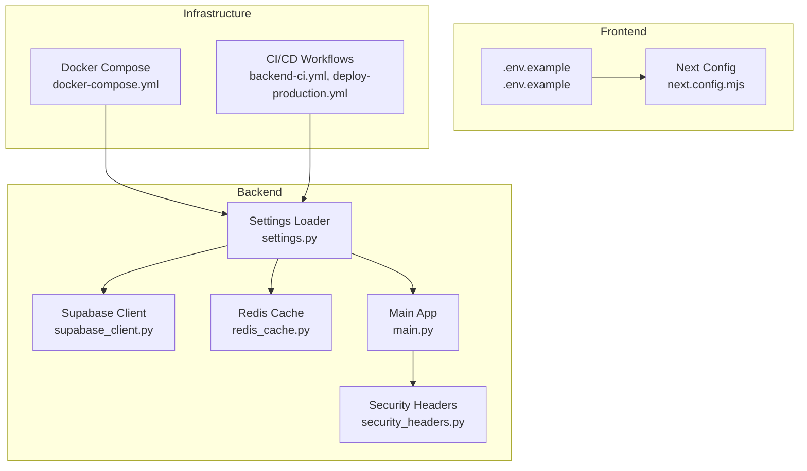
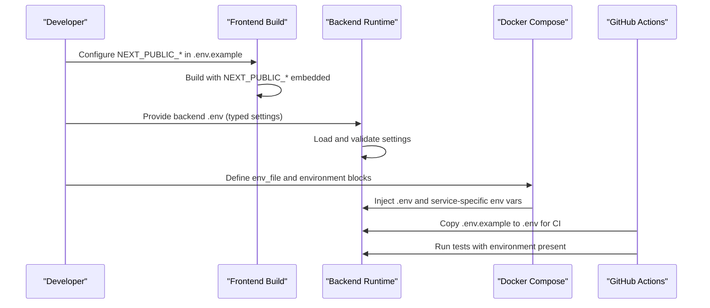
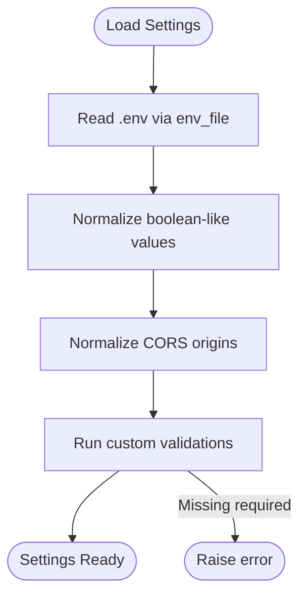
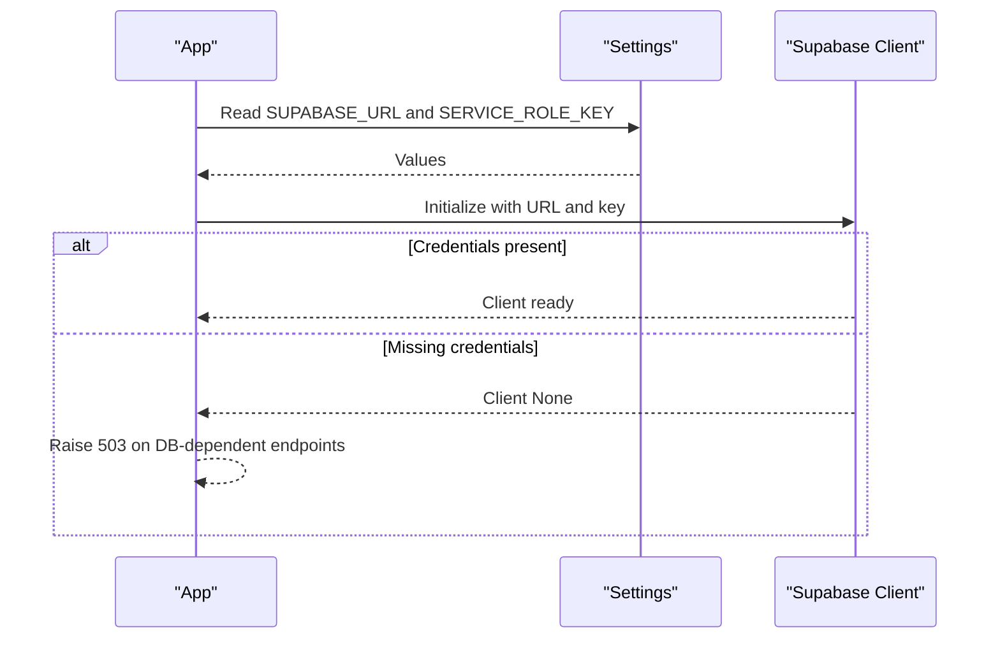
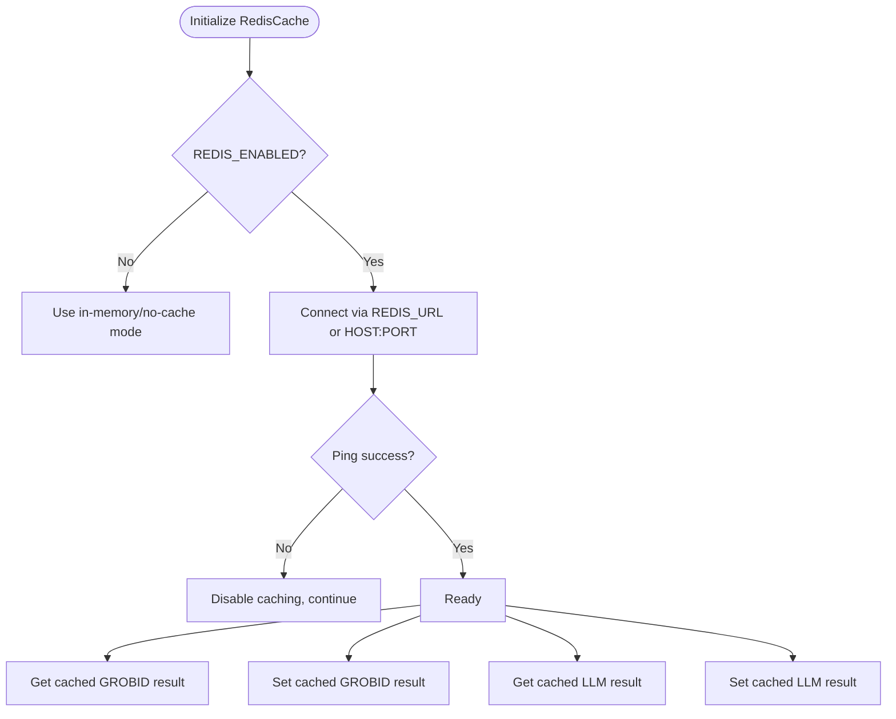
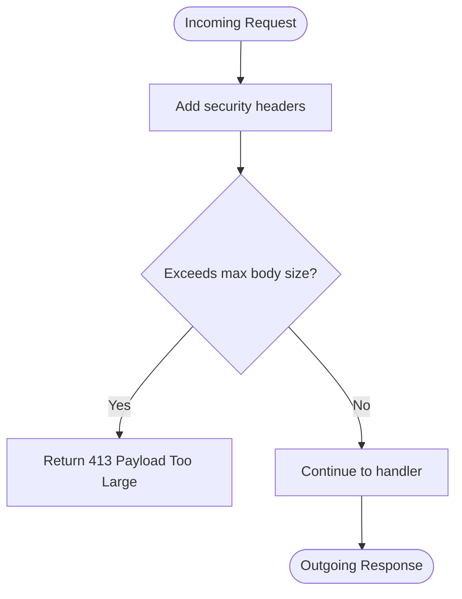
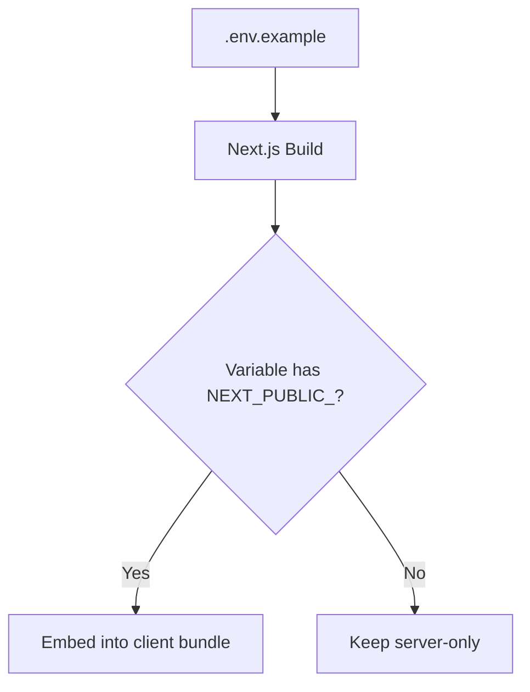
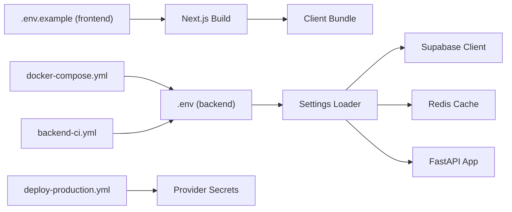

# Environment Configuration

<cite>
**Referenced Files in This Document**
- [settings.py](file://backend/app/config/settings.py)
- [supabase_client.py](file://backend/app/db/supabase_client.py)
- [redis_cache.py](file://backend/app/cache/redis_cache.py)
- [security_headers.py](file://backend/app/middleware/security_headers.py)
- [main.py](file://backend/app/main.py)
- [.env.example (frontend)](file://frontend/.env.example)
- [docker-compose.yml](file://backend/docker/docker-compose.yml)
- [backend-ci.yml](file://.github/workflows/backend-ci.yml)
- [deploy-production.yml](file://.github/workflows/deploy-production.yml)
- [generate_env_template.py](file://scripts/generate_env_template.py)
- [next.config.mjs](file://frontend/next.config.mjs)
</cite>

## Table of Contents
1. [Introduction](#introduction)
2. [Project Structure](#project-structure)
3. [Core Components](#core-components)
4. [Architecture Overview](#architecture-overview)
5. [Detailed Component Analysis](#detailed-component-analysis)
6. [Dependency Analysis](#dependency-analysis)
7. [Performance Considerations](#performance-considerations)
8. [Troubleshooting Guide](#troubleshooting-guide)
9. [Conclusion](#conclusion)
10. [Appendices](#appendices)

## Introduction
This document explains how environment variables and secrets are configured and validated across the backend and frontend of the application. It covers:
- Backend environment variables (Supabase credentials, LLM provider keys, Redis, PDF parsing, security parameters)
- Frontend environment variables with the NEXT_PUBLIC_ prefix and deployment-specific configurations
- Secrets management strategies, environment-specific overrides, and configuration validation
- Security considerations for sensitive data handling and best practices for managing environment variables across development, staging, and production

## Project Structure
The environment configuration spans three primary areas:
- Backend configuration loader and validators
- Frontend configuration and build-time exposure
- Infrastructure orchestration and CI/CD workflows

**Diagram sources**
- [settings.py:72-422](file://backend/app/config/settings.py#L72-L422)
- [supabase_client.py:1-144](file://backend/app/db/supabase_client.py#L1-L144)
- [redis_cache.py:1-102](file://backend/app/cache/redis_cache.py#L1-L102)
- [security_headers.py:1-99](file://backend/app/middleware/security_headers.py#L1-L99)
- [main.py:263-383](file://backend/app/main.py#L263-L383)
- [.env.example (frontend):1-30](file://frontend/.env.example#L1-L30)
- [docker-compose.yml:1-100](file://backend/docker/docker-compose.yml#L1-L100)
- [backend-ci.yml:1-41](file://.github/workflows/backend-ci.yml#L1-L41)
- [deploy-production.yml:1-63](file://.github/workflows/deploy-production.yml#L1-L63)

**Section sources**
- [settings.py:1-422](file://backend/app/config/settings.py#L1-L422)
- [.env.example (frontend):1-30](file://frontend/.env.example#L1-L30)
- [docker-compose.yml:1-100](file://backend/docker/docker-compose.yml#L1-L100)
- [backend-ci.yml:1-41](file://.github/workflows/backend-ci.yml#L1-L41)
- [deploy-production.yml:1-63](file://.github/workflows/deploy-production.yml#L1-L63)

## Core Components
This section enumerates the environment variables and configuration patterns used by the backend and frontend.

### Backend Environment Variables
The backend reads configuration from environment variables via a typed settings loader. Required and commonly used variables include:

- Supabase
  - SUPABASE_URL
  - SUPABASE_ANON_KEY
  - SUPABASE_JWKS_URL
  - SUPABASE_JWT_SECRET
  - SUPABASE_SERVICE_ROLE_KEY
  - SUPABASE_DB_URL

- Security
  - ALGORITHM
  - CORS_ORIGINS
  - SIGNED_URL_SECRET

- Billing
  - STRIPE_API_KEY
  - STRIPE_WEBHOOK_SECRET

- Upload limits and throughput
  - MAX_FILE_SIZE
  - MAX_BATCH_FILES
  - UPLOADS_PER_MINUTE

- Deployment and logging
  - FORCE_HTTPS
  - DEBUG
  - ENABLE_STRUCTURED_LOGGING

- Enhancement layer
  - ENHANCEMENTS_ENABLED
  - ENHANCEMENT_QUEUE_ENABLED
  - ENHANCEMENT_QUEUE_PROVIDER
  - ENHANCEMENT_OCR_ENABLED
  - ENHANCEMENT_OCR_BACKENDS
  - ENHANCEMENT_KEYWORD_ENABLED
  - ENHANCEMENT_KEYWORD_BACKENDS

- Templates and confidence thresholds
  - DEFAULT_TEMPLATE
  - HEADING_STYLE_THRESHOLD
  - HEADING_FALLBACK_CONFIDENCE
  - HEURISTIC_CONFIDENCE_HIGH
  - HEURISTIC_CONFIDENCE_MEDIUM
  - HEURISTIC_CONFIDENCE_LOW

- External tools and processing
  - LIBREOFFICE_PATH
  - ENABLE_FILE_CLEANUP
  - RETENTION_DAYS
  - GENERATED_OUTPUT_DIR
  - GROBID_URL
  - GROBID_BASE_URL
  - GROBID_TIMEOUT
  - GROBID_MAX_RETRIES
  - GROBID_ENABLED
  - USE_DOCLING_FALLBACK
  - PYMUPDF_FALLBACK
  - OLLAMA_URL
  - OLLAMA_BASE_URL
  - CLAMAV_HOST
  - CLAMAV_PORT
  - GROQ_API_KEY
  - GROQ_MODEL
  - GROQ_API_BASE
  - NVIDIA_API_KEY
  - NVIDIA_MODEL
  - OPENAI_API_KEY
  - ANTHROPIC_API_KEY

- Redis and Celery
  - REDIS_ENABLED
  - REDIS_URL
  - REDIS_HOST
  - REDIS_PORT
  - CELERY_BROKER_URL
  - CELERY_RESULT_BACKEND

- Crossref and caches
  - CROSSREF_MAILTO
  - LLM_CACHE_TTL_SECONDS
  - READINESS_CACHE_TTL_SECONDS
  - HEALTH_CACHE_TTL_SECONDS
  - CSL_SEARCH_CACHE_TTL_SECONDS
  - CSL_FETCH_CACHE_TTL_SECONDS
  - GENERATOR_SESSION_CACHE_TTL_SECONDS
  - GENERATOR_MESSAGES_CACHE_TTL_SECONDS
  - GENERATOR_SESSION_LIST_CACHE_TTL_SECONDS
  - GENERATOR_DOCUMENT_CACHE_TTL_SECONDS
  - DOCUMENT_STATUS_CACHE_TTL_SECONDS

- Pipeline tuning and feature toggles
  - PIPELINE_GROBID_TIMEOUT_SECONDS
  - PIPELINE_DOCLING_TIMEOUT_SECONDS
  - PIPELINE_REASONING_TIMEOUT_SECONDS
  - PIPELINE_SEMANTIC_TIMEOUT_SECONDS
  - PIPELINE_ACQUIRE_TIMEOUT_SECONDS
  - PIPELINE_DOCLING_SKIP_DIGITAL_PDF
  - PIPELINE_DOCLING_FORCE
  - ENABLE_NOUGAT_PARSER
  - ENABLE_NVIDIA_REASONER
  - USE_SCIBERT_CLASSIFICATION
  - LOW_MEMORY_MODE
  - PRELOAD_AI_MODELS
  - RAG_USE_TRANSFORMERS
  - DEFAULT_FAST_MODE
  - CROSSREF_MAX_WORKERS

Notes:
- Many variables are required in strict mode and will raise an error if missing.
- Boolean-like values accept flexible truthy/falsy strings and are normalized.
- CORS origins are normalized and include developer-friendly defaults in local mode.
- Some variables have sensible defaults when not provided (e.g., cache TTLs).

**Section sources**
- [settings.py:72-422](file://backend/app/config/settings.py#L72-L422)

### Frontend Environment Variables
The frontend exposes environment variables with the NEXT_PUBLIC_ prefix for client-side consumption. Example variables include:

- Supabase client configuration
  - NEXT_PUBLIC_SUPABASE_URL
  - NEXT_PUBLIC_SUPABASE_ANON_KEY

- Backend API
  - NEXT_PUBLIC_API_URL
  - NEXT_PUBLIC_LATEX_EXPORT_ENABLED

- Analytics
  - NEXT_PUBLIC_POSTHOG_KEY
  - NEXT_PUBLIC_POSTHOG_HOST

- Skills metadata (documentation/tracking)
  - VITE_APP_SKILLS
  - VITE_APP_SKILLS_LINKS
  - VITE_APP_SKILLS_ADD_COMMAND_* (per skill)

- Playwright e2e (optional override)
  - PLAYWRIGHT_BASE_URL

- Automatically discovered variables
  - CI
  - NEXT_PUBLIC_API_BASE_URL

Build-time exposure:
- Variables prefixed with NEXT_PUBLIC_ are embedded into the client bundle at build time.
- Other variables (without NEXT_PUBLIC_) remain server-only.

**Section sources**
- [.env.example (frontend):1-30](file://frontend/.env.example#L1-L30)
- [next.config.mjs:1-27](file://frontend/next.config.mjs#L1-L27)

## Architecture Overview
The environment configuration architecture ensures that:
- Backend loads strongly typed settings from environment variables and validates them at startup
- Frontend exposes only public variables to the client via NEXT_PUBLIC_ prefix
- Infrastructure (Docker Compose) injects environment variables into containers
- CI/CD workflows manage secrets and environment overrides for different stages

**Diagram sources**
- [.env.example (frontend):1-30](file://frontend/.env.example#L1-L30)
- [settings.py:18-197](file://backend/app/config/settings.py#L18-L197)
- [docker-compose.yml:48-94](file://backend/docker/docker-compose.yml#L48-L94)
- [backend-ci.yml:23-24](file://.github/workflows/backend-ci.yml#L23-L24)

**Section sources**
- [settings.py:1-422](file://backend/app/config/settings.py#L1-L422)
- [docker-compose.yml:1-100](file://backend/docker/docker-compose.yml#L1-L100)
- [backend-ci.yml:1-41](file://.github/workflows/backend-ci.yml#L1-L41)

## Detailed Component Analysis

### Backend Settings Loader
The backend defines a Settings class that:
- Reads from a .env file located at the backend root
- Normalizes boolean-like values and CORS origins
- Validates required fields and constraints (e.g., retention days > 0)
- Provides graceful degradation when optional services are unconfigured

Key behaviors:
- Required variables cause a startup error if missing
- Boolean fields accept flexible truthy/falsy strings
- CORS origins are normalized and include developer-friendly defaults
- Validation routines warn on missing optional services and enforce constraints

**Diagram sources**
- [settings.py:18-257](file://backend/app/config/settings.py#L18-L257)

**Section sources**
- [settings.py:1-422](file://backend/app/config/settings.py#L1-L422)

### Supabase Client Initialization
The Supabase client is initialized using the service role key for server-side operations. If credentials are missing, the client remains uninitialized and dependent endpoints return a service-unavailable response instead of crashing.

**Diagram sources**
- [supabase_client.py:49-123](file://backend/app/db/supabase_client.py#L49-L123)
- [settings.py:76-82](file://backend/app/config/settings.py#L76-L82)

**Section sources**
- [supabase_client.py:1-144](file://backend/app/db/supabase_client.py#L1-L144)
- [settings.py:72-82](file://backend/app/config/settings.py#L72-L82)

### Redis Cache Integration
The Redis cache supports:
- Deterministic key generation for content hashing
- TTL-based caching for GROBID and LLM results
- Graceful fallback when Redis is disabled or unreachable

**Diagram sources**
- [redis_cache.py:10-102](file://backend/app/cache/redis_cache.py#L10-L102)
- [settings.py:156-163](file://backend/app/config/settings.py#L156-L163)

**Section sources**
- [redis_cache.py:1-102](file://backend/app/cache/redis_cache.py#L1-L102)
- [settings.py:156-174](file://backend/app/config/settings.py#L156-L174)

### Security Headers Middleware
The application adds essential security headers to all responses, including:
- Content-Security-Policy
- X-Content-Type-Options
- X-Frame-Options
- X-XSS-Protection
- Referrer-Policy
- Permissions-Policy

It also enforces a maximum request body size to mitigate DoS risks.

**Diagram sources**
- [security_headers.py:18-99](file://backend/app/middleware/security_headers.py#L18-L99)

**Section sources**
- [security_headers.py:1-99](file://backend/app/middleware/security_headers.py#L1-L99)

### Frontend Exposure of Environment Variables
Only variables prefixed with NEXT_PUBLIC_ are exposed to the client. The build system embeds these values at compile time. Additional variables (e.g., CI, NEXT_PUBLIC_API_BASE_URL) are recognized as automatically discovered.

**Diagram sources**
- [.env.example (frontend):1-30](file://frontend/.env.example#L1-L30)
- [next.config.mjs:1-27](file://frontend/next.config.mjs#L1-L27)

**Section sources**
- [.env.example (frontend):1-30](file://frontend/.env.example#L1-L30)
- [next.config.mjs:1-27](file://frontend/next.config.mjs#L1-L27)

## Dependency Analysis
Environment variables flow through several layers:

**Diagram sources**
- [.env.example (frontend):1-30](file://frontend/.env.example#L1-L30)
- [settings.py:18-197](file://backend/app/config/settings.py#L18-L197)
- [docker-compose.yml:48-94](file://backend/docker/docker-compose.yml#L48-L94)
- [backend-ci.yml:23-24](file://.github/workflows/backend-ci.yml#L23-L24)
- [deploy-production.yml:16-18](file://.github/workflows/deploy-production.yml#L16-L18)

**Section sources**
- [settings.py:1-422](file://backend/app/config/settings.py#L1-L422)
- [docker-compose.yml:1-100](file://backend/docker/docker-compose.yml#L1-L100)
- [backend-ci.yml:1-41](file://.github/workflows/backend-ci.yml#L1-L41)
- [deploy-production.yml:1-63](file://.github/workflows/deploy-production.yml#L1-L63)

## Performance Considerations
- Redis caching reduces repeated processing costs for GROBID and LLM results when enabled.
- Cache TTLs are configurable to balance freshness and performance.
- Pipeline timeouts and feature toggles allow tuning for throughput and reliability.
- Structured logging can be enabled in production for observability without impacting performance significantly.

[No sources needed since this section provides general guidance]

## Troubleshooting Guide
Common environment configuration issues and resolutions:

- Missing required backend variables
  - Symptom: Startup error indicating a missing environment variable
  - Resolution: Populate the missing variable in .env or CI/CD secrets

- Supabase client initialization failure
  - Symptom: DB-dependent endpoints return service unavailable
  - Resolution: Ensure SUPABASE_URL and SUPABASE_SERVICE_ROLE_KEY are set

- Redis connectivity problems
  - Symptom: Caching disabled with info logs
  - Resolution: Verify REDIS_URL/HOST/PORT and network connectivity

- CORS policy errors
  - Symptom: Browser CORS preflight failures
  - Resolution: Set CORS_ORIGINS to include frontend origins; local dev defaults are included automatically

- Frontend variables not available on client
  - Symptom: process.env.NEXT_PUBLIC_* undefined
  - Resolution: Prefix variables with NEXT_PUBLIC_ and rebuild the frontend

- CI environment not found
  - Symptom: Tests fail due to missing .env
  - Resolution: CI workflow copies .env.example to .env before running tests

**Section sources**
- [settings.py:54-58](file://backend/app/config/settings.py#L54-L58)
- [supabase_client.py:59-64](file://backend/app/db/supabase_client.py#L59-L64)
- [redis_cache.py:36-38](file://backend/app/cache/redis_cache.py#L36-L38)
- [security_headers.py:78-98](file://backend/app/middleware/security_headers.py#L78-L98)
- [backend-ci.yml:23-24](file://.github/workflows/backend-ci.yml#L23-L24)

## Conclusion
The application’s environment configuration is centralized, validated, and designed for secure operation across environments. Backend settings are strongly typed and validated, while frontend variables are explicitly exposed via NEXT_PUBLIC_. Infrastructure and CI/CD handle secrets and environment overrides consistently. Following the outlined practices ensures robust deployments and secure handling of sensitive data.

[No sources needed since this section summarizes without analyzing specific files]

## Appendices

### Secrets Management Strategies
- Store secrets in provider-managed secret stores (e.g., Render, Vercel, GitHub Secrets)
- Never commit secrets to version control
- Use environment-specific overrides in CI/CD for different stages
- Rotate keys regularly and revoke compromised ones promptly

### Environment-Specific Overrides
- Local development: Use .env files checked into the repository for non-sensitive defaults
- CI: Copy .env.example to .env and inject secrets via CI/CD environment variables
- Production: Provide all secrets via environment variables or secret managers

### Configuration Validation Procedures
- Backend validation occurs at startup; required variables must be present
- Boolean-like values are normalized; unexpected values log warnings
- CORS origins are normalized and include developer-friendly defaults in local mode
- Pipeline and cache TTLs are validated and clamped to acceptable ranges

**Section sources**
- [settings.py:248-256](file://backend/app/config/settings.py#L248-L256)
- [settings.py:227-246](file://backend/app/config/settings.py#L227-L246)
- [generate_env_template.py:1-251](file://scripts/generate_env_template.py#L1-L251)