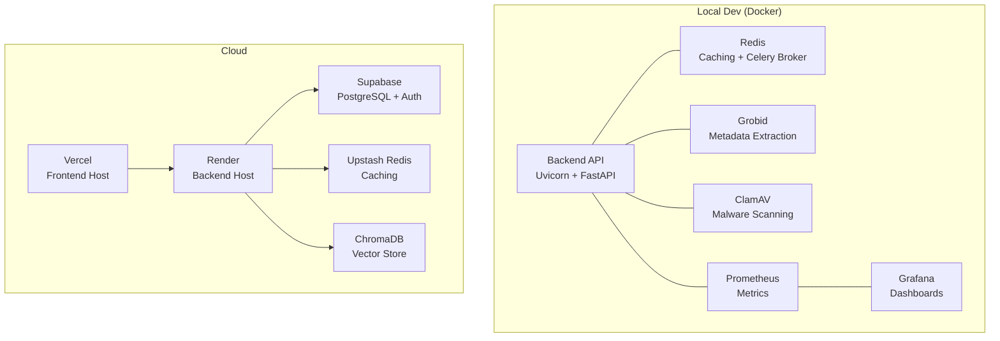
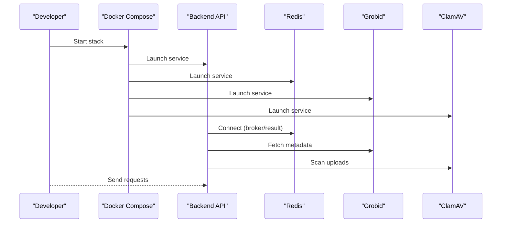
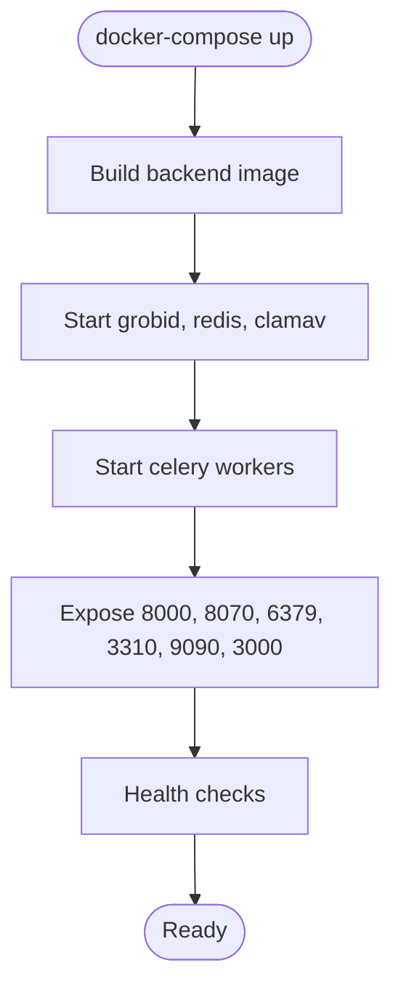
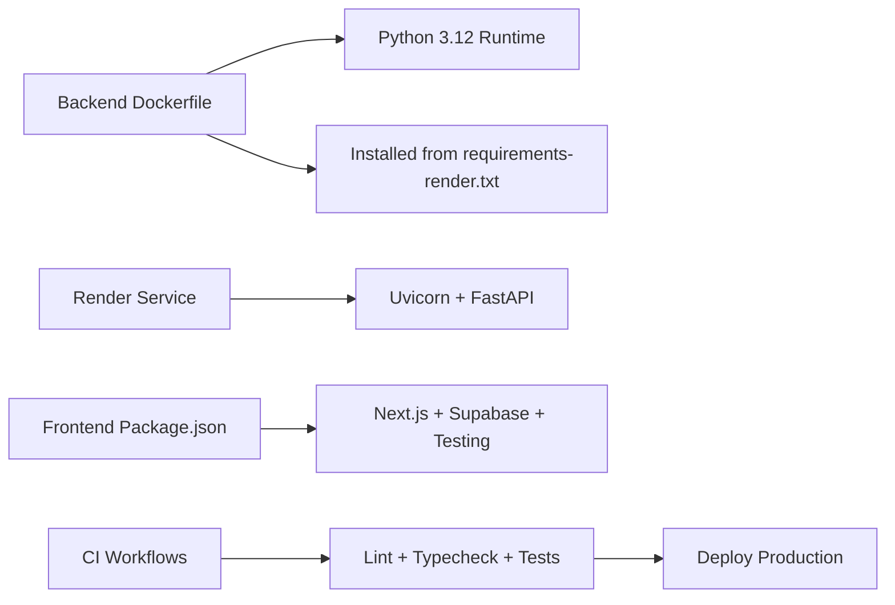

# Infrastructure Setup

<cite>
**Referenced Files in This Document**
- [docker-compose.yml](file://backend/docker/docker-compose.yml)
- [Dockerfile](file://backend/docker/Dockerfile)
- [README.md](file://backend/docker/README.md)
- [render.yaml](file://render.yaml)
- [pyproject.toml](file://backend/pyproject.toml)
- [package.json](file://frontend/package.json)
- [settings.py](file://backend/app/config/settings.py)
- [requirements.md](file://backend/requirements.md)
- [requirements-render.txt](file://backend/requirements-render.txt)
- [prometheus.yml](file://backend/docker/prometheus/prometheus.yml)
- [pipeline.json](file://backend/docker/grafana/dashboards/pipeline.json)
- [backend-ci.yml](file://.github/workflows/backend-ci.yml)
- [deploy-production.yml](file://.github/workflows/deploy-production.yml)
- [.env.example](file://backend/.env.example)
</cite>

## Table of Contents
1. [Introduction](#introduction)
2. [Project Structure](#project-structure)
3. [Core Components](#core-components)
4. [Architecture Overview](#architecture-overview)
5. [Detailed Component Analysis](#detailed-component-analysis)
6. [Dependency Analysis](#dependency-analysis)
7. [Performance Considerations](#performance-considerations)
8. [Troubleshooting Guide](#troubleshooting-guide)
9. [Conclusion](#conclusion)
10. [Appendices](#appendices)

## Introduction
This document provides comprehensive infrastructure setup guidance for the project, covering:
- Containerization with Docker and Docker Compose for local development
- Local environment configuration and service orchestration
- Cloud infrastructure provisioning using Vercel (frontend), Render (backend), Supabase (database/Auth), Upstash (Redis), and ChromaDB (vector store)
- Recommended free-tier stack sizing and alternatives
- Step-by-step setup procedures for development and production
- Dependency management and service orchestration

## Project Structure
The infrastructure spans three primary areas:
- Backend service containerized with Docker and orchestrated via Docker Compose
- Frontend Next.js application configured for Vercel deployment
- Cloud services for database, authentication, storage, vector store, and caching

**Diagram sources**
- [docker-compose.yml:1-100](file://backend/docker/docker-compose.yml#L1-L100)
- [Dockerfile:1-24](file://backend/docker/Dockerfile#L1-L24)
- [README.md:1-52](file://backend/docker/README.md#L1-L52)
- [render.yaml:1-15](file://render.yaml#L1-L15)
- [package.json:1-62](file://frontend/package.json#L1-L62)

**Section sources**
- [docker-compose.yml:1-100](file://backend/docker/docker-compose.yml#L1-L100)
- [Dockerfile:1-24](file://backend/docker/Dockerfile#L1-L24)
- [README.md:1-52](file://backend/docker/README.md#L1-L52)
- [render.yaml:1-15](file://render.yaml#L1-L15)
- [package.json:1-62](file://frontend/package.json#L1-L62)

## Core Components
- Backend API service
  - Built from a Python slim base image, installs dependencies, and runs Uvicorn on port 8000
  - Environment variables sourced from .env and injected via Docker Compose
- Redis
  - Used for caching and as the Celery broker/result backend
- Grobid
  - Metadata extraction service exposed on port 8070
- ClamAV
  - Malware scanning service on port 3310
- Prometheus and Grafana
  - Prometheus scrapes the backend metrics endpoint; Grafana dashboards visualize pipeline metrics
- Frontend
  - Next.js application configured for Vercel deployment
- Cloud services
  - Supabase for PostgreSQL and Auth
  - Upstash for managed Redis
  - ChromaDB for vector embeddings
  - Render hosts the backend

**Section sources**
- [Dockerfile:1-24](file://backend/docker/Dockerfile#L1-L24)
- [docker-compose.yml:1-100](file://backend/docker/docker-compose.yml#L1-L100)
- [prometheus.yml:1-17](file://backend/docker/prometheus/prometheus.yml#L1-L17)
- [pipeline.json:1-448](file://backend/docker/grafana/dashboards/pipeline.json#L1-L448)
- [package.json:1-62](file://frontend/package.json#L1-L62)
- [render.yaml:1-15](file://render.yaml#L1-L15)

## Architecture Overview
The system follows a microservice-like containerized architecture for local development and a cloud-hosted stack for production.

**Diagram sources**
- [docker-compose.yml:1-100](file://backend/docker/docker-compose.yml#L1-L100)
- [Dockerfile:1-24](file://backend/docker/Dockerfile#L1-L24)

## Detailed Component Analysis

### Docker Compose Configuration
- Services
  - grobid: Exposes port 8070; health-checked; persistent volume for tmp
  - redis: Exposes port 6379; persistence; enabled AOF
  - clamav: Exposes port 3310
  - celery_worker (interactive/batch): Builds from backend Dockerfile; connects to redis, grobid, clamav; sets environment variables for database, Redis, OpenAI, Grobid, and ClamAV
- Volumes
  - Named volumes for grobid-data and redis-data
- Ports
  - Backend API: 8000 (mapped in Dockerfile CMD)
  - Grobid: 8070
  - Redis: 6379
  - ClamAV: 3310
  - Prometheus: 9090
  - Grafana: 3000

**Diagram sources**
- [docker-compose.yml:1-100](file://backend/docker/docker-compose.yml#L1-L100)
- [Dockerfile:1-24](file://backend/docker/Dockerfile#L1-L24)

**Section sources**
- [docker-compose.yml:1-100](file://backend/docker/docker-compose.yml#L1-L100)
- [README.md:12-30](file://backend/docker/README.md#L12-L30)

### Backend API Containerization
- Base image: python:3.12-slim
- Dependencies installed from requirements.txt
- Entrypoint runs Uvicorn with host 0.0.0.0 and default port 8000
- Requires PORT environment variable to be set externally (e.g., Docker Compose)

**Section sources**
- [Dockerfile:1-24](file://backend/docker/Dockerfile#L1-L24)
- [pyproject.toml:1-9](file://backend/pyproject.toml#L1-L9)

### Environment Configuration and Settings
- Settings are loaded from .env and validated at runtime
- Key categories include:
  - Supabase Auth and DB URLs
  - Security (algorithm, CORS origins, signed URL secret)
  - Upload limits and rate limits
  - External tool integrations (Grobid, Ollama, ClamAV, LLM providers)
  - Redis/Celery configuration
  - Pipeline tuning and feature flags
- Example .env variables include Supabase credentials, LLM keys, Grobid URLs, Redis settings, and pipeline timeouts

**Section sources**
- [settings.py:1-422](file://backend/app/config/settings.py#L1-L422)
- [.env.example:1-135](file://backend/.env.example#L1-L135)

### Monitoring Stack (Prometheus + Grafana)
- Prometheus configuration targets the backend metrics endpoint
- Grafana dashboard JSON defines panels for pipeline request rates, active jobs, latency quantiles, tool usage distribution, and per-step durations

**Section sources**
- [prometheus.yml:1-17](file://backend/docker/prometheus/prometheus.yml#L1-L17)
- [pipeline.json:1-448](file://backend/docker/grafana/dashboards/pipeline.json#L1-L448)

### Frontend Deployment (Next.js on Vercel)
- Next.js application configured for Vercel deployment
- Scripts include dev, build, start, lint, test, and Playwright e2e testing
- Deployment is automated via GitHub Actions to Vercel after successful backend deployment

**Section sources**
- [package.json:1-62](file://frontend/package.json#L1-L62)
- [deploy-production.yml:53-63](file://.github/workflows/deploy-production.yml#L53-L63)

### Backend Deployment (Render)
- Render service definition specifies Python runtime, build/start commands, and environment variables
- CI/CD triggers a Render deploy on pushes to main and waits for backend health

**Section sources**
- [render.yaml:1-15](file://render.yaml#L1-L15)
- [backend-ci.yml:1-41](file://.github/workflows/backend-ci.yml#L1-L41)
- [deploy-production.yml:1-63](file://.github/workflows/deploy-production.yml#L1-L63)

## Dependency Analysis
- Backend dependencies are declared in requirements-render.txt for production on Render
- Full dependency list is available in requirements.md
- Frontend dependencies include Next.js, Supabase SDKs, React, Tailwind, and testing/playwright tooling

**Diagram sources**
- [Dockerfile:1-24](file://backend/docker/Dockerfile#L1-L24)
- [requirements-render.txt:1-136](file://backend/requirements-render.txt#L1-L136)
- [render.yaml:1-15](file://render.yaml#L1-L15)
- [package.json:1-62](file://frontend/package.json#L1-L62)
- [backend-ci.yml:1-41](file://.github/workflows/backend-ci.yml#L1-L41)

**Section sources**
- [requirements-render.txt:1-136](file://backend/requirements-render.txt#L1-L136)
- [requirements.md:1-377](file://backend/requirements.md#L1-L377)
- [package.json:1-62](file://frontend/package.json#L1-L62)

## Performance Considerations
- Free-tier constraints
  - Render free tier: 512 MB RAM; enable LOW_MEMORY_MODE and avoid heavy ML libraries in production
  - Vercel free tier: sufficient for frontend hosting; ensure API latency remains low
  - Supabase free tier: shared CPU/RAM; optimize queries and use connection pooling
  - Upstash Redis free tier: limited throughput; monitor for throttling
  - ChromaDB free tier: limited concurrency; consider self-hosted or migrate to managed vector DB later
- Recommendations
  - Prefer lightweight LLM clients (requirements-render.txt avoids heavy transformers)
  - Use Redis only when needed; otherwise disable REDIS_ENABLED to reduce overhead
  - Tune pipeline timeouts and worker concurrency based on observed latency
  - Monitor with Prometheus/Grafana dashboards and adjust resource allocation accordingly

[No sources needed since this section provides general guidance]

## Troubleshooting Guide
- Local development
  - Verify ports: 8000 (API), 8070 (Grobid), 6379 (Redis), 3310 (ClamAV), 9090 (Prometheus), 3000 (Grafana)
  - Health checks: Grobid is reachable at http://localhost:8070/api/isalive
  - Reset volumes if needed: docker-compose down -v
  - View logs: docker-compose logs -f backend
- Environment variables
  - Ensure .env is present and populated with required keys (Supabase, LLM, Grobid, Redis)
  - CORS origins must include frontend URLs
- CI/CD
  - Backend CI validates code style, typechecks, and runs unit tests
  - Production deploy triggers Render deploy and then Vercel deploy; verify service IDs and tokens in secrets

**Section sources**
- [README.md:41-52](file://backend/docker/README.md#L41-L52)
- [docker-compose.yml:15-20](file://backend/docker/docker-compose.yml#L15-L20)
- [backend-ci.yml:1-41](file://.github/workflows/backend-ci.yml#L1-L41)
- [deploy-production.yml:1-63](file://.github/workflows/deploy-production.yml#L1-L63)

## Conclusion
This guide outlines a complete infrastructure setup for local development and production deployment. The local stack leverages Docker Compose to orchestrate the backend API, Redis, Grobid, and ClamAV, while the production stack uses Render for backend hosting, Vercel for frontend, Supabase for database and Auth, Upstash for Redis caching, and ChromaDB for vector storage. Adhering to the free-tier constraints and performance recommendations ensures a scalable and maintainable deployment.

[No sources needed since this section summarizes without analyzing specific files]

## Appendices

### Step-by-Step Local Development Setup
1. Prepare environment
   - Copy .env.example to .env and populate required keys
2. Build and start services
   - Navigate to backend/docker and run docker-compose up --build
3. Access services
   - Backend API: http://localhost:8000
   - Grobid: http://localhost:8070
   - Redis: http://localhost:6379
   - ClamAV: http://localhost:3310
   - Prometheus: http://localhost:9090
   - Grafana: http://localhost:3000 (admin/admin)
4. Clean up
   - To remove volumes and reset state: docker-compose down -v

**Section sources**
- [.env.example:1-135](file://backend/.env.example#L1-L135)
- [README.md:12-30](file://backend/docker/README.md#L12-L30)
- [docker-compose.yml:1-100](file://backend/docker/docker-compose.yml#L1-L100)

### Step-by-Step Production Deployment
1. Backend on Render
   - Configure Render service with Python runtime, build/start commands, and env vars
   - Trigger deploy via CI on pushes to main
2. Frontend on Vercel
   - After successful backend deploy, CI deploys frontend to Vercel
3. Cloud services
   - Provision Supabase (PostgreSQL + Auth), Upstash (Redis), and ChromaDB
   - Point backend to Supabase DB URL, Upstash Redis URL, and ChromaDB endpoint
4. Monitoring
   - Configure Prometheus to scrape backend metrics and import Grafana dashboard

**Section sources**
- [render.yaml:1-15](file://render.yaml#L1-L15)
- [deploy-production.yml:1-63](file://.github/workflows/deploy-production.yml#L1-L63)
- [prometheus.yml:1-17](file://backend/docker/prometheus/prometheus.yml#L1-L17)
- [pipeline.json:1-448](file://backend/docker/grafana/dashboards/pipeline.json#L1-L448)

### Infrastructure Requirements and Resource Constraints
- Render free tier
  - 512 MB RAM; enable LOW_MEMORY_MODE and avoid heavy ML libraries
- Vercel free tier
  - Suitable for frontend hosting; ensure API response times remain acceptable
- Supabase free tier
  - Shared CPU/RAM; optimize queries and use connection pooling
- Upstash Redis free tier
  - Limited throughput; monitor for throttling
- ChromaDB free tier
  - Limited concurrency; consider self-hosted or managed migration later

**Section sources**
- [requirements-render.txt:1-136](file://backend/requirements-render.txt#L1-L136)
- [.env.example:99-104](file://backend/.env.example#L99-L104)

### Alternative Hosting Options
- Backend
  - Railway, Fly.io, or Google Cloud Run for alternative Python runtimes
- Frontend
  - Netlify or Cloudflare Pages as alternatives to Vercel
- Database/Auth
  - PlanetScale (MySQL) or Neon (PostgreSQL) as alternatives to Supabase
- Vector store
  - Pinecone, Weaviate, or Qdrant as alternatives to ChromaDB
- Caching
  - AWS ElastiCache or Azure Cache for Redis as alternatives to Upstash

[No sources needed since this section provides general guidance]