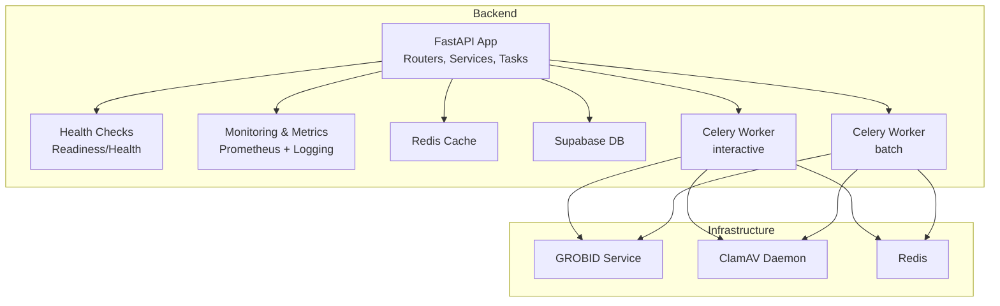
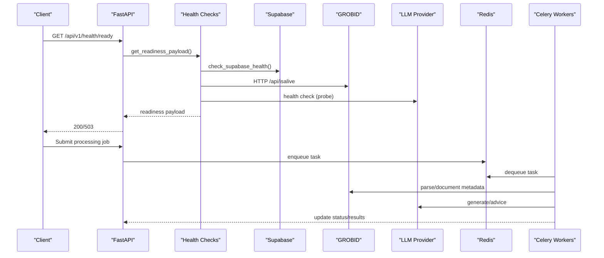
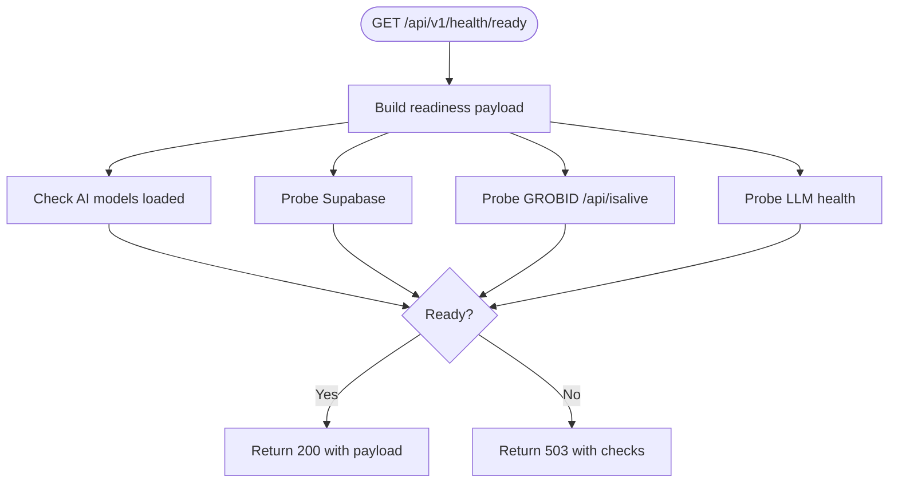
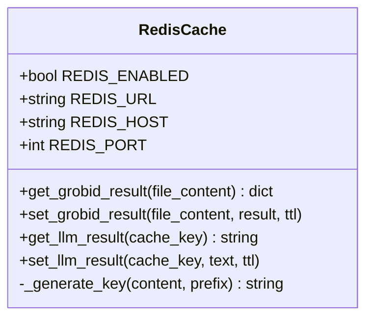
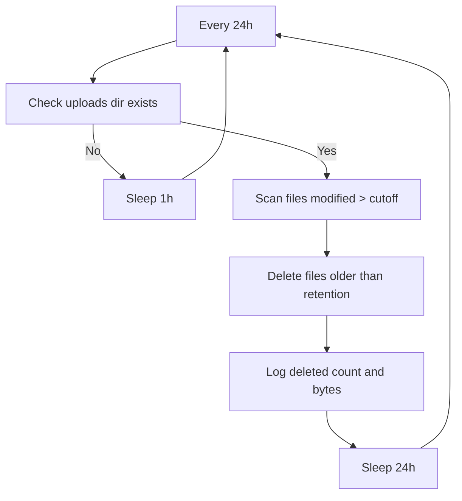
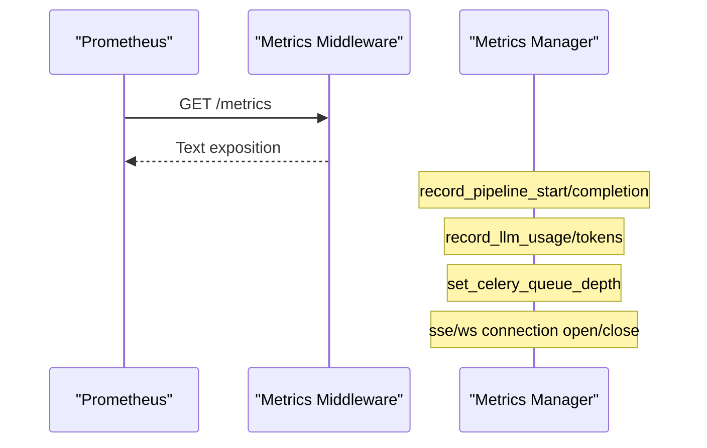
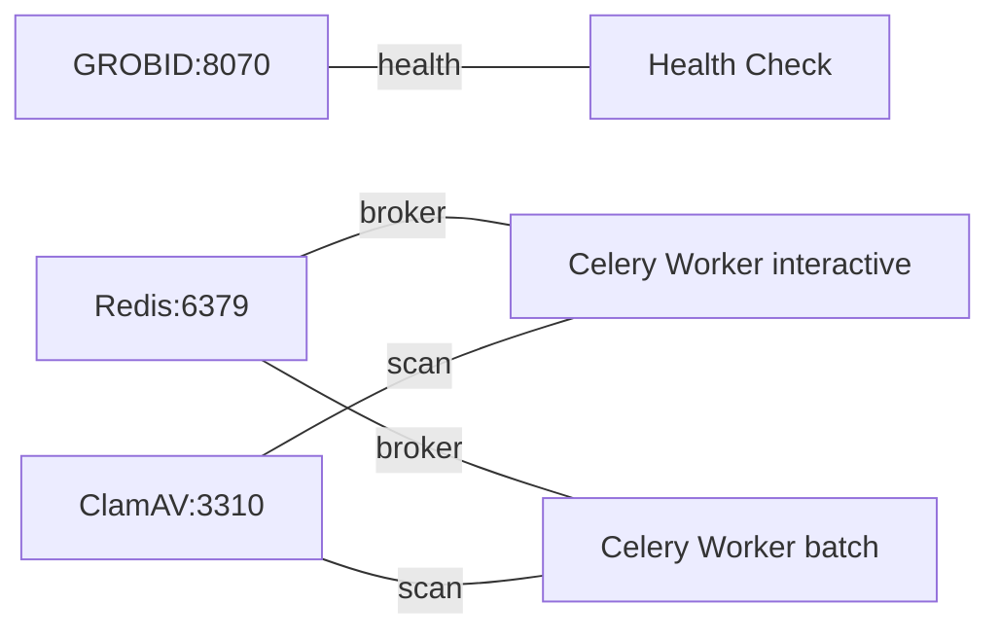
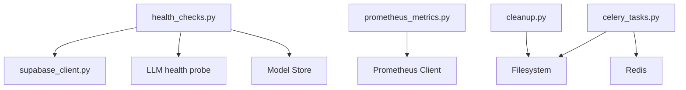

# Maintenance & Troubleshooting

<cite>
**Referenced Files in This Document**
- [incident-response.md](file://docs/runbooks/incident-response.md)
- [rollback.md](file://docs/runbooks/rollback.md)
- [docker-compose.yml](file://backend/docker/docker-compose.yml)
- [settings.py](file://backend/app/config/settings.py)
- [redis_cache.py](file://backend/app/cache/redis_cache.py)
- [health_checks.py](file://backend/app/services/health_checks.py)
- [health.py](file://backend/app/routers/v1/health.py)
- [cleanup.py](file://backend/app/utils/cleanup.py)
- [celery_tasks.py](file://backend/app/tasks/celery_tasks.py)
- [prometheus_metrics.py](file://backend/app/middleware/prometheus_metrics.py)
- [monitoring.py](file://backend/app/middleware/monitoring.py)
- [supabase_client.py](file://backend/app/db/supabase_client.py)
- [troubleshooting.md](file://docs/troubleshooting.md)
- [backend README.md](file://backend/README.md)
</cite>

## Table of Contents
1. [Introduction](#introduction)
2. [Project Structure](#project-structure)
3. [Core Components](#core-components)
4. [Architecture Overview](#architecture-overview)
5. [Detailed Component Analysis](#detailed-component-analysis)
6. [Dependency Analysis](#dependency-analysis)
7. [Performance Considerations](#performance-considerations)
8. [Troubleshooting Guide](#troubleshooting-guide)
9. [Emergency Procedures](#emergency-procedures)
10. [Disaster Recovery](#disaster-recovery)
11. [System Restoration](#system-restoration)
12. [Preventive Maintenance](#preventive-maintenance)
13. [Health Checks](#health-checks)
14. [Operational Best Practices](#operational-best-practices)
15. [Conclusion](#conclusion)

## Introduction
This document provides comprehensive maintenance and troubleshooting guidance for the Automated Academic Manuscript Formatter backend. It covers operational procedures, problem resolution, system maintenance practices, performance tuning, capacity planning, scalability, emergency procedures, disaster recovery, and preventive maintenance. It consolidates operational runbooks, configuration, health monitoring, and cleanup mechanisms present in the repository to help operators maintain reliability and performance.

## Project Structure
The backend is a FastAPI application with integrated monitoring, caching, health checks, and background task processing. Supporting infrastructure includes containers for GROBID, Redis, and ClamAV, orchestrated via Docker Compose. Operational runbooks define alerting and response playbooks for incidents.

**Diagram sources**
- [docker-compose.yml:1-100](file://backend/docker/docker-compose.yml#L1-L100)
- [health.py:1-42](file://backend/app/routers/v1/health.py#L1-L42)
- [health_checks.py:1-261](file://backend/app/services/health_checks.py#L1-L261)
- [prometheus_metrics.py:1-235](file://backend/app/middleware/prometheus_metrics.py#L1-L235)
- [monitoring.py:1-51](file://backend/app/middleware/monitoring.py#L1-L51)
- [redis_cache.py:1-102](file://backend/app/cache/redis_cache.py#L1-L102)
- [supabase_client.py:1-144](file://backend/app/db/supabase_client.py#L1-L144)
- [celery_tasks.py:1-290](file://backend/app/tasks/celery_tasks.py#L1-L290)

**Section sources**
- [docker-compose.yml:1-100](file://backend/docker/docker-compose.yml#L1-L100)
- [backend README.md:1-79](file://backend/README.md#L1-L79)

## Core Components
- Configuration and environment-driven behavior via settings with extensive tunables for timeouts, caches, and feature flags.
- Health and readiness endpoints backed by health checks with caching and component probes.
- Prometheus metrics middleware and a metrics manager for observability.
- Redis cache for Grobid and LLM results with graceful degradation when unavailable.
- Cleanup utilities and Celery batch tasks for file retention and benchmarks.
- Docker Compose stack for GROBID, Redis, and ClamAV.

**Section sources**
- [settings.py:1-422](file://backend/app/config/settings.py#L1-L422)
- [health.py:1-42](file://backend/app/routers/v1/health.py#L1-L42)
- [health_checks.py:1-261](file://backend/app/services/health_checks.py#L1-L261)
- [prometheus_metrics.py:1-235](file://backend/app/middleware/prometheus_metrics.py#L1-L235)
- [monitoring.py:1-51](file://backend/app/middleware/monitoring.py#L1-L51)
- [redis_cache.py:1-102](file://backend/app/cache/redis_cache.py#L1-L102)
- [cleanup.py:1-62](file://backend/app/utils/cleanup.py#L1-L62)
- [celery_tasks.py:1-290](file://backend/app/tasks/celery_tasks.py#L1-L290)
- [docker-compose.yml:1-100](file://backend/docker/docker-compose.yml#L1-L100)

## Architecture Overview
The system integrates FastAPI with external services and background processing:
- FastAPI routes expose health/readiness and document processing endpoints.
- Health checks probe Supabase, GROBID, LLM health, and AI model availability.
- Prometheus metrics capture pipeline durations, retries, LLM usage, and connection counts.
- Redis provides caching and Celery broker; workers consume queues for interactive and batch tasks.
- Cleanup tasks remove old uploads based on retention policy.

**Diagram sources**
- [health.py:1-42](file://backend/app/routers/v1/health.py#L1-L42)
- [health_checks.py:130-192](file://backend/app/services/health_checks.py#L130-L192)
- [supabase_client.py:126-144](file://backend/app/db/supabase_client.py#L126-L144)
- [prometheus_metrics.py:1-235](file://backend/app/middleware/prometheus_metrics.py#L1-L235)
- [celery_tasks.py:1-290](file://backend/app/tasks/celery_tasks.py#L1-L290)

## Detailed Component Analysis

### Health and Readiness
- Readiness endpoint aggregates database, GROBID, LLM, and AI model health with caching and TTL controls.
- Health endpoint reports overall system status and component statuses.
- Readiness considers local dev scenarios where Supabase may be unconfigured.

**Diagram sources**
- [health.py:28-42](file://backend/app/routers/v1/health.py#L28-L42)
- [health_checks.py:130-192](file://backend/app/services/health_checks.py#L130-L192)

**Section sources**
- [health.py:1-42](file://backend/app/routers/v1/health.py#L1-L42)
- [health_checks.py:1-261](file://backend/app/services/health_checks.py#L1-L261)
- [supabase_client.py:126-144](file://backend/app/db/supabase_client.py#L126-L144)

### Redis Cache Management
- Redis cache supports Grobid and LLM result caching with TTL.
- Graceful degradation when Redis is disabled or unreachable.
- Keys are deterministically hashed for content-based caching.

**Diagram sources**
- [redis_cache.py:1-102](file://backend/app/cache/redis_cache.py#L1-L102)

**Section sources**
- [redis_cache.py:1-102](file://backend/app/cache/redis_cache.py#L1-L102)
- [settings.py:156-174](file://backend/app/config/settings.py#L156-L174)

### Cleanup and Retention
- Background cleanup removes uploads older than configured retention days.
- Celery batch task performs the same cleanup for scheduled runs.
- Logs reclaimed disk space and number of deleted files.

**Diagram sources**
- [cleanup.py:12-62](file://backend/app/utils/cleanup.py#L12-L62)
- [celery_tasks.py:203-228](file://backend/app/tasks/celery_tasks.py#L203-L228)

**Section sources**
- [cleanup.py:1-62](file://backend/app/utils/cleanup.py#L1-L62)
- [celery_tasks.py:203-228](file://backend/app/tasks/celery_tasks.py#L203-L228)
- [settings.py:128-131](file://backend/app/config/settings.py#L128-L131)

### Observability and Metrics
- Prometheus metrics middleware exposes a /metrics endpoint.
- Metrics include pipeline durations, step durations, LLM usage, retries, queue depths, and real-time connections.
- Metrics manager records events from anywhere in the app.

**Diagram sources**
- [prometheus_metrics.py:135-235](file://backend/app/middleware/prometheus_metrics.py#L135-L235)

**Section sources**
- [prometheus_metrics.py:1-235](file://backend/app/middleware/prometheus_metrics.py#L1-L235)
- [monitoring.py:1-51](file://backend/app/middleware/monitoring.py#L1-L51)

### Infrastructure Dependencies (Docker Compose)
- GROBID, Redis, and ClamAV are provisioned as containers with health checks and persistent volumes.
- Celery workers depend on Redis and GROBID and are configured with environment variables from .env.

**Diagram sources**
- [docker-compose.yml:1-100](file://backend/docker/docker-compose.yml#L1-L100)

**Section sources**
- [docker-compose.yml:1-100](file://backend/docker/docker-compose.yml#L1-L100)

## Dependency Analysis
- Health checks depend on Supabase client, GROBID, and LLM health probes.
- Readiness considers AI model loading via model store.
- Metrics rely on Prometheus client and are recorded by middleware and services.
- Cleanup relies on filesystem timestamps and settings for retention.

**Diagram sources**
- [health_checks.py:85-127](file://backend/app/services/health_checks.py#L85-L127)
- [supabase_client.py:107-144](file://backend/app/db/supabase_client.py#L107-L144)
- [prometheus_metrics.py:1-235](file://backend/app/middleware/prometheus_metrics.py#L1-L235)
- [cleanup.py:1-62](file://backend/app/utils/cleanup.py#L1-L62)
- [celery_tasks.py:203-228](file://backend/app/tasks/celery_tasks.py#L203-L228)

**Section sources**
- [health_checks.py:1-261](file://backend/app/services/health_checks.py#L1-L261)
- [supabase_client.py:1-144](file://backend/app/db/supabase_client.py#L1-L144)
- [prometheus_metrics.py:1-235](file://backend/app/middleware/prometheus_metrics.py#L1-L235)
- [cleanup.py:1-62](file://backend/app/utils/cleanup.py#L1-L62)
- [celery_tasks.py:1-290](file://backend/app/tasks/celery_tasks.py#L1-L290)

## Performance Considerations
- Tune pipeline timeouts and feature flags via settings to balance accuracy and throughput.
- Adjust LLM cache TTL and pipeline step durations to optimize latency.
- Monitor queue depth and scale Celery workers proportionally to workload.
- Use low-memory mode and preload AI models judiciously based on resource constraints.
- Track active processing jobs and real-time connections to detect saturation.

[No sources needed since this section provides general guidance]

## Troubleshooting Guide
Common issues and resolutions:
- Upload errors: invalid file type or size; convert to supported formats and compress large assets.
- Processing stuck at RUNNING: refresh, check backend logs, and retry.
- Formatting failures: try template “None” first, then retry with target template.
- Preview empty/partial: ensure document reached COMPLETED status and retry.
- Download failures: confirm COMPLETED status, retry downloads, and try DOCX first.
- PDF unavailable: ensure LibreOffice is available on the backend host.
- Authentication and CSRF: log out/in again or clear cookies and retry.

**Section sources**
- [troubleshooting.md:1-149](file://docs/troubleshooting.md#L1-L149)

## Emergency Procedures
- Alert matrix defines thresholds for error rates, latency, queue depth, LLM failures, SSE/WS drops, ClamAV scan failures, and readiness.
- Response playbooks specify immediate actions, escalation, and verification criteria for each alert type.

**Section sources**
- [incident-response.md:1-47](file://docs/runbooks/incident-response.md#L1-L47)

## Disaster Recovery
- Rollback runbook outlines steps for backend (Render), frontend (Vercel), database migrations (Alembic), and feature flags.
- Use readiness endpoint to verify service health post-rollback.

**Section sources**
- [rollback.md:1-24](file://docs/runbooks/rollback.md#L1-L24)

## System Restoration
- Restore database by downgrading Alembic migrations if needed.
- Reconfigure environment variables and restart services.
- Validate health endpoints and metrics to confirm restoration.

**Section sources**
- [rollback.md:15-18](file://docs/runbooks/rollback.md#L15-L18)
- [health.py:28-42](file://backend/app/routers/v1/health.py#L28-L42)

## Preventive Maintenance
- Regularly review and adjust cache TTLs and retention policies.
- Monitor health and metrics dashboards; investigate trends before incidents.
- Rotate API keys and update provider configurations per vendor guidance.
- Validate GROBID and LLM health regularly; keep models updated.

[No sources needed since this section provides general guidance]

## Health Checks
- Readiness and health endpoints provide quick diagnostics.
- Health checks probe database, GROBID, LLM, and AI models with caching and TTL controls.
- Use readiness to gate traffic and health for operational visibility.

**Section sources**
- [health.py:1-42](file://backend/app/routers/v1/health.py#L1-L42)
- [health_checks.py:1-261](file://backend/app/services/health_checks.py#L1-L261)
- [supabase_client.py:126-144](file://backend/app/db/supabase_client.py#L126-L144)

## Operational Best Practices
- Enforce HTTPS and HSTS headers via settings.
- Use structured logging and request IDs for traceability.
- Set appropriate timeouts and retries for external services.
- Monitor active users, SSE/WS connections, and queue depths.
- Keep LibreOffice and other system dependencies updated.

**Section sources**
- [settings.py:98-104](file://backend/app/config/settings.py#L98-L104)
- [monitoring.py:1-51](file://backend/app/middleware/monitoring.py#L1-L51)
- [prometheus_metrics.py:1-235](file://backend/app/middleware/prometheus_metrics.py#L1-L235)
- [backend README.md:75-79](file://backend/README.md#L75-L79)

## Conclusion
This guide consolidates operational procedures, troubleshooting, and maintenance practices for the backend. By leveraging health checks, metrics, cache management, cleanup tasks, and runbooks, operators can maintain system reliability, respond quickly to incidents, and plan for capacity and scalability.