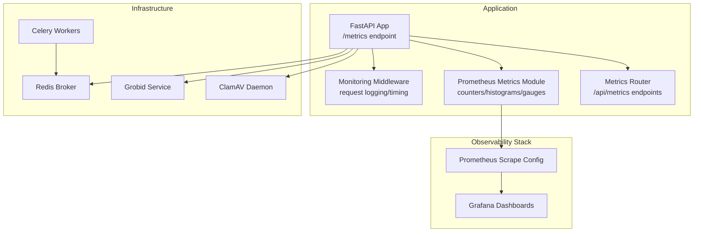
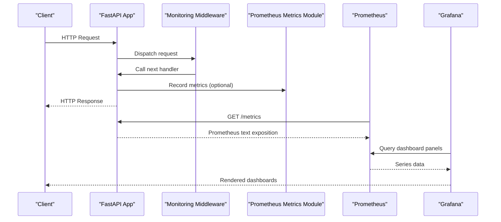
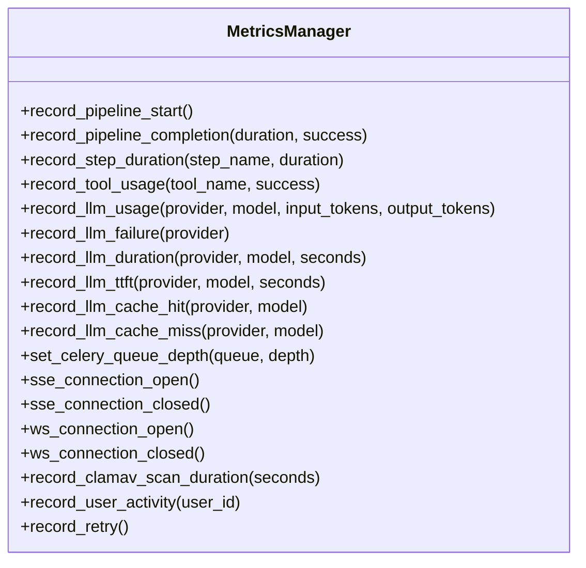
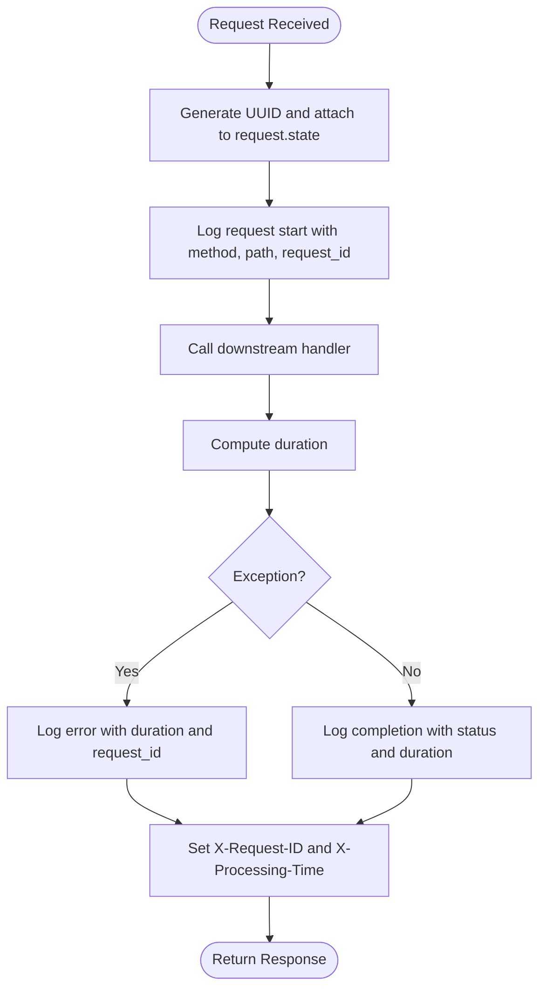
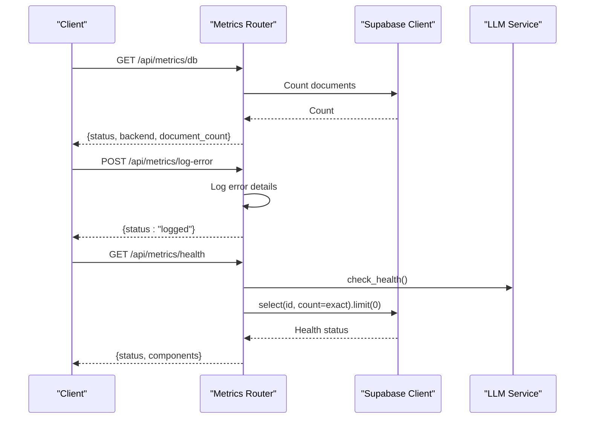
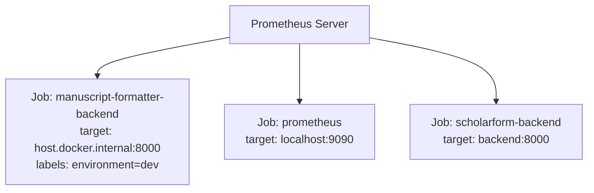
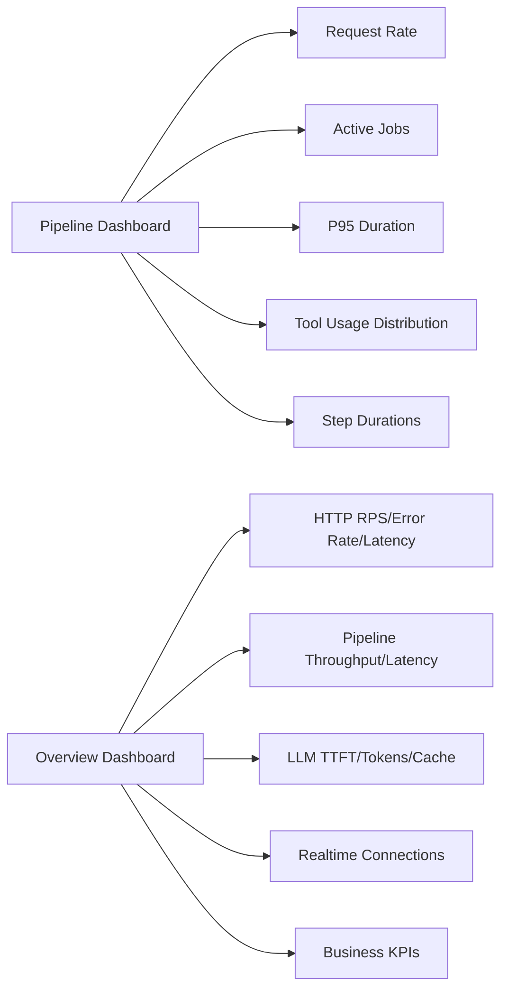
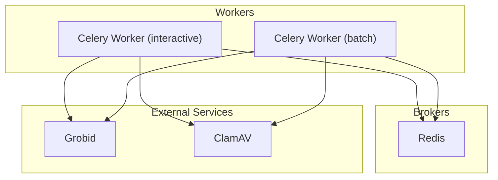
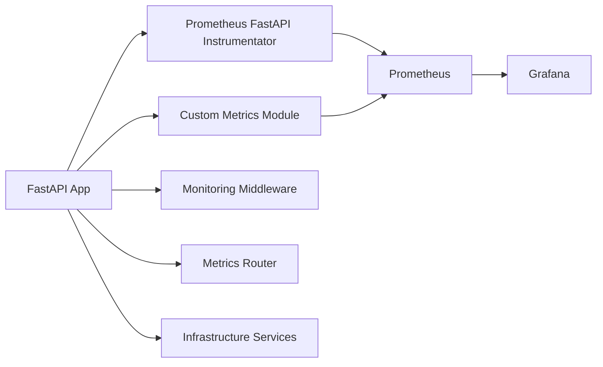

# Monitoring & Alerting

<cite>
**Referenced Files in This Document**
- [backend/app/main.py](file://backend/app/main.py)
- [backend/app/middleware/prometheus_metrics.py](file://backend/app/middleware/prometheus_metrics.py)
- [backend/app/middleware/monitoring.py](file://backend/app/middleware/monitoring.py)
- [backend/app/routers/metrics.py](file://backend/app/routers/metrics.py)
- [backend/docker/prometheus/prometheus.yml](file://backend/docker/prometheus/prometheus.yml)
- [backend/docker/grafana/dashboards/pipeline.json](file://backend/docker/grafana/dashboards/pipeline.json)
- [backend/ops/prometheus/prometheus.yml](file://backend/ops/prometheus/prometheus.yml)
- [backend/ops/grafana/dashboards/scholarform-overview.json](file://backend/ops/grafana/dashboards/scholarform-overview.json)
- [backend/docker/docker-compose.yml](file://backend/docker/docker-compose.yml)
- [backend/app/config/logging_config.py](file://backend/app/config/logging_config.py)
- [backend/requirements.md](file://backend/requirements.md)
</cite>

## Table of Contents
1. [Introduction](#introduction)
2. [Project Structure](#project-structure)
3. [Core Components](#core-components)
4. [Architecture Overview](#architecture-overview)
5. [Detailed Component Analysis](#detailed-component-analysis)
6. [Dependency Analysis](#dependency-analysis)
7. [Performance Considerations](#performance-considerations)
8. [Troubleshooting Guide](#troubleshooting-guide)
9. [Conclusion](#conclusion)
10. [Appendices](#appendices)

## Introduction
This document describes the monitoring and alerting setup for the Manuscript Formatter platform. It covers the Prometheus monitoring stack configuration, Grafana dashboards, application-level metrics, infrastructure monitoring, and operational health checks. It also outlines alerting strategies, thresholds, notification channels, log aggregation, error tracking with Sentry, real-time performance monitoring, capacity planning, and proactive issue detection.

## Project Structure
The monitoring stack spans three layers:
- Application-level metrics and middleware
- Prometheus scraping configuration
- Grafana dashboards for visualization

**Diagram sources**
- [backend/app/main.py:273-274](file://backend/app/main.py#L273-L274)
- [backend/app/middleware/prometheus_metrics.py:135-142](file://backend/app/middleware/prometheus_metrics.py#L135-L142)
- [backend/app/routers/metrics.py:18-22](file://backend/app/routers/metrics.py#L18-L22)
- [backend/docker/prometheus/prometheus.yml:5-16](file://backend/docker/prometheus/prometheus.yml#L5-L16)
- [backend/docker/grafana/dashboards/pipeline.json:101-115](file://backend/docker/grafana/dashboards/pipeline.json#L101-L115)
- [backend/docker/docker-compose.yml:42-94](file://backend/docker/docker-compose.yml#L42-L94)

**Section sources**
- [backend/app/main.py:263-383](file://backend/app/main.py#L263-L383)
- [backend/app/middleware/prometheus_metrics.py:135-235](file://backend/app/middleware/prometheus_metrics.py#L135-L235)
- [backend/app/routers/metrics.py:18-201](file://backend/app/routers/metrics.py#L18-L201)
- [backend/docker/prometheus/prometheus.yml:1-17](file://backend/docker/prometheus/prometheus.yml#L1-L17)
- [backend/docker/grafana/dashboards/pipeline.json:1-448](file://backend/docker/grafana/dashboards/pipeline.json#L1-L448)
- [backend/docker/docker-compose.yml:1-100](file://backend/docker/docker-compose.yml#L1-L100)

## Core Components
- Prometheus metrics exposure and instrumentation:
  - Application exposes a /metrics endpoint via Prometheus FastAPI instrumentation.
  - Custom metrics module defines counters, histograms, and gauges for pipeline, agent, LLM, queue depth, real-time connections, and user activity.
- Monitoring middleware:
  - Adds request IDs, logs request start/completion/failure, and attaches processing time and request ID headers.
- Metrics router:
  - Provides database health, frontend error logging, comprehensive health, and dashboard summary endpoints.
- Prometheus scrape configs:
  - Dev config scrapes the backend at a short interval; ops config targets the backend service.
- Grafana dashboards:
  - Pipeline dashboard tracks request rates, active jobs, step durations, and tool usage.
  - Overview dashboard aggregates HTTP RPS, error rate, latency, pipeline throughput, LLM performance, real-time connections, and business KPIs.
- Infrastructure services:
  - Redis, Celery workers, Grobid, and ClamAV are part of the monitored ecosystem.

**Section sources**
- [backend/app/main.py:273-274](file://backend/app/main.py#L273-L274)
- [backend/app/middleware/prometheus_metrics.py:135-235](file://backend/app/middleware/prometheus_metrics.py#L135-L235)
- [backend/app/middleware/monitoring.py:13-51](file://backend/app/middleware/monitoring.py#L13-L51)
- [backend/app/routers/metrics.py:25-143](file://backend/app/routers/metrics.py#L25-L143)
- [backend/docker/prometheus/prometheus.yml:5-16](file://backend/docker/prometheus/prometheus.yml#L5-L16)
- [backend/ops/prometheus/prometheus.yml:5-10](file://backend/ops/prometheus/prometheus.yml#L5-L10)
- [backend/docker/grafana/dashboards/pipeline.json:101-115](file://backend/docker/grafana/dashboards/pipeline.json#L101-L115)
- [backend/ops/grafana/dashboards/scholarform-overview.json:41-202](file://backend/ops/grafana/dashboards/scholarform-overview.json#L41-L202)
- [backend/docker/docker-compose.yml:22-94](file://backend/docker/docker-compose.yml#L22-L94)

## Architecture Overview
The monitoring architecture integrates application metrics, Prometheus scraping, and Grafana visualization. The backend exposes metrics, Prometheus scrapes them, and Grafana queries Prometheus to render dashboards. Infrastructure services (Redis, Celery, Grobid, ClamAV) are part of the broader environment being observed.

**Diagram sources**
- [backend/app/main.py:273-274](file://backend/app/main.py#L273-L274)
- [backend/app/middleware/monitoring.py:17-50](file://backend/app/middleware/monitoring.py#L17-L50)
- [backend/app/middleware/prometheus_metrics.py:135-142](file://backend/app/middleware/prometheus_metrics.py#L135-L142)
- [backend/docker/grafana/dashboards/pipeline.json:101-115](file://backend/docker/grafana/dashboards/pipeline.json#L101-L115)

## Detailed Component Analysis

### Prometheus Metrics Exposure and Custom Metrics
- The application instruments itself for Prometheus and exposes a /metrics endpoint.
- The custom metrics module defines:
  - Pipeline metrics: total requests, duration histograms, per-step durations.
  - Agent metrics: tool usage, LLM token consumption, retries.
  - LLM metrics: failures, TTFT, cache hits/misses, request duration.
  - Queue depth and real-time metrics: Celery queue depth, SSE/WS connections.
  - Active users gauge based on recent activity window.
- Metrics are recorded centrally via a MetricsManager helper.

**Diagram sources**
- [backend/app/middleware/prometheus_metrics.py:144-235](file://backend/app/middleware/prometheus_metrics.py#L144-L235)

**Section sources**
- [backend/app/main.py:273-274](file://backend/app/main.py#L273-L274)
- [backend/app/middleware/prometheus_metrics.py:135-235](file://backend/app/middleware/prometheus_metrics.py#L135-L235)

### Monitoring Middleware
- Generates a unique request ID per request.
- Logs request start, completion, and failure with duration.
- Attaches X-Request-ID and X-Processing-Time response headers.
- Facilitates correlation across logs and metrics.

**Diagram sources**
- [backend/app/middleware/monitoring.py:17-50](file://backend/app/middleware/monitoring.py#L17-L50)

**Section sources**
- [backend/app/middleware/monitoring.py:13-51](file://backend/app/middleware/monitoring.py#L13-L51)

### Metrics Router and Operational Endpoints
- /api/metrics/db: Database health via Supabase client.
- /api/metrics/log-error: Accepts frontend error reports and increments a counter for visibility.
- /api/metrics/health: Comprehensive health including LLM providers and database connectivity.
- /api/metrics/dashboard: Aggregated AI metrics, A/B testing summaries, and database record counts.
- /api/metrics/enhancements: Capability profile and queue readiness.

**Diagram sources**
- [backend/app/routers/metrics.py:25-143](file://backend/app/routers/metrics.py#L25-L143)

**Section sources**
- [backend/app/routers/metrics.py:25-201](file://backend/app/routers/metrics.py#L25-L201)

### Prometheus Scrape Configuration
- Dev configuration:
  - Scrapes the backend at a short interval with a dev label.
- Ops configuration:
  - Targets the backend service with a metrics path.

**Diagram sources**
- [backend/docker/prometheus/prometheus.yml:5-16](file://backend/docker/prometheus/prometheus.yml#L5-L16)
- [backend/ops/prometheus/prometheus.yml:5-10](file://backend/ops/prometheus/prometheus.yml#L5-L10)

**Section sources**
- [backend/docker/prometheus/prometheus.yml:1-17](file://backend/docker/prometheus/prometheus.yml#L1-L17)
- [backend/ops/prometheus/prometheus.yml:1-11](file://backend/ops/prometheus/prometheus.yml#L1-L11)

### Grafana Dashboards
- Pipeline dashboard:
  - Panels for request rate, active jobs, P95 pipeline duration, tool usage distribution, and average step durations.
- Overview dashboard:
  - Panels for HTTP RPS and error rate, pipeline throughput and latency, LLM TTFT and token usage, cache hit rate, real-time connections, active users, and business KPIs.

**Diagram sources**
- [backend/docker/grafana/dashboards/pipeline.json:101-425](file://backend/docker/grafana/dashboards/pipeline.json#L101-L425)
- [backend/ops/grafana/dashboards/scholarform-overview.json:41-202](file://backend/ops/grafana/dashboards/scholarform-overview.json#L41-L202)

**Section sources**
- [backend/docker/grafana/dashboards/pipeline.json:1-448](file://backend/docker/grafana/dashboards/pipeline.json#L1-448)
- [backend/ops/grafana/dashboards/scholarform-overview.json:1-239](file://backend/ops/grafana/dashboards/scholarform-overview.json#L1-L239)

### Infrastructure Services and Observability
- Redis and Celery workers:
  - Queue depth is periodically fetched and exported as a gauge for both interactive and batch queues.
- Grobid and ClamAV:
  - Part of the processing pipeline; health and performance can be inferred from pipeline and LLM metrics.

**Diagram sources**
- [backend/docker/docker-compose.yml:42-94](file://backend/docker/docker-compose.yml#L42-L94)

**Section sources**
- [backend/app/main.py:117-147](file://backend/app/main.py#L117-L147)
- [backend/docker/docker-compose.yml:1-100](file://backend/docker/docker-compose.yml#L1-L100)

## Dependency Analysis
- Application depends on Prometheus client and FastAPI instrumentation to expose metrics.
- Prometheus depends on scrape configurations to collect metrics.
- Grafana depends on Prometheus datasource and dashboard JSONs.
- Infrastructure services (Redis, Celery, Grobid, ClamAV) influence pipeline and LLM metrics.

**Diagram sources**
- [backend/app/main.py:273-274](file://backend/app/main.py#L273-L274)
- [backend/app/middleware/prometheus_metrics.py:135-142](file://backend/app/middleware/prometheus_metrics.py#L135-L142)
- [backend/docker/grafana/dashboards/pipeline.json:101-115](file://backend/docker/grafana/dashboards/pipeline.json#L101-L115)

**Section sources**
- [backend/app/main.py:263-383](file://backend/app/main.py#L263-L383)
- [backend/app/middleware/prometheus_metrics.py:135-235](file://backend/app/middleware/prometheus_metrics.py#L135-L235)
- [backend/app/routers/metrics.py:18-201](file://backend/app/routers/metrics.py#L18-L201)
- [backend/docker/prometheus/prometheus.yml:1-17](file://backend/docker/prometheus/prometheus.yml#L1-L17)
- [backend/ops/prometheus/prometheus.yml:1-11](file://backend/ops/prometheus/prometheus.yml#L1-L11)

## Performance Considerations
- Metric cardinality:
  - Tool names and step names are exported as labels; keep label sets bounded to avoid high cardinality.
- Histogram buckets:
  - Buckets are tuned for typical latencies; adjust based on observed distributions.
- Scraping cadence:
  - Short intervals reduce staleness; ensure scrape targets can handle the load.
- Real-time metrics:
  - SSE/WS connection gauges reflect live traffic; monitor spikes to prevent overload.
- Queue depth:
  - Monitor queue depth to balance worker concurrency and backpressure.

[No sources needed since this section provides general guidance]

## Troubleshooting Guide
- No metrics in Grafana:
  - Verify Prometheus scrape configuration and target reachability.
  - Confirm the backend’s /metrics endpoint is reachable and Prometheus can scrape it.
- Missing pipeline metrics:
  - Ensure MetricsManager methods are invoked during pipeline lifecycle.
  - Confirm periodic queue depth updates are running.
- High error rate or latency:
  - Use the Overview dashboard to isolate HTTP error rate and latency.
  - Drill into pipeline P95 and step durations.
- Frontend errors:
  - Use the /api/metrics/log-error endpoint to capture and correlate frontend errors.
- Logging context:
  - Monitoring middleware attaches request IDs; use them to correlate logs with metrics.

**Section sources**
- [backend/app/main.py:117-147](file://backend/app/main.py#L117-L147)
- [backend/app/middleware/prometheus_metrics.py:144-235](file://backend/app/middleware/prometheus_metrics.py#L144-L235)
- [backend/app/routers/metrics.py:60-96](file://backend/app/routers/metrics.py#L60-L96)
- [backend/app/middleware/monitoring.py:17-50](file://backend/app/middleware/monitoring.py#L17-L50)

## Conclusion
The platform integrates Prometheus metrics, custom application instrumentation, and Grafana dashboards to provide comprehensive observability. The setup captures application-level performance, infrastructure health, and business KPIs. By leveraging the provided dashboards and endpoints, teams can detect anomalies, optimize performance, and maintain operational health.

[No sources needed since this section summarizes without analyzing specific files]

## Appendices

### Key Metrics Inventory
- Pipeline
  - pipeline_requests_total (counter, status)
  - pipeline_duration_seconds (histogram, status)
  - pipeline_step_duration_seconds (histogram, step)
- Agent
  - agent_tools_usage_total (counter, tool_name, status)
  - agent_llm_tokens_total (counter, provider, model, type)
  - agent_retries_total (counter)
- LLM
  - llm_failures_total (counter, provider)
  - llm_ttft_seconds (histogram, provider, model)
  - llm_cache_hits_total (counter, provider, model)
  - llm_cache_misses_total (counter, provider, model)
  - llm_request_duration_seconds (histogram, provider, model)
- Infrastructure
  - celery_queue_depth (gauge, queue)
  - sse_active_connections (gauge)
  - sse_connections_total (counter)
  - ws_active_connections (gauge)
  - ws_connections_total (counter)
  - clamav_scan_duration_seconds (histogram)
  - active_users (gauge)

**Section sources**
- [backend/app/middleware/prometheus_metrics.py:15-127](file://backend/app/middleware/prometheus_metrics.py#L15-L127)

### Alerting Strategies and Thresholds
- Suggested thresholds (adjust per environment):
  - HTTP error rate > 5% over 5 minutes
  - HTTP p95 latency > 2–5s depending on route
  - Pipeline p95 latency > 30–60s
  - LLM TTFT p95 > 5–10s
  - LLM cache hit rate < 70%
  - Active SSE/WS connections spike > baseline × 2
  - Queue depth > 100 for extended periods
  - Active users drop below baseline × 0.5 for sustained time windows
- Notification channels:
  - Slack, PagerDuty, Email, Webhook
- Alert grouping and routing:
  - Group alerts by component (pipeline, LLM, infrastructure)
  - Route to on-call engineers and team channels

[No sources needed since this section provides general guidance]

### Log Aggregation and Error Tracking
- Logging:
  - Structured logging with console, rotating file handlers, and filtered third-party loggers.
  - Request context filter attaches request_id/job_id/session_id to logs.
- Error tracking:
  - Sentry SDK initialized conditionally via environment variable.
  - Integrations for FastAPI, Starlette, and Python logging.

**Section sources**
- [backend/app/config/logging_config.py:40-157](file://backend/app/config/logging_config.py#L40-L157)
- [backend/app/main.py:40-60](file://backend/app/main.py#L40-L60)

### Real-Time Performance Monitoring
- Real-time metrics:
  - SSE and WebSocket connection gauges and totals.
- Correlation:
  - Use X-Request-ID header and request IDs to correlate logs, metrics, and traces.

**Section sources**
- [backend/app/middleware/prometheus_metrics.py:198-214](file://backend/app/middleware/prometheus_metrics.py#L198-L214)
- [backend/app/middleware/monitoring.py:38-40](file://backend/app/middleware/monitoring.py#L38-L40)

### Capacity Planning and Proactive Detection
- Capacity signals:
  - Queue depth trends, worker concurrency, and pipeline throughput.
- Proactive checks:
  - Health endpoints for LLM providers and database connectivity.
  - Periodic queue depth updates and active user gauges.
- Recommendations:
  - Scale Celery workers based on queue depth and CPU utilization.
  - Tune histogram buckets and scrape intervals based on observed latency distributions.

**Section sources**
- [backend/app/main.py:117-147](file://backend/app/main.py#L117-L147)
- [backend/app/routers/metrics.py:98-143](file://backend/app/routers/metrics.py#L98-L143)