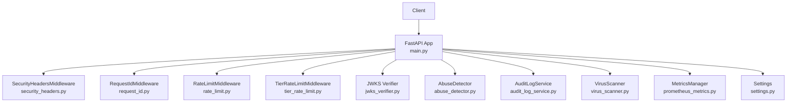
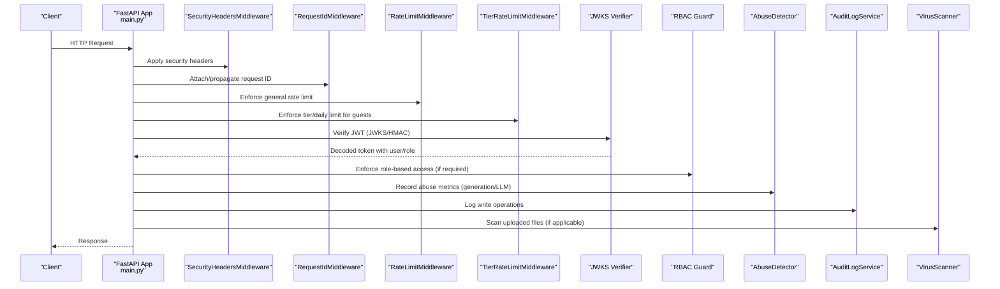
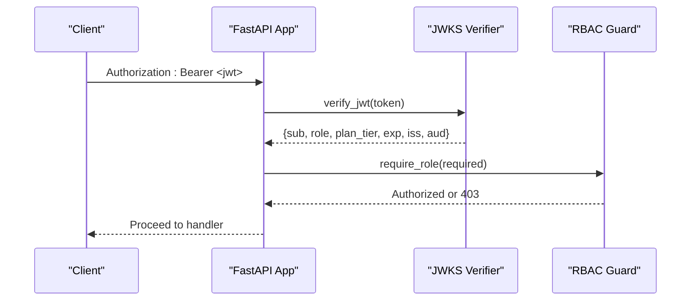
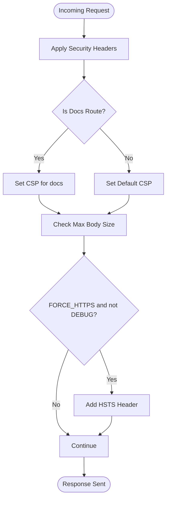
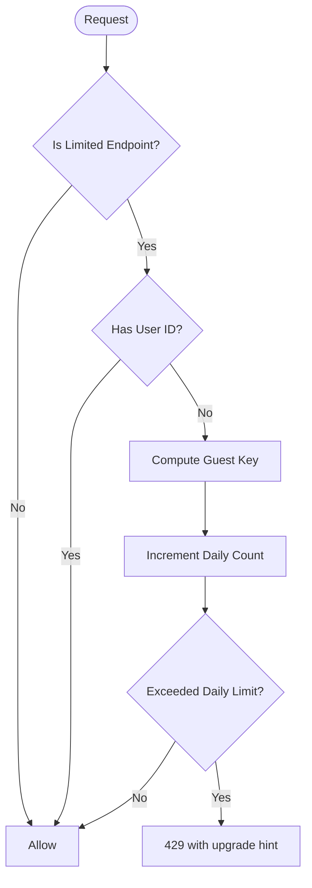
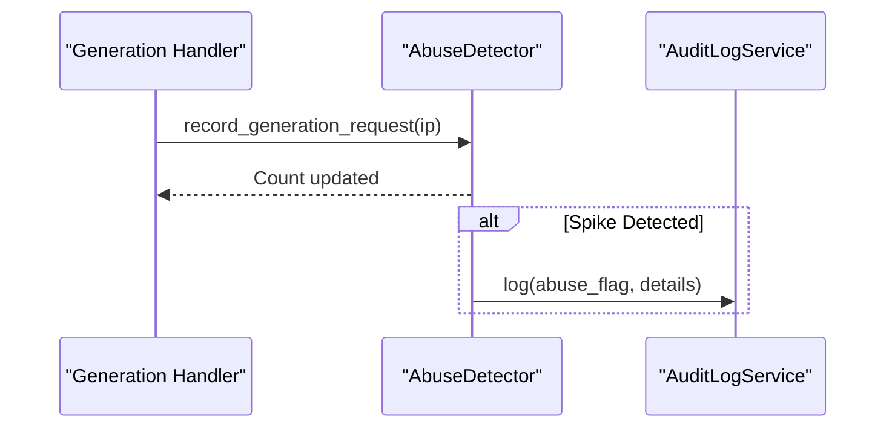
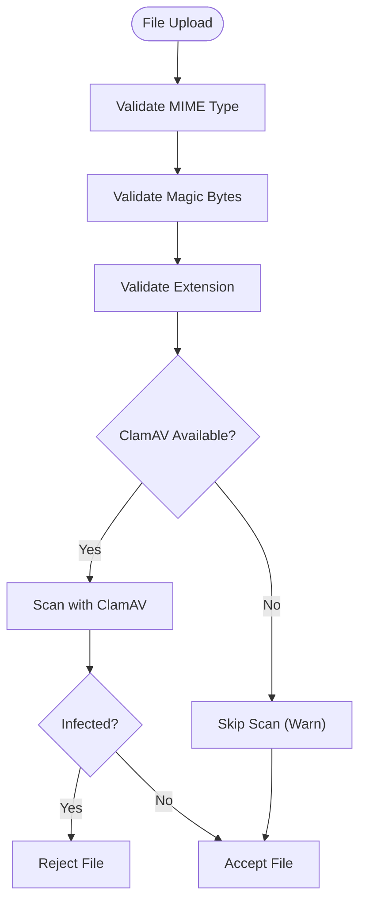
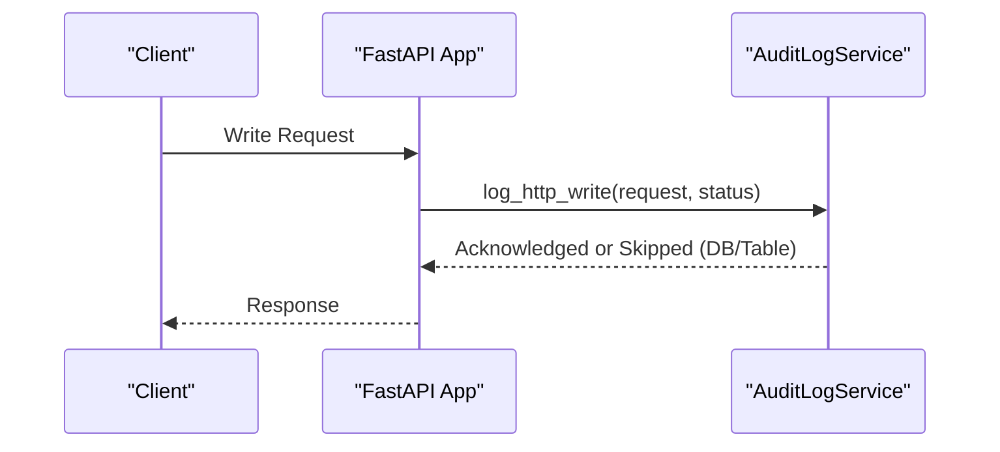
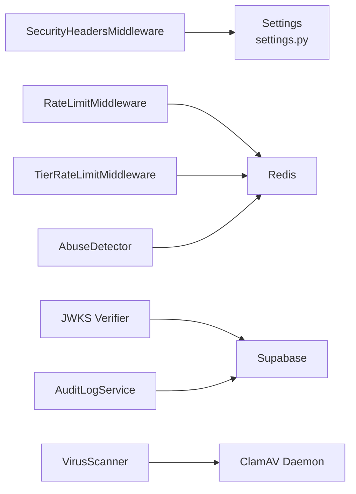

# Security Operations

<cite>
**Referenced Files in This Document**
- [Security.md](file://docs/Security.md)
- [Risk_Register.md](file://docs/Risk_Register.md)
- [main.py](file://backend/app/main.py)
- [security_headers.py](file://backend/app/middleware/security_headers.py)
- [jwks_verifier.py](file://backend/app/security/jwks_verifier.py)
- [rate_limit.py](file://backend/app/middleware/rate_limit.py)
- [tier_rate_limit.py](file://backend/app/middleware/tier_rate_limit.py)
- [abuse_detector.py](file://backend/app/middleware/abuse_detector.py)
- [rbac.py](file://backend/app/middleware/rbac.py)
- [request_id.py](file://backend/app/middleware/request_id.py)
- [audit_log_service.py](file://backend/app/services/audit_log_service.py)
- [virus_scanner.py](file://backend/app/utils/virus_scanner.py)
- [prometheus_metrics.py](file://backend/app/middleware/prometheus_metrics.py)
- [settings.py](file://backend/app/config/settings.py)
- [security.yml](file://.github/workflows/security.yml)
</cite>

## Table of Contents
1. [Introduction](#introduction)
2. [Project Structure](#project-structure)
3. [Core Components](#core-components)
4. [Architecture Overview](#architecture-overview)
5. [Detailed Component Analysis](#detailed-component-analysis)
6. [Dependency Analysis](#dependency-analysis)
7. [Performance Considerations](#performance-considerations)
8. [Troubleshooting Guide](#troubleshooting-guide)
9. [Conclusion](#conclusion)
10. [Appendices](#appendices)

## Introduction
This document provides comprehensive security operations guidance for the backend service. It covers security architecture, threat mitigation, and operational procedures grounded in the implemented middleware and services. It explains authentication and authorization, API security patterns, access control, abuse detection, rate limiting, input validation, vulnerability management, incident response, compliance, monitoring, secure deployment, secrets management, and continuous security assessment.

## Project Structure
Security controls are integrated at the FastAPI application level via middleware and services, with configuration centralized in environment-driven settings. The backend initializes security middleware early in the lifecycle and wires audit logging and metrics for observability.

**Diagram sources**
- [main.py:294-328](file://backend/app/main.py#L294-L328)
- [security_headers.py:18-66](file://backend/app/middleware/security_headers.py#L18-L66)
- [request_id.py:21-59](file://backend/app/middleware/request_id.py#L21-L59)
- [rate_limit.py:49-171](file://backend/app/middleware/rate_limit.py#L49-L171)
- [tier_rate_limit.py:19-115](file://backend/app/middleware/tier_rate_limit.py#L19-L115)
- [jwks_verifier.py:135-183](file://backend/app/security/jwks_verifier.py#L135-L183)
- [abuse_detector.py:14-69](file://backend/app/middleware/abuse_detector.py#L14-L69)
- [audit_log_service.py:17-140](file://backend/app/services/audit_log_service.py#L17-L140)
- [virus_scanner.py:65-121](file://backend/app/utils/virus_scanner.py#L65-L121)
- [prometheus_metrics.py:144-235](file://backend/app/middleware/prometheus_metrics.py#L144-L235)
- [settings.py:72-422](file://backend/app/config/settings.py#L72-L422)

**Section sources**
- [main.py:294-328](file://backend/app/main.py#L294-L328)
- [settings.py:72-422](file://backend/app/config/settings.py#L72-L422)

## Core Components
- Authentication and Authorization
  - JWT verification using Supabase JWKS and/or HMAC secret, extracting user identity and roles.
  - Role-based access control guard with role normalization and hierarchy.
- API Security
  - Security headers (CSP, HSTS, X-Frame-Options, etc.) and body size enforcement.
  - HTTPS enforcement and HSTS header injection in production.
- Access Control
  - Tier-aware daily limits for guests on specific endpoints.
  - General rate limiting with in-memory and Redis-backed sliding windows.
- Abuse Detection
  - Generation spikes and LLM usage tracking with audit logging.
- Input Validation and Sanitization
  - File upload tri-validation (MIME, magic bytes, extension) and virus scanning via ClamAV.
- Observability and Auditing
  - Request ID correlation, HTTP write operation audit logging, Prometheus metrics, and ClamAV scan timing.
- Vulnerability Management and CI
  - Automated container and dependency scanning in GitHub Actions.

**Section sources**
- [jwks_verifier.py:135-183](file://backend/app/security/jwks_verifier.py#L135-L183)
- [rbac.py:61-80](file://backend/app/middleware/rbac.py#L61-L80)
- [security_headers.py:18-66](file://backend/app/middleware/security_headers.py#L18-L66)
- [tier_rate_limit.py:19-115](file://backend/app/middleware/tier_rate_limit.py#L19-L115)
- [rate_limit.py:49-171](file://backend/app/middleware/rate_limit.py#L49-L171)
- [abuse_detector.py:14-69](file://backend/app/middleware/abuse_detector.py#L14-L69)
- [audit_log_service.py:17-140](file://backend/app/services/audit_log_service.py#L17-L140)
- [virus_scanner.py:65-121](file://backend/app/utils/virus_scanner.py#L65-L121)
- [prometheus_metrics.py:118-122](file://backend/app/middleware/prometheus_metrics.py#L118-L122)
- [security.yml:24-46](file://.github/workflows/security.yml#L24-L46)

## Architecture Overview
The backend enforces security through layered middleware and services. Requests traverse security headers, rate limiting, tier checks, JWT verification, and optional RBAC before reaching routes. Abuse detection and audit logging capture anomalous behavior and write operations. Metrics expose system health and performance.

**Diagram sources**
- [main.py:294-328](file://backend/app/main.py#L294-L328)
- [security_headers.py:18-66](file://backend/app/middleware/security_headers.py#L18-L66)
- [request_id.py:21-59](file://backend/app/middleware/request_id.py#L21-L59)
- [rate_limit.py:49-171](file://backend/app/middleware/rate_limit.py#L49-L171)
- [tier_rate_limit.py:19-115](file://backend/app/middleware/tier_rate_limit.py#L19-L115)
- [jwks_verifier.py:135-183](file://backend/app/security/jwks_verifier.py#L135-L183)
- [rbac.py:61-80](file://backend/app/middleware/rbac.py#L61-L80)
- [abuse_detector.py:14-69](file://backend/app/middleware/abuse_detector.py#L14-L69)
- [audit_log_service.py:104-137](file://backend/app/services/audit_log_service.py#L104-L137)
- [virus_scanner.py:65-121](file://backend/app/utils/virus_scanner.py#L65-L121)

## Detailed Component Analysis

### Authentication and Authorization
- JWT verification supports both symmetric and asymmetric algorithms, fetching keys from Supabase JWKS with caching and retry logic.
- Role resolution normalizes aliases and determines effective role for access decisions.
- HTTPS enforcement and HSTS header injection protect transport.

**Diagram sources**
- [jwks_verifier.py:135-183](file://backend/app/security/jwks_verifier.py#L135-L183)
- [rbac.py:61-80](file://backend/app/middleware/rbac.py#L61-L80)
- [main.py:303-313](file://backend/app/main.py#L303-L313)

**Section sources**
- [jwks_verifier.py:26-183](file://backend/app/security/jwks_verifier.py#L26-L183)
- [rbac.py:9-80](file://backend/app/middleware/rbac.py#L9-L80)
- [main.py:303-313](file://backend/app/main.py#L303-L313)

### API Security Patterns
- Security headers middleware sets CSP, HSTS, X-Frame-Options, X-Content-Type-Options, and Permissions-Policy.
- Body size enforcement prevents oversized payloads.
- HTTPS redirect and HSTS header injection in production.

**Diagram sources**
- [security_headers.py:18-66](file://backend/app/middleware/security_headers.py#L18-L66)
- [main.py:303-313](file://backend/app/main.py#L303-L313)

**Section sources**
- [security_headers.py:18-99](file://backend/app/middleware/security_headers.py#L18-L99)
- [main.py:303-313](file://backend/app/main.py#L303-L313)

### Access Control Implementations
- Tier-aware daily limit for guests on upload and generation endpoints.
- General rate limiting with in-memory and Redis-backed sliding windows.

**Diagram sources**
- [tier_rate_limit.py:46-115](file://backend/app/middleware/tier_rate_limit.py#L46-L115)

**Section sources**
- [tier_rate_limit.py:19-115](file://backend/app/middleware/tier_rate_limit.py#L19-L115)
- [rate_limit.py:49-171](file://backend/app/middleware/rate_limit.py#L49-L171)

### Abuse Detection and Monitoring
- AbuseDetector tracks generation spikes and LLM usage over sliding windows and logs administrative flags to audit logs.
- Prometheus metrics capture ClamAV scan durations and other system metrics.

**Diagram sources**
- [abuse_detector.py:41-66](file://backend/app/middleware/abuse_detector.py#L41-L66)
- [audit_log_service.py:55-103](file://backend/app/services/audit_log_service.py#L55-L103)

**Section sources**
- [abuse_detector.py:14-69](file://backend/app/middleware/abuse_detector.py#L14-L69)
- [prometheus_metrics.py:118-122](file://backend/app/middleware/prometheus_metrics.py#L118-L122)
- [audit_log_service.py:104-137](file://backend/app/services/audit_log_service.py#L104-L137)

### Input Validation and Sanitization
- File tri-validation (MIME, magic bytes, extension) is enforced in the document router.
- ClamAV scanning is integrated as a daemon client with graceful fallback when unavailable.

**Diagram sources**
- [virus_scanner.py:65-121](file://backend/app/utils/virus_scanner.py#L65-L121)

**Section sources**
- [virus_scanner.py:14-121](file://backend/app/utils/virus_scanner.py#L14-L121)

### Audit Logging and Request Correlation
- Request ID propagation enables end-to-end tracing across services.
- HTTP write operations are audited with user, resource, IP, and request metadata.

**Diagram sources**
- [audit_log_service.py:104-137](file://backend/app/services/audit_log_service.py#L104-L137)
- [main.py:318-328](file://backend/app/main.py#L318-L328)

**Section sources**
- [audit_log_service.py:17-140](file://backend/app/services/audit_log_service.py#L17-L140)
- [request_id.py:21-74](file://backend/app/middleware/request_id.py#L21-L74)
- [main.py:318-328](file://backend/app/main.py#L318-L328)

### Vulnerability Management and CI
- Container and dependency scanning are automated in GitHub Actions using Trivy, Bandit, and OWASP Dependency Check.

**Section sources**
- [security.yml:24-46](file://.github/workflows/security.yml#L24-L46)

## Dependency Analysis
Security components depend on configuration, Redis for distributed counters, and external services (Supabase, ClamAV). The application wires middleware in a specific order to ensure early protections and consistent auditing.

**Diagram sources**
- [settings.py:72-422](file://backend/app/config/settings.py#L72-L422)
- [rate_limit.py:30-34](file://backend/app/middleware/rate_limit.py#L30-L34)
- [tier_rate_limit.py:30-32](file://backend/app/middleware/tier_rate_limit.py#L30-L32)
- [jwks_verifier.py:26-36](file://backend/app/security/jwks_verifier.py#L26-L36)
- [abuse_detector.py:16-18](file://backend/app/middleware/abuse_detector.py#L16-L18)
- [audit_log_service.py:67-86](file://backend/app/services/audit_log_service.py#L67-L86)
- [virus_scanner.py:80-81](file://backend/app/utils/virus_scanner.py#L80-L81)

**Section sources**
- [settings.py:72-422](file://backend/app/config/settings.py#L72-L422)
- [main.py:294-328](file://backend/app/main.py#L294-L328)

## Performance Considerations
- Rate limiting uses in-memory windows for single-worker deployments and Redis for multi-worker accuracy; Redis unavailability falls back gracefully.
- ClamAV scanning records duration metrics to monitor overhead.
- Body size enforcement prevents resource exhaustion from large payloads.

**Section sources**
- [rate_limit.py:37-118](file://backend/app/middleware/rate_limit.py#L37-L118)
- [prometheus_metrics.py:118-122](file://backend/app/middleware/prometheus_metrics.py#L118-L122)
- [security_headers.py:78-99](file://backend/app/middleware/security_headers.py#L78-L99)

## Troubleshooting Guide
- JWT verification failures
  - Ensure Supabase URL and JWKS URL are configured; verify algorithm and issuer claims.
  - Check for expired/expired or invalid audience/issuer errors.
- RBAC not enforcing
  - The RBAC guard exists but may require endpoint-specific guards; verify route dependencies and role resolution.
- Audit logging not appearing
  - Audit table may be missing; confirm Supabase table exists and logging is not suppressed after initial failure.
- Rate limiting anomalies
  - Confirm Redis connectivity; fallback to in-memory counters is logged when Redis is unavailable.
- Abusive behavior not flagged
  - Verify AbuseDetector Redis availability and that abuse thresholds are exceeded.
- File processing blocked
  - ClamAV daemon may be unreachable; scanning falls back and logs warnings.

**Section sources**
- [jwks_verifier.py:135-183](file://backend/app/security/jwks_verifier.py#L135-L183)
- [rbac.py:61-80](file://backend/app/middleware/rbac.py#L61-L80)
- [audit_log_service.py:64-103](file://backend/app/services/audit_log_service.py#L64-L103)
- [rate_limit.py:94-118](file://backend/app/middleware/rate_limit.py#L94-L118)
- [abuse_detector.py:20-33](file://backend/app/middleware/abuse_detector.py#L20-L33)
- [virus_scanner.py:83-113](file://backend/app/utils/virus_scanner.py#L83-L113)

## Conclusion
The backend implements a robust set of security controls including JWT verification, layered rate limiting, tier-aware quotas, abuse detection, audit logging, and input validation. While most controls are present, critical gaps remain around comprehensive RBAC enforcement and full audit logging coverage. Operational readiness requires expanding RBAC, validating signed download URLs, adding strict CORS origin lists, and integrating monitoring dashboards. Continuous security assessment through CI scanning and periodic audits will help maintain a strong security posture.

## Appendices

### Compliance and Data Protection Measures
- Data minimization and retention policies are enforced via file cleanup and configurable retention days.
- Structured logging can be enabled for production to support audit trails.
- Signed URL secret is configurable for secure asset delivery.

**Section sources**
- [main.py:106-114](file://backend/app/main.py#L106-L114)
- [settings.py:128-131](file://backend/app/config/settings.py#L128-L131)
- [settings.py:87-87](file://backend/app/config/settings.py#L87-L87)

### Secure Deployment Practices
- Enforce HTTPS and HSTS in production.
- Configure CORS origins strictly and avoid wildcard domains.
- Ensure Redis is available for accurate rate limiting and abuse detection.
- Validate Supabase credentials and JWKS endpoints at startup.

**Section sources**
- [main.py:303-313](file://backend/app/main.py#L303-L313)
- [settings.py:27-26](file://backend/app/config/settings.py#L27-L26)
- [tier_rate_limit.py:30-32](file://backend/app/middleware/tier_rate_limit.py#L30-L32)
- [jwks_verifier.py:26-36](file://backend/app/security/jwks_verifier.py#L26-L36)

### Secrets Management
- Sensitive configuration is environment-driven; ensure secrets are managed via secure vaults and CI secrets.
- Stripe webhook secret and Supabase keys must be validated at startup.

**Section sources**
- [settings.py:76-91](file://backend/app/config/settings.py#L76-L91)
- [main.py:198-229](file://backend/app/main.py#L198-L229)

### Continuous Security Assessment
- Automated scanning in CI includes container and dependency checks.
- Expand CI with secrets scanning (e.g., Gitleaks/TruffleHog) and scheduled scans.

**Section sources**
- [security.yml:24-46](file://.github/workflows/security.yml#L24-L46)
- [Security.md:49-72](file://docs/Security.md#L49-L72)

### Incident Response Protocols
- Use Request ID correlation to trace incidents across logs.
- Review abuse flags and audit logs for suspicious activity.
- Validate RBAC and audit logging coverage before enabling production.

**Section sources**
- [request_id.py:21-74](file://backend/app/middleware/request_id.py#L21-L74)
- [abuse_detector.py:41-66](file://backend/app/middleware/abuse_detector.py#L41-L66)
- [audit_log_service.py:104-137](file://backend/app/services/audit_log_service.py#L104-L137)
- [Risk_Register.md:18-18](file://docs/Risk_Register.md#L18-L18)