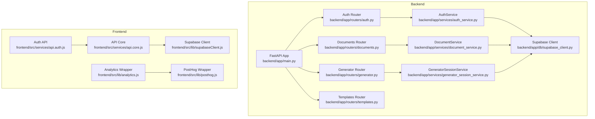
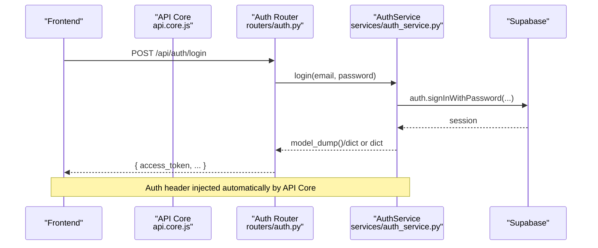
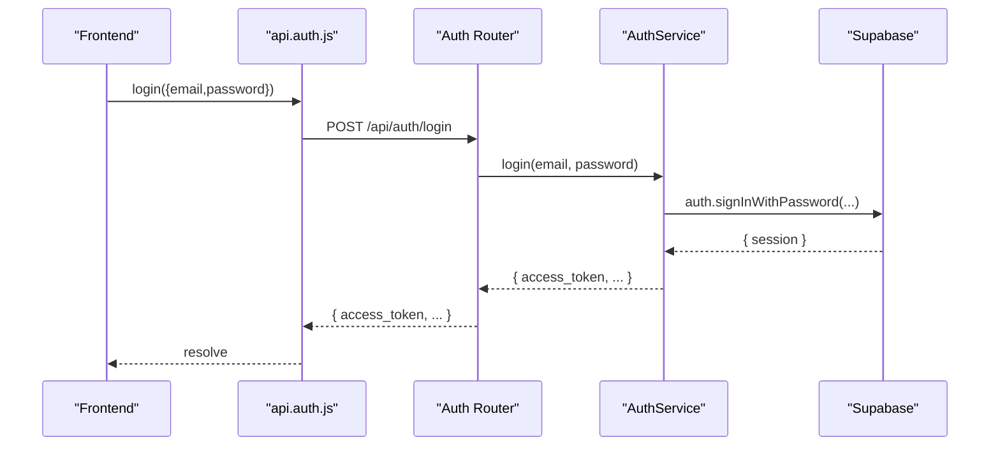
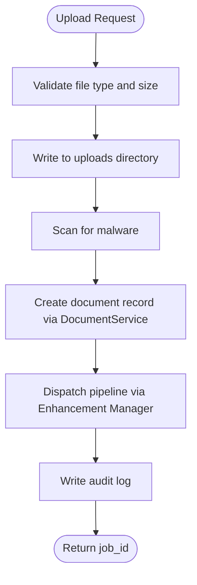
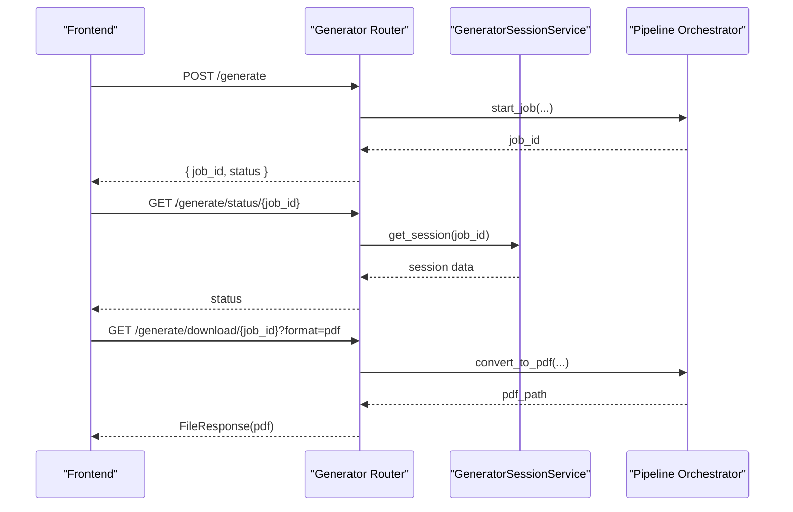
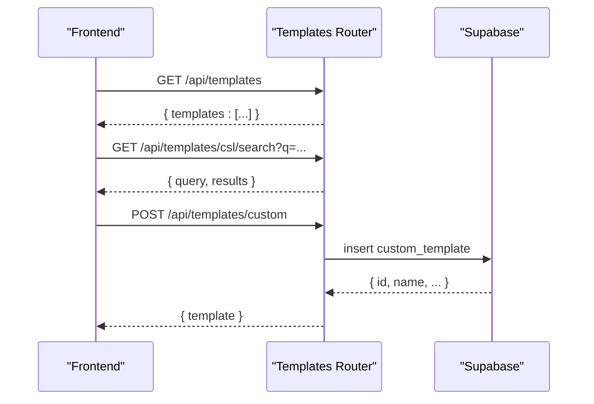
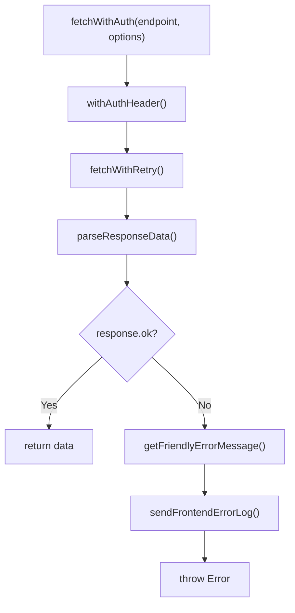
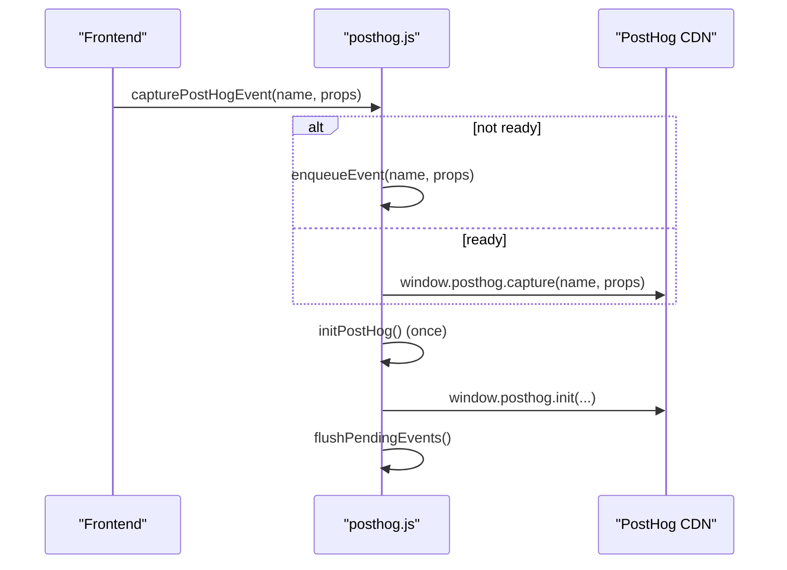
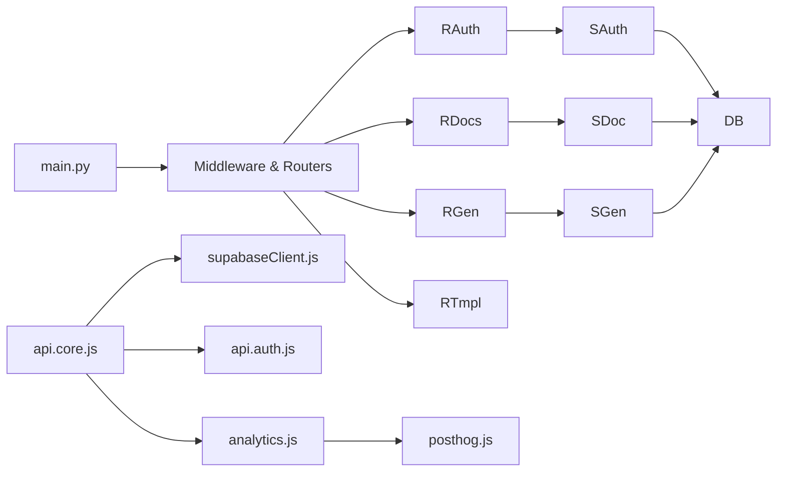

# API Integration

<cite>
**Referenced Files in This Document**
- [backend/app/main.py](file://backend/app/main.py)
- [backend/app/routers/auth.py](file://backend/app/routers/auth.py)
- [backend/app/services/auth_service.py](file://backend/app/services/auth_service.py)
- [backend/app/routers/documents.py](file://backend/app/routers/documents.py)
- [backend/app/services/document_service.py](file://backend/app/services/document_service.py)
- [backend/app/routers/generator.py](file://backend/app/routers/generator.py)
- [backend/app/services/generator_session_service.py](file://backend/app/services/generator_session_service.py)
- [backend/app/routers/templates.py](file://backend/app/routers/templates.py)
- [backend/app/db/supabase_client.py](file://backend/app/db/supabase_client.py)
- [frontend/src/services/api.auth.js](file://frontend/src/services/api.auth.js)
- [frontend/src/services/api.core.js](file://frontend/src/services/api.core.js)
- [frontend/src/lib/supabaseClient.js](file://frontend/src/lib/supabaseClient.js)
- [frontend/src/lib/analytics.js](file://frontend/src/lib/analytics.js)
- [frontend/src/lib/posthog.js](file://frontend/src/lib/posthog.js)
</cite>

## Table of Contents
1. [Introduction](#introduction)
2. [Project Structure](#project-structure)
3. [Core Components](#core-components)
4. [Architecture Overview](#architecture-overview)
5. [Detailed Component Analysis](#detailed-component-analysis)
6. [Dependency Analysis](#dependency-analysis)
7. [Performance Considerations](#performance-considerations)
8. [Troubleshooting Guide](#troubleshooting-guide)
9. [Conclusion](#conclusion)
10. [Appendices](#appendices)

## Introduction
This document explains the API integration patterns and service layer implementation for authentication, document operations, generation sessions, and template management. It covers request/response handling, error management, loading states, authentication integration, schema validation, analytics integration, performance monitoring, API client configuration, caching strategies, and offline handling. It also provides guidelines for extending API services and adding new endpoints.

## Project Structure
The backend is a FastAPI application with modular routers and service layers. The frontend is a Next.js application with typed API clients and analytics integration. Authentication integrates with Supabase, and analytics integrate with PostHog.

**Diagram sources**
- [backend/app/main.py:263-383](file://backend/app/main.py#L263-L383)
- [backend/app/routers/auth.py:1-59](file://backend/app/routers/auth.py#L1-L59)
- [backend/app/routers/documents.py:1-1171](file://backend/app/routers/documents.py#L1-L1171)
- [backend/app/routers/generator.py:1-231](file://backend/app/routers/generator.py#L1-L231)
- [backend/app/routers/templates.py:1-327](file://backend/app/routers/templates.py#L1-L327)
- [backend/app/services/auth_service.py:1-183](file://backend/app/services/auth_service.py#L1-L183)
- [backend/app/services/document_service.py:1-560](file://backend/app/services/document_service.py#L1-L560)
- [backend/app/services/generator_session_service.py:1-362](file://backend/app/services/generator_session_service.py#L1-L362)
- [backend/app/db/supabase_client.py](file://backend/app/db/supabase_client.py)
- [frontend/src/services/api.auth.js:1-39](file://frontend/src/services/api.auth.js#L1-L39)
- [frontend/src/services/api.core.js:1-368](file://frontend/src/services/api.core.js#L1-L368)
- [frontend/src/lib/supabaseClient.js:1-24](file://frontend/src/lib/supabaseClient.js#L1-L24)
- [frontend/src/lib/posthog.js:1-140](file://frontend/src/lib/posthog.js#L1-L140)
- [frontend/src/lib/analytics.js:1-20](file://frontend/src/lib/analytics.js#L1-L20)

**Section sources**
- [backend/app/main.py:263-383](file://backend/app/main.py#L263-L383)
- [frontend/src/services/api.core.js:1-368](file://frontend/src/services/api.core.js#L1-L368)

## Core Components
- Authentication service and router integrate with Supabase for sign-up, login, OTP verification, and password reset.
- Document service encapsulates Supabase operations for document lifecycle, results, and processing statuses.
- Generator session service provides CRUD helpers for generator sessions, messages, and document versions with in-memory caches.
- Templates router exposes built-in and custom template management plus CSL style search and fetch.
- Frontend API core injects auth headers, retries, sanitizes payloads, parses responses, and logs errors.
- Analytics wrappers integrate with PostHog for event capture and page views.

**Section sources**
- [backend/app/routers/auth.py:1-59](file://backend/app/routers/auth.py#L1-L59)
- [backend/app/services/auth_service.py:56-183](file://backend/app/services/auth_service.py#L56-L183)
- [backend/app/routers/documents.py:1-1171](file://backend/app/routers/documents.py#L1-L1171)
- [backend/app/services/document_service.py:34-560](file://backend/app/services/document_service.py#L34-L560)
- [backend/app/routers/generator.py:1-231](file://backend/app/routers/generator.py#L1-L231)
- [backend/app/services/generator_session_service.py:20-362](file://backend/app/services/generator_session_service.py#L20-L362)
- [backend/app/routers/templates.py:1-327](file://backend/app/routers/templates.py#L1-L327)
- [frontend/src/services/api.auth.js:1-39](file://frontend/src/services/api.auth.js#L1-L39)
- [frontend/src/services/api.core.js:1-368](file://frontend/src/services/api.core.js#L1-L368)
- [frontend/src/lib/analytics.js:1-20](file://frontend/src/lib/analytics.js#L1-L20)
- [frontend/src/lib/posthog.js:1-140](file://frontend/src/lib/posthog.js#L1-L140)

## Architecture Overview
The backend initializes middleware, routes, and monitoring. Routers delegate to services that interact with Supabase. The frontend composes typed API calls, manages auth headers, and handles errors and retries. Analytics are integrated via PostHog wrappers.

**Diagram sources**
- [frontend/src/services/api.auth.js:18-26](file://frontend/src/services/api.auth.js#L18-L26)
- [frontend/src/services/api.core.js:307-362](file://frontend/src/services/api.core.js#L307-L362)
- [backend/app/routers/auth.py:31-36](file://backend/app/routers/auth.py#L31-L36)
- [backend/app/services/auth_service.py:102-121](file://backend/app/services/auth_service.py#L102-L121)

**Section sources**
- [backend/app/main.py:263-383](file://backend/app/main.py#L263-L383)
- [backend/app/routers/auth.py:1-59](file://backend/app/routers/auth.py#L1-L59)
- [backend/app/services/auth_service.py:1-183](file://backend/app/services/auth_service.py#L1-L183)
- [frontend/src/services/api.core.js:220-258](file://frontend/src/services/api.core.js#L220-L258)

## Detailed Component Analysis

### Authentication Integration
- Router endpoints: GET /api/auth/me, POST /api/auth/signup, POST /api/auth/login, POST /api/auth/forgot-password, POST /api/auth/verify-otp, POST /api/auth/reset-password.
- Service delegates to Supabase client; validates configuration and raises 503 if unconfigured.
- Token decoding and user identity extraction are supported.

**Diagram sources**
- [frontend/src/services/api.auth.js:20](file://frontend/src/services/api.auth.js#L20)
- [backend/app/routers/auth.py:31-36](file://backend/app/routers/auth.py#L31-L36)
- [backend/app/services/auth_service.py:102-121](file://backend/app/services/auth_service.py#L102-L121)

**Section sources**
- [backend/app/routers/auth.py:1-59](file://backend/app/routers/auth.py#L1-L59)
- [backend/app/services/auth_service.py:56-183](file://backend/app/services/auth_service.py#L56-L183)
- [frontend/src/services/api.auth.js:1-39](file://frontend/src/services/api.auth.js#L1-L39)

### Document Operations
- Routers support upload (single and chunked), list, status polling, preview, compare, edit, and download.
- Services encapsulate Supabase reads/writes, with backward-compatible handling for optional schema columns and signed download URLs.
- Status polling uses an in-memory cache keyed by owner and job ID.

**Diagram sources**
- [backend/app/routers/documents.py:468-617](file://backend/app/routers/documents.py#L468-L617)
- [backend/app/services/document_service.py:204-282](file://backend/app/services/document_service.py#L204-L282)

**Section sources**
- [backend/app/routers/documents.py:1-1171](file://backend/app/routers/documents.py#L1-L1171)
- [backend/app/services/document_service.py:1-560](file://backend/app/services/document_service.py#L1-L560)

### Generation Sessions
- Router supports POST /generate, GET /generate/status/{job_id}, and GET /generate/download/{job_id}.
- Ownership checks ensure only the job owner can access status and downloads.
- PDF conversion is performed on demand when requested.

**Diagram sources**
- [backend/app/routers/generator.py:78-231](file://backend/app/routers/generator.py#L78-L231)
- [backend/app/services/generator_session_service.py:126-362](file://backend/app/services/generator_session_service.py#L126-L362)

**Section sources**
- [backend/app/routers/generator.py:1-231](file://backend/app/routers/generator.py#L1-L231)
- [backend/app/services/generator_session_service.py:1-362](file://backend/app/services/generator_session_service.py#L1-L362)

### Template Management
- Built-in templates listing and CSL style search/fetch.
- Custom templates CRUD for authenticated users backed by Supabase.

**Diagram sources**
- [backend/app/routers/templates.py:119-327](file://backend/app/routers/templates.py#L119-L327)

**Section sources**
- [backend/app/routers/templates.py:1-327](file://backend/app/routers/templates.py#L1-L327)

### Frontend API Client and Interceptors
- Base URL and retry policy are centralized.
- Auth headers are injected using Supabase session with a small retry window to handle SSR races.
- Payload sanitization and friendly error messages improve UX.
- Error logs are sent to backend metrics endpoint.

**Diagram sources**
- [frontend/src/services/api.core.js:307-362](file://frontend/src/services/api.core.js#L307-L362)
- [frontend/src/services/api.core.js:220-258](file://frontend/src/services/api.core.js#L220-L258)
- [frontend/src/services/api.core.js:168-218](file://frontend/src/services/api.core.js#L168-L218)

**Section sources**
- [frontend/src/services/api.core.js:1-368](file://frontend/src/services/api.core.js#L1-L368)
- [frontend/src/lib/supabaseClient.js:1-24](file://frontend/src/lib/supabaseClient.js#L1-L24)

### Analytics Integration (PostHog)
- Lightweight wrappers initialize PostHog asynchronously, queue events when not ready, and flush pending events after initialization.
- Event capture is non-blocking and optional.

**Diagram sources**
- [frontend/src/lib/posthog.js:65-108](file://frontend/src/lib/posthog.js#L65-L108)
- [frontend/src/lib/posthog.js:110-122](file://frontend/src/lib/posthog.js#L110-L122)
- [frontend/src/lib/analytics.js:7-19](file://frontend/src/lib/analytics.js#L7-L19)

**Section sources**
- [frontend/src/lib/posthog.js:1-140](file://frontend/src/lib/posthog.js#L1-L140)
- [frontend/src/lib/analytics.js:1-20](file://frontend/src/lib/analytics.js#L1-L20)

## Dependency Analysis
- Backend app wires middleware, CORS, rate limiting, security headers, and Prometheus metrics. Routers are included centrally.
- Services depend on Supabase client for persistence and on shared utilities for logging context.
- Frontend depends on Supabase for auth session and on API core for network operations.

**Diagram sources**
- [backend/app/main.py:273-359](file://backend/app/main.py#L273-L359)
- [backend/app/routers/auth.py:1-59](file://backend/app/routers/auth.py#L1-L59)
- [backend/app/routers/documents.py:1-1171](file://backend/app/routers/documents.py#L1-L1171)
- [backend/app/routers/generator.py:1-231](file://backend/app/routers/generator.py#L1-L231)
- [backend/app/routers/templates.py:1-327](file://backend/app/routers/templates.py#L1-L327)
- [backend/app/services/auth_service.py:1-183](file://backend/app/services/auth_service.py#L1-L183)
- [backend/app/services/document_service.py:1-560](file://backend/app/services/document_service.py#L1-L560)
- [backend/app/services/generator_session_service.py:1-362](file://backend/app/services/generator_session_service.py#L1-L362)
- [frontend/src/services/api.core.js:1-368](file://frontend/src/services/api.core.js#L1-L368)
- [frontend/src/lib/supabaseClient.js:1-24](file://frontend/src/lib/supabaseClient.js#L1-L24)
- [frontend/src/lib/analytics.js:1-20](file://frontend/src/lib/analytics.js#L1-L20)
- [frontend/src/lib/posthog.js:1-140](file://frontend/src/lib/posthog.js#L1-L140)

**Section sources**
- [backend/app/main.py:263-383](file://backend/app/main.py#L263-L383)
- [frontend/src/services/api.core.js:1-368](file://frontend/src/services/api.core.js#L1-L368)

## Performance Considerations
- Caching strategies:
  - Document status responses cache with TTL.
  - Generator session, messages, session lists, and latest document caches with separate TTLs.
  - DocumentService optionally persists file and output hashes with graceful fallbacks.
- Retry and resilience:
  - Frontend retries safe methods (GET/HEAD/OPTIONS) on transient errors and selected status codes.
  - Supabase client initialization guards prevent runtime crashes in SSR environments.
- Observability:
  - Prometheus metrics exposed via instrumentor.
  - Sentry integration for error tracking.
  - Audit logs for write operations.

**Section sources**
- [backend/app/routers/documents.py:103-151](file://backend/app/routers/documents.py#L103-L151)
- [backend/app/services/generator_session_service.py:74-125](file://backend/app/services/generator_session_service.py#L74-L125)
- [backend/app/services/document_service.py:357-392](file://backend/app/services/document_service.py#L357-L392)
- [frontend/src/services/api.core.js:168-218](file://frontend/src/services/api.core.js#L168-L218)
- [backend/app/main.py:273-274](file://backend/app/main.py#L273-L274)
- [backend/app/main.py:40-59](file://backend/app/main.py#L40-L59)

## Troubleshooting Guide
- Authentication failures:
  - Missing Supabase credentials cause 503 during auth operations.
  - Login returns 401 with user-friendly messages; verify OTP and password policies.
- Document upload issues:
  - Invalid file type, spoofed signatures, or oversized files return 400/413.
  - Malware detection blocks uploads with 422.
  - Database unavailability returns 503; retry after service restoration.
- Status and download:
  - Unauthorized access returns 403; ensure ownership.
  - Job not done returns 409; poll until completion.
- Frontend errors:
  - Network errors are detected and surfaced with friendly messages.
  - Errors are logged to backend metrics endpoint for triage.

**Section sources**
- [backend/app/services/auth_service.py:46-53](file://backend/app/services/auth_service.py#L46-L53)
- [backend/app/routers/documents.py:205-230](file://backend/app/routers/documents.py#L205-L230)
- [backend/app/routers/documents.py:325-334](file://backend/app/routers/documents.py#L325-L334)
- [backend/app/routers/generator.py:178-182](file://backend/app/routers/generator.py#L178-L182)
- [frontend/src/services/api.core.js:85-97](file://frontend/src/services/api.core.js#L85-L97)
- [frontend/src/services/api.core.js:121-166](file://frontend/src/services/api.core.js#L121-L166)

## Conclusion
The system integrates authentication with Supabase, centralizes API networking with robust retry and error handling, and provides modular service layers for documents, generation sessions, and templates. Analytics are decoupled and non-blocking. Caching and observability are built-in to support performance and reliability.

## Appendices

### Guidelines for Extending API Services and Adding New Endpoints
- Define router endpoints with appropriate dependencies and request/response models.
- Implement service methods that encapsulate persistence and business logic, using the Supabase client.
- Add caching where appropriate using TTL-based in-memory caches with lock-protected updates.
- Centralize error handling and friendly messaging in the frontend API core.
- Integrate analytics via lightweight wrappers to keep tracking optional and non-blocking.
- Ensure observability by instrumenting new endpoints and logging audit events for write operations.

[No sources needed since this section provides general guidance]