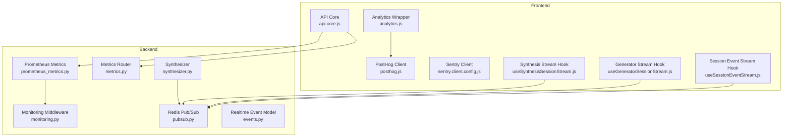
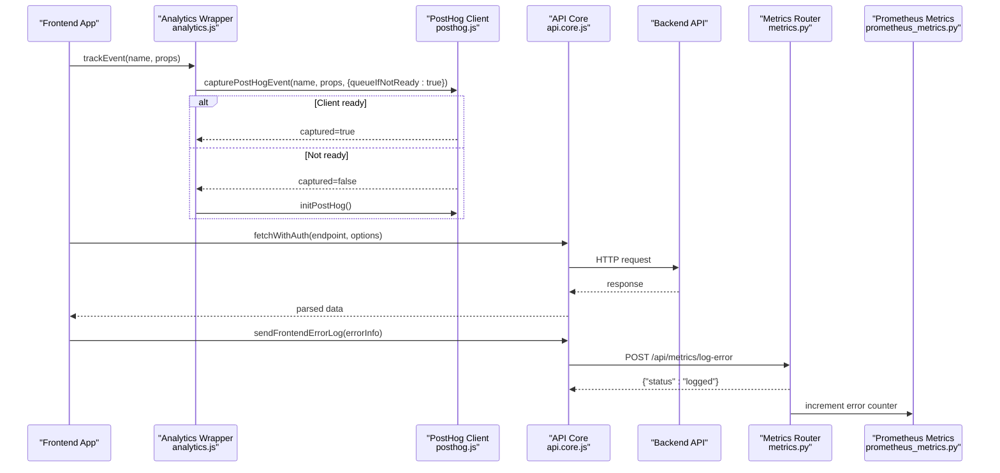
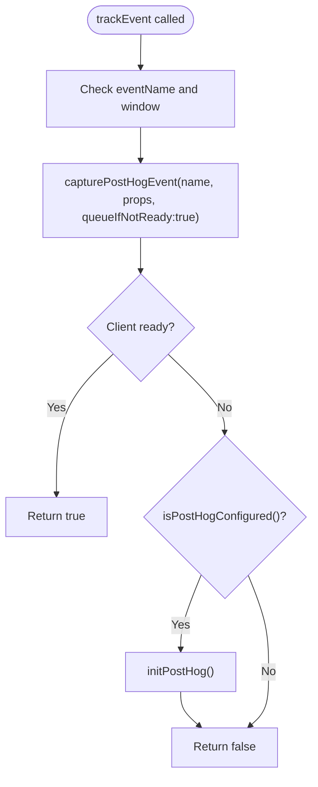
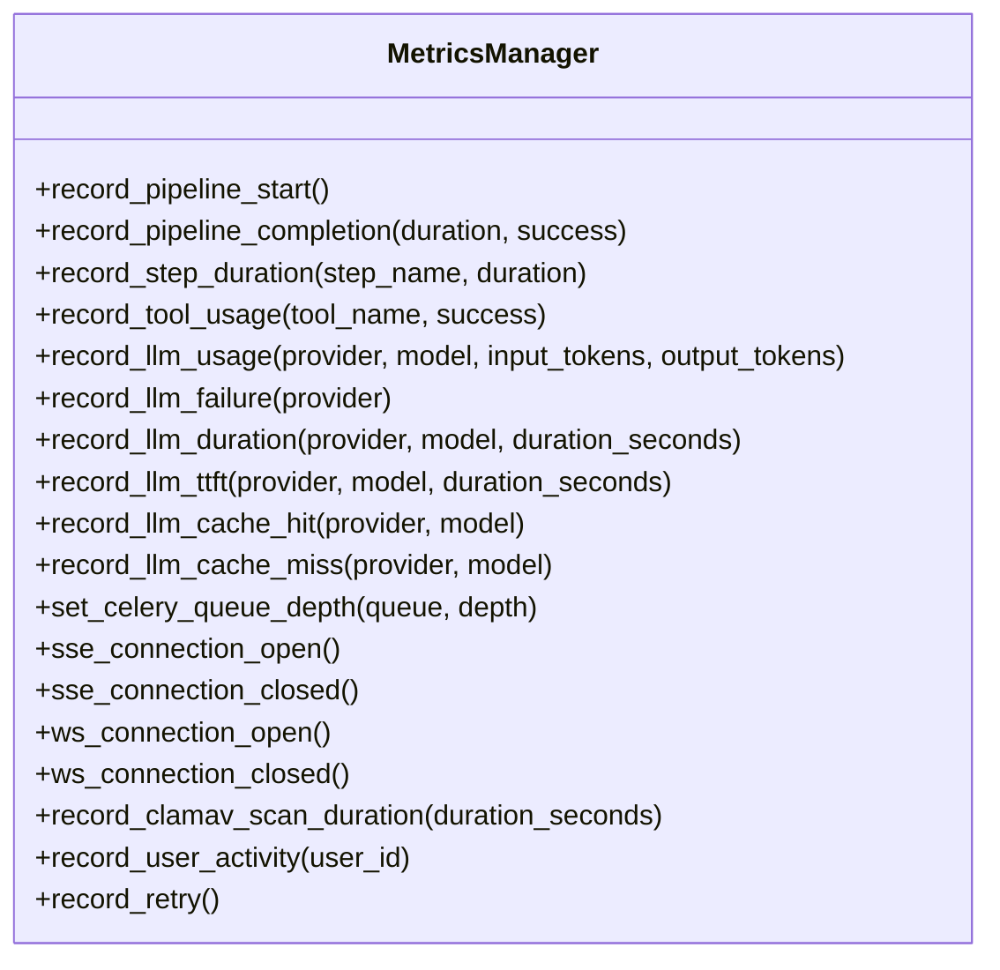
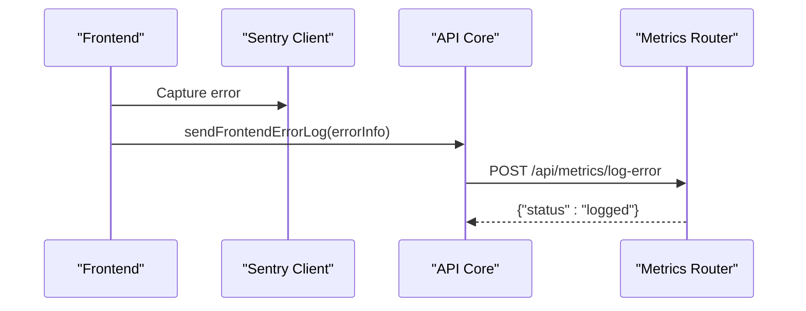
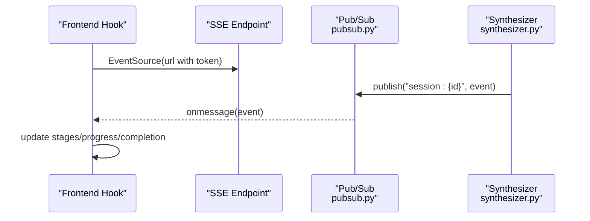
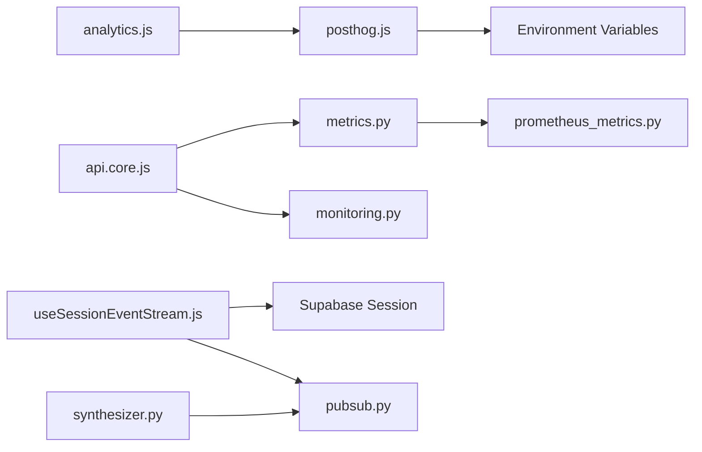

# Analytics & Performance Monitoring

<cite>
**Referenced Files in This Document**
- [posthog.js](file://frontend/src/lib/posthog.js)
- [analytics.js](file://frontend/src/lib/analytics.js)
- [analytics.test.js](file://frontend/src/lib/analytics.test.js)
- [posthog.test.js](file://frontend/src/lib/posthog.test.js)
- [sentry.client.config.js](file://frontend/sentry.client.config.js)
- [api.core.js](file://frontend/src/services/api.core.js)
- [metrics.py](file://backend/app/routers/metrics.py)
- [prometheus_metrics.py](file://backend/app/middleware/prometheus_metrics.py)
- [monitoring.py](file://backend/app/middleware/monitoring.py)
- [useSessionEventStream.js](file://frontend/src/hooks/useSessionEventStream.js)
- [useGeneratorSessionStream.js](file://frontend/src/hooks/useGeneratorSessionStream.js)
- [useSynthesisSessionStream.js](file://frontend/src/hooks/useSynthesisSessionStream.js)
- [pubsub.py](file://backend/app/realtime/pubsub.py)
- [events.py](file://backend/app/realtime/events.py)
- [synthesizer.py](file://backend/app/pipeline/synthesis/synthesizer.py)
- [002-redis-realtime-backbone.md](file://docs/adr/002-redis-realtime-backbone.md)
- [privacy page.jsx](file://frontend/app/(shared)/privacy/page.jsx)
</cite>

## Table of Contents
1. [Introduction](#introduction)
2. [Project Structure](#project-structure)
3. [Core Components](#core-components)
4. [Architecture Overview](#architecture-overview)
5. [Detailed Component Analysis](#detailed-component-analysis)
6. [Dependency Analysis](#dependency-analysis)
7. [Performance Considerations](#performance-considerations)
8. [Troubleshooting Guide](#troubleshooting-guide)
9. [Conclusion](#conclusion)
10. [Appendices](#appendices)

## Introduction
This document explains the analytics and performance monitoring systems in the platform. It covers:
- PostHog integration for event tracking, user behavior analytics, and feature usage metrics
- Analytics event collection, custom property tracking, and user identification patterns
- Performance monitoring with metrics collection and Prometheus metrics
- Error tracking with Sentry and backend forwarding of frontend errors
- Real-time event streaming via Server-Sent Events (SSE) and Redis-backed pub/sub
- Guidelines for adding new analytics events, privacy considerations, and opt-out mechanisms
- Integration with session event streams and real-time user interaction tracking

## Project Structure
The analytics and monitoring systems span the frontend and backend:
- Frontend: PostHog client initialization and event capture, Sentry error reporting, real-time session streams
- Backend: Prometheus metrics exposure, monitoring middleware, metrics endpoints, Redis-backed pub/sub, and event emission

**Diagram sources**
- [posthog.js:1-140](file://frontend/src/lib/posthog.js#L1-L140)
- [analytics.js:1-20](file://frontend/src/lib/analytics.js#L1-L20)
- [sentry.client.config.js:1-20](file://frontend/sentry.client.config.js#L1-L20)
- [useSessionEventStream.js:1-101](file://frontend/src/hooks/useSessionEventStream.js#L1-L101)
- [useGeneratorSessionStream.js:1-11](file://frontend/src/hooks/useGeneratorSessionStream.js#L1-L11)
- [useSynthesisSessionStream.js:1-11](file://frontend/src/hooks/useSynthesisSessionStream.js#L1-L11)
- [api.core.js:1-368](file://frontend/src/services/api.core.js#L1-L368)
- [prometheus_metrics.py:1-235](file://backend/app/middleware/prometheus_metrics.py#L1-L235)
- [monitoring.py:1-51](file://backend/app/middleware/monitoring.py#L1-L51)
- [metrics.py:1-201](file://backend/app/routers/metrics.py#L1-L201)
- [pubsub.py:1-120](file://backend/app/realtime/pubsub.py#L1-L120)
- [events.py:1-34](file://backend/app/realtime/events.py#L1-L34)
- [synthesizer.py:196-219](file://backend/app/pipeline/synthesis/synthesizer.py#L196-L219)

**Section sources**
- [posthog.js:1-140](file://frontend/src/lib/posthog.js#L1-L140)
- [analytics.js:1-20](file://frontend/src/lib/analytics.js#L1-L20)
- [sentry.client.config.js:1-20](file://frontend/sentry.client.config.js#L1-L20)
- [api.core.js:1-368](file://frontend/src/services/api.core.js#L1-L368)
- [prometheus_metrics.py:1-235](file://backend/app/middleware/prometheus_metrics.py#L1-L235)
- [monitoring.py:1-51](file://backend/app/middleware/monitoring.py#L1-L51)
- [metrics.py:1-201](file://backend/app/routers/metrics.py#L1-L201)
- [pubsub.py:1-120](file://backend/app/realtime/pubsub.py#L1-L120)
- [events.py:1-34](file://backend/app/realtime/events.py#L1-L34)
- [synthesizer.py:196-219](file://backend/app/pipeline/synthesis/synthesizer.py#L196-L219)

## Core Components
- PostHog client and analytics wrapper:
  - Lazy initialization with environment-driven configuration
  - Queued event capture until client is ready
  - Non-blocking initialization to avoid impacting app boot
- Sentry client:
  - Browser-side error reporting with sampling and replay integrations
- Session event streaming:
  - React hooks for real-time synthesis and generator sessions via SSE
  - Automatic auth token inclusion and exponential backoff
- Backend metrics:
  - Prometheus metrics definitions and middleware
  - Metrics router exposing health, database, and dashboard metrics
  - Redis-backed pub/sub for scalable real-time event distribution

**Section sources**
- [posthog.js:31-133](file://frontend/src/lib/posthog.js#L31-L133)
- [analytics.js:7-19](file://frontend/src/lib/analytics.js#L7-L19)
- [sentry.client.config.js:1-20](file://frontend/sentry.client.config.js#L1-L20)
- [useSessionEventStream.js:1-101](file://frontend/src/hooks/useSessionEventStream.js#L1-L101)
- [useGeneratorSessionStream.js:1-11](file://frontend/src/hooks/useGeneratorSessionStream.js#L1-L11)
- [useSynthesisSessionStream.js:1-11](file://frontend/src/hooks/useSynthesisSessionStream.js#L1-L11)
- [prometheus_metrics.py:144-235](file://backend/app/middleware/prometheus_metrics.py#L144-L235)
- [metrics.py:60-96](file://backend/app/routers/metrics.py#L60-L96)
- [pubsub.py:18-120](file://backend/app/realtime/pubsub.py#L18-L120)

## Architecture Overview
The system integrates frontend analytics and error reporting with backend metrics and real-time streaming.

**Diagram sources**
- [analytics.js:7-19](file://frontend/src/lib/analytics.js#L7-L19)
- [posthog.js:110-133](file://frontend/src/lib/posthog.js#L110-L133)
- [api.core.js:289-362](file://frontend/src/services/api.core.js#L289-L362)
- [metrics.py:60-96](file://backend/app/routers/metrics.py#L60-L96)
- [prometheus_metrics.py:144-235](file://backend/app/middleware/prometheus_metrics.py#L144-L235)

## Detailed Component Analysis

### PostHog Analytics Integration
- Configuration and lazy initialization:
  - Environment variables drive API key and host
  - Script loading with deduplication and error handling
  - Initialization options limit pageview capture and restrict profiles
- Event capture and queuing:
  - Events are enqueued if client is not ready and configuration exists
  - Pending events are flushed upon successful initialization
- Pageview tracking:
  - Dedicated function captures path and current URL with lazy initialization fallback

**Diagram sources**
- [analytics.js:7-19](file://frontend/src/lib/analytics.js#L7-L19)
- [posthog.js:110-133](file://frontend/src/lib/posthog.js#L110-L133)

**Section sources**
- [posthog.js:5-133](file://frontend/src/lib/posthog.js#L5-L133)
- [analytics.js:1-20](file://frontend/src/lib/analytics.js#L1-L20)
- [analytics.test.js:21-55](file://frontend/src/lib/analytics.test.js#L21-L55)
- [posthog.test.js:10-50](file://frontend/src/lib/posthog.test.js#L10-L50)

### Analytics Event Collection and Custom Properties
- Event naming and properties:
  - Use descriptive event names (e.g., feature usage, session lifecycle)
  - Attach custom properties such as identifiers, progress, and metadata
- Best practices:
  - Keep property keys consistent across events
  - Avoid sending sensitive data; sanitize payloads
  - Prefer numeric properties for histograms and counters

**Section sources**
- [posthog.js:110-122](file://frontend/src/lib/posthog.js#L110-L122)
- [analytics.js:7-19](file://frontend/src/lib/analytics.js#L7-L19)

### User Identification Patterns
- Identified profiles:
  - Profiles are set to "identified_only" to align with privacy defaults
- Authentication context:
  - Frontend APIs inject Authorization headers when available
  - Backend monitoring middleware attaches request IDs for correlation

**Section sources**
- [posthog.js:88-93](file://frontend/src/lib/posthog.js#L88-L93)
- [api.core.js:220-255](file://frontend/src/services/api.core.js#L220-L255)
- [monitoring.py:17-51](file://backend/app/middleware/monitoring.py#L17-L51)

### Performance Monitoring with Prometheus
- Metrics definitions:
  - Pipeline request totals and durations
  - Agent tool usage, LLM token consumption, retries
  - System-level metrics: active jobs, SSE/WS connections, ClamAV scan duration
- Metrics manager:
  - Centralized helpers to record durations, counts, and gauges
  - Active user tracking with sliding window
- Exposure:
  - Metrics endpoint returns latest metrics in Prometheus text format

**Diagram sources**
- [prometheus_metrics.py:144-235](file://backend/app/middleware/prometheus_metrics.py#L144-L235)

**Section sources**
- [prometheus_metrics.py:1-235](file://backend/app/middleware/prometheus_metrics.py#L1-L235)
- [monitoring.py:1-51](file://backend/app/middleware/monitoring.py#L1-L51)
- [metrics.py:1-201](file://backend/app/routers/metrics.py#L1-L201)

### Error Tracking with Sentry
- Frontend configuration:
  - DSN-driven initialization with sampling rates and replay integrations
  - Masking and media blocking for privacy
- Frontend-to-backend error forwarding:
  - API helper posts structured error logs to backend metrics endpoint
  - Backend logs the error and increments a Prometheus error counter

**Diagram sources**
- [sentry.client.config.js:1-20](file://frontend/sentry.client.config.js#L1-L20)
- [api.core.js:289-305](file://frontend/src/services/api.core.js#L289-L305)
- [metrics.py:60-96](file://backend/app/routers/metrics.py#L60-L96)

**Section sources**
- [sentry.client.config.js:1-20](file://frontend/sentry.client.config.js#L1-L20)
- [api.core.js:289-305](file://frontend/src/services/api.core.js#L289-L305)
- [metrics.py:60-96](file://backend/app/routers/metrics.py#L60-L96)

### Real-Time Event Streaming and Session Tracking
- Session event streams:
  - Hooks establish SSE connections with token inclusion and exponential backoff
  - Parse incoming messages to update stages, progress, and completion/error states
- Backend pub/sub and event model:
  - Redis-backed publish/subscribe with in-memory fallback
  - Event factory constructs typed events with timestamps and request context
- Session event emission:
  - Synthesizer publishes structured events to session channels

**Diagram sources**
- [useSessionEventStream.js:20-97](file://frontend/src/hooks/useSessionEventStream.js#L20-L97)
- [pubsub.py:55-120](file://backend/app/realtime/pubsub.py#L55-L120)
- [events.py:21-34](file://backend/app/realtime/events.py#L21-L34)
- [synthesizer.py:196-219](file://backend/app/pipeline/synthesis/synthesizer.py#L196-L219)

**Section sources**
- [useSessionEventStream.js:1-101](file://frontend/src/hooks/useSessionEventStream.js#L1-L101)
- [useGeneratorSessionStream.js:1-11](file://frontend/src/hooks/useGeneratorSessionStream.js#L1-L11)
- [useSynthesisSessionStream.js:1-11](file://frontend/src/hooks/useSynthesisSessionStream.js#L1-L11)
- [pubsub.py:1-120](file://backend/app/realtime/pubsub.py#L1-L120)
- [events.py:1-34](file://backend/app/realtime/events.py#L1-L34)
- [synthesizer.py:196-219](file://backend/app/pipeline/synthesis/synthesizer.py#L196-L219)
- [002-redis-realtime-backbone.md:1-10](file://docs/adr/002-redis-realtime-backbone.md#L1-L10)

## Dependency Analysis
- Frontend analytics depends on environment configuration and browser globals
- Real-time streaming depends on Supabase session for auth token injection
- Backend metrics depend on Prometheus client and Redis availability
- Error forwarding depends on backend metrics router and Prometheus metrics manager

**Diagram sources**
- [posthog.js:5-9](file://frontend/src/lib/posthog.js#L5-L9)
- [analytics.js](file://frontend/src/lib/analytics.js#L5)
- [api.core.js:289-305](file://frontend/src/services/api.core.js#L289-L305)
- [metrics.py:60-96](file://backend/app/routers/metrics.py#L60-L96)
- [monitoring.py:17-51](file://backend/app/middleware/monitoring.py#L17-L51)
- [prometheus_metrics.py:144-235](file://backend/app/middleware/prometheus_metrics.py#L144-L235)
- [useSessionEventStream.js:23-36](file://frontend/src/hooks/useSessionEventStream.js#L23-L36)
- [pubsub.py:18-120](file://backend/app/realtime/pubsub.py#L18-L120)
- [synthesizer.py:196-219](file://backend/app/pipeline/synthesis/synthesizer.py#L196-L219)

**Section sources**
- [posthog.js:5-9](file://frontend/src/lib/posthog.js#L5-L9)
- [analytics.js](file://frontend/src/lib/analytics.js#L5)
- [api.core.js:289-305](file://frontend/src/services/api.core.js#L289-L305)
- [metrics.py:60-96](file://backend/app/routers/metrics.py#L60-L96)
- [monitoring.py:17-51](file://backend/app/middleware/monitoring.py#L17-L51)
- [prometheus_metrics.py:144-235](file://backend/app/middleware/prometheus_metrics.py#L144-L235)
- [useSessionEventStream.js:23-36](file://frontend/src/hooks/useSessionEventStream.js#L23-L36)
- [pubsub.py:18-120](file://backend/app/realtime/pubsub.py#L18-L120)
- [synthesizer.py:196-219](file://backend/app/pipeline/synthesis/synthesizer.py#L196-L219)

## Performance Considerations
- Non-blocking analytics initialization:
  - PostHog initialization is lazy and does not block app startup
- Retry and resilience:
  - SSE connections implement exponential backoff with capped retries
  - Frontend fetch helper retries safe methods automatically
- Metrics granularity:
  - Use histograms for latency and counters for throughput
  - Track active users with a sliding window to reduce memory footprint
- Redis fallback:
  - Pub/Sub gracefully falls back to in-memory queues when Redis is unavailable

[No sources needed since this section provides general guidance]

## Troubleshooting Guide
- PostHog not capturing events:
  - Verify environment variables are present and loaded
  - Confirm client initialization completes; check for initialization errors
  - Ensure events are enqueued and flushed after initialization
- Sentry not reporting errors:
  - Confirm DSN is configured and integration is initialized
  - Check replay settings and masking configuration
- Frontend errors not reaching backend:
  - Inspect network requests to the metrics endpoint
  - Verify error forwarding is not suppressed in API calls
- Real-time streams disconnecting:
  - Review SSE error handling and exponential backoff behavior
  - Validate auth token inclusion and session validity
- Metrics endpoint returns errors:
  - Check Prometheus client availability and metric registration
  - Verify backend health and database connectivity

**Section sources**
- [posthog.js:97-104](file://frontend/src/lib/posthog.js#L97-L104)
- [posthog.test.js:10-50](file://frontend/src/lib/posthog.test.js#L10-L50)
- [sentry.client.config.js:1-20](file://frontend/sentry.client.config.js#L1-L20)
- [api.core.js:289-305](file://frontend/src/services/api.core.js#L289-L305)
- [useSessionEventStream.js:76-97](file://frontend/src/hooks/useSessionEventStream.js#L76-L97)
- [metrics.py:60-96](file://backend/app/routers/metrics.py#L60-L96)
- [prometheus_metrics.py:144-235](file://backend/app/middleware/prometheus_metrics.py#L144-L235)

## Conclusion
The platform integrates robust analytics and monitoring across frontend and backend:
- PostHog enables privacy-conscious event tracking with lazy initialization and queued events
- Sentry provides comprehensive error reporting with replay and sampling
- Prometheus metrics expose operational insights with middleware and dedicated endpoints
- Real-time streaming leverages SSE and Redis-backed pub/sub for scalable session updates
These components work together to support data-driven decisions, performance optimization, and reliable user experiences.

[No sources needed since this section summarizes without analyzing specific files]

## Appendices

### Adding New Analytics Events
- Choose a descriptive event name and define custom properties
- Use the analytics wrapper to capture events; it will initialize PostHog if configured
- Avoid sending sensitive data; sanitize payloads before capture
- Test event capture with unit tests mirroring the existing patterns

**Section sources**
- [analytics.js:7-19](file://frontend/src/lib/analytics.js#L7-L19)
- [analytics.test.js:21-55](file://frontend/src/lib/analytics.test.js#L21-L55)
- [posthog.js:110-122](file://frontend/src/lib/posthog.js#L110-L122)

### Privacy and Opt-Out Mechanisms
- PostHog configuration:
  - Profiles are restricted to identified-only
  - Environment variable controls whether analytics are enabled
- Cookies and analytics:
  - Essential cookies for authentication; optional analytics for usage insights
- Data retention and rights:
  - Users can access, correct, delete personal data and export document history
- Privacy policy references:
  - Details on cookies, analytics, and data retention are available in the privacy page

**Section sources**
- [posthog.js:31-34](file://frontend/src/lib/posthog.js#L31-L34)
- [posthog.js:88-93](file://frontend/src/lib/posthog.js#L88-L93)
- [privacy page.jsx](file://frontend/app/(shared)/privacy/page.jsx#L24-L41)