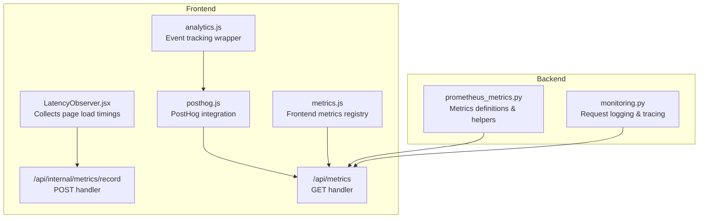
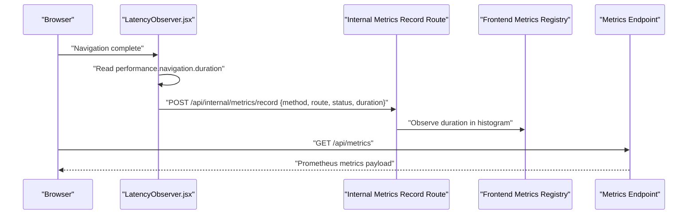
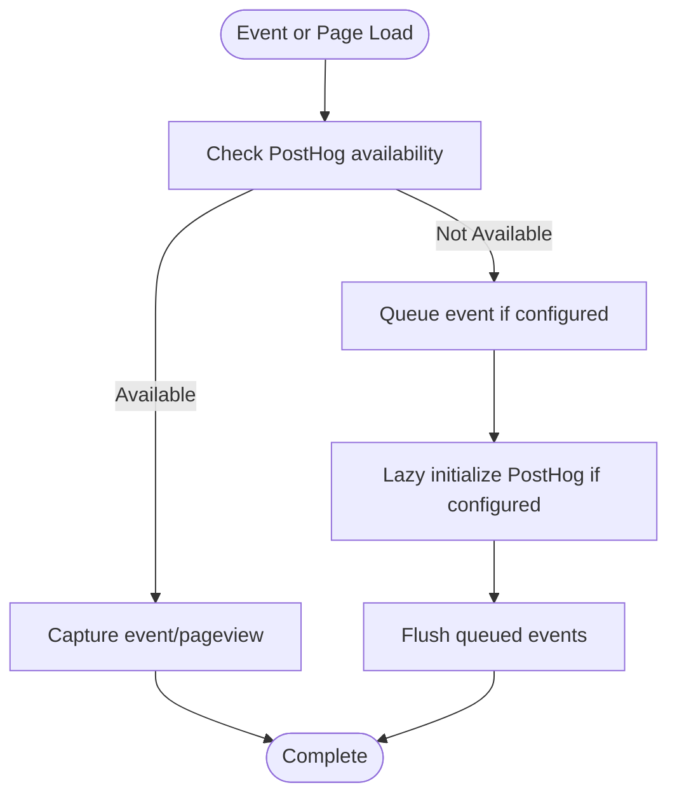
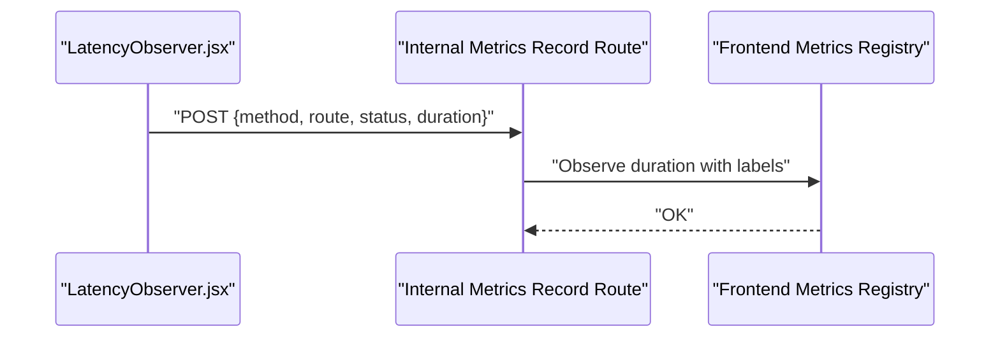
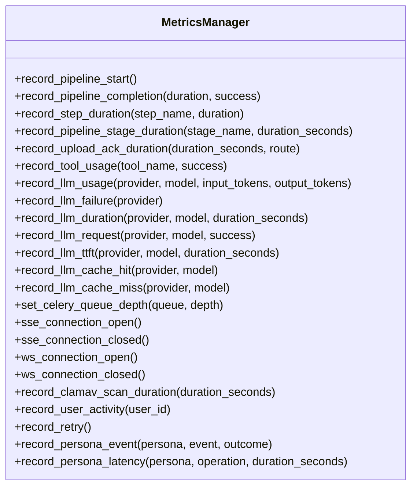
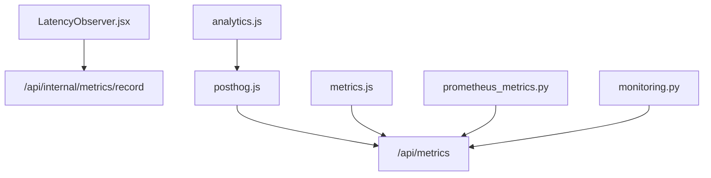

# Real User Monitoring (RUM)

<cite>
**Referenced Files in This Document**
- [rum.js](file://frontend/src/lib/rum.js)
- [posthog.js](file://frontend/src/lib/posthog.js)
- [analytics.js](file://frontend/src/lib/analytics.js)
- [LatencyObserver.jsx](file://frontend/src/components/monitoring/LatencyObserver.jsx)
- [route.js](file://frontend/app/api/internal/metrics/record/route.js)
- [metrics.js](file://frontend/src/lib/metrics.js)
- [prometheus_metrics.py](file://backend/app/middleware/prometheus_metrics.py)
- [monitoring.py](file://backend/app/middleware/monitoring.py)
- [route.js](file://frontend/app/api/metrics/route.js)
</cite>

## Table of Contents
1. [Introduction](#introduction)
2. [Project Structure](#project-structure)
3. [Core Components](#core-components)
4. [Architecture Overview](#architecture-overview)
5. [Detailed Component Analysis](#detailed-component-analysis)
6. [Dependency Analysis](#dependency-analysis)
7. [Performance Considerations](#performance-considerations)
8. [Troubleshooting Guide](#troubleshooting-guide)
9. [Conclusion](#conclusion)

## Introduction
This document describes the Real User Monitoring (RUM) implementation in the automated academic manuscript formatter. The system captures frontend performance metrics and user interactions to provide insights into real-world usage patterns and performance characteristics. The implementation consists of three primary layers:
- Frontend instrumentation: collects page load timings and user interaction events
- Backend ingestion: receives and aggregates metrics via lightweight endpoints
- Observability stack: exposes Prometheus-compatible metrics for monitoring dashboards and alerting

The current implementation integrates PostHog for event tracking and uses the browser's Performance Navigation Timing API for page load measurements. It also includes a placeholder RUM module designed for future expansion to providers like Datadog or Sentry.

## Project Structure
The RUM system spans both frontend and backend components:
- Frontend: instrumentation libraries, latency observer, and API routes for metric ingestion
- Backend: Prometheus metrics middleware and monitoring middleware for request telemetry

**Diagram sources**
- [LatencyObserver.jsx:1-38](file://frontend/src/components/monitoring/LatencyObserver.jsx#L1-L38)
- [posthog.js:1-140](file://frontend/src/lib/posthog.js#L1-L140)
- [analytics.js:1-20](file://frontend/src/lib/analytics.js#L1-L20)
- [route.js:1-22](file://frontend/app/api/internal/metrics/record/route.js#L1-L22)
- [route.js:1-20](file://frontend/app/api/metrics/route.js#L1-L20)
- [metrics.js:1-19](file://frontend/src/lib/metrics.js#L1-L19)
- [prometheus_metrics.py:1-300](file://backend/app/middleware/prometheus_metrics.py#L1-L300)
- [monitoring.py:1-51](file://backend/app/middleware/monitoring.py#L1-L51)

**Section sources**
- [rum.js:1-27](file://frontend/src/lib/rum.js#L1-L27)
- [posthog.js:1-140](file://frontend/src/lib/posthog.js#L1-L140)
- [analytics.js:1-20](file://frontend/src/lib/analytics.js#L1-L20)
- [LatencyObserver.jsx:1-38](file://frontend/src/components/monitoring/LatencyObserver.jsx#L1-L38)
- [route.js:1-22](file://frontend/app/api/internal/metrics/record/route.js#L1-L22)
- [metrics.js:1-19](file://frontend/src/lib/metrics.js#L1-L19)
- [prometheus_metrics.py:1-300](file://backend/app/middleware/prometheus_metrics.py#L1-L300)
- [monitoring.py:1-51](file://backend/app/middleware/monitoring.py#L1-L51)

## Core Components
- RUM initialization and event tracking (placeholder): Provides initialization and event tracking functions for future RUM providers.
- PostHog integration: Manages lazy initialization, event queuing, and pageview capture.
- Analytics wrapper: Offers a non-blocking event tracking interface that delegates to PostHog when configured.
- Latency observer: Captures page load durations using the Performance Navigation Timing API and reports them to the backend.
- Frontend metrics registry: Defines a Prometheus-compatible histogram for HTTP request durations and registers default metrics.
- Internal metrics recording endpoint: Receives latency observations and updates the frontend metrics registry.
- Backend Prometheus metrics middleware: Defines comprehensive metrics for pipeline operations, agent usage, LLM performance, and system health.
- Backend monitoring middleware: Adds request ID generation, timing, and logging for observability.

**Section sources**
- [rum.js:1-27](file://frontend/src/lib/rum.js#L1-L27)
- [posthog.js:1-140](file://frontend/src/lib/posthog.js#L1-L140)
- [analytics.js:1-20](file://frontend/src/lib/analytics.js#L1-L20)
- [LatencyObserver.jsx:1-38](file://frontend/src/components/monitoring/LatencyObserver.jsx#L1-L38)
- [metrics.js:1-19](file://frontend/src/lib/metrics.js#L1-L19)
- [route.js:1-22](file://frontend/app/api/internal/metrics/record/route.js#L1-L22)
- [prometheus_metrics.py:1-300](file://backend/app/middleware/prometheus_metrics.py#L1-L300)
- [monitoring.py:1-51](file://backend/app/middleware/monitoring.py#L1-L51)

## Architecture Overview
The RUM architecture combines frontend instrumentation with backend ingestion and metrics exposure:

**Diagram sources**
- [LatencyObserver.jsx:1-38](file://frontend/src/components/monitoring/LatencyObserver.jsx#L1-L38)
- [route.js:1-22](file://frontend/app/api/internal/metrics/record/route.js#L1-L22)
- [metrics.js:1-19](file://frontend/src/lib/metrics.js#L1-L19)
- [route.js:1-20](file://frontend/app/api/metrics/route.js#L1-L20)

## Detailed Component Analysis

### Frontend RUM and Analytics
- RUM module: Provides stubbed functions for initialization and event tracking, intended for future integration with providers like Datadog or Sentry.
- PostHog integration: Handles lazy loading of the PostHog script, initialization with environment configuration, event queuing until client readiness, and pageview capture.
- Analytics wrapper: Non-blocking event tracking that attempts immediate capture and initializes PostHog if configured but not yet ready.

**Diagram sources**
- [posthog.js:65-108](file://frontend/src/lib/posthog.js#L65-L108)
- [analytics.js:7-19](file://frontend/src/lib/analytics.js#L7-L19)

**Section sources**
- [rum.js:1-27](file://frontend/src/lib/rum.js#L1-L27)
- [posthog.js:1-140](file://frontend/src/lib/posthog.js#L1-L140)
- [analytics.js:1-20](file://frontend/src/lib/analytics.js#L1-L20)

### Latency Observation and Ingestion
- Latency observer: Uses the Performance Navigation Timing API to measure page load duration and sends the data to the internal metrics recording endpoint.
- Internal metrics recording endpoint: Parses incoming metrics and records them in the frontend metrics registry as a histogram observation.
- Frontend metrics registry: Exposes a Prometheus-compatible histogram for HTTP request durations and registers default metrics.

**Diagram sources**
- [LatencyObserver.jsx:8-26](file://frontend/src/components/monitoring/LatencyObserver.jsx#L8-L26)
- [route.js:6-15](file://frontend/app/api/internal/metrics/record/route.js#L6-L15)
- [metrics.js:8-15](file://frontend/src/lib/metrics.js#L8-L15)

**Section sources**
- [LatencyObserver.jsx:1-38](file://frontend/src/components/monitoring/LatencyObserver.jsx#L1-L38)
- [route.js:1-22](file://frontend/app/api/internal/metrics/record/route.js#L1-L22)
- [metrics.js:1-19](file://frontend/src/lib/metrics.js#L1-L19)

### Backend Metrics Exposure
- Backend Prometheus metrics middleware: Defines counters, histograms, and gauges for pipeline operations, agent tool usage, LLM performance, and system health.
- Backend monitoring middleware: Adds request ID generation, timing, and logging for improved observability.

**Diagram sources**
- [prometheus_metrics.py:184-300](file://backend/app/middleware/prometheus_metrics.py#L184-L300)

**Section sources**
- [prometheus_metrics.py:1-300](file://backend/app/middleware/prometheus_metrics.py#L1-L300)
- [monitoring.py:1-51](file://backend/app/middleware/monitoring.py#L1-L51)

## Dependency Analysis
The RUM system exhibits clear separation of concerns:
- Frontend instrumentation depends on PostHog for event tracking and on the internal metrics endpoint for latency reporting.
- Backend metrics exposure depends on Prometheus client definitions and middleware registration.
- The internal metrics recording endpoint bridges frontend latency observations with the frontend metrics registry.

**Diagram sources**
- [LatencyObserver.jsx:1-38](file://frontend/src/components/monitoring/LatencyObserver.jsx#L1-L38)
- [route.js:1-22](file://frontend/app/api/internal/metrics/record/route.js#L1-L22)
- [analytics.js:1-20](file://frontend/src/lib/analytics.js#L1-L20)
- [posthog.js:1-140](file://frontend/src/lib/posthog.js#L1-L140)
- [route.js:1-20](file://frontend/app/api/metrics/route.js#L1-L20)
- [metrics.js:1-19](file://frontend/src/lib/metrics.js#L1-L19)
- [prometheus_metrics.py:1-300](file://backend/app/middleware/prometheus_metrics.py#L1-L300)
- [monitoring.py:1-51](file://backend/app/middleware/monitoring.py#L1-L51)

**Section sources**
- [route.js:1-22](file://frontend/app/api/internal/metrics/record/route.js#L1-L22)
- [route.js:1-20](file://frontend/app/api/metrics/route.js#L1-L20)
- [prometheus_metrics.py:1-300](file://backend/app/middleware/prometheus_metrics.py#L1-L300)
- [monitoring.py:1-51](file://backend/app/middleware/monitoring.py#L1-L51)

## Performance Considerations
- Non-blocking instrumentation: PostHog initialization and event capture are designed to avoid blocking application startup.
- Lazy loading: The PostHog script is loaded asynchronously, and events are queued until the client is ready.
- Frontend metrics overhead: The internal metrics recording endpoint performs minimal work and uses a histogram with carefully chosen buckets for efficient aggregation.
- Backend metrics granularity: The backend Prometheus middleware defines numerous metrics with appropriate bucket configurations to balance accuracy and cardinality.

## Troubleshooting Guide
- PostHog not configured: Verify environment variables for PostHog key and host. The system checks for configuration and initializes lazily when available.
- Events not appearing: Ensure the PostHog client is available before capturing events. The analytics wrapper will queue events and attempt to flush them after initialization.
- Latency metrics missing: Confirm that the internal metrics recording endpoint is reachable and that the frontend metrics registry is properly registered.
- Backend metrics not exposed: Ensure the metrics endpoint is accessible and that the Prometheus middleware is registered in the backend application.

**Section sources**
- [posthog.js:31-34](file://frontend/src/lib/posthog.js#L31-L34)
- [analytics.js:7-19](file://frontend/src/lib/analytics.js#L7-L19)
- [route.js:6-15](file://frontend/app/api/internal/metrics/record/route.js#L6-L15)
- [route.js:6-15](file://frontend/app/api/metrics/route.js#L6-L15)

## Conclusion
The RUM implementation provides a solid foundation for collecting real user performance and engagement signals. The frontend instrumentation leverages the Performance Navigation Timing API and integrates with PostHog for event tracking, while the backend offers comprehensive metrics exposure via Prometheus. The modular design allows for easy extension to additional RUM providers and enhanced monitoring capabilities.